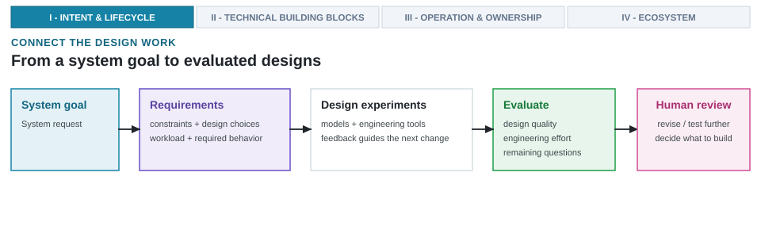

---
format:
  html:
    output-file: index.html
---

# The Architecture Moonshot {#sec-moonshot}

{fig-alt="Compact Lighthouse intent expands into a cross-stack specification, an AI-native design system, checked evidence, and a separate commitment decision."}

::: {.epigraph}
> *"The purpose of computing is insight, not numbers."*
>
> — Richard Hamming, *Numerical Methods for Scientists and Engineers* (1962) [@Hamming1962NumericalMethods]
:::

::: {.column-margin}
**Author's Note.** Richard Hamming, a Turing Award-winning mathematician and computer scientist, argued that computing should yield insight rather than raw data. The distinction is central to this chapter. An AI-native architecture system should help architects ask better questions, explain hardware mechanisms, and defend decisions; it should not merely generate candidate designs faster.
:::

::: {.callout-crux}
What would it take to build an AI-native design system that carries compact
system intent through real system-and-chip design to a supported architecture
result, rather than merely generating artifacts faster?
:::

Computer architecture expands what can be designed by advancing design methods alongside physical devices. Lasting advances do more than accelerate isolated tasks: they introduce higher-level abstractions, repeatable synthesis paths, and verification harnesses that expose flawed results. That history sets our standard for judging AI-native system design.

Learned methods can ingest unstructured specifications, propose candidate architectures, and coordinate tool flows, but generation alone does not guarantee a valid result. An architecture moonshot requires a closed-loop design system that carries compact intent through real toolchains, physical measurements, and verification checks to a defensible result. The added complexity and cost of AI are justified only when the complete design system improves the architectural outcome, reduces total engineering cost, or both.

Testing whether AI capabilities transform architecture practice rather than merely accelerating a local task requires an industrial-grade engineering challenge that spans workloads, software, hardware, and physical signoff under strict real-world constraints.

::: {.callout-learning-objectives}
This chapter establishes the following learning objectives:

- **Define** the Architecture 2.0 moonshot, point AI assistance, and AI-native system and chip design.
- **Decompose** compact system intent into explicit cross-stack architecture requirements.
- **Distinguish** generated artifacts from verifiable architecture results.
- **Evaluate** the architecture result separately from the incremental contribution of the design system.
- **Separate** the technical evaluation result from the commitment decision a named human authority owns.
:::

## Historical Context and Design Transitions

Every major era in computer architecture has advanced by redefining the boundary between human intent and automated tool execution. Rather than merely accelerating manual tasks, lasting design transformations introduce abstractions that expand expressible hardware complexity while establishing repeatable verification contracts. The Mead–Conway Very Large Scale Integration (VLSI) methodology connected structured design rules with automated layout tools and scalable fabrication access [@MeadConway1980VLSI].[^fn-vlsi-complexity-c01] When reduced-instruction-set computing arrived, it reshaped the hardware-software contract around quantitative principles that we could benchmark and test directly [@PattersonDitzel1980RISC].

Later, logic synthesis allowed us to transform register-transfer-level descriptions into gate-level implementations, while Verilator [@Veripool2026Verilator] and formal equivalence tools like Synopsys Formality [@Formality] detected design errors and exposed invalid outputs [@DeMicheli1994SynthesisOptimization]. In each era, an idea became consequential because we could systematically apply, inspect, and improve the methodology built around it.

[^fn-vlsi-complexity-c01]: **VLSI complexity (origin)**: Early-1980s frontier microprocessors held about $10^4$ to $10^5$ transistors, and by 2021 frontier chips held tens of billions [@Rupp2022MicroprocessorTrendData]. Mead and Conway answered that outgrowth of transistor-level practice with higher-level abstractions, design rules, and fabrication access that a course could teach and a community could share.

While each transformation relied on different technical mechanisms, they all expanded expressible design complexity while pairing new abstractions with dependable verification infrastructure.

Every established design methodology pairs an input abstraction with an expanded design object and a dependable verification harness (@fig-design-method-progression).

{#fig-design-method-progression width="100%" fig-alt="Historical progression through Mead-Conway design rules and abstractions, the RISC hardware-software contract, RTL logic synthesis, and reusable hardware generators. Each established method connects an input abstraction to a design object and a dependable check or infrastructure. A separate prospective case shows an AI-native design system connecting system intent and current project state through existing tools and checks to a supported comparison or finding with stated alternatives and limits; the result may reject a candidate or retain the reference design."}

AI-native system design enters this progression as a prospective methodology rather than an established tier. It tests whether compact system intent and live project state can reach a supported architecture result through existing simulators and EDA toolchains. The methodology does not replace established verification infrastructure; it earns trust only when its generated outputs survive those same physical and formal checks.

## Defining Architecture 2.0

Generating candidate code, RTL, or parameter configurations faster does not constitute a new design methodology. Generative models can emit candidates faster than engineering teams can evaluate them,[^fn-foundation-model-c01] widening the scissors gap between candidate generation velocity and physical signoff throughput (@sec-design-loop-no-longer-scales). Producing alternatives faster helps only when the design workflow can qualify what those alternatives mean.

[^fn-foundation-model-c01]: **Foundation model**: A model pretrained on broad data at scale and then adapted to many downstream tasks rather than trained for a single one [@BommasaniEtAl2021FoundationModels]. The term comes from machine learning, and this chapter treats such a model as one optional component inside a design system rather than as the design system itself.

Our initial paper set out the broad Architecture 2.0 vision [@ReddiYazdanbakhsh2025Architecture20]. For the engineering argument in this book, we define Architecture 2.0 as follows:

> **Architecture 2.0.** Architecture 2.0 is the discipline of building AI-native design systems that carry high-level system intent across the hardware-software boundary toward supported architecture results, and of holding those systems to an architecture-grade evidence standard. It shifts the architect's primary role from manually crafting point microarchitectures to formulating multi-objective constraints, directing agentic exploration, and forming technical recommendations that a named commitment authority can review.

Three distinct epochs characterize the evolution of architectural automation and human responsibility (@tbl-architecture-epochs). The periodization tracks how the governing paradigm, automation mechanisms, and human responsibilities evolved across successive design eras.

| **Epoch & Era** | **Fundamental Paradigm** | **AI & Automation Mechanism** | **Primary Human Role** |
| :--- | :--- | :--- | :--- |
| **Architecture 0.0**<br/>*(Transistor Era)* | Physical Construction | Manual schematics, layout design rules, & unassisted CAD scripts | Drafting polygons & wiring circuits |
| **Architecture 1.0**<br/>*(Mead–Conway / H&P Era)* | Structured Abstraction | **Pre-2016:** Logic synthesis & branch perceptrons<br/>**2016–2021 (Deep Learning Era):** Task-specific surrogates & point CAD optimization | Hand-crafting specifications & evaluating point designs |
| **Architecture 2.0**<br/>*(Emerging AI-Native Discipline)* | Closed-Loop Architecture Work | **Current capability:** Foundation models, learned surrogates, and early multi-tool orchestration<br/>**Program target:** Closed-loop design systems that connect intent to checked architecture results | Formulating intent, setting bounds, forming recommendations, & retaining named commitment authority |
: **Each epoch moves work from the architect's hands into the tools, and moves the architect toward bounding the search and owning the commitment.** Automation runs from unassisted CAD scripts through localized learned surrogates toward closed-loop design systems. The final row states an emerging engineering program rather than a completed historical transition. {#tbl-architecture-epochs}

Across these epochs, increasing tool automation shifts the architect from drafting manual artifacts to formulating search boundaries and exercising commitment authority. The final row represents an active engineering program rather than an established historical transition.

That distinction between accelerating a task and restructuring the workflow needs to be exact, because the rest of the book turns on it:

- **Point AI assistance:** Deploying learned models, foundation tools, or generative heuristics to accelerate isolated point tasks within an established engineering workflow, such as drafting an RTL module, tuning a microarchitectural parameter, or predicting a local metric, without altering surrounding manual orchestration, data representations, or physical signoff boundaries.
- **AI-native system and chip design:** Structuring the exploration workflow, machine-usable state representations, cross-layer contracts, rejectable evaluation loops, and verification harnesses around closed-loop search and multi-tool orchestration. The system may span hardware and software, but its result remains bounded by the tools, measurements, and checks that actually ran.
- **Architecture moonshot:** Establishing that a complete AI-native design system can carry compact system intent through real toolchains and physical signoff to a defensible hardware-and-software result. This is the program-level ambition. The book does not assume it has been achieved.

Our discipline has long embraced learned mechanisms, ranging from perceptron branch predictors, later adopted in shipping silicon, to surrogate models used in design-space exploration [@JimenezLin2001Perceptron; @IpekEtAl2006PredictiveDSE]. However, our focus throughout this monograph is not on adding neural components into silicon, but rather on using learned methods to elevate the engineering practice of architecture design itself.

## Defining the Architecture Moonshot

We use the term moonshot to draw an explicit parallel to transformative engineering milestones such as the DARPA Grand Challenge for autonomous vehicles.[^fn-darpa-grand-challenge-c01] That challenge set a bold, public milestone to transform autonomous navigation from isolated laboratory algorithms into integrated systems capable of navigating complex physical environments under real constraints. In computer architecture, an architecture moonshot defines a similarly bold, testable target. It requires building a closed-loop design system that carries compact system intent through multi-objective exploration, real toolchains, and physical signoff to produce defensible hardware-and-software results.

[^fn-darpa-grand-challenge-c01]: **DARPA Grand Challenge (origin)**: The 2004–2007 Defense Advanced Research Projects Agency prize competitions transformed autonomous vehicle engineering from isolated laboratory algorithms into integrated systems capable of navigating complex physical environments under real-world operational constraints; the 2005 Grand Challenge and its winning vehicle are the documented anchor [@BuehlerEtAl2009DARPA; @ThrunEtAl2006Stanley].

::: {.callout-design-principle title="An architecture moonshot must expand expressible and checkable design"}
**The principle:** An architecture moonshot defines a systemic, verifiable advance in translating compact intent into physically realizable hardware-and-software results.

**The rationale:** Adding automation to an unconstrained or unverified design loop generates candidate artifacts faster without expanding what an architecture team can systematically prove or defend. An architecture moonshot succeeds only when it expands the scale of expressible design intent and binds that intent to repeatable, independent physical and software verification infrastructure.
:::

For an architecture moonshot to be credible and testable, three core conditions must converge: a grand architecture challenge, a fundamental shift in design practice, and an enabling advance in AI, data, or tooling (@fig-moonshot-venn).

{#fig-moonshot-venn width="100%" fig-alt="Three-circle Venn diagram showing an architecture moonshot at the intersection of a grand architecture challenge, a substantial change in design practice, and an enabling advance in AI, data, or tools."}

This convergence ensures that learned methods address substantive hardware bottlenecks under physical constraints rather than ungrounded synthetic benchmarks. A rigorous moonshot formulation explicitly names the capabilities upon which the target depends and the falsifying evidence that would challenge baseline assumptions.

## The Architecture Moonshot Brief

Grounding our moonshot in historical precedent requires an industrial challenge that tests cross-stack decision-making rather than isolated code generation. We ground our investigation in a mobile extended reality (XR) system-on-chip (SoC) subsystem, a demanding target that couples a 3\ W-class power envelope and millisecond frame deadlines with heterogeneous compute engines. This case study tests whether learned tools can navigate complex architectural trade-offs across software, microarchitecture, and silicon implementation.

### The Mobile XR Subsystem Case Study

In industrial practice, architecture studies rarely start with formal, machine-executable specifications. Instead, they begin with a compact product request that compresses complex physical and computational expectations into a few sentences. Unpacking this high-level prompt reveals dependencies that span every layer of the hardware-software stack.

::: {.callout-lighthouse title="The Lighthouse prompt"}
Design a low-power, 64-bit RISC-V-based compute subsystem for an XRBench-class
real-time mobile XR workload. Realize it as a vector-capable CPU, accelerator,
or SoC block under a 3\ W TDP target in a 3\ nm-class LP mobile process, and
return a design-space report with evidence and rejected alternatives.
:::

To properly study this workflow, we must explicitly define architecture and architect. For us, architecture is far more than a novel microarchitecture, a high-level block diagram, or a physical chip artifact.

> **Architecture.** Architecture is the hardware and software contract and system organization turning workload intent and technology constraints into a defensible system design. It includes the instruction set architecture (ISA), microarchitecture, memory, interconnects, accelerators, chiplets, compiler and runtime interfaces, and deployment model.

> **Architect.** The architect is responsible for the architecture recommendation within the project's decision structure. The architect frames the problem, chooses abstractions, sets the evidence standard, integrates cross-layer results, and forms the supported technical recommendation. Specialists qualify measurements and checks and own technical signoffs in their domains.

The architect recommends; someone must still decide, and that decision needs its own name. We define 100 percent In-Order Commit Authority (or Commitment Authority) as the strict organizational decision threshold wherein a designated human authority holds exclusive, non-delegable approval rights to advance an architectural recommendation across a consequential transition, ensuring that automated generators never commit silicon capital or modify baseline contracts out of order.

Conceptually, this threshold functions like an in-order instruction commit unit in a microprocessor pipeline. While out-of-order execution units (our generative models and search algorithms) speculate and propose candidate results in parallel, only the named commitment authority can retire decisions into permanent architectural state. The architect supplies the supported technical recommendation. One person may hold both roles, but the organization must assign each responsibility and approval right explicitly. Methods can contribute candidates and analysis without assuming either responsibility.

The Lighthouse prompt serves as a standardized, multi-constraint benchmark request that articulates compact system intent to guide AI-native design-space exploration across realistic hardware, software, and physical boundaries. We have chosen XRBench [@KwonEtAl2023XRBench] because it offers a public suite of mobile XR workloads rather than a rigid, proprietary product specification. Operating at this scale exposes the architectural friction that smaller code-generation tasks obscure.

A complete architecture study decomposes into three operational tiers: the compact product prompt, the eight coupled requirement domains it implies, and the execution and analysis pipeline required to support a technical recommendation (@fig-moonshot-prompt).

{#fig-moonshot-prompt width="100%" fig-alt="Stacked diagram with the full Lighthouse prompt at the top, architecture requirements in the middle, and the execution and analysis requirements needed to support an answer at the bottom."}

Tool feedback continuously refines those requirements across eight tightly coupled layers (@fig-moonshot-prompt):

1. **Workload layer:** Real-time mobile XR workloads drawn from XRBench [@KwonEtAl2023XRBench], complemented by SPEC CPU2017 [@SPEC2017CPU] traces and MLPerf [@MattsonEtAl2020MLPerf] inference kernels.
2. **ISA and ABI contract layer:** A 64-bit RISC-V application processor core (RV64GCV) equipped with a 128-bit RVV 1.0 vector execution pipeline, bound by a standardized Application Binary Interface (ABI).
3. **Compute organization layer:** A heterogeneous combination of a vector-capable CPU core, a dedicated Neural Processing Unit (NPU) systolic matrix engine, and specialized SoC blocks.
4. **Memory and data movement layer:** A multi-level hierarchy comprising 32\ KB L1 caches, a 512\ KB private L2 cache, a 4\ MB shared system-level L3 cache, and Tightly-Coupled Memory (TCM) scratchpads, linked over an AMBA AXI5 interconnect with verified NoC bisection bandwidth and UCIe die-to-die interfaces to LPDDR5X DRAM under strict timing constraints.
5. **Power envelope layer:** A 3\ W sustained Thermal Design Power (TDP) target operating under passive optical frame cooling and skin-temperature ceilings (< 41\ °C).[^fn-xr-glasses-thermal-c01]
6. **Compiler and runtime stack layer:** Software execution paths transformed from ASTs and CDFGs through IR compiler frameworks and domain libraries with vector intrinsics, meeting rigid 8.33\ ms frame deadlines at 120\ FPS [@HuzaifaEtAl2021ILLIXR].
7. **Physical constraints layer:** Implementation targets framed in 3\ nm-class low-power mobile process nodes.
8. **Reliability and verification layer:** Signoff guarantees combining formal property verification for protocol compliance, low-power domain isolation intent, and static timing closure across process corners.

[^fn-xr-glasses-thermal-c01]: **Mobile XR and Smart Glasses Thermal Boundaries**: Wearable spatial computing systems, ranging from ultra-lightweight smart glasses to high-performance spatial headsets such as the current Meta and Apple devices, face hard physical constraints in human skin-temperature safety limits (roughly 41\ °C) and passive frame heat dissipation. In smart glasses and wearable spatial platforms, the total system power envelope must stay under roughly 2\ W to 3\ W TDP to prevent thermal throttling and skin discomfort against human temples. Achieving continuous spatial perception, eye-tracking, and neural rendering within such an envelope requires combining low-power mobile silicon nodes (such as TSMC N3E or N7) with energy-efficient on-chip AXI5 NoC interconnects, 2.5D/3D UCIe die stacking, and LPDDR5X memory interfaces.

Mobile XR is an ideal target because it couples tight latency, thermal, and energy constraints with complex cross-layer behavior. Optimizing a single kernel or hardware block without accounting for the software pipeline, memory hierarchy, or frame deadlines degrades user experience [@HuzaifaEtAl2021ILLIXR]. Early bringup of this software stack and ISA contract relies on functional simulators like Spike and Renode to verify compiler behavior before hardware implementation begins.

Integrating intellectual property into an SoC introduces strict interface requirements. An accelerator must interface with host infrastructure through standard protocols like AMBA AXI [@Arm2020AXI]. A candidate that exhibits superior power, performance, and area (PPA) metrics while violating an AXI handshake contract cannot be integrated into production silicon.

A prompt expresses compact intent. From there, requirements interpret the prompt's obligations and highlight open decisions. A specification locks down behavior, interfaces, workloads, software semantics, constraints, and acceptance criteria to make an implementation testable. A study plan pins down the reference design, alternative options, tools, budgets, and stopping conditions for a specific comparison.

The Lighthouse prompt is not yet a specification. Terms like "XRBench-class," "3\ W," and "3\ nm-class" require concrete versioned workloads, process assumptions, and verification checks. Architects must explicitly resolve these unstated parameters before this request can drive real engineering, deciding which interpretation enters the specification and what constitutes a successful result.

Answering this prompt requires a memory trace gathered from a fixed XRBench configuration, a compiler targeting the proposed organization, a calibrated simulator, a synthesis run mapped to a low-power library, and expert reviewers who verify that the results substantiate the recommendation. Throughout this book, we study that complete human-plus-technical workflow rather than evaluating the fluency of an isolated generated response. Where closed-loop studies lack complete physical signoff or matched baseline evidence, we report the status as unresolved: holding an AI-native design system to an architecture-grade evidence standard requires the discipline to report where evidence stops.

### Decomposing Intent into Executable Specifications {#sec-intent-vs-spec}

Decomposing compact intent into an executable specification requires addressing dependencies across all eight layers of the prompt stack (@fig-moonshot-prompt).

First, the ISA and microarchitecture scope must be bound. Specifying a "64-bit RISC-V compute subsystem" fixes the RV64GCV base ISA, but requires explicit decisions on vector register lengths, matrix extensions, ABI conventions,[^fn-abi-c01] and runtime software contracts. The prompt allows multiple compute organizations, spanning scalar cores, decoupled vector pipelines, and specialized systolic NPU engines.

Second, physical and thermal limits bound the search space. Achieving a 3\ W TDP in a mobile XR form factor requires explicit models for passive frame heat dissipation, skin-temperature ceilings, SRAM-to-DRAM area trade-offs, NoC bisection bandwidth, and off-chip memory access energy. In leading-edge process nodes, logic scaling outpaces SRAM density scaling, turning on-chip buffer sizing into a direct area and leakage trade-off. Because mobile XR subsystems continuously ingest sensitive biometric and spatial sensor streams, Layer 8 (Reliability & Verification) requires declared threat models, physical-memory access controls, and side-channel defenses. While RISC-V Physical Memory Protection (PMP) enforces physical-memory access permissions, it does not close timing or shared-cache side channels [@RISCV2026PrivilegedISA].

[^fn-abi-c01]: **ABI (application binary interface)**: The binary-level agreement on register usage, calling conventions, stack layout, and data alignment that lets separately compiled code interoperate. Adding a custom instruction changes the ISA, but shipping it means the compiler, libraries, and operating system have to agree on the ABI as well, which is why an ISA extension is a software project rather than a hardware edit.

Third, multi-objective design choices require evaluating the Pareto frontier [@Deb2001MultiObjective]. A final study report weaves candidate artifacts, Pareto-optimal sets, and physical measurements into a coherent rationale, explaining why alternatives were rejected. A product request does not supply a 3\ W budget or specify an L2 cache capacity; architects derive those constraints by coupling analytical models, profiling data, and physical limits.

Point AI assistance can accelerate this formulation by extracting candidate constraints from requirement documents, checking consistency against past designs, and surfacing ambiguities (such as clarifying whether "real-time" means an 8.33\ ms frame deadline at 120\ Hz or a 99th-percentile tail-latency bound). However, point assistance does not replace architectural judgment. Architects must validate the proposed bounds and express accepted constraints in machine-readable formats that downstream tools can ingest.

Process node declarations also require precision. While the prompt specifies a "3\ nm-class" process, physical signoff requires a specific foundry Process Design Kit (PDK),[^fn-pdk-c01] cell libraries, operating voltages, and signoff corners [@Apple2024A18Pro; @Apple2024M4]. Early screening may use calibrated analytical models, but physical feasibility claims require full EDA toolchain execution.

[^fn-pdk-c01]: **PDK (process design kit)**: The package for one manufacturing process that supplies device models, design rules, and related data used by implementation tools. The open SKY130 PDK demonstrates that a PDK can be published [@SkyWater2020SKY130PDK], but it cannot supply the authorized project-specific information for a different process or commercial tool flow.

Finally, the software stack often acts as the limiting dependency. A novel spatial accelerator is dead silicon if the compiler runtime cannot map target kernels to it. Meeting workload and physical constraints requires a design system that keeps project knowledge, tools, and review loops tightly coupled across all eight prompt layers.

## AI Models vs. AI-Native Design Systems

Navigating these cross-layer dependencies requires separating the tools we train from the design systems we operate. A foundation model or learned surrogate is a stateless tool component that proposes candidates or accelerates estimation; it holds no live project memory, cannot verify physical constraints, and cannot issue architectural commitments. In contrast, an AI-native design system represents the complete technical capability, coupling learned components with version-controlled project state, deterministic simulators, EDA toolchains, and formal verification engines under human commitment authority (@sec-loop-patterns-across-stack, @sec-evaluating-agentic-architect).

We distinguish three core concepts:

1. **Architecture foundation models:** Pretrained learned components [@BommasaniEtAl2021FoundationModels] that supply reusable prior knowledge across multiple tasks (e.g., workload classification or heuristic search guidance) without live project state or commitment authority.
2. **AI-native design systems:** The configured technical ensemble of learned models, conventional simulators, versioned artifacts, tool interfaces, feedback loops, and automated verification checks.
3. **Version-controlled project state:** The immutable source of record, maintaining machine-readable specifications, SystemVerilog RTL, C++ behavioral models, and physical layout scripts.

An AI-native design system couples a reusable knowledge substrate with deterministic project state and independent human authority (@fig-foundation-system).

![**Foundation models function as optional components within the broader design system.** Reusable architecture knowledge can support a learned component adapted to workload analysis, prediction, generation, or diagnosis. The current project record, conventional methods, compilers, simulators, EDA and formal tools, and our independent checks remain part of the larger system. We supply our intent and constraints, review the supported result, and form a supported technical recommendation. A separate commitment authority decides whether our project advances, holds, or rejects that recommendation.](images/fig-foundation-system){#fig-foundation-system width="100%" fig-alt="Reusable architecture knowledge feeds an optional architecture foundation model inside an AI-native design system. A separate version-controlled project record informs the active architecture tasks and conventional methods. Task outputs reach design tools and checks, which return evidence and update project state. A supported architecture result leaves the technical system for review by the architecture role, which forms a supported technical recommendation for a separate commitment authority."}

In the Lighthouse study, learned models propose candidate organizations, generate draft RTL, or triage simulation diagnostics. However, the authoritative project record supplies the exact workload trace, power envelope, candidate identifiers, and pinned tool versions. These immutable inputs govern what simulators, implementation tools, and signoff flows actually evaluate; no pretrained model can substitute for them.

## Evaluation Framework for Artifacts, Results, and Trade-Offs

Once an AI-native design system couples project state with downstream tools, transforming candidate proposals into verifiable architectural evidence requires a structured evaluation framework. Because generative models can produce candidate code far faster than conventional tools can simulate or physically implement them, architects must balance proxy estimation against high-fidelity verification through rejectable decision loops.

### Qualifying Artifacts into Verifiable Results

Architectural progress moves through a deliberate hierarchy: expanding high-level intent into specifications, candidate artifacts, empirical measurements, and verified comparative results, which in turn support technical recommendations and commitment decisions.

These concepts remain distinct:

- **Artifact:** Any concrete output produced during the study (code, RTL, a model, a layout, a report, or a testbench).
- **Candidate:** A proposed design or configuration evaluated within the study.
- **Measurement (or observation):** Empirical data gathered from evaluating a candidate under declared conditions.
- **Architecture result:** A supported comparison or finding where assumptions, conditions, checks, alternatives, and limits are clear enough to inform the next design action.

A valid architecture result does not require a positive breakthrough: it can reject every candidate, support retaining the reference design, narrow the scope of inquiry, or conclude that available measurements cannot decide the question.

The gap between a draft artifact and a verified result is particularly wide in hardware. A generator might produce an instruction extension that passes behavioral simulation, only to violate logic equivalence, design rules, timing, power, or thermal constraints during physical implementation. Surrogate models [@ForresterSobesterKeane2008Surrogate] enable rapid screening across thousands of floorplans or tile schedules, but surviving designs must still clear physical EDA signoff tools before committing capital to silicon fabrication (@sec-architecture-environments-tool-interfaces, @sec-feedback-verification-trust).

Analytical bounds provide cheap, early rejection filters before invoking expensive simulation. Amdahl's Law caps whole-system speedup based on the accelerated workload fraction [@Amdahl1967ValiditySingleProcessor]. The Roofline model relates candidate operational intensity to peak compute and memory bandwidth [@Williams2009Roofline]. Candidates that violate these early bounds need not enter the simulation queue, though surviving designs must still be verified through simulation and physical signoff.

A proxy model can invert candidate rankings relative to cycle-level simulation, while physical EDA tools expose complex timing paths and routing congestion rather than scalar scores [@BaiEtAl2021BOOMExplorer; @Cadence2026Joules; @Synopsys2026PrimePower]. When iterative search optimizes against a fast proxy, it risks exploiting the proxy's omissions or modeling inaccuracies, producing apparent gains that evaporate under full physical evaluation.[^fn-overfitting-c01]

[^fn-overfitting-c01]: **Overfitting**: The machine-learning failure of fitting the noise of a training sample so closely that performance does not generalize to new data [@HastieTibshiraniFriedman2009Elements]. Proxy exploitation is analogous but not identical; it can occur when search uses omissions or errors in an evaluator even without fitting a statistical model.

A valid architecture result must explicitly identify the candidate, workload, measurement, check, and bounding conditions under which it holds. Never treat a syntactically valid script or a successful local tool return as evidence that an architecture should change.

### Multi-Metric Trade-Offs and Rejectable Evaluation Loops {#sec-efficiency-claims-need-rejectable-loops}

Supporting an architectural claim for the mobile XR subsystem requires balancing competing physical and computational constraints rather than optimizing a single scalar metric. A valid efficiency claim must capture complete system costs within a defined total-cost boundary. Local improvements in compute throughput remain meaningless if they shift costs to memory bandwidth, violate thermal envelopes, or impose verification burdens that exceed the project budget.

The total-cost boundary incorporates direct and indirect expenditures (including compute throughput, memory bandwidth, thermal dissipation, EDA tool licenses, verification cycles, and human review overhead) required to achieve useful system work [@BarrosoHolzleRanganathan2019DatacenterAsComputer; @HennessyPatterson2017QuantitativeApproach].

Data movement illustrates this boundary. In 45\ nm data, a 32-bit integer add costs approximately 0.1\ pJ, while DRAM accesses cost orders of magnitude more [@Horowitz2014Energy]. In a 3\ nm-class mobile XR SoC, off-chip LPDDR5X DRAM accesses across the AMBA AXI5 interconnect heavily pressure the 3\ W TDP envelope. Evaluating an accelerator that increases memory traffic requires a full system energy comparison rather than an isolated compute efficiency metric.

We structure multi-metric evaluation across five physical system dimensions and the meta-cost of the engineering study (@tbl-efficiency-dimensions).

| **Dimension** | **Question** | **Why it complicates the comparison** |
| --- | --- | --- |
| **Performance** | How much useful work is delivered per unit time, latency budget, or service-level target? | The answer depends on workload selection, scenario, software stack, and whether the measured behavior matches the deployment claim. |
| **Power and energy** | How much useful work is delivered per watt, joule, thermal budget, or battery envelope? | A credible comparison must account for activity, data movement, voltage/frequency choices, thermal constraints, and fidelity gaps between estimates and signoff. |
| **Reliability and correctness** | Which required behaviors hold across faults, corner cases, nondeterminism, and the declared operating conditions? | A faster candidate is not acceptable if it spends its savings on fragility, security side-channels, debug burden, or invalid software and hardware assumptions. |
| **Scalability and cost** | How much useful work is delivered per dollar, rack, network hop, operator action, or unit of capacity? | Local wins can shift cost to memory, network, power delivery, utilization, operations, or total cost of ownership. |
| **Sustainability** | How much useful work is delivered per unit of operational and embodied environmental footprint? | Carbon depends on hardware lifetime, manufacturing, energy mix, utilization, and where and when computation runs. |
| **Study cost: evidence and engineering effort** | How much decision-relevant evidence is obtained per simulation, experiment, verification run, or engineer-hour? | Generating more candidates can still be inefficient if evaluation consumes scarce feedback, hides failures, or cannot reject weak outputs. |
: **A system result and the work needed to establish it require different measures.** Five dimensions describe the proposed system, while evidence and engineering effort describe the study. A valid comparison must show when an apparent improvement shifts cost or changes the scope. {#tbl-efficiency-dimensions}

In the mobile XR setting anchored by XRBench and ILLIXR [@HuzaifaEtAl2021ILLIXR], frame latency, energy, sustained power, and data movement are tightly coupled. Measured RTL generation benchmarks exhibit severe functional pass-rate attrition [@VerilogEval; @PinckneyEtAl2024RevisitingVerilogEval], underscoring the necessity of independent verification harnesses. The practical test is whether the complete design system, including its verification overhead, improves the architectural result or lowers total engineering cost relative to competent conventional baselines.

```{=latex}
\Needspace{11\baselineskip}
```

## State of the Art and Benchmark Assessment

Benchmarking the state of the art in AI-assisted design automation reveals a sharp divergence between rapid candidate proposal generation and slow physical verification. Mapping existing tools highlights where learned methods accelerate local exploration and where verification bottlenecks persist.

### Survey of AI-Assisted Design Systems

Existing AI-assisted design tools demonstrate strong point capabilities within specific evaluation regimes rather than a unified, end-to-end autonomous flow. Recent efforts span exact mathematical search, hardware autotuning, learned physical macro placement, proxy-guided design space exploration, and automated RTL generation. As mapped in the taxonomy in @sec-appendix-b-ai-for-architecture-map, each system establishes progress within a specific evaluation domain, yet every result remains bounded by the fidelity and scope of its underlying verification checks.

These efforts represent point AI assistance: they accelerate isolated steps in search, placement, or code generation while leaving surrounding workflows unchanged. Among the systems surveyed in that taxonomy as of this edition, no single framework carries high-level system intent through multi-tool execution, physical signoff, and formal verification to a supported architectural result without human intervention. The Architecture 2.0 moonshot connects these point capabilities through explicit machine-usable state representations, rejectable evaluation loops, and physical checks under human commitment authority.

Software engineering evaluation frameworks such as SWE-bench [@JimenezEtAl2024SWEBench] execute test suites rapidly, yielding immediate pass-fail feedback for candidate fixes. Hardware design evaluation operates under a vastly different velocity regime. While early analytical screens run quickly, full hardware signoff requires expensive physical synthesis, formal equivalence verification, static timing analysis, and thermal modeling. Fast proxies prune infeasible designs, but only physical and formal checks can validate a candidate before hardware commitment.

Our discipline possesses shared benchmarks and simulation infrastructure at individual layers: SPEC CPU2017 [@SPEC2017CPU] standardizes CPU performance evaluations, gem5 [@BinkertEtAl2011Gem5] and FireSim [@KarandikarEtAl2018FireSim] provide cycle-accurate and FPGA-accelerated simulation, and MLPerf [@MattsonEtAl2020MLPerf] standardizes machine-learning evaluation. These resources ensure outside researchers can rerun and challenge scoped results, but they do not connect all the cross-stack evidence required for the Lighthouse. Current systems establish bounded point progress rather than an end-to-end automated flow.

### Data Scarcity, Verification Load, and Generators vs. Verifiers {#sec-data-scarcity-verification-load}

AI-assisted hardware design starts from a much narrower information base than software development. Open-source software corpora contain hundreds of billions of tokens, while hardware collections count synthesizable modules, executed layouts, or validated architecture questions [@LozhkovEtAl2024TheStackV2; @WangEtAl2025OpenRTLSet; @PrakashEtAl2025QuArch; @ChaiEtAl2022CircuitNet]. These units are not directly comparable, but they demonstrate why an AI-native design system requires task-specific curation and machine-checkable evidence rather than assuming broad software pretraining covers architecture work (@sec-data-representations-world-models).

Hardware design is also heavily guarded by proprietary process kits and confidential IP blocks [@LiuEtAl2023ChipNeMo]. Relying solely on models trained on public corpora produces plausible-looking RTL that misses project-specific interfaces, PDKs, and signoff constraints. Furthermore, training data provenance directly affects legal compliance: generating RTL from unverified training corpora risks inbound IP contamination, while transmitting proprietary specifications to third-party model endpoints risks outbound disclosure. Managing source permissions, output provenance, confidentiality, and external review access are non-negotiable data governance requirements.

Architects address these information gaps by supplying explicit specifications, encoding machine-checkable constraints, and integrating tool feedback into iterative repair loops [@TsaiEtAl2024RTLFixer; @chipyard; @AjayiEtAl2019OpenROAD]. In large-scale verification, teams combine C++ behavioral co-simulation with FPGA-accelerated emulation, static timing analysis, formal equivalence checking, and Bounded Model Checking.

Better project information improves what a generator proposes without settling whether the proposal is correct. A first-pass RTL candidate can look plausible while hiding subtle, fatal errors; the distance between a generated artifact and a supported result is measured in checks rather than lines of code.

Published generation benchmarks report severe attrition at parsing, interface compliance, and functional simulation stages [@VerilogEval; @RTLLM; @WangEtAl2025OpenRTLSet], compounding through timing closure and layout checks into a narrow survival funnel (@sec-feedback-verification-trust).

Candidate proposal latency and verification check time diverge by orders of magnitude as design scope expands (@fig-verification-scaling). While proposal generation stays under one minute across abstraction levels, downstream verification scales from milliseconds for tensor operators to days or weeks for full SoC signoff and formal equivalence checking.

```{python}
#| label: fig-verification-scaling
#| fig-cap: |
#|   **Proposing a candidate and checking one do not scale together.** Constructed order-of-magnitude
#|   ranges, not measurements; no per-candidate latency study is reported here. What transfers is the
#|   divergence. Proposal cost stays roughly flat as design scope grows, while the checks that could
#|   reject a candidate grow with it, so the two curves separate by orders of magnitude at full SoC
#|   signoff. A project's own tool flow sets where the separation lands.
#| out-width: "100%"
#| fig-alt: "Horizontal bar chart comparing AI candidate proposal latency against hardware verification check time across five design scales from tensor operators to full SoC signoff. Verification check time scales from milliseconds to days/weeks, while AI candidate generation remains under one minute."

import matplotlib.pyplot as plt
from _python.plots import COLORS, apply_style
import numpy as np

apply_style()

categories = [
    "Tensor Operator\n(AutoTVM / MAESTRO)",
    "Core Microarch\n(gem5 / Spike)",
    "RTL Block Signoff\n(Verilator / Yosys)",
    "Subsystem Macro\n(OpenROAD 7nm)",
    "Full SoC Signoff\n(Cadence / Formality)",
]
y_pos = np.arange(len(categories))
eval_latency_min = np.array([0.001, 10.0, 300.0, 3600.0, 86400.0])
eval_latency_max = np.array([0.1, 300.0, 3600.0, 28800.0, 604800.0])
gen_latency = np.array([0.5, 2.0, 5.0, 15.0, 45.0])

fig, ax = plt.subplots(figsize=(6.2, 3.4))
fig.subplots_adjust(left=0.28, right=0.94, top=0.88, bottom=0.18)

for i in range(len(categories)):
    ax.barh(
        y_pos[i] + 0.15,
        eval_latency_max[i] - eval_latency_min[i],
        left=eval_latency_min[i],
        height=0.35,
        color=COLORS["constraints"],
        alpha=0.85,
        edgecolor=COLORS["constraints_ink"],
        linewidth=0.8,
        label="Hardware verification check time" if i == 0 else "",
        zorder=2,
    )

ax.scatter(
    gen_latency,
    y_pos - 0.15,
    color=COLORS["workload"],
    s=48,
    zorder=4,
    edgecolor="white",
    linewidth=0.8,
    label="AI candidate proposal latency",
)

ax.set_xscale("log")
ax.set_yticks(y_pos)
ax.set_yticklabels(categories, fontsize=6.2, color=COLORS["ink"])
ax.invert_yaxis()

ax.set_xlabel("Time per candidate (seconds, log scale)", fontsize=6.5, color=COLORS["ink"])
ax.set_xlim(1e-4, 1e6)

xticks = [1e-3, 1e-1, 10, 3600, 86400, 604800]
xtick_labels = [r"1\ ms", r"100\ ms", r"10\ s", "1 hour", "1 day", "1 week"]
ax.set_xticks(xticks)
ax.set_xticklabels(xtick_labels, fontsize=5.8)


leg = ax.legend(frameon=True, facecolor=COLORS["note_fill"], edgecolor=COLORS["note_edge"], fontsize=5.8, loc="upper right", framealpha=1.0)
leg.set_zorder(10)
ax.grid(True, which="both", axis="x", color=COLORS["grid"], linewidth=0.45, zorder=0)

ax.annotate(
    "4-order-of-magnitude\nverification gap",
    xy=(1e4, 3.85),
    xytext=(5e-3, 1.8),
    arrowprops=dict(arrowstyle="->", color=COLORS["constraints_ink"], lw=0.9),
    fontsize=6.0,
    fontweight="bold",
    color=COLORS["constraints_ink"],
    bbox=dict(boxstyle="round,pad=0.4", facecolor=COLORS["note_fill"], edgecolor=COLORS["constraints"], lw=0.8),
    zorder=12,
)

for spine in ["top", "right"]:
    ax.spines[spine].set_visible(False)
ax.spines["left"].set_color(COLORS["ink"])
ax.spines["bottom"].set_color(COLORS["ink"])
plt.show()
plt.close(fig)
```

Hardware security verification extends far beyond functional correctness. As Spectre demonstrated, microarchitectures that are functionally compliant can still leak sensitive information through side channels [@KocherEtAl2019Spectre]. Generating hardware with learned models necessitates independent checks tailored to the design's threat model, verifying domain isolation, analyzing timing channels, and detecting malicious modifications.

## From Architecture 1.0 to Architecture 2.0 {#sec-from-architecture-10-to-architecture-20}

The operational transition from Architecture 1.0 to Architecture 2.0 broadens the scope of automation without relinquishing human decision authority [@ReddiYazdanbakhsh2025Architecture20]. Architecture 1.0 relies on analytical models, scripted parameter sweeps, and manual microarchitectural tuning. Architecture 2.0 incorporates learned generation, surrogate prediction, and agentic search across the hardware-software boundary. This transition shifts the architect's primary role from crafting individual point designs to formulating system constraints, orchestrating automated tools, and forming supported technical recommendations for the named commitment authority.

Five core responsibilities contrast established Architecture 1.0 practice with AI-native Architecture 2.0 methodology (@tbl-arch1-vs-arch2).

| **Feature** | **Established architecture practice (Architecture 1.0)** | **AI-native architecture practice (Architecture 2.0)** |
| --- | --- | --- |
| Problem framing | Architects define the question, abstractions, constraints, and tool tasks | Learned methods may help interpret broader intent or incomplete information and propose choices for architect review |
| Exploration | Architects use analytical models, scripts, parameterized generators, sweeps, and conventional optimization | Prediction, generation, and learned optimization may propose, screen, or select alternatives alongside established methods |
| Tool use | Architects and scripts invoke simulators and design tools, preserve results, and decide what to run next | Automated components may select later actions from tool returns, so state, cost, failures, and permitted actions must be usable by the component and inspectable by the reviewer |
| Result standard | Measurements and checks turn candidate artifacts into comparisons that can support the next architecture action | The same standard applies; broader automated participation does not make an unchecked artifact an architecture result |
| Recommendation and commitment | Architects integrate results and form the technical recommendation; a named commitment authority decides whether the architecture advances to the next consequential transition | Methods may organize analysis or prepare a draft recommendation, while the architect and commitment authority retain their respective responsibilities |
: **AI participation broadens what may be delegated without changing the authority structure.** Architecture 2.0 adds learned prediction, generation, optimization, retrieval, or tool coordination to established analytical and automated practice, while the architect and commitment authority retain their respective decision-making roles. {#tbl-arch1-vs-arch2}

Integrating automated agents into the design loop requires structuring machine-usable project state and action spaces while preserving explicit human review boundaries (@fig-design-loop-breaks).

![**Automated participation introduces explicit machine-use representation requirements.** Our established architecture work can retain explicit evidence while our project knowledge remains distributed across specifications, source code, tool databases, verification artifacts, and expert practice. When we add automated components, we must also represent selected state and permitted actions for machine use while keeping them inspectable by our reviewers. Both panels retain a review point and a feedback path; neither assigns organizational commitment to that review step.](images/fig-design-loop-breaks){#fig-design-loop-breaks width="100%" fig-alt="Two side-by-side diagrams compare established human-orchestrated studies and studies run inside an AI-native design system. The left distributes project knowledge across engineering artifacts, records, and expert practice. The right also represents selected state and permitted actions for automated methods. Both panels retain explicit evidence, expert or architect review, and a feedback path without assigning organizational commitment to the review step."}

The critical structural delta in @fig-design-loop-breaks is the formal representation of project state and permitted action spaces for machine consumption. This machine-usable interface allows automated agents to query and mutate design state without bypassing the immutable audit trail inspected by human reviewers.

Candidate generation must remain decoupled from verification to expose failure modes: a check that merely inherits its generator's assumptions cannot validate an architectural result [@KnightLeveson1986Multiversion]. The design system coordinates prediction, generation, and optimization against explicit stopping conditions and cost budgets, keeping every action anchored to the initial architecture question.

## Putting the Moonshot into Practice

Evaluating the Architecture 2.0 moonshot requires two independent tests. The first asks whether the technical work improved; the second asks whether the organization should commit capital. Passing the first does not settle the second.

Our first test evaluates whether the complete AI-native design system improved the architectural work against a credible conventional alternative run under matched budgets, tool access, and stopping conditions. A generated candidate demonstrates progress only when it improves the architecture result, reduces total engineering cost, or achieves both within its assessed envelope. The outcome can be positive (the candidate is superior), conservative (the reference baseline stands), or null (no candidate satisfies constraints). All three are valid architecture results.

Our second test evaluates whether a named commitment authority within an accountable organization should commit to the design. This decision incorporates residual risk, physical limits, and business trade-offs that no automated tool can resolve. The architect's technical recommendation informs this judgment without replacing it.

A broader program evaluation aggregates repeated studies across diverse design tasks and workloads. To claim program-level success, the AI-native design system must consistently improve architecture results or lower total costs across the declared scope. Based on public evidence in this edition, that program-level verdict remains open.

## Common Pitfalls

The following framing errors occur before a design loop executes, during the initial formulation of questions, metrics, and evidence standards:

- **Dismissal without measurement:** Rejecting an assisted approach after a single flawed output, or adopting one after an isolated demonstration, without benchmarking against a credible conventional baseline at a matched budget. Both reactions substitute disposition for empirical evidence.
- **Confusing draft artifacts with checked architectural decisions:** Treating syntactically valid RTL, compiler patches, or candidate configurations as completed design decisions. An unverified candidate remains an uncommitted hypothesis until physical checks run and a human commitment authority signs off.[^fn-hamming-insight-c01]
- **Scoping intent to a subsystem:** Framing the architecture question around a local compute block while omitting global interconnects, memory bandwidth, power delivery, and interface protocols like AMBA AXI. Omitting system-level constraints produces candidates that fail integration.
- **Adopting the proxy as the objective:** Optimizing directly against a fast proxy or surrogate model rather than treating it as a rejectable screen. Search algorithms exploit proxy blind spots, producing apparent gains that collapse during physical synthesis and formal verification.[^fn-goodhart-proxy-c01]
- **Defining progress as output volume rather than supported decisions:** Measuring success by candidate generation velocity rather than the number of defensible, verified decisions reached. Accelerating raw output without accelerating verification moves the bottleneck downstream without improving throughput.[^fn-amdahls-law-velocity-c01]

[^fn-hamming-insight-c01]: **Purpose of computing**: @Hamming1962NumericalMethods famously established that "the purpose of computing is insight, not numbers." In AI-native hardware engineering, emitting syntactically plausible RTL or compiler patches merely produces candidate data; an architectural decision requires verified physical and workload insight established under human commitment authority.

[^fn-goodhart-proxy-c01]: **Goodhart's Law in EDA surrogates**: @Strathern1997Goodhart distilled Goodhart's observation into its familiar form, that when a measure becomes a target, it ceases to be a good measure [@Goodhart1975MonetaryManagement]. Automated optimization loops that target fast surrogate metrics exploit omissions in high-level cost models, causing proxy-optimized ranks to decouple completely from physical timing and power signoff.

[^fn-amdahls-law-velocity-c01]: **Amdahl's Law of design pipelines**: @Amdahl1967ValiditySingleProcessor established that overall speedup is strictly bounded by the un-accelerated sequential fraction of a workload. In AI-native design, accelerating draft proposal generation by $100\times$ yields minimal total throughput improvement if downstream formal verification, timing closure, and human signoff remain un-accelerated bottlenecks.

## Open Questions

These foundational questions define active research frontiers in AI-native architecture:

**Carrying compact intent across the system stack.** A high-level product request leaves workload behaviors, interface contracts, and physical constraints unstated. Translating that compact prompt into an executable specification requires explicit decisions about which obligations the design system assumes and which require human approval.

- **What representation must exist before a compact request becomes a checkable architecture specification?** Expanding intent requires committing to assumptions about traffic, interfaces, and physical envelopes that the prompt never made, and those assumptions determine which candidates are reachable. A system must maintain clear accounting of which commitments were specified by the requester, which were inferred by automated tools, and which remain unresolved.
- **Where should human commitment authority sit within an automated design loop to remain meaningful?** A named authority can only evaluate proposals that are legible and supported by checkable evidence. When automated search generates thousands of candidate configurations, traditional review points risk becoming ceremonial stamp approvals. Real accountability depends on the exact state representations, evidence thresholds, and decision boundaries exposed to the human authority.

**Detecting when historical design knowledge expires.** Learned surrogates and prior design patterns embed implicit physical and microarchitectural assumptions from past process nodes and toolchains. Without diagnostic checks, design loops absorb stale heuristics that produce sub-optimal or un-synthesizable candidates without triggering explicit tool errors.

- **Which diagnostic mechanisms can expose when learned architectural knowledge has decoupled from physical reality?** Pretrained models and learned surrogates embed physical assumptions from past process nodes and EDA toolchains that quietly expire when applied to new technologies. Identifying this silent staleness remains open and is necessary to prevent accumulated historical debt from corrupting new designs.

**Pricing the entire design loop instead of the fast step.** Candidate generation is the cheapest part of an automated workflow, while downstream physical synthesis and formal verification remain expensive bottlenecks. Automated search algorithms exploit the blind spots of fast proxy evaluators, driving up total evaluation costs unless the loop can surface its own uncertainty.

- **Under what conditions does an AI-native workflow deliver a net reduction in total engineering cost?** Accelerating candidate proposal generation is beneficial only if the downstream verification workload does not expand to consume the saved time. Data preparation, failed tool runs, simulation cycles, and human review all draw on the same engineering budget.
- **How can an evaluation loop detect and penalize proxy exploitation before candidates reach physical signoff?** Automated search algorithms exploit the omissions and blind spots of fast proxy evaluators, producing high proxy scores for candidates that ultimately fail gate-level synthesis or timing closure. Building self-calibrating proxies that estimate their own uncertainty and escalate unpromising candidates early is unsolved across all method families in this book.

## Summary

This opening chapter established the Architecture 2.0 moonshot around the industrial Lighthouse case study. A compact prompt is not a specification: it conceals eight coupled layers spanning workloads, ABI contracts, compute organizations, memory hierarchies, power envelopes, compilers, physical constraints, and signoff checks. Before treating a request as an executable target, architects must define these underlying obligations, legal alternatives, physical limits, and acceptance checks.

Point AI assistance accelerates isolated tasks within established workflows, while a complete AI-native design system restructures exploration and verification loops around closed-loop search and multi-tool orchestration. The moonshot represents the program-level ambition that such a system can carry compact intent through to physically realizable silicon, an outcome this edition treats as an open question.

::: {.callout-takeaways title="From Compact Intent to a Supported Result"}
- **Explicit specification over compact intent.** A high-level prompt must expand into explicit workload traces, ABI contracts, memory hierarchies, physical constraints, and verification checks before any candidate can drive executable engineering.
- **Artifact qualification standard.** Syntactically valid code or successful local tool runs are merely candidate artifacts until qualified by rigorous measurements and checks under declared operating conditions.
- **Architecture result and design-system contribution measured apart.** Architecture 2.0 requires evaluating the architectural design quality against reference baselines separately from measuring the net productivity and engineering cost reductions of the AI-native design system itself.
- **Non-delegable commitment authority.** Automated generators and learned surrogates propose candidate designs, while a named human commitment authority retains non-delegable approval rights over silicon capital commitments and baseline specification updates.
:::

The Architecture 2.0 moonshot matters because modern computer architecture has hit structural complexity limits. The compounding physical, software, and evaluation pressures behind those limits, and why they now exceed what conventional design practice can absorb, are where we turn next (@sec-design-loop-no-longer-scales).
