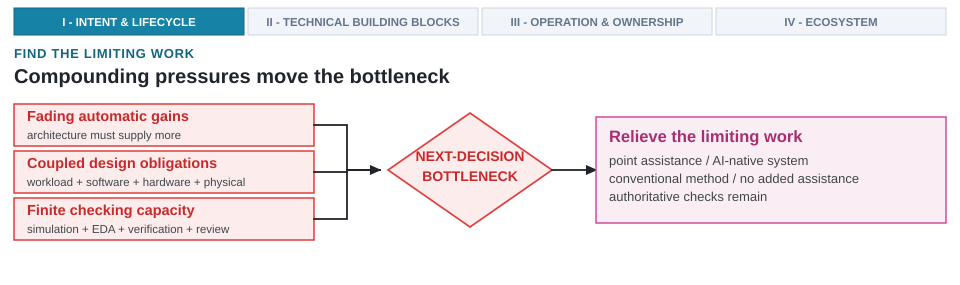

---
format:
  html:
    output-file: index.html
---

# Compounding Pressures and Scaling Limits {#sec-design-loop-no-longer-scales}

{fig-alt="Fading technology gains, coupled design obligations, and finite checking capacity converge on the work limiting the next supported decision."}

::: {.epigraph}
> "[F]eedback is a method of controlling a system by reinserting into it the results of its past performance. If these results are merely used as numerical data for the criticism of the system and its regulation, we have the simple feedback of the control engineers."
>
> — Norbert Wiener, *The Human Use of Human Beings* (1950) [@Wiener1950HumanUse, p. 71]
:::

::: {.column-margin}
**Author's Note.** Norbert Wiener, the mathematician who founded cybernetics, made feedback the defining property of control. He separated feedback that merely regulates a system from feedback that changes how the system acts. Computer architecture turns on this exact distinction; this chapter traces how compounding design pressures push simple regulatory feedback past its limit, forcing a shift toward adaptive control.
:::

::: {.callout-crux}
Why does modern architecture work demand new forms of assistance, and where can that assistance help without weakening architectural comparisons?

:::

Architecture work is growing more demanding because architects must hold more of the system in view at once. Microarchitecture, power delivery, packaging, and software interact so tightly that a single cache-sizing decision ripples across software latency, memory traffic, die area, and package thermals. Because process scaling no longer delivers automatic frequency and efficiency gains, architects must extract performance through specialization, software co-adaptation, and system composition.

These choices compound across the design loop. A specialized hardware block alters the software path required to drive it, shifts data movement, introduces unverified interfaces, and exposes physical bottlenecks that can overturn early architectural rankings. Historically, computer architecture absorbed surges in complexity by establishing explicit interfaces, shared abstractions, and formal verification contracts. AI can expand design capacity only if applied to the specific tasks that limit progress; generating candidate designs provides little value if simulation, verification, and expert review cannot keep pace.

::: {.callout-learning-objectives}
This chapter establishes the following learning objectives:

- **Relate** the abstractions, interfaces, and checks that absorbed earlier complexity to the standard any new design assistance must meet.
- **Trace** how microarchitecture, specialization, software, and physical constraints interact in complex architecture comparisons.
- **Explain** how the fading technology dividend shifts responsibility to architecture, software, and system composition.
- **Distinguish** the size of a design space from the evaluation and verification capacity required to search it.
- **Diagnose** which work limits the next architectural decision, then target point assistance (Layer 1), subsystem optimization (Layer 2), or an AI-native design system (Layer 3) there without displacing authoritative checks.
:::

## How Architecture Absorbed Rising Complexity

Computer architecture has historically absorbed rising complexity by elevating the level of abstraction used to describe designs, and by making interfaces, rules, tool paths, and comparisons explicit. Constraints do not vanish in this process. Instead, engineering teams and tools manipulate larger design objects, while relying on lower-level checks to catch and reject choices that fail during implementation. This established history sets the baseline standard for any new form of design assistance.

Architectural work has always progressed through cycles of analysis and revision. A typical study begins with a clear aim, such as improving latency, reducing energy, raising throughput, supporting a specific workload, or fitting a system neatly within a power and cost envelope. From there, architects choose an abstraction, build or select a model, run analyses or simulations, and evaluate the results. The team iteratively revises the design until surviving concepts reach implementation, validation, verification, and signoff. Both standard textbooks and daily industrial practice follow this pattern. However, as domain specialization tightly couples software mapping down to physical placement, manual loops strain under the volume of interacting constraints. The bottleneck today is not generating candidate ideas; it is keeping representations, tool environments, and feedback synchronized during candidate evaluation.

> **The Architectural Design Loop.** The *architectural design loop* is the continuous, iterative cycle through which architects formulate intent, generate candidate designs, evaluate candidates using multi-fidelity simulators and electronic design automation (EDA) tools, interpret empirical feedback, and refine hardware-software choices toward a supported decision. The cycle closes into a loop only when returned evidence changes the represented design state and triggers another allowed action. A sequence that runs these activities once, or that returns evidence which changes nothing, is a *design path* rather than a *design loop*.


Consider a traditional CPU evaluation using SPEC CPU 2017 to measure processor, memory-system, and compiler performance [@SPEC2017CPU]. Architects execute timing simulators (such as gem5 [@BinkertEtAl2011Gem5] or Sniper) and compiled register-transfer level (RTL) models (such as Verilator) to inspect instructions per cycle (IPC), miss rates, branch-misprediction rates, and initial area and power estimates. When candidates improve one workload while degrading others, architects must decide whether to revise or discard them. Human judgment governs this comparison at every stage, from workload and proxy selection to candidate promotion.

What matters in such a study is how the comparison is bounded. Defining workloads, run rules, and reporting conventions allows architects to compare different candidates fairly under clearly stated conditions.

However, what makes an architectural comparison sound is not entirely written down. Engineering teams carry much of this context implicitly, including excluded workloads, trusted tool configurations, failure post-mortems, and the specific decision under review. As design programs scale, synchronizing this operational context across larger teams and complex toolchains becomes increasingly difficult.

Whenever informal coordination stops being sufficient, engineering teams turn implicit knowledge into inspectable artifacts. Historically, architects stabilized interfaces, shared design rules and benchmarks, exposed tool paths, and explicitly recorded the criteria for rejecting a candidate. Six foundational shifts made key parts of architectural design work explicit in this way, each turning informal engineering agreements into explicit contracts (ISAs, layout rules, benchmarks, synthesis constraints) that let downstream tools reject invalid choices upstream (@tbl-historical-loop-transformations). Exposing these details to the engineers and tools executing the work ensures that a formal contract, representation, tool path, or comparison can coordinate a much larger design effort than informal knowledge ever could.

| **Shift** | **What the design process made explicit** | **Why it mattered** |
| :--- | :--- | :--- |
| System/360 compatibility | A stable instruction set architecture (ISA) contract separated architecture from implementation across a product family [@AmdahlBlaauwBrooks1964System360]. | The ISA carries architectural commitments across implementations and product generations. |
| Mead-Conway VLSI and MOSIS | Design rules, layout abstractions, and fabrication access turned custom-chip design into a shareable and reusable loop [@MeadConway1980VLSI; @MOSIS1981VLSI]. | Shared representations and fabrication access broaden participation in architecture work. |
| Reduced instruction set computer (RISC) | The RISC argument linked ISA choices to compiler behavior, very-large-scale integration (VLSI) implementation, workloads, and quantitative cost/performance [@PattersonDitzel1980RISC]. | A complete comparison includes the workload, compiler, and implementation cost. |
| SPEC-style benchmarking | Workload selection, run rules, reporting conventions, and comparability became community infrastructure [@SPEC2017CPU]. | Benchmarks govern workload choice, execution, and comparison. |
| Logic synthesis and timing closure | Hardware description language (HDL), libraries, constraints, and timing reports let downstream checks reject upstream choices [@DeMicheli1994SynthesisOptimization]. | Implementation checks in tools like Yosys (an open-source RTL synthesis engine) or Synopsys VCS (an industrial SystemVerilog logic simulator) can rule out architecture candidates before committing capital. |
| CUDA-style graphics processing unit (GPU) programming | Kernels, thread hierarchies, memory spaces, libraries, and toolchains made specialized hardware programmable [@NickollsEtAl2008CUDA]. | Specialized hardware needs a usable programming model and toolchain. |
: **Six changes that made architecture work easier to inspect.** Each one established a shared representation, interface, tool path, benchmark, or decision criterion where informal coordination no longer sufficed. {#tbl-historical-loop-transformations tbl-colwidths="[22,42,36]"}

Each shift in @tbl-historical-loop-transformations exposed a hidden dependency and replaced informal coordination with an inspectable contract. Stable interfaces (System/360, CUDA [@NickollsEtAl2008CUDA]) decoupled software evolution from underlying hardware implementations, while explicit physical and tool rules (Mead-Conway, logic synthesis) allowed downstream checks to systematically reject invalid upstream choices. Formalizing workload execution (SPEC) and accounting for compiler and VLSI costs (RISC) allowed architects to govern broader design scopes without bypassing necessary verification checks.


RISC-V's open ISA standard illustrates how this same discipline scales across a contemporary ecosystem. Establishing a stable instruction contract enables compatible cores, compilers, software, and research platforms to diversify rapidly. Frameworks like Chipyard, an integrated RISC-V design and simulation environment built on the agile hardware lineage [@LeeEtAl2016AgileRISCV; @chipyard], carry configurable RISC-V systems directly into multiple simulation and implementation paths. Yet openness alone does not settle physical claims. Physical metrics remain bound to the target process design kit (PDK), standard-cell characterization tables, macro static random-access memory (SRAM) models, operating corners ($0.75\ \text{V}\pm 10\%$, $-40^\circ\text{C}\text{ to }125^\circ\text{C}$), and static timing constraints. Although open PDKs and physical-design flows (such as OpenROAD, an open-source physical design toolchain [@AjayiEtAl2019OpenROAD]) make a specific target accessible and inspectable [@SkyWater2020SKY130PDK], results gathered from that target cannot directly stand in for another process or project. Any automated method restricted to an open target inherits the same limitation.

While representations and interfaces coordinate what can change independently, release strategies allocate when a team takes on distinct technical risks. Intel's tick-tock cadence decoupled technical risks by alternating between shrinking an established microarchitecture onto a new process node and introducing a new microarchitecture on a mature node. This cadence held only as long as the underlying process schedule remained predictable.

None of these historical changes eliminated iteration. Instead, they captured design parameters, simulation traces, and signoff criteria in machine-readable formats that automated tools can parse and enforce. Today, high-level synthesis and parameterized hardware generators (such as Chisel, an open-source hardware construction language embedded in Scala [@BachrachEtAl2012Chisel]) extend this lineage [@CoussyMorawiec2008HighLevelSynthesis]. They raise descriptions far above individual register-transfer level (RTL) structures, while lower-level synthesis, timing, physical, and verification checks continue to reject inadequate results. Raising the level of abstraction scales design work because it preserves these consequential checks, rather than attempting to make them unnecessary.

However, these artifacts do not interpret themselves. Architectural state remains distributed across Synopsys Design Constraints (SDC) timing files, Unified Power Format (UPF) power intent, RTL configurations, and simulation benchmarks. A shared interface or representation helps only when the engineering team knows which assumptions are fixed, which choices are free to change, and which downstream checks might reject a new proposal. Because of modern specialization, several of these boundaries must remain consistent at once. While this history provides a clear pattern, it offers no guarantee that existing abstractions will remain sufficient. The underlying technology dividend has changed.

## Fracturing Technology Dividends and Co-Design {#sec-fracturing-technology-dividend}

Process and device technology still supply essential improvements, but architects can no longer rely on them to deliver the broadly reusable gains once expected from each new process generation. Instead, performance gains increasingly require choices that tightly bind architecture, software, and physical implementation together.

### The Collapse of Dennard Scaling and the Shift to Specialization

Process technology remains fundamental, yet it no longer automatically converts density into the same broadly reusable combination of frequency, single-thread performance, and energy efficiency. For roughly fifty years, processor generations improved through a familiar progression. Transistor density continued to rise while voltage scaling enabled using more transistors without a proportional increase in power [@Moore1965Cramming; @DennardEtAl1974Scaling]. Under classical Dennard scaling, scaling dimensions by a factor $k$ reduced gate area by $1/k^2$, while supply voltage $V_{dd}$ and threshold voltage $V_{th}$ scaled down by $1/k$. This kept internal electric potential gradients constant, increased switching frequency by $k$, and maintained constant power density. Quantitative analysis provided a framework to compare the resulting design choices [@HennessyPatterson2017QuantitativeApproach].

However, when supply voltage dropped near $0.7\text{--}0.9\,\text{V}$, threshold voltage $V_{th}$ could no longer be reduced without triggering exponential increases in subthreshold leakage current ($I_{\text{sub}} \propto e^{-V_{th}/V_T}$), creating severe thermal runaway risks. As voltage scaling stagnated around 2005, dynamic power consumption ($P_{\text{dyn}} = C \cdot V_{dd}^2 \cdot f$) surged whenever frequency increased.

Fifty years of CPU frontier data (1971 to 2021) from Karl Rupp's dataset trace these inflections (@fig-microprocessor-trends). Before 2005, single-thread performance and clock frequency scaled in lockstep with transistor density. At the 2005 Dennard boundary, clock frequency stalls near $3\text{--}5\,\text{GHz}$ and single-thread performance gains flatten from roughly 50 percent annually to single digits [@HennessyPatterson2017QuantitativeApproach], while hardware thread counts climb and the CPU power frontier reaches hundreds of watts (peaking near 300\ W in the dataset's final four-year interval). A second inflection around 2016 marks the specialization turn.

```{python}
#| label: fig-microprocessor-trends
#| fig-cap: |
#|   **Frequency stalls while transistor and parallelism budgets keep growing.** The end of Dennard
#|   scaling closed one path to performance and created the modern architectural design problem. Fifty
#|   years of CPU frontier data (1971–2021) from the public microprocessor dataset of @Rupp2022MicroprocessorTrendData
#|   are summarized as four-year interval maxima across five series (transistor count, single-thread SpecINT,
#|   clock frequency, CPU power, and logical hardware threads). Clock frequency plateaus near 3–5 GHz in the
#|   mid-2000s, while transistor counts and thread counts climb and peak CPU power approaches 300 W
#|   [@DennardEtAl1974Scaling; @EsmaeilzadehEtAl2011DarkSilicon]. GPU and Xeon Phi records are excluded;
#|   era boundaries are approximate [@HennessyPatterson2019GoldenAge].
#| out-width: "100%"
#| fig-alt: "Log-scale line chart of CPU frontier trends from 1971 to 2021 with five differently scaled series. Transistors per chip rise from a few thousand to tens of billions by 2021. Single-thread performance rises steeply until the mid-2000s and then slows. Clock frequency plateaus near 3 to 5 GHz after about 2005, while the CPU power frontier rises to hundreds of watts and logical hardware-thread counts climb from one to more than one hundred. GPU and Xeon Phi records are excluded. Dashed vertical lines mark the approximate end of Dennard scaling around 2005 and the specialization turn around 2016."

import matplotlib.pyplot as plt
from _python.plots import COLORS, add_note_box, apply_style

apply_style()

# Fifty-year CPU trend data; per-series frontier points (per-4-year-bucket

# maxima) transcribed from the public dataset

# github.com/karlrupp/microprocessor-trend-data (50yrs/*.dat, CC-BY 4.0),

# which compiles the Horowitz/Labonte/Shacham/Olukotun/Hammond/Batten

# collection through 2010 plus Rupp's additions through 2021. Values are

# dataset-transcribed, not recomputed; fractional years as in the dataset.

# GPU and Xeon Phi records are excluded because their compute-unit/thread

# attributes and power envelopes are not directly comparable with CPUs.

# Transistors are in thousands; single-thread performance is SpecINT x 1000.

# Era-boundary annotations (~2005 Dennard end, ~2016 specialization turn)

# are approximate: [@DennardEtAl1974Scaling; @EsmaeilzadehEtAl2011DarkSilicon; # @HennessyPatterson2019GoldenAge]. Accessed 2026-07-14.

# Receipt: data/source-receipts/chapter1-micro-trend.csv

series = [
    {
        "label": "Transistors\n(thousands)",
        "color": COLORS["purple"],
        "points": [(1974.3, 6.1), (1982.3, 136), (1985.9, 274), (1989.5, 1210),
                   (1992.7, 3110), (1998.9, 15300), (2002.9, 221000),
                   (2007.0, 583000), (2009.7, 2.31e6), (2014.8, 5.7e6),
                   (2017.5, 1.92e7), (2021.8, 5.7e7)],
        "label_y": 5.7e7,
    },
    {
        "label": "Single-thread perf\n(SpecINT x 1000)",
        "color": COLORS["blue"],
        "points": [(1988.7, 83.5), (1994.8, 599), (1998.9, 3550),
                   (2002.4, 9390), (2007.0, 35200), (2010.3, 42000),
                   (2014.8, 66000), (2017.6, 83600), (2021.3, 105000)],
        "label_y": 1.05e5,
    },
    {
        "label": "Frequency (MHz)",
        "color": COLORS["orange"],
        "points": [(1974.3, 2.02), (1982.3, 6.1), (1985.9, 16.1),
                   (1988.7, 40.3), (1994.7, 297), (1997.5, 538),
                   (2002.4, 2250), (2004.9, 3650), (2007.7, 4660),
                   (2012.7, 3700), (2016.7, 4000), (2020.9, 3200)],
        "label_y": 6.0e3,
    },
    {
        "label": "CPU power: 4-year max (W)",
        "color": COLORS["red"],
        "points": [(1974.3, 0.922), (1982.3, 3.02), (1986.2, 3.02),
                   (1988.7, 3.96), (1993.0, 35.2), (1998.9, 90.6),
                   (2001.7, 98.2), (2003.4, 155), (2010.4, 168),
                   (2014.5, 200), (2017.59, 205), (2021.3, 290)],
        "label_y": 3.5e2,
    },
    {
        "label": "CPU logical\nhardware threads",
        "color": COLORS["green"],
        "points": [(1971.9, 1), (1979.6, 1), (1985.9, 1), (1988.7, 1),
                   (1992.4, 1), (1995.4, 1), (1999.2, 1), (2006.0, 8),
                   (2010.2, 16), (2014.5, 64), (2016.67, 96), (2020.1, 128)],
        "label_y": 2.5e1,
    },
]

fig, ax = plt.subplots(figsize=(6.4, 3.6))
fig.subplots_adjust(left=0.075, right=0.775, top=0.90, bottom=0.225)

ax.set_yscale("log")
ax.set_xlim(1970, 2024.5)
ax.set_ylim(0.4, 3e9)

for x in (2005, 2016):
    ax.axvline(x, color=COLORS["muted"], linewidth=0.8,
               linestyle=(0, (4, 3)), zorder=1)

era_labels = [
    (1987.5, "Device-scaling era"),
    (2010.5, "Parallelism era"),
    (2020.5, "Specialization\nera"),
]
for x, text in era_labels:
    ax.text(x, 2.5e8, text, ha="center", va="center", fontsize=6.2,
            fontweight="bold", color=COLORS["ink"])

ax.text(2004.3, 4e7, "Dennard scaling\nends", ha="right", va="center",
        fontsize=5.6, color=COLORS["muted"], linespacing=1.15)
ax.text(2016.4, 2.5e5, "specialization\nturn", ha="left", va="center",
        fontsize=5.6, color=COLORS["muted"], linespacing=1.15)

for s in series:
    xs = [p[0] for p in s["points"]]
    ys = [p[1] for p in s["points"]]
    ax.plot(xs, ys, color=s["color"], linewidth=1.6, zorder=2)
    ax.scatter(xs, ys, s=13, color=s["color"], zorder=3)
    ax.text(1.015, s["label_y"], s["label"], ha="left", va="center",
            fontsize=6.0, fontweight="bold", color=s["color"],
            clip_on=False, linespacing=1.15,
            transform=ax.get_yaxis_transform())

ax.set_xticks([1970, 1980, 1990, 2000, 2010, 2020])
ax.set_yticks([1, 1e2, 1e4, 1e6, 1e8])
ax.set_yticklabels([r"$10^0$", r"$10^2$", r"$10^4$", r"$10^6$", r"$10^8$"])
ax.tick_params(axis="both", labelsize=6.5, length=2.5, width=0.6, pad=2)
ax.grid(axis="y", color=COLORS["grid"], linewidth=0.6)

for spine in ["top", "right"]:
    ax.spines[spine].set_visible(False)
ax.spines["left"].set_color(COLORS["ink"])
ax.spines["bottom"].set_color(COLORS["ink"])

add_note_box(
    fig,
    "Four-year frontier maxima from Rupp's 50-year dataset; "
    "era boundaries are approximate.",
    xywh=(0.075, 0.03, 0.70, 0.075),
    fontsize=5.6,
)

plt.show()
plt.close(fig)
```

These diverging curves illustrate the structural end of automatic frequency scaling [@Sutter2005FreeLunch]. When voltage scaling stalled, power constraints limited the fraction of transistors that could switch simultaneously at peak frequency, creating the *dark silicon* regime [@EsmaeilzadehEtAl2011DarkSilicon].

The subsequent fourteen years of AI accelerator scaling (2012 to 2026) trace the architectural consequences of this post-Dennard transition (@fig-ch02-accelerator-scaling-frontier). Across landmark architectures from Kepler K20X and Pascal P100 through Hopper H100, Blackwell B200, and Google TPU v1–v6e, peak compute density expanded by over $1{,}000\times$ (from $\sim 3.9\,\text{TFLOPS}$ FP32 to $>4{,}500\,\text{TFLOPS}$ in FP8 and FP4), while thermal design power (TDP) surged from $235\text{--}300\,\text{W}$ to over $1{,}000\,\text{W}$, making liquid cooling mandatory (@fig-ch02-accelerator-scaling-frontier, Panel A) [@Choquette2023Hopper; @JouppiEtAl2023TPUv4]. Concurrently, monolithic die sizes collided with the $858\,\text{mm}^2$ photolithography reticle limit, forcing the industry inflection into 2.5D and 3D chiplet integration (CoWoS, SoIC, and Elevated Fanout Bridges).

Over the same window, memory bandwidth scaled by only $\sim 32\times$ (from $250\,\text{GB/s}$ in GDDR5 to $8.0\,\text{TB/s}$ in HBM3e), driving the arithmetic ratio down from $0.064\,\text{Bytes/FLOP}$ to $0.003\,\text{Bytes/FLOP}$ (@fig-ch02-accelerator-scaling-frontier, Panel B). Saturating modern accelerator compute requires operational intensities exceeding $300\text{--}560\,\text{FLOPs/Byte}$, creating an *operational intensity wall*, where memory-bound layers and autoregressive decoding stall on HBM transfers. Architectures incorporating large on-chip SRAM arrays (such as Groq TSP at $2.35\,\text{FLOPs/Byte}$ [$0.43\,\text{Bytes/FLOP}$] and Cerebras WSE at $5.95\,\text{FLOPs/Byte}$ [$0.17\,\text{Bytes/FLOP}$]) trade total parameter capacity for memory bandwidth, bounding the primary trade-off in modern accelerator design [@AbtsEtAl2020GroqTSP; @ReutherEtAl2025LAICS].

![**The 14-year AI accelerator scaling frontier (2012–2026).** Panel A plots multi-vector scaling across landmark architectures from Kepler K20X to Blackwell B200 and Google TPU v1–v6e, highlighting peak compute density expansion (exceeding 1,000x), thermal ceiling escalation (235 W to 1,000 W+), and the packaging inflection at the 858 mm² reticle limit [@Choquette2023Hopper; @JouppiEtAl2023TPUv4]. Panel B traces the collapse of the arithmetic ratio (Bytes per FLOP), contrasting HBM-based GPUs and TPUs with on-chip SRAM architectures (Groq and Cerebras WSE) [@AbtsEtAl2020GroqTSP; @ReutherEtAl2025LAICS].](images/fig-ch02-accelerator-scaling-frontier){#fig-ch02-accelerator-scaling-frontier width="100%" fig-alt="Two-panel visualization of AI accelerator scaling from 2012 to 2026. Panel A shows peak compute scaling by over 1000x and TDP scaling from 235W to 1000W alongside a dashed line marking the reticle limit transition to chiplets. Panel B shows the arithmetic ratio falling from 0.064 to 0.003 Bytes per FLOP for HBM architectures while on-chip SRAM architectures sustain 0.17 to 0.43 Bytes per FLOP."}

### Domain Specialization Tightens Cross-Layer Stack Coupling

Technology, architecture, workloads, compilers, and implementation were never truly independent. The layered stack remains a useful abstraction because it separates distinct modes of reasoning. Device technology supplies transistor characteristics, architecture organizes the machine, and the optimization layer covers the mapping, scheduling, and tuning that connect software to underlying hardware. Specialization does not create this coupling; instead, it tightens existing cross-layer dependencies.

The structural difference between a decoupled stack and a specialization loop is whether layer boundaries remain independent (@fig-tao-vs-taos). Domain specialization collapses the clean vertical hierarchy, binding optimization, microarchitecture, and physical technology within shared power, thermal, and area budgets. An accelerator design choice made during software mapping propagates directly into physical placement and thermal signoff, requiring architects to evaluate the entire stack as a coupled system.

{#fig-tao-vs-taos width="100%" fig-alt="Two side-by-side stack diagrams. On the left, optimization, architecture, and technology form a vertical analytical stack with technology at the base. On the right, the same three layers are joined to a specialization panel by double-headed arrows, and a red dashed boundary labeled tightly coupled physical constraints encloses the entire stack."}

This coupling transforms early architectural comparison. When optimizations, microarchitectures, and physical implementations depend on one another, abstract models are far more prone to misranking candidate designs.

Relying more heavily on caches, speculation, vector units, multicore processors, accelerators, and system-level optimization recovers efficiency. However, each of those choices introduces a new way for an early model to rank the wrong candidate. This comparison problem only compounds as engineering teams integrate those mechanisms into larger systems.

## Balancing Microarchitectural Scaling, Specialization, and Composition

Expanding system scope from core pipelines to domain-specific blocks, multi-die packages, and wafer-scale fabrics introduces multi-variable interactions that invalidate single-component evaluations.

### Pipeline Depth, Issue-Window Complexity, and Speculative Corner Cases

Consider the standard levers in computer architecture. Extending a pipeline, deploying a more aggressive branch predictor, widening a speculative scheduler, or scaling out the cache hierarchy can all recover performance.

However, each of these levers introduces corner cases that benchmark suites must systematically evaluate. A prefetcher that anticipates one access pattern might pollute the cache for another. Increasing speculative execution can improve throughput, but it burns more energy and, as Spectre and Meltdown demonstrated, can breach protection boundaries and leak speculative transient data [@KocherEtAl2019Spectre; @LippEtAl2018Meltdown]. Gains measured on one workload often obscure hidden costs that only surface elsewhere.

Research has long established that these microarchitectural mechanisms hit fundamental physical limits. @PalacharlaEtAl1997ComplexityEffective demonstrated that dynamic out-of-order execution cores face steep physical complexity bounds. Wakeup tag-drive delay grows quadratically with instruction window size $N$ ($O(N^2)$) because broadcasting tags requires driving long capacitive lines across $N$ window entries with $N$ parallel comparators. Similarly, result bypass delay grows quadratically with issue width $W$ ($O(W^2)$) due to the $W \times W$ crossbar wiring and multiplexer loading between execution units, while selection logic grows only logarithmically in $N$. Wire delay on these critical paths eventually dominates the clock cycle, capping achievable frequency. @AgarwalEtAl2000ClockRateVersusIPC subsequently projected that interconnect delay and clock scaling limits would end the frequency-scaling era for conventional out-of-order microarchitectures.

These microarchitectural costs translate into concrete engineering limits. In deep pipelining, chasing aggressive multi-gigahertz targets by stretching pipelines (such as the 31-stage Intel NetBurst Prescott) inflates branch-misprediction refill penalties to dozens of cycles, creating pipeline bubbles that burn dynamic power ($P = C \cdot V^2 \cdot f$) while instructions per cycle (IPC) collapses on branch-heavy code [@BoggsEtAl2004Pentium4NinetyNm]. Frequency cannot be evaluated in isolation, because the pipeline stages and wider windows required to push clock rates increase energy per instruction and branch-misprediction penalties.

Scaling out to multiple cores introduces an additional layer of complexity. Coherence protocols, memory-ordering rules, synchronization overheads, and workload partitioning all dictate how designs behave in execution, and none of these effects register in a single-threaded proxy metric. Even at this stage, before integrating a single specialized block, the volume of data required for a fair comparison has already outgrown any single summary number.

### Specialization Traps and Amdahl's Law

Specialization spans a broad spectrum rather than a binary leap from a general-purpose CPU to a custom accelerator. Designers can integrate vector and matrix units into general-purpose cores, assign data-parallel workloads to GPUs, construct domain-specific accelerators with custom dataflows, or eliminate software flexibility entirely with fixed-function application-specific integrated circuits (ASICs). Moving along this spectrum trades the breadth of workloads and software paths the hardware can run for raw efficiency.

This spectrum redefines what architectural comparisons must weigh. While microarchitecture and multicore scaling refine a general-purpose foundation, specialization bends the hardware around a specific workload. Consequently, evaluation metrics must shift to reflect the expanded design space under study. Optimization targets differ fundamentally between an energy-constrained mobile system-on-chip (SoC) (optimizing milliwatts and joules per frame) and a warehouse-scale data center (optimizing total cost of ownership (TCO) and throughput per kilowatt). A specialized block can only be fairly judged against the specific target it was engineered for.

The potential upside is large. Across the computational kernels examined by @HameedEtAl2010Inefficiency, a bespoke fixed-function ASIC proved roughly 500 times more energy efficient than a conventional core. The authors captured most of this efficiency gain by eliminating instruction fetch, decoding, and redundant data movement, while simultaneously exploiting massive parallelism and fused operations. This result does not guarantee identical gains across the board. Instead, it highlights why deciding what to specialize, determining which flexibility to keep, and shaping the software interface have become central architectural challenges.

This drive for specialization has spawned a wide diversity of designs, a period the team behind Project Brainwave, Microsoft's deep-learning acceleration platform, described as one of rapid architectural diversification [@ChungEtAl2018Brainwave].

Publicly announced AI accelerators span seven orders of magnitude in peak power and six orders in peak performance across training and inference workloads (@fig-accelerator-landscape) [@ReutherEtAl2025LAICS]. Ranging from sub-watt embedded chips to multi-kilowatt data-center clusters, with energy-efficiency contours stretching from 100\ GOps/W to 100\ TOPS/W, these roughly 180 designs form a dense, heterogeneous cloud rather than clustering around a single operating point.

```{python}
#| label: fig-accelerator-landscape
#| fig-cap: |
#|   **AI accelerators span seven orders of magnitude in operating power.** Each point represents a
#|   publicly announced accelerator from the MIT Lincoln Laboratory survey on a log-log scale of peak
#|   power ($1\text{ mW}$ to $70\text{ kW}$) versus peak performance ($3\text{ GOps/s}$ to $10^8\text{ GOps/s}$)
#|   [@ReutherEtAl2025LAICS]. Colors denote form factors (chip, card, or system), filled versus hollow markers
#|   distinguish training from inference parts, and dashed diagonals trace constant energy-efficiency contours
#|   from $100\text{ GOps/W}$ to $100\text{ TOPS/W}$. The resulting design space forms a dense, heterogeneous cloud
#|   rather than clustering around a single operating point.
#| out-width: "100%"
#| fig-alt: "Log-log scatter of about 180 AI accelerators, peak performance in giga-operations per second versus peak power in watts. Points span from sub-watt embedded chips at the lower left to multi-kilowatt data-center systems at the upper right, roughly seven orders of magnitude in power and six in performance. Dashed diagonal lines mark constant energy efficiency from 100 giga-ops per watt to 100 tera-ops per watt. Chips, cards, and systems are colored distinctly; training parts are filled and inference parts hollow."

import csv
from pathlib import Path

import numpy as np
import matplotlib.pyplot as plt
from matplotlib.lines import Line2D
import _python.plots as _ap
from _python.plots import COLORS, apply_style
from _python.labels import place_labels

apply_style()

# Data: MIT Lincoln Laboratory AI accelerator survey, 2025 edition
# [@ReutherEtAl2025LAICS], one row per publicly announced accelerator with a
# stated peak performance and power. Values are dataset-transcribed.
# Accessed 2026-07-19. Receipt: data/source-receipts/chapter1-accelerator-landscape.csv

_root = Path(_ap.__file__).resolve().parents[2]
rows = []
with open(_root / "data" / "source-receipts" / "chapter1-accelerator-landscape.csv", encoding="utf-8") as fh:
    for d in csv.DictReader(fh):
        try:
            perf = float(d["peak_performance_ops_per_s"]) / 1e9
            power = float(d["power_w"])
        except ValueError:
            continue
        rows.append({"label": d["label"], "perf": perf, "power": power,
                     "form": d["form_factor"], "iort": d["inference_or_training"]})

forms = {"Chip": COLORS["workload"], "Card": COLORS["methods"], "System": COLORS["evidence"]}
fig, ax = plt.subplots(figsize=(6.0, 4.0))
xline = np.array([1e-3, 1e5])
for eff, lab in [(1e2, "100 GOPS/W"), (1e3, "1 TOPS/W"), (1e4, "10 TOPS/W"), (1e5, "100 TOPS/W")]:
    ax.plot(xline, eff * xline, ls=(0, (5, 4)), color=COLORS["grid"], lw=0.8, zorder=1)
    x_pos = max(2.4e-3, 10.0 / eff)
    ax.text(x_pos, eff * x_pos * 1.3, lab, fontsize=4.6, color=COLORS["muted"],
            rotation=34, rotation_mode="anchor", va="bottom", ha="left", zorder=1)
for form, color in forms.items():
    for iort, filled in [("training", True), ("inference", False)]:
        pts = [d for d in rows if d["form"] == form and d["iort"] == iort]
        if not pts:
            continue
        xs = [d["power"] for d in pts]
        ys = [d["perf"] for d in pts]
        if filled:
            ax.scatter(xs, ys, s=14, marker="o", facecolor=color, edgecolor=color, linewidth=0.5, alpha=0.9, zorder=3)
        else:
            ax.scatter(xs, ys, s=14, marker="o", facecolors="white", edgecolors=color, linewidth=0.8, alpha=0.95, zorder=3)
for txt, x, y in [("Very low power", 0.02, 3.0e3), ("Embedded / autonomous", 3.0, 1.2e1),
                  ("Data-center cards", 4e2, 3.0e6), ("Data-center systems", 6e3, 3.0e7)]:
    ax.text(x, y, txt, fontsize=5.2, fontstyle="italic", color=COLORS["muted"], ha="center", va="center", zorder=2)
ax.set_xscale("log")
ax.set_yscale("log")
ax.set_xlim(8e-4, 7e4)
ax.set_ylim(3, 1e8)
ax.set_xlabel("Peak power (W)", fontsize=7.2)
ax.set_ylabel("Peak performance (GOps/sec)", fontsize=7.2)
ax.tick_params(labelsize=6.2, length=2.5, width=0.6)
for _sp in ("top", "right"):
    ax.spines[_sp].set_visible(False)
ax.grid(True, which="major", color=COLORS["row"], linewidth=0.4, zorder=0)
handles = [Line2D([0], [0], marker="o", ls="", markerfacecolor=c, markeredgecolor=c, markersize=5, label=f) for f, c in forms.items()]
handles += [Line2D([0], [0], marker="o", ls="", markerfacecolor=COLORS["ink"], markeredgecolor=COLORS["ink"], markersize=5, label="Training"),
            Line2D([0], [0], marker="o", ls="", markerfacecolor="white", markeredgecolor=COLORS["ink"], markersize=5, label="Inference")]
ax.legend(handles=handles, loc="upper left", frameon=False, fontsize=5.8, handletextpad=0.3, labelspacing=0.3, borderaxespad=0.4)
curated = ["Maxim", "GAP9", "Jetson1", "Perceive", "A100", "TPU4", "H100",
           "AMD-MI300X", "B200", "Gaudi3", "CS-2", "DGX-H100", "GroqNode", "Tachyum"]
by_label = {d["label"]: d for d in rows}
items = [(by_label[n]["power"], by_label[n]["perf"], n) for n in curated if n in by_label]
place_labels(ax, fig, items, fontsize=5.0, color=COLORS["ink"])
fig.subplots_adjust(left=0.095, right=0.98, top=0.98, bottom=0.11)
```

Specialization forces concrete microarchitectural and system decisions: selecting vector lengths, sizing local scratchpads, choosing dataflow and precision formats, and managing runtime scheduling under thermal throttling. In practice, systems offload dense compute to domain-specific architectures (DSAs) while retaining general-purpose cores for control flow and irregular tasks. However, each integrated DSA introduces its own programming model, ISA extensions, and toolchain maintenance burdens.

Specialization binds the value of hardware directly to the efficiency of a targeted workload. Before carving out die area for a specialized block, architects must confront Amdahl's law and determine what fraction $f$ of the deployed workload is actually accelerated:

$$S_{\mathrm{total}} = \frac{1}{(1-f) + \frac{f}{S_{\mathrm{accel}}} + t_{\mathrm{comm}}}$$

where $S_{\mathrm{accel}}$ is the core execution speedup on the specialized block, and $t_{\mathrm{comm}}$ represents host-accelerator data transfer and synchronization latency. If targeted kernels consume only half the total execution time ($f=0.5$), an accelerator executing them ten times faster ($S_{\mathrm{accel}}=10$) with zero transfer overhead still yields a total speedup of only $\sim 1.8\times$, because the unaccelerated half dominates the critical path [@Amdahl1967ValiditySingleProcessor]. When non-zero offload communication latency $t_{\mathrm{comm}}$ is included, net delivered speedup shrinks further. The work left behind on the general-purpose core defines the ceiling of specialized gains. Therefore, an accelerator cannot be evaluated in isolation; architects must judge it alongside the compiler, runtime, memory traffic, and residual workload that collectively determine its true delivered benefit.

### Packaging and Chiplet Composition Risks

Specialized IP blocks rarely ship in isolation. Design teams weave them into complex systems-on-chip (SoCs) and, increasingly, distribute them across multiple discrete chiplets. Manufacturing yield heavily drives this shift. Under classical random-defect models, die yield falls steeply with die area [@Murphy1964CostSize], so fracturing a large monolithic die into smaller compute and I/O chiplets recovers yield. However, this strategy does not linearize total costs, since advanced packaging, chiplet reuse, and heterogeneous process nodes completely rewrite the underlying economic model [@FengMa2022ChipletActuary]. Beyond yield, chiplets allow teams to freely mix process nodes, third-party IP blocks, and specialized memory arrays on a single substrate. Open standards like Universal Chiplet Interconnect Express (UCIe), an open die-to-die interconnect standard [@UCIeConsortium2026Spec], stabilize the physical layer, with specification targets of sub-picojoule energy efficiency ($<0.5\ \text{pJ/bit}$) and high shoreline bandwidth density ($>1.3\ \text{TB/s/mm}$) across micro-bump pitches ($25\text{--}55\,\mu\text{m}$). Yet they leave partitioning and implementation choices entirely to system architects.

However, multi-chiplet packaging introduces physical and electrical sensitivities absent in single-die systems. Advanced packaging (such as 2.5D silicon interposers or 3D micro-bump arrays) alters latency, bandwidth, and energy budgets while introducing severe thermal coupling and rigid physical constraints. A modern system-on-chip (SoC) also typically integrates heterogeneous IP blocks sourced from many different vendors.

In industrial practice, SoC projects frequently integrate new specialized blocks alongside legacy controllers and proprietary physical-interface IP without full RTL visibility. Architects must manage undocumented interface behaviors, conflicting reset sequences, and complex clock-domain crossing (CDC) constraints that resist simplified analytical modeling. Assembling the full system can uncover subtle coherence-protocol mismatches [@Arm2020AXI] or timing violations. Additionally, networks-on-chip (NoCs) can experience deadlock if cyclic dependencies enter the channel-dependency graph.[^fn-soc-deadlocks-c02] These integration risks often remain undetected until late-stage verification or physical silicon bring-up.

[^fn-soc-deadlocks-c02]: **Routing deadlocks**: A routing function is deadlock-free when its channel-dependency graph has no cycles. Virtual channels can remove those cycles [@DallySeitz1987DeadlockFree].

Each additional IP block integrated into a design restricts the space of valid configurations. Partitioning a function across a chiplet boundary alters physical interfaces, shifts the software path, and requires different evaluation tools.

Heterogeneous modules also compete for shared interconnect resources. The network-on-chip (NoC) must arbitrate between high-throughput bursty accelerator traffic and latency-sensitive real-time traffic under strict deadlines. Average bandwidth estimates can obscure microarchitectural contention that causes latency violations.

When automating exploration across multi-component systems, search algorithms encounter two primary failure modes. If the search remains unconstrained, algorithms waste compute evaluating invalid configurations that violate physical feasibility. Conversely, overly restrictive constraints risk excluding viable candidate architectures. Before executing a search algorithm, engineering teams must define valid transformations, fixed interfaces, legal configurations, and evaluation budgets. Evaluating a large candidate count alone does not resolve these critical questions.

Across multi-vendor packages, formal specifications are often incomplete. The Semiconductor Research Corporation's Microelectronics and Advanced Packaging Technologies (MAPT) roadmap notes that design automation for packaged multi-vendor systems is constrained by the absence of standardized data formats, syntax, and semantics across suppliers [@SemiconductorResearchCorporation2023MAPT]. Optimization algorithms cannot enforce an integration rule unless suppliers specify it in a machine-readable format.

System composition multiplies the physical and economic constraints candidate designs must satisfy. Long software bring-up sequences exceed the practical execution limits of detailed software simulators like gem5 [@BinkertEtAl2011Gem5] or MacSIM (a heterogeneous many-core timing simulator), forcing teams to rely on hardware emulation or field-programmable gate array (FPGA) prototyping. Tools like FireSim [@KarandikarEtAl2018FireSim] provide FPGA-accelerated full-system simulation to address this bottleneck. Yet each platform requires trade-offs between execution throughput, debug visibility, hardware cost, and environment setup complexity.

Beyond functional correctness, chiplet manufacturing, security, power integrity, and IP interfaces demand independent verification. In advanced 2.5D and 3D integration schemes, such as TSMC's CoWoS [@TSMCCoWoS] or Intel's Foveros [@IntelFoveros], discovering a defective die after packaging renders the entire assembly non-functional. While pre-bond screening mitigates yield losses, it cannot guarantee that every die survives the physical stresses of packaging and assembly. Consequently, architectural partitioning must incorporate adequate test access and support pre-bond screening (such as Institute of Electrical and Electronics Engineers (IEEE) 1838 test-access architecture) to establish known-good-die (KGD) status.[^fn-known-good-die-c02]

[^fn-known-good-die-c02]: **Known-good die (KGD)**: KGD is the screening status assigned to a bare die judged suitable for assembly. Test-access work for three-dimensional stacks covers both pre-stacking die tests and post-stacking tests because screening one die does not establish the behavior of the completed assembly [@MarinissenEtAl2010PrePostBond; @IEEE2020Std1838].

Security introduces additional constraints. Unsanitized sharing of speculative buffers or execution units across security domains introduces microarchitectural side-channel vulnerabilities. Validating these boundaries requires formal verification or penetration testing, as standard performance proxies cannot detect security flaws. High current densities in multi-chiplet packages likewise induce voltage droops, where package inductance $L$ and rapid current transients $\frac{di}{dt}$ create inductive supply noise ($L \cdot \frac{di}{dt}$) alongside static resistive $IR$ drop. Layout signoff therefore requires detailed power delivery network (PDN) and thermomechanical modeling rather than aggregate power estimations. Additionally, IP blocks may lack internal visibility; for instance, Arm has supplied processor IP as fixed hard macros [@Arm2013CortexA15HardMacro], and Intel distributes encrypted RTL [@Intel2024EncryptedRTLIP]. In these scenarios, architects have restricted access to internal state, increasing reliance on interface verification.

### Wafer-Scale Communication Bounds

Some systems demand more raw compute, memory capacity, or internal bandwidth than any conventional package can ever deliver within a practical power envelope. Wafer-scale integration extends compute density across an entire wafer substrate while presenting a unified, low-latency interconnect fabric to software [@PalEtAl2019WaferscaleGPU]. While large machine-learning accelerators make this breaking point visible today, the same architectural trade-offs emerge far beyond the domain of AI workloads.


Placing dozens of compute and memory modules on a single wafer-scale fabric eliminates board- and rack-level interconnect bottlenecks, but forces power delivery, physical reach, defect repair, and data placement into a single comparison. In a wafer-scale GPU case study, physical constraints reduced usable capacity from a nominal 100 GPU modules to 40 [@PalEtAl2019WaferscaleGPU]. Defective dies and interconnect faults demand dynamic redundancy and rerouting, meaning delivered performance depends on physical communication latency and software scheduling rather than peak arithmetic capability.

At every physical scale, from a single core out to an entire wafer, delivered benefit hinges on software placement, dynamic scheduling, and an unbroken executable path. As physical and verification boundaries expand, evaluation costs surge exponentially, meaning candidate generation without matched multi-scale simulation and physical checking capacity cannot support system commitments.

## Software as Silicon

Hardware provides minimal utility without the compilers, runtimes, libraries, and applications that map a workload onto it. This dependency can fail in two directions: a mechanism provides no value if no compiler can target it, and gains diminish if optimized against a software stack that later changes.

### Executable Software Paths

Even after hardware candidates clear physical constraints and evaluation budgets, software must actually be able to use them. The *executable software path* encompasses the programming model or front end, compiler, libraries and kernels, runtime, driver or firmware, operating system, and deployment controls. Exploiting a hardware mechanism requires all of these layers without losing predicted benefits to data movement or overhead. Historical shifts like RISC and CUDA succeeded precisely because they provided compiler support and programming models that made hardware accessible. Conversely, a design with high peak floating-point operations per second (FLOPS) fails if its software contract is unusable.

Consider the IBM/Sony/Toshiba Cell Broadband Engine, which required developers to manage local static random-access memory (SRAM) stores through explicit direct memory access (DMA) transfers [@KahleEtAl2005Cell]. This mechanism makes the software obligation concrete. When comparing designs, architects must evaluate the code, scheduling, and data movement needed to use local stores, rather than relying solely on peak throughput. Building specialized hardware without a usable software path introduces hidden costs that peak hardware metrics never reveal.

Hardware proposals remain incomplete until the software path required to program them is verified. Modern tensor compilation frames this path as an explicit search problem. Frameworks like Halide [@RaganKelleyEtAl2017HalideCACM] and Multi-Level Intermediate Representation (MLIR) [@LattnerEtAl2020MLIR] embed loop scheduling, lowering, and intermediate representations (IRs) directly into performance comparisons. Hardware optimizers operating in isolation risk selecting microarchitectural features that compilers cannot lower, or incurring runtime overheads that eliminate predicted hardware gains.

In principle, a joint search can co-optimize hardware parameters and compiler schedules using shared MLIR dialects to generate IR and RTL concurrently. While tensor autotuners like AutoTVM [@ChenEtAl2018AutoTVM] explore billions of schedule variants, claiming a co-design advantage requires evaluating hardware and software candidates at matched fidelity. In distributed systems, this software path extends across collective communication layers (MPI, NCCL) and automated partitioning frameworks like Alpa [@ZhengEtAl2022Alpa] and Megatron-LM [@NarayananEtAl2021Megatron], where collective selection, topology awareness, and runtime scheduling dictate whether cluster throughput matches single-device projections.

The instruction set architecture (ISA) represents just one boundary within a much larger software path. Introducing a new vector or accelerator interface requires preserving the relevant application binary interface, memory model, operating-system assumptions, compiler lowering, runtime behavior, and compatibility tests. Compiled programs must also demonstrate that data movement and software overheads do not consume predicted benefits. A design must not advance based on a favorable hardware proxy if it cannot be compiled, scheduled, and tested. Establishing an executable path once does not freeze it for the life of the hardware. In many modern comparisons, proposing another hardware mechanism is no longer the limiting factor. Instead, the real challenge is re-establishing an executable, representative comparison every time compilers, runtimes, libraries, workloads, or deployment policies change. This software path often evolves while hardware is still being designed.

### Software Velocity vs. Silicon Cadence {#sec-software-changes-faster-than-silicon}

Software and workloads constantly evolve during hardware design cycles. Consequently, architectural comparisons can become stale long before silicon ships, even if the hardware design remains entirely unchanged.

Several parts of the target can shift during this interval. Hardware designs must accommodate shifts across the software stack, including quantization standards (FP8 vs. MXFP4), dynamic KV-cache management, compiler scheduling passes, and serving batch sizes. For instance, precision formats like 8-bit floating-point (FP8), 4-bit integer (INT4), and block-scale formats evolve rapidly, yet supported data types must eventually freeze in silicon.[^fn-block-scale-formats-c02]

[^fn-block-scale-formats-c02]: **Block-scale formats**: Low-precision number formats amortize shared exponent or scale metadata across a block of elements rather than storing independent metadata for every element [@RouhaniEtAl2023Microscaling]. Committing to one in silicon fixes datapath choices even as formats and workloads continue to evolve, requiring careful judgment of whether the choice will remain useful over time.

Every hardware decision encounters two kinds of software change, and architectural comparisons must explicitly state which one is addressed. Before release, hardware and software teams can revise the design together, though late changes become increasingly expensive. After release, the hardware is fixed, but compilers, kernels, libraries, runtimes, and deployment policies keep improving. These continuous improvements reveal performance that initial evaluations never captured. Claiming post-release gains requires clearly paired hardware, workload, and software versions, as developed when analyzing system patterns across the stack (@sec-loop-patterns-across-stack). Software improvements explicitly made for the hardware must also be separated from unrelated shifts in the broader workload. The former strengthens the case for the existing design; the latter renders original evidence stale.

The primary challenge lies in determining whether a software change invalidates an architectural comparison or leaves it intact. Detecting that two traces or software versions differ does not answer this question. Architects must identify which specific differences could reverse design decisions and determine which measurements will test that possibility.

While specialization can improve efficiency, it also makes designs far less tolerant of workload drift. Conversely, generality preserves flexibility, but often at a steep cost in performance per watt. As a result, architects must bound the workload, continuously measure how it changes, and proactively revisit hardware decisions whenever original assumptions no longer hold.

AI workloads provide a bounded example where model scale and computational demands shift visibly. While convolutional inference with fixed shapes tends to be regular, dynamic behavior frequently emerges in autoregressive Transformer deployments due to growing key-value caches [@KwonEtAl2023PagedAttention], variable sequence lengths, sparse mixture-of-experts routing,[^fn-mixture-of-experts-c02] or distinct prefill and decode phases [@AgrawalEtAl2024SarathiServe]. To illustrate this evolution, Epoch AI reported a 4- to 5-fold annual growth in training compute for notable models through May 2024 [@SevillaRoldan2024ComputeGrowth]; a least-squares fit to a frozen July 2026 snapshot yields a 4.4-fold annual rate (@fig-training-compute-growth) [@EpochAI2025AIModels]. While scaling compute does not automatically constitute workload drift, empirical performance gathered for one model scale or training regime does not transfer to another without re-evaluating memory traffic and software assumptions.

[^fn-mixture-of-experts-c02]: **Mixture-of-experts (MoE) routing**: A sparsely gated model activates only a subset of its expert subnetworks for each input [@ShazeerEtAl2017MoE]. Because this input-dependent routing forces memory traffic to vary from token to token instead of following one fixed schedule, hardware must be designed to serve highly dynamic memory demands.

```{python}
#| label: fig-training-compute-growth
#| fig-cap: |
#|   **A fit to the displayed notable-model records yields about 4.4-fold annual growth in training compute.**
#|   Each point represents a notable AI model from the Epoch AI database [@EpochAI2025AIModels] plotted on a
#|   logarithmic scale ($10^{14}$ to $10^{27}$ FLOP) against publication date (2010–2026), with frontier models
#|   filled and landmark systems labeled. The fitted line reflects a least-squares regression yielding a $\approx 4.4\times$
#|   annual growth rate over the displayed sample. The growth factor characterizes this historical dataset
#|   rather than establishing a universal scaling law, and it does not measure how shifts in model scale intersect
#|   individual hardware development schedules.
#| out-width: "100%"
#| fig-alt: "Log-scale scatter of AI training compute in FLOP versus publication date from 2010 to 2026. Points rise from about ten to the fifteenth FLOP in 2010 to over ten to the twenty-sixth by 2025, frontier models tracing the upper edge. A fitted line marks roughly 4.4-fold growth per year. AlexNet, AlphaGo Zero, GPT-3, and GPT-4 are labeled along the rising frontier."

import csv
import datetime
import math
from pathlib import Path

import numpy as np
import matplotlib.pyplot as plt
import _python.plots as _ap
from _python.plots import COLORS, apply_style

apply_style()

_root = Path(_ap.__file__).resolve().parents[2]

def _year(text):
    for fmt in ("%Y-%m-%d", "%Y-%m", "%Y"):
        try:
            d = datetime.datetime.strptime(text.strip(), fmt)
            return d.year + (d.timetuple().tm_yday - 1) / 365.25
        except ValueError:
            continue
    return None

pts = []
with open(_root / "data" / "source-receipts" / "chapter2-training-compute.csv", encoding="utf-8") as fh:
    for row in csv.DictReader(fh):
        yr = _year(row["publication_date"])
        try:
            flop = float(row["training_compute_flop"])
        except ValueError:
            flop = None
        if yr and flop and flop > 0 and 2010 <= yr <= 2026.6:
            pts.append({"yr": yr, "flop": flop, "name": row["model"], "frontier": row["frontier"] == "1"})

years = np.array([p["yr"] for p in pts])
logf = np.array([math.log10(p["flop"]) for p in pts])
slope, intercept = np.polyfit(years, logf, 1)
growth = 10 ** slope

fig, ax = plt.subplots(figsize=(5.2, 3.3))
other = [p for p in pts if not p["frontier"]]
front = [p for p in pts if p["frontier"]]
ax.scatter([p["yr"] for p in other], [p["flop"] for p in other], s=8, marker="o",
           facecolors="white", edgecolors=COLORS["grid"], linewidth=0.6, zorder=2, label="Notable models")
ax.scatter([p["yr"] for p in front], [p["flop"] for p in front], s=12, marker="o",
           facecolor=COLORS["workload"], edgecolor=COLORS["workload_ink"], linewidth=0.4, zorder=3, label="Frontier models")
xline = np.array([2010, 2026.5])
ax.plot(xline, 10 ** (intercept + slope * xline), color=COLORS["constraints"], lw=1.5, zorder=4)
ax.text(2018.0, 10 ** (intercept + slope * 2018.8), f"×{growth:.1f} per year", fontsize=6.6,
        fontweight="bold", color=COLORS["constraints_ink"], rotation=29, rotation_mode="anchor",
        bbox=dict(boxstyle="round,pad=0.2", facecolor="white", edgecolor="none", alpha=0.9))

by_name = {p["name"]: p for p in pts}
landmarks = {"AlexNet": ("AlexNet", 6, -12), "AlphaGo Zero": ("AlphaGo Zero", -8, 11),
             "GPT-3 175B (davinci)": ("GPT-3", -8, 11), "GPT-4 (Jun 2023)": ("GPT-4", 6, 10)}
for key, (label, dx, dy) in landmarks.items():
    p = by_name.get(key)
    if p:
        ax.annotate(label, (p["yr"], p["flop"]), textcoords="offset points", xytext=(dx, dy),
                    fontsize=5.0, fontweight="bold", color=COLORS["ink"],
                    arrowprops=dict(arrowstyle="-", color=COLORS["muted"], lw=0.45))

ax.set_yscale("log")
ax.set_xlim(2010, 2026.7)
ax.set_ylim(1e14, 3e27)
ax.set_xlabel("Publication date", fontsize=7.2)
ax.set_ylabel("Training compute (FLOP)", fontsize=7.2)
ax.set_xticks([2010, 2013, 2016, 2019, 2022, 2025])
ax.tick_params(labelsize=6.4, length=2.5, width=0.6)
for _spine in ("top", "right"):
    ax.spines[_spine].set_visible(False)
ax.grid(True, which="major", axis="y", color=COLORS["row"], linewidth=0.4, zorder=0)
ax.legend(loc="lower right", frameon=False, fontsize=6.0, handletextpad=0.3, labelspacing=0.3)
fig.subplots_adjust(left=0.13, right=0.97, top=0.98, bottom=0.12)
```

```{python}
#| echo: false
toy_design_candidates = 5 * 4 * 6 * 4 * 3 * 3
toy_candidate_evaluations = toy_design_candidates * 3
```

Because model scales and software stacks shift across multi-year hardware development cycles, the production workload frequently diverges from the proxy used during initial design sizing. Architectural evaluations must therefore explicitly record the exact model, compiler, runtime, and trace versions supporting each technical commitment.

Public product announcements illustrate cadence markers rather than internal design durations (@fig-silicon-cadence). In this sample, Apple client SoCs appear at 7- to 19-month intervals (M1 through M4 [@Apple2020M1; @Apple2022M2; @Apple2023M3; @Apple2024M4]), while NVIDIA data-center accelerators follow 22- to 24-month cycles (A100 through Rubin [@NVIDIA2020A100; @NVIDIA2022H100; @NVIDIA2024B100; @NVIDIA2026Rubin]).

```{python}
#| label: fig-silicon-cadence
#| fig-cap: |
#|   **Public product announcements provide cadence markers, not design-cycle measurements.** Points mark announcement dates for the Apple M1 through M4 [@Apple2020M1; @Apple2022M2; @Apple2023M3; @Apple2024M4] and the NVIDIA A100, H100, and B200 [@NVIDIA2020A100; @NVIDIA2022H100; @NVIDIA2024B100]; the Rubin date reflects NVIDIA's January 2026 CES announcement [@NVIDIA2026Rubin]. The resulting intervals describe this public sample only. They do not establish internal design schedules, software-adaptation windows, or the duration of frozen architecture decisions.
#| out-width: "100%"
#| fig-alt: "Timeline plot comparing public announcement intervals for Apple M-series chips, ranging from 7 to 19 months in this sample, and NVIDIA data-center accelerators, ranging from 22 to 24 months."

import matplotlib.pyplot as plt
from _python.plots import COLORS, apply_style

apply_style()

# Provenance: release dates are public product-announcement dates for the named parts.
# They are transcribed from vendor announcements rather than measured, and the gaps below are
# arithmetic on those dates. No claim is made about internal design schedules, which are not public.

fig, ax = plt.subplots(figsize=(6.4, 3.2))
fig.subplots_adjust(left=0.18, right=0.95, top=0.86, bottom=0.18)

apple_months = [0, 19, 35, 42]
apple_labels = ["M1\nNov 2020", "M2\nJun 2022", "M3\nOct 2023", "M4\nMay 2024"]
apple_gaps = [19, 16, 7]

gpu_months = [-6, 16, 40, 62]
gpu_labels = [
    "A100\nMay 2020",
    "H100\nMar 2022",
    "B200\nMar 2024",
    "Rubin\nJan 2026",
]
gpu_gaps = [22, 24, 22]

ax.plot([-10, 68], [1.0, 1.0], color=COLORS["grid"], linewidth=1.5, zorder=1)
ax.scatter(
    apple_months,
    [1.0] * len(apple_months),
    facecolor=COLORS["note_fill"],
    edgecolor=COLORS["workload"],
    s=80,
    linewidth=1.8,
    zorder=3,
)

for m, l in zip(apple_months, apple_labels):
    ax.text(
        m,
        1.18,
        l,
        ha="center",
        va="bottom",
        fontweight="bold",
        color=COLORS["ink"],
        fontsize=5.8,
    )
for i in range(len(apple_months) - 1):
    mid = (apple_months[i] + apple_months[i + 1]) / 2
    ax.annotate(
        "",
        xy=(apple_months[i + 1] - 0.8, 0.88),
        xytext=(apple_months[i] + 0.8, 0.88),
        arrowprops=dict(
            arrowstyle="<->",
            color=COLORS["magenta"],
            linewidth=1.2,
        ),
    )
    ax.text(
        mid,
        0.75,
        f"{apple_gaps[i]} mo",
        ha="center",
        va="top",
        color=COLORS["decision_ink"],
        fontweight="bold",
        fontsize=5.8,
    )

ax.plot([-10, 68], [-0.5, -0.5], color=COLORS["grid"], linewidth=1.5, zorder=1)
ax.scatter(
    gpu_months,
    [-0.5] * len(gpu_months),
    facecolor=COLORS["note_fill"],
    edgecolor=COLORS["designspace"],
    s=80,
    linewidth=1.8,
    zorder=3,
)

for m, l in zip(gpu_months, gpu_labels):
    ax.text(
        m,
        -0.32,
        l,
        ha="center",
        va="bottom",
        fontweight="bold",
        color=COLORS["ink"],
        fontsize=5.8,
    )
for i in range(len(gpu_months) - 1):
    mid = (gpu_months[i] + gpu_months[i + 1]) / 2
    ax.annotate(
        "",
        xy=(gpu_months[i + 1] - 0.8, -0.62),
        xytext=(gpu_months[i] + 0.8, -0.62),
        arrowprops=dict(
            arrowstyle="<->",
            color=COLORS["magenta"],
            linewidth=1.2,
        ),
    )
    ax.text(
        mid,
        -0.75,
        f"{gpu_gaps[i]} mo",
        ha="center",
        va="top",
        color=COLORS["decision_ink"],
        fontweight="bold",
        fontsize=5.8,
    )

ax.set_yticks([1.0, -0.5])
ax.set_yticklabels(
    ["Apple Mobile SoC\n(Consumer)", "NVIDIA Data-Center\n(Enterprise AI)"],
    fontsize=6.5,
    fontweight="bold",
    color=COLORS["ink"],
)
ax.set_ylim(-1.1, 1.6)
ax.set_xlim(-12, 68)

ax.set_xlabel(
    "Timeline (months relative to Nov 2020)", fontsize=6.5, color=COLORS["ink"]
)
ax.tick_params(axis="x", labelsize=5.8)

ax.grid(True, axis="x", color=COLORS["grid"], linewidth=0.45, zorder=0)
for spine in ["top", "right", "left", "bottom"]:
    ax.spines[spine].set_visible(False)
plt.show()
plt.close(fig)
```

These commercial intervals do not measure internal freeze dates, software adaptation windows, or the impact of AI design tooling. They demonstrate that architects cannot infer exposure to software drift from public release schedules; comparisons require explicitly versioned hardware, workload, and tool dependencies.

Benchmarks are how computer architecture holds changing workloads stable long enough to compare them, and they also show what that stability costs. Within one MLPerf version, division, scenario, and accuracy target, the run rules allow architects to compare results from different systems while leaving submitters free to optimize their own software [@ReddiEtAl2020MLPerfInference]. That comparability is maintained rather than inherent to the workloads, and it lasts only as long as the community continues maintaining the tasks and rules.[^fn-metrology-calibration-c02] When those rules change, an earlier comparison may no longer answer the same question.

[^fn-metrology-calibration-c02]: **Metrological traceability**: A measurement result is traceable when it can be related to a reference through a documented, unbroken chain of calibrations, each contributing uncertainty [@NIST2021MetrologicalTraceability]. While architecture benchmarks do not create this kind of formal calibration chain, explicit versions for tasks, run rules, and measurement procedures remain essential so that reviewers can verify when two results remain genuinely comparable.

For a target like Lighthouse mobile extended-reality (XR), the term *XR* remains far too broad to define a concrete workload, as it spans motion-to-photon latency (<20\ ms), sensor fusion pipelines (IMU and 4K cameras), neural rendering workloads, and a strict 3\ W thermal budget. Five workload archetypes make the ambiguity concrete (ResNet-50 vision, GPT-2/Llama language models, DLRM recommendation engines, MobileNetV2 mobile perception, and KWS always-on keyword spotters), each pulling a design toward different memory, latency, and energy behavior. Even when employing a dedicated benchmark suite like XRBench [@KwonEtAl2023XRBench], architects must still independently decide which specific traces, model versions, deadlines, input distributions, and quality targets matter for the target design.

Workload descriptions must therefore be treated as precisely versioned inputs rather than static names. Documenting versioned traces, benchmark rules, compiler and runtime assumptions, and tool results allows reviewers to independently verify whether a hardware claim holds true. Architecture studies also require explicit triggers to repeat comparisons whenever inputs change. When systems span an entire data center, the executable software path dictates exactly how hardware, networks, and facility resources operate as a single, unified system.

## Machine Boundary Expansion

Warehouse scale pulls preceding hardware and software pressures into a single architecture problem. Server and accelerator choices no longer exist in a vacuum; they ripple outward through network topology, collective communication, cluster scheduling, failure handling, deployment policies, and facility power and cooling. Comparing systems at this level requires judging the delivered service and operating constraints of the entire infrastructure, rather than just evaluating the efficiency of an isolated node.

Even if a single user request fits on one package, aggregate demand, availability targets, and stringent service objectives force the deployment of thousands of nodes. The boundary of "the computer" expands to encompass the entire data center. As systems adopt scale-out networks, distributed cluster software, and coherent device and memory interconnects like Compute Express Link (CXL), resource placement and sharing turn into fundamental architectural questions.[^fn-cxl-c02] At this stage, the study enters the domain of warehouse-scale computing (WSC) [@BarrosoHolzleRanganathan2019DatacenterAsComputer], where architectural scope encompasses everything from heterogeneous servers and shared cooling infrastructure to facility power limits and cluster-wide scheduling.

[^fn-cxl-c02]: **Compute Express Link (CXL)**: A cache-coherent interconnect standard for processors, accelerators, and memory devices. Its memory semantics and switching support allow architects to treat device-attached or pooled memory as a system-level provisioning decision [@CXLConsortium2026CXL].

Experimenting with or simulating warehouse-scale systems is challenging, largely because component failure is a constant reality rather than an exceptional case [@BarrosoHolzleRanganathan2019DatacenterAsComputer]. Architects synthesize evidence by combining trace-driven and discrete-event models, emulation, controlled deployments, and production measurements. At warehouse scale, full-system cycle simulation is intractable, shifting evaluation to cluster trace replay, statistical RPC fault injection, and production canarying. Generating node or topology variants faster provides zero architectural leverage if cluster-scale telemetry and network congestion models cannot validate the tail-latency impact of those choices. Yet, every model and measurement inevitably leaves something out. A basic trace might miss the dynamic network congestion that drives high *tail-at-scale* latency [@DeanBarroso2013TailAtScale]. Similarly, a node that appears highly efficient in isolation can lose its advantage when delayed by stragglers or heavy distributed coordination. Architects must select evaluation methods that remain computationally feasible while preserving critical multi-node queuing and network congestion behaviors.

As system boundaries expand from a single core out to a warehouse-scale cluster, architectural obligations accumulate monotonically (@fig-architecture-levers). Rather than resetting across scales, each level carries forward the constraints, interfaces, software paths, tool feedback, and failure modes established at smaller boundaries. An accelerator adds workload mappings to core-level pipeline constraints; an SoC introduces clock-domain crossings and packaging limits; a wafer-scale system adds defect repair and power delivery; and a warehouse-scale system integrates cluster networking and facility cooling constraints.

![**Wider system boundaries accumulate multi-scale comparison obligations.** Across five system scales (core microarchitecture, domain-specific accelerators, SoC and multi-chiplet packaging, wafer-scale fabrics, and warehouse-scale data centers), each broader boundary carries forward the constraints, interfaces, software paths, tool feedback, and failure modes established at smaller scales while introducing multi-component obligations. A defensible architectural comparison must evaluate the smallest enclosing boundary capable of exposing decision-flipping trade-offs.](images/fig-architecture-levers){#fig-architecture-levers width="100%" fig-alt="Five architecture scales run from core through accelerator, system-on-chip or chiplet, wafer-scale system, and warehouse-scale system. Each scale adds named obligations to a common comparison path, which carries constraints, interfaces, workload and software paths, tool feedback, failures, and rejected alternatives into one cross-scale architecture comparison."}

A sound study scopes its boundary to the smallest enclosing envelope capable of capturing effects that could flip the architectural decision. Combining microarchitectural, software, network, and facility parameters into a single evaluation, however, triggers an immediate combinatorial explosion.

## Search Space Explosion {#sec-evaluation-capacity-bounds-search}

The capacity to produce candidate designs and the capacity to evaluate them are distinct resources. A mismatch appears when hardware and software coupling expands the set of generable designs, yet the ability to check those designs fails to keep pace. Engineering teams easily conflate these two quantities because counting candidate production is far easier.

Even a narrow comparison can yield a large number of combinations. Consider an illustrative rather than measured calculation. Suppose an exploration covers an accelerator and memory subsystem for the Lighthouse XR moonshot target introduced in @sec-moonshot, sweeping six of its stack layers while holding the rest fixed. Considering five compute organizations (such as a vector-capable CPU, an accelerator, or an SoC block), four ISA and ABI contract options (such as RV64GCV vector extensions), six memory hierarchy and data movement topologies (such as NoC bisection bandwidth and DRAM timing choices), four power envelope targets (scaled around the 3\ W TDP), three compiler and runtime stack paths (Triton, an open-source GPU compiler language; LLVM/MLIR; and domain libraries), and three physical process libraries (such as TSMC N7 or a 3\ nm-class LP mobile process) yields the following product.

$$
5 \times 4 \times 6 \times 4 \times 3 \times 3 = 4{,}320
$$

This yields 4,320 candidate configurations before counting workload versions, process corners, thermal constraints, or reliability cases. Checking each candidate across three fidelity levels yields 12,960 candidate-evaluation combinations, all before rejecting a single invalid design. In real architecture studies, these numbers grow far larger and the exploration takes far longer before producing silicon measurements.

However, this raw count reveals little about how many candidates can actually be evaluated well enough to support a decision. Because each surviving configuration requires an analytical model, simulator run, synthesis check, or human review, an expanded choice set dramatically increases the demand for feedback. Inexpensive models reduce evaluation cost, but they cannot establish whether a choice is physically legal or whether stronger measurements will preserve its ranking. The practical limit is not how many configurations an architecture study can enumerate; rather, it is how many candidates can be evaluated rigorously enough to support the next design decision.

Four representative architecture tasks anchor how search space scale varies across hardware and software design domains (@tbl-design-loop-scale-anchors). Candidate space volume does not measure evaluation work or decision confidence, because validity constraints and simulation fidelity differ radically between mapping, accelerator design-space exploration (DSE), floorplanning, and compiler tuning.

Timeloop [@ParasharEtAl2019Timeloop], an analytical framework for mapping and evaluating deep neural network (DNN) accelerators, illustrates a concrete lower bound on this combinatorial growth. For a convolutional neural network (CNN) layer with seven nested loops and a four-level memory hierarchy, loop ordering and level-bypass choices alone produce $(7!)^4 \times (2^4)^3$ arrangements. The first factor provides a different ordering of the seven loops at each of the four memory levels. The second factor yields a binary bypass choice at those four levels for each of three data spaces. Factorization choices enlarge this mapspace even further. This formula represents neither the complete count nor a count of useful mappings; it isolates two sources of growth before legality, capacity, and performance constraints eliminate most candidates.

| **Architecture task** | **Scale anchor** | **Why candidate count is not enough** |
| :--- | :--- | :--- |
| DNN accelerator mapping | Timeloop enumerates loop permutations, factorization choices, and level-bypass alternatives [@ParasharEtAl2019Timeloop]. | Mapping is itself a combinatorial problem; architecture evaluation depends on the mapper and its constraints. |
| DNN accelerator DSE | MAESTRO, an analytical cost model for estimating DNN dataflow performance, reports 480M candidates, 2.5M valid designs, and 0.17M designs/s [@KwonEtAl2019MAESTRO]. | Pruning rules determine which candidates are evaluated and which are never seen. |
| TPU-block floorplanning | The AlphaChip paper (describing Google's reinforcement-learning layout generation engine) reported reducing placement generation from months of human effort to hours of machine time [@MirhoseiniEtAl2021GraphPlacement]. | Routed physical quality and strong baselines still require separate evaluation. |
| Tensor-program tuning | AutoTVM, a machine learning-based tensor program optimizer, describes tensor-operator search spaces on the order of billions of possible implementations for a single GPU operator [@ChenEtAl2018AutoTVM]. | Compiler schedules create a hardware-dependent search problem of their own. |
: **Large search spaces place different demands on evaluation.** Mapping, accelerator DSE, floorplanning, and tensor-program tuning combine candidate scale, validity constraints, feedback cost, and different evidence requirements. {#tbl-design-loop-scale-anchors tbl-colwidths="[24,38,38]"}

Candidate scale emerges from entirely different parts of the system. While Timeloop and MAESTRO demonstrate how quickly mapping and accelerator choices multiply, AutoTVM illustrates that software scheduling creates a vast search space even after hardware parameters are locked. Floorplanning exposes the complementary limitation that rapidly generating a macro layout does not guarantee routability or timing closure.

MAESTRO makes this distinction especially clear. Processing 0.17M designs per second enables evaluating its full 480M-candidate space in under an hour. In this scenario, analytical feedback is plentiful and fast; the challenging decision is determining which apparent winners justify more expensive evaluation.

The four scale anchors span fifteen orders of magnitude on a logarithmic scale (@fig-search-vs-eval-gap), ranging from the illustrative SoC design space ($4.3 \times 10^3$) through MAESTRO accelerator DSE ($4.8 \times 10^8$) and AutoTVM tensor programs ($\sim 10^9$) to Timeloop's loop-ordering and bypass lower bound ($2.6 \times 10^{18}$). Candidate volume does not reflect evaluation cost or decision confidence; an enormous space explored with analytical proxies may consume far less compute than a tiny space requiring gate-level signoff.

```{python}
#| label: fig-search-vs-eval-gap
#| fig-cap: |
#|   **Architecture search spaces span many orders of magnitude.** Four scale anchors span fifteen orders
#|   of magnitude on a single logarithmic axis: an illustrative six-layer SoC exploration ($4.3 \times 10^3$ candidates),
#|   MAESTRO accelerator DSE ($4.8 \times 10^8$ candidates) [@KwonEtAl2019MAESTRO], AutoTVM tensor-program tuning
#|   ($\sim 10^9$ implementations) [@ChenEtAl2018AutoTVM], and a Timeloop mapspace lower bound from loop-ordering
#|   and bypass permutations ($2.6 \times 10^{18}$ configurations) [@ParasharEtAl2019Timeloop]. Filled markers indicate
#|   stated or computed counts; the hollow marker is an order-of-magnitude estimate. Candidate enumeration volume
#|   does not measure downstream evaluation cost or decision confidence.
#| out-width: "100%"
#| fig-alt: "Log-scale strip chart plotting four search-space sizes as points: a toy SoC design space with 4,320 candidate configurations, MAESTRO's 480 million candidates, AutoTVM's roughly one billion tensor programs, and a Timeloop loop-ordering and bypass lower bound of 2.6 times ten to the eighteenth arrangements."

from math import factorial

import matplotlib.pyplot as plt
from _python.plots import COLORS, apply_style, row_axis, top_log_axis

# Data provenance (all values transcribed or computed from this chapter's text):
# - Toy SoC design candidates: 5*4*6*4*3*3 = 4,320, computed earlier in this chapter.
# - MAESTRO accelerator DSE: 480M candidates, stated [@KwonEtAl2019MAESTRO].
# - AutoTVM tensor programs: "on the order of billions" per GPU operator, stated
#   qualitatively (order-of-magnitude, hollow marker) [@ChenEtAl2018AutoTVM].
# - Timeloop loop-ordering and bypass lower bound: (7!)^4 * (2^4)^3 ~= 2.6e18,
#   computed from the stated expression [@ParasharEtAl2019Timeloop]. Values not
#   recomputed from sources.
# As-of: 2026-07-14.

toy_candidates = 5 * 4 * 6 * 4 * 3 * 3
timeloop_mapspace = factorial(7) ** 4 * (2**4) ** 3

rows = [
    {"label": "Toy SoC design candidates", "note": "computed in this chapter", "value": toy_candidates, "right": "$4.3\\times10^{3}$", "stated": True},
    {"label": "MAESTRO accelerator DSE", "note": "480M candidates, stated", "value": 4.8e8, "right": "$4.8\\times10^{8}$", "stated": True},
    {"label": "AutoTVM tensor programs", "note": "order of billions, approximate", "value": 1e9, "right": "$\\sim\\!10^{9}$", "stated": False},
    {"label": "Timeloop ordering + bypass lower bound", "note": "$(7!)^{4}\\times(2^{4})^{3}$, computed", "value": timeloop_mapspace, "right": "$2.6\\times10^{18}$", "stated": True},
]

apply_style()
fig, ax = plt.subplots(figsize=(4.95, 2.75))
fig.subplots_adjust(left=0.42, right=0.82, top=0.79, bottom=0.22)

row_axis(ax, len(rows))
top_log_axis(
    ax,
    xlim=(2e1, 4e19),
    xticks=[1e2, 1e5, 1e8, 1e11, 1e14, 1e17],
    xticklabels=["$10^{2}$", "$10^{5}$", "$10^{8}$", "$10^{11}$", "$10^{14}$", "$10^{17}$"],
    xlabel="search-space size (candidate configurations)",
)

for y, row in enumerate(rows):
    ax.axhline(y, color=COLORS["row"], linewidth=0.65, zorder=0)
    if row["stated"]:
        ax.scatter([row["value"]], [y], s=26, marker="o", facecolor=COLORS["designspace"], edgecolor=COLORS["designspace"], linewidth=1.0, zorder=3)
    else:
        ax.scatter([row["value"]], [y], s=26, marker="o", facecolors="white", edgecolors=COLORS["designspace"], linewidth=1.2, zorder=3)
    ax.text(-0.86, y - 0.17, row["label"], transform=ax.get_yaxis_transform(), ha="left", va="center", fontsize=6.6, fontweight="bold", color=COLORS["ink"], clip_on=False)
    ax.text(-0.86, y + 0.23, row["note"], transform=ax.get_yaxis_transform(), ha="left", va="center", fontsize=5.4, color=COLORS["muted"], clip_on=False)
    ax.text(1.04, y, row["right"], transform=ax.get_yaxis_transform(), ha="left", va="center", fontsize=6.1, fontweight="bold", color=COLORS["designspace_ink"], clip_on=False)

plt.show()
plt.close(fig)
```

This fifteen-order span measures candidate enumeration, not evaluation cost or evidence strength. Search capacity and evaluation capacity draw from separate budgets. Fast surrogate estimators allow more candidates to be scored quickly, but they do not increase the number of candidates that receive authoritative checks strong enough to support an architectural commitment.

While broad search spaces and executable software paths provide the foundation for candidate generation, they do not establish how many configuration choices can be checked strongly enough to support a robust decision. The governing constraint is the capacity, physical accuracy, and fidelity of the evaluation and verification pipeline.

## Physical Limits and Throughput

Design spaces can expand, but physics, budgets, and schedules strictly bound architectural comparisons. Physics dictates what can be built, powered, and cooled, while program budgets and schedules dictate how much can be checked before committing to tapeout. While added resources expand evaluation capacity, they do not remove physical limits or make engineering time and capital unbounded.

### Physical Constraints {#sec-physical-constraints-move-into-architecture}

In architectural comparisons, physical effects introduce two distinct challenges. First, early models can omit an effect that later overturns initial rankings. Second, definitive measurements that settle the question often cost too much to run on every candidate. Consequently, a design that appears sound at high abstraction levels can fail due to a thermal hotspot, severe dynamic IR drop, or interconnect congestion, revealing that the comparison masked a consequential physical effect.

Modern physical limits manifest across four coupled domains:

1. **Power delivery networks (PDNs) and transient voltage droop ($di/dt$):** As supply voltages scale downward toward $0.7\text{--}0.8\text{ V}$ while total current demands surge, rapid step-current spikes ($V_{\mathrm{droop}} = L \cdot \frac{di}{dt}$) from bursty tensor engines destabilize on-chip power grids within nanoseconds. Because noise margins scale proportionally with $V_{dd}$, a $50\text{ mV}$ transient droop represents a tolerable $\sim 4\%$ perturbation on a legacy $1.2\text{ V}$ rail, but exceeds $7\%$ on a modern $0.75\text{ V}$ rail, immediately violating gate switching margins and causing timing closure failures. Without explicit modeling of decoupling capacitance, emergency voltage mitigation, and backside power delivery networks (BSPDNs), an architectural optimization can trigger supply collapse under transient execution bursts.
2. **Thermal flux and 3D stacking traps:** 3D logic-on-logic stacking and dense heterogeneous packaging create steep vertical thermal flux barriers ($>100\text{ W/cm}^2$). Heat generated in lower active dies must conduct across bonding interfaces, micro-bumps, and upper active silicon. Exploration tools lacking thermal models frequently assign high-toggle compute logic directly beneath dense SRAM stacks or analog PHYs, inducing thermal hotspots that trigger clock throttling.
3. **The operational intensity wall (byte-to-FLOP collapse):** Peak arithmetic throughput in specialized tensor engines has outpaced off-chip memory bandwidth shoreline scaling by orders of magnitude. The operational intensity ratio (Bytes per FLOP) has collapsed from $\sim 0.5\text{ B/FLOP}$ in early GPUs to $<0.03\text{ B/FLOP}$ in modern accelerators, forcing scratchpad memory tiling, on-chip buffering, and kernel fusion to dominate architectural exploration.
4. **Silicon reliability and aging:** Soft errors, process variation [@Borkar2005ReliableSystems], and silicon aging (negative-bias temperature instability and hot-carrier injection) constrain long-term operating margins in demanding domains like automotive systems governed by ISO 26262 [@ISO2018Iso26262].

Energy per operation varies by five orders of magnitude across arithmetic units and memory hierarchy levels (@fig-data-movement-energy-scale), based on 45\ nm reference anchors from @Horowitz2014Energy. While a 32-bit integer addition requires ~0.1\ pJ (1×), on-chip SRAM accesses consume 10\ pJ to 100\ pJ (100× to 1,000×), and off-chip DRAM accesses reach 1.3\ nJ to 2.6\ nJ (13,000× to 26,000×). Because fetching data from DRAM costs thousands of times more energy than computing on it, architectural comparisons that neglect data locality and memory hierarchies risk promoting the wrong candidate.

```{python}
#| label: fig-data-movement-energy-scale
#| fig-cap: |
#|   **Data movement can dominate arithmetic energy.** Reference 45 nm energy values from @Horowitz2014Energy
#|   demonstrate a five-order-of-magnitude disparity between local arithmetic (0.1 pJ for a 32-bit integer add)
#|   and memory access (10–100 pJ for on-chip SRAM, 1.3–2.6 nJ for off-chip DRAM, a $13{,}000\text{--}26{,}000\times$
#|   energy penalty). Architectural comparisons must represent data locality, buffer hierarchies, and memory
#|   traffic rather than counting arithmetic operations in isolation. Transcribed order-of-magnitude anchors,
#|   not current-node device estimates.
#| out-width: "100%"
#| fig-alt: "Log-scale plot comparing arithmetic and memory-access energy, showing a 32-bit integer add at 0.1 picojoules, SRAM accesses from 10 to 100 picojoules, and an off-chip DRAM access range from 1.3 to 2.6 nanojoules."

import matplotlib.pyplot as plt
from _python.plots import COLORS, add_note_box, apply_style, draw_range_rows, row_axis, top_log_axis

# Source receipt: data/source-receipts/chapter2-horowitz-energy.csv

rows = [
    {"display_label": "32b integer add", "display_note": "baseline arithmetic", "energy_low_pj": 0.1, "energy_high_pj": 0.1, "right_label": "1$\\times$", "color": COLORS["blue"]},
    {"display_label": "32b floating-point add", "display_note": "local arithmetic", "energy_low_pj": 0.9, "energy_high_pj": 0.9, "right_label": "9$\\times$", "color": COLORS["blue"]},
    {"display_label": "32b integer multiply", "display_note": "local arithmetic", "energy_low_pj": 3.0, "energy_high_pj": 3.0, "right_label": "30$\\times$", "color": COLORS["blue"]},
    {"display_label": "32b floating-point multiply", "display_note": "local arithmetic", "energy_low_pj": 4.0, "energy_high_pj": 4.0, "right_label": "40$\\times$", "color": COLORS["blue"]},
    {"display_label": "8 KB SRAM access", "display_note": "64b cache access", "energy_low_pj": 10, "energy_high_pj": 10, "right_label": "100$\\times$", "color": COLORS["green"]},
    {"display_label": "32 KB SRAM access", "display_note": "64b cache access", "energy_low_pj": 20, "energy_high_pj": 20, "right_label": "200$\\times$", "color": COLORS["green"]},
    {"display_label": "1 MB SRAM access", "display_note": "on-chip memory access", "energy_low_pj": 100, "energy_high_pj": 100, "right_label": "1000$\\times$", "color": COLORS["orange"]},
    {"display_label": "off-chip DRAM access", "display_note": "off-chip memory access", "energy_low_pj": 1300, "energy_high_pj": 2600, "right_label": "13k–26k$\\times$", "color": COLORS["red"]},
]

apply_style()
fig, ax = plt.subplots(figsize=(4.9, 3.45))
fig.subplots_adjust(left=0.40, right=0.80, top=0.82, bottom=0.17)

row_axis(ax, len(rows))
top_log_axis(
    ax,
    xlim=(0.06, 4000),
    xticks=[0.1, 1, 10, 100, 1000],
    xticklabels=["0.1 pJ", "1 pJ", "10 pJ", "100 pJ", "1 nJ"],
    xlabel="rough energy per operation or access",
)
draw_range_rows(ax, rows, low_key="energy_low_pj", high_key="energy_high_pj", label_x=-0.82, right_x=1.04, label_fontsize=6.6, note_fontsize=5.4, right_fontsize=6.1, label_dy=-0.17, note_dy=0.23)
add_note_box(fig, "Rough 45 nm values from Horowitz; use for orders of magnitude.", xywh=(0.14, 0.035, 0.72, 0.075), fontsize=5.5)

plt.show()
plt.close(fig)
```

While advanced process nodes scale absolute energies downward, the relative memory penalty remains severe, as off-chip DRAM accesses consume $1{,}000\text{--}26{,}000\times$ more energy than local arithmetic operations.

Reasoning about system trade-offs requires a structural architecture-level energy breakdown rather than a circuit-level model:
$$
E_{\mathrm{system}} = E_{\mathrm{compute}} + E_{\mathrm{memory}} + E_{\mathrm{interconnect}} + E_{\mathrm{control}} + E_{\mathrm{leakage}}
$${#eq-system-energy-decomposition}

This decomposition in @eq-system-energy-decomposition directly exposes two persistent physical limits. First, the *memory wall* identified by @WulfMcKee1995HittingMemoryWall highlights that logic performance scaling continuously outpaces DRAM access latency improvements, elevating off-chip memory access into the primary latency and energy bottleneck. Second, as multicore and accelerator tile counts scale, network-on-chip (NoC) bisection bandwidth contention becomes a governing throughput bottleneck. High inter-tile communication and memory traffic saturate physical wiring and router buffers across die bisection cuts, causing routing congestion and severe backpressure. If an optimization focuses solely on compute efficiency while ignoring memory hierarchy and interconnect topology, unoptimized data movement and leakage terms quickly dominate system energy and render the design physically infeasible.

The proxy-mismatch failure appears directly when comparing total system energy between a balanced baseline design and an unoptimized accelerator candidate (@fig-waterbed-effect). The candidate shrinks compute energy ($E_{\mathrm{compute}}$), yet its added memory accesses and communication overhead swell memory and interconnect energy ($E_{\mathrm{memory}} + E_{\mathrm{interconnect}}$) enough to push the system total above the baseline. Reducing compute energy in isolation can thus increase data movement and interconnect energy, inflating total system energy and causing partial evaluation metrics to rank an inferior design first.

![**Local compute energy reductions can obscure total system energy increases.** A stacked energy breakdown compares a balanced baseline against an illustrative accelerator candidate. While the candidate reduces compute energy ($E_{\mathrm{compute}}$), unoptimized data movement and interconnect traffic swell memory and interconnect energy ($E_{\mathrm{memory}} + E_{\mathrm{interconnect}}$), pushing total system energy ($E_{\mathrm{system}}$) above the baseline and causing partial proxy metrics to rank the inferior design first. Bar heights illustrate structural trade-offs and do not represent measured circuit traces.](images/fig-waterbed-effect){#fig-waterbed-effect width="100%" fig-alt="Bar chart comparing a baseline energy breakdown with an illustrative candidate whose lower compute energy is outweighed by higher memory and interconnect energy."}

The reversal in @fig-waterbed-effect demonstrates that an evaluation proxy omitting memory traffic can promote a candidate whose interconnect overhead exceeds its compute savings. @sec-feedback-verification-trust explores this proxy-mismatch failure directly.

Interconnect costs demand the same rigorous attention as memory movement. On-chip networks, package links, memory interfaces, collective operations, and host-device protocols limit sustained performance. Early logical synthesis and architectural modeling rely on approximate interconnect estimates, whereas detailed placement and routing expose actual topology, congestion, and parasitic delays [@KahngEtAl2011VLSIPhysicalDesign]. Because of this gap, a highly parallel accelerator can score well in early models only to fail timing or routing during physical implementation. The fundamental failure is not that early tools ignore wires; rather, optimization algorithms aggressively exploit whatever inexpensive models omit.


Because timing, placement, routing, $IR$ drop, thermal behavior, power delivery, leakage, signoff, and test requirements can overturn an architectural choice, electronic design automation (EDA) and physical-design constraints must be evaluated as early as possible. Deep physical checks rely on stateful tools, meaning repeated runs become invalid if stale constraints or cached netlists survive from a previous candidate. While @sec-architecture-environments-tool-interfaces covers detailed tool isolation and execution mechanics, clean tool state is an absolute prerequisite for valid comparison. For example, local power and thermal density can flag a dense accelerator mapping as high-risk long before implementation, even if its average power comfortably clears an early limit.

With a placed netlist and current profile, fast learned $IR$-drop estimation [@XieEtAl2020PowerNet] and authoritative thermal signoff can confirm or clear that risk. Thermal design power (TDP), which serves as a target for sizing the cooling solution rather than a strict measure of sustained power draw, is not the sole limit [@Intel2014QuarkThermalGuide]. For instance, rapid clock-gating transitions or 512-bit SIMD vector lane wakeups induce severe step-current transients ($di/dt$), causing localized $L \cdot \frac{di}{dt}$ voltage droops on the power grid that force conservative frequency guardbanding or dedicated emergency voltage mitigation (EVM) circuits. Employing early physical estimates, workload-aware power models, and closer coordination between microarchitecture and physical design exposes these subtle risks long before final signoff.

Vector execution illustrates this policy interaction concretely. Adding 512-bit vector units to general-purpose CPU cores raises peak floating-point throughput. However, sustained wide-vector execution can raise power and power-delivery demands enough to force the processor to reduce operating frequency. Peak vector width alone does not determine final application speed; architects must measure active-frequency policies alongside the exact mix of vector and nonvector work on the target processor.

During timing signoff, engineering teams evaluate multiple analysis views that pair operating modes with specific process corners using static timing signoff tools like Cadence Tempus [@Cadence2021Tempus]. A design can clear one view while failing another. Because physical-design tools rely on heuristic optimization, a single failed closure attempt rarely indicates whether the candidate or a flawed tool setup caused the failure. Comparing constraints, seeds, and repeated outcomes separates true design flaws from tool artifacts.


Design-rule checks (DRCs) introduce further physical constraints. Routing must satisfy restricted design rules, including minimum wire and via spacing [@KahngEtAl2011VLSIPhysicalDesign]. Moving a single macro can spawn numerous violations, and repairing one can alter neighboring routes and expose fresh errors. If an automated flow cannot interpret these markers, it shifts a repetitive cleanup and rerouting burden onto implementation engineers.

Artifact-producing flows introduce a traceability problem. If a high-level tool emits RTL and a physical-design tool reports a thermal failure much later, tracing that failure back to the causal architectural decision is difficult. Because a saved RTL or topology artifact can be rerun for deeper inspection, design teams must preserve emitted artifacts, parameters, and tool states rather than attempting to recreate them later. Evaluating physical constraints also requires bridging the semantic gap between high-level proposals and intricate EDA formats like LEF/DEF and Liberty timing files.[^fn-lef-def-c02]

[^fn-lef-def-c02]: **LEF/DEF and Liberty**: In place-and-route flows, LEF carries the abstract physical information used to place and connect blocks, while DEF captures the fully placed and routed state of a specific design [@Si2LEFDEF]. Meanwhile, Liberty provides characterized cell models covering timing, power, noise, and related behaviors [@Synopsys2012LibertyFormat]. Physical design relies on these implementation formats to expose details omitted from high-level architectural descriptions.

Engineering workflows address this evaluation bottleneck by pairing fast analytical surrogates with selective gate-level simulations. Retaining the stronger model allows teams to check proxy accuracy repeatedly [@PeherstorferWillcoxGunzburger2018Multifidelity]. Physical constraints demand this level of care. If an early model omits timing, congestion, thermal behavior, or data movement, a more robust model must calibrate the search before candidates are promoted.

While an inexpensive energy proxy supports early screening, candidate finalists require an accurate power model before binding power or efficiency decisions can be made. A design can lead on advertised peak throughput yet degrade on real application workloads due to memory stalls and runtime overhead.

One generation of AMD processors shows how wide that gap between an advertised specification and delivered work can open.

::: {.callout-war-story title="A Design That Won on the Spec Sheet"}
**The claim.** In the Bulldozer generation (Zambezi, 2011), AMD grouped two integer cores behind a shared front end and floating-point unit while pushing clock frequency hard [@BurgessEtAl2011Bulldozer]. Core counts and frequencies are easy to advertise, so they made compelling marketing points. In sharing those structures, the design team traded per-thread capacity for aggregate throughput.

**The gap.** Those figures did not reflect how real workloads used the machine. The shared structures became bottlenecks when threads competed for them, and the higher frequencies raised power draw. The later FX-9590 part carried a 220\ W thermal design power [@AMDFXQuickReference].

**The lesson.** Candidates have to be ranked on the metrics their workloads reward rather than the numbers that are easiest to count. In silicon that gap is expensive to discover, because it becomes undeniable only after the design ships. AMD's answer was the Zen microarchitecture, which returned the emphasis to per-core performance and efficiency [@AMDZen].
:::

Because physical constraints and reliability concerns define a vast search space, no early model eliminates the need for robust physical tools to validate final claims. Architects must understand which lower-cost estimates are safe for broad screening, and which rigorous checks retain the power to overturn candidate rankings.

### Simulation Throughput and Fidelity {#sec-stronger-evaluation-expensive}

Designing larger systems exposes vastly more candidate configurations, software states, physical corners, and failure modes. Expanding the choice space inherently drives up demand for simulator runs, synthesis runs, physical-design tools, verification passes, and expert review. Not every candidate can run through every tool. Because evaluations consume compute clusters, software licenses, project schedule, and human attention, the feedback loop starves whenever a study demands more checking capacity than available engineers and tools can provide.

Architectural evaluation tools span a broad spectrum where adjacent tiers differ by orders of magnitude in execution speed, setup overhead, and license cost. Suppose, as an illustrative working rate, that a detailed simulator like gem5 sustains ten to one hundred thousand instructions per second. At those rates, simulating just one real-time second of a workload retiring one billion instructions per second takes $10^{9}/10^{5}$ to $10^{9}/10^{4}$ host seconds, roughly three to twenty-eight hours. Fast parallel simulators like Sniper or compiled C++ RTL models generated via Verilator run significantly faster, while hardware emulation platforms (such as Cadence Palladium, an enterprise hardware emulation system, or Synopsys ZeBu, a high-throughput emulation engine) and FPGA prototypes (like FireSim, an FPGA-accelerated full-system simulation platform [@KarandikarEtAl2018FireSim]) accelerate execution even further. Yet, each step up the fidelity spectrum demands different hardware, complex logic synthesis (via open-source engines like Yosys or industrial suites), and substantial bring-up costs. Because actual rates depend on the model, workload, host, tool, and platform, the capacity allocation problem is deciding which candidate designs justify the computational and licensing cost of gate-level simulation or hardware emulation.

Architecture methodologies ration expensive cycle-accurate simulation using statistical sampling and representative trace windows. For example, SimPoint [@SherwoodEtAl2002SimPoint] isolates representative program regions, while SMARTS [@WunderlichEtAl2003SMARTS] provides error bounds for sampled simulation. Analytical models, reduced workloads, and multi-fidelity evaluation serve this same purpose across design levels. Because each technique trades fidelity for capacity, architects must state what cheaper evaluations preserve and flag which candidates mandate stronger checks.

Allocating evaluation capacity is challenging. While generating or scoring an additional candidate is inexpensive, an inaccurate screening tool can discard a promising design or advance a flawed one into expensive back-end stages. Architects must decide which inexpensive checks can safely reject a candidate, which uncertainties demand stronger tools, and which measurements can overturn the final decision. Without these distinctions, generating candidates faster merely dumps unproductive work into the design program's most expensive stages.

The substantial costs of leading-edge chip development illustrate the magnitude of this constraint. Public estimates vary, but they agree on the order of magnitude; reported design costs rise roughly eighteenfold from the 65\ nm node to the 5\ nm node (@fig-design-cost-by-node) [@SemiconductorIndustryAssociation2026ChipDesign; @BauerEtAl2020SemiconductorDesignManufacturing]. Designing a leading-edge chip increased from approximately \$30M at 65\ nm in 2006 to over \$540M at 5\ nm in 2020, with comparable industry estimates covering architecture, design, validation, verification, and IP qualification rather than masks and wafers alone.

```{python}
#| label: fig-design-cost-by-node
#| fig-cap: |
#|   **Reported design cost for a new chip rises roughly eighteenfold from the 65 nm node to the 5 nm node.**
#|   Estimated design costs scale from approximately \$30M at 65 nm (2006) to \$175M at 10 nm, \$300M at 7 nm,
#|   and \$540M at 5 nm (2020). The 65 nm and 5 nm anchors come from an industry association summary
#|   [@SemiconductorIndustryAssociation2026ChipDesign], while the 10 nm, 7 nm, and 5 nm figures derive from a
#|   consulting analysis counting architecture, design, validation, verification, and IP qualification
#|   [@BauerEtAl2020SemiconductorDesignManufacturing]. Independent 5 nm estimates agree at \$540M, making the
#|   trend a robust order-of-magnitude indicator of engineering checking and verification expense.
#| out-width: "100%"
#| fig-alt: "Horizontal bar chart of reported chip design cost by process node. The 65 nanometer node is about 30 million dollars, the 10 nanometer node about 175 million, the 7 nanometer node about 300 million, and the 5 nanometer node about 540 million dollars. The 5 nanometer bar is marked as agreed by two independent sources."

import matplotlib.pyplot as plt
from _python.plots import COLORS, apply_style

apply_style()

# Sourced constants: data/source-receipts/chapter2-leading-node-design-cost.csv
nodes = ["65 nm\n(2006)", "10 nm", "7 nm", "5 nm\n(2020)"]
costs = [30, 175, 300, 540]
sources = ["SIA", "McKinsey", "McKinsey", "SIA and McKinsey"]

fig, ax = plt.subplots(figsize=(6.4, 2.5))
positions = range(len(nodes))

ax.barh(
    positions,
    costs,
    height=0.58,
    color=COLORS["note_fill"],
    edgecolor=COLORS["constraints"],
    linewidth=1.4,
    zorder=3,
)

for pos, cost, source in zip(positions, costs, sources):
    ax.text(
        cost + 12,
        pos,
        f"${cost}M",
        va="center",
        ha="left",
        fontsize=7,
        fontweight="bold",
        color=COLORS["constraints_ink"],
        zorder=4,
    )
    ax.text(
        cost + 78,
        pos,
        source,
        va="center",
        ha="left",
        fontsize=6,
        color=COLORS["muted"],
        zorder=4,
    )

ax.set_yticks(list(positions))
ax.set_yticklabels(nodes, fontsize=7, color=COLORS["ink"])
ax.invert_yaxis()
ax.set_xlim(0, 780)
ax.set_xlabel("Reported cost to design one new chip (US$M)", fontsize=7, color=COLORS["ink"])
ax.tick_params(axis="x", labelsize=6.5)
ax.grid(True, axis="x", color=COLORS["grid"], linewidth=0.45, zorder=0)
for spine in ["top", "right", "left"]:
    ax.spines[spine].set_visible(False)
plt.show()
plt.close(fig)
```

Two structural patterns in @fig-design-cost-by-node matter more than the raw totals. First, the curve steepens as the node shrinks, so each additional node costs more to design than the one before it. Second, the estimates count architecture, design, validation, verification, and IP qualification, not masks and wafers, meaning the chart reflects the price of the engineering and checking work this chapter describes. An expensive evaluation tier draws on that same budget, making candidate promotion a program-level resource decision rather than a local convenience.

Forcing a silicon respin incurs fabrication, validation, and schedule penalties before learning whether a correction worked. Investments in simulation, emulation, and signoff exist precisely to minimize the probability of paying for that iteration.

### Verification Bottlenecks

Verification faces an exponential state-space upper bound, even though careful structuring, abstraction, and advanced verification methods govern practical workload size. Adding a single state-holding bit doubles the number of encoded states, meaning a design with $n$ such bits can technically encode up to $2^n$ states. In practice, the reachable subset is far smaller because it depends on reset and next-state logic; verification flows therefore avoid blind enumeration of every encoded state.

However, that theoretical upper bound rules out verifying every relevant property through brute-force enumeration. Instead, verification teams combine coverage goals, SystemVerilog Assertions (SVA), formal proofs, constrained-random testing with production simulators like Synopsys VCS, fast compiled C++ simulation using Verilator, deep regressions, unresolved-defect reviews, and engineering judgment. A flattening bug-discovery curve serves as one key input to a tapeout decision rather than a standalone, infallible rule. A sudden influx of novel architectural candidates forces engineering teams to repeat substantial portions of this work.

For these reasons, architectural evaluations must explicitly weigh verification effort alongside the classic pillars of power, performance, and area (PPA). For instance, a highly speculative cache-coherence protocol might demonstrate a strong measured performance gain, yet it remains a poor choice if checking its complex new states and interactions exceeds the design-program budget.

Formal verification and simulation attack distinct parts of this problem. Simulation using engines like VCS or Verilator exercises selected behaviors under specific stimuli. Formal methods mathematically prove a stated property across all possible behaviors covered by a model and its baseline assumptions, though formal capacity drops sharply depending on the property, abstraction level, and sequential state. Bounded model checking (BMC) mitigates state explosion by verifying properties up to a specified cycle depth, while combinational equivalence checking circumvents sequential state-space growth by proving that two combinational descriptions implement the same Boolean function. Despite these tools, intricate sequential protocols, liveness guarantees, and broad system interactions require deploying a balanced mix of formal checking and robust simulation [@Clarke2018ModelChecking].

The semiconductor industry has grappled with this verification pressure for over a quarter of a century. As far back as 2001, the ITRS Design chapter declared verification "a bottleneck that has now reached crisis proportions" [@ITRS2001Design]. Today, the Semiconductor Research Corporation's MAPT roadmap explicitly warns of a widening verification gap looming across future technology transitions [@SemiconductorResearchCorporation2023MAPT]. While this history makes verification an indispensable constraint to check whenever someone proposes generating architectural candidates faster, it does not imply that verification will be the limiting constraint in every design program.

Generating RTL candidates faster than verification teams can construct assertions, achieve functional coverage closure, and review corner cases creates an unvetted backlog that provides zero tapeout leverage. This grounds the abstract state-space argument in the daily work of hardware teams.

Looking at the workforce, @Foster2022WilsonVerificationStudy summarizes the 2022 Wilson Research Group functional-verification study and confirms that verification demand has outpaced design staffing. Indexed to their 2007 baseline, mean peak staffing for IC and ASIC projects grew by 146 percent for verification engineers but by only 50 percent for design engineers over the same fifteen-year period (@fig-verification-demand-scissors). In the surveyed projects, checking hardware correctness now claims a share of peak staffing that rivals design work itself.

```{python}
#| label: fig-verification-demand-scissors
#| fig-cap: |
#|   **Verification staffing grew faster than design staffing.** Mean peak staffing per IC/ASIC project
#|   indexed to a 2007 baseline demonstrates that verification engineer demand grew by 146 percent (a 6.2 percent
#|   CAGR, reaching $\approx 2.46\times$) from 2007 to 2022, while design engineer demand grew by 50 percent
#|   (a 2.7 percent CAGR, reaching $\approx 1.50\times$) [@Foster2022WilsonVerificationStudy]. Filled markers indicate
#|   printed data labels from published survey figures; hollow 2022 markers represent chart-read approximations
#|   constrained by the study's stated growth rates.
#| out-width: "100%"
#| fig-alt: "Two-line chart indexing engineer demand to 2007, with verification-engineer demand rising to about 2.5 times its 2007 level by 2022 while design-engineer demand reaches about 1.5 times, opening a widening gap between the lines."

import matplotlib.pyplot as plt
from _python.plots import COLORS, apply_style

apply_style()

# Mean peak engineers per IC/ASIC project, Wilson Research Group / Siemens EDA

# functional-verification studies (Foster's published summaries). 2007-2020

# values have printed data labels; 2022 values are chart-read, constrained by

# the study's stated callouts of +50% design and +146% verification demand

# growth since 2007 (2.7% vs 6.2% CAGR).

# Receipt: data/source-receipts/chapter2-wilson-verification-staffing.csv

years = [2007, 2012, 2016, 2020, 2022]
design = [7.8, 8.5, 10.5, 10.3, 11.7]
verif = [4.8, 8.4, 11.6, 11.4, 11.8]

design_idx = [v / design[0] for v in design]
verif_idx = [v / verif[0] for v in verif]

fig, ax = plt.subplots(figsize=(4.65, 2.3))
fig.subplots_adjust(left=0.12, right=0.80, top=0.93, bottom=0.19)

ax.plot(years, verif_idx, color=COLORS["green"], linewidth=1.6, zorder=2)
ax.plot(years, design_idx, color=COLORS["blue"], linewidth=1.6, zorder=2)
ax.scatter(years[:-1], verif_idx[:-1], s=22, color=COLORS["green"], zorder=3)
ax.scatter(years[:-1], design_idx[:-1], s=20, marker="s", color=COLORS["blue"], zorder=3)

# 2022 values are chart-read approximations: draw them hollow

ax.scatter([years[-1]], [verif_idx[-1]], s=26, facecolors="white",
           edgecolors=COLORS["green"], linewidths=1.1, zorder=3)
ax.scatter([years[-1]], [design_idx[-1]], s=24, marker="s", facecolors="white",
           edgecolors=COLORS["blue"], linewidths=1.1, zorder=3)

ax.text(2022.6, verif_idx[-1], "verification\nengineers (+146%)", va="center",
        fontsize=6.0, color=COLORS["green"], clip_on=False)
ax.text(2022.6, design_idx[-1], "design\nengineers (+50%)", va="center",
        fontsize=6.0, color=COLORS["blue"], clip_on=False)

ax.set_xlim(2006, 2023)
ax.set_ylim(0.9, 2.7)
ax.set_xticks([2007, 2012, 2016, 2020, 2022])
ax.set_yticks([1.0, 1.5, 2.0, 2.5])
ax.set_yticklabels(["1.0$\\times$", "1.5$\\times$", "2.0$\\times$", "2.5$\\times$"])
ax.set_ylabel("mean peak demand vs. 2007", fontsize=7)
ax.tick_params(axis="both", labelsize=6.5, length=2.5, width=0.6, pad=2)
ax.grid(axis="y", color=COLORS["grid"], linewidth=0.6)

for spine in ["top", "right"]:
    ax.spines[spine].set_visible(False)
ax.spines["left"].set_color(COLORS["ink"])
ax.spines["bottom"].set_color(COLORS["ink"])

plt.show()
plt.close(fig)
```

These indexed lines highlight relative growth rather than absolute staffing levels, and the 2022 endpoints are chart-read approximations constrained by the study's published growth rates rather than printed data labels (@fig-verification-demand-scissors). These staffing trends do not pinpoint a single universal cause for the disparity, nor do they perfectly diagnose the bottleneck in any single project. However, they show that checking designs steadily consumes an ever-growing share of engineering capacity across the surveyed projects. Once a candidate reaches this late stage, evaluation is no longer inexpensive. Hardware implementation permits zero tolerance for post-silicon errors. Whether from mathematical lookup flaws (such as the \$475M 1994 Pentium FDIV recall [@Edelman1997PentiumDivision; @Intel1995PentiumCharge]) or speculative execution side channels (such as Spectre and Meltdown [@LippEtAl2018Meltdown; @KocherEtAl2019Spectre]), escaped microarchitectural defects become multimillion-dollar liabilities that software patches cannot cleanly resolve.

While that Pentium charge highlights the fallout from a single escaped defect, leading-edge development raises commitment costs even without a public recall. Arm's 2023 prospectus shares International Business Strategies (IBS) estimates of \$249M to design a 7\ nm chip and \$725M for a 2\ nm chip, broad estimates rather than rigid project prices [@ArmHoldings2023Prospectus]. The composition of that 2\ nm estimate matters more to an architect than its total. In the IBS breakdown reported alongside those figures, software development accounts for roughly \$314M and verification for roughly \$154M, together about two-thirds of the \$725M total [@Shilov2023IBSDesignCost]. The majority of the estimated budget pays for the software and checking work that makes a chip usable and trustworthy, rather than for generating the raw RTL artifact.

This reality predates the advanced nodes that produced these numbers. The 2001 ITRS Design chapter observed that software already accounted for 80 percent of embedded-systems development costs [@ITRS2001Design]. Software and verification remain the dominant cost drivers across process node transitions.

These costs alter what constitutes an architectural improvement. Producing additional candidate designs offers little value if surviving options add extensive simulation, synthesis, physical-design, verification, and code-review workloads to an already constrained queue. Architects must synthesize disparate tool outputs into a clear, rigorous comparison that reviewers can evaluate and leadership can use for tapeout decisions.

## The Economics of Specialized Silicon {#sec-design-cost-pressure}

The figures above establish that a design costs more at each node and that the checking work dominates the total. The harder half of the problem is what absorbs that cost, and specialization changes the answer.

Specialization served earlier as the response to a fading technology dividend. It also changes the denominator. A domain-specific accelerator earns its efficiency by serving a narrower workload, which means more distinct designs, each shipping into a smaller volume. Chiplet composition fragments the same way, turning one part into several with their own interfaces and qualification work. Cost per design rises while volume per design falls, creating an adverse economic dynamic.

Embedded and edge products sit at the sharp end of that arithmetic. They ship as many variants rather than a few high-volume parts, they hold tight power and cost envelopes, and each variant carries its own qualification. The Lighthouse target is one of them. A mobile XR subsystem under a 3\ W envelope cannot amortize a leading-node design program the way a data-center part can, and the specialization that makes its power budget reachable is the same specialization that shrinks the volume absorbing its cost.

This turns a question about methods into a question about economics. A design method that produces better results at the same cost per decision leaves the constraint exactly where it was. For the parts that need specialization most, what matters is whether engineering teams can reach a supported decision at a cost the product can carry, and whether the approach's own setup cost amortizes over the decisions the program actually reaches.

## Compounding Loop Pressures {#sec-compounding-design-loop-pressure}

The pressures traced throughout this chapter interact rather than merely accumulate. Specializing a design expands the choice set; each hardware choice creates new software obligations. Software updates can render the original workload description stale, while physical effects can reverse candidate rankings. Every candidate that survives this sequence adds work to the schedule, demanding simulation, implementation tools, verification, and expert review.

This tight coupling matters because optimizing one stage often shifts the bottleneck elsewhere. Generating candidates faster risks flooding the evaluation queue. Speeding up simulation risks churning out more results than reviewers can reconcile. Building a more accurate physical model may reveal that none of the available choices hit the target. Design-space size, evaluation capacity, and decision quality are distinct quantities; increasing the first does not guarantee improvement in the other two.

Rather than hunting for a single universal bottleneck, engineering teams should identify the specific work that throttles progress. Teams can measure the age and size of simulation or verification queues, track the fraction of candidates rejected as illegal, or count repeated tool runs and changing inputs. Reviewers can also monitor where results stall waiting for expert judgment. While broad industry trends provide context, local, concrete measurements are necessary to diagnose the actual constraints of a specific design program.

A fundamental evaluation bottleneck emerges as candidate generation velocity outpaces downstream evaluation capacity, where automated methods produce proposed designs faster than verification tools and human architects can execute rejection checks to accept or disqualify them. Any candidate caught in that gap has been generated but has not been evaluated deeply enough to support a defensible decision. This gap can easily grow unnoticed, since raw candidate counts fail to distinguish a design that survived rigorous review from one that has not even reached an evaluator.

Missing or stale information only makes this worse, creating a reinforcing bottleneck. The cycle closes on itself as incomplete context admits invalid candidate choices into evaluation, those choices waste scarce simulator and synthesis runs, the wasted runs overload architectural review, and delayed review then forces the next choices to be made with even staler information (@fig-bottleneck-causal-loop). A local design bottleneck cannot be broken merely by generating candidates faster; teams must repair information context and decision boundaries to prevent bad data from circulating through the design loop.

![**Local capacity bottlenecks create self-reinforcing evaluation backlog loops.** In this conceptual causal loop, missing project context admits invalid candidate choices into the pipeline; invalid choices consume scarce simulation and synthesis capacity; wasted evaluation runs overload architectural review queues; and delayed review forces subsequent design choices to proceed with even staler information. Breaking the cycle requires repairing information context and verification boundaries rather than accelerating candidate generation.](images/fig-bottleneck-causal-loop){#fig-bottleneck-causal-loop width="100%" fig-alt="Four-node reinforcing cycle connecting missing information, invalid choices, wasted evaluation, and overloaded review."}

Left unchecked, this local cycle widens into a structural gap between candidate generation rate and evaluation throughput (@fig-scissors-gap). As design scope expands, work awaiting evaluation outpaces tool and reviewer capacity. Beyond their intersection, unverified proposals accumulate in a widening region of unresolved work; accelerating candidate generation without expanding evaluation capacity merely inflates queues with unvetted designs.

![**Unchecked candidate generation outpaces physical evaluation and review capacity.** In this conceptual relationship, candidate generation velocity outpaces physical evaluation and expert review throughput as architectural scope expands. Beyond the crossover point, unverified proposals accumulate into a widening *scissors gap* of unresolved candidates that have been generated but never evaluated rigorously enough to accept or reject. Accelerating proposal generation without scaling evaluation capacity expands this unvetted backlog.](images/fig-scissors-gap){#fig-scissors-gap width="100%" fig-alt="Conceptual diverging-line diagram in which tool and reviewer capacity initially exceeds work awaiting evaluation. The straight lines cross as design scope and result volume increase, after which work awaiting evaluation rises faster and creates widening unsettled work."}

This dynamic updates the classic *design productivity gap* identified in the 2001 ITRS roadmap [@ITRS2001Design] and reiterated in the SRC/SIA Decadal Plan [@SRCSIA2021DecadalPlan]. While earlier gaps were addressed by raising abstraction levels through RTL synthesis and IP reuse, today's bottleneck is not generating design artifacts, but verifying, simulating, and evaluating them under physical constraints.

While a growing evaluation or review queue makes one type of mismatch visible, not every constraint manifests as a neat queue. An architecture study might lack a workload trace, a packaging constraint, or a software model that would completely reverse findings. Available choices might exclude the specific interface or memory organization needed to hit targets. Sometimes the decisive tool is too expensive to run broadly, or results are completed but awaiting review. Categorizing the design program matters less than identifying the specific task blocking the pending decision, along with the authoritative checks required to validate that step.

This nuance explains why the widening region in @fig-scissors-gap is conditional rather than universal. Some design programs are limited by candidate production, while others are constrained by evaluation, verification, missing information, or an infeasible design space. The figure transforms into a local diagnosis only when programmatic measurements demonstrate that work awaiting evaluation or review grows faster than team capacity can absorb.

## Targeting AI Assistance {#sec-feedback-and-verification-become-the-bottleneck}

When considering applying AI to the design process, engineering teams must first identify the specific bottlenecks holding back architectural decisions. If design context is stale, tools must reconcile conflicting information; if strong evaluations are too costly, predictive screening can filter candidates before invoking expensive simulators. When an executable artifact is missing, automated construction can draft it; when the choice space exceeds the evaluation budget, guided search is required. Tool operation and triage also place continuous pressure on engineering attention. Choosing the appropriate point AI assistance requires determining which specific limit slows progress in the current architecture study.

::: {.callout-design-principle title="Relieve the True Limiting Constraint"}
**The principle:** System complexity shifts the bottlenecks of architectural design. To accelerate progress, explicitly identify whether exploration, evaluation, verification, or review limits the next architectural decision.

**The application:** Target automation or AI assistance strictly at this limiting work without relocating the burden downstream. Progress is valid only when the resulting comparison preserves workload definitions, executable software paths, physical constraints, evaluation costs, and authoritative verification.
:::

Emerging research illustrates how point assistance targets specific bottlenecks: domain-adapted large language models (LLMs) (ChipNeMo [@LiuEtAl2023ChipNeMo], ChatEDA [@HeEtAl2024ChatEDA]) retrieve collateral and automate EDA scripts; learned surrogate models (PowerNet [@XieEtAl2020PowerNet], predictive DSE [@IpekEtAl2006PredictiveDSE; @LeeBrooks2006RegressionModeling]) screen candidates prior to detailed simulation; reinforcement learning guides high-dimensional architectural search (Apollo [@yazdanbakhsh2021apollo], DeepRM [@MaoEtAl2016DeepRM]); and generative models draft initial verification testbenches (AutoBench [@QiuEtAl2024AutoBench]).

Software co-evolution presents another compelling target. Automated regression harnesses can ingest compiler builds, re-execute benchmarks, and flag when candidate rankings invert. Broad proposals like Compiler 2.0 argue for lifting developer optimization burdens through learned compilation techniques [@Amarasinghe2026Compiler20CSAIL]. Yet point assistance cannot distinguish between genuine architectural gains and benchmark drift, nor can it bypass static timing signoff and formal verification.

Every form of assistance incurs a distinct cost and introduces new failure modes. Mapping AI interventions directly to the design loop bottleneck each one relieves keeps those trade-offs inspectable (@tbl-ai-contributions-by-bound). Across the five bottlenecks (scattered context, scarce evaluation, missing artifacts, bloated search spaces, and tool operation friction), point AI assistance can reduce manual iteration and automate tool execution. It cannot replace the independent evidence appropriate to the claim. Depending on the study boundary, that evidence may come from formal properties, executable-software checks, physical signoff, calibrated measurement, or several of these together.

| **Limiting work** | **How AI might help** | **Engineering work it could reduce** | **What still establishes the result** |
| :--- | :--- | :--- | :--- |
| Context is scattered or stale | Reconcile workload, interface, tool, and result information; flag missing details or stale assumptions. | Manual search across reports, repositories, traces, and prior studies. | Source provenance, versioning, coverage, and architectural judgment that the information is sufficient. |
| Strong evaluation is scarce | Estimate performance, power, physical risk, or uncertainty before a stronger tool is run. | High-fidelity evaluations spent on candidates unlikely to change design decisions. | Calibration against stronger tools, coverage of the relevant design region, and checks on finalists. |
| A needed artifact is missing | Draft RTL, compiler code, tests, constraints, or candidate organizations. | Repetitive artifact creation and the initial pass through a design choice. | Interface rules, compilation or synthesis, verification, and physical checks appropriate to the artifact. |
| The choice space exceeds the budget | Search mappings, schedules, parameters, or topologies under stated objectives and constraints. | Manual sweeps and repeated selection among large numbers of choices. | A complete objective, legal choices, matched evaluation budgets, and stronger evaluation of the selected result. |
| Tool operation or triage consumes attention | Configure tools, launch runs, classify failures, compare reports, and route uncertain cases. | Repeated tool operation and initial result triage. | Clean tool state, reproducible commands, declared tool results, and expert review where required. |
: **Each use retains a claim-appropriate independent check.** AI may reduce manual work in information search, evaluation, artifact creation, design-space exploration, or tool operation. It cannot replace the provenance, calibration, engineering evidence, or architectural judgment needed for the result being claimed. {#tbl-ai-contributions-by-bound tbl-colwidths="[22,28,24,26]"}

Design programs often deploy several forms of point assistance (Layer 1) to address distinct bottlenecks within the same workflow. Point assistance accelerates isolated human drafting or analysis tasks inside an otherwise unchanged workflow. When teams deploy autonomous closed-loop search inside a pre-bounded architectural container (such as macro floorplanning or compiler schedule autotuning), they operate at Layer 2 (AI-driven subsystem optimization). When the exploration workflow, machine-usable state representations, and verification harnesses across the entire vertical stack are restructured so that returned evidence updates design state and triggers the next allowed action under human commitment authority, the framework operates as a Layer 3 AI-native design system (@fig-ch01-three-layers-ai-integration). However, restructuring does not guarantee validity. If pipeline components rely on flawed proxies or incomplete traces, the automated system will converge on an invalid architectural optimum.

Any useful comparison must fully account for the cost of assistance itself. Surrogate models require training data generated by stronger tools. Generative tools add new candidates to an already full evaluation queue, while tool-using systems consume software licenses, simulation cycles, and expert review attention. The limiting task and required independent checks determine whether a particular form of assistance genuinely improves the workflow. @sec-methods-generation-prediction-optimization examines which methods best fit specific types of architectural work.

Evaluation standards must also support rejecting AI assistance entirely. AI is the wrong intervention when an established deterministic method solves the limiting task within required cost and time budgets. Learned methods should also be rejected when they lack representative training data or when constructing an independent check commensurate with failure consequences is infeasible. It is an equally poor trade when inference time, tool calls, and added review overhead cost more than the engineering work saved. When the primary obstacle is an infeasible system requirement or a complex trade-off that faster search cannot resolve, the appropriate response is retaining conventional methods, reformulating the architecture problem, or declining added automation.

::: {.callout-lighthouse title="No Single Method Carries the Lighthouse Moonshot"}
**The target spans the stack.** The mobile extended-reality (XR) target requires a complete hardware and software stack spanning all eight requirement domains, including workload traces (XRBench, SPEC CPU2017, MLPerf), an ISA and ABI contract (RV64GCV), a precise compute organization (vector-capable CPU, accelerator, SoC block), careful memory and data movement choices (hierarchy, NoC bisection bandwidth, DRAM timing), strict adherence to a 3\ W TDP power envelope, a robust compiler and runtime stack (including Triton, an open-source GPU compiler language, LLVM, and MLIR), physical constraints (TSMC N7 and 3\ nm-class LP mobile process), and rigorous reliability and verification (Unified Power Format (UPF), static timing analysis (STA) signoff, SVA) across all resulting interfaces. No single method can cover that entire chain.

**The roles must operate as one system.** A retrieval system can assemble current workload, ISA, compiler, package, and tool constraints. Predictors can screen out microarchitecture and physical risks early on. An optimizer enables comparing complex mappings and resource allocations, while generators draft RTL, compiler support, or tests. Finally, a tool-using system automatically executes simulators and implementation checks, routing failures back to the relevant stage for review. Any one of those roles, used on its own inside an otherwise unchanged workflow, operates as point assistance. The Lighthouse target instead requires the workflow itself to be organized around these components, so that each tool return updates the represented design state and selects the next permitted action, with implementation and verification checks remaining authoritative over the result. That organization defines an AI-native design system.

**Shared assumptions remain mandatory.** The Lighthouse example also clearly demonstrates the limits of this decomposition. Every component in a pipeline must refer to the same underlying workload, interfaces, and technology assumptions. Even with the complete system in place, a selected design still requires executable software, stronger physical analysis, and independent verification. Such a system can connect and accelerate engineering work, but it cannot turn an inconsistent set of local results into a sound, reliable system design.
:::

That boundary between a fast candidate and a checked result is what the public disagreement over AlphaChip, the reinforcement-learning macro placer introduced in @tbl-design-loop-scale-anchors, has been about. Producing a macro placement quickly is a different claim from establishing its routed physical quality. The original report, an independent reproduction, and the authors' reply disagree over cases, compute budgets, implementation details, and downstream checks [@MirhoseiniEtAl2021GraphPlacement; @ChengEtAl2023MacroPlacement; @GoldieEtAl2024ThatChipHasSailed]. This text does not adjudicate that debate; the relevant methodological principle is that candidate generation velocity cannot substitute for downstream physical signoff.

No single method diagnoses its own need, performs the required work, and supplies an independent check all at the same time. The architect frames the question, sets the scope, directs the comparison, and forms the supported technical recommendation. A named commitment authority separately decides whether the organization should act on that recommendation.

\FloatBarrier

## Common Pitfalls

Each failure below is a way of spending evaluation capacity without buying evidence. They are execution errors committed by a team that already has the tools running, and they share one shape. Work speeds up somewhere visible while the constraint that actually bounds the program stays exactly where it was.

- **Reporting throughput the pipeline cannot absorb:** Assuming that generating hundreds of candidate microarchitectures or floorplans per hour represents genuine progress. Generating options is cheap, but evaluating them accurately against cycle-accurate simulation, formal verification, and physical EDA signoff demands substantial computational and human resources. Expanding generation velocity without scaling evaluation capacity creates queue backlogs and risks dropping essential validation checks.

- **Evaluating hardware candidates without co-optimized software:** Treating hardware block exploration as independent of the executing software stack. Specialized accelerators evaluated against unoptimized compiler flags, stale kernel libraries, or mismatched memory layouts yield misleading performance estimates. When candidate generation loops optimize hardware in isolation, selected configurations frequently stall in deployment under real software workloads.

- **Ignoring downstream physical-design and integration bottlenecks:** Ranking candidate blocks purely on high-level analytical metrics or floorplan proxies while ignoring routing congestion, power delivery networks, and clock-domain crossings. Fast candidate generators often select high-density layouts that fail physical synthesis or require prolonged wire-delay debug cycles, shifting engineering costs further downstream in the design loop.[^fn-horowitz-wire-scaling-c02]

[^fn-horowitz-wire-scaling-c02]: **Horowitz energy and wire scaling**: Interconnect wire energy and RC delay scale poorly relative to logic gates in deep submicron nodes [@Horowitz2014Energy; @HoMaiHorowitz2001FutureOfWires]. High-level floorplan generators that optimize logic density without extracting global routing delay and power delivery networks (PDNs) frequently trigger severe timing and thermal signoff failures.

- **Leaning on the cheap tier to avoid paying for the expensive one:** Relying on fast machine-learning surrogate models to filter candidates without periodic recalibration against high-fidelity EDA tools. Learned proxies exploit blind spots in their training distribution, nominating candidates that look optimal to the surrogate but fail gate-level timing or thermal limits during signoff.

- **Relocating bottlenecks downstream instead of eliminating work:** Accelerating early RTL synthesis or candidate draft creation while leaving verification debug, coverage closure, and manual review unassisted. Shifting the system bottleneck downstream creates evaluation congestion, increasing total turnaround time even as generation metrics appear to improve.

## Open Questions

These pressures are why the discipline is looking for new methods at all. They do not settle whether the methods on offer are aimed at the part that binds.

- **Has the design loop actually stopped scaling, or does it only look that way?** This chapter argues that it has, and the figure carrying that argument becomes a diagnosis only when somebody measures work waiting for evaluation outgrowing the capacity to absorb it. Nobody has taken that measurement on a real program. The candidate indicators are cheap and already available, such as the age of a simulation queue, the share of proposals rejected as illegal, or how often the same run is repeated. Whether design throughput actually binds on simulation compute, or whether human review bandwidth and signoff risk create the true ceiling on progress, remains an open question.

- **What can you do with a design space you cannot afford to evaluate?** The three quantities separated above, the size of a space, the capacity to evaluate it, and the quality of the decision, do not move together, and every method the rest of this book describes acts on the first while the second barely moves. Cheap estimates let a search look further without adding evidence strong enough to commit silicon on. One route is a fast check conservative enough to rule bad designs out without ever discarding a good one. The other is to abandon wide sweeps entirely and spend the same compute confirming fewer candidates properly. Nobody has shown which strategy produces better silicon under a fixed schedule.

- **If most of the money goes into verification and software, what does making the design faster buy?** A leading-node program spends more on the compiler, runtime, and libraries that make a part usable, and on proving the part correct, than on designing it, and the verification share has grown more than twice as fast as the design share for fifteen years. Most demonstrated assistance targets drafting, and so does most of what follows in this book. Accelerating a third of a program by a large factor moves total cost very little, which is not an argument against the work but a question about where it should point. Whether assistance can speed up property verification and compiler enablement the way it speeds up drafting, or whether hardware must become simpler and more modular so verification can scale, is the central economic question.

- **How do you design a chip for software that has not been written yet?** Silicon freezes and the stack above it does not, so a part is judged years later against compilers, kernels, and workloads that did not exist when its boundaries were fixed, and in-place software gains on unchanged hardware have rivaled a full generational leap. Every comparison this book goes on to describe is made at one moment in that drift. A design fitted tightly to a measured workload mix is fitted to a mix that will have moved by first silicon. Whether architects can model that drift by generating evolving workload mixes during search, or must simply pay the area tax for programmable fallback paths to survive software churn, remains an unpriced trade-off.

- **What can you build out of parts you are not allowed to look inside?** A modern package composes blocks whose internals arrive as hardened layout or encrypted source, whose reset behavior is undocumented, and whose integration rules were never written in a form anything can read. The boundary that most decides the result is the one nothing can see across, and every closed-loop method described later assumes a system it can model end to end. Recovering those rules from how a block behaves in simulation is one route in. Persuading suppliers to publish machine-checkable integration contracts is the other. They ask for completely different work.

## Summary

System complexity changes what a fair architecture comparison must carry.
Microarchitecture, specialization, system composition, evolving software,
physical constraints, evaluation cost, and verification add coupled work rather
than independent concerns. A local improvement can easily shift costs elsewhere in the
system or expose constraints that an earlier model omitted.

The technology dividend has also changed. More transistors no longer produce
proportional frequency or single-thread performance automatically. Architects
must extract performance gains through parallelism, specialization, software,
and composition, while the cost of evaluating and verifying those choices
continues to rise. A large design space matters only when the team can evaluate
enough of it, at sufficient fidelity, to change the pending architecture
decision.

Those pressures make AI assistance worth investigating, once a program measures which work actually delays its next decision rather than assuming a universal bottleneck. Specialization sharpens that measurement, because it raises the cost of each design while shrinking the volume that absorbs it, so what matters is whether a supported decision stays reachable at a cost the product can carry. Retrieval can assemble scattered context, predictors can ration expensive evaluation, generators can draft artifacts, optimizers can search large spaces, and tool-using systems can connect proposals to existing engineering checks. Point assistance applies one of those roles inside a workflow that otherwise stays the same (Layer 1), while subsystem optimizers conduct deep search inside a fixed container (Layer 2). An AI-native design system organizes the workflow, the represented state, and the verification checks across the complete vertical stack (Layer 3). None of these roles is universally helpful, and none makes its own output trustworthy. Evaluating these compounding pressures yields five core takeaways that govern design assistance:

::: {.callout-takeaways title="Coupled Pressures and the Limits of Assistance"}
- **Abstraction that preserves its checks.** Earlier shifts to explicit interfaces, shared benchmarks, and tool contracts scaled design work because lower-level checks could still reject invalid choices, which is the standard new assistance must meet.
- **Coupled system complexity.** Microarchitecture, specialization, system composition, software co-adaptation, physical limits, and verification load add tightly coupled work rather than independent design choices.
- **Shift in technology dividends.** Transistor density scaling no longer delivers frequency or single-thread performance automatically, shifting architectural gains to heterogeneous parallelism, domain specialization, and system composition.
- **Evaluation capacity constraints.** Expanding the architectural design space delivers real value only when an engineering team possesses the simulation, physical signoff, and review capacity to evaluate candidates at sufficient fidelity.
- **Boundaries of AI assistance.** Point assistance (Layer 1) relieves an isolated task inside an unchanged workflow, and subsystem optimization (Layer 2) tunes within a fixed container, while relief spanning the complete cross-layer workflow requires an AI-native design system (Layer 3). None bypasses the checks appropriate to the claim.
:::

Architectural evaluation is defensible only when bounded by the complete system workflow. Any hardware claim remains tied to its workload traces, software runtime, physical implementation corners, and verification coverage. Point assistance earns its place when a local intervention improves that complete comparison without shifting cost downstream or weakening a necessary check. A complete AI-native design system faces the same test across the broader workflow. @sec-architecture-20-ontology introduces the structured ontology and lifecycle required to organize AI-native design work.
