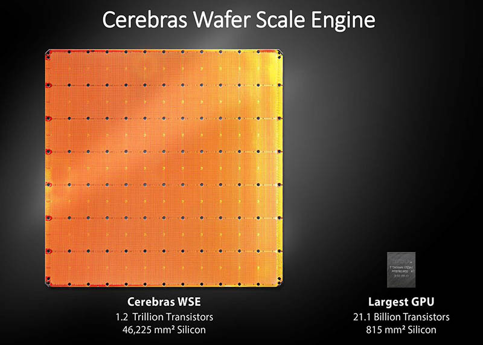

---
format:
  html:
    output-file: index.html
---

# Compounding Pressures and Scaling Limits {#sec-design-loop-no-longer-scales}

{fig-alt="Fading technology gains, coupled design obligations, and finite checking capacity converge on the work limiting the next supported decision."}

The opportunity for AI in architecture depends on understanding the work that limits design progress. Device scaling continues to improve technology, but architects can no longer rely on the same combination of density, frequency, and energy gains. More improvement depends on choices about specialization, data movement, software, and system composition. Those choices interact, making useful alternatives harder to compare.

This chapter develops the physical, computational, and economic reasons for that difficulty. It connects device and microarchitectural limits to accelerator offload, compiler support, changing workloads, and wider system boundaries. Worked examples distinguish a large design space from an expensive evaluation, and a promising local optimization from a useful system improvement.

The resulting pressures vary across design programs. Simulation may limit one study, while software development, missing information, or verification limits another. The chapter brings these observations together to explain how architects can identify the work delaying a decision and assess where learned methods or conventional automation could help. The purpose is to target assistance on the basis of the design problem, rather than infer its value from complexity alone.

## Where the Design Work Has Moved

The moonshot in @sec-moonshot asks whether a design system can make more hardware–software alternatives practical to investigate. That opportunity begins with a familiar architecture problem. Suppose an architect considers increasing an L2 cache from 2\ MiB to 4\ MiB to reduce accesses to main memory. The larger cache may reduce misses, but it also occupies more area and changes access energy, leakage, and wire delay.[^fn-rc-delay-c02] In a passively cooled device, its contribution to sustained power may also change the available operating frequency. A lower miss rate therefore leaves several questions about the completed system unanswered.

Software adds another choice. Tiling the computation could reduce the working set enough to use a smaller memory, at the cost of additional transfers or control. Comparing these alternatives requires the matching software as well as models of the memory and its implementation. The architect is choosing which hardware–software combination to investigate and which observations could distinguish them.

Earlier design abstractions help make that work manageable. A register-transfer level (RTL) description lets engineers express a circuit without placing every gate themselves.[^fn-rtl-c02] Synthesis and implementation tools supply more detailed representations, while functional and timing checks test different requirements. The historical examples in @sec-moonshot established this relationship between an abstraction and its supporting tools. The pressure examined here is how much work remains when more interacting choices must pass through those tools.

A *design path* carries a question through candidate construction, tool execution, and comparison. For the cache example, that path might compare two capacities under one workload and inspect their latency and energy estimates. It becomes a *design loop* when the results update the design information and guide another permitted action. An unfavorable energy estimate might lead to a smaller capacity increment or a tiled software variant. Executing a fixed sweep supplies observations; using those observations to choose the next experiment closes the loop.

Each additional experiment consumes some combination of implementation effort, tool time, and review. Its inputs may span timing constraints, power intent, RTL configurations, and workload traces.[^fn-eda-constraints-c02] The limiting work might be preparing those inputs, constructing an alternative, or checking its consequences. Diagnosing that limit requires understanding why architecture choices have become more closely coupled. The changing contribution of device scaling provides the starting point.

## Fracturing Technology Dividends and Co-Design {#sec-fracturing-technology-dividend}

For roughly thirty years, processor performance advanced under classical Dennard scaling, where shrinking physical device dimensions reduced transistor area and gate delay while voltage scaling allowed more transistors to switch faster without increasing power density (@tbl-dennard-scaling-comparison) [@Moore1965Cramming; @DennardEtAl1974Scaling; @HennessyPatterson2017QuantitativeApproach]. Today, device technology still supplies transistor density, but it no longer delivers proportional gains in frequency, single-thread performance, or energy efficiency. Extracting performance now requires choices that tightly bind microarchitecture, software mapping, and physical implementation together.

### The Collapse of Dennard Scaling and the Shift to Specialization

To see why specialization became more attractive, consider the balance in the original scaling model. Classical Dennard scaling assumed that shrinking linear dimensions by a factor $\kappa > 1$ reduced transistor area by $1/\kappa^2$, gate capacitance by $1/\kappa$, supply voltage by $1/\kappa$, and switching delay by $1/\kappa$. With switching activity held constant, $P_{\mathrm{dyn}} = \alpha C V_{dd}^{2} f$ then scaled by $(1/\kappa)(1/\kappa^2)(\kappa)=1/\kappa^2$ per transistor. This reduction exactly counteracted the $\kappa^2$ increase in transistor density and kept dynamic power density constant.

The post-Dennard column in @tbl-dennard-scaling-comparison uses one deliberately simplified assumption set to isolate what changes when voltage and frequency scaling stop: transistor area continues to shrink by $1/\kappa^2$, gate capacitance per transistor falls by $1/\kappa$, and transistor density rises by $\kappa^2$, while activity factor $\alpha$, supply voltage $V_{dd}$, and operating frequency $f$ remain fixed. The dynamic-power calculation excludes leakage and interconnect capacitance, which do not obey this ideal active-device model.

| Device Parameter | Classical Dennard Scaling ($\kappa > 1$) | Simplified Post-Dennard Case | Limiting Physical Constraint |
| :--- | :--- | :--- | :--- |
| **Transistor Area ($W \times L$)** | $1/\kappa^2$ | $1/\kappa^2$ | Gate pitch scaling continues |
| **Supply Voltage ($V_{dd}$)** | $1/\kappa$ | $1$ *(held fixed)* | Leakage and switching-speed trade-off |
| **Gate Capacitance ($C_{\text{gate}}$)** | $1/\kappa$ | $1/\kappa$ *(idealized)* | Gate and interconnect capacitance scale differently |
| **Operating Frequency ($f$)** | $\kappa$ | $1$ *(held fixed)* | Thermal dissipation and leakage limit frequency gains |
| **Dynamic Power Density ($P_{\mathrm{dyn}} / A$)** | $1$ *(constant)* | $\kappa$ *(under stated assumptions)* | Dark silicon and thermal limits |
: **Classical Dennard scaling versus a simplified post-Dennard case.** Shrinking linear dimensions by a factor $\kappa > 1$ historically kept dynamic power density constant while increasing operating frequency. With voltage, frequency, and activity held fixed in the displayed post-Dennard case, dynamic power density rises by $\kappa$; leakage, interconnect, and nonideal geometric scaling make real product behavior implementation-dependent. {#tbl-dennard-scaling-comparison tbl-colwidths="[24,24,28,24]"}

Writing transistor density as $\rho$, the post-Dennard dynamic-power-density ratio follows directly from that assumption set:
$$
\frac{P_{\mathrm{dyn}}'/A'}{P_{\mathrm{dyn}}/A}
= \frac{\alpha'}{\alpha}
  \times \frac{C'}{C}
  \times \left(\frac{V_{dd}'}{V_{dd}}\right)^2
  \times \frac{f'}{f}
  \times \frac{\rho'}{\rho}
= 1 \times \frac{1}{\kappa} \times 1^2 \times 1 \times \kappa^2
= \kappa.
$$
Dynamic power per active transistor therefore falls by $1/\kappa$, but the $\kappa^2$ increase in transistor density raises dynamic power per unit area by $\kappa$. This result is not a universal power-density law. Static leakage, interconnect capacitance, nonideal density scaling, workload activity, and power management determine how an implemented product behaves.

The classical balance broke down in the mid-2000s as supply voltage became harder to reduce. Lower voltage slows switching unless threshold voltage also falls, but lowering the threshold increases off-state leakage. Device physics therefore constrains a trade-off that engineers must make among speed, active power, and leakage; it does not prescribe one operating voltage for every design. As voltage reductions slowed, architects could no longer count on density scaling alone to deliver the earlier combination of frequency and energy-efficiency gains [@HennessyPatterson2017QuantitativeApproach].

Fifty years of CPU frontier data (1971 to 2021) from Karl Rupp's dataset trace these inflections (@fig-microprocessor-trends). Before 2005, single-thread performance and clock frequency scaled in lockstep with transistor density. At the 2005 Dennard boundary, clock frequency stalls near $3\text{--}5\ \text{GHz}$ and single-thread performance gains flatten from roughly 50% annually to single digits [@HennessyPatterson2017QuantitativeApproach], while hardware thread counts climb and the CPU power frontier reaches hundreds of watts (peaking near 300\ W in the dataset's final four-year interval). A second inflection around 2016 marks the specialization turn.

```{python}
#| label: fig-microprocessor-trends
#| fig-cap: |
#|   **Frequency stalls while transistor and parallelism budgets keep growing.** The end of Dennard
#|   scaling closed one path to performance and created the modern architectural design problem. Fifty
#|   years of CPU frontier data (1971–2021) from the public microprocessor dataset of @Rupp2022MicroprocessorTrendData
#|   are summarized as four-year interval maxima across five series (transistor count, single-thread SpecINT,
#|   clock frequency, CPU power, and logical hardware threads). Clock frequency plateaus near $3\text{--}5\ \text{GHz}$ in the
#|   mid-2000s, while transistor counts and thread counts climb and peak CPU power approaches $300\ \text{W}$
#|   [@DennardEtAl1974Scaling; @EsmaeilzadehEtAl2011DarkSilicon]. GPU and Xeon Phi records are excluded;
#|   era boundaries are approximate [@HennessyPatterson2019GoldenAge].
#| out-width: "100%"
#| fig-alt: "Log-scale line chart of CPU frontier trends from 1971 to 2021 with five differently scaled series. Transistors per chip rise from a few thousand to tens of billions by 2021. Single-thread performance rises steeply until the mid-2000s and then slows. Clock frequency plateaus near 3 to 5 GHz after about 2005, while the CPU power frontier rises to hundreds of watts and logical hardware-thread counts climb from one to more than one hundred. GPU and Xeon Phi records are excluded. Dashed vertical lines mark the approximate end of Dennard scaling around 2005 and the specialization turn around 2016."

import matplotlib.pyplot as plt
from _python.plots import COLORS, apply_style

apply_style()

# Fifty-year CPU trend data; per-series frontier points (per-4-year-bucket
# maxima) transcribed from the public dataset
# github.com/karlrupp/microprocessor-trend-data (50yrs/*.dat, CC-BY 4.0),
# which compiles the Horowitz/Labonte/Shacham/Olukotun/Hammond/Batten
# collection through 2010 plus Rupp's additions through 2021. Values are
# dataset-transcribed, not recomputed; fractional years as in the dataset.
# GPU and Xeon Phi records are excluded because their compute-unit/thread
# attributes and power envelopes are not directly comparable with CPUs.
# Transistors are in thousands; single-thread performance is SpecINT x 1000.
# Era-boundary annotations (~2005 Dennard end, ~2016 specialization turn)
# are approximate: [@DennardEtAl1974Scaling; @EsmaeilzadehEtAl2011DarkSilicon;
# @HennessyPatterson2019GoldenAge]. Accessed 2026-07-14.
# Source data: data/datasets/chapter1-micro-trend.csv

series = [
    {
        "label": "Transistors\n(thousands)",
        "color": COLORS["purple"],
        "points": [(1974.3, 6.1), (1982.3, 136), (1985.9, 274), (1989.5, 1210),
                   (1992.7, 3110), (1998.9, 15300), (2002.9, 221000),
                   (2007.0, 583000), (2009.7, 2.31e6), (2014.8, 5.7e6),
                   (2017.5, 1.92e7), (2021.8, 5.7e7)],
        "label_y": 5.7e7,
    },
    {
        "label": "Single-thread perf\n(SpecINT x 1000)",
        "color": COLORS["blue"],
        "points": [(1988.7, 83.5), (1994.8, 599), (1998.9, 3550),
                   (2002.4, 9390), (2007.0, 35200), (2010.3, 42000),
                   (2014.8, 66000), (2017.6, 83600), (2021.3, 105000)],
        "label_y": 1.05e5,
    },
    {
        "label": "Frequency (MHz)",
        "color": COLORS["orange"],
        "points": [(1974.3, 2.02), (1982.3, 6.1), (1985.9, 16.1),
                   (1988.7, 40.3), (1994.7, 297), (1997.5, 538),
                   (2002.4, 2250), (2004.9, 3650), (2007.7, 4660),
                   (2012.7, 3700), (2016.7, 4000), (2020.9, 3200)],
        "label_y": 6.0e3,
    },
    {
        "label": "CPU power: 4-year max (W)",
        "color": COLORS["red"],
        "points": [(1974.3, 0.922), (1982.3, 3.02), (1986.2, 3.02),
                   (1988.7, 3.96), (1993.0, 35.2), (1998.9, 90.6),
                   (2001.7, 98.2), (2003.4, 155), (2010.4, 168),
                   (2014.5, 200), (2017.59, 205), (2021.3, 290)],
        "label_y": 3.5e2,
    },
    {
        "label": "CPU logical\nhardware threads",
        "color": COLORS["green"],
        "points": [(1971.9, 1), (1979.6, 1), (1985.9, 1), (1988.7, 1),
                   (1992.4, 1), (1995.4, 1), (1999.2, 1), (2006.0, 8),
                   (2010.2, 16), (2014.5, 64), (2016.67, 96), (2020.1, 128)],
        "label_y": 2.5e1,
    },
]

fig, ax = plt.subplots(figsize=(6.4, 3.4))
fig.subplots_adjust(left=0.075, right=0.775, top=0.90, bottom=0.12)

ax.set_yscale("log")
ax.set_xlim(1970, 2024.5)
ax.set_ylim(0.4, 3e9)

for x in (2005, 2016):
    ax.axvline(x, color=COLORS["muted"], linewidth=0.8,
               linestyle=(0, (4, 3)), zorder=1)

era_labels = [
    (1987.5, "Device-scaling era"),
    (2010.5, "Parallelism era"),
    (2020.5, "Specialization\nera"),
]
for x, text in era_labels:
    ax.text(x, 2.5e8, text, ha="center", va="center", fontsize=6.2,
            fontweight="bold", color=COLORS["ink"])

ax.text(2004.3, 4e7, "Dennard scaling\nends", ha="right", va="center",
        fontsize=5.6, color=COLORS["muted"], linespacing=1.15)
ax.text(2016.4, 2.5e5, "specialization\nturn", ha="left", va="center",
        fontsize=5.6, color=COLORS["muted"], linespacing=1.15)

for s in series:
    xs = [p[0] for p in s["points"]]
    ys = [p[1] for p in s["points"]]
    ax.plot(xs, ys, color=s["color"], linewidth=1.6, zorder=2)
    ax.scatter(xs, ys, s=13, color=s["color"], zorder=3)
    ax.text(1.015, s["label_y"], s["label"], ha="left", va="center",
            fontsize=6.0, fontweight="bold", color=s["color"],
            clip_on=False, linespacing=1.15,
            transform=ax.get_yaxis_transform())

ax.set_xticks([1970, 1980, 1990, 2000, 2010, 2020])
ax.set_yticks([1, 1e2, 1e4, 1e6, 1e8])
ax.set_yticklabels([r"$10^0$", r"$10^2$", r"$10^4$", r"$10^6$", r"$10^8$"])
ax.tick_params(axis="both", labelsize=6.5, length=2.5, width=0.6, pad=2)
ax.grid(axis="y", color=COLORS["grid"], linewidth=0.6)

for spine in ["top", "right"]:
    ax.spines[spine].set_visible(False)
ax.spines["left"].set_color(COLORS["ink"])
ax.spines["bottom"].set_color(COLORS["ink"])

plt.show()
plt.close(fig)
```

These diverging curves in @fig-microprocessor-trends illustrate the structural end of automatic frequency scaling [@Sutter2005FreeLunch]. When supply voltage scaling stalled around 2005, power constraints capped the fraction of transistors that could switch simultaneously at peak frequency, creating the *dark silicon* wall [@EsmaeilzadehEtAl2011DarkSilicon].[^fn-dark-silicon-c02]

### The Limits of In-Core Microarchitectural Scaling

General-purpose processors continue to improve through branch prediction, speculative execution, wider issue, and better memory hierarchies. These mechanisms can expose and exploit more instruction-level parallelism, but their benefits must pay for the structures needed to coordinate that work.

The issue window illustrates the difficulty. More entries let an out-of-order processor find ready instructions farther ahead, while greater issue width lets it execute more of them together. Yet completing instructions must broadcast their result tags to waiting entries, and selection logic must choose among the ready instructions. Enlarging the window increases the loads on those broadcasts; widening issue also increases comparisons and forwarding connections. The number of connections and the delay of the resulting circuit are different quantities, so a quadratic connection count is not itself a quadratic delay law. The implementation analysis of @PalacharlaEtAl1997ComplexityEffective shows why wakeup, selection, and bypass structures can limit the benefit of wider machines. Wire delay further constrains the physical distances over which that coordination can occur within a cycle [@AgarwalEtAl2000ClockRateVersusIPC].

Pipeline depth introduces a related trade-off. Dividing work across more stages can support a higher clock rate, but a branch misprediction may discard more work and take longer to recover from. Intel's 31-stage Prescott pipeline is a prominent example of this balance [@BoggsEtAl2004Pentium4NinetyNm]. Frequency alone cannot show whether the resulting processor completes a workload sooner or uses less energy. Moving to multiple cores changes the comparison again: coherence, memory ordering, synchronization, and workload partitioning determine how much parallel hardware is useful. These costs explain the appeal of specialization without implying that general-purpose microarchitecture has stopped advancing.

### The Specialization Turn and Accelerator Scaling

Specialization offers another use for the transistor budget. Regular computations can execute on many arithmetic units with less instruction-control overhead, provided that the workload exposes enough parallelism and the memory system supplies the operands.

The selected GPU generations in @fig-ch02-accelerator-scaling-frontier show how that balance changed from Pascal P100 to Hopper H100. Panel (a) compares growth in peak half-precision floating-point (FP16) throughput, off-chip memory bandwidth, and thermal design power (TDP), each relative to P100. Precision is held fixed, and throughput excludes the advertised gain from structured sparsity. The comparison still includes an architectural change: P100 uses conventional arithmetic units, whereas later generations add matrix-oriented Tensor Cores. It therefore illustrates the combined effect of specialization and successive implementations, not an application speedup or an improvement in compute per unit area [@FoleyDanskin2017Pascal; @ChoquetteEtAl2018Volta; @ChoquetteEtAl2021Ampere; @Choquette2023Hopper].

Peak arithmetic throughput grows faster than High Bandwidth Memory (HBM) bandwidth in this comparison. To understand the consequence, define a workload's *operational intensity* as the operations performed per byte transferred across a specified memory boundary. Reusing data on chip raises intensity at the off-chip boundary because more operations share each fetched byte. Dividing peak compute rate by memory bandwidth gives the intensity required to feed peak arithmetic throughput, assuming that bandwidth can be sustained. Panel (b) plots this balance point for the same parts and the same precision. A kernel below it cannot reach peak compute throughput even with otherwise ideal execution. A kernel above it has enough reuse to clear this particular bandwidth constraint, but may still face dependencies, limited parallelism, or other bottlenecks.

![**More arithmetic requires more data reuse.** (a) Growth relative to P100 in dense FP16 peak throughput, HBM bandwidth, and TDP for four selected GPU generations, 2016–2022. (b) Peak FP16 throughput divided by HBM bandwidth gives the off-chip balance point. Tensor Core throughput applies only to supported operations; these are hardware specifications, not measured application gains [@FoleyDanskin2017Pascal; @ChoquetteEtAl2018Volta; @ChoquetteEtAl2021Ampere; @Choquette2023Hopper].](images/fig-ch02-accelerator-scaling-frontier){#fig-ch02-accelerator-scaling-frontier width="100%" fig-alt="Two-panel plot for P100, V100, A100, and H100. Dense FP16 peak throughput grows faster than HBM bandwidth and TDP. The corresponding balance point rises from about 29 to about 295 floating-point operations per byte transferred from HBM."}

Architects can respond by improving reuse, changing the computation, increasing memory bandwidth, or devoting more area to on-chip static random-access memory (SRAM). The physical comparison in @fig-cerebras-wse-ch02 makes the scale of one response visible. The Cerebras Wafer-Scale Engine (WSE) extends computation and distributed SRAM across a wafer, bringing communication, defect tolerance, and power delivery into the same architectural comparison. Its internal SRAM bandwidth describes a different memory boundary from the HBM bandwidth plotted above and should not be read as a directly interchangeable specification [@ReutherEtAl2025LAICS].

::: {#fig-cerebras-wse-ch02}
{fig-alt="Cerebras WSE physical size comparison"}

**Wafer-scale integration changes the available memory and communication organization.** The Cerebras WSE is shown beside a conventional processor. Extending across a wafer accommodates distributed SRAM and compute while requiring a corresponding approach to communication, defect tolerance, and power delivery [@ReutherEtAl2025LAICS].
:::

These responses carry different costs. More SRAM can reduce off-chip traffic but consumes die area; wider memory interfaces and advanced packaging can supply more bandwidth but add implementation and power-delivery obligations. Software tiling can improve reuse within either organization. The useful choice depends on the workload's capacity, bandwidth, latency, and power needs. Memory is central to this comparison without being the limiting resource for every workload.

### Domain Specialization Tightens Cross-Layer Stack Coupling

Memory and thermal bottlenecks blur traditional stack boundaries. While the stack abstraction cleanly separates device physics, architecture, and software, domain specialization forces co-optimization across shared power and area budgets. Specialization does not create this coupling; instead, it tightens existing cross-layer dependencies.

The two views in @fig-tao-vs-taos show how an abstraction can remain useful while hiding dependencies needed for a particular comparison. A layered view organizes responsibilities. The specialization view makes the shared constraints explicit: a software tile determines required storage, that storage affects area and access time, and those costs can change which tile is useful. The layers were never physically independent. Specialization makes it harder to hold their assumptions fixed while changing one part of the design.

{#fig-tao-vs-taos width="80%" fig-alt="Two side-by-side stack diagrams. On the left, optimization, architecture, and technology form a vertical analytical stack with technology at the base. On the right, the same three layers are joined to a specialization panel by double-headed arrows, and a red dashed boundary labeled tightly coupled physical constraints encloses the entire stack."}

An early model must therefore retain the dependencies that can change the ordering of alternatives. A compute-only model may favor a larger arithmetic array even when its data supply makes the added units ineffective. Once that accelerator joins a larger system, communication and unaccelerated work introduce further reasons for a local improvement to disappoint. Those composition costs are the next part of the argument.

## Balancing Specialization and System Composition

A specialized block is useful only as part of the system that supplies its work and consumes its results. Its local speedup must pay for dispatch, data transfer, and the work left on the host. Partitioning that system across chiplets or a wafer-scale fabric adds choices about where those costs occur. The first comparison is therefore what to accelerate and how much of the workload benefits.

### Specialization Traps and Amdahl's Law

Specialization spans a continuous spectrum rather than a binary leap from a general-purpose CPU to a custom accelerator. Designers can integrate vector and matrix units into general-purpose cores, assign data-parallel workloads to GPUs, construct domain-specific accelerators with custom dataflows, or eliminate software flexibility entirely with fixed-function application-specific integrated circuits (ASICs). Moving along this spectrum trades the breadth of workloads and software paths the hardware can execute for raw energy efficiency and throughput density.

This spectrum redefines what architectural comparisons must weigh. While microarchitecture and multicore scaling refine a general-purpose foundation, specialization bends hardware around a specific workload. Evaluation metrics must therefore shift to reflect the expanded design space under study. Optimization targets differ fundamentally between an energy-constrained mobile system-on-chip (SoC) (optimizing milliwatts and joules per frame) and a warehouse-scale data center (optimizing total cost of ownership (TCO) and throughput per kilowatt). A specialized block can only be fairly judged against the specific target it was engineered for.

The potential upside is large. Across the computational kernels examined by @HameedEtAl2010Inefficiency, a bespoke fixed-function ASIC proved roughly 500 times more energy efficient than a conventional core. The authors captured most of this efficiency gain by eliminating instruction fetch, decoding, and redundant data movement, while simultaneously exploiting massive parallelism and fused operations. This result does not guarantee identical gains across the board. Instead, it highlights why deciding what to specialize, determining which flexibility to keep, and shaping the software interface have become central architectural challenges.

This drive for specialization has spawned a wide diversity of designs, a period the team behind Project Brainwave, Microsoft's deep-learning acceleration platform, described as one of rapid architectural diversification [@ChungEtAl2018Brainwave]. Publicly announced AI accelerators span seven orders of magnitude in peak power and six orders in peak performance across training and inference workloads (@fig-accelerator-landscape) [@ReutherEtAl2025LAICS]. Ranging from subwatt embedded chips to multi-kilowatt data-center clusters, with energy-efficiency contours stretching from 100\ GOps/W to 100\ TOPS/W, these roughly 180 designs form a dense, heterogeneous cloud rather than clustering around a single operating point.

```{python}
#| label: fig-accelerator-landscape
#| fig-cap: |
#|   **AI accelerators span seven orders of magnitude in operating power.** Each point represents a
#|   publicly announced accelerator from the MIT Lincoln Laboratory survey on a log-log scale of peak
#|   power ($1\ \text{mW}\text{ to }70\ \text{kW}$) versus peak performance ($3\ \text{GOps/s}\text{ to }10^8\ \text{GOps/s}$)
#|   [@ReutherEtAl2025LAICS]. Colors denote form factors (chip, card, or system), filled versus hollow markers
#|   distinguish training from inference parts, and dashed diagonals trace constant energy-efficiency contours
#|   from $100\ \text{GOps/W}\text{ to }100\ \text{TOPS/W}$. The resulting design space forms a dense, heterogeneous cloud
#|   rather than clustering around a single operating point.
#| out-width: "100%"
#| fig-alt: "Log-log scatter of about 180 AI accelerators, peak performance in giga-operations per second versus peak power in watts. Points span from subwatt embedded chips at the lower left to multi-kilowatt data-center systems at the upper right, roughly seven orders of magnitude in power and six in performance. Dashed diagonal lines mark constant energy efficiency from 100 giga-ops per watt to 100 tera-ops per watt. Chips, cards, and systems are colored distinctly; training parts are filled and inference parts hollow."

import csv
from pathlib import Path

import numpy as np
import matplotlib.pyplot as plt
from matplotlib.lines import Line2D
import _python.plots as _ap
from _python.plots import COLORS, apply_style
from _python.labels import place_labels

apply_style()

# Data: MIT Lincoln Laboratory AI accelerator survey, 2025 edition
# [@ReutherEtAl2025LAICS], one row per publicly announced accelerator with a
# stated peak performance and power. Values are dataset-transcribed.
# Accessed 2026-07-19. Source data: data/datasets/chapter1-accelerator-landscape.csv

_root = Path(_ap.__file__).resolve().parents[2]
rows = []
with open(_root / "data" / "datasets" / "chapter1-accelerator-landscape.csv", encoding="utf-8") as fh:
    # datasets carry '#' provenance headers; skip them
    for d in csv.DictReader(l for l in fh if not l.startswith("#")):
        try:
            perf = float(d["peak_performance_ops_per_s"]) / 1e9
            power = float(d["power_w"])
        except ValueError:
            continue
        rows.append({"label": d["label"], "perf": perf, "power": power,
                     "form": d["form_factor"], "iort": d["inference_or_training"]})

forms = {"Chip": COLORS["workload"], "Card": COLORS["methods"], "System": COLORS["evidence"]}
fig, ax = plt.subplots(figsize=(6.0, 4.0))
xline = np.array([1e-3, 1e5])
for eff, lab in [(1e2, "100 GOPS/W"), (1e3, "1 TOPS/W"), (1e4, "10 TOPS/W"), (1e5, "100 TOPS/W")]:
    ax.plot(xline, eff * xline, ls=(0, (5, 4)), color=COLORS["grid"], lw=0.8, zorder=1)
    x_pos = max(2.4e-3, 10.0 / eff)
    ax.text(x_pos, eff * x_pos * 1.3, lab, fontsize=4.6, color=COLORS["muted"],
            rotation=34, rotation_mode="anchor", va="bottom", ha="left", zorder=1)
for form, color in forms.items():
    for iort, filled in [("training", True), ("inference", False)]:
        pts = [d for d in rows if d["form"] == form and d["iort"] == iort]
        if not pts:
            continue
        xs = [d["power"] for d in pts]
        ys = [d["perf"] for d in pts]
        if filled:
            ax.scatter(xs, ys, s=14, marker="o", facecolor=color, edgecolor=color, linewidth=0.5, alpha=0.9, zorder=3)
        else:
            ax.scatter(xs, ys, s=14, marker="o", facecolors="white", edgecolors=color, linewidth=0.8, alpha=0.95, zorder=3)
for txt, x, y in [("Very low power", 0.02, 3.0e3), ("Embedded / autonomous", 3.0, 1.2e1),
                  ("Data-center cards", 4e2, 3.0e6), ("Data-center systems", 6e3, 3.0e7)]:
    ax.text(x, y, txt, fontsize=5.2, fontstyle="italic", color=COLORS["muted"], ha="center", va="center", zorder=2)
ax.set_xscale("log")
ax.set_yscale("log")
ax.set_xlim(8e-4, 7e4)
ax.set_ylim(3, 1e8)
ax.set_xlabel("Peak power (W)", fontsize=7.2)
ax.set_ylabel("Peak performance (GOps/sec)", fontsize=7.2)
ax.tick_params(labelsize=6.2, length=2.5, width=0.6)
for _sp in ("top", "right"):
    ax.spines[_sp].set_visible(False)
ax.grid(True, which="major", color=COLORS["row"], linewidth=0.4, zorder=0)
handles = [Line2D([0], [0], marker="o", ls="", markerfacecolor=c, markeredgecolor=c, markersize=5, label=f) for f, c in forms.items()]
handles += [Line2D([0], [0], marker="o", ls="", markerfacecolor=COLORS["ink"], markeredgecolor=COLORS["ink"], markersize=5, label="Training"),
            Line2D([0], [0], marker="o", ls="", markerfacecolor="white", markeredgecolor=COLORS["ink"], markersize=5, label="Inference")]
ax.legend(handles=handles, loc="upper left", frameon=False, fontsize=5.8, handletextpad=0.3, labelspacing=0.3, borderaxespad=0.4)
curated = ["Maxim", "GAP9", "Jetson1", "Perceive", "A100", "TPU4", "H100",
           "AMD-MI300X", "B200", "Gaudi3", "CS-2", "DGX-H100", "GroqNode", "Tachyum"]
by_label = {d["label"]: d for d in rows}
items = [(by_label[n]["power"], by_label[n]["perf"], n) for n in curated if n in by_label]
place_labels(ax, fig, items, fontsize=5.0, color=COLORS["ink"])
fig.subplots_adjust(left=0.095, right=0.98, top=0.98, bottom=0.11)
```

The spread in @fig-accelerator-landscape illustrates the range of deployment targets. It does not establish which design is best: the points mix numerical precisions, supported operations, and chip, card, and system boundaries. A subwatt sensor processor may emphasize local storage and low-precision computation to avoid costly transfers. A data-center accelerator may devote much more power to arithmetic and memory bandwidth. Within either setting, the architect still needs workload measurements to choose vector lengths, scratchpad sizes, dataflows, and scheduling policies. A favorable location in a peak-performance plot cannot replace that comparison.

The operating points in the landscape also conceal differences in how work reaches the arithmetic units. The GPU, systolic-array, wafer-scale, and streaming designs collected in @fig-ch02-accelerator-proliferation-mosaic organize data movement and execution differently. For an architect comparing them, the useful question is which organization suits the workload and what compiler and runtime support that choice requires.

{#fig-ch02-accelerator-proliferation-mosaic width="80%" fig-alt="Multi-panel collection of commercial accelerator packages and dies, including GPUs, the Google Tensor Processing Unit (TPU), wafer-scale processors, and streaming designs."}

In a composed system, a domain-specific accelerator (DSA) may handle dense compute while a general-purpose core retains control flow and irregular tasks. The runtime must move data and synchronize execution between them. Before committing die area and power to the specialized block, architects therefore need to determine what fraction $f$ of the workload it accelerates and how much the crossing costs. Amdahl's law makes that first comparison explicit (@eq-amdahl-communication).

$$S_{\mathrm{total}} = \frac{1}{(1-f) + \frac{f}{S_{\mathrm{accel}}} + t_{\mathrm{comm}}}$${#eq-amdahl-communication}

where $S_{\mathrm{accel}}$ is the execution speedup on the specialized block, and $t_{\mathrm{comm}}$ is the added transfer and synchronization time, normalized to baseline execution time. The expression assumes that this added cost does not overlap useful computation. If targeted kernels consume half the total time ($f=0.5$), executing them ten times faster ($S_{\mathrm{accel}}=10$) with zero transfer overhead yields only `{python} f'{1 / (0.5 + 0.5 / 10):.1f}'` times total speedup [@Amdahl1967ValiditySingleProcessor]. Adding communication lowers that benefit. The same reasoning bounded design-schedule improvements in @sec-moonshot; here it helps decide whether a proposed accelerator deserves its system cost.

The interpretation also depends on whether the problem size is fixed. Gustafson's law considers increasing the parallel work as more processors become available, as a training study might do with a larger model or dataset [@Gustafson1988AmdahlLaw]. A fixed-work latency comparison asks a different question. For an illustrative mobile-XR target of 120 frames per second (FPS), one frame interval is `{python} f'{1000 / 120:.2f}'` ms; this frame rate is a study assumption, not part of Lighthouse's initial requirements. If the per-frame work and deadline are fixed, dispatch and synchronization consume time that additional arithmetic cannot recover. The compiler, runtime, memory traffic, and residual host work must therefore accompany the accelerator in the comparison.

That judgment can be made quantitative. Amdahl's $t_{\mathrm{comm}}$ lumps every communication cost into one normalized term, whereas the LogCA model separates the terms an offload actually pays, latency, overhead, granularity, computational index, and acceleration [@AltafWood2017LogCA]. For a payload of $g$ work units, host cost $C_h$ cycles per work unit, fixed invocation overhead $o$ in cycles, local compute acceleration $A$, transferred data $d$ in bytes per work unit, link bandwidth $B$ in bytes per cycle, and overlapped transfer interval $T_{\mathrm{overlap}}(g)$ in cycles:

$$
T_{\mathrm{host}}(g) = C_h g,
\qquad
T_{\mathrm{acc}}(g) = o + \frac{C_h g}{A} + \max\left(0,\frac{d g}{B} - T_{\mathrm{overlap}}(g)\right).
$$

The ratio of the two is the delivered speedup (@eq-logca-speedup-bound):

$$
S(g) = \frac{C_h g}{o + C_h g/A + \max\left(0,\, d g/B - T_{\mathrm{overlap}}(g)\right)}.
$${#eq-logca-speedup-bound}

In the nonoverlapped regime ($T_{\mathrm{overlap}} = 0$), offloading achieves net acceleration ($S(g) > 1$) only when the payload exceeds the break-even granularity $g^*$:

$$
g^* = \frac{o}{C_h\left(1 - \frac{1}{A}\right) - \frac{d}{B}}.
$${#eq-logca-breakeven-g}

For a positive invocation overhead and $A>1$, this break-even granularity exists only when the denominator is positive. If we take one work unit to be one arithmetic operation, then $d = 1/\mathrm{OI}$ in bytes per operation. This connects the transfer constraint to the operational-intensity reasoning of the Roofline model [@Williams2009Roofline]. When intensity falls to or below

$$
\mathrm{OI} \le \mathrm{OI}^* = \frac{1}{B \cdot C_h\left(1 - \frac{1}{A}\right)}
$$

the denominator of @eq-logca-breakeven-g becomes nonpositive. At the specified acceleration $A$, transfer takes at least as much time per operation as offloading saves, so no payload size produces a speedup. Increasing $A$ changes the threshold, but cannot eliminate the transfer cost. This distinction separates an invocation cost that a larger payload can amortize from a per-operation cost that it cannot.

The break-even phase diagram (@fig-ch09-logca-phase-diagram) separates two ways an offload can lose its advantage. The horizontal floor of each curve is governed by the fixed invocation overhead ($o$) relative to host cost ($C_h$) and local acceleration ($A$); lowering $o$ reduces the work needed to amortize a launch. The vertical asymptote, or operational intensity wall, depends on link bandwidth ($B$); restricting $B$ demands more arithmetic reuse per transferred byte. A larger payload can amortize startup, but cannot repair a per-operation transfer cost that already exceeds the host work saved.

The plotted curves are illustrative model evaluations for named interconnect regimes, with host cost fixed at $0.4\ \text{ns/FLOP}$, local acceleration $A=50$, and no transfer overlap. They use total link bandwidth and host invocation overhead, not bandwidth per millimeter of die edge or physical-link latency alone. For example, the advanced-package Universal Chiplet Interconnect Express (UCIe) case uses $B=1{,}600\ \text{GB/s}$ and $o=15\ \text{ns}$; the PCIe Gen 5 case uses $64\ \text{GB/s}$ and $850\ \text{ns}$. These assumptions let the reader compare the mechanisms while holding host and accelerator performance constant. They do not establish an offload threshold for every implementation of a standard, because driver, runtime, and protocol behavior also contribute to $o$.

![**LogCA break-even offload frontiers.** Illustrative break-even granularity ($g^*$, FLOPs where $S(g)=1$) versus operational intensity, using $C_h=0.4\ \text{ns/FLOP}$, $A=50$, and no transfer overlap [@AltafWood2017LogCA; @Williams2009Roofline]. Advanced-package UCIe uses 1,600\ GB/s total bandwidth and 15\ ns host invocation overhead, approaching $g^* \approx 40\ \text{FLOPs}$ at high intensity. PCIe Gen 5 (64\ GB/s, 850\ ns) and Ultra Ethernet (100\ GB/s, 2,200\ ns) approach roughly $2\times10^3$ and $6\times10^3\ \text{FLOPs}$, respectively. Each curve rises near its bandwidth wall; payloads must exceed it for net acceleration. These are modeled regimes, not measured application thresholds.](images/fig-ch09-logca-phase-diagram){#fig-ch09-logca-phase-diagram width="80%" fig-alt="Log-log plot of minimum break-even operation granularity in FLOPs versus operational intensity in FLOPs per byte across seven interconnect regimes from UCIe 2.0 to Ultra Ethernet, showing that die-to-die packaging enables fine-grained offloading while board-level PCIe enforces a steep operational intensity wall."}

Under the displayed assumptions, low startup cost and high total link bandwidth permit smaller offloads. Higher-cost links require larger payloads, and nonoverlapped transfers reduce the asymptotic speedup even after startup has been amortized. The local factor $A$ is an upper bound in this model, approached only as the other costs become negligible. Estimating that gap requires a plausible invocation path, not just a datapath design.

::: {.callout-failure-mode title="The unamortized offload wall"}
**The trap.** In an illustrative scenario consistent with the model above, a mobile neural processing unit (NPU) adds a 1,024 multiply-accumulate (MAC) systolic tensor engine capable of $100\times$ local matrix-multiply acceleration ($A=100$) over scalar RISC-V execution, and the team treats that local factor as the expected system speedup.

**The mechanism.** Suppose the host takes one cycle per operation and the runtime invokes the NPU through kernel-mode driver calls for each small layer (payload $g=500\ \text{operations}$). With launch latency $o=1{,}500\ \text{cycles}$, even an optimistic calculation omitting transfer costs gives $S(g)=500/(1{,}500+500/100)\approx0.33\times$. The offloaded path is slower than baseline scalar execution before DMA transfer costs are included.

**The lesson.** Local compute acceleration ($A$) cannot overcome unamortized startup ($o$) and transfer ($d g/B$) costs. Offload mechanisms must be co-designed with compiler layer fusion so that payload size $g$ stays well above the break-even threshold.
:::

The interconnect and invocation path set the transfer and startup costs. The compiler and runtime help determine the payload size, data reuse, and overlap that the workload achieves. The offload bound will therefore return as a software question after we consider how the hardware is composed.

### Packaging and Chiplet Composition Risks

Specialized intellectual property (IP) blocks rarely ship in isolation. Teams integrate them into systems-on-chip (SoCs) or distribute functions across chiplets. Smaller dies can improve manufacturing yield under random-defect models, but packaging, assembly yield, test, and interconnect costs also matter [@Murphy1964CostSize; @FengMa2022ChipletActuary]. Reusing a chiplet across products can spread its development cost over more units, and different functions can use different process nodes. These benefits depend on compatible interfaces and a workable physical implementation. UCIe standardizes die-to-die communication, including physical interfaces and protocol support [@UCIeConsortium2026Spec], but does not choose the partition or establish that a particular package meets its power and shoreline-bandwidth needs.[^fn-shoreline-bandwidth-c02]

Composition also introduces blocks whose implementation the system architect cannot inspect fully. Arm has supplied processor IP as fixed hard macros [@Arm2013CortexA15HardMacro], and Intel distributes encrypted RTL [@Intel2024EncryptedRTLIP]. Integration then relies on documented behavior, supplied models, and checks at the accessible interfaces. Incomplete reset, clock-domain crossing, or coherence assumptions can make two individually qualified blocks fail together [@Arm2020AXI]. Shared network-on-chip (NoC) traffic adds another interaction: adequate average bandwidth can coexist with contention that misses a deadline. Partitioning must also provide test access, since finding a defective die before assembly avoids spending a package on it [@IEEE2020Std1838].

Automated exploration must account for those constraints. Missing rules waste evaluations on infeasible combinations; overly restrictive rules exclude viable ones. The Semiconductor Research Corporation's Microelectronics and Advanced Packaging Technologies (MAPT) roadmap identifies inconsistent supplier data formats, syntax, and semantics as obstacles to automation [@SemiconductorResearchCorporation2023MAPT]. A study should encode the constraints it knows and identify which remaining assumptions require integration tests or supplier clarification. Unknown compatibility should remain an unresolved condition, rather than silently become either permission or prohibition.

### Wafer-Scale Communication Trade-offs

Wafer-scale integration explores a different balance between local communication and physical scale. Placing compute and memory across a wafer can reduce the need to cross board-level links, but power delivery, communication distance, and defect tolerance constrain how much of that hardware can be used [@PalEtAl2019WaferscaleGPU].

In a wafer-scale GPU case study, physical constraints reduced usable capacity from a nominal 100 GPU modules to 40 [@PalEtAl2019WaferscaleGPU]. The example shows why available silicon area is not equivalent to usable compute. Placement, routing around defects, and software scheduling determine the communication that the workload actually experiences. Across these packaging choices, the same question persists: can the software use the proposed organization well enough to justify its costs? Answering it requires an executable software path.

## Software as Silicon

Even after hardware candidates satisfy physical packaging constraints and power budgets, they deliver zero utility without an executable software path to program, schedule, and drive them. Specialized silicon derives its efficiency entirely from tailoring hardware structures to specific computational graphs; if the compiler cannot lower high-level primitives onto those structures, or if the runtime introduces prohibitive dispatch overhead, the specialized hardware remains dark silicon. Hardware development operates on a multi-year cadence while modern software algorithms evolve on weekly cycles. This fundamental impedance mismatch creates two symmetric failure modes, where a hardware block fails if software cannot reach it, and architectural gains evaporate if optimized against a workload distribution that shifts before tapeout. Engineers must therefore manage both the static executable path and the dynamic evolution of workloads.

### Executable Software Paths

The *executable software path* encompasses the programming model or front end, compiler, libraries and kernels, runtime, driver or firmware, operating system, and deployment controls. Exploiting a hardware mechanism requires all of these layers without losing predicted benefits to data movement or overhead. Historical shifts such as RISC and CUDA succeeded precisely because they provided compiler support and programming models that made hardware accessible. Conversely, a design with high peak floating-point operations per second (FLOPS) fails if its software contract is unusable, and that failure never shows up in the peak number.

What an unusable contract costs is visible in the software that vendors ship to reach their own hardware. Each new primitive a GPU generation exposes, warp-level `wmma`, warp-group `wgmma`, tensor memory accelerators, fifth-generation tensor cores driven through `tcgen05`, stays unreachable until the stack above it is rewritten. In NVIDIA's CUTLASS template library [@NVIDIACUTLASS], architecture-specific C++ and PTX (NVIDIA's virtual instruction set) template code grew $48.7\times$ (from $4.3\text{K}$ to $207.7\text{K}$ lines of code) between 2019 and 2026, and inline PTX assembly statements grew $60.4\times$ (from $51$ to $3,082$) to manage microarchitectural detail through CuTe layout algebra, warp-specialized collective mainloops, asynchronous tensor-memory copy pipelines, and instructions such as `cp.async.bulk` and `wgmma.mma_async`. Serving systems that bypass the compiler to reach peak performance pay the same tax; the custom kernels in vLLM [@KwonEtAl2023PagedAttention] fragment across PagedAttention, chunked prefill, low-precision quantized matrix-multiply kernels, mixture-of-experts dispatch, and vendor-specific backends. The maintenance burden compounds across generations into a *software porting wall* (@fig-ch09-money-plot-software-porting-wall).

![**The software porting wall and compiler narrow waist across hardware generations (2019–2026).** (a) In hardware template libraries (NVIDIA CUTLASS), architecture-specific code expands $48.7\times$ alongside a $60.4\times$ surge in inline PTX assembly [@NVIDIACUTLASS]. (b) In the Triton Multi-Level Intermediate Representation (MLIR) compiler, the shared middle end acts as a narrow waist that absorbs hardware shifts ($33.2\times$ growth) while isolating target backends [@TilletEtAl2019Triton]. (c) In application serving (vLLM), bypassing compiler narrow waists drives a $48.7\times$ explosion in hand-tuned C++/CUDA kernels across attention, quantization, and MoE dispatch [@KwonEtAl2023PagedAttention].](images/fig-ch09-software-porting-wall){#fig-ch09-money-plot-software-porting-wall width="80%" fig-alt="Three-panel visualization showing the software porting wall from 2019 to 2026. (a) CUTLASS architecture-specific template code expanding 48.7-fold from 4.3K to 207.7K lines alongside a 60-fold surge in inline PTX assembly. (b) Triton's shared MLIR middle-end scaling 33-fold from 3.0K to 100.1K lines while decoupling target backends. (c) vLLM's custom C++/CUDA/HIP kernels exploding 48.7-fold from 2.5K to 120.5K lines across attention, quantization, and MoE dispatch."}

The three panels in @fig-ch09-money-plot-software-porting-wall separate two responses to the same hardware churn. In the template library and the serving system, code that names the hardware grows with every generation; in the Triton compiler, built on Multi-Level Intermediate Representation (MLIR),[^fn-mlir-c02] the shared middle end absorbs the shifts and the target backends stay isolated. An architecture that requires fifty thousand lines of bespoke inline assembly to reach peak performance has transferred its non-recurring engineering (NRE) cost onto the software ecosystem, and without a mechanism that absorbs hardware diversity, the resulting fragility confines specialized accelerators to niche deployments. Architectural evaluation therefore has to measure executable code paths rather than isolated hardware blocks.

The mechanism that absorbs the churn is the *compiler narrow waist*, a shared intermediate representation (IR) through which many programming models and many hardware targets pass. Frameworks such as Halide [@RaganKelleyEtAl2017HalideCACM] and MLIR [@LattnerEtAl2020MLIR] embed loop scheduling, lowering, and IRs directly into performance comparisons, and Triton's MLIR pipeline realizes the waist for tensor kernels. A shared IR decouples high-level algorithmic intent from target code generation and absorbs hardware iterations in its middle end, so the manual kernel templates never multiply. Along that path, high-level domain-specific abstract syntax trees (ASTs, from Python or Triton front ends) descend through mid-level control-data flow graphs in MLIR dialects and LLVM IR to the point where workload intent meets architectural mechanisms (CPU instruction set architecture (ISA) extensions or NPU systolic dataflows) and silicon constraints. Lowering is the interface at which hardware constraints and workload requirements are jointly qualified for performance, correctness, portability, and maintainability (@fig-codegen-narrow-waist).

![**Executable target software paths connect developer intent to verification checks.** High-level domain-specific ASTs (Python, Triton DSLs) lower through mid-level control-data flow graphs (CDFGs) in MLIR dialects and LLVM IR at the compiler narrow waist, where workload intent, architectural mechanisms (CPU ISA extensions, NPU dataflows), and silicon constraints converge. Lowered machine code and runtimes are subsequently evaluated against verification checks for correctness, performance, portability, and maintainability.](images/fig-codegen-narrow-waist){#fig-codegen-narrow-waist width="80%" fig-alt="Executable target software path showing programming models, compiler representations, libraries, runtimes, and generated code connecting hardware constraints to correctness, performance, portability, and maintainability checks."}

The break-even bound in @eq-logca-breakeven-g makes the stakes of that interface precise. Hardware acceleration pays only when operation granularity $g$ exceeds $g^*$ and operational intensity stays above $\mathrm{OI}^*$, and in a complete system the compiler and runtime decide both: whether operations are fused into offload payloads large enough to amortize $o$, whether intermediate tensor allocations in off-chip memory are eliminated to shrink the transfer cost $d$, and whether loop schedules use the target's vector registers without stalling the pipeline. The first two levers move a kernel along the phase diagram in @fig-ch09-logca-phase-diagram; the third decides how much of a datapath a lowered loop can occupy, and it is easiest to see by following one kernel through the waist.

Triton compiles a tensor operation through structured dialect lowerings: Python ASTs lower to the `triton` dialect (`tt.load`, `tt.add`, `tt.store`), pass through target-agnostic optimizations (memory coalescing, block-level layout distribution, shared-memory bank-conflict avoidance, and multi-stage software pipelining), and lower to the `llvm` dialect before LLVM backend code generation. The following pair of listings illustrates the mapping problem using Triton vector-addition source (@lst-triton-rvv-lowering) and a conceptual RISC-V Vector (RVV 1.0) implementation (@lst-rvv-lowering-asm). The assembly is a teaching example, not retained output from compiling this kernel with a pinned Triton toolchain.

```{.python #lst-triton-rvv-lowering lst-cap="**A Triton kernel before lowering.** Just-in-time (JIT) block vector-addition kernel targeting the intermediate compiler representation."}
import triton
import triton.language as tl

@triton.jit
def add_kernel(x_ptr, y_ptr, z_ptr, N, BLOCK_SIZE: tl.constexpr):
    pid = tl.program_id(axis=0)
    offsets = pid * BLOCK_SIZE + tl.arange(0, BLOCK_SIZE)
    mask = offsets < N
    x = tl.load(x_ptr + offsets, mask=mask)
    y = tl.load(y_ptr + offsets, mask=mask)
    tl.store(z_ptr + offsets, x + y, mask=mask)
```

The source expresses independent additions over one-dimensional blocks. A vector implementation can instead process the arrays in chunks sized to the target's available vector length, a technique called strip mining. The illustrative loop in @lst-rvv-lowering-asm uses `vsetvli` to select the active length for each chunk, then issues vector loads (`vle32.v`), arithmetic (`vfadd.vv`), and stores (`vse32.v`) until the array is exhausted. This shows how the operation can map to scalable vectors without hardcoding a 128-bit or 512-bit register width; it does not establish that a particular compiler performs that mapping.

```{.gnuassembler #lst-rvv-lowering-asm lst-cap="**An illustrative vector implementation.** Conceptual RISC-V Vector (RVV 1.0) strip-mined implementation of vector addition, not retained compiler output."}
# RISC-V Vector (RVV 1.0) 32-bit floating-point vector addition kernel
# a0 = x_ptr, a1 = y_ptr, a2 = z_ptr, a3 = element count N
.Lloop:
    vsetvli t0, a3, e32, m8, ta, ma  # Set vector length for 32-bit elements, 8x register grouping
    vle32.v v8, (a0)                  # Load vector x (x_ptr + offset)
    vle32.v v16, (a1)                 # Load vector y (y_ptr + offset)
    vfadd.vv v24, v8, v16             # Vector floating-point addition (z = x + y)
    vse32.v v24, (a2)                 # Store vector z (z_ptr + offset)
    sub     a3, a3, t0                # Decrement remaining element count N
    slli    t1, t0, 2                 # Byte offset = elements processed x 4 (e32)
    add     a0, a0, t1                # Advance x_ptr by processed bytes
    add     a1, a1, t1                # Advance y_ptr by processed bytes
    add     a2, a2, t1                # Advance z_ptr by processed bytes
    bnez    a3, .Lloop                # Loop while N > 0
```

The illustrative sequence exposes the schedule lever. The instruction `vsetvli t0, a3, e32, m8, ta, ma` selects a 32-bit element width ($SEW = 32\ \text{bits}$, `e32`), groups eight architectural registers per operand ($LMUL = 8$, `m8`), and declares tail-agnostic (`ta`) and mask-agnostic (`ma`) policies, so each iteration can handle $\text{VLMAX} = LMUL \cdot \text{VLEN} / SEW = \text{VLEN}/4$ elements. With enough elements remaining, this gives a capacity of 32 elements per iteration for $\text{VLEN}=128\ \text{bits}$ and 512 for $\text{VLEN}=2048\ \text{bits}$; these are consequences of the register grouping, not measured throughput. Register grouping is also where a compiler trades work per issued instruction against register pressure. At $LMUL=8$ the 32 architectural vector registers form four wide groups ($v_0, v_8, v_{16}, v_{24}$), amortizing loop control but leaving room for only four such vector values. A fused attention or activation kernel with more live intermediates may therefore spill to memory. Smaller groupings such as $LMUL=1$ or $LMUL=2$ retain 32 or 16 groups, respectively, which can reduce spilling at the cost of processing fewer elements per instruction.

End-to-end performance claims therefore remain incomplete until workload semantics pass through lowering and execute on the target hardware. Microarchitectural candidates that post large isolated kernel speedups often degrade when the compiler cannot sustain data throughput or when memory traffic dominates execution, and hardware optimizers operating in isolation risk selecting features that compilers cannot lower or incurring runtime overheads that erase the predicted gain. Evaluating a candidate requires compiler-generated, end-to-end measurements that preserve the intended numerics, memory-ordering semantics, application binary interfaces (ABIs), and device contracts across pinned toolchains. In principle, a joint search can co-optimize hardware parameters and compiler schedules using shared MLIR dialects to generate IR and RTL concurrently. While tensor autotuners like AutoTVM [@ChenEtAl2018AutoTVM] explore billions of schedule variants, claiming a co-design advantage requires evaluating hardware and software candidates at matched fidelity. In distributed systems, the software path extends across collective communication layers (MPI, NCCL) and automated partitioning frameworks like Alpa [@ZhengEtAl2022Alpa] and Megatron-LM [@NarayananEtAl2021Megatron], where collective selection, topology awareness, and runtime scheduling dictate whether cluster throughput matches single-device projections.

The instruction set architecture (ISA) represents just one boundary within a much larger software path. Introducing a new vector or accelerator interface requires preserving the relevant ABI, memory model, operating-system assumptions, compiler lowering, runtime behavior, and compatibility tests. Compiled programs must also demonstrate that data movement and software overheads do not consume predicted benefits. A design must not advance based on a favorable hardware proxy if it cannot be compiled, scheduled, and tested. Establishing an executable path once does not freeze it for the life of the hardware. In many modern comparisons, proposing another hardware mechanism is no longer the limiting factor. Instead, the real challenge is reestablishing an executable, representative comparison every time compilers, runtimes, libraries, workloads, or deployment policies change. This software path often evolves while hardware is still being designed.

### Software Velocity versus Silicon Release Intervals {#sec-software-changes-faster-than-silicon}

Software and workloads constantly evolve during multi-year hardware design cycles. Architectural comparisons can therefore become stale long before silicon ships, even if the underlying register-transfer description remains entirely unchanged. This temporal disconnect means that an accelerator optimized for one generation of machine-learning models or compiler frameworks may deploy into production against a radically shifted software landscape.

Several parts of the target can shift during this interval. Hardware designs must accommodate shifts across the software stack, including quantization standards (FP8 vs. MXFP4), dynamic key-value (KV) cache management, compiler scheduling passes, and serving batch sizes. For instance, precision formats such as 8-bit floating-point (FP8), 4-bit integer (INT4), and block-scale formats evolve rapidly, yet supported data types must eventually freeze in silicon.[^fn-block-scale-formats-c02]

[^fn-block-scale-formats-c02]: **Block-scale formats**: Low-precision number formats amortize shared exponent or scale metadata across a block of elements rather than storing independent metadata for every element [@RouhaniEtAl2023Microscaling]. Committing to one in silicon fixes datapath choices even as formats and workloads continue to evolve, requiring careful judgment of whether the choice will remain useful over time.

Every hardware decision encounters two kinds of software change, and architectural comparisons must explicitly state which one is addressed. Before release, hardware and software teams can revise the design together, though late changes become increasingly expensive. After release, the hardware is fixed, but compilers, kernels, libraries, runtimes, and deployment policies keep improving. These continuous improvements reveal performance that initial evaluations never captured. Claiming post-release gains requires explicitly paired hardware, workload, and software versions, as developed when analyzing system patterns across the stack (@sec-loop-patterns-across-stack). Software improvements explicitly made for the hardware must also be separated from unrelated shifts in the broader workload. The former strengthens the case for the existing design; the latter renders original evidence stale.

The primary challenge lies in determining whether a software change invalidates an architectural comparison or leaves it intact. Detecting that two traces or software versions differ does not answer this question. Architects must identify which specific differences could reverse design decisions and determine which measurements will test that possibility.

While specialization can improve efficiency, it also makes designs far less tolerant of workload drift. Conversely, generality preserves flexibility, but often at a steep cost in performance per watt. As a result, architects must bound the workload, continuously measure how it changes, and proactively revisit hardware decisions whenever original assumptions no longer hold.

Those assumptions can be named. Specialized silicon stays viable only while six properties of its target hold steady: the kernel family, the data types and precision, the memory-hierarchy behavior, the durability of the programming interface, the deployment quality-of-service targets, and the operational drift of the workload itself (@fig-domain-specificity-shapes).

{#fig-domain-specificity-shapes width="80%" fig-alt="Six source-to-target conditions surround the specialization scope: kernel family, data and precision, memory behavior, program interface, deployment and quality of service, and operating change. A separate bar states that changes in any condition can increase the verification burden."}

Kernel family, data precision, and memory behavior fix the computation's shape; the programming interface, deployment targets, and operational drift govern whether the product stays viable across its lifetime. A shift in any of the six changes the computational requirements, and it inflates the verification burden as well, because the offload granularity, invocation latency, memory traffic, and interface bandwidth that made the specialization pay have to be rechecked against the new workload before the silicon can be trusted with it.

AI workloads provide a bounded example where model scale and computational demands shift visibly. While convolutional inference with fixed shapes tends to be regular, dynamic behavior frequently emerges in autoregressive Transformer deployments due to growing key-value caches [@KwonEtAl2023PagedAttention], variable sequence lengths, sparse mixture-of-experts routing,[^fn-mixture-of-experts-c02] or distinct prefill and decode phases [@AgrawalEtAl2024SarathiServe]. To illustrate this evolution, Epoch AI reported a four- to fivefold annual growth in training compute for notable models through May 2024 [@SevillaRoldan2024ComputeGrowth]; a least-squares fit to a frozen July 2026 snapshot yields a 4.4-fold annual rate (@fig-training-compute-growth) [@EpochAI2025AIModels]. While scaling compute does not automatically constitute workload drift, empirical performance gathered for one model scale or training regime does not transfer to another without re-evaluating memory traffic and software assumptions.

[^fn-mixture-of-experts-c02]: **Mixture-of-experts (MoE) routing**: A sparsely gated model activates only a subset of its expert subnetworks for each input [@ShazeerEtAl2017MoE]. Because this input-dependent routing forces memory traffic to vary from token to token instead of following one fixed schedule, hardware must be designed to serve highly dynamic memory demands.

```{python}
#| label: fig-training-compute-growth
#| fig-cap: |
#|   **A fit to the displayed notable-model records yields about 4.4-fold annual growth in training compute.**
#|   Each point represents a notable AI model from the Epoch AI database [@EpochAI2025AIModels] plotted on a
#|   logarithmic scale ($10^{14}$ to $10^{27}$ FLOP) against publication date (2010–2026), with frontier models
#|   filled and landmark systems labeled. The fitted line reflects a least-squares regression yielding a $\approx 4.4\times$
#|   annual growth rate over the displayed sample. The growth factor characterizes this historical dataset
#|   rather than establishing a universal scaling law, and it does not measure how shifts in model scale intersect
#|   individual hardware development schedules.
#| out-width: "100%"
#| fig-alt: "Log-scale scatter of AI training compute in FLOP versus publication date from 2010 to 2026. Points rise from about ten to the fifteenth FLOP in 2010 to over ten to the twenty-sixth by 2025, frontier models tracing the upper edge. A fitted line marks roughly 4.4-fold growth per year. AlexNet, AlphaGo Zero, GPT-3, and GPT-4 are labeled along the rising frontier."

import csv
import datetime
import math
from pathlib import Path

import numpy as np
import matplotlib.pyplot as plt
import _python.plots as _ap
from _python.plots import COLORS, apply_style

apply_style()

_root = Path(_ap.__file__).resolve().parents[2]

def _year(text):
    for fmt in ("%Y-%m-%d", "%Y-%m", "%Y"):
        try:
            d = datetime.datetime.strptime(text.strip(), fmt)
            return d.year + (d.timetuple().tm_yday - 1) / 365.25
        except ValueError:
            continue
    return None

pts = []
with open(_root / "data" / "datasets" / "chapter2-training-compute.csv", encoding="utf-8") as fh:
    # datasets carry '#' provenance headers; skip them
    for row in csv.DictReader(l for l in fh if not l.startswith("#")):
        yr = _year(row["publication_date"])
        try:
            flop = float(row["training_compute_flop"])
        except ValueError:
            flop = None
        if yr and flop and flop > 0 and 2010 <= yr <= 2026.6:
            pts.append({"yr": yr, "flop": flop, "name": row["model"], "frontier": row["frontier"] == "1"})

years = np.array([p["yr"] for p in pts])
logf = np.array([math.log10(p["flop"]) for p in pts])
slope, intercept = np.polyfit(years, logf, 1)
growth = 10 ** slope

fig, ax = plt.subplots(figsize=(5.2, 3.3))
other = [p for p in pts if not p["frontier"]]
front = [p for p in pts if p["frontier"]]
ax.scatter([p["yr"] for p in other], [p["flop"] for p in other], s=8, marker="o",
           facecolors="white", edgecolors=COLORS["grid"], linewidth=0.6, zorder=2, label="Notable models")
ax.scatter([p["yr"] for p in front], [p["flop"] for p in front], s=12, marker="o",
           facecolor=COLORS["workload"], edgecolor=COLORS["workload_ink"], linewidth=0.4, zorder=3, label="Frontier models")
xline = np.array([2010, 2026.5])
ax.plot(xline, 10 ** (intercept + slope * xline), color=COLORS["constraints"], lw=1.5, zorder=4)
ax.text(2018.0, 10 ** (intercept + slope * 2018.8), f"×{growth:.1f} per year", fontsize=6.6,
        fontweight="bold", color=COLORS["constraints_ink"], rotation=29, rotation_mode="anchor",
        bbox=dict(boxstyle="round,pad=0.2", facecolor="white", edgecolor="none", alpha=0.9))

by_name = {p["name"]: p for p in pts}
landmarks = {"AlexNet": ("AlexNet", 6, -12), "AlphaGo Zero": ("AlphaGo Zero", -8, 11),
             "GPT-3 175B (davinci)": ("GPT-3", -8, 11), "GPT-4 (Jun 2023)": ("GPT-4", 6, 10)}
for key, (label, dx, dy) in landmarks.items():
    p = by_name.get(key)
    if p:
        ax.annotate(label, (p["yr"], p["flop"]), textcoords="offset points", xytext=(dx, dy),
                    fontsize=5.0, fontweight="bold", color=COLORS["ink"],
                    arrowprops=dict(arrowstyle="-", color=COLORS["muted"], lw=0.45))

ax.set_yscale("log")
ax.set_xlim(2010, 2026.7)
ax.set_ylim(1e14, 3e27)
ax.set_xlabel("Publication date", fontsize=7.2)
ax.set_ylabel("Training compute (FLOP)", fontsize=7.2)
ax.set_xticks([2010, 2013, 2016, 2019, 2022, 2025])
ax.tick_params(labelsize=6.4, length=2.5, width=0.6)
for _spine in ("top", "right"):
    ax.spines[_spine].set_visible(False)
ax.grid(True, which="major", axis="y", color=COLORS["row"], linewidth=0.4, zorder=0)
ax.legend(loc="lower right", frameon=False, fontsize=6.0, handletextpad=0.3, labelspacing=0.3)
fig.subplots_adjust(left=0.13, right=0.97, top=0.98, bottom=0.12)
```

```{python}
#| echo: false
toy_design_candidates = 5 * 4 * 6 * 4 * 3 * 3
toy_candidate_evaluations = toy_design_candidates * 3
```

Because model scales and software stacks shift across multi-year hardware development cycles, the production workload frequently diverges from the proxy used during initial design sizing. Architectural evaluations must therefore explicitly record the exact model, compiler, runtime, and trace versions supporting each technical commitment. Public product announcements illustrate cadence markers rather than internal design durations (@fig-silicon-cadence). In this sample, Apple client SoCs appear at 7- to 19-month intervals (M1 through M4 [@Apple2020M1; @Apple2022M2; @Apple2023M3; @Apple2024M4]), while NVIDIA data-center accelerators follow 22- to 24-month cycles (A100 through Rubin [@NVIDIA2020A100; @NVIDIA2022H100; @NVIDIA2024B100; @NVIDIA2026Rubin]).

```{python}
#| label: fig-silicon-cadence
#| fig-cap: |
#|   **Public product announcements provide cadence markers, not design-cycle measurements.** Points mark announcement dates for the Apple M1 through M4 [@Apple2020M1; @Apple2022M2; @Apple2023M3; @Apple2024M4] and the NVIDIA A100, H100, and B200 [@NVIDIA2020A100; @NVIDIA2022H100; @NVIDIA2024B100]; the Rubin date reflects NVIDIA's January 2026 CES announcement [@NVIDIA2026Rubin]. The resulting intervals describe this public sample only. They do not establish internal design schedules, software-adaptation windows, or the duration of frozen architecture decisions.
#| out-width: "100%"
#| fig-alt: "Timeline plot comparing public announcement intervals for Apple M-series chips, ranging from 7 to 19 months in this sample, and NVIDIA data-center accelerators, ranging from 22 to 24 months."

import matplotlib.pyplot as plt
from _python.plots import COLORS, apply_style

apply_style()

# Provenance: release dates are public product-announcement dates for the named parts.
# They are transcribed from vendor announcements rather than measured, and the gaps below are
# arithmetic on those dates. No claim is made about internal design schedules, which are not public.

fig, ax = plt.subplots(figsize=(6.4, 3.2))
fig.subplots_adjust(left=0.18, right=0.95, top=0.86, bottom=0.18)

apple_months = [0, 19, 35, 42]
apple_labels = ["M1\nNov 2020", "M2\nJun 2022", "M3\nOct 2023", "M4\nMay 2024"]
apple_gaps = [19, 16, 7]

gpu_months = [-6, 16, 40, 62]
gpu_labels = [
    "A100\nMay 2020",
    "H100\nMar 2022",
    "B200\nMar 2024",
    "Rubin\nJan 2026",
]
gpu_gaps = [22, 24, 22]

ax.plot([-10, 68], [1.0, 1.0], color=COLORS["grid"], linewidth=1.5, zorder=1)
ax.scatter(
    apple_months,
    [1.0] * len(apple_months),
    facecolor=COLORS["note_fill"],
    edgecolor=COLORS["workload"],
    s=80,
    linewidth=1.8,
    zorder=3,
)

for m, l in zip(apple_months, apple_labels):
    ax.text(
        m,
        1.18,
        l,
        ha="center",
        va="bottom",
        fontweight="bold",
        color=COLORS["ink"],
        fontsize=5.8,
    )
for i in range(len(apple_months) - 1):
    mid = (apple_months[i] + apple_months[i + 1]) / 2
    ax.annotate(
        "",
        xy=(apple_months[i + 1] - 0.8, 0.88),
        xytext=(apple_months[i] + 0.8, 0.88),
        arrowprops=dict(
            arrowstyle="<->",
            color=COLORS["magenta"],
            linewidth=1.2,
        ),
    )
    ax.text(
        mid,
        0.75,
        f"{apple_gaps[i]} mo",
        ha="center",
        va="top",
        color=COLORS["decision_ink"],
        fontweight="bold",
        fontsize=5.8,
    )

ax.plot([-10, 68], [-0.5, -0.5], color=COLORS["grid"], linewidth=1.5, zorder=1)
ax.scatter(
    gpu_months,
    [-0.5] * len(gpu_months),
    facecolor=COLORS["note_fill"],
    edgecolor=COLORS["designspace"],
    s=80,
    linewidth=1.8,
    zorder=3,
)

for m, l in zip(gpu_months, gpu_labels):
    ax.text(
        m,
        -0.32,
        l,
        ha="center",
        va="bottom",
        fontweight="bold",
        color=COLORS["ink"],
        fontsize=5.8,
    )
for i in range(len(gpu_months) - 1):
    mid = (gpu_months[i] + gpu_months[i + 1]) / 2
    ax.annotate(
        "",
        xy=(gpu_months[i + 1] - 0.8, -0.62),
        xytext=(gpu_months[i] + 0.8, -0.62),
        arrowprops=dict(
            arrowstyle="<->",
            color=COLORS["magenta"],
            linewidth=1.2,
        ),
    )
    ax.text(
        mid,
        -0.75,
        f"{gpu_gaps[i]} mo",
        ha="center",
        va="top",
        color=COLORS["decision_ink"],
        fontweight="bold",
        fontsize=5.8,
    )

ax.set_yticks([1.0, -0.5])
ax.set_yticklabels(
    ["Apple Mobile SoC\n(Consumer)", "NVIDIA Data-Center\n(Enterprise AI)"],
    fontsize=6.5,
    fontweight="bold",
    color=COLORS["ink"],
)
ax.set_ylim(-1.1, 1.6)
ax.set_xlim(-12, 68)

ax.set_xlabel(
    "Timeline (months relative to Nov 2020)", fontsize=6.5, color=COLORS["ink"]
)
ax.tick_params(axis="x", labelsize=5.8)

ax.grid(True, axis="x", color=COLORS["grid"], linewidth=0.45, zorder=0)
for spine in ["top", "right", "left", "bottom"]:
    ax.spines[spine].set_visible(False)
plt.show()
plt.close(fig)
```

These commercial intervals do not measure internal freeze dates, software adaptation windows, or the impact of AI design tooling. They demonstrate that architects cannot infer exposure to software drift from public release schedules; comparisons require explicitly versioned hardware, workload, and tool dependencies.

Benchmarks are how computer architecture holds changing workloads stable long enough to compare them, and they also show what that stability costs. Within one MLPerf version, division, scenario, and accuracy target, the run rules allow architects to compare results from different systems while leaving submitters free to optimize their own software [@ReddiEtAl2020MLPerfInference]. That comparability is maintained rather than inherent to the workloads, and it lasts only as long as the community continues maintaining the tasks and rules.[^fn-metrology-calibration-c02] When those rules change, an earlier comparison may no longer answer the same question.

[^fn-metrology-calibration-c02]: **Metrological traceability**: A measurement result is traceable when it can be related to a reference through a documented, unbroken chain of calibrations, each contributing uncertainty [@NIST2021MetrologicalTraceability]. While architecture benchmarks do not create this kind of formal calibration chain, explicit versions for tasks, run rules, and measurement procedures remain essential so that reviewers can verify when two results remain genuinely comparable.

For a target such as mobile extended-reality (XR), the term *XR* remains far too broad to define a concrete workload, as it spans motion-to-photon latency ($<20\ \text{ms}$), sensor fusion pipelines (inertial measurement units and 4K cameras), neural rendering workloads, and a strict 3\ W thermal budget. Even when employing a dedicated benchmark suite such as XRBench [@KwonEtAl2023XRBench], architects must still independently decide which specific traces, model versions, deadlines, input distributions, and quality targets matter for the target design.

Workload descriptions must therefore be treated as precisely versioned inputs rather than static names. Documenting versioned traces, benchmark rules, compiler and runtime assumptions, and tool results allows reviewers to independently verify whether a hardware claim holds true. Architecture studies also require explicit triggers to repeat comparisons whenever inputs change. When systems span an entire data center, the executable software path dictates exactly how hardware, networks, and facility resources operate as a single, unified system.

## Machine Boundary Expansion

At warehouse scale, server and accelerator microarchitectures couple directly to bisection bandwidth, collective communication schedules, tail-latency queueing, and facility thermal limits. As system boundaries expand from a single core out to a warehouse-scale cluster, architectural obligations accumulate monotonically (@fig-architecture-levers). Rather than resetting across scales, each level carries forward the constraints, interfaces, software paths, tool feedback, and failure modes established at smaller boundaries.

![**Wider system boundaries accumulate multi-scale comparison obligations.** Across five system scales (core microarchitecture, domain-specific accelerators, SoC and multi-chiplet packaging, wafer-scale fabrics, and warehouse-scale data centers), each broader boundary carries forward the constraints, interfaces, software paths, tool feedback, and failure modes established at smaller scales while introducing multi-component obligations. A defensible architectural comparison must evaluate the smallest enclosing boundary capable of exposing decision-flipping trade-offs.](images/fig-architecture-levers){#fig-architecture-levers width="80%" fig-alt="Five architecture scales run from core through accelerator, system-on-chip or chiplet, wafer-scale system, and warehouse-scale system. Each scale adds named obligations to a common comparison path, which carries constraints, interfaces, workload and software paths, tool feedback, failures, and rejected alternatives into one cross-scale architecture comparison."}

Even if a single user request fits on one package, aggregate demand, availability targets, and stringent service objectives force the deployment of thousands of nodes. The boundary of "the computer" expands to encompass the entire data center. As systems adopt scale-out networks, distributed cluster software, and coherent device and memory interconnects such as Compute Express Link (CXL), resource placement and sharing turn into fundamental architectural questions.[^fn-cxl-c02] At this stage, the study enters the domain of warehouse-scale computing (WSC) [@BarrosoHolzleRanganathan2019DatacenterAsComputer], where architectural scope encompasses everything from heterogeneous servers and shared cooling infrastructure to facility power limits and cluster-wide scheduling.

[^fn-cxl-c02]: **Compute Express Link (CXL)**: A cache-coherent interconnect standard for processors, accelerators, and memory devices. Its memory semantics and switching support allow architects to treat device-attached or pooled memory as a system-level provisioning decision [@CXLConsortium2026CXL].

Experimenting with or simulating warehouse-scale systems is challenging, largely because component failure is a constant reality rather than an exceptional case [@BarrosoHolzleRanganathan2019DatacenterAsComputer]. Architects synthesize evidence by combining trace-driven and discrete-event models, emulation, controlled deployments, and production measurements. At warehouse scale, full-system cycle simulation is intractable, shifting evaluation to cluster trace replay, statistical remote procedure call fault injection, and production canarying. Generating node or topology variants faster provides zero architectural advantage if cluster-scale telemetry and network congestion models cannot validate the tail-latency impact of those choices. Yet, every model and measurement inevitably leaves something out. A basic trace might miss the dynamic network congestion that drives high *tail-at-scale* latency [@DeanBarroso2013TailAtScale]. Similarly, a node that appears highly efficient in isolation can lose its advantage when delayed by stragglers or heavy distributed coordination. Architects must select evaluation methods that remain computationally feasible while preserving critical multi-node queueing and network congestion behaviors.

A sound study scopes its boundary to the smallest enclosing envelope capable of capturing effects that could flip the architectural decision. However, as that enclosing envelope expands to encompass microarchitectural parameters, specialized accelerators, multi-chiplet packaging topologies, compiler lowering options, and cluster-level interconnects, the space of possible architectural permutations grows exponentially. Expanding the system boundary compounds cross-layer dependencies, generating a combinatorial search space that defies exhaustive manual evaluation.

## Search Space Explosion {#sec-evaluation-capacity-bounds-search}

The capacity to produce candidate designs and the capacity to evaluate them are distinct resources. A mismatch appears when hardware and software coupling expands the set of generable designs, yet the ability to check those designs fails to keep pace. Engineering teams easily conflate these two quantities because counting candidate production is far easier than validating physical closure or timing signoff.

Even a narrow comparison can yield a large number of combinations. Consider an illustrative rather than measured calculation, separate from the fixed Lighthouse specification in @sec-moonshot. Suppose an exploratory mobile-XR study permits choices across six requirement domains while holding its workload and verification requirements fixed. Unlike Lighthouse, this teaching sweep allows alternative ISA contracts, power targets, and process libraries; those are assumptions of the counting exercise, not permitted changes to Lighthouse's requirements. Considering five compute organizations, four ISA and ABI contracts, six memory hierarchy and data movement topologies, four power envelope targets, three compiler and runtime paths, and three physical process libraries yields the following product.

$$
5 \times 4 \times 6 \times 4 \times 3 \times 3 = 4{,}320
$$

The product counts 4,320 combinations before checking whether choices from different domains are compatible. Evaluating every combination across three fidelity tiers would require 12,960 candidate-evaluation combinations, before any pruning. A practical study might instead use early returns to update the candidate set and select which designs receive stronger evaluation. That feedback would close a loop; running every declared combination once without adapting subsequent actions would remain a design path. Neither the count nor the proposed screening policy records an executed study.

Candidate count alone does not say whether this study is affordable. An analytical pass may score every combination cheaply, while cycle simulation, synthesis, and expert review limit how many can receive deeper examination. Fast proxies reduce screening cost, but their rankings still need checks appropriate to the intended claim. A team must therefore price the evaluations before deciding whether its limiting task is producing candidates, screening them, or qualifying the finalists.

The four tasks anchored in @tbl-design-loop-scale-anchors span the range that scale takes across hardware and software design. Candidate space volume does not measure evaluation work or decision confidence, because validity constraints and simulation fidelity differ radically between mapping, accelerator design-space exploration (DSE), floorplanning, and compiler tuning.

Timeloop [@ParasharEtAl2019Timeloop], an analytical framework for mapping and evaluating deep neural network (DNN) accelerators, illustrates a concrete lower bound on this combinatorial growth. For a convolutional neural network (CNN) layer with seven nested loops and a four-level memory hierarchy, loop ordering and level-bypass choices alone produce $(7!)^4 \times (2^4)^3$ arrangements. The first factor provides a different ordering of the seven loops at each of the four memory levels. The second factor yields a binary bypass choice at those four levels for each of three data spaces. Factorization choices enlarge this mapspace even further. This formula represents neither the complete count nor a count of useful mappings; it isolates two sources of growth before legality, capacity, and performance constraints eliminate most candidates.

| **Architecture task** | **Scale anchor** | **Why candidate count is not enough** |
| :--- | :--- | :--- |
| DNN accelerator mapping | Timeloop enumerates loop permutations, factorization choices, and level-bypass alternatives [@ParasharEtAl2019Timeloop]. | Mapping is itself a combinatorial problem; architecture evaluation depends on the mapper and its constraints. |
| DNN accelerator DSE | MAESTRO, an analytical cost model for estimating DNN dataflow performance, reports 480M candidates, 2.5M valid designs, and 0.17M designs/s [@KwonEtAl2019MAESTRO]. | Pruning rules determine which candidates are evaluated and which are never seen. |
| TPU-block floorplanning | The AlphaChip paper (describing Google's reinforcement-learning layout generation engine) reported reducing placement generation from months of human effort to hours of machine time [@MirhoseiniEtAl2021GraphPlacement]. | Routed physical quality and strong baselines still require separate evaluation. |
| Tensor-program tuning | AutoTVM, a machine learning-based tensor program optimizer, describes tensor-operator search spaces on the order of billions of possible implementations for a single GPU operator [@ChenEtAl2018AutoTVM]. | Compiler schedules create a hardware-dependent search problem of their own. |
: **Large search spaces place different demands on evaluation.** Mapping, accelerator DSE, floorplanning, and tensor-program tuning combine candidate scale, validity constraints, feedback cost, and different evidence requirements. {#tbl-design-loop-scale-anchors tbl-colwidths="[24,38,38]"}

Candidate scale emerges from entirely different parts of the system. While Timeloop and MAESTRO demonstrate how quickly mapping and accelerator choices multiply, AutoTVM illustrates that software scheduling creates a vast search space even after hardware parameters are locked. Floorplanning exposes the complementary limitation that rapidly generating a macro layout does not guarantee routability or timing closure. MAESTRO makes this distinction especially clear. Processing 0.17M designs per second enables evaluating its full 480M-candidate space in under an hour. In this scenario, analytical feedback is plentiful and fast; the challenging decision is determining which apparent winners justify more expensive evaluation.

The four scale anchors span fifteen orders of magnitude on a logarithmic scale (@fig-search-vs-eval-gap), ranging from the illustrative SoC design space ($4.3 \times 10^3$) through MAESTRO accelerator DSE ($4.8 \times 10^8$) and AutoTVM tensor programs ($\sim 10^9$) to Timeloop's loop-ordering and bypass lower bound ($2.6 \times 10^{18}$). Candidate volume does not reflect evaluation cost or decision confidence; an enormous space explored with analytical proxies may consume far less compute than a tiny space requiring gate-level signoff.

```{python}
#| label: fig-search-vs-eval-gap
#| fig-cap: |
#|   **Architecture search spaces span many orders of magnitude.** Four scale anchors span fifteen orders
#|   of magnitude on a single logarithmic axis: an illustrative six-layer SoC exploration ($4.3 \times 10^3$ candidates),
#|   MAESTRO accelerator DSE ($4.8 \times 10^8$ candidates) [@KwonEtAl2019MAESTRO], AutoTVM tensor-program tuning
#|   ($\sim 10^9$ implementations) [@ChenEtAl2018AutoTVM], and a Timeloop mapspace lower bound from loop-ordering
#|   and bypass permutations ($2.6 \times 10^{18}$ configurations) [@ParasharEtAl2019Timeloop]. Filled markers indicate
#|   stated or computed counts; the hollow marker is an order-of-magnitude estimate. Candidate enumeration volume
#|   does not measure downstream evaluation cost or decision confidence.
#| out-width: "100%"
#| fig-alt: "Log-scale strip chart plotting four search-space sizes as points: a toy SoC design space with 4,320 candidate configurations, MAESTRO's 480 million candidates, AutoTVM's roughly one billion tensor programs, and a Timeloop loop-ordering and bypass lower bound of 2.6 times ten to the eighteenth arrangements."

from math import factorial

import matplotlib.pyplot as plt
from _python.plots import COLORS, apply_style, row_axis, top_log_axis

# Data provenance (all values transcribed or computed from this chapter's text):
# - Toy SoC design candidates: 5*4*6*4*3*3 = 4,320, computed earlier in this chapter.
# - MAESTRO accelerator DSE: 480M candidates, stated [@KwonEtAl2019MAESTRO].
# - AutoTVM tensor programs: "on the order of billions" per GPU operator, stated
#   qualitatively (order-of-magnitude, hollow marker) [@ChenEtAl2018AutoTVM].
# - Timeloop loop-ordering and bypass lower bound: (7!)^4 * (2^4)^3 ~= 2.6e18,
#   computed from the stated expression [@ParasharEtAl2019Timeloop]. Values not
#   recomputed from sources.
# As-of: 2026-07-14.

toy_candidates = 5 * 4 * 6 * 4 * 3 * 3
timeloop_mapspace = factorial(7) ** 4 * (2**4) ** 3

rows = [
    {"label": "Toy SoC design candidates", "note": "computed in this chapter", "value": toy_candidates, "right": "$4.3\\times10^{3}$", "stated": True},
    {"label": "MAESTRO accelerator DSE", "note": "480M candidates, stated", "value": 4.8e8, "right": "$4.8\\times10^{8}$", "stated": True},
    {"label": "AutoTVM tensor programs", "note": "order of billions, approximate", "value": 1e9, "right": "$\\sim\\!10^{9}$", "stated": False},
    {"label": "Timeloop ordering + bypass lower bound", "note": "$(7!)^{4}\\times(2^{4})^{3}$, computed", "value": timeloop_mapspace, "right": "$2.6\\times10^{18}$", "stated": True},
]

apply_style()
fig, ax = plt.subplots(figsize=(4.95, 2.75))
fig.subplots_adjust(left=0.42, right=0.82, top=0.79, bottom=0.22)

row_axis(ax, len(rows))
top_log_axis(
    ax,
    xlim=(2e1, 4e19),
    xticks=[1e2, 1e5, 1e8, 1e11, 1e14, 1e17],
    xticklabels=["$10^{2}$", "$10^{5}$", "$10^{8}$", "$10^{11}$", "$10^{14}$", "$10^{17}$"],
    xlabel="search-space size (candidate configurations)",
)

for y, row in enumerate(rows):
    ax.axhline(y, color=COLORS["row"], linewidth=0.65, zorder=0)
    if row["stated"]:
        ax.scatter([row["value"]], [y], s=26, marker="o", facecolor=COLORS["designspace"], edgecolor=COLORS["designspace"], linewidth=1.0, zorder=3)
    else:
        ax.scatter([row["value"]], [y], s=26, marker="o", facecolors="white", edgecolors=COLORS["designspace"], linewidth=1.2, zorder=3)
    ax.text(-0.86, y - 0.17, row["label"], transform=ax.get_yaxis_transform(), ha="left", va="center", fontsize=6.6, fontweight="bold", color=COLORS["ink"], clip_on=False)
    ax.text(-0.86, y + 0.23, row["note"], transform=ax.get_yaxis_transform(), ha="left", va="center", fontsize=5.4, color=COLORS["muted"], clip_on=False)
    ax.text(1.04, y, row["right"], transform=ax.get_yaxis_transform(), ha="left", va="center", fontsize=6.1, fontweight="bold", color=COLORS["designspace_ink"], clip_on=False)

plt.show()
plt.close(fig)
```

The fifteen-order span in @fig-search-vs-eval-gap shows why enumeration volume needs a cost model beside it. A large analytical mapspace can be cheaper to examine than a small set of designs requiring detailed routing or formal verification. The next question is what those stronger evaluations add, and why a team cannot simply apply them to every candidate.

## Physical Limits and Throughput

Design spaces can expand without bound, but physics, verification state spaces, and engineering budgets strictly constrain which candidates can survive to tapeout. When automated tools generate hundreds of candidate architectures per hour, they immediately collide with three distinct, non-negotiable evaluation bottlenecks.

1. **Authoritative physical signoff:** High-level models routinely omit dynamic voltage droop, thermal flux barriers, wire parasitic delays ($M_0\text{--}M_2$), and design-rule constraints, masking fatal physical violations until late implementation.
2. **Multi-fidelity simulation throughput:** Cycle-accurate timing simulators, hardware emulators, and field-programmable gate array (FPGA) prototypes differ by orders of magnitude in execution speed and cost, strictly rationing how many cycles of realistic software execution can be simulated.
3. **Functional and formal verification capacity:** The exponential state space ($2^n$) of sequential circuits and the soaring cost of escaped silicon defects demand exhaustive assertion coverage, formal proofs, and regression suites that consume the majority of project engineering budgets.

Accelerating architectural progress requires confronting each of these three evaluation bottlenecks directly, beginning with the physical constraints that overturn high-level architectural rankings during backend implementation.

### Physical Constraints {#sec-physical-constraints-move-into-architecture}

In architectural comparisons, physical effects introduce two coupled challenges. Early abstract models frequently omit physical constraints that later overturn candidate rankings, while definitive signoff checks cost far too much to evaluate across every proposed configuration. Consequently, a candidate that appears superior at high abstraction levels can fail during physical implementation due to a localized thermal hotspot, severe dynamic $IR$ drop, or interconnect routing congestion, revealing that high-level screening masked a fatal physical defect.

Two such limits show how an early model goes wrong. Supply rails near $0.7\text{--}0.8\ \text{V}$ leave little noise margin, so the step current a bursty tensor engine draws when its clock tree un-gates produces an inductive droop ($V_{\mathrm{droop}} = L \cdot \frac{di}{dt}$) within nanoseconds; a $50\ \text{mV}$ transient that a legacy $1.2\ \text{V}$ rail absorbed as a $\sim 4\%$ perturbation is nearly 7% of a $0.75\ \text{V}$ rail, enough to violate switching margins and break timing closure. Three-dimensional logic-on-logic stacking creates the thermal counterpart, a vertical flux barrier ($>100\ \text{W/cm}^2$) across which heat from a lower die must conduct through bonding interfaces, micro-bumps, and the active silicon above it, so an exploration tool without a thermal model happily places high-toggle compute logic under a dense static random-access memory (SRAM) stack and buys a hotspot that throttles the clock. Neither effect appears in a high-level performance model, and both overturn a ranking late.

Nor does the next process node absorb these effects on the architect's behalf. In leading-edge sub-3\ nm-class nodes, classical scaling has stalled. Intrinsic gate switching speed still improves modestly ($\approx 10\text{--}15\%$), but resistance in sub-24\ nm pitch lower-metal interconnects ($M_0\text{--}M_2$) grows exponentially as wire cross-sections shrink below the copper electron mean free path ($\approx 39\text{ nm}$), and parasitic $RC$ wire delay rather than gate delay comes to dominate cycle time. The standard 6T static random-access memory (SRAM) bitcell has meanwhile reached a physical plateau, shrinking by less than $5\%$ from 5\ nm to 3\ nm (remaining near $0.021\ \mu\text{m}^2$) because of transistor aspect-ratio limits and minimum static noise margins. The cache doubling that opened this chapter therefore no longer arrives with the node; sizing an on-chip static random-access memory (SRAM) buffer is a direct area, routing-congestion, and thermal trade-off, and an early model that treats static random-access memory (SRAM) as free capacity misranks the candidates that lean on it.

Among these coupled constraints, the physical cost of moving data across the memory hierarchy dominates modern power budgets. Energy per operation varies by more than four orders of magnitude across arithmetic units and memory hierarchy levels (@fig-data-movement-energy-scale), based on 45\ nm reference anchors from @Horowitz2014Energy. While a 32-bit integer addition requires $\approx 0.1\ \text{pJ}$ ($1\times$), on-chip static random-access memory (SRAM) accesses consume 10\ pJ to 100\ pJ ($100\times\text{ to }1{,}000\times$), and off-chip DRAM accesses reach 1.3\ nJ to 2.6\ nJ ($13{,}000\times\text{ to }26{,}000\times$). Because fetching data from DRAM costs thousands of times more energy than computing on it, architectural comparisons that neglect data locality and memory hierarchies risk promoting the wrong candidate.

```{python}
#| label: fig-data-movement-energy-scale
#| fig-cap: |
#|   **Data movement can dominate arithmetic energy.** Reference $45\ \text{nm}$ energy values from @Horowitz2014Energy
#|   demonstrate a disparity of more than four orders of magnitude between local arithmetic (0.1 pJ for a 32-bit integer add)
#|   and memory access (10–100 pJ for on-chip static random-access memory (SRAM), 1.3–2.6 nJ for off-chip DRAM, a $13{,}000\text{--}26{,}000\times$
#|   energy penalty). Architectural comparisons must represent data locality, buffer hierarchies, and memory
#|   traffic rather than counting arithmetic operations in isolation. Transcribed order-of-magnitude anchors,
#|   not current-node device estimates.
#| out-width: "100%"
#| fig-alt: "Log-scale plot comparing arithmetic and memory-access energy, showing a 32-bit integer add at 0.1 picojoules, static random-access memory (SRAM) accesses from 10 to 100 picojoules, and an off-chip DRAM access range from 1.3 to 2.6 nanojoules."

import matplotlib.pyplot as plt
from _python.plots import COLORS, apply_style, draw_range_rows, row_axis, top_log_axis

# Source dataset: data/datasets/chapter2-horowitz-energy.csv

rows = [
    {"display_label": "32b integer add", "display_note": "baseline arithmetic", "energy_low_pj": 0.1, "energy_high_pj": 0.1, "right_label": "1$\\times$", "color": COLORS["blue"]},
    {"display_label": "32b floating-point add", "display_note": "local arithmetic", "energy_low_pj": 0.9, "energy_high_pj": 0.9, "right_label": "9$\\times$", "color": COLORS["blue"]},
    {"display_label": "32b integer multiply", "display_note": "local arithmetic", "energy_low_pj": 3.0, "energy_high_pj": 3.0, "right_label": "30$\\times$", "color": COLORS["blue"]},
    {"display_label": "32b floating-point multiply", "display_note": "local arithmetic", "energy_low_pj": 4.0, "energy_high_pj": 4.0, "right_label": "40$\\times$", "color": COLORS["blue"]},
    {"display_label": "8 KB static random-access memory (SRAM) access", "display_note": "64b cache access", "energy_low_pj": 10, "energy_high_pj": 10, "right_label": "100$\\times$", "color": COLORS["green"]},
    {"display_label": "32 KB static random-access memory (SRAM) access", "display_note": "64b cache access", "energy_low_pj": 20, "energy_high_pj": 20, "right_label": "200$\\times$", "color": COLORS["green"]},
    {"display_label": "1 MB static random-access memory (SRAM) access", "display_note": "on-chip memory access", "energy_low_pj": 100, "energy_high_pj": 100, "right_label": "1000$\\times$", "color": COLORS["orange"]},
    {"display_label": "off-chip DRAM access", "display_note": "off-chip memory access", "energy_low_pj": 1300, "energy_high_pj": 2600, "right_label": "13k–26k$\\times$", "color": COLORS["red"]},
]

apply_style()
fig, ax = plt.subplots(figsize=(4.9, 3.2))
fig.subplots_adjust(left=0.40, right=0.80, top=0.82, bottom=0.08)

row_axis(ax, len(rows))
top_log_axis(
    ax,
    xlim=(0.06, 4000),
    xticks=[0.1, 1, 10, 100, 1000],
    xticklabels=["0.1 pJ", "1 pJ", "10 pJ", "100 pJ", "1 nJ"],
    xlabel="rough energy per operation or access",
)
draw_range_rows(ax, rows, low_key="energy_low_pj", high_key="energy_high_pj", label_x=-0.82, right_x=1.04, label_fontsize=6.6, note_fontsize=5.4, right_fontsize=6.1, label_dy=-0.17, note_dy=0.23)

plt.show()
plt.close(fig)
```

While advanced process nodes scale absolute energies downward, the relative memory penalty remains severe, as off-chip DRAM accesses consume $13{,}000\text{--}26{,}000\times$ more energy than a 32-bit integer add. Reasoning about system trade-offs requires a structural architecture-level energy breakdown rather than a circuit-level model.
$$
E_{\mathrm{system}} = E_{\mathrm{compute}} + E_{\mathrm{memory}} + E_{\mathrm{interconnect}} + E_{\mathrm{control}} + E_{\mathrm{leakage}}
$${#eq-system-energy-decomposition}

This decomposition in @eq-system-energy-decomposition directly exposes two persistent physical limits. The first is the *memory wall* that @WulfMcKee1995HittingMemoryWall identified when logic speed was improving by 50% to 80% a year and DRAM latency by about 7%, so that compute time shrank toward zero while memory stall time became the floor on total execution time. In modern heterogeneous SoCs the same disparity turns off-chip memory access into the primary latency and energy bottleneck.

Second, as multicore and accelerator tile counts scale, network-on-chip (NoC) bisection bandwidth contention becomes a governing throughput bottleneck. High inter-tile communication and memory traffic saturate physical wiring and router buffers across die bisection cuts, causing routing congestion and severe backpressure. If an optimization focuses solely on compute efficiency while ignoring memory hierarchy and interconnect topology, unoptimized data movement and leakage terms quickly dominate system energy and render the design physically infeasible.

The proxy-mismatch failure appears directly when comparing total system energy between a balanced baseline design and an unoptimized accelerator candidate (@fig-waterbed-effect). The candidate shrinks compute energy ($E_{\mathrm{compute}}$), yet its added memory accesses and communication overhead swell memory and interconnect energy ($E_{\mathrm{memory}} + E_{\mathrm{interconnect}}$) enough to push the system total above the baseline. Reducing compute energy in isolation can thus increase data movement and interconnect energy, inflating total system energy and causing partial evaluation metrics to rank an inferior design first.

![**Local compute energy reductions can obscure total system energy increases.** A stacked energy breakdown compares a balanced baseline against an illustrative accelerator candidate. While the candidate reduces compute energy ($E_{\mathrm{compute}}$), unoptimized data movement and interconnect traffic swell memory and interconnect energy ($E_{\mathrm{memory}} + E_{\mathrm{interconnect}}$), pushing total system energy ($E_{\mathrm{system}}$) above the baseline and causing partial proxy metrics to rank the inferior design first. Bar heights illustrate structural trade-offs and do not represent measured circuit traces.](images/fig-waterbed-effect){#fig-waterbed-effect width="80%" fig-alt="Bar chart comparing a baseline energy breakdown with an illustrative candidate whose lower compute energy is outweighed by higher memory and interconnect energy."}

The reversal in @fig-waterbed-effect demonstrates that an evaluation proxy omitting memory traffic can promote a candidate whose interconnect overhead exceeds its compute savings. Interconnect costs demand the same rigorous attention as memory movement, as on-chip networks, package links, memory interfaces, collective operations, and host–device protocols limit sustained performance. Early logical synthesis and architectural modeling rely on approximate interconnect estimates, whereas detailed placement and routing expose actual topology, congestion, and parasitic delays [@KahngEtAl2011VLSIPhysicalDesign]. Because of this gap, a highly parallel accelerator can score well in early models only to fail timing or routing during physical implementation. The fundamental failure is not that early tools ignore wires; rather, optimization algorithms aggressively exploit whatever inexpensive models omit.

Because timing, placement, routing, $IR$ drop, thermal behavior, power delivery, leakage, signoff, and test requirements can overturn an architectural choice, electronic design automation (EDA) and physical-design constraints must be evaluated as early as possible. Deep physical checks rely on stateful tools, meaning repeated runs become invalid if stale constraints or cached netlists survive from a previous candidate. While @sec-architecture-environments-tool-interfaces covers detailed tool isolation and execution mechanics, clean tool state is an absolute prerequisite for valid comparison. For example, local power and thermal density can flag a dense accelerator mapping as high-risk long before implementation, even if its average power comfortably clears an early limit.

With a placed netlist and current profile, fast learned $IR$-drop estimation [@XieEtAl2020PowerNet] and authoritative thermal signoff can confirm or clear that risk. Architects must separate *thermal time constants* ($\tau_{\text{thermal}} \sim 10\ \text{ms}\text{--}1\ \text{s}$), which govern bulk package heat spreading, convection, and average thermal design power (TDP) [@Intel2014QuarkThermalGuide], from *electrical power delivery network (PDN) time constants* ($\tau_{\text{PDN}} \sim 1\text{--}10\ \text{ns}$), which govern high-frequency inductive step-current transients ($\Delta V = L \cdot \frac{di}{dt} + R \cdot I$). For instance, when a 512-bit single instruction, multiple data (SIMD) vector engine or systolic NPU un-gates its clock tree in a single cycle, the resulting step current ($\frac{di}{dt}$) induces a localized $L \cdot \frac{di}{dt}$ voltage droop and ground bounce across package and on-chip parasitic inductances. A 512-bit engine un-gating in one cycle draws a far larger step than the transient above, and on advanced sub-0.8\ V supply rails the resulting $80\ \text{mV}$ droop is a $>10\%$ voltage collapse, immediately violating flip-flop setup timing margins and corrupting state in under 2\ ns, even when the chip's sustained average power comfortably clears its 3\ W thermal envelope. Employing early physical estimates, workload-aware power models, and closer coordination between microarchitecture and physical design exposes these transient integrity risks long before final signoff.

Vector execution illustrates this policy interaction concretely. Adding 512-bit vector units to general-purpose CPU cores raises peak floating-point throughput. However, sustained wide-vector execution can raise power and power-delivery demands enough to force the processor to reduce operating frequency. Peak vector width alone does not determine final application speed; architects must measure active-frequency policies alongside the exact mix of vector and nonvector work on the target processor.

During timing signoff, engineering teams evaluate multiple analysis views that pair operating modes with specific process corners using static timing signoff tools such as Cadence Tempus [@Cadence2021Tempus]. A design can clear one view while failing another. Because physical-design tools rely on heuristic optimization, a single failed closure attempt rarely indicates whether the candidate or a flawed tool setup caused the failure. Comparing constraints, seeds, and repeated outcomes separates true design flaws from tool artifacts.

Design-rule checks (DRCs) introduce further physical constraints. Routing must satisfy restricted design rules, including minimum wire and via spacing [@KahngEtAl2011VLSIPhysicalDesign]. Moving a single macro can spawn numerous violations, and repairing one can alter neighboring routes and expose fresh errors. If an automated flow cannot interpret these markers, it shifts a repetitive cleanup and rerouting burden onto implementation engineers.

Artifact-producing flows introduce a traceability problem. If a high-level tool emits RTL and a physical-design tool reports a thermal failure much later, tracing that failure back to the causal architectural decision is difficult. Because a saved RTL or topology artifact can be rerun for deeper inspection, design teams must preserve emitted artifacts, parameters, and tool states rather than attempting to recreate them later. Evaluating physical constraints also requires bridging the semantic gap between high-level proposals and complex EDA formats such as Library Exchange Format / Design Exchange Format (LEF/DEF) and Liberty timing files.[^fn-lef-def-c02]

[^fn-lef-def-c02]: **LEF/DEF and Liberty**: In place-and-route flows, LEF carries the abstract physical information used to place and connect blocks, while DEF captures the fully placed and routed state of a specific design [@Si2LEFDEF]. Meanwhile, Liberty provides characterized cell models covering timing, power, noise, and related behaviors [@Synopsys2012LibertyFormat]. Physical design relies on these implementation formats to expose details omitted from high-level architectural descriptions.

Engineering workflows address this evaluation bottleneck by pairing fast analytical surrogates with selective gate-level simulations. Retaining the stronger model allows teams to check proxy accuracy repeatedly [@PeherstorferWillcoxGunzburger2018Multifidelity]. Physical constraints demand this level of care. If an early model omits timing, congestion, thermal behavior, or data movement, a more robust model must calibrate the search before candidates are promoted.

While an inexpensive energy proxy supports early screening, candidate finalists require an accurate power model before binding power or efficiency decisions can be made. A design can lead on advertised peak throughput yet degrade on real application workloads due to memory stalls and runtime overhead. One generation of AMD processors illustrates how wide that gap between an advertised specification and delivered work can open in practice.

::: {.callout-war-story title="A design that won on the spec sheet"}
**The claim.** In the Bulldozer generation (Zambezi, 2011), AMD grouped two integer cores behind a shared front end and floating-point unit while pushing clock frequency hard [@BurgessEtAl2011Bulldozer]. Core counts and frequencies are easy to advertise, so they made compelling marketing points. In sharing those structures, the design team traded per-thread capacity for aggregate throughput.
**The gap.** Those figures did not reflect how real workloads used the machine. The shared structures became bottlenecks when threads competed for them, and the higher frequencies raised power draw. The later FX-9590 part carried a 220\ W thermal design power [@AMDFXQuickReference].
**The lesson.** Candidates have to be ranked on the metrics their workloads reward rather than the numbers that are easiest to count. In silicon that gap is expensive to discover, because it becomes undeniable only after the design ships. AMD's answer was the Zen microarchitecture, which returned the emphasis to per-core performance and efficiency [@AMDZen].
:::

Because physical constraints and reliability concerns define a vast search space, no early model eliminates the need for robust physical tools to validate final claims. Architects must understand which lower-cost estimates are safe for broad screening, and which rigorous checks retain the power to overturn candidate rankings.

### Simulation Throughput and Fidelity {#sec-stronger-evaluation-expensive}

Designing larger systems exposes vastly more candidate configurations, software states, physical corners, and failure modes. Expanding the choice space inherently drives up demand for simulator runs, synthesis runs, physical-design tools, verification passes, and expert review. Not every candidate can run through every tool. Because evaluations consume compute clusters, software licenses, project schedule, and human attention, the feedback loop starves whenever a study demands more checking capacity than available engineers and tools can provide.

Architectural evaluation tools span a broad spectrum where adjacent tiers differ by orders of magnitude in execution speed, setup overhead, and license cost. Suppose, as an illustrative working rate, that a detailed simulator like gem5 sustains ten to one hundred thousand instructions per second. At those rates, simulating just one real-time second of a workload retiring one billion instructions per second takes $10^{9}/10^{5}$ to $10^{9}/10^{4}$ host seconds, roughly three to twenty-eight hours on a single host core. Fast parallel simulators such as Sniper or compiled C++ RTL models generated via Verilator run significantly faster, while hardware emulation platforms (such as Cadence Palladium, an enterprise hardware emulation system, or Synopsys ZeBu, a high-throughput emulation engine) and FPGA prototypes (such as FireSim, an FPGA-accelerated full-system simulation platform [@KarandikarEtAl2018FireSim]) accelerate execution even further. Yet, each step up the fidelity spectrum demands different hardware, complex logic synthesis (via open-source engines like Yosys or industrial suites), and substantial bring-up costs. Because actual rates depend on the model, workload, host, tool, and platform, the capacity allocation problem is deciding which candidate designs justify the computational and licensing cost of gate-level simulation or hardware emulation.

Architecture methodologies ration expensive cycle-accurate simulation using statistical sampling and representative trace windows. For example, SimPoint [@SherwoodEtAl2002SimPoint] isolates representative program regions, while SMARTS [@WunderlichEtAl2003SMARTS] provides error bounds for sampled simulation. Analytical models, reduced workloads, and multi-fidelity evaluation serve this same purpose across design levels. Because each technique trades fidelity for capacity, architects must state what cheaper evaluations preserve and flag which candidates mandate stronger checks.

Allocating evaluation capacity is challenging. While generating or scoring an additional candidate is inexpensive, an inaccurate screening tool can discard a promising design or advance a flawed one into expensive back-end stages. Architects must decide which inexpensive checks can safely reject a candidate, which uncertainties demand stronger tools, and which measurements can overturn the final decision. Without these distinctions, generating candidates faster merely dumps unproductive work into the design program's most expensive stages.

The substantial costs of leading-edge chip development illustrate the magnitude of this constraint. Public estimates vary, but they agree on the order of magnitude; reported design costs rise roughly twenty-fourfold from the 65\ nm node to the 2\ nm node (@fig-design-cost-by-node) [@SemiconductorIndustryAssociation2026ChipDesign; @BauerEtAl2020SemiconductorDesignManufacturing; @Shilov2023IBSDesignCost]. Designing a leading-edge chip increased from approximately \$30M at 65\ nm in 2006 to over \$540M at 5\ nm in 2020 and \$725M at 2\ nm, with industry estimates counting software development, verification, validation, and IP qualification rather than masks and wafers alone.

```{python}
#| label: fig-design-cost-by-node
#| fig-cap: |
#|   **Reported design cost for a new chip rises roughly twenty-fourfold from $65\ \text{nm}$ to $2\ \text{nm}$.**
#|   Estimated design costs scale from approximately \$30M at $65\ \text{nm}$ (2006) to \$175M at $10\ \text{nm}$, \$300M at $7\ \text{nm}$,
#|   \$540M at $5\ \text{nm}$ (2020), and \$725M at $2\ \text{nm}$ (2024). The $65\ \text{nm}$ and $5\ \text{nm}$ anchors come from an industry association summary
#|   [@SemiconductorIndustryAssociation2026ChipDesign], the $10\ \text{nm}$, $7\ \text{nm}$, and $5\ \text{nm}$ figures derive from McKinsey
#|   [@BauerEtAl2020SemiconductorDesignManufacturing], and the $2\ \text{nm}$ breakdown comes from International Business Strategies
#|   (IBS) [@Shilov2023IBSDesignCost], where software development (\$314M) and verification (\$154M) account for roughly
#|   65% of the total design expense.
#| out-width: "100%"
#| fig-alt: "Horizontal bar chart of reported chip design cost by process node. The 65 nanometer node is about 30 million dollars, the 10 nanometer node about 175 million, the 7 nanometer node about 300 million, the 5 nanometer node about 540 million, and the 2 nanometer node about 725 million dollars. The 2 nanometer bar notes that software and verification constitute the majority of the investment."

import matplotlib.pyplot as plt
from _python.plots import COLORS, apply_style

apply_style()

# Sourced constants: data/datasets/chapter2-leading-node-design-cost.csv
nodes = ["65 nm\n(2006)", "10 nm", "7 nm", "5 nm\n(2020)", "2 nm\n(2024)"]
costs = [30, 175, 300, 540, 725]
sources = [
    "SIA",
    "McKinsey",
    "McKinsey",
    "SIA & McKinsey",
    "IBS (SW: $314M, Verif: $154M)",
]

fig, ax = plt.subplots(figsize=(6.4, 2.9))
positions = range(len(nodes))

ax.barh(
    positions,
    costs,
    height=0.58,
    color=COLORS["note_fill"],
    edgecolor=COLORS["constraints"],
    linewidth=1.4,
    zorder=3,
)

for pos, cost, source in zip(positions, costs, sources):
    ax.text(
        cost + 12,
        pos,
        f"${cost}M",
        va="center",
        ha="left",
        fontsize=7,
        fontweight="bold",
        color=COLORS["constraints_ink"],
        zorder=4,
    )
    ax.text(
        cost + 100,
        pos,
        source,
        va="center",
        ha="left",
        fontsize=6,
        color=COLORS["muted"],
        zorder=4,
    )

ax.set_yticks(list(positions))
ax.set_yticklabels(nodes, fontsize=7, color=COLORS["ink"])
ax.invert_yaxis()
ax.set_xlim(0, 1150)
ax.set_xlabel("Reported cost to design one new chip (US$M)", fontsize=7, color=COLORS["ink"])
ax.tick_params(axis="x", labelsize=6.5)
ax.grid(True, axis="x", color=COLORS["grid"], linewidth=0.45, zorder=0)
for spine in ["top", "right", "left"]:
    ax.spines[spine].set_visible(False)
plt.show()
plt.close(fig)
```

Two structural patterns in @fig-design-cost-by-node matter more than the raw totals. First, design costs scale superlinearly across successive nodes, with each process shrink demanding a steeper increment of NRE expense. Second, the estimates count architecture, design, validation, verification, and IP qualification, not masks and wafers, meaning the chart reflects the price of the engineering and checking work this chapter describes. An expensive evaluation tier draws on that same budget, making candidate promotion a program-level resource decision rather than a local convenience. Forcing a silicon respin incurs fabrication, validation, and schedule penalties before learning whether a correction worked, and investments in simulation, emulation, and signoff exist precisely to minimize the probability of paying for that iteration.

### Verification Bottlenecks

Verification faces an exponential state-space upper bound, even though careful structuring, abstraction, and advanced verification methods govern practical workload size. Adding a single state-holding flip-flop doubles the number of encoded states, meaning a design with $n$ sequential state elements can technically encode up to $2^n$ states. In practice, the reachable subset is far smaller because it depends on reset sequences and valid transition logic; verification flows therefore avoid blind enumeration of every encoded state.

However, that theoretical upper bound rules out verifying every relevant property through brute-force enumeration. Instead, verification teams combine functional coverage targets, SystemVerilog Assertions (SVA), formal proofs, constrained-random testing with production simulators like Synopsys VCS, fast compiled C++ simulation using Verilator, deep nightly regressions, unresolved-defect reviews, and engineering judgment. A flattening bug-discovery curve serves as one key input to a tapeout decision rather than a standalone, infallible rule. A sudden influx of novel architectural candidates forces engineering teams to repeat substantial portions of this work.

For these reasons, architectural evaluations must explicitly weigh verification effort alongside the classic pillars of power, performance, and area (PPA). For instance, a highly speculative cache-coherence protocol might demonstrate an impressive simulated throughput gain, yet it remains an unacceptable candidate if checking its labyrinth of transient states and race conditions exceeds the design-program budget.

Formal verification and simulation attack distinct parts of this problem. Simulation using engines such as VCS or Verilator exercises selected behaviors under specific stimuli. Formal methods mathematically prove a stated property across all possible behaviors covered by a model and its baseline assumptions, though formal capacity drops sharply depending on the property, abstraction level, and sequential depth. Bounded model checking (BMC) mitigates state explosion by verifying properties up to a specified cycle depth, while combinational equivalence checking circumvents sequential state-space growth by proving that two combinational descriptions implement the same Boolean function. Despite these tools, complex sequential protocols, liveness guarantees, and broad system interactions require deploying a balanced mix of formal checking and robust simulation [@Clarke2018ModelChecking].

The semiconductor industry has grappled with this verification pressure for over a quarter of a century. As far back as 2001, the International Technology Roadmap for Semiconductors Design chapter declared verification "a bottleneck that has now reached crisis proportions" [@ITRS2001Design]. Today, the Semiconductor Research Corporation's MAPT roadmap explicitly warns of a widening verification gap looming across future technology transitions [@SemiconductorResearchCorporation2023MAPT]. While this history makes verification an indispensable constraint to check whenever someone proposes generating architectural candidates faster, it does not imply that verification will be the limiting constraint in every design program.

Where it does bind, the reason is that proposing a candidate and checking one do not scale together. Better project information improves what a generator proposes without settling whether the proposal is physically correct. A first-pass RTL candidate can look syntactically flawless while concealing a timing race or a functional deadlock, so the distance between a generated artifact and a supported result is measured in executed verification checks rather than in generated lines of code. Published generation benchmarks report severe attrition at the parsing, interface-compliance, and functional-simulation stages [@VerilogEval; @RTLLM; @WangEtAl2025OpenRTLSet], and the attrition compounds through timing closure and layout checks into a narrow survival funnel (@sec-feedback-verification-trust). As design scope expands, the latency of proposing a candidate and the time to check it diverge by orders of magnitude (@fig-verification-scaling). Proposal generation stays under a minute at every abstraction level, while the check runs from milliseconds for a tensor operator to days or weeks for full SoC signoff and formal equivalence checking.

```{python}
#| label: fig-verification-scaling
#| fig-cap: |
#|   **Proposing a candidate and checking one do not scale together.** Across five design abstraction
#|   levels (tensor operators, core microarchitecture, RTL block signoff, subsystem macros, and full SoC
#|   signoff), candidate proposal latency remains under one minute while verification check time scales
#|   from milliseconds (AutoTVM/MAESTRO) to days or weeks (Cadence/Formality full SoC signoff), opening a
#|   four-order-of-magnitude verification gap. Constructed order-of-magnitude ranges, not per-candidate
#|   measurements; a project's specific EDA tool flow sets where the separation lands.
#| out-width: "100%"
#| fig-alt: "Horizontal bar chart comparing AI candidate proposal latency against hardware verification check time across five design scales from tensor operators to full SoC signoff. Verification check time scales from milliseconds to days/weeks, while AI candidate generation remains under one minute."

import matplotlib.pyplot as plt
from _python.plots import COLORS, apply_style
import numpy as np

apply_style()

categories = [
    "Tensor Operator\n(AutoTVM / MAESTRO)",
    "Core Microarch\n(gem5 / Spike)",
    "RTL Block Signoff\n(Verilator / Yosys)",
    "Subsystem Macro\n(OpenROAD 7nm)",
    "Full SoC Signoff\n(Cadence / Formality)",
]
y_pos = np.arange(len(categories))
eval_latency_min = np.array([0.001, 10.0, 300.0, 3600.0, 86400.0])
eval_latency_max = np.array([0.1, 300.0, 3600.0, 28800.0, 604800.0])
gen_latency = np.array([0.5, 2.0, 5.0, 15.0, 45.0])

fig, ax = plt.subplots(figsize=(6.2, 3.4))
fig.subplots_adjust(left=0.28, right=0.94, top=0.88, bottom=0.18)

for i in range(len(categories)):
    ax.barh(
        y_pos[i] + 0.15,
        eval_latency_max[i] - eval_latency_min[i],
        left=eval_latency_min[i],
        height=0.35,
        color=COLORS["constraints"],
        alpha=0.85,
        edgecolor=COLORS["constraints_ink"],
        linewidth=0.8,
        label="Hardware verification check time" if i == 0 else "",
        zorder=2,
    )

ax.scatter(
    gen_latency,
    y_pos - 0.15,
    color=COLORS["workload"],
    s=48,
    zorder=4,
    edgecolor="white",
    linewidth=0.8,
    label="AI candidate proposal latency",
)

ax.set_xscale("log")
ax.set_yticks(y_pos)
ax.set_yticklabels(categories, fontsize=6.2, color=COLORS["ink"])
ax.invert_yaxis()

ax.set_xlabel("Time per candidate (seconds, log scale)", fontsize=6.5, color=COLORS["ink"])
ax.set_xlim(1e-4, 1e6)

xticks = [1e-3, 1e-1, 10, 3600, 86400, 604800]
xtick_labels = ["1 ms", "100 ms", "10 s", "1 hour", "1 day", "1 week"]
ax.set_xticks(xticks)
ax.set_xticklabels(xtick_labels, fontsize=5.8)


leg = ax.legend(frameon=True, facecolor=COLORS["note_fill"], edgecolor=COLORS["note_edge"], fontsize=5.8, loc="upper right", framealpha=1.0)
leg.set_zorder(10)
ax.grid(True, which="both", axis="x", color=COLORS["grid"], linewidth=0.45, zorder=0)

ax.annotate(
    "4-order-of-magnitude\nverification gap",
    xy=(1e4, 3.85),
    xytext=(5e-3, 1.8),
    arrowprops=dict(arrowstyle="->", color=COLORS["constraints_ink"], lw=0.9),
    fontsize=6.0,
    fontweight="bold",
    color=COLORS["constraints_ink"],
    bbox=dict(boxstyle="round,pad=0.4", facecolor=COLORS["note_fill"], edgecolor=COLORS["constraints"], lw=0.8),
    zorder=12,
)

for spine in ["top", "right"]:
    ax.spines[spine].set_visible(False)
ax.spines["left"].set_color(COLORS["ink"])
ax.spines["bottom"].set_color(COLORS["ink"])
plt.show()
plt.close(fig)
```

The divergence follows from what each side has to do. A learned generator emits netlist tokens sequentially in seconds; qualifying the candidate means evaluating $O(10^3)$ tensor MAC operations in a fast analytical simulator at one end of the spectrum and, at the other, checking $O(10^8)$ parasitic $RC$ timing arcs across multi-corner static timing analysis and traversing the sequential state space that opened this section in formal property checking. The ranges in @fig-verification-scaling are constructed orders of magnitude, and a project's own tool flow sets where the separation lands, but no flow moves the check onto the generator's side of the gap.

Generating RTL candidates faster than verification teams can construct assertions, achieve functional coverage closure, and review corner cases creates an unvetted backlog that accelerates nothing toward tapeout. Looking at the workforce, @Foster2022WilsonVerificationStudy summarizes the 2022 Wilson Research Group functional-verification study and confirms that verification demand has outpaced design staffing. Indexed to their 2007 baseline, mean peak staffing for IC and ASIC projects grew by 146% for verification engineers but by only 50% for design engineers over the same fifteen-year period (@fig-verification-demand-scissors). In the surveyed projects, checking hardware correctness now claims a share of peak staffing that rivals design work itself.

```{python}
#| label: fig-verification-demand-scissors
#| fig-cap: |
#|   **Verification staffing grew faster than design staffing.** Mean peak staffing per IC/ASIC project
#|   indexed to a 2007 baseline demonstrates that verification engineer demand grew by 146% (a 6.2%
#|   CAGR, reaching $\approx 2.46\times$) from 2007 to 2022, while design engineer demand grew by 50%
#|   (a 2.7% CAGR, reaching $\approx 1.50\times$) [@Foster2022WilsonVerificationStudy]. Filled markers indicate
#|   printed data labels from published survey figures; hollow 2022 markers represent chart-read approximations
#|   constrained by the study's stated growth rates.
#| out-width: "100%"
#| fig-alt: "Two-line chart indexing engineer demand to 2007, with verification-engineer demand rising to about 2.5 times its 2007 level by 2022 while design-engineer demand reaches about 1.5 times, opening a widening gap between the lines."

import matplotlib.pyplot as plt
from _python.plots import COLORS, apply_style

apply_style()

# Mean peak engineers per IC/ASIC project, Wilson Research Group / Siemens EDA

# functional-verification studies (Foster's published summaries). 2007-2020

# values have printed data labels; 2022 values are chart-read, constrained by

# the study's stated callouts of +50% design and +146% verification demand

# growth since 2007 (2.7% vs 6.2% CAGR).

# Source data: data/datasets/chapter2-wilson-verification-staffing.csv

years = [2007, 2012, 2016, 2020, 2022]
design = [7.8, 8.5, 10.5, 10.3, 11.7]
verif = [4.8, 8.4, 11.6, 11.4, 11.8]

design_idx = [v / design[0] for v in design]
verif_idx = [v / verif[0] for v in verif]

fig, ax = plt.subplots(figsize=(4.65, 2.3))
fig.subplots_adjust(left=0.12, right=0.80, top=0.93, bottom=0.19)

ax.plot(years, verif_idx, color=COLORS["green"], linewidth=1.6, zorder=2)
ax.plot(years, design_idx, color=COLORS["blue"], linewidth=1.6, zorder=2)
ax.scatter(years[:-1], verif_idx[:-1], s=22, color=COLORS["green"], zorder=3)
ax.scatter(years[:-1], design_idx[:-1], s=20, marker="s", color=COLORS["blue"], zorder=3)

# 2022 values are chart-read approximations: draw them hollow

ax.scatter([years[-1]], [verif_idx[-1]], s=26, facecolors="white",
           edgecolors=COLORS["green"], linewidths=1.1, zorder=3)
ax.scatter([years[-1]], [design_idx[-1]], s=24, marker="s", facecolors="white",
           edgecolors=COLORS["blue"], linewidths=1.1, zorder=3)

ax.text(2022.6, verif_idx[-1], "verification\nengineers (+146%)", va="center",
        fontsize=6.0, color=COLORS["green"], clip_on=False)
ax.text(2022.6, design_idx[-1], "design\nengineers (+50%)", va="center",
        fontsize=6.0, color=COLORS["blue"], clip_on=False)

ax.set_xlim(2006, 2023)
ax.set_ylim(0.9, 2.7)
ax.set_xticks([2007, 2012, 2016, 2020, 2022])
ax.set_yticks([1.0, 1.5, 2.0, 2.5])
ax.set_yticklabels(["1.0$\\times$", "1.5$\\times$", "2.0$\\times$", "2.5$\\times$"])
ax.set_ylabel("mean peak demand vs. 2007", fontsize=7)
ax.tick_params(axis="both", labelsize=6.5, length=2.5, width=0.6, pad=2)
ax.grid(axis="y", color=COLORS["grid"], linewidth=0.6)

for spine in ["top", "right"]:
    ax.spines[spine].set_visible(False)
ax.spines["left"].set_color(COLORS["ink"])
ax.spines["bottom"].set_color(COLORS["ink"])

plt.show()
plt.close(fig)
```

These indexed lines highlight relative growth rather than absolute staffing levels, and the 2022 endpoints are chart-read approximations constrained by the study's published growth rates rather than printed data labels (@fig-verification-demand-scissors). These staffing trends do not pinpoint a single universal cause for the disparity, nor do they perfectly diagnose the bottleneck in any single project. However, they show that checking designs steadily consumes an ever-growing share of engineering capacity across the surveyed projects.

The added capacity has not bought first-pass correctness. Across the same longitudinal surveys, functional verification consumes an average of 58% of IC and ASIC project schedules, yet first-pass silicon success fell from 39% in 2002 to 14% in 2024, after two decades of constrained-random SystemVerilog testbenches and Universal Verification Methodology environments (@fig-ch07-wilson-verification-scissors a). Verification workload rising while first-pass success falls is the *verification scissors*, and the Wilson Research Group and Siemens EDA studies that Harry Foster has summarized document it across 22 years [@Foster2021WilsonICASICResources; @Foster2022WilsonVerificationStudy; @Foster2025WilsonVerification2024].

![**The 22-year hardware verification scissors divergence (2002–2024).** (a) Longitudinal industry survey data from Harry Foster, the Wilson Research Group, and Siemens EDA, showing verification consuming approximately 58% of project schedules and staffing ratios surpassing 1.16 verifiers per designer while first-pass silicon success dropped to 14% [@Foster2022WilsonVerificationStudy; @Foster2025WilsonVerification2024]. (b) Primary root causes of silicon respins in 2024, dominated by logic/functional errors, analog integration, and clock-domain crossings.](images/fig-ch07-wilson-verification-scissors){#fig-ch07-wilson-verification-scissors width="80%" fig-alt="Two-panel visualization of longitudinal verification trends from 2002 to 2024. (a) Verification time holding at 58% and staffing ratios rising while first silicon success drops from 39% to 14%. (b) Horizontal bar chart of silicon respin causes led by logic flaws at 48% and analog tuning at 43%."}

The respin causes in @fig-ch07-wilson-verification-scissors b say what escaped. Core logic and functional flaws lead at 48%, followed by analog and mixed-signal tuning (43%), clock-domain crossings and metastability[^fn-metastability-c02] (29%), and hardware–firmware interactions (21%). Adding headcount to author more pseudo-random test vectors does not close this coverage gap, because random stimulus clusters in the typical execution paths while the deadlocks and races created by concurrency across asynchronous clock domains, coherence protocols, and dynamic power domains sit in corners it never reaches. Once a candidate reaches this late stage, evaluation is no longer inexpensive. Hardware implementation permits zero tolerance for post-silicon errors. Whether from mathematical lookup flaws (such as the \$475M 1994 Pentium floating-point division (FDIV) recall [@Edelman1997PentiumDivision; @Intel1995PentiumCharge]) or speculative execution side channels (such as Spectre and Meltdown [@LippEtAl2018Meltdown; @KocherEtAl2019Spectre]), escaped microarchitectural defects become multimillion-dollar liabilities that software patches cannot cleanly resolve. In semiconductor engineering, defect remediation cost follows a steep order-of-magnitude escalation curve across lifecycle boundaries. Catching an RTL bug during pre-silicon behavioral simulation costs engineer-hours; isolating it after physical synthesis costs tool-license weeks; diagnosing it during post-silicon bring-up costs millions in mask respins and six-month schedule slips; and discovering it in shipped production silicon costs hundreds of millions in product recalls, security exploits, and brand destruction. Preventing this defect latency explosion is why verification and validation dominate leading-edge budgets.

While that Pentium charge highlights the fallout from a single escaped defect, leading-edge development raises commitment costs even without a public recall. Arm's 2023 prospectus shares International Business Strategies (IBS) estimates of \$249M to design a 7\ nm chip and \$725M for a 2\ nm chip, broad estimates rather than rigid project prices [@ArmHoldings2023Prospectus]. The composition of that 2\ nm estimate matters more to an architect than its total. In the IBS breakdown reported alongside those figures, software development accounts for roughly \$314M and verification for roughly \$154M, together about two-thirds of the \$725M total [@Shilov2023IBSDesignCost]. The majority of the estimated budget pays for the software and checking work that makes a chip usable and trustworthy, rather than for generating the raw RTL artifact.

This reality predates the advanced nodes that produced these numbers. The 2001 ITRS Design chapter observed that software already accounted for 80% of embedded-systems development costs [@ITRS2001Design], and software and verification remain the dominant cost drivers across process node transitions. These costs alter what constitutes an architectural improvement. Producing additional candidate designs offers little value if surviving options add extensive simulation, synthesis, physical-design, verification, and code-review workloads to an already constrained queue. Architects must synthesize disparate tool outputs into a clear, rigorous comparison that reviewers can evaluate and leadership can use for tapeout decisions.

## The Economics of Specialized Silicon {#sec-design-cost-pressure}

The checking, simulation, and verification bottlenecks detailed above translate directly into an economic penalty (@fig-ch02-foundry-cost-inversion-and-rd-wall). The design costs @fig-design-cost-by-node traced now exceed half a billion dollars per chip, and two further series show where that pressure originates. Processed 300\ mm wafer prices rose $16.2\times$ from $\$1{,}850$ at $90\ \text{nm}$ to $\$30{,}000$ at $2\ \text{nm}$, as extreme ultraviolet lithography and the hundreds of masking steps needed to pattern FinFET and gate-all-around structures raised the capital cost of each wafer, and cost-per-transistor scaling stalled with it (@fig-ch02-foundry-cost-inversion-and-rd-wall a). Corporate research and development (R&D) spending climbed with the same steepness across audited SEC 10-K filings; NVIDIA's annual R&D expanded $278\times$ from \$81.6M in FY2000 to \$22.80B in FY2026 (@fig-ch02-foundry-cost-inversion-and-rd-wall b). The pressure on architecture is not only that these costs rise but that the volume which once amortized them is shrinking at the same time.

![**Foundry wafer fabrication cost escalation and the corporate semiconductor R&D wall.** (a) 300\ mm processed wafer prices surging $16.2\times$ from $\$1{,}850$ ($90\ \text{nm}$) to $\$30{,}000$ ($2\ \text{nm}$ GAAFET), causing cost-per-transistor scaling to stall beyond $7\ \text{nm}$ [@SemiconductorIndustryAssociation2026ChipDesign; @Shilov2023IBSDesignCost]. (b) Annual R&D investments across audited SEC 10-K filings (2000–2026), showing aggregate semiconductor R&D escalating from \$4.89B to over \$56.8B (led by NVIDIA's $278\times$ surge to \$22.80B) to support advanced-node physical closure and software stacks.](images/fig-ch02-foundry-cost-inversion-and-rd-wall){#fig-ch02-foundry-cost-inversion-and-rd-wall width="80%" fig-alt="Two-panel economic chart. (a) Wafer prices rising from $1,850 at 90 nm to $30,000 at 2 nm alongside logic transistor density and the cost per 100M transistors stalling at 7 nm and 5 nm. (b) SEC 10-K annual R&D expenditures from 2000 to 2026 across NVIDIA, Intel, Broadcom, Qualcomm, AMD, and Arm, highlighting aggregate industry R&D surging from $4.9B to over $56.8B and NVIDIA expanding from $82M to $22.8B."}

The physical and economic severity of this transition becomes visible when tracking the underlying manufacturing fundamentals. The inflection plotted in @fig-moores-law-breakdown exposes a structural inversion that upends the classical scaling contract. Because each successive process node no longer guarantees cheaper active components, architects can no longer rely on transistor scaling to absorb design inefficiencies. Instead, every transition to a more advanced node must be rigorously justified by strict performance and efficiency gains that offset the escalating capital and fabrication costs.

![**The breakdown of Moore's Law scaling.** Foundry capital expenditure (CapEx) escalates to fund extreme ultraviolet (EUV) lithography and advanced nodes, while the cost per billion yielded transistors stops falling and begins rising starting at the 28\ nm planar node. Compiled from published foundry wafer pricing and IBS cost models [@Shilov2023IBSDesignCost; @SemiconductorIndustryAssociation2026ChipDesign].](images/plot_ch2.png){#fig-moores-law-breakdown width="80%" fig-alt="Dual-axis plot showing foundry capital expenditure rising alongside cost per billion yielded transistors reversing its downward trend past the 28 nm node."}

In the general-purpose computing era, non-recurring engineering (NRE) investments were comfortably absorbed across hundreds of millions of identical processor dies sold over several years. Domain specialization fundamentally fractures that economic model. Because accelerators earn their efficiency by tailoring hardware to a narrow workload, each design targets a substantially smaller market, and chiplet composition divides production volume further. Consequently, as the per-design cost climbs drastically across these advanced process nodes while the addressable market per chip shrinks, the traditional path to financial amortization closes entirely.

Embedded and edge products sit where that squeeze is tightest. A device such as a mobile XR headset must deliver server-class neural rendering within a strict 3\ W thermal envelope, which demands deep specialization, yet it cannot command the pricing or carry the verification staff of a hyperscale data-center accelerator. Whether a design program can reach a defensible, silicon-ready decision within the budget its volume supports is the commitment question @sec-what-architect-owns prices; what matters here is that the pressure lands hardest exactly where the volume to absorb it is smallest.

## Compounding Loop Pressures {#sec-compounding-design-loop-pressure}

These economic, physical, and software pressures do not act in isolation; they compound. Specializing hardware expands the architectural choice set, while each hardware change imposes fresh software obligations. Software updates can render the original workload description stale, while physical effects can reverse candidate rankings. Every candidate that survives this sequence adds work to the schedule, demanding simulation, implementation tools, verification, and expert review.

This tight coupling matters because optimizing one stage often shifts the bottleneck elsewhere. Generating candidates faster risks flooding the evaluation queue. Speeding up simulation risks churning out more results than reviewers can reconcile. Building a more accurate physical model may reveal that none of the available choices hit the target. Design-space size, evaluation capacity, and decision quality are distinct quantities; increasing the first does not guarantee improvement in the other two.

Rather than hunting for a single universal bottleneck, engineering teams should identify the specific work that throttles progress. Teams can measure the age and size of simulation or verification queues, track the fraction of candidates rejected as illegal, or count repeated tool runs and changing inputs. Reviewers can also monitor where results stall waiting for expert judgment. While broad industry trends provide context, local, concrete measurements are necessary to diagnose the actual constraints of a specific design program.

The MAESTRO anchor in @tbl-design-loop-scale-anchors helps make that diagnosis concrete. Its reported analytical throughput makes a large space affordable to score, so a program using such a model should examine work on either side of the search before paying for a faster optimizer. Upstream, a ranking depends on the workload description: changed layer shapes or batch sizes could make an otherwise accurate analytical comparison irrelevant to the deployment. Downstream, a recommendation about implementation may require checks the analytical tier cannot supply. These are possible bottlenecks for a program using the model, not findings that the cited MAESTRO study had stale workloads or an unvetted queue.

Missing or stale context can also waste evaluation capacity. A simulator run against the wrong workload occupies a queue slot without resolving the pending question, even if the run completes correctly. The repair is to the study inputs and the rule for admitting work, rather than simply increasing proposal throughput.

This possibility extends the classic *design productivity gap* identified in the 2001 ITRS roadmap [@ITRS2001Design] and reiterated in the Semiconductor Research Corporation (SRC) and Semiconductor Industry Association Decadal Plan [@SRCSIA2021DecadalPlan]. Earlier abstraction shifts made larger designs tractable through RTL synthesis and IP reuse. Where candidate construction becomes cheaper, the corresponding challenge is whether simulation, verification, and review can absorb the additional work.

While a growing evaluation or review queue makes one type of mismatch visible, not every constraint manifests as a neat queue. An architecture study might lack a workload trace, a packaging constraint, or a software model that would completely reverse findings. Available choices might exclude the specific interface or memory organization needed to hit targets. Sometimes the decisive tool is too expensive to run broadly, or results are completed but awaiting review. Categorizing the design program matters less than identifying the specific task blocking the pending decision, along with the authoritative checks required to validate that step.

Left unchecked, this local cycle widens into a structural gap between candidate generation rate and evaluation throughput (@fig-scissors-gap). As design scope expands, work awaiting evaluation outpaces tool and reviewer capacity. Beyond their intersection, unverified proposals accumulate in a widening region of unresolved work; accelerating candidate generation without expanding evaluation capacity merely inflates queues with unvetted designs.

![**Unchecked candidate generation outpaces physical evaluation and review capacity.** In this conceptual relationship, candidate generation velocity outpaces physical evaluation and expert review throughput as architectural scope expands. Beyond the crossover point, unverified proposals accumulate into a widening *scissors gap* of unresolved candidates that have been generated but never evaluated rigorously enough to accept or reject. Accelerating proposal generation without scaling evaluation capacity expands this unvetted backlog.](images/fig-scissors-gap){#fig-scissors-gap width="80%" fig-alt="Conceptual diverging-line diagram in which tool and reviewer capacity initially exceeds work awaiting evaluation. The straight lines cross as design scope and result volume increase, after which work awaiting evaluation rises faster and creates widening unsettled work."}

The widening region in @fig-scissors-gap is conditional, and it becomes a diagnosis of a particular program only when that program's own measurements show work awaiting evaluation or review growing faster than its capacity absorbs it. Where the condition does hold, the cause is usually not incompetence but an old pattern from resource economics, with candidate generation in the role of the resource whose price just fell.

::: {.callout-law title="The Jevons Paradox of Automated Generation"}
**The Classical Principle:** Technological advances that increase the efficiency of consuming a resource tend to increase, rather than decrease, total demand for that resource ($c_{\text{unit}} \downarrow \implies D(c) \uparrow\uparrow \implies C_{\text{total}} \uparrow$) [@Jevons1865CoalQuestion].

**The Hardware Trap:** Suppose a generator makes RTL candidates much cheaper to produce. If a team responds by submitting more candidates to the same simulation and implementation checks, total demand for verification compute and EDA licenses can rise even though each proposal costs less to author. The effect depends on how many candidates the team admits and which checks each receives; cheaper generation alone does not establish a universal increase in total cost.

**The Architectural Antidote:** Teams must implement admission backpressure and multi-tier filtering to size candidate arrival rates to match physical verification capacity (@sec-law-jevons-paradox in @sec-appendix-b-laws-paradoxes).
:::

## Targeting AI Assistance {#sec-where-ai-assistance-targets-design-pressures}

The diagnosis becomes useful when it changes where the team spends its assistance budget. If a missing executable artifact prevents evaluation from starting, drafting that artifact may advance the study. If hundreds of candidates already await simulation, another generator may add delay, while screening or tool automation may help. The same method can therefore be useful in one program and poorly targeted in another.

```{=latex}
\Needspace{10\baselineskip}
```

::: {.callout-design-principle title="Relieve the True Limiting Constraint"}
**The principle:** System complexity shifts the bottlenecks of architectural design. To accelerate progress, explicitly identify which of the five limiting kinds of work is binding: scattered or stale context, scarce strong evaluation, a missing artifact, a choice space beyond the budget, or tool operation and triage.

**The application:** Target automation or AI assistance strictly at this limiting work without relocating the burden downstream. Progress is valid only when the resulting comparison preserves workload definitions, executable software paths, physical constraints, evaluation costs, and authoritative verification.
:::

Published point-assistance systems already sit at each of the bottlenecks named above, from retrieval over design collateral and learned screening ahead of detailed simulation to guided search and drafted testbenches; @sec-methods-generation-prediction-optimization examines the method families behind them and which fits which work.

Software co-evolution is another such target. Automated regression pipelines can ingest compiler builds, reexecute benchmarks, and flag when candidate rankings invert. Broad proposals such as Compiler 2.0 argue for lifting developer optimization burdens through learned compilation techniques [@Amarasinghe2026Compiler20CSAIL]. Yet point assistance cannot distinguish between genuine architectural gains and benchmark drift, nor can it bypass static timing signoff and formal verification.

Every form of assistance incurs a distinct cost and introduces new failure modes. Mapping AI interventions directly to the design loop bottleneck each one relieves keeps those trade-offs inspectable (@tbl-ai-contributions-by-bound). Across the five bottlenecks (scattered context, scarce evaluation, missing artifacts, bloated search spaces, and tool operation friction), point AI assistance can reduce manual iteration and automate tool execution. It cannot replace the independent evidence appropriate to the claim. Depending on the study boundary, that evidence may come from formal properties, executable-software checks, physical signoff, calibrated measurement, or several of these together.

| **Limiting work** | **How AI might help** | **Engineering work it could reduce** | **What still establishes the result** |
| :--- | :--- | :--- | :--- |
| Context is scattered or stale | Reconcile workload, interface, tool, and result information; flag missing details or stale assumptions. | Manual search across reports, repositories, traces, and prior studies. | Source provenance, versioning, coverage, and architectural judgment that the information is sufficient. |
| Strong evaluation is scarce | Estimate performance, power, physical risk, or uncertainty before a stronger tool is run. | High-fidelity evaluations spent on candidates unlikely to change design decisions. | Calibration against stronger tools, coverage of the relevant design region, and checks on finalists. |
| A needed artifact is missing | Draft RTL, compiler code, tests, constraints, or candidate organizations. | Repetitive artifact creation and the initial pass through a design choice. | Interface rules, compilation or synthesis, verification, and physical checks appropriate to the artifact. |
| The choice space exceeds the budget | Search mappings, schedules, parameters, or topologies under stated objectives and constraints. | Manual sweeps and repeated selection among large numbers of choices. | A complete objective, legal choices, matched evaluation budgets, and stronger evaluation of the selected result. |
| Tool operation or triage consumes attention | Configure tools, launch runs, classify failures, compare reports, and route uncertain cases. | Repeated tool operation and initial result triage. | Clean tool state, reproducible commands, declared tool results, and expert review where required. |
: **Each use retains a claim-appropriate independent check.** AI may reduce manual work in information search, evaluation, artifact creation, design-space exploration, or tool operation. It cannot replace the provenance, calibration, engineering evidence, or architectural judgment needed for the result being claimed. {#tbl-ai-contributions-by-bound tbl-colwidths="[22,28,24,26]"}

Each row in @tbl-ai-contributions-by-bound can be used as point assistance when it accelerates an isolated task inside an established workflow. The role alone does not determine the operational layer defined in @sec-moonshot. For example, a predictor may answer one screening request or participate in a system that uses returned measurements to select further evaluations. In either arrangement, its value depends on which work it saves and whether the remaining checks can support the result.

Any useful comparison must fully account for the cost of assistance itself. Surrogate models require training data generated by stronger tools. Generative tools add new candidates to an already full evaluation queue, while tool-using systems consume software licenses, simulation cycles, and expert review attention. The limiting task and required independent checks determine whether a particular form of assistance genuinely improves the workflow.

Evaluation standards must also support rejecting AI assistance entirely. An established deterministic method that already solves the limiting task within budget is a serious alternative. A learned method has a poor case when representative training data are unavailable, an adequate independent check cannot be constructed, or training, inference, tool calls, and added review cost more than the engineering work saved. For the illustrative 4,320-candidate sweep, suppose the analytical tier can score every candidate within budget but cycle simulation and synthesis cannot. Under that assumption, a surrogate trained only to replace the cheap analytical calls may save little; a screening predictor calibrated against the expensive tiers is worth costing instead. The candidate count alone does not establish either conclusion. If the primary obstacle is an infeasible requirement, the appropriate response may be to reformulate the architecture question or decline further search.

::: {.callout-lighthouse title="No single method carries the Lighthouse moonshot"}
**Context.** The target spans the stack. The mobile extended-reality (XR) target requires a complete hardware and software stack spanning all eight requirement domains, including workload traces (XRBench, SPEC CPU2017, MLPerf), an ISA and ABI contract (RV64GCV), a precise compute organization (vector-capable CPU, accelerator, SoC block), careful memory and data movement choices (hierarchy, NoC bisection bandwidth, DRAM timing), strict adherence to a 3\ W TDP power envelope, a robust compiler and runtime stack (including Triton, an open-source GPU compiler language, LLVM, and MLIR), physical constraints (a pinned TSMC N3E 3\ nm-class low-power mobile process), and rigorous reliability and verification (Unified Power Format (UPF), static timing analysis (STA) signoff, SVA) across all resulting interfaces. No single method can cover that entire chain.

**Application.** The roles must operate as one system. A retrieval system can assemble current workload, ISA, compiler, package, and tool constraints. Predictors can screen out microarchitecture and physical risks early on. An optimizer enables comparing complex mappings and resource allocations, while generators draft RTL, compiler support, or tests. Finally, a tool-using system automatically executes simulators and implementation checks, routing failures back to the relevant stage for review. Any one of those roles, used on its own inside an otherwise unchanged workflow, operates as point assistance. The Lighthouse target instead requires the workflow itself to be organized around these components, so that each tool return updates the represented design state and selects the next permitted action, with implementation and verification checks remaining authoritative over the result. That organization defines an AI-native design system.

**Outcome.** Shared assumptions remain mandatory. This proposed decomposition of Lighthouse exposes a coordination requirement; it is not an executed demonstration. Every component would need to refer to the same underlying workload, interfaces, and technology assumptions. A selected design would still require executable software and checks appropriate to its physical and functional claims. Connecting the components cannot turn an inconsistent set of local results into a sound system design.
:::

That boundary between a fast candidate and a checked result is what the public disagreement over AlphaChip, the reinforcement-learning macro placer introduced in @tbl-design-loop-scale-anchors, has been about. Producing a macro placement quickly is a different claim from establishing its routed physical quality. The original report, an independent reproduction, and the authors' reply disagree over cases, compute budgets, implementation details, and downstream checks [@MirhoseiniEtAl2021GraphPlacement; @ChengEtAl2023MacroPlacement; @GoldieEtAl2024ThatChipHasSailed]. This text does not adjudicate that debate; the relevant methodological principle is that candidate generation velocity cannot substitute for downstream physical signoff. No single method diagnoses its own need, performs the required work, and supplies an independent check all at the same time. The architect frames the question, sets the scope, directs the comparison, and forms the supported technical recommendation, while a named commitment authority separately decides whether the organization should act on that recommendation.

\FloatBarrier

## Common Pitfalls

Attempting to accelerate hardware design without relieving the true limiting constraint creates recurring engineering traps. In each failure mode below, a development team expends evaluation capacity without buying actionable evidence, speeding up an isolated task while leaving the program's bounding bottleneck unaddressed.

- **Reporting throughput the pipeline cannot absorb:** Treating hundreds of candidate microarchitectures or floorplans per hour as progress, or accelerating early RTL synthesis and candidate drafting while verification debug, coverage closure, and manual review stay unassisted. Generating options is cheap, but evaluating them against cycle-accurate simulation, formal verification, and physical signoff is not, so the bottleneck moves downstream instead of shrinking. The tell is a generation metric that improves while total turnaround time lengthens and the unvetted queue grows.

- **Evaluating hardware candidates without co-optimized software:** Treating hardware block exploration as independent of the executing software stack. Specialized accelerators evaluated against unoptimized compiler flags, stale kernel libraries, or mismatched memory layouts yield misleading performance estimates. When candidate generation loops optimize hardware in isolation, selected configurations frequently stall in deployment under real software workloads. The analytical form of the same error is an offload estimate that omits the invocation and transfer terms LogCA makes explicit; the tell is a local speedup quoted as a system speedup with no payload size attached.

- **Ignoring downstream physical-design and integration bottlenecks:** Ranking candidate blocks purely on high-level analytical metrics or floorplan proxies while ignoring routing congestion, power delivery networks, and clock-domain crossings. Fast candidate generators often select high-density layouts that fail physical synthesis or require prolonged wire-delay debug cycles, shifting engineering costs further downstream in the design loop.[^fn-horowitz-wire-scaling-c02]

[^fn-horowitz-wire-scaling-c02]: **Horowitz energy and wire scaling**: Interconnect wire energy and RC delay scale poorly relative to logic gates in deep submicron nodes [@Horowitz2014Energy; @HoMaiHorowitz2001FutureOfWires]. High-level floorplan generators that optimize logic density without extracting global routing delay and power delivery networks (PDNs) frequently trigger severe timing and thermal signoff failures.

- **Leaning on the cheap tier to avoid paying for the expensive one:** Relying on fast machine-learning surrogate models to filter candidates without periodic recalibration against high-fidelity EDA tools. Learned proxies exploit blind spots in their training distribution, nominating candidates that look optimal to the surrogate but fail gate-level timing or thermal limits during signoff.

## Open Questions

The compounding pressures analyzed across this chapter explain why computer architecture is actively seeking AI assistance and automated methodologies. However, acknowledging that traditional design loops no longer scale does not automatically validate that proposed AI tools target the true limiting constraints of silicon development. Moving AI-assisted design from academic benchmarks to production tapeouts exposes unresolved methodological dilemmas.

- **Under what operational conditions does the architectural design loop actually stop scaling?** This chapter argues that evaluation throughput throttles design velocity, but that thesis becomes an actionable diagnosis only when engineering telemetry demonstrates work awaiting evaluation outgrowing absorption capacity. Systematic empirical measurements of simulation queue latencies, candidate illegality rejection rates, and review backlogs across production programs remain scarce. Whether design throughput binds strictly on simulation compute, or whether human review bandwidth and signoff risk establish the true ceiling on progress, remains an open empirical question.

- **How should an engineering team navigate a design space it cannot afford to evaluate?** Design-space volume, evaluation throughput, and decision confidence scale asynchronously: automated generators expand candidate volume by orders of magnitude while high-fidelity evaluation capacity scales linearly at best. Inexpensive surrogate models allow algorithms to search wider spaces without providing evidence strong enough to justify silicon tapeout. Teams face an unresolved methodological choice: deploy conservative screening filters that rapidly discard illegal designs without dropping viable candidates, or abandon broad sweeps entirely to concentrate compute on high-fidelity validation of a narrow candidate set. Determining which strategy produces superior silicon under fixed engineering schedules remains unproven.

- **What does accelerating architectural drafting achieve when software enablement and verification consume two-thirds of leading-edge budgets?** Leading-node programs spend substantially more on compilers, runtimes, device drivers, and formal verification than on drafting initial RTL artifacts (@fig-design-cost-by-node). Most demonstrated AI assistance targets early drafting and macro exploration. Accelerating drafting by orders of magnitude moves total project cost and schedule very little if verification and software enablement remain unassisted. The central economic question is whether AI can accelerate property verification, coverage closure, and compiler lowering as effectively as it drafts RTL, or whether architectures must adopt strict modular abstractions so verification can scale.

- **How can architects design hardware for software that has not yet been written?** Silicon freezes years before deployment, whereas modern software workloads and compiler passes evolve on weekly cadences (@fig-training-compute-growth, @fig-silicon-cadence). In-place software optimizations on static hardware can deliver gains that approach a full process-node transition, which @fig-ch09-mlperf-software-dividend measures across eight years of MLPerf submissions. Every architectural comparison is evaluated at a static point in that software drift. Determining whether architects can model software evolution dynamically during design exploration, or must reserve silicon area for programmable fallback paths to absorb workload churn, remains an open trade-off.

- **How can systems compose heterogeneous chiplets without internal RTL visibility?** Modern multi-die packages integrate IP blocks arriving as hardened layouts or encrypted netlists with undocumented reset behaviors and informal integration rules. The boundary governing system yield and timing closure is often the interface across which tools have the least visibility. Resolving this constraint requires deciding between two divergent paths: recovering integration rules empirically via black-box simulation, or enforcing standardized, machine-checkable integration contracts across the multi-vendor supply chain.

## Summary

System complexity changes what a fair architecture comparison must carry. Microarchitecture, specialization, system composition, evolving software, physical constraints, evaluation cost, and verification add coupled work rather than independent concerns, and a local improvement can shift cost elsewhere or expose a constraint an earlier model omitted. The technology dividend that once absorbed that work has thinned, since more transistors no longer buy proportional frequency or single-thread performance, so gains now come from parallelism, specialization, software, and composition while the cost of evaluating and verifying each choice keeps rising. A large design space therefore matters only when the team can evaluate enough of it, at sufficient fidelity, to change the pending decision. That is what makes assistance worth investigating, once a program has measured which work actually delays its next decision rather than assumed a universal bottleneck. Retrieval can assemble scattered context, predictors can ration expensive evaluation, generators can draft artifacts, optimizers can search large spaces, and tool-using systems can connect proposals to existing checks; none of these roles is universally helpful, none makes its own output trustworthy, and each earns its place only when it improves the complete comparison without shifting cost downstream or weakening a check the claim depends on.

::: {.callout-takeaways}
- **Abstraction that preserves its checks.** Earlier shifts to explicit interfaces, shared benchmarks, and tool contracts scaled design work because lower-level checks could still reject invalid choices, which is the standard new assistance must meet.
- **Coupled system complexity.** Microarchitecture, specialization, system composition, software co-adaptation, physical limits, and verification load add tightly coupled work rather than independent design choices.
- **Shift in technology dividends.** Transistor density scaling no longer delivers frequency or single-thread performance automatically, shifting architectural gains to heterogeneous parallelism, domain specialization, and system composition.
- **Evaluation capacity constraints.** Expanding the architectural design space delivers real value only when an engineering team possesses the simulation, physical signoff, and review capacity to evaluate candidates at sufficient fidelity.
- **Boundaries of AI assistance.** Point assistance relieves an isolated task inside an unchanged workflow, while relief spanning the complete cross-layer workflow requires an AI-native design system; neither bypasses the checks appropriate to the claim.
:::

Once a team identifies the work delaying its next decision, it needs a way to connect that work to the rest of the study. A new simulator result must remain tied to the workload and candidate it evaluated; a failed physical check must reach the person or stage able to act on it. @sec-architecture-20-ontology develops that organization through six stages: Formulate, Explore, Implement, Evaluate, Interpret, and Commit. The sequence separates constructing and executing a candidate from assessing its returns, and separates a supported technical finding from the named authority's decision to commit.


[^fn-mlir-c02]: **MLIR and Triton**: MLIR is a compiler infrastructure (originating from LLVM) designed to build domain-specific compilers. Triton is a language and compiler for writing highly efficient custom operations for accelerators.

[^fn-eda-constraints-c02]: **EDA constraint formats**: Synopsys Design Constraints (SDC) and Unified Power Format (UPF) describe timing requirements and power intent for electronic design automation (EDA) tools. Implementation and verification tools use those declarations to check the design under the specified conditions.

[^fn-shoreline-bandwidth-c02]: **Shoreline Bandwidth Density**: When chiplets are placed side by side in a package, data must route through the physical edge (the "shoreline") of each die. Shoreline bandwidth density measures how much data can pass through one millimeter of that edge, which acts as a hard physical limit on inter-chiplet communication.

[^fn-dark-silicon-c02]: **Dark Silicon**: As transistors shrank but operating voltages stopped scaling down proportionally, power density increased. This forced chips to leave large portions of their transistors powered off ("dark") at any given time to prevent overheating and melting the chip.

[^fn-rtl-c02]: **register-transfer level (RTL)**: A design abstraction which models a synchronous digital circuit in terms of the flow of digital signals (data) between hardware registers, and the logical operations performed on those signals.

[^fn-rc-delay-c02]: **RC Delays**: As interconnect wires become thinner in advanced process nodes, their electrical resistance (R) and capacitance (C) increase. The product of these ($RC$) dictates the signal propagation delay, which can become the dominant factor limiting a chip's maximum clock speed.

[^fn-metastability-c02]: **Metastability**: An unstable electrical state that occurs when a flip-flop captures a signal exactly as it is transitioning between 0 and 1, usually across asynchronous clock domains, leading to unpredictable logic levels and system failure.
