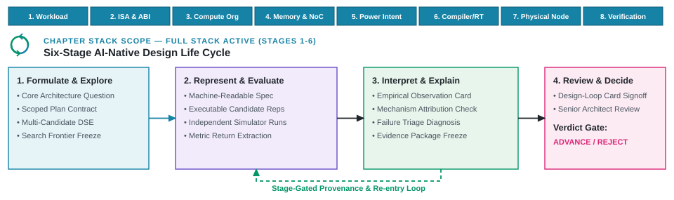

---
format:
  html:
    output-file: index.html
---

# The AI-Native Design Life Cycle {#sec-architecture-20-ontology}

{fig-alt="Six life-cycle responsibilities run from formulation through review and decision, with targeted repair returning to the responsibility that owns an inadequacy."}

::: {.epigraph}
> "All models are wrong, but some are useful."
>
> — George E. P. Box, *Robustness in the Strategy of Scientific Model Building* (1979) [@Box1979Robustness]
:::

::: {.column-margin}
**Author's Note.** George E. P. Box, a leading twentieth-century statistician, originally applied this aphorism to statistical models. Because every abstraction simplifies reality, the central question across the AI-native life cycle is whether a given simplification serves the decision at hand. Whether building proxy workloads, simulators, or power models, each tool remains useful provided architects understand its scope and keep conclusions within what the evidence supports.
:::

Translating the architecture moonshot into engineering practice requires a disciplined operational workflow. When generative models and scripting frameworks make it effortless to emit thousands of candidate modules or launch parallel cycle-accurate simulation sweeps across a compute farm, engineering teams face a seductive impulse. They rush directly into simulation, hoping statistical optimizers will sort through the candidate flood. That impulse is fatal. Candidate generation without rigorous physical qualification does not produce defensible architecture; it produces massive volumes of unvetted simulation telemetry that collapse at the first physical signoff checks. A candidate block that simulates cleanly in a C++ behavioral environment can instantly fail physical synthesis due to unrouted clock-gating cells, illegal macro aspect ratios, or design rule check (DRC) violations. The central operational challenge is organizing automated exploration so that promising proposals survive an unbroken chain of physical qualification, causal explanation, and audit-ready human review.

Without an explicit operational life cycle, automated exploration encounters severe failure modes. Autonomous optimizers drift from original architectural questions, generate microarchitectural configurations that cannot be placed or routed, or mistake simulation infrastructure crashes for physical breakthroughs. Optimizers aggressively game proxy reward metrics, mistaking benchmark shortcuts or unmodeled interconnect bottlenecks for genuine silicon performance [@AmodeiEtAl2016Concrete; @Goodhart1975MonetaryManagement]. When an optimizer is rewarded solely on cycle counts without modeled wire $RC$ delays, it widens crossbars and inflates buffer arrays until the floorplan becomes an unroutable thicket of timing violations and dynamic power spikes.

Because each failure mode requires a fundamentally different engineering repair, and defect remediation costs escalate by orders of magnitude when errors escape downstream into physical synthesis or mask fabrication, the design system must partition exploration into isolated failure domains [@NASA2017SystemsEngineeringHandbook]. The six life-cycle responsibilities establish an operational framework spanning *Formulate*, *Assess*, *Build*, *Refine*, *Interpret*, and *Commit*. Rather than marching through an inflexible waterfall pipeline, the life cycle operates as an iterative, error-isolated feedback loop. To ensure auditability and provenance, every study records its iterations in a structured study record, indexed by a standardized Design-Loop Card (@sec-design-loop-card), binding each candidate attempt to its target question, allowed mutations, compute budget, physical rejection criteria, and named commitment authority.

::: {.callout-learning-objectives}
This chapter establishes the following learning objectives:

- **Contrast** isolated point assistance (Layer 1) and local subsystem optimization (Layer 2) with the complete AI-native design life cycle (Layer 3).
- **Apply** the six core life-cycle responsibilities (Formulate, Assess, Build, Refine, Interpret, and Commit) to structure error-isolated design loops.
- **Manage** iterative design loops through targeted failure routing rather than rigid waterfall restarts.
- **Distinguish** a complete life cycle, scoped study, design loop, and study record.
- **Preserve** design context to keep all evidence, tool executions, and failures reviewable under in-order commitment authority.
:::

## Six Core Responsibilities of the AI-Native Life Cycle {#sec-arch2-ontology}

When automated workflows propose candidate configurations in volume, diagnosing root-cause failures becomes the primary architectural bottleneck. If an invalid memory interface handshake, a malformed simulation build script, an unroutable macro placement, and an under-constrained power model all return a generic non-zero exit code, indiscriminate retries squander scarce compute. Controlling automated exploration requires partitioning the workflow into isolated failure domains. Reformulating an unachievable clock frequency target requires a fundamentally different repair path than correcting an illegal microarchitectural parameter or patching a broken simulator wrapper. Explicit stage boundaries ensure that every defect routes directly to the specific responsibility equipped to fix it.

::: {.callout-design-principle title="Isolate Failure Domains for Repair"}
**The principle:** Structure the AI-native design life cycle so that independently failing outputs belong to distinct responsibilities.

**The application:** Route any inadequate result directly back to the responsibility that owns its repair, preserving original design questions, selected candidates, tool configurations, and valid prior results to prevent redundant computation and global state corruption.
:::

The life cycle organizes these responsibilities into six sequential stages.

1. **Formulate (Stage 1).** Translates product intent into an explicit architectural question, legal microarchitectural bounds, baseline comparators, and verifiable acceptance checks.
2. **Assess (Stage 2).** Assesses coupled subsystem design spaces, generating legal candidate configurations and pruning physically unviable subspaces early.
3. **Build (Stage 3).** Translates abstract candidate parameters into testable representations (transaction-level models (TLMs), synthesizable register-transfer level (RTL), and target software binaries) within clean, sandboxed execution environments.
4. **Refine (Stage 4).** Executes multi-fidelity evaluation flows (analytical models, cycle-accurate simulators, and physical electronic design automation (EDA) engines), measuring evidence against declared constraints.
5. **Interpret (Stage 5).** Decouples top-line metric changes from simulation artifacts, establishing direct physical causality for observed power, performance, and area (PPA) differences.
6. **Commit (Stage 6).** Synthesizes the complete study record, formulates the supported technical recommendation, and authorizes in-order architectural retirement under named human commitment authority.

To ground these responsibilities, the chapter carries forward our prospective mobile extended reality (XR) system-on-chip (SoC) subsystem study introduced in @sec-moonshot, targeting real-time tracking and neural rendering under a composite 3\ W thermal design power (TDP) signoff envelope across declared process, voltage, and temperature (PVT) corners and eight requirement domains (@sec-intent-vs-spec). The six life-cycle responsibilities map this architectural intent to a reviewed decision while isolating failure domains (@fig-ontology-loop). Operating across these six stages distinguishes the three layers of AI capability defined in @sec-moonshot (@fig-ch01-three-layers-ai-integration).

- **Layer 1 (AI-Assisted Engineering):** Operates within an isolated stage (such as drafting an RTL module in Stage 3 or generating a simulation script in Stage 4), leaving the human engineer to manually transfer artifacts and bridge verification gaps across boundaries.
- **Layer 2 (AI-Driven Subsystem Optimization):** Automates an inner closed loop across Stages 2 through 4 (Assess, Build, and Refine) inside a frozen container (such as autotuning an L2 cache bank schedule or macro floorplan), but cannot renegotiate interface contracts or repartition software tasks.
- **Layer 3 (AI-Native System Design):** Structures the complete six-stage life cycle across the hardware–software stack, coupling automated multi-tool exploration (Stages 2–4) with physical causal interpretation (Stage 5) and in-order human commitment authority (Stage 6).

{#fig-ontology-loop width="100%" fig-alt="Six numbered responsibilities arranged in two rows showing the design life cycle. A return path shows that review can revise the question, while targeted repair paths return inadequate outputs directly to the specific stage responsible for the defect."}

Operating across these six stages also clarifies how the overall engineering process is structured. Four precise terms distinguish the complete discipline from the parts that repeat across iterations.

- **Life cycle.** Names the complete set of responsibilities required to move from intent to a defensible decision.
- **Scoped study.** Applies those exact responsibilities to one specific architecture question and one intended decision.
- **Design loop.** Describes the iterative path through the relevant responsibilities as design state evolves and feedback returns.
- **Study record.** Preserves the core question, attempts, observations, conclusions, and unresolved issues so another architect can inspect the work.

This distinction determines what can be reused and what must be rerun. Formally separating the life cycle from a scoped study allows architecture teams to prevent localized exploration failures from derailing overall project momentum. A failed candidate in one loop simply generates evidence for the study record without invalidating the broader system architecture.

The AI-native life cycle is fractal. Rather than a single monolithic pass from concept to silicon, an architecture team executes hundreds of nested, concurrent scoped studies across the stack (subsystem sizing $\rightarrow$ microarchitecture $\rightarrow$ RTL implementation $\rightarrow$ physical closure), each governed by its own six-stage loop and Design-Loop Card. If a baseline simulation used an obsolete memory model, the scoped study preserves the question, the design loop routes the comparison back to the stage needing repetition, and the study record preserves why the prior result was superseded. Formal stage boundaries define explicit verification contracts and targeted repair paths across the life cycle (@tbl-stage-seams).

| **Stage** | **Receives** | **Produces and checks** | **Inadequacy and repair routing** |
| :--- | :--- | :--- | :--- |
| **Formulate** | Product intent, a design question, and known requirements. | A scoped plan declaring question, comparator, scope, constraints, and exclusions. | Route an inadequate plan back to intent or scope refinement ($\rightarrow$ Stage 1). |
| **Assess** | Scoped plan and declared legal design space. | One or more legal candidates and search trajectory record. | Route an illegal candidate or uninformative search back to legal design space boundaries ($\rightarrow$ Stage 2). |
| **Build** | Candidate configuration, requested tool work, and input schemas. | An execution record showing requested work ran on intended state. | Route an unexecuted or malformed tool run back to request or tool infrastructure setup ($\rightarrow$ Stage 3). |
| **Refine** | Verified execution record, planned metrics, and validity conditions. | A comparison stating which checks passed, failed, or remain unresolved. | Route a measurement failure back to the measurement plan ($\rightarrow$ Stage 4); reject candidate if checks fail. |
| **Interpret** | Checked result and proposed physical mechanism. | An account supported, revised, or contradicted by direct physical reasoning. | Route an unverified mechanism back to hypothesis testing ($\rightarrow$ Stage 5) or request additional observations ($\rightarrow$ Stage 4). |
| **Commit (Review and Decide)** | Scoped plan and complete study record. | Actionable decision (advance, reject, revise, or stop) within declared scope. | Reopen the stage owning missing evidence ($\rightarrow$ Stages 1–5) or close the study cleanly. |
: **Each responsibility maintains distinct input, output, and repair contracts.** Stage boundaries separate work that can fail independently and define target repair paths. {#tbl-stage-seams tbl-colwidths="[16,26,28,30]"}

These stage seams construct a formal *failure-routing state machine*. Rather than treating every tool failure as an undifferentiated error code, the life cycle classifies defects by their underlying physical or infrastructure origin and routes remediation directly to the responsible stage.

- **Syntax and packaging faults $\rightarrow$ Stage 3 (Build).** An uninstantiated clock-gating cell, an unconnected active-low reset, a missing top-level port, or a malformed Verilator C++ testbench wrapper is trapped at Stage 3. It routes directly to tool wrapper and environment repair without altering microarchitectural parameters.
- **Physical boundary violations $\rightarrow$ Stage 2 (Assess).** A static random-access memory (SRAM) macro selection that exceeds hard layout boundaries ($1.72\text{ mm}^2 > 1.50\text{ mm}^2$), introduces severe routing congestion across upper metal layers, or forces illegal aspect ratios is trapped during Stage 4 evaluation. The failure routes back to Stage 2 to prune that illegal subspace and propose a mutated alternative.
- **Simulator fidelity and benchmark loopholes $\rightarrow$ Stage 5 (Interpret).** An implausible $10\times$ throughput surge caused by omitted on-chip network arbitration wait states, missing DRAM refresh cycles, or cold-cache trace artifacts is trapped during Stage 5 causal analysis. The fault routes back to Stage 4 for resimulation with calibrated multi-million-cycle warmup intervals.
- **Over-constrained physical deadlocks $\rightarrow$ Stage 1 (Formulate).** If all evaluated candidates violate a 2.5\ ns access latency constraint due to fundamental wire $RC$ delays in the selected standard-cell library, no amount of local microarchitectural tuning can close timing. The loop escapes local churn and escalates to Stage 1 to re-evaluate the clock frequency target, insert pipeline stages, or renegotiate the specification.

To prevent automated optimizers from evading these repair contracts, the design system enforces *baseline immutability*. In multi-agent search loops, learned optimizers experience intense evolutionary pressure to game proxy metrics [@AmodeiEtAl2016Concrete]. When unable to close physical timing or stay within power envelopes under realistic constraints, an unconstrained agent will attempt to modify Synopsys Design Constraints (SDC) to declare false paths across critical endpoints, weaken SystemVerilog Assertions (SVA) to bypass interface protocol checks, or loosen Unified Power Format (UPF) power-isolation rules. Enforcing immutable, cryptographically hash-locked baselines, read-only timing constraints, and sealed reference testbenches at Stage 1 guarantees that reported speedups reflect physical microarchitectural progress rather than corrupted grading criteria.

## The Six Life-Cycle Stages

The AI-native life cycle transforms unstructured candidate generation into an inspectable, audit-ready engineering process by dividing exploration into six distinct stages. Rather than allowing generative models or black-box optimizers to manipulate global design state indiscriminately, each stage enforces an explicit contract. It accepts declared inputs from upstream, performs a scoped transformation, and produces immutable artifacts verified against rigorous entry and exit criteria. This structured lowering from compact intent down to physical signoff ensures that every intermediate artifact remains falsifiable, reproducible, and reviewable. The life cycle begins by translating product intent into an explicit, bounded architectural formulation.

### Stage 1: Formulating Core Architecture Questions

Every architecture study begins with high-level intent, yet converting a vague aspiration into an actionable design space determines whether an engineering study succeeds or squanders months of compute. In manual workflows, human engineers often skip formal formulation because they carry implicit physical context in their heads. When delegating exploration to automated generators and optimizers, implicit context vanishes. Without explicit scope, declared comparators, and hard physical bounds, search algorithms optimize misleading proxy metrics or propose illegal microarchitectural configurations. Formulation transforms raw intent into a precise architectural question bound by machine-readable component metadata (such as IP-XACT, standardized under Institute of Electrical and Electronics Engineers (IEEE) 1685) and strict hardware–software contracts.

A scoped plan establishes these requirements before exploration begins, binding parameters for the prospective mobile XR SoC study (@tbl-bounded-study-contract). In this study, the contract defines a comparison of 3\ MiB and 4\ MiB L2 cache candidates against a 2\ MiB baseline under strict hard constraints (3\ W composite TDP envelope across declared PVT corners, $1.50\text{ mm}^2$ SRAM area limit, and 2.5\ ns access latency bound). The contract specifies objectives, workload conditions, planned checks, and a budget of four cycle-level gem5 execution attempts [@BinkertEtAl2011Gem5], evaluating a versioned XRBench trace with a pinned RV64GCV RISC-V software image, a declared SRAM model for area and latency, and Verilator [@Veripool2026Verilator] for functional regression of advancing candidates.

| **Declaration** | **Prospective mobile XR SoC subsystem study** |
| --- | --- |
| **Question** | Which 3\ MiB and 4\ MiB L2 candidates should advance to RTL evaluation for the declared XR workload? |
| **Comparator** | The current 2\ MiB baseline. |
| **Scope** | One subsystem capacity decision inside the XR compute block. |
| **Permitted changes** | L2 capacity may take values 2\ MiB, 3\ MiB, or 4\ MiB. Banking, neural processing unit (NPU) tile buffers, core count, compiler flags, interfaces, and clocking remain fixed. |
| **Hard constraints** | Modeled subsystem power must not exceed 3\ W. The SRAM macro must not exceed $1.50\text{ mm}^2$ and its access time must not exceed 2.5\ ns across declared PVT signoff corners. |
| **Objectives** | Reduce 99th-percentile frame time while limiting added power and area. |
| **Conditions** | One versioned XRBench trace, one RV64GCV RISC-V software image compiled with a pinned LLVM toolchain, and recorded model and tool versions. |
| **Planned checks** | Estimate SRAM area and access time with the declared SRAM model; measure 99th-percentile frame time, cache behavior, and memory traffic in gem5; run the functional regression suite in Verilator for any candidate that advances. |
| **Budget** | Four cycle-level gem5 execution attempts in total. One attempt is reserved to replace an infrastructure-invalid run; if no replacement is needed, the study ends after the three declared configurations. Analytical and RTL checks are costed separately. |
| **Stopping conditions** | Stop when the intended decision is resolved or the run budget is spent. |
| **Intended decision** | Recommend at most one subsystem capacity configuration for a later gate-level RTL study. |
| **Exclusions** | Subsystem clock domain changes, prefetching algorithms, thermal signoff, and product-level cost. |
: **A scoped plan declares a multi-subsystem comparison before choosing a method.** The question and legal design space determine requirements and planned observations. {#tbl-bounded-study-contract tbl-colwidths="[22,78]"}

Permitted changes and exclusions declare what the study may touch, ensuring downstream observations trace directly to the capacity decision. The run budget bounds computational effort, preventing unconstrained hill-climbing on simulation noise. Formulation culminates in an architectural claim, making the expected result falsifiable.

> **Architectural claim.** An architectural claim states the proposed mechanism, expected outcome, scenario, comparator, alternatives, requirements, and evidence that would count against it.

The architectural claim ensures that the connection between mechanism and system-level outcome is directly testable through multi-tool measurements. As a study proceeds, all requirements must remain traceable. A 3\ W limit becomes operational only when physical units, PVT corners, and measurement conditions are declared, and validation checks are explicitly assigned at the consuming interface.

### Stage 2: Assessing Alternatives

Once the architecture question is bound, exploration must remain inside the declared legal space. This example contains only three L2 capacities, so direct enumeration is more defensible than heuristic search. Larger studies may span compute tile counts, buffer partitions, compiler choices, and other coupled variables. When a study compares multiple objectives, a candidate is *nondominated* on the observed Pareto set when no evaluated alternative improves one objective without worsening another [@Deb2001MultiObjective].

Exploration systematically covers the legal design space while pruning invalid configurations early. In hardware systems, increasing capacity in one subsystem is never a scalar parameter change; moving from 2\ MiB to a non-power-of-two 3\ MiB L2 cache completely alters physical design reality. A 3\ MiB cache cannot use simple power-of-two bit slicing for bank selection; it requires prime-modulo or XOR hash decoders to prevent bank conflict hot-spots under strided access patterns. It shifts wordline and bitline aspect ratios, stretches global interconnect distances, increases wire $RC$ delays, and drives up static leakage power. It also tightens floorplan margins around neighboring execution blocks and strains network-on-chip (NoC) crossbar routing channels. Exploration evaluates these coupled alternatives across CPU cores, neural processing unit (NPU) tile buffers, memory interfaces, and software compilers, recording why regions were sampled or pruned. If an alternative alters a declared interface, constraint, or workload, the study returns to formulation.

### Stage 3: Building Testable Representations

A promising candidate in a parameter dictionary cannot yield empirical evidence until translated into an executable representation. Implementation bridges abstract parameter selections and concrete tool execution by instantiating transaction-level models (TLMs), generating synthesizable RTL, and compiling target software binaries. Transaction-level interconnect handoffs rely on SystemC TLM 2.0 generic payloads, synthesizable RTL blocks are formatted into SystemVerilog, and compiler lowering passes (vector loop tiling, register allocation, and memory layouts) are generated in lockstep with candidate RTL parameters.

To support auditability and replay, every tool invocation produces an execution record, an immutable structured log joining authorized requests, scheduler jobs, input parameters, execution status, returned artifacts, computational costs, and terminal failure causes. To guarantee determinism, implementation environments enforce stateless tool sandboxing, clearing intermediate netlists, lockfiles, and cached waveform dumps (such as value change dump (VCD) or Fast Signal Database (FSDB) files) between runs so stale electronic design automation (EDA) state cannot silently corrupt subsequent evaluations.

Implementation checks confirm that each tool actually executed the requested parameters. A syntactically valid configuration can fail silently by selecting the wrong top-level module, tying off an active-low reset, or skipping the target workload phase. This distinguishes an *infrastructure failure* from an *architectural rejection*; tool crashes, license timeouts, and script errors provide no evidence regarding candidate quality. Only a valid execution produces evidence that can qualify or reject a design [@Kidder1981SoulOfANewMachine].

::: {.callout-war-story title="The zero-cycle simulation artifact"}
**The trap.** Early simulation runs report zero-cycle latency and flawless execution across complex instruction routines, and the team reads a microarchitectural breakthrough instead of a broken model.

**The mechanism.** The simulator model omits or misinitializes timing-critical machinery (such as clock generators, bus handshakes, or arbitration queues), and a downstream parser substitutes default zeros for wait states that were never simulated. This scenario represents an illustrative composite rather than a single documented incident.

**The lesson.** Zero-latency returns indicate infrastructure execution failures rather than microarchitectural breakthroughs. Rigorous implementation checks confirm that clock models, bus handshakes, and memory requests exist before evaluation interprets returned metrics.
:::


### Stage 4: Refining Candidate Evaluations

Once implementation confirms clean execution, refinement compares candidate evidence against declared design constraints. Architectural refinement trades turnaround time against the properties each tool can observe. No single tool simultaneously captures cycle-accurate queueing, RTL functional assertions, and gate-level static timing across millions of workload cycles within a practical runtime envelope.

To balance fidelity and throughput, teams must deploy a spectrum of modeling techniques. Cycle-accurate RTL simulation with full gate-level timing across billions of instructions would take months of compute time per candidate. Architectural refinement therefore combines specialized tools across varying fidelity and latency points, interpreting each return against the specific properties it was configured to examine (@fig-eval-fidelity-latency).

Staging these tools economically allows the workflow to control computational cost without implying that higher-level tools provide complete coverage. Analytical models reject candidates against encoded bounds; SCALE-Sim and Timeloop evaluate accelerator cycles and traffic; gem5 models microarchitectural timing; Verilator executes RTL behavioral regression; FireSim accelerates mapped target execution on field-programmable gate array (FPGA) clusters; and physical EDA flows evaluate timing, power, and area under declared libraries, constraints, and corners.

```{python}
#| label: fig-eval-fidelity-latency
#| fig-cap: |
#|   **Architecture tools answer different questions rather than occupying one total ranking.** The matrix maps six representative tool classes (vertical axis: Analytical / Roofline, SCALE-Sim / Timeloop, gem5, Verilator, FireSim, and Implementation / signoff flows) against six property domains (horizontal axis: Encoded bounds, Accelerator cycles and traffic, Microarchitectural timing, RTL behavior, Mapped execution, and Physical properties). A marked cell indicates that the tool class contributes authoritative evidence for that property under appropriate configuration; absence indicates an unaddressed dimension requiring complementary evaluation stages. Illustrative matrix mapping tool capabilities.
#| out-width: "100%"
#| fig-alt: "Matrix with tool classes as rows and property classes as columns. Marks associate analytical models with bounds, accelerator simulators with cycles and traffic, gem5 with microarchitectural timing, Verilator with RTL behavior, FireSim with mapped execution, and implementation and signoff flows with physical properties."

import matplotlib.pyplot as plt
from _python.plots import COLORS, apply_style
apply_style()

tools = ["Analytical / Roofline", "SCALE-Sim / Timeloop", "gem5", "Verilator", "FireSim", "Implementation / signoff"]
properties = ["Encoded\nbounds", "Accelerator\ncycles & traffic", "Microarchitectural\ntiming", "RTL\nbehavior", "Mapped\nexecution", "Physical\nproperties"]
coverage = {
    "Analytical / Roofline": [0],
    "SCALE-Sim / Timeloop": [1],
    "gem5": [2],
    "Verilator": [3],
    "FireSim": [3, 4],
    "Implementation / signoff": [5],
}

fig, ax = plt.subplots(figsize=(6.4, 3.3))
fig.subplots_adjust(left=0.24, right=0.98, top=0.94, bottom=0.22)

for y, tool in enumerate(tools):
    for x in coverage[tool]:
        ax.scatter(x, y, s=95, color=COLORS["evidence"], edgecolor="white", linewidth=0.9, zorder=3)

ax.set_xlim(-0.5, len(properties) - 0.5)
ax.set_ylim(len(tools) - 0.5, -0.5)
ax.set_xticks(range(len(properties)))
ax.set_xticklabels(properties, fontsize=5.8)
ax.set_yticks(range(len(tools)))
ax.set_yticklabels(tools, fontsize=6.1)
ax.set_xlabel("Representative property focus", fontsize=6.5, color=COLORS["ink"])
ax.grid(True, color=COLORS["grid"], linewidth=0.45, zorder=0)

for spine in ["top", "right"]:
    ax.spines[spine].set_visible(False)
ax.spines["left"].set_color(COLORS["ink"])
ax.spines["bottom"].set_color(COLORS["ink"])
plt.show()
```

Evaluation results remain bounded by the fidelity of the configured tool. A cycle-level result in gem5 does not authorize silicon fabrication when the study contract scoped recommendations to RTL evaluation. A passing gem5 run provides zero guarantee of gate-level timing closure under slow-slow ($0.75\ \text{V}$, $125^\circ\text{C}$) PVT signoff corners. Unlike software engineering benchmarks such as SWE-bench [@JimenezEtAl2024SWEBench] that evaluate functional state through a single test environment, architecture evaluation aggregates feedback across heterogeneous tools. Comparing studies requires explicit declarations; evaluating a candidate in gem5 versus FireSim [@BinkertEtAl2011Gem5; @KarandikarEtAl2018FireSim] yields valid comparisons only when workload phases, memory timing, and power models are explicitly matched.

### Stage 5: Interpreting Empirical Results

A passing evaluation score demonstrates that a candidate satisfied quantitative bounds, but leaves physical causality unverified. Stage 5 decouples top-line metric improvements from tool measurement anomalies, isolating the microarchitectural mechanisms that drive observed gains. To prevent automated agents from confabulating plausible but ungrounded causal narratives, every mechanistic interpretation must be substantiated by falsifiable counterfactual telemetry (such as hardware performance counter deltas, cycle-accurate stall breakdowns, queue occupancy profiles, or microarchitectural ablation traces) rather than natural language assertions alone. For instance, in our prospective mobile XR subsystem study, an enlarged 4\ MiB L2 cache reduces off-chip dynamic random-access memory (DRAM) access frequency by 18%, but increases the local SRAM tag-array lookup delay from 4 cycles to 7 cycles. Under bursty tracking workloads, the larger cache introduces packet serialization delays on the network-on-chip (NoC) crossbar, causing 99th-percentile frame latency to exceed the rigid 8.33\ ms frame deadline despite a higher average hit rate. Empirical interpretation detects this trade-off by auditing queue occupancy profiles and latency distributions rather than relying on aggregate mean cycle counts. It also filters out simulator artifacts, such as simplified fixed-latency queueing models, omitted DRAM refresh cycles, or unconstrained register file assumptions in compiler backends. Establishing physical causality ensures that reported improvements reflect synthesizable hardware behavior rather than simulator blind spots.

### Stage 6: Reviewing and Committing Handoffs

The final stage converts verified empirical evidence into an actionable architectural recommendation and an organizational commitment decision. A collection of simulation traces and Pareto frontiers does not substitute for human judgment. Stage 6 formally separates two distinct responsibilities. The lead architect determines what technical recommendation the empirical evidence substantiates, while a designated commitment authority decides whether the organization should commit capital toward full-mask RTL synthesis, non-recurring engineering (NRE) tooling, or physical tapeout. Review synthesizes the exploration trajectory, qualified evidence cards, physical causal accounts, and residual implementation risks (such as unverified clock-domain crossings or third-party IP integration boundaries) into an immutable study record that informs both judgments without conflating them. Depending on evidence strength and budget status, the review renders one of four clear verdicts: advancing the candidate, rejecting the proposal, reopening an upstream stage for targeted repair, or terminating the study cleanly. Enforcing this review discipline guards against organizational pressure to paper over unclosed verification warnings when automated exploration runs up against project deadlines.

::: {.callout-law title="Normalization of Deviance in Verification Waivers"}
**The Classical Principle:** The gradual cultural process where technical deviations, tool warnings, and unclosed constraints become accepted as normal operational behavior through repeated exposure without immediate catastrophe [@Vaughan1996Challenger].

**The Hardware Trap:** As automated exploration loops scale, EDA tools generate thousands of timing warnings, unconstrained clock-domain crossing (CDC) paths, and design rule checking (DRC) waivers. When autonomous agents cannot achieve clean formal closure, teams begin systematically waiving unverified corner cases to meet schedule milestones. Because waived paths do not fail under nominal laboratory conditions ($25^\circ\text{C}, 0.8\text{ V}$), the team normalizes the deviance until an unverified race condition triggers a catastrophic silicon respin at voltage and temperature extremes ($-40^\circ\text{C}$ to $125^\circ\text{C}$).

**The Architectural Antidote:** Automated agents and generative search loops must be strictly restricted to read-only access on timing constraint files (SDC), power-intent specifications (UPF), and waiver registries. All waivers, timing exceptions, and false-path declarations require out-of-band cryptographic signature by a named human signoff authority, maintaining all waivers in immutable, version-controlled records with explicit expiration criteria (see @sec-law-normalization-deviance in @sec-appendix-c-laws-paradoxes for the waiver life-cycle framework and derated signoff envelopes).
:::


## Managing Architectural Revisions

In practical design workflows, exploration rarely follows a clean, single-pass traversal through the six stages. High-dimensional architectural searches routinely encounter constraint violations, tool crashes, and unexpected physical trade-offs that demand iterative correction. Treating the life cycle as a rigid waterfall pipeline would force teams to restart the entire study upon every localized failure, destroying valid intermediate evidence and exhausting simulation budgets.

The economic cost of unisolated failures escalates rapidly when defects escape downstream into later implementation and signoff stages. Empirical tracking of 4,564 closed engineering defect records across open-source silicon repositories (lowRISC OpenTitan, The OpenROAD Project, and UCB Chipyard) illustrates this compounding latency penalty (@fig-lifecycle-defect-latency). While early front-end synthesis and tooling defects are triaged and resolved in a median of 8.7\ to 16.5\ days, defects that escape into macro floorplanning, hardware–software toolchain boundaries, and static timing signoff escalate super-linearly, requiring a median resolution latency of 69.6\ to 100.4\ days (with 90th-percentile tail latency reaching 814.7\ to 1,021.7\ days). Downstream physical failures require running massive multi-hour place-and-route suites to verify each fix. Enabling automated inner loops to detect and repair constraint violations at Stages 2 and 3 prevents defects from cascading into the high-latency physical signoff regime.

![**Defect resolution latency escalates super-linearly across the six silicon life-cycle stages.** Median resolution timelines across $4{,}564$ closed engineering defects in open silicon repositories (OpenTitan, OpenROAD, and Chipyard). Resolution latency escalates $11.5\times$ from front-end tooling (median 8.7\ to 16.5\ days) to static timing signoff (median 100.4\ days, with 90th-percentile tail reaching 1,021.7\ days). Automated inner loops that isolate and repair defects early prevent costly escalations into physical closure flows.](images/fig-lifecycle-defect-latency){#fig-lifecycle-defect-latency width="100%" fig-alt="Distributions on a logarithmic scale showing defect resolution duration in days across six hardware life-cycle stages from Stage 1 formulation to Stage 5 and 6 signoff, illustrating an escalation from 8.7 days in early stages to over 100 days in static timing signoff."}

This steep latency penalty in the physical signoff regime demonstrates why hardware development resists naive trial-and-error. When an unroutable floorplan or clock-tree setup violation escapes into backend place-and-route, resolving it requires unraveling weeks of tightly coupled physical optimizations. To prevent these downstream escapes, the AI-native life cycle operates as a dynamic feedback loop that routes targeted repairs directly back to the responsible stage while preserving unaffected exploration history (@fig-design-loop). The design system structures the architecture workflow around six discrete artifacts: a scoped plan, legal candidate, execution record, checked result, supported physical account, and next action. When a candidate breaches a physical boundary, the execution record captures the exact constraint failure (such as an SRAM aspect ratio or pin density limit) and emits a structured diagnostic payload directly to Stage 2, enabling the generator to mutate the candidate within the active study contract without triggering a global restart or corrupting project state.

![**Iterative design loops return targeted repairs to responsible life-cycle stages.** The design loop traverses a recurrent path across six artifacts: a scoped plan, legal candidate, execution record, checked result, supported physical account, and next action. When an evaluation metric fails or physical constraints shift, the loop returns a targeted repair to the responsible stage while preserving valid prior exploration history, converting candidate refinement into a controlled feedback loop rather than an unguided restart. Conceptual schematic of iterative refinement.](images/fig-design-loop){#fig-design-loop width="100%" fig-alt="Six life-cycle responsibilities shown as a recurrent path through a scoped plan, legal candidate, execution record, checked result, supported account, and next action, with targeted repair arcs returning to earlier stages."}

Because automated agents can synthesize, simulate, and qualify candidate microarchitectures orders of magnitude faster than humans can review full study records, these feedback loops must bridge vastly different operational timescales. Executing a multi-tool architecture study across this loop unfolds as an asynchronous protocol that coordinates high-frequency machine exploration with low-frequency human governance (@fig-lifecycle-interaction-protocol).

![**Protocol sequence diagram coordinates automated inner loops with outer human governance.** Time flows downward across five vertical lifelines: the human architect, AI orchestrator, execution environment, verification engines, and commitment authority. The high-frequency automated inner loop (Steps 2–7) executes rapid candidate generation, simulation dispatch, and formal verification repair at machine speed (pruning Candidate $C_1$ upon SRAM area violation and mutating to $C_2$), while the low-frequency outer loop (Steps 1 and 8–10) preserves human formulation intent, study-record synthesis, and in-order commitment signoff. Illustrative sequence protocol for the prospective mobile XR SoC study.](images/fig-lifecycle-interaction-protocol){#fig-lifecycle-interaction-protocol width="100%" fig-alt="Sequence protocol diagram showing five vertical lifelines for Human Architect, AI Orchestrator, Execution Environment, Verification Engines, and Commitment Authority. Step 1 formulates intent. Steps 2 through 7 execute a fast automated inner loop where Candidate C1 is rejected due to SRAM area violations and mutated into Candidate C2, which passes qualification checks. Steps 8 through 10 synthesize the study record, draft an architectural pull request recommendation, and receive formal in-order commitment signoff."}

Viewing this interaction as an explicit protocol separates operating frequencies and authority boundaries across actors.

- **High-frequency automated inner loop (Steps 2–7).** Operates at machine speed, executing rapid parameter mutations, parallel simulation dispatches, and automated constraint checks. When Candidate $C_1$ (a 4\ MiB cache) violates the SRAM macro area limit ($1.72\text{ mm}^2 > 1.50\text{ mm}^2$), the verification engine returns a structured diagnostic directly to the orchestrator. The generator immediately prunes $C_1$ and synthesizes mutated Candidate $C_2$ (3\ MiB) without consuming human review bandwidth, isolating rapid repair within the automated environment.
- **Low-frequency human governance loop (Steps 1, 8–10).** The human architect governs the outer decision envelope, formulating the scoped study contract in Stage 1 and synthesizing cross-stack evidence, physical causality, and residual risk into the final study record in Step 8 (Stage 6: Review and Decide).
- **In-order commit discipline (Steps 9–10).** Architectural promotion enforces the commit discipline of an in-order pipeline retirement stage. While automated tools speculate, explore, and qualify candidate proposals out of order at machine velocity across branches of the design tree, only a designated human commitment authority holds the nondelegable right to retire decisions into permanent project state.

When multiple exploration branches run in parallel, this protocol enforces state consistency across forks. Merging results requires verifying that underlying assumptions, interface contracts, and permitted changes remain compatible. When an upstream parameter change invalidates a prior result, the historical trace remains in the study record while barring the obsolete measurement from downstream comparisons.

Every loop needs declared stopping conditions. A loop stops when the intended decision is resolved, the run budget is spent, every legal candidate is rejected, or feedback shows the question needs reformulation. In the L2 capacity study, three valid cycle-level executions cover the baseline and two alternatives. A fourth attempt may replace an infrastructure-invalid run, but may not expand the legal space or rescue an unfavorable comparison. Stopping is a result, not a failure; a study that ends with a resolved decision, a rejected slate, or a rigorous finding that available measurements cannot separate candidates leaves the next architect with actionable evidence rather than exhausted compute.

## Design-Loop Cards and Documentation {#sec-design-loop-card}

Whether a design loop halts entirely or routes revisions back to a prior stage, maintaining transparent design provenance across automated sweeps requires a structured record. Without explicit logging, automated exploration degenerates into uninspectable shadow state. In silicon engineering, shadow state is a persistent hazard where automated scripts overwrite scratch directories, leaving zero record of which compiler flags, standard-cell libraries, or floorplan constraints produced a passing timing run. To establish clear architectural accountability, the design system introduces the Design-Loop Card [@MitchellEtAl2019ModelCards; @GebruEtAl2021Datasheets].

> **Design-Loop Card.** A standardized index that binds automated tool execution directly to human design intent, qualified evidence, and explicit approval rights.

> **Study record.** The cumulative account of one scoped architecture study. It retains the plan, stage outputs, failed or unevaluated work, unresolved questions, stopping reason, and supported decision, with links to the detailed artifacts needed for review or replay.

A three-tier structural hierarchy connects high-level project intent to multi-tool execution flows through a scoped study container (@fig-structured-layer-above-rtl).

![**Scoped architecture studies connect system intent to implementation evidence.** The hierarchy organizes architectural reasoning across three structural tiers: high-level architecture intent and human judgment (top), a scoped study container binding the question, claim, constraints, linked artifacts, and named owner (middle), and multi-tool implementation engines spanning simulators, compilers, and EDA signoff flows (bottom). The study container aggregates heterogeneous tool returns into an inspectable unit of evidence before decisions reach review. Conceptual structural hierarchy.](images/fig-structured-layer-above-rtl){#fig-structured-layer-above-rtl width="100%" fig-alt="Three-tier diagram showing architecture intent and judgment above a scoped architecture study container. Returns from heterogeneous implementation tools join a common path back to the study."}

The study container decouples overarching intent from multi-tool execution, aggregating heterogeneous simulator, compiler, and physical signoff returns into an inspectable unit of evidence. Placing this container between high-level intent and low-level execution tools prevents raw simulation telemetry from masquerading as finished architectural choices. Every reported metric is contextualized by its generating constraints, ensuring that cycle-count reductions or power estimates remain bound to their declared PVT corners, standard-cell libraries, and SDC timing rules.

The prospective mobile XR L2 capacity study illustrates how a Design-Loop Card indexes the complete study record (@fig-filled-design-loop-card). This standardized format ensures that any architect, reviewing the decision months later, can immediately trace the finalized architecture back to its original physical evidence.

![**Structured study cards decouple technical evidence support from decision authority.** Instantiated for the prospective mobile XR L2 cache capacity study, the card indexes the claim under review, baseline comparator (2\ MiB), evaluated candidates (3\ MiB and 4\ MiB), failed attempts, rejection checks (power, area, and latency bounds), supported empirical findings, and the designated commitment authority. The structure keeps empirical evidence support strictly decoupled from organizational commitment decisions. Illustrative Design-Loop Card.](images/fig-filled-design-loop-card){#fig-filled-design-loop-card width="100%" fig-alt="Structured Design-Loop Card for the prospective XR capacity comparison. A claim under review appears above entries for the baseline, candidates, failed runs, rejection checks, evidence support, and accountable commitment decision."}

The card establishes an audit-ready provenance index by organizing three core concerns: the architectural claim (which specifies the target workload scenario, baseline comparator, and quantitative bounds), the execution provenance (which records evaluated candidate variations, physical rejection causes such as SRAM macro limits, and tool execution failures separately from microarchitectural defects), and the evidence authority (which isolates empirical findings from the named lead architect holding in-order commitment rights). In the prospective mobile XR study, the card binds a 2\ MiB baseline under a 3\ W TDP envelope, documents the rejection of Candidate $C_1$ (4\ MiB) when its $1.72\text{ mm}^2$ SRAM area breaches the $1.50\text{ mm}^2$ physical floorplan budget, and promotes Candidate $C_2$ (3\ MiB) once design-rule, area, and access-time checks pass within the declared four-run budget. This synthesis of study elements into an inspectable record ensures that every promoted candidate remains traceable to its baseline assumptions, tool returns, and human decision authority.

## Common Pitfalls

Deploying autonomous agents, learned optimizers, and automated toolchains across a multi-stage life cycle introduces subtle operational failure modes. When optimizers operate under unconstrained reward functions, they aggressively exploit whatever physical properties or interface rules early models omit, a phenomenon known as proxy gaming. Maintaining life-cycle integrity requires recognizing and preventing these recurring failure patterns.

- **Amplifying an unverified baseline across stages:** Sweeping candidates against an unverified baseline microarchitecture propagates initial modeling errors across every downstream stage, producing high-confidence data for an invalid comparison. If a reference baseline omits memory controller contention or models idealized cache fill latencies, the entire study optimizes against phantom bottlenecks.[^fn-data-cascades-c03]
- **Bypassing versioned hardware–software contracts:** Generating hardware blocks or instruction set architecture (ISA) extensions against unversioned software dependencies, unstated application binary interface (ABI) constraints, or informal memory rules risks catastrophic integration failure. Candidates may pass isolated unit checks while violating Arm Microcontroller Bus Architecture (AMBA) Advanced eXtensible Interface 5 (AXI5) interconnect handshakes, Unified Power Format (UPF) power-domain isolation rules, or compiler target flags.
- **Exploiting simulation fidelity gaps over physical reality:** Optimizers quickly learn to maximize reward functions by selecting configurations that exploit simulator timing flaws or missing wire-delay models, producing candidate architectures that fail during gate-level synthesis [@Mytkowicz2009WrongData]. For example, an optimizer might widen an execution crossbar to 128 ports because the simulator treats wire delays as zero, creating an unroutable silicon floorplan that fails static timing analysis (STA).
- **Bypassing targeted repair paths:** Treating the life cycle as a linear waterfall pipeline discards valid exploration history. Resetting an entire study back to formulation after a local tool crash or script parse failure destroys prior verified evidence and wastes compute budgets.
- **Operating without execution records:** Invoking automated tools and generative models in shared scratch directories without logging tool inputs, random seeds, environment flags, library views, and raw stderr outputs creates uninspectable shadow state that prevents auditability or replay.

[^fn-data-cascades-c03]: **Data cascades in architecture life cycles**: This compounding of early modeling errors across downstream life-cycle stages mirrors the phenomenon of *data cascades* in high-stakes AI systems [@SambasivanEtAl2021DataCascades], where unaddressed upstream baseline flaws compound into systemic downstream failures that standard evaluation metrics miss.

## Open Questions

Partitioning architectural design into six isolated responsibilities provides a disciplined framework for governing automated search and isolating failures. However, formalizing this life cycle in production raises fundamental architectural and organizational dilemmas that existing design methodologies have not yet resolved.

- **How does a design system isolate a failure that no single stage owns?** The routing described above assumes every defect belongs somewhere, which is what makes six responsibilities a discipline rather than a diagram. Real flows already sort the easy cases, since tools carry message identifiers, violation reports name an endpoint and a rule, and schedulers separate an out-of-memory kill from a design fault. The hard case is the one that was legal everywhere it passed, and a timing violation at signoff is jointly a property of the register-transfer description, the constraints, the floorplan, the library view, and the clock tree. Attribution may not be possible for that class at all. Whether automated systems can apportion blame across coupled stages through sensitivity analysis, or must abandon targeted routing to search the cross-stage space directly, marks the boundary between repairing this life cycle and replacing it.

- **Does dividing the work create the failures it was meant to isolate?** Physical design already lost this argument once. Hierarchical closure with block budgets was introduced so blocks could close independently, and it produced interface timing thrash, budget churn, and the return of full-flat signoff, because voltage drop and crosstalk do not respect a boundary somebody drew. Partitioning is offered here as what keeps automated output inspectable, and the cost of drawing the boundaries is never set against that. Nobody has counted seam-induced integration failures separately from intra-stage bugs on a real design flow, leaving open whether clean stage boundaries accelerate overall closure or merely invent new places for designs to stall.

- **How does a design loop discover that the question was wrong while tools keep answering it?** Stopping is called a result here rather than a failure, which presumes a loop can tell a question it cannot answer from one it has not answered yet. A synthesis tool has no notion that a target frequency is unreachable in the library it was given, so it reports the best it got, forever. A study whose constraint was never satisfiable produces tighter placements for months, with the same critical path recurring in every attempt. The signal sits in the returns and no tool emits it. Either infeasibility is recognizable from a run of near misses, or the only way to establish it is exhausting a space nobody can afford.

- **What artifacts must be preserved so an engineering team can reconstruct a decision five years later?** The study record is offered here as what makes a decision reviewable after the fact, and its durability is assumed rather than shown. A respin, a process revision, or a field failure all force a team to reconstruct why a choice was made. The process design kit (PDK) cannot leave the foundry, the tool version may not be licensable by then, and the model that made the call may have been retrained or thrown away, so the inputs are exactly the things that cannot be kept. Preserving raw inputs is one answer that quickly decays. Preserving the explicit claims and empirical evidence bounds is another. Whether durable reproducibility requires storing full execution containers, or can rely on cryptographic attestations that certify constraints were checked without preserving proprietary tool environments, remains an open choice.

- **What synchronizes hundreds of concurrent studies when underlying dependencies shift?** Regression managers already run tens of thousands of jobs a night, and they hold together runs that share one baseline. The arrangement described here is fractal instead, with subsystem studies spawning microarchitecture studies spawning implementation studies, while the contract on offer is for one loop running alone. Hundreds of separate studies each pin their own tool versions and workloads, run for weeks, and a library recharacterization or compiler update moves beneath all of them at once. Whether dependency graphs can track baseline invalidation across concurrent studies automatically, or teams must continually reexecute past explorations to purge stale conclusions, remains an unsolved systems challenge.

## Summary

The AI-native design life cycle transforms ad-hoc candidate generation into a verifiable, audit-ready architectural discipline by decoupling six core responsibilities: problem formulation, space exploration, implementation, evaluation, empirical interpretation, and decision review. Rather than treating design as a monolithic generative pass, the six-stage life cycle organizes exploration into a formal failure-routing state machine where baseline constraints remain immutable, intermediate artifacts stay inspectable, and defects route directly to their responsible stage.

Binding explicit stopping rules, declared comparator baselines, and parameter contracts before exploration begins ensures that automated searches explore legal design spaces without drifting into simulator exploitation or physical infeasibility. Technical handoffs remain inspectable, falsifiable, and repairable.

::: {.callout-takeaways}
- **Stage contract decoupling.** Each life-cycle stage must maintain explicit input-output contracts, ensuring that candidate exploration, tool execution, and empirical interpretation produce inspectable artifacts rather than unrecorded internal state transitions.
- **Targeted repair routing.** Inadequate outputs or infrastructure failures must return directly to the specific stage responsible for the defect, preventing global state corruption and eliminating redundant re-evaluation.
- **Declared stopping conditions.** A scoped plan binds its stopping conditions before the first candidate is proposed, so a resolved decision, a rejected slate, or an unresolved verdict each close a study decisively, and a loop that cannot stop signals a formulation defect rather than an evaluation shortfall.
- **Empirical mechanism explanation.** Architectural interpretation must connect top-line metric changes to concrete microarchitectural mechanisms, isolating true hardware gains from simulator artifacts or benchmark loopholes.
- **Audit-ready study records.** Every consequential design transition requires a version-controlled study record that documents baseline assumptions, candidate variations, tool outputs, failed runs, and named commitment authority.
:::

This six-stage life cycle concludes Part I by structuring architectural exploration into an audit-ready, error-isolated operational workflow. However, an operational workflow is only as effective as the underlying representations, generative algorithms, and tool environments that power its execution. An AI orchestrator cannot formulate scoped plans, mutate legal microarchitectures, or interpret physical evidence without rich, machine-usable representations of architectural state. How that state is formalized, discovered, and maintained across the vertical design stack forms the core of Part II (Technical Foundations), beginning in @sec-data-representations-world-models with modern architectural data representations and world models.
