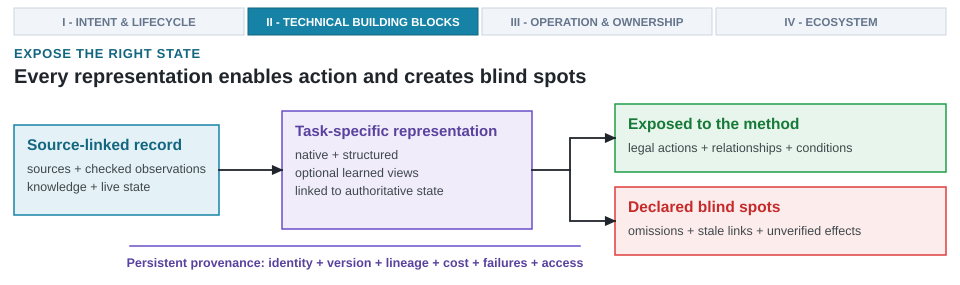

---
format:
  html:
    output-file: index.html
---

# Data, Knowledge, and Representation {#sec-data-representations-world-models}

{fig-alt="A source-linked project record feeds a task-specific representation that exposes some properties while declaring blind spots and retaining provenance."}

::: {.epigraph}
> "The limits of my language mean the limits of my world."
>
> — Ludwig Wittgenstein, *Tractatus Logico-Philosophicus* (1922) [@Wittgenstein1922Tractatus]
:::

::: {.column-margin}
**Author's Note.** Ludwig Wittgenstein, an influential philosopher of language, tied the boundaries of language to the limits of human thought. The principle for architecture data is equally direct: an automated method can only reason about hardware design states explicitly exposed to it. If a representation omits a coherence assumption, software contract, or thermal limit, no search loop can deliberately preserve it.
:::

Architecture results cannot be reduced to isolated numbers and labels. An AI-native design system must resolve a governing tension: what hardware state must be preserved when data originates from shifting designs, expensive tool runs, diverse workloads, and sources that often disagree? As the foundational entry to Part II (Technical Foundations), representation defines the semantic boundary between physical semiconductor realities and automated design algorithms. A cycle count, timing slack report, or power estimate is never an unconditioned scalar; it is an observation inextricably bound to a specific register-transfer level (RTL) revision, software binary, workload trace, tool version, and physical operating corner. Even if a generated candidate's syntax mimics valid hardware, a single dropped clock gate, unhandled reset state, or flawed protocol handshake renders the entire design useless.

Architecture data spans disparate formats: natural-language specifications, SystemVerilog netlists, compiler intermediate representations (IRs), simulation event traces, formal assertions, and electronic design automation (EDA) signoff logs. Engineering review notes and rejected alternatives preserve human design rationale that never appears in a tool report. These sources vary across ten orders of magnitude in data volume, while differing sharply in acquisition cost, access latency, physical coverage, and ground-truth authority.

A *representation* denotes the structural form that exposes selected properties of a hardware design to a given computational method. Representing a design using flat tokens, typed graphs, spatial layouts, or learned embeddings dictates which structural relationships remain visible, which mutations are legal, and which failure modes downstream optimizers fail to notice [@BengioEtAl2013RepresentationLearning]. AI-native design requires both exact discrete semantics to drive physical EDA tools and rich continuous feature spaces to guide learned surrogates.

Raw design collateral becomes actionable data only after establishing immutable identities, aligning measurement units, recording acquisition conditions, and verifying that tool returns reflect declared properties. Verified facts distill into durable project knowledge, while active parameters remain live project state evolving alongside checked-in code, software workloads, and physical constraints. Machine-usable hardware representations preserve these explicit links within the six-stage design life cycle (@sec-architecture-20-ontology), connecting upstream candidate state to downstream search methods, tool execution, and verification feedback.

::: {.callout-learning-objectives}
This chapter establishes the following learning objectives:

- **Contrast** context-bound architectural observations $\mathcal{O} = \langle s_{\text{design}}, w_{\text{workload}}, \tau_{\text{tool}}, \kappa_{\text{corner}}, y_{\text{metrics}} \rangle$ with generic i.i.d. machine learning samples across operating corners, tool provenance, and multi-tier data scarcity.
- **Quantify** serial simulation acquisition costs ($T_{\text{serial}}$) and dynamic workload phase behaviors ($w_{\text{BBV}}$) as environment state conditioning vectors across evaluation hierarchies.
- **Construct** multi-fidelity hardware datasets that preserve negative tool runs, right-censored physical boundary limits ($y \ge y_{\text{limit}}$), and failure taxonomies to eliminate survivorship bias.
- **Differentiate** durable architectural knowledge from live project state under explicit freshness rules to prevent split-brain causality during generative design.
- **Evaluate** representations across the three operational layers by analyzing spatial-semantic dilation ($\Delta_{\text{token}} \propto N^{0.91}$) and progressive dialect lowering in Circuit IR Compilers and Tools (CIRCT) Multi-Level Intermediate Representation (MLIR) (`linalg` $\to$ `memref`/`affine` $\to$ `hw`/`comb`/`seq`).
- **Formulate** coupled world-model state spaces $s = \langle s_{\text{design}}, s_{\text{env}} \rangle$ with round-trip legalization contracts that enable multi-step planning rollouts without physical drift.
:::

## Dataset Properties for Hardware Architecture

Building machine-usable hardware representations requires recognizing how architectural data differs fundamentally from standard machine learning inputs. Hardware architecture artifacts do not fit into uniform arrays. Architecture 1.0 workflows tracked design state through fragmented spreadsheets, unindexed simulation logs, and isolated Verilog files, treating tool returns as ephemeral checks. Architecture 2.0 unifies live project state, multi-fidelity surrogate models, and formal design provenance in machine-usable representation graphs.

Software compilation routinely treats source code as linear text streams because execution order follows sequential control flow and language runtimes catch exceptions safely. In hardware synthesis, that simplification breaks down immediately. Flat text tokens cannot represent concurrent spatial circuits, distributed clock networks, reset trees, or multi-corner wire parasitics. When an automated generator consumes register-transfer level (RTL) netlists as unconditioned token sequences, it remains blind to capacitive fanout loading, clock-domain crossing (CDC) synchronizers, and setup-hold timing constraints across physical operating corners.

In standard machine learning benchmarks, samples exist as self-contained, independent and identically distributed (i.i.d.) images or text passages where swapping rows changes nothing. In hardware systems design, an architectural measurement never exists in isolation. If an architect measures a 1.1\ ns cycle time on a multiplier block under a typical corner (0.85\ V, $25^\circ\text{C}$), that scalar is meaningless in isolation; evaluated at a worst-case slow corner (0.72\ V, $125^\circ\text{C}$) or subjected to clock-tree skew, that exact circuit violates timing closure by hundreds of picoseconds. Treating a specification paragraph, a SystemVerilog module, a performance trace, and a routed timing report as interchangeable rows in a generic feature table strips away the physical and software context that gives measurements engineering meaning. Rather than an unconditioned scalar value $y$, every architectural observation is a context-bound tuple $\mathcal{O} = \langle s_{\text{design}}, w_{\text{workload}}, \tau_{\text{tool}}, \kappa_{\text{corner}}, y_{\text{metrics}} \rangle$, where $s_{\text{design}}$ denotes the microarchitectural and RTL configuration, $w_{\text{workload}}$ denotes the application binary and execution phase trace, $\tau_{\text{tool}}$ pins the simulator or synthesis toolchain environment, $\kappa_{\text{corner}}$ specifies the process, voltage, and temperature (PVT) operating corner, and $y_{\text{metrics}}$ is the returned measurement vector.

Datasets also carry intertwined dependencies across rows. Multiple results frequently stem from an identical design ancestor, generated artifact, workload trace, software image, tool model, or earlier architectural decision. If a physical-design run fails, it yields no complete metric; conversely, a timing check might confirm only whether a threshold was crossed. Counting these records as independent labeled examples masks underlying lineage and ignores why values are missing.

Evaluating architectural correctness imposes strict boundaries. A model might generate a plausible token sequence that connects incorrect signals, violates an interconnect protocol, drops a reset condition, or references a stale module hierarchy. An automated generator might emit an Advanced eXtensible Interface (AXI) Stream bridge that omits a `tready` backpressure line. In a quick synthetic simulation without congestion, the missing signal goes unnoticed; in physical silicon under burst traffic, first-in, first-out (FIFO) buffers overflow and packets drop permanently. Showing a model more superficially similar text examples will not repair these broken relationships. Usable representations must preserve the structure and contextual conditions that allow tools or reviewers to catch such mistakes before silicon fabrication.

Project sources frequently sit across separate repositories and run directories. Rather than consolidating every configuration schema, workload manifest, repository revision, and review record into a single monolithic database, shared identities allow architects to determine which artifacts and measurements belong to the same design and operating conditions. A transformation pipeline carries raw architectural sources into method-ready representations without surrendering source authority (@fig-architecture-data-progression). Heterogeneous sources (specifications, RTL, traces, EDA signoff reports) are checked into a dataset, verified facts distill into durable knowledge while active parameters remain live project state, and downstream methods access linked native, structured, or learned views.

![**Heterogeneous architecture sources become method-ready without replacing the authoritative source of record.** Raw source artifacts (specifications, RTL netlists, execution traces, EDA signoff logs) enter a checked dataset and separate into durable project knowledge versus live project state before feeding linked native, structured, or optional learned representations. Source identity, versions, acquisition conditions, and access limits remain attached throughout the handoff, ensuring derived views add analytical capabilities without displacing native artifacts as the source of record. Conceptual transformation pipeline.](images/fig-architecture-data-progression){#fig-architecture-data-progression width="100%" fig-alt="A left-to-right sequence begins with heterogeneous architecture sources, passes through a checked dataset, separates durable knowledge from current project state, and forms linked native, structured, and optional learned representations before method choice. A bar across the bottom states that source identity, versions, acquisition conditions, and links remain attached throughout. Native artifacts remain the source of record."}

Checked observations record what a source returned under documented conditions, while the responsible project source dictates which fact applies to the current architecture revision. Because unverified artifacts cannot fill either role, representation begins by establishing immutable source identity, provenance bounds, and evidentiary scope across every contributing toolflow.

## Heterogeneous Architectural Data Sources

Establishing this identity requires managing diverse media: specifications articulate requirements, RTL netlists define executable hardware, instruction traces capture dynamic workload behavior, and EDA signoff reports record physical realities like area, timing slack, and power integrity. Design review memos and trade-off deliberations capture engineering rationale that rarely appears in automated tool outputs. Every architectural data source pairs a structural format with the properties it can preserve and the context it cannot establish in isolation (@tbl-dataset-capability). A specification cannot prove that a local netlist satisfies a requirement, and a gate-level netlist captures pin-level technology mapping while remaining blind to high-level design intent or software behavior. Each source must be evaluated for the specific architectural question it is qualified to answer.

| **Source structure** | **What it can preserve** | **What it cannot establish alone** |
| --- | --- | --- |
| Paper, manual, or specification | Concepts, requirements, interfaces, prior findings, and source-linked rationale. | The current project version or whether a local implementation satisfies the requirement. |
| Question and answer or design note | Focused reasoning, calculations, and review rationale. | Executable state, complete dependencies, or conditions not written into the note. |
| Compiler abstract syntax tree (AST) (LLVM, Triton, CUDA PTX) | High-level control flow, language AST nodes, thread-block tiling, and memory swizzling constructs. | Target microarchitectural execution timing, resource contention, or lower-level physical constraints. |
| Neural processing unit (NPU) control-data flow graph (CDFG) | Data dependencies, tensor operation pipelines, loop tilings, and scratchpad memory staging across NPU tiles. | Gate-level timing, physical layout congestion, dynamic power delivery, or unexpected host-side latency. |
| Code, RTL, or typed intermediate representation | Concrete structure, parameter values, interfaces, and buildable state within the properties the format expresses. | Workload coverage, design intent, or physical effects that require later tools. |
| SystemC / transaction-level model (TLM) 2.0 virtual platform model | High-throughput transaction-level memory and interconnect modeling, sockets, and early software bring-up. | Pin-accurate signal timing, clock-cycle physical delays, or lower-level gate/layout parasitics. |
| Gate-level netlist or cell graph | Technology mapping, pin-level structural interconnect, logic depth, and primitive cell allocations. | High-level architectural intent, unsimulated functional correctness, or post-layout interconnect parasitics. |
| Microarchitectural / memory trace (ChampSim, Ramulator) | Observed instruction execution, cache access patterns, and cycle-level dynamic random-access memory (DRAM) bank/rank bus commands. | Behavior outside the captured trace population or system responses modified by timing feedback absent from the trace. |
| Tool run and report | A result under a particular design, tool, configuration, seed, model, and workload. | A general rule beyond those conditions. |
| Rejected candidate or review decision | A boundary that mattered, the conditions that exposed it, and the reason work stopped. | Whether the same rejection still applies after the design or conditions change. |
: **Source structure determines carried capabilities across design stages.** Collecting additional data cannot repair a missing relationship, version, or condition. {#tbl-dataset-capability}

Because each source preserves certain relationships while leaving other claims unsupported, collecting more volume will not fix structural gaps. Designing an evaluation study requires tracing the exact architectural path that a decision crosses across the entire hardware–software vertical stack:

- **Software and Compiler Stack:** Application binaries and execution traces capture dynamic phase behavior. Frontend compiler ASTs (Clang/LLVM, Triton, CUDA PTX) expose control structures, thread-block tiling, and software transformations. Hardware-oriented compiler representations (NPU CDFGs in Spatial IR or Multi-Level Intermediate Representation (MLIR) dialects) capture tensor dependencies, loop-nest tilings, and scratchpad static random-access memory (SRAM) allocations.
- **Microarchitecture and Simulation Stack:** TLM 2.0 virtual platforms supply transaction representations for early bring-up without pin-level clocking. Cycle-accurate simulators (gem5), accelerator simulators (SCALE-Sim), memory simulators (ChampSim, Ramulator 2), and compiled hardware description language (HDL) engines (Verilator) expose core interface counters, bus contention, and queue dynamics.
- **Physical Synthesis and Signoff Stack:** Native RTL, synthesized netlists (Yosys, Design Compiler), SystemVerilog Assertions (SVA) paired with bounded model checking (BMC), and coverage databases validate implementation. Physical synthesis and static timing analysis (OpenROAD, OpenSTA), alongside power integrity tools, inject signoff results before field-programmable gate array (FPGA) prototypes and post-silicon validation.

Expert judgment is conditioned data that must be captured with equal rigor. For design reviews, trade-off evaluations, and architectural approvals to remain reusable across project revisions, records must capture the exact evidence presented to the expert, applied criteria, evaluator role, confidence level, and limiting technical context. Schedule-driven compromises, provisional approximations, or unvalidated heuristics must be labeled explicitly rather than silently hardening into accepted architectural facts (@sec-feedback-verification-trust).

## Data Licensing, Privacy, and Provenance

Just as expert design rationale requires strict context tagging, physical architectural collateral demands rigorous legal and provenance boundaries. Authoritative sources in industrial architecture are governed by foundry nondisclosure agreements (NDAs), process design kits (PDKs, such as TSMC N7 or N3 kits), and proprietary EDA intellectual property (IP) abstracts. A confidential 3\ nm cell library cannot be swapped for an open-source alternative without invalidating production guidance. At older 130\ nm or 45\ nm planar nodes, gate delays dominated total path latency. At sub-7\ nm FinFET and nanosheet nodes, interconnect wire resistance and capacitive parasitics dominate path delay. Training a surrogate on an uncalibrated proxy library (such as Nangate45) teaches the model to optimize for gate depth while remaining completely blind to the wire delays and routing congestion that dictate physical closure in advanced silicon. Representations must retain original source identity, PDK revisions, NDA scopes, tool license terms, owners, access limits, and operating conditions, complete with immutable provenance links.

Artifact-level license and permitted-use metadata distinguish filesystem access from legal authorization for model training, retrieval, transformation, redistribution, or publication. Foundry NDA boundaries, PDK restrictions, commercial IP licensing (Peripheral Component Interconnect Express (PCIe) and double data rate (DDR) memory controllers, standard cell macro timing libraries, and Liberty/Library Exchange Format (LEF) files), and tool vendor terms must travel alongside derived datasets, retrieval indexes, learned representations, and model weights [@LongpreEtAl2024DataProvenance]. A PDK or IP block licensed for internal chip implementation cannot be fed into external large language model (LLM) endpoints or public pretraining corpora.

Generated-output provenance and project confidentiality raise distinct boundaries for EDA workflows. Retrieved passages, supplied design context, model endpoint identities, and similarity checks must be retained when examining generated RTL, synthesis scripts, or timing constraints to flag potential verbatim reproduction of proprietary IP or NDA collateral. In addition, netlist fragments, SPICE models, Liberty `.lib` files, and place-and-route (P&R) reports may be prohibited from leaving secure enclaves, requiring explicit access, egress, and retention rules for model endpoints, retrieval indexes, logs, and caches.

Public reproducibility can be preserved even under foundry NDAs. Publishing data schemas, collection procedures, workload definitions, artifact hashes, aggregate statistics, tool version identities, executable harnesses, and held-out evaluation policies allows independent verification while keeping NDA-restricted collateral inside approved enclaves. Public subsets based on open PDKs (such as SkyWater 130\ nm or IHP 130\ nm) permit comparative testing, provided releases state which claims verify against open material and which require private foundry NDA evidence.

Standardizing documentation via *Datasheets for Datasets* captures dataset motivation, contents, collection methodologies, and governance boundaries [@GebruEtAl2021Datasheets]. For hardware AI datasets, dataset cards must track foundry PDK revisions, NDA boundaries, cell library licensing, tool terms, failed or censored runs, and verification claims. Acquisition context establishes which source population, filters, tools, and measurement conditions produced the underlying records. Real-world and fleet observations require recording deployed hardware and software versions, workload population, sampling policy, measurement conditions, redaction rules, and collection cost. Observations describe only that specific version and population; they do not automatically become training labels for a subsequent design. Public availability serves as only the first filter; multi-stage synthesizability and tool-flow attrition dictate the true yield of usable hardware data (@fig-public-code-to-rtl).

```{python}
#| label: fig-public-code-to-rtl
#| fig-cap: |
#|   **Public code becomes architecture data only after several filters.** The horizontal log-scale bar chart traces repository attrition in the OpenRTLSet C/C++ collection pipeline: approximately 103,000 permissively licensed repositories narrow to approximately 12,000 after synthesizability screening, and only approximately 1,000 successfully generate Verilog through Vitis HLS [@WangEtAl2025OpenRTLSet]. The resulting 24,000 Verilog modules represent a distinct observation unit and appear as an annotation. These counts reflect pipeline-specific tool filters rather than universal hardware synthesizability rates.
#| out-width: "100%"
#| fig-alt: "Log-scale horizontal bar chart showing three stages from the OpenRTLSet C and C++ collection pipeline. Approximately 103,000 permissively licensed repositories enter the pipeline, 12,000 remain after the authors' synthesizability screen, and 1,000 successfully generate Verilog through Vitis HLS."

# Empirical repository counts extracted from OpenRTLSet dataset collection pipeline [WangEtAl2025OpenRTLSet]
import matplotlib.pyplot as plt
from _python.plots import COLORS, apply_style

apply_style()

stages = [
    "Permissively licensed\nC/C++ repositories",
    "After authors'\nsynthesizability screen",
    "Successful Vitis HLS\nto Verilog",
]
counts = [103_000, 12_000, 1_000]
display_counts = ["≈103,000", "≈12,000", "≈1,000"]
y = [2, 1, 0]

fig, ax = plt.subplots(figsize=(5.7, 2.3))
fig.subplots_adjust(left=0.38, right=0.92, top=0.88, bottom=0.18)

ax.set_xscale("log")
ax.set_xlim(400, 300_000)

bars = ax.barh(
    y,
    counts,
    left=400,
    height=0.42,
    color=COLORS["workload"],
    edgecolor=COLORS["note_edge"],
    linewidth=0.8,
    zorder=2,
)

for x_value, y_value, label in zip(counts, y, display_counts):
    ax.text(
        (400 + x_value) * 1.15,
        y_value,
        label,
        ha="left",
        va="center",
        fontsize=6.4,
        fontweight="bold",
        color=COLORS["workload_ink"],
    )

ax.set_yticks(y)
ax.set_yticklabels(stages, fontsize=6.2)
ax.set_xlabel("approximate repositories remaining (log scale)", fontsize=6.2)
ax.tick_params(axis="x", labelsize=6.0, length=2.5, width=0.6)
ax.tick_params(axis="y", length=0, pad=5)
ax.grid(axis="x", color=COLORS["grid"], linewidth=0.6, zorder=1)

for spine in ["top", "right", "left"]:
    ax.spines[spine].set_visible(False)
ax.spines["bottom"].set_color(COLORS["ink"])
```

Initial repository counts are deceptive when only a fraction survive synthesizability screening and tool translation [@WangEtAl2025OpenRTLSet]. Collecting public source, screening legality, executing conversion tools, and accounting for failures are distinct, necessary steps in dataset construction. Public corpus inventories use observation units that change with the task. General natural-language corpora report roughly $1.5\times10^{13}$ tokens [@MetaAI2024Llama31; @TogetherAI2023RedPajama], and open-source software corpora report roughly $9\times10^{11}$ tokens [@LozhkovEtAl2024TheStackV2]. Hardware collections count modules, layouts, or questions: OpenRTLSet contains roughly $1.3\times10^5$ Verilog modules [@WangEtAl2025OpenRTLSet], CircuitNet reports on the order of $10^4$ retained layouts [@ChaiEtAl2022CircuitNet], and QuArch contains question-answer pairs in the low thousands [@PrakashEtAl2025QuArch]. These quantities are not commensurate observations. Contrasting these corpus scales reveals a data volume gap spanning ten orders of magnitude across engineering tiers (@fig-architecture-data-scarcity). While web-scale language models train on tens of trillions of tokens, hardware optimization operates in an empirical desert where every high-fidelity physical data point costs real silicon dollars and hours of tool runtime.

![**Domain corpus volume and data scarcity spectrum across engineering tiers.** Corpus volume across five tiers: web text ($1.5\times 10^{13}$ tokens [@MetaAI2024Llama31]), software code ($9\times 10^{11}$ tokens [@LozhkovEtAl2024TheStackV2]), synthesizable Verilog ($1.3\times 10^5$ modules [@WangEtAl2025OpenRTLSet]), physical layouts ($10^4$ layouts [@ChaiEtAl2022CircuitNet]), and expert QA pairs ($1.5\times 10^3$ pairs [@PrakashEtAl2025QuArch]). Hardware design operates under severe data scarcity, demanding physical verification over ungrounded language pretraining.](images/fig-architecture-data-scarcity){#fig-architecture-data-scarcity width="100%" fig-alt="Horizontal bar chart illustrating domain corpus volume and data scarcity across five engineering tiers, spanning 1.5e13 web tokens down to 1.5e3 architecture QA pairs on a log scale."}

This multi-tier data scarcity dictates that learned methods in hardware design cannot rely on brute-force scale to discover physical laws. While web-scale models extract statistical patterns across trillions of tokens, hardware surrogate predictors must identify valid Pareto frontiers from sample budgets bounded to $10^3\text{--}10^4$ expensive tool runs. Meeting this constraint requires representations that embed structural inductive biases directly: typed port definitions, def-use connectivity graphs, clock-domain markers, and temporal assertions that constrain search to physically realizable manifolds.

Consequently, public architecture datasets must observe distinct structural units tailored to specialized tasks. Instead of accumulating unstructured files, these datasets deliberately capture specific architectural properties while leaving other facets of the design process unobserved. Understanding what a dataset fundamentally captures, and what it omits, is critical before deploying it for surrogate model training or generative synthesis (@tbl-public-architecture-data).

Large language corpora do not supply synthesizable modules, physical layouts, project histories, or checked architecture decisions. A model trained on generic web text might generate a superficially convincing SystemVerilog module, but the output frequently invents nonexistent system tasks, creates combinatorial loops, or violates fundamental AXI protocol handshakes [@LiuEtAl2024CraftRTL].

| **Collection and observation unit** | **Supported task** | **Key missing context** | **Failed or rejected data status** |
| --- | --- | --- | --- |
| OpenRTLSet observes one extracted Verilog module from public Verilog, VHDL, or high-level synthesis (HLS) C/C++ [@WangEtAl2025OpenRTLSet]. | Fine-tuning and evaluating module-level Verilog generation. | Full project state, workload and software conditions, physical measurements, per-module functional checks, and repository-disjoint splits. | Failed VHDL and Vitis HLS conversions are excluded. No corpus of failed artifacts and rejection reasons is released. |
| RTL-Repo observes one target-line completion with surrounding Verilog repository context [@AllamShalan2024RTLRepo]. | Long-context, multi-file Verilog autocompletion evaluated with exact match and edit similarity. | Functional, synthesis, simulation, workload, power, performance, area, and physical-design evidence. Train and test counts do not establish a repository-disjoint split. | No design tool is executed for the observation. Repositories rejected by collection filters are not retained. |
| CircuitNet observes one back-end design run and retained layout under declared synthesis and physical-design settings [@ChaiEtAl2022CircuitNet]. | Cross-stage congestion, design rule check violation, and IR-drop prediction from graph and image-like features. | Front-end software and workload behavior, live project history, and canonical grouping rules. | 12,960 runs attempted; 10,242 layouts retained after excluding failures. Failure causes are not retained. |
| QuArch v0.1 observes one expert-validated multiple-choice question-answer pair about computer architecture [@PrakashEtAl2025QuArch]. | Evaluating architecture knowledge retrieval and fine-tuning language models for retrieval. | Executable design state, workload and software identity, tool returns, physical measurements, and signoff evidence. | Questions without definitive answers or with narrow scope are removed and not retained. |
: **A dataset supports only the task and context carried by its observations.** Module code, repository context, executed layouts, and architecture questions serve distinct purposes and leave different parts of design decisions unobserved. {#tbl-public-architecture-data}

The structural unit of observation dictates the analytical boundaries of any architectural dataset. An RTL module collection provides valid syntax targets for generative models, but offers zero visibility into instruction-level contention or post-route wire parasitics. Conversely, placed-and-routed layout databases capture cell congestion and supply-grid IR-drop, but obscure high-level algorithmic loop bounds and memory tiling intent. Because no single dataset captures all vertical layers, an AI-native design flow must compose specialized, source-linked representations where each observation unit matches the target prediction or generation task.

Missing context is not poor data quality: QuArch validates architecture knowledge without describing a live project, and CircuitNet provides physical-design observations without recording software behavior. Architecture datasets must match the target property and transfer claim rather than treating sample count as sufficient evidence. Community datasets preserve declared repositories and collection choices, but quality depends on contributor releases. Internal sources carry current designs, review histories, and vendor collateral, but privacy, intellectual property, and access limits constrain their use. Datasets must preserve access status rather than silently replacing restricted sources with public ones. ChipNeMo illustrates task-specific domain adaptation using proprietary chip-design material for engineering assistance, EDA script generation, and bug summarization [@LiuEtAl2023ChipNeMo]. Internal data improves specialized tasks, but proprietary evaluations cannot substitute for independently testable claims.

## Trace Capture and Execution Coverage

Static hardware netlists and microarchitectural specifications describe what a system is capable of executing, but dynamic software workloads determine which execution paths become active, which queues saturate, and which memory banks stall. Because cycle-accurate simulation runs orders of magnitude slower than physical silicon, capturing full application execution is computationally prohibitive. Representing dynamic hardware state therefore requires compact workload phase encodings, explicit sampling policies, and rigorous acquisition accounting within a unified execution state.

### Workload Phase Encodings and Dynamic Environment State

System performance, power dissipation, and thermal behavior are joint outcomes $y = f(x, w)$ of the hardware configuration $x \in \mathcal{X}$ and the dynamic workload feature vector $w \in \mathcal{W}$. Altering the application software or workload phase can shift a hardware candidate from compute-bound to memory-bound. To expose workload behavior without full-trace simulation overhead, execution traces are transformed into compact feature representations. SimPoint constructs basic block vectors ($w_{\text{BBV}} \in \mathbb{R}^d$) by recording the dynamic execution frequency of each static basic block during fixed execution intervals (e.g., $10^7$ or $10^8$ instructions), weighted by static instruction count and normalized across the interval [@SherwoodEtAl2002SimPoint]. Applying dimensionality reduction (such as random projection) and $k$-means clustering across interval vectors identifies recurring execution phases, allowing a small set of weighted simulation intervals (SimPoints) to estimate full-trace behavior with bounded error. SMARTS computes statistical confidence bounds over sampled execution slices [@WunderlichEtAl2003SMARTS]. In emerging workloads, dynamic phase features extend to transformer key-value (KV) cache footprints and decoding burst lengths. Basic block vectors and generative phase tokens serve as dynamic environmental representations ($s_{\text{env}}$) conditioning microarchitectural evaluation.

Basic block vectors, memory stride histograms, and phase embeddings serve two primary representation roles in automated evaluation pipelines:

1. **Surrogate model conditioning vectors:** Supplying dynamic workload context $w$ to learned performance predictors across diverse software applications.
2. **Dynamic environment state encodings:** Supplying environment state $s_{\text{env}}$ in agentic design loops (@sec-hardware-representation-formats) to reason about phase-dependent bottlenecks.

For the prospective Lighthouse cache study (@sec-arch2-ontology), formulated as an L2 capacity evaluation under a 3\ W thermal design power (TDP) envelope, workload state requires a versioned snapshot of an extended-reality (XR) application alongside its software image and frame boundaries. Static memory traces cannot be substituted across software images because dynamic timing feedback alters instruction streams. Representations must bind the workload feature vector $w_{\text{BBV}}$ to its software image, collection policy, frame identifiers, and execution parameters.

### Observation Paths and Trace Limits

Evaluating architectural hypotheses across encoded workload phases requires choosing among complementary observation paths with distinct coverage, acquisition costs, and blind spots (@fig-observation-source-choice). The decision space spans rapid analytical bounds through cycle-level simulations to fabricated silicon, demanding that each measurement retain its generating conditions and exact provenance.

![**Observation source selection balances measurement fidelity against evaluation cost.** The decision tree maps target architecture properties to six representative observation paths: analytical models, trace-driven simulators, cycle-level simulators, RTL and gate-level simulation, FPGA emulation, and fabricated silicon. Each source balances distinct trade-offs across measurement latency, fidelity, and acquisition expense, requiring recorded observations to retain their generating version, property coverage, operational constraints, and blind spots. Conceptual trade-off space.](images/fig-observation-source-choice){#fig-observation-source-choice
fig-alt="Decision tree mapping required architecture properties across six observation paths: analytical models, trace-driven simulators, cycle-level simulators, RTL and gate-level simulation, FPGA emulation, and fabricated silicon. Each obtained observation retains its source version, property coverage, acquisition cost, conditions, and blind spots." width="100%"}

The decision tree illustrates that defining the target property strictly determines which tool trade-offs and blind spots are acceptable. Fast analytical models provide immediate sensitivity bounds but omit critical physical interactions, whereas fabricated silicon offers absolute ground truth but cannot answer counterfactual questions about unexplored designs. Consequently, an effective evaluation strategy frequently requires a combination of complementary observation sources across multiple fidelity tiers to gain adequate coverage without exhausting time budgets.

Every observation source carries intrinsic representation limits that must travel alongside its recorded results. If a trace-driven simulator reports a cache miss rate, that measurement implicitly assumes a static instruction stream and remains blind to dynamic timing feedback that might alter the execution path. These limits establish strict boundaries on which conclusions can be safely drawn from the collected data (@tbl-observation-source-limits).

| **Source** | **Useful for** | **Important limit to represent** |
| --- | --- | --- |
| Analytical model | Fast sensitivity studies and early bounds. | Simplifying equations, calibration range, and omitted interactions. |
| SystemC / TLM 2.0 virtual platform | Rapid transaction-level memory and interconnect throughput exploration and early software bring-up. | Pin-level clock timing, detailed gate delays, layout parasitics, and unmodeled contention. |
| Trace-driven simulator (ChampSim, Ramulator 2) | Repeatable study of memory access streams, cache hierarchies, and DRAM bus scheduling under captured workloads. | No timing feedback absent from the trace, and no unmodeled bus states. |
| Cycle-level simulator (gem5, SCALE-Sim) | Detailed modeled microarchitectural behavior across CPU cores, NPU accelerators, and interconnects. | Simulator abstractions, unsupported states, calibration, and execution cost. |
| Gate-level netlist simulation | Pin-level logic verification, cell delay evaluation, and X-propagation under synthesized netlists. | Testbench coverage, runtime overhead, timing abstractions, and unmodeled layout parasitics. |
| RTL simulation (Verilator, VCS) | Logic, interface, and microarchitectural behavior over the exercised testbench. | Stimulus identity, functional coverage, simulator version, and unmodeled physical delays. |
| Formal analysis (SVA / BMC) | Proof, counterexample, bounded-only, or inconclusive status for a stated property and assumptions. | Stated property, assumptions, abstraction, proof method, bound, vacuity checks, and status. |
| Synthesis and STA / power analysis (Yosys, Design Compiler, OpenSTA) | Logic transformation, technology mapping, and static timing analysis (STA), area, or power estimates within the flow. | Libraries, modes, corners, constraints, tool versions, and physical approximations. |
| Place-and-route and physical verification (OpenROAD, Innovus) | Placement, routing, extraction, timing, power integrity, and design rule check (DRC) results for the implemented database. | Floorplan state, signoff models, modes, corners, waivers, tool versions, and manufacturing models. |
| FPGA or emulation platform | High-throughput functional or timing-model execution after mapping. | Mapping differences, compile cost, debug visibility, and non-transferable application-specific integrated circuit (ASIC) power or timing. |
| Fabricated silicon | Behavior of a physical implementation under measured conditions. | Limited design variants, observability, stepping, test conditions, and inability to answer counterfactual questions. |
: **Every observation source has a useful scope and a blind spot.** Recording both ensures appropriate tool selection and qualification in downstream chapters. {#tbl-observation-source-limits}

Recognizing these intrinsic blind spots prevents the dangerous practice of treating disparate tool outputs as interchangeable ground truth. A timing closure report from a gate-level netlist cannot substitute for a power integrity analysis of the routed physical layout. When automated methods consume these observations without their accompanying limits, they risk optimizing against proxy metrics that drift away from physical reality. Maintaining the exact generative context for every data point ensures that optimization loops remain firmly anchored to the physical constraints of the target technology.
Acquisition costs dictate dataset density. Expensive observation paths yield fewer points, and direct comparisons require compatible designs, workloads, tools, and environmental conditions. Coverage requirements multiply acquisition costs across evaluation sweeps. Consider a 1\ GHz target, a 1\ s measured interval, 0.2\ s of warmup, a simulator rate of 100,000 target cycles per wall-clock second, three repetitions, and four workloads.

```{python}
#| echo: false

import csv
from pathlib import Path

import _python.plots as _ap

# Receipt: data/source-receipts/chapter4-simulation-time-explosion.csv

_root = Path(_ap.__file__).resolve().parents[2]
with open(
    _root / "data" / "source-receipts" / "chapter4-simulation-time-explosion.csv",
    encoding="utf-8",
) as fh:
    _simulation_cost_rows = list(csv.DictReader(fh))

_one_second_row = next(
    row
    for row in _simulation_cost_rows
    if row["target_workload_duration"] == "1 s"
)
measurement_cycles = int(_one_second_row["target_cycles_at_1ghz"])
warmup_cycles = measurement_cycles // 5
simulator_rate = 100_000
repetitions = 3
workloads = 4
single_measurement_hours = measurement_cycles / simulator_rate / 3_600
total_target_cycles = (
    (warmup_cycles + measurement_cycles) * repetitions * workloads
)
total_serial_hours = total_target_cycles / simulator_rate / 3_600
assert _one_second_row["wall_time_at_100kcycle_s"] == "2.8 h"
assert round(total_target_cycles / 1e9, 1) == 14.4
assert round(total_serial_hours) == 40
```

During a single measured interval of 1\ s, a 1\ GHz target executes one billion cycles ($10^9$). At an assumed simulator rate of 100,000 target cycles per wall-clock second, simulating that single second demands roughly 2.8\ hours. Serial execution cost $T_{\text{serial}}$ combines target warmup cycles $C_{\text{warmup}}$, target measurement cycles $C_{\text{measure}}$, repetition count $R$, workload count $W$, and simulator throughput $v_{\text{sim}}$:

$$
T_{\text{serial}} =
\frac{(C_{\text{warmup}} + C_{\text{measure}}) \times R \times W}
{v_{\text{sim}}}.
$${#eq-serial-execution-cost}

Under the assumptions in @eq-serial-execution-cost, evaluating four workloads across three repetitions executes 14.4 billion target cycles and consumes forty serial simulator hours. While a learned surrogate can evaluate an architectural candidate in two milliseconds, acquiring the high-fidelity ground truth to train or calibrate that surrogate demands days of cluster compute. In BOOM-Explorer, for example, high-fidelity VLSI flow evaluations across 994 microarchitectural configurations required between six and fourteen hours per candidate [@BaiEtAl2021BOOMExplorer]. An architect cannot afford brute-force sweeps across millions of design variations; every simulation cycle spent must be carefully budgeted.

Because expenses vary, detailed acquisition records must accompany every result. This record identifies tool fidelity, completion status, seeds, configurations, uncertainty intervals, execution time, queue time, compute resources, memory footprint, license consumption, and human effort. Preserving distinct resource metrics ensures downstream methods can evaluate whether a retained state repaid its cost. An architecture sample links measured results to design history, property checks, acquisition status, and consumed resources (@tbl-architecture-observations-not-labels).

| **Dataset simplification** | **Architecture sample** | **Consequence for later use** |
| --- | --- | --- |
| **Cheap acquisition** | Results require scarce licenses, long tool runs, fabrication, setup, diagnosis, and expert review. | Records must capture resources and human work required to obtain the result. |
| **Fixed ground-truth label** | Tools return results for named properties at stated fidelities under recorded conditions. | Properties, checks, fidelities, and conditions must be preserved for interpretation. |
| **Independent, interchangeable rows** | Results frequently share ancestors, generated artifacts, traces, images, seeds, or earlier decisions. | Lineage must be preserved to avoid counting dependent results as independent support. |
| **Missing data without structure** | Failed, timed-out, and rejected runs are selectively lost; some violations reveal only threshold crossings. | Run status, failure reasons, and censored bounds must be retained rather than learning only from survivors. |
| **Matching attributes imply comparability** | Two rows support comparison only when candidate identities, permitted differences, workloads, and tool paths match. | Results with uncontrolled differences must be treated as advisory context rather than matched comparisons. |
: **Architecture samples are costly, conditioned results.** Their meaning and comparability depend on lineage, property checks, acquisition status, and matched study conditions. {#tbl-architecture-observations-not-labels}

These distinctions govern dataset contents. A timing row preserves the status returned by a named check bundled with logic libraries, constraints, operating corners, and tool states. When runs fail or time out, datasets preserve status and failure reasons rather than treating candidates as poor designs.

## Constructing Architecture Representation Datasets

Acquiring architectural traces at scale without exhausting project budgets requires disciplined sample allocation. Because a single second of simulated target execution can consume dozens of serial compute hours (@eq-serial-execution-cost), hardware datasets cannot be compiled through brute-force simulation sweeps. Accumulating ad hoc simulation logs and Verilog files wastes scarce compute while leaving critical decision boundaries and physical failure regions unobserved. Systematic dataset construction requires budgeting evaluations across fidelity tiers while preserving immutable provenance. This construction follows an explicit eight-step sequence:

1. State the architecture decision and any transfer claim the dataset must support.
2. Identify the design, workload, software, and physical regions covered by that claim.
3. Choose sources that observe each required property under matching conditions.
4. Budget samples across source fidelity and acquisition cost.
5. Preserve source and candidate identity, lineage, failures, censoring, access, and licensing.
6. Split records by the coarsest shared ancestor relevant to the transfer claim.
7. Check raw returns, derived metrics, and representation limits separately.
8. Record the claims that the acquired data does not support.

This structured progression divides acquisition and governance into three operational stages: the first four steps shape acquisition budgets and source selection, the next three protect identities, lineage, and evaluation splits, and the final step records collection limits and nonclaims.

### Multi-Fidelity Sampling

Rationing expensive simulations requires multi-fidelity sampling: combining rapid analytical bounds with targeted high-fidelity evaluations from RTL synthesis or cycle-accurate simulation. These methods combine sources varying in cost and accuracy whenever they estimate the same output or share an explicit relationship [@PeherstorferWillcoxGunzburger2018Multifidelity]. A cheap estimate and a costly tool result blend safely only when measuring the same property under aligned conditions. Across such multi-fidelity sources, active learning algorithms adaptively select observations that provide the greatest utility for a given evaluation budget [@Settles2009ActiveLearning].

Four distinct objects are often conflated under the term *synthetic data*:

1. **Generated candidate artifacts:** Proposed RTL, schedules, configurations, or floorplans that require syntax, typing, interface, invariant, and tool-legality checks.
2. **Simulated observations:** Returns from a named simulator inheriting that simulator's abstractions and biases.
3. **Perturbed or augmented records:** Derivatives of real or simulated parents that preserve parent dependencies.
4. **Imputations:** Predicted values for unmeasured properties, labeled with model scope and uncertainty.

Training records sampled from learned generators differ from all four: no tool measured a property, samples may lack observed parents, and treating learned synthetic data as real can impair downstream generalization [@VanBreugelEtAl2023SyntheticData]. Datasets must retain the generator, training scope, sampling procedure, and validation checks.

CraftRTL demonstrates constructive use of synthetic training data by generating Verilog examples from non-textual specifications (Karnaugh maps, state transitions, waveforms) and targeting repair data to model checkpoint errors [@LiuEtAl2024CraftRTL]. While synthetic data enriches training signals, executable checks remain necessary to determine what a candidate supports.

Sampling strategies typically apply cheap analytical checks across broad legal regions, spending costly evaluations near constraint boundaries or decision crossovers. Unobserved regions remain unsupported. Selection policies must record rules, candidate pools, and available observations to preserve evaluation boundaries [@DworkEtAl2015ReusableHoldout]. Protected evaluation splits must follow the transfer claim (family, workload, software revision, or time period) rather than random row partitioning [@KapoorNarayanan2023Leakage].

### Dataset Integrity and Construction Pipelines

Even with a rigorous sampling strategy and careful evaluation splits, the data collection process remains fragile. Architectural data pipelines face a compounding vulnerability known as *data cascades*: minor, undetected errors in upstream data collection trigger catastrophic, delayed failures during downstream physical synthesis and verification [@SambasivanEtAl2021DataCascades; @NorthcuttJiangChuang2021ConfidentLearning]. Because architectural provenance chains stretch continuously from raw RTL source text through parsed timing reports to high-level microarchitectural trade-off decisions, any unrecorded transformation corrupts subsequent analysis. A corrupted parser script that misinterprets negative timing slack as zero, a silent EDA license drop logged as a failed design, or an unpinned compiler flag transforms entire regions of the search space into misleading training signals. Preserving pipeline integrity requires binding every computed attribute directly to its raw tool return and explicit mathematical derivation.

To prevent optimization loops from learning spurious correlations, the data pipeline must maintain an explicit, multi-category taxonomy of execution outcomes. Collapsing heterogeneous tool returns into a simplistic binary pass/fail label destroys the physical causal structure needed for automated repair:

- *Infrastructure faults* (such as floating-license exhaustion, network timeouts, or simulator crashes) reflect host environment failures that warrant immediate job rescheduling rather than candidate pruning.
- *Syntax and typing defects* (such as undeclared wires or bitwidth mismatches) pinpoint localized RTL drafting errors that route back to generator prompt repair.
- *Constraint violations* (such as negative setup slack, routing congestion, or power delivery network (PDN) IR-drop limits) represent physically unroutable configurations that define the true geometric boundaries of the legal design space.
- *Formal verification proofs and counterexamples* supply absolute mathematical guarantees across all input sequences within a bounded horizon, answering a fundamentally different architectural question than sampled simulation traces.

Pipeline construction must also safeguard against *data contamination* and *survivorship bias*. Because large foundation models are pretrained on vast corpora of public HDL repositories, standard hardware benchmarks (such as VerilogEval or RTLLM) frequently leak into pretraining datasets, inflating evaluation scores through memorization rather than architectural synthesis capabilities [@WangEtAl2025VeriContaminated; @Balloccu2024Leakage]. Constructing defensible datasets requires strictly held-out private testbenches, repository-disjoint training splits, and semantic AST obfuscation.

In physical design, routing congestion hotspots, clock-tree skew violations, and negative timing slack are not disposable failures; they are the exact boundary points that define the physical Pareto frontier. Training surrogate models exclusively on successful signoff runs introduces survivorship bias [@Rubin1976InferenceMissingData], blinding optimizers to physical routing and timing cliffs.

OpenRTLSet illustrates the scale of modern curation: filtering 103,000 public C/C++ repositories through high-level synthesis (HLS) yielded approximately 24,000 synthesizable Verilog modules (@fig-public-code-to-rtl) [@WangEtAl2025OpenRTLSet]. While preserving repository provenance and licensing enables supervised fine-tuning, omitting the 79,000 failed conversion attempts deprives downstream models of negative physical evidence. Similarly, CircuitNet recorded 12,960 physical-design attempts while retaining 10,242 completed layouts [@ChaiEtAl2022CircuitNet]; systematically preserving the 2,718 unroutable floorplans is precisely what enables machine-learning models to predict routing congestion before physical placement.

In our prospective Lighthouse study, this integrity pipeline governs the evaluation of the 2\ MiB, 3\ MiB, and 4\ MiB cache candidates. Each observation unit binds its candidate configuration to a declared RTL revision, software compiler image, mobile XR workload trace, and TSMC N3E PDK operating corner, logging exact exit codes and raw stdout streams to guarantee end-to-end reproducibility.

### Failed and Censored Runs

Retaining failed, timed-out, and censored runs alongside successful outcomes maps the feasible silicon envelope without survivorship bias [@Rubin1976InferenceMissingData].[^fn-censored-c04] Downstream surrogate models consume these negative traces through two distinct mathematical mechanisms: as hard rejection boundaries in binary classification gates that filter candidate proposals prior to performance estimation, or as right-censored penalty bounds ($y \ge y_{\text{limit}}$) within survival-analysis loss formulations.

[^fn-censored-c04]: **Censored observation**: The result establishes only that a value lies above or below a threshold rather than reporting the value itself [@KleinMoeschberger2003Survival]. A failed target-frequency test is left-censored because it establishes that maximum sustainable frequency lies below the target.

A versioned execution history separates attempt status, candidate outcome, and project updates to prevent cleaning routines from conflating tool failures with design evidence (@fig-execution-history). Tool runs that abort or violate constraints provide vital boundary data that must be explicitly classified rather than discarded.

![**Execution history tracking preserves status, outcome, and cost attributes.** The execution record tracks three independent dimensions across every evaluation attempt: attempt status (tool execution completion vs. failure), candidate outcome (qualification, rejection, or unresolved evidence for the active comparison), and project update (whether authoritative repository state changed). In the illustrated trace, Attempt 1 succeeds and commits an updated project revision; Attempt 2 completes but rejects the candidate, leaving baseline state intact; and Attempt 3 runs on stale inputs, producing no usable comparison outcome. Conceptual schema for execution provenance.](images/fig-execution-history){#fig-execution-history width="100%"
fig-alt="Versioned execution history with separate attempt status, candidate outcome, and project update attributes. One completed attempt advances a candidate and creates a new project version. A second completed attempt leaves the candidate rejected or unresolved and makes no project update. A third attempt completes on stale inputs, which yields no usable candidate outcome for the current comparison and leaves project state unchanged."}

As the execution history illustrates, attempt status and candidate outcome must be tracked as independent dimensions. A successful tool run does not inherently validate a candidate, and a rejected candidate does not necessarily imply a failed tool run. Prior results become comparable samples only when candidate, workload, software, tool, and physical conditions fully match study specifications. When these conditions are unaligned, historical records remain advisory context rather than direct evidence for the current decision.

The information extracted from a failed evaluation depends directly on its underlying failure mechanism (@tbl-negative-traces). Preserving root-cause diagnostics enables search algorithms to differentiate between recoverable setup issues and permanent physical boundaries.

| **Failed run or rejected alternative** | **Preserved information** | **How later work should use it** |
| --- | --- | --- |
| **Synthesis or timing violation** | Candidate, constraints, process assumptions, and failing paths. | Reconsider the candidate only after checking whether relevant conditions still apply. |
| **Unroutable or power failure** | Netlist, placement conditions, density, congestion, or IR-drop result. | Identify the affected region without treating the failure as characteristic of all similar designs. |
| **Proxy improvement overturned** | Cheap estimate, later observation, and precise divergence conditions. | Reassess the proxy's useful scope before attempting reuse. |
| **Tool failure or crash** | Command, inputs, environment identity, logs, and failure classification. | Repair the environment without recording the candidate as architecturally rejected. |
| **Coverage gap** | Missing workload, input, scenario, or architecture class. | Mark the strict boundary of the result rather than filling it with assumptions. |
| **Reviewer rejection** | Candidate, stated reason, risk, schedule, integration concern, and owner. | Preserve rationale and revisit only when relevant conditions fundamentally change. |
| **Waiver or exception** | Violated rule, justification, scope, owner, and expiration condition. | Prevent repeated work while keeping the granted exception visible. |
: **Rejected work remains useful when conditions are systematically recorded.** Explicit failure conditions allow subsequent architects to determine whether historical boundaries still apply. {#tbl-negative-traces}

Classifying negative traces by root cause allows data pipelines to distinguish between transient infrastructure faults and fundamental physical constraints. A timing violation imposes a permanent geometric boundary on the design space (unless the target clock frequency or operating voltage changes), whereas a simulator timeout indicates an under-provisioned compute cluster. Preserving these exact failure classifications ensures that agentic loops avoid repeating known physical failures while preserving valid design directions.

## Extracting Architectural Knowledge from Raw Data

Raw tool returns do not constitute project knowledge or active state on their own. *Raw data* records what a tool returned under historical conditions; *durable knowledge* distills reusable design principles, verified specifications, and architectural rationale; and *live project state* defines authoritative hardware, software, workload, and constraint parameters governing current work. These components change at different rates and originate from distinct sources (@tbl-knowledge-objects). Foundation models supply prior knowledge but cannot serve as the authoritative source of record for current project state.

| **Object** | **Preserved state** | **Responsible source and freshness rule** |
| --- | --- | --- |
| **Trained-model weights** | Learned statistical regularities and general concepts. | Useful as prior knowledge, but never the source of record for active project state. |
| **Retrieval index / material** | Source-linked manuals, papers, examples, and project documents. | Underlying source remains responsible; version and date must match intended use. |
| **In-context working set** | Instructions, selected sources, current state, and operational examples. | Transient assembly; does not become project state until an update changes the responsible source. |
| **Defined comparison** | Question, comparator, scope, permitted changes, constraints, budget, and stop rules. | Authoritative comparison definition until the owner records a revision. |
| **Design / software artifacts** | Configuration, generated hardware, software images, manifests, and constraints. | Current only when authoritative sources agree and consistency checks pass. |
| **Workload state** | Trace, profile, population, phase definitions, sampling policy, and version. | Controls workload conditions only within recorded coverage. |
| **Project history** | Prior candidates, tool runs, failures, decisions, and rationale linked to conditions. | Records historical execution without making results applicable to current versions. |
: **Knowledge objects preserve distinct facts under explicit freshness rules.** Values derive from authoritative sources for each subsystem rather than from whichever context was supplied most recently. {#tbl-knowledge-objects}

As outlined above, freshness limits strictly separate durable knowledge from live project state. An architecture dataset must explicitly track version updates across all objects to prevent obsolete constraints from bleeding into active evaluation loops. While foundation models excel at providing general prior knowledge, they cannot serve as the authoritative source of record for current project state.

Failing to enforce these freshness limits and relying on stale reference documents frequently triggers split-brain causality during generative tasks. This dangerous condition emerges when generative models pull constraints from outdated documentation while attempting to interface with the current hardware implementation. The resulting design proposals may appear syntactically flawless and internally consistent, yet they fundamentally violate the active project parameters governing the rest of the system (@fig-split-brain-causality).

![**Stale reference sources create phantom internal consistency in active design states.** When automated generators or retrieval systems query outdated specifications or unlinked historical logs, they generate candidate proposals that appear internally consistent while violating active project constraints (such as updated clock frequencies or revised bus widths). Cryptographic hash validation and version-freshness checks expose the mismatch before ungrounded proposals dispatch to costly downstream toolflows. Conceptual failure mechanism.](images/fig-split-brain-causality){#fig-split-brain-causality width="100%" fig-alt="A stale reference state and a current project state lead to an incompatible proposal. Version and freshness checks expose the mismatch before the proposal reaches a costly tool flow."}

The split-brain mechanism demonstrates why ungrounded language generation is uniquely hazardous in hardware design. Unlike software APIs that might return a safe runtime error, a hardware interface mismatch manufactured by a stale context window can silently propagate through logic synthesis, only to induce catastrophic timing or functional failures in post-silicon validation. Explicit regeneration and cryptographic hash checks are therefore mandatory to detect state drift before proposals reach expensive downstream toolchains.

When represented state cannot reproduce its named design, dependent work must halt immediately. Maintaining current state incurs compute, storage, license, and review costs. Every source that influences decisions requires an owner and an invalidation trigger (new design revisions, compiler releases, workload captures, tool calibrations, or expired waivers). When refresh costs exceed value, representations should be narrowed or frozen with explicit review conditions.

## Machine-Usable Hardware Representations {#sec-hardware-representation-formats}

Once authoritative project state is established, that state must be formatted so that automated methods (learned predictors, generative models, and search optimizers) can ingest and manipulate it without violating hardware invariants. Passing an architectural design into machine learning algorithms or optimization loops requires selecting a structural feature representation. The encodings chosen (flat tokens, ASTs, CDFGs, layout matrices, and learned embeddings) dictate which design variations are expressible, which structural dependencies survive, and which candidates downstream methods consider similar.

The three operational layers of AI in architecture (@fig-ch01-three-layers-ai-integration) impose fundamentally different representation requirements:

- **Layer 1 (AI-Assisted Engineering):** Consumes and emits unstructured natural language and flat syntax tokens (such as raw SystemVerilog snippets, code comments, and tool error logs). Because flat syntax tokens omit circuit hierarchy, wire delay, and clock domains, Layer 1 tools accelerate human typing without enforcing machine-checkable physical hardware invariants.
- **Layer 2 (AI-Driven Subsystem Optimization):** Operates on domain-specific structured state vectors, cost matrices, and localized circuit graphs (such as and-inverter graphs, macro-placement grid canvases, and DRAM access histograms). These representations enable deep local search (e.g., reinforcement-learning floorplanning) within a fixed container, but remain specialized to one subsystem and cannot represent cross-boundary trade-offs.
- **Layer 3 (AI-Native System Design):** Requires unified multi-level intermediate representations (such as Circuit IR Compilers and Tools (CIRCT) and MLIR dialect lowering) and coupled world-model state vectors $s = \langle s_{\text{design}}, s_{\text{env}} \rangle$ that preserve syntax, typing, control-flow semantics, and physical constraints across the entire hardware–software vertical stack.

Parameter schemas enumerate legal configurations directly, while ASTs, CDFGs, and MLIR spatial dialects preserve control flow, tensor dependencies, and memory-hierarchy staging that flat token sequences obscure. Typed intermediate representations reject malformed structural transformations and illegal operand types before tool execution.

The necessity of structured representations becomes evident when evaluating why models trained on synthetic benchmarks fail on physical silicon. In empirical evaluations across 550 hardware modules, academic AI benchmarks (such as VerilogEval and RTLLM) evaluate leaf modules with a median of only 73 AST nodes (<100 clean lines of code), where 99.4% have fewer than 300 nodes, 100% are flat leaf modules with hierarchy depth 1, and 99.7% are single-clock circuits with zero clock-domain crossings (@fig-ch04-ast-complexity-cliff a) [@VerilogEval; @RTLLM]. Production silicon IP modules (such as OpenTitan, BOOM, SweRV, and CV32E40P), by contrast, average 12,800 AST nodes (reaching up to 448,000 AST nodes and >150k lines of code on full system-on-chip (SoC) top-levels) spanning up to 10 levels of submodule hierarchy, 2 to 12 clock domains, and 4 to 86 asynchronous clock-domain crossings (@fig-ch04-ast-complexity-cliff b). This $175\times$ AST complexity cliff and clock-domain crossing void explain why models scoring high pass rates on academic benchmarks fail immediately on production silicon: they have never encountered deep module hierarchies or asynchronous cross-domain handshake semantics.

![**The abstract syntax tree (AST) complexity cliff and clock-domain crossing void.** (a) Empirical cumulative distribution across 550 hardware modules reveals a $175\times$ scale disparity between academic AI benchmarks (median 73 AST nodes, $99.4\% < 300$ nodes) and production silicon IP (median 12,800 nodes, up to 448k nodes) [@VerilogEval; @RTLLM]. (b) Structural hierarchy depth versus asynchronous clock-domain crossings (CDCs): while $99.7\%$ of AI benchmark circuits are flat, single-clock leaf modules (depth 1, 0 CDCs), production SoCs (OpenTitan Earl Grey, SonicBOOM) span up to 10 hierarchy levels and 86 asynchronous CDCs.](images/fig-ch04-ast-complexity-cliff){#fig-ch04-ast-complexity-cliff width="100%" fig-alt="Two-panel plot contrasting synthetic AI benchmark circuits with production silicon IP. (a) Empirical CDF of AST node counts across 550 hardware modules on a log scale, highlighting the 175x complexity cliff between AI benchmarks (median 73 nodes) and production silicon (median 12,800 nodes, up to 448k nodes). (b) Scatter plot of structural hierarchy depth versus asynchronous clock-domain crossings, showing AI benchmarks clustered at depth 1 with zero CDCs while production silicon spans 2 to 12 clocks and up to 86 CDCs across 10 hierarchy levels."}

::: {.callout-law title="The Streetlight Effect in Hardware AI Benchmarks"}
**The Classical Principle:** Searching where measurement is convenient rather than where the truth or failure resides ($P(\text{search} \mid \text{easy}) \gg P(\text{search} \mid \text{true})$) [@Kaplan1964ConductOfInquiry].

**The Hardware Trap:** Because shallow, single-clock Verilog leaf modules (<100 lines) are cheap to execute in Python testbenches, the research community focuses evaluation heavily on these toy benchmarks. However, $99.7\%$ of benchmark circuits lack asynchronous clock-domain crossings and deep module hierarchies. High pass rates on synthetic benchmarks create a false illusion of synthesis competence while remaining blind to the structural interface bugs that trigger real silicon respins.

**The Architectural Antidote:** Benchmark suites must evaluate generative tools on multi-clock SoCs, hierarchical interconnects, and physical floorplans (see @sec-law-streetlight-effect in @sec-appendix-c-laws-paradoxes for the AST structural depth metrics and multi-clock benchmark qualification rubric).
:::


Even when confined to individual leaf modules, treating hardware description languages as unstructured text streams obscures the topological and electrical reality of digital circuits. In software source code, instruction dependencies follow sequential control flow and localized stack frames. In hardware RTL, signals define spatial interconnects across concurrent clock domains and distributed state machines. When an automated method consumes hardware netlists as flat token sequences, the linear token distance between causally dependent def-use signals expands dramatically with module scale, even while topological combinational logic depth remains constant (@fig-ch04-spatial-semantic-dilation a).

This spatial-semantic dilation gap explains why sequence models and text-based large language models fail when scaling from isolated toy gates to complex hardware blocks. When two interconnected signals (such as an AXI `tready` backpressure line or a state machine reset net) are separated by thousands of intervening tokens, standard self-attention mechanisms dissipate focus across syntactic boilerplate rather than preserving electrical invariants. In contrast, multi-level typed intermediate representations (CIRCT MLIR) compress structural relationships into direct SSA operand graphs, raising semantic operator density from $19\%$ in raw Verilog to $61\%$ in typed dialects (@fig-ch04-spatial-semantic-dilation b).

![**Spatial-semantic dilation and tokenization overhead across hardware representations.** (a) Definition-use distance across 344 open-source hardware modules (VerilogEval, RTLLM, BaseJump STL, and RISC-V cores): while topological AST distance remains tightly bounded ($1.1\text{--}1.4\ hops$), linear token distance explodes ($\Delta_{\text{token}} \propto N^{0.91}$), widening the spatial dilation gap up to $5{,}245\times$ [@VerilogEval; @RTLLM]. (b) Token allocation breakdowns showing flat Verilog dominated by syntactic boilerplate ($49\%\text{--}58\%$), whereas typed CIRCT MLIR dialects (`hw`, `comb`, `seq`) achieve $61\%$ semantic operator density ($3.4\times$ higher) [@CIRCT].](images/fig-hardware-representation-dilation){#fig-ch04-spatial-semantic-dilation width="100%" fig-alt="Two-panel plot showing hardware representation semantics. (a) Log-log scatter plot of mean def-use distance versus AST node count across 344 real hardware modules, illustrating that topological AST distance stays at 1.1-1.4 hops while linear token distance grows to thousands of tokens, creating a spatial-semantic dilation gap up to 5,245x. (b) Horizontal stacked bar chart comparing token breakdowns across VerilogEval, RTLLM, BaseJump STL, SERV, Ibex, PicoRV32, and CIRCT MLIR, showing flat Verilog contains 50-58% syntactic boilerplate while CIRCT MLIR achieves 61% semantic operator density."}

```{=latex}
\Needspace{18\baselineskip}
```

Representation structure also governs turnaround. Passes over an unpartitioned, flat syntax tree must reinspect the whole design on every change, so high-level synthesis (HLS) and compiler time grow faster than linearly with design size, whereas progressive multi-level IRs in CIRCT/MLIR keep most analyses local to the dialect and module being lowered. Turnaround must be measured on the chosen toolchain rather than assumed from the representation class. Modern representation stacks deploy four specialized representations to bridge the hardware semantic gap:

1. **Progressive Dialect Lowering (CIRCT / MLIR):** Compilers structure hardware compilation as a progressive pipeline across domain-specific dialects [@CIRCT]. High-level tensor operations (`linalg`, `tosa`) and polyhedral loop representations (`affine`) capture multi-dimensional iteration spaces and tile memory access strides. Intermediate passes lower these into structured control flow (`scf`) and explicit multi-level buffer staging (`memref`), exposing explicit scratchpad SRAM allocations. Finally, hardware-specific dialects (`hw`, `comb`, `seq`, `sv`, `firrtl`) lower structural blocks into explicit clock domains, bitvector operations, register-transfer primitives, and SystemVerilog constructs (@lst-mlir-circt-lowering). This staged lowering prevents the semantic collapse of flat Verilog ASTs, allowing optimization passes at each tier to reason at the highest applicable level of abstraction before bit-level lowering while keeping compiler analyses local to each dialect rather than forcing whole-graph re-analysis.
2. **Equality Graphs (E-Graphs and `egg`):** Hardware optimization frequently encounters phase-ordering deadlocks, where applying one microarchitectural transform (e.g., operator fusion, algebraic re-association, or pipelining before retiming) permanently closes off a superior implementation. Equality saturation using e-graphs (`egg`) represents entire equivalence classes of mathematically and structurally equivalent circuits simultaneously without destructive rewriting. Term rewrites non-destructively grow an e-graph until saturation or budget limits, after which an optimal extraction pass selects the global minimum-cost netlist or schedule using integer linear programming or dynamic programming. This eliminates greedy heuristic traps, bounded only by extraction cost when rewrite rules expand combinatorial state.
3. **Hypergraph Netlists:** Gate-level circuits are more accurately represented as hypergraphs (where a single net connects one driver to many load pins) rather than standard directed graphs. Hypergraph representations allow graph neural networks (GNNs) to predict routing congestion, pin density, and wire parasitic capacitance directly before running placement and routing.
4. **Waveform and Event Stream Tokenization:** Dynamic execution behavior is captured via value change dump (VCD) and Fast Signal Database (FSDB) dumps. Tokenizing transition densities, clock toggle rates, and signal switching probabilities allows learned models to predict transient IR-drop hotspots, dynamic power peaks, and glitch power without executing gate-level timing simulations.

```{.mlir #lst-mlir-circt-lowering lst-cap="**Progressive dialect lowering in CIRCT/MLIR.** Staged compilation across high-level tensor operations (`linalg`), bufferized memory allocations (`affine`/`memref`), and typed hardware primitives (`hw`/`comb`/`seq`)."}
// Tier 1: High-Level Tensor Dialect (linalg / tosa): Preserves loop bounds & shapes
%C = linalg.matmul ins(%A, %B : tensor<16x16xf16>, tensor<16x16xf16>)
                   outs(%C_init : tensor<16x16xf32>) -> tensor<16x16xf32>

// Tier 2: Bufferized Memory & Affine Dialect (memref / affine): Exposes SRAM allocations
affine.for %i = 0 to 16 {
  affine.for %j = 0 to 16 {
    %a_val = memref.load %sram_A[%i, %k] : memref<16x16xf16, 1>
    %b_val = memref.load %sram_B[%k, %j] : memref<16x16xf16, 1>
    // Explicit multiply-accumulate on local scratchpad memory buffers
  }
}

// Tier 3: Typed Hardware Dialect in CIRCT (hw / comb / seq): Bitvectors & clock domains
hw.module @npu_pe(in %clk : !seq.clock, in %rst : i1, in %a : i16, in %b : i16, out %acc : i32) {
  %a_ext = comb.concat %zero16, %a : i16, i16 -> i32
  %b_ext = comb.concat %zero16, %b : i16, i16 -> i32
  %prod  = comb.mul %a_ext, %b_ext : i32
  %sum   = comb.add %reg_out, %prod : i32
  %reg_out = seq.firreg %sum clock %clk sym @acc_reg : i32
  hw.output %reg_out : i32
}
```

Lowering across multi-level IR stacks (PyTorch/Triton $\to$ MLIR `linalg`/`memref` $\to$ CIRCT `hw`/`comb`/`seq` $\to$ SystemVerilog) introduces *semantic entropy*: high-level multidimensional tensor operations and parallel loop bounds dissolve into untyped bitvectors, logic gates, and raw wires. For multi-chiplet systems, topology representations capture Compute Express Link (CXL 3.1) and Universal Chiplet Interconnect Express (UCIe), modeling credit-based flow control, flit serialization latency, and non-uniform memory access (NUMA) memory hop penalties.

SystemVerilog specifies logic, hierarchy, and verification constructs [@IEEE2023SystemVerilog]. Technology-mapped gate-level netlists and and-inverter graphs (AIGs) represent cell primitives, pin-level interconnect, and gate delays. Microarchitectural traces (ChampSim, Ramulator 2) capture cycle-by-cycle memory streams. Flexible Intermediate Representation for RTL (FIRRTL) and typed CIRCT dialects expose compiler operations and transformations [@CIRCT; @Izraelevitz2017Chisel]. Companion formats like Synopsys Design Constraints (SDC) and Unified Power Format (UPF) carry timing and power intent [@SynopsysSDC; @IEEE2024UPF]. Each representation format makes specific properties explicit while leaving other constraints for downstream checks (@tbl-representation-formats).

| **Representation** | **What it makes explicit** | **What still requires attention** |
| --- | --- | --- |
| Compiler AST (LLVM, Triton, CUDA) | Frontend control flow, AST nodes, thread tiling, and memory swizzling. | Target execution timing, microarchitectural contention, and physical feasibility. |
| NPU CDFG | Tensor dataflow dependencies, loop tilings, operator fusion, and scratchpad buffers. | Technology-mapped cell delays, clock-tree routing, power integrity, and host overhead. |
| SystemVerilog / VHDL | Logic, hierarchy, interfaces, and HDL behavior. | Width conventions, connectivity, unknown values, and verification intent. |
| Gate-level netlist / AIG | Cell primitive assignments, pin connectivity, gate depth, and logic topology. | High-level architectural intent, unsimulated correctness, and layout parasitics. |
| Typed hardware IR (FIRRTL, CIRCT) | Operations, types, connectivity, and supported transformations. | Expressible legal designs, semantic correctness, lowering, and physical realization. |
| Memory trace (ChampSim, Ramulator) | Time-ordered accesses, cache miss streams, and DRAM bus commands. | Behavior outside captured trace population and dynamic timing feedback. |
| Parameter schema / generator | Mutable parameters, legal values, and reproducible lowering paths. | Agreement between generator and checked-in artifacts; dependent collateral updates. |
| SDC, UPF, and constraints | Timing, power intent, domains, path references, and implementation assumptions. | Hierarchical-name coupling, stale paths, waived checks, and RTL consistency. |
| Graph / spatial representation | Connectivity, topology, adjacency, or physical location. | Properties omitted from nodes/edges, write-back to tool inputs, and physical rules. |
| Learned embedding vector | Statistical similarity and learned directions from training data. | Artifact identity, hierarchy, topology, units, legality, constraints, and check results. |
: **Chosen representations make specific design properties explicit while requiring downstream checks.** Format selection determines which legal designs are easy, difficult, or impossible to express. {#tbl-representation-formats}

Reading across any row in @tbl-representation-formats exposes the trade-off inherent in that format. A compiler AST exposes control flow and tiling while staying silent about contention and physical feasibility. An HDL source exposes logic, hierarchy, and interfaces, but leaves verification intent unstated. A learned vector exposes statistical similarity while dropping identity, units, and legality. No single row is universally superior; each choice reflects a deliberate architectural decision regarding which downstream check must enforce the properties omitted by the format.

### Code, Graph, and Workload Embeddings

Bridging the gap between discrete architectural artifacts and the mathematical requirements of learning algorithms requires continuous embeddings. While discrete intermediate representations preserve syntactic types and clock domains, machine learning algorithms and surrogate optimizers require differentiable, fixed-dimensional inputs. Projecting heterogeneous hardware collateral into continuous latent spaces enables fast semantic retrieval, similarity clustering, and surrogate evaluation. These vector projections fall into three primary classes across the hardware–software boundary:

1. **RTL and code embeddings ($\mathbf{z}_{\text{code}} \in \mathbb{R}^n$):** Token-level, AST-level, and retrieval embeddings (such as CodeBERT, ChipNeMo, RTL-Repo) mapping source files into dense vectors for similarity search, code completion, and specification matching [@LiuEtAl2023ChipNeMo].
2. **Circuit and graph embeddings ($\mathbf{z}_{\text{graph}} \in \mathbb{R}^m$):** Graph neural network (GNN) representations over AIGs, cell connectivity graphs, MLIR spatial dialects, and physical floorplan adjacency matrices (such as DeepGate2, learned macro-placement canvas graphs) encoding topology, logic depth, and physical proximity [@ShiEtAl2023DeepGate2; @MirhoseiniEtAl2021GraphPlacement].
3. **Workload and trace embeddings ($\mathbf{z}_{\text{trace}} \in \mathbb{R}^k$):** Vector encodings of instruction streams, SimPoint basic block vectors ($w_{\text{BBV}}$), memory access histograms, and DRAM command logs.

Embeddings accelerate similarity queries and continuous optimization, but remain auxiliary views rather than substitutes for authoritative source code or native intermediate representations. Continuous latent spaces collapse exact syntactic rules, pin connectivity, and physical constraints. Proposed candidate edits in continuous embedding spaces must round-trip back to explicit parameter schemas or native netlists and pass hard tool checks before entering project records.

### World-Model State Representations

When proposed candidate edits form a multi-step sequence of design decisions, static vector representations become insufficient. Continuous latent embeddings compress static code, circuit netlists, and dynamic traces into dense vectors ($\mathbf{z}_{\text{code}}, \mathbf{z}_{\text{graph}}, \mathbf{z}_{\text{trace}}$). However, architectural exploration is rarely an isolated one-shot similarity lookup; multi-step optimization, sequential placement, and compiler lowering require simulating how the entire system state evolves over consecutive design actions. To enable multi-step planning without drifting into physically unconstructible or unsimulated states, continuous embeddings and typed intermediate representations must be composed into a structured state space.

Before automated optimizers or reinforcement learning agents execute multi-step planning rollouts, representation pipelines must define a formal state space. Architecture *world models* (previewed here and defined formally in @sec-methods-generation-prediction-optimization) serve as learned surrogate transition predictors simulating environmental responses and structural consequences under proposed actions. The world-model state vector $s$ is defined as a coupled tuple:

$$s = \left\langle s_{\text{design}}, s_{\text{env}} \right\rangle$$

- **Design microarchitecture state ($s_{\text{design}}$):** Static structural hardware configurations combining parameter tuples (such as `l2.capacity`, `noc.bus_width`), typed IR graphs (CIRCT/MLIR), cell-level AIG topologies, and structural graph embeddings $\mathbf{z}_{\text{graph}}$. This vector carries legal mutation boundaries and physical invariants.
- **Environment and operating-condition state ($s_{\text{env}}$):** Dynamic operational context incorporating workload phase vectors ($w_{\text{BBV}}$ or trace embeddings $\mathbf{z}_{\text{trace}}$), process corners (TSMC N3 multi-corner multi-mode conditions, e.g., SSG 0.675\ V, $-40^\circ\text{C}$ vs. FFG 0.825\ V, $125^\circ\text{C}$), UPF power domain states, SDC clock maps, and thermal-power envelopes.

When an agent executes an action $a$ (such as modifying cache capacity, adding an NPU tile, or repartitioning clock domains), the learned transition model evaluates the state transition $s' = T(s, a)$. To prevent rollouts from drifting into unconstructible regions, state representations enforce three mandatory properties:

- **State lineage and invariant preservation:** Intermediate states $s'$ retain immutable links to parent design revisions, PDK corner rules, and verification constraints.
- **Multi-fidelity state linkage:** State representations link analytical bounds, cycle-level traces, and implementation returns without treating them as interchangeable observations. Exploratory rollouts remain bounded by model support and must return to explicit state and verified checks before affecting project records.
- **Round-trip legalization contracts:** Continuous latent updates must map back to explicit parameter schemas and native netlists, passing syntax, typing, and EDA checks before updating authoritative project state.

Hardware is inherently concurrent and relational: netlists function as graphs, memory hierarchies form topologies, and floorplans add spatial coordinates. Graph encodings preserve fan-in, fan-out, connectivity, and structural locality directly, as demonstrated in DeepGate2's learned representations over AIGs [@ShiEtAl2023DeepGate2]. Similarly, learned macro placement represents chips via connectivity graphs and spatial grid canvases [@MirhoseiniEtAl2021GraphPlacement; @ChengEtAl2023MacroPlacement]. Graph and canvas structures remain derived views of native placement state rather than independent sources of truth.

Native sources map to structured and learned representations that enable specific analytical capabilities while keeping ground-truth artifacts linked (@tbl-source-representation-capability).

| **Native source** | **Structured or learned representation** | **Capability it can support** | **Exact information that stays linked** |
| --- | --- | --- | --- |
| Specification / manual | Versioned text chunks, typed requirement records, retrieval index, or embedding. | Retrieve requirements, rationale, interface descriptions, and prior decisions. | Source identity, revision, access status, exact requirement text, and owner. |
| CPU / GPU code (C/C++, Triton, CUDA) | Compiler AST (LLVM, Triton GPU IR, PTX AST), CFG, or dataflow graph. | Analyze control flow, optimize thread tiling, transform layouts, guide kernel generation. | Native source files, compiler manifests, target instruction set architecture (ISA) specs, functional validation. |
| NPU dataflow spec / model graph | CDFG, MLIR spatial dialect, or tensor execution schedule. | Optimize tensor tiling, allocate scratchpad SRAM, schedule execution pipelines. | Native model graph, operator schemas, tile dimensions, bandwidth limits, execution logs. |
| Source code, RTL, netlist, compiler IR | Token sequence, AST, typed IR, connectivity graph, or learned graph vector. | Inspect structure, propose bounded edits, retrieve similar blocks, estimate properties. | Native artifact, hierarchy, types, topology, legal transformations, constraints, checks. |
| Gate-level netlist / cell database | Cell graph, and-inverter graph (AIG), connectivity matrix, or netlist embedding. | Evaluate logic depth, predict cell area, estimate timing slack, identify high-fanout nets. | Native gate Verilog, Liberty libraries, corner specs, SDC constraints, STA reports. |
| Trace, counter stream, profile | ChampSim instruction trace, Ramulator command log, time series, workload embedding. | Characterize memory access patterns, analyze bank contention, predict queue delays. | Input workload, software version, event order, timestamps, scale, sampling policy, limits. |
| Floorplan, physical database, tool report | Geometry, spatial graph, typed report entry, image tensor, physical representation. | Retrieve related layouts, localize physical pressure, estimate implementation properties. | Coordinate system, units, design/tool versions, mode, corner, constraints, waivers, status. |
: **Derived representations add capabilities while keeping architecture facts connected to sources.** Retaining native artifacts preserves identity, hierarchy, topology, units, legality, exact constraints, uncertainty, and check results. {#tbl-source-representation-capability}

Proposed changes based on derived views must write back through authoritative databases or reproducible tool commands, repeating legalization and implementation checks. Representation structure directly governs compiler analysis and reasoning scope: explicit module hierarchy enables modular analysis, whereas flattened views force whole-graph inspection. Compilation latency must be measured on the chosen toolchain before assigning budgets or claiming scalability advantages. Furthermore, when representations omit critical electrical domains, syntactically legal netlists can silently harbor fatal physical defects.

::: {.callout-war-story title="The missing level shifter"}
**The trap.** A text-based HDL netlist connecting a low-voltage core domain to higher-voltage I/O pads passes structural syntax checks, advancing as if electrically sound.

**The mechanism.** The textual representation carries no power-domain annotations, so nothing forces level shifters onto domain-crossing signals. Low-voltage drivers fail to fully shut off high-voltage PMOS transistors, creating static leakage and oxide-stress paths.

**The lesson.** Textual HDL syntax checks cannot replace explicit multi-domain representations. Illegal voltage crossings require mask respins rather than software patches; representations must carry power-domain relationships and voltage-crossing contracts in mechanically verifiable forms.
:::

## Representation Pipelines and Data Handoffs

Because no single representation format bears the full weight of an architectural design loop, modern toolchains must link multiple formats together: learned vector embeddings lose the fine-grained pin and clock structure required for logic synthesis, while native SystemVerilog netlists preserve syntax without certifying functional correctness, workload coverage, or physical viability. To resolve this tension, AI-native design systems construct linked representation pipelines that combine exact native artifacts with structured topological graphs and traceable context records.

Historically, architectural breakthroughs have often hinged on establishing explicit contracts across representational layers. When @KilburnEtAl1962Atlas introduced virtual memory on the Manchester Atlas computer, page tables and drum storage decoupled logical address spaces from physical core memory, creating an enduring architectural contract that hid physical storage constraints behind a clean, machine-usable abstraction. In AI-native design systems, linked representation pipelines require similar contract stability: derived views must point back to authoritative native sources while preserving verifiable transformations across abstraction boundaries.

Preserving connections across representations prevents losing trace back to underlying facts. The default posture is conservative: retain authoritative native artifacts, construct minimal explicit structure to expose legal actions and constraints, and introduce learned representations only when specific capabilities justify validation and maintenance overhead.

::: {.callout-design-principle title="Represent What Decisions Must Preserve"}
**The principle:** Select or construct an architecture data representation based on the specific semantics, constraints, and dependencies required by the downstream decision.

**The application:** A method can only act on or optimize properties explicitly exposed in its input representation.
:::

### Invariants and Feature Encodings

Representation pipelines must enforce boundaries between mutable parameters and nonnegotiable invariants. In the prospective Lighthouse cache study, L2 capacity serves as the sole mutable parameter. Evaluating 2\ MiB, 3\ MiB, and 4\ MiB candidates for a 3\ W mobile XR SoC powered by an RV64GCV RISC-V core in TSMC N3 technology requires verifying that every option resolves to a realizable SRAM macro organization while holding network-on-chip (NoC) topology, coherence policy, compiler, runtime, software image, and workload fixed under a 3\ W power envelope, $1.5\text{ mm}^2$ macro area, and $2.5\text{ ns}$ access-time limit.

::: {.callout-lighthouse title="One permitted change, with its dependencies"}
**Declared context and change.** The study compares realizable 2\ MiB, 3\ MiB, and 4\ MiB L2 capacities while holding the XR workload and system state constant.

**What assistance may change.** An automated method can select the capacity and update both the generated cache instance and dependent configurations required to realize it.

**Required invariants and checks.** The cache policy, NoC topology, compiler, runtime, software image, workload snapshot, and memory system are fixed. Every candidate must pass power, area, access-time, thermal, and IR-drop checks.

**Takeaway and reformulation boundary.** A proposal modifying compiler behavior simultaneously answers a different architectural question and demands a newly formulated comparison.
:::

*Parametric changes* select new values within an existing framework (such as cache capacity or queue depth), whereas *structural changes* alter components or topology (such as adding pipeline stages or rearchitecting interconnects), requiring distinct schemas and separate evaluation studies. System and software contracts (ISA specifications, memory consistency models) must be codified directly as dependencies and invariants. Physical collateral demands equal coupling: timing constraints rely on hierarchical paths and clock definitions in SDC files [@Synopsys2023ConstraintMapping], where unverified timing exceptions (such as spurious false paths or multicycle paths) can falsely report timing closure on physically broken silicon. Power intent requires UPF alignment with matching RTL hierarchies [@IEEE2024UPF]. Multi-corner, multi-mode analysis assesses physical designs across operating modes and timing views [@Cadence2021Tempus], requiring design candidates to maintain consistent identities across this matrix with every result naming its exact condition rather than substituting typical-corner values for hold checks. Search space encodings impose geometric neighborhoods on optimization: encoding cache capacity on a simple linear axis treats 512\ KiB to 1\ MiB identically to 4\ MiB to 4.5\ MiB, manufacturing invalid design points if 4.5\ MiB macros are unrealizable, whereas indexing over realizable macro organizations or using logarithmic scales avoids misleading distance metrics [@LeeBrooks2006RegressionModeling].

### Provenance and Blind Spots

Just as feature encodings must faithfully reflect the geometric realities of the parameter space, the representation pipeline must also preserve the vertical relationships between those parameters. Architectural decisions cascade vertically through the hardware–software stack. Modifying high-level parameters propagates through generators, RTL netlists, logic synthesis, floorplanning, and static timing signoff. Cross-layer provenance maintains these relationships, binding architectural intent to implementation objects and constraints to localize broken assumptions.

::: {.callout-design-principle title="Bind Observations to Generating Context"}
**The principle:** Bind every architectural measurement, tool return, and expert judgment directly to its generating context.

**The application:** An observation loses authority the moment it is separated from its underlying RTL revision, compiler flags, workload trace, tool version, and operating conditions.
:::

Reusing architectural artifacts requires making hidden context and unmodeled dependencies explicit across every design tier (@tbl-representation-debt).

| **Artifact** | **What it preserves** | **What it often hides** | **Resulting blind spot** |
| --- | --- | --- | --- |
| Paper or plot | Reported claim, result, and comparison. | Tool flags, failed candidates, and tuning history. | Endpoint is visible but the path cannot be reconstructed. |
| Compiler AST (CPU / GPU) | Program structure and tiling options. | Pipeline stalls, cache eviction, and register spilling. | Program optimization appears valid but suffers hardware stalls. |
| NPU CDFG | Tensor dataflow dependencies and SRAM allocations. | Host-NPU transfer latency, thermal throttling, power grid drops. | Accelerator schedule bottlenecks on system data delivery. |
| Memory trace (ChampSim, Ramulator) | Captured memory accesses and DRAM commands. | Trace sampling policy, OS page translation, timing feedback. | Memory hierarchy is optimized for a static trace ignoring feedback. |
| Gate-level netlist | Synthesized cell primitives and interconnect. | Post-route interconnect parasitics and physical wire delays. | Timing passes on gate netlist but fails after physical P&R. |
| Simulator configuration | Model settings and selected options. | Defaults, unsupported states, calibration limits, software. | Numbers are trusted outside the simulator's useful scope. |
| RTL or EDA report | Implementation-facing structure or feedback. | Process assumptions, constraints, waived warnings, intent. | Locally valid artifacts fail system-level requirements. |
| Cross-layer mapping | Links from architecture choices to lower objects. | Intermediate transformations not recorded in mapping. | Physical failures cannot be traced to the choices causing them. |
| Review note | Judgment, rationale, risk, and decision. | Unstated assumptions or alternatives never recorded. | Later work remembers verdicts but not conditions. |
| Rejected candidate | A boundary and a negative result. | Failure reason, tool path, workload, or design version. | Teams repeat failures or exclude viable regions. |
: **Architecture artifacts are reusable only within their recorded context.** Provenance, assumptions, constraints, and coverage expose what each artifact supports. {#tbl-representation-debt}

Every representation format inevitably conceals critical dependencies, creating latent technical debt if those omissions are ignored. Usable representations must explicitly declare their scope, omitted physical properties, and verification boundaries. Without these declarations, automated optimizers exploit unmodeled degrees of freedom, generating candidates that maximize a proxy metric while violating unstated physical constraints.

### Lighthouse Case Study and Representation Handoff

The prospective Lighthouse mobile XR case study establishes a rigorous handoff contract between represented state and downstream method selection. This contract formalizes the exact boundaries of the architectural exploration space. The handoff contract in @tbl-represented-problem binds the cache capacity question to versioned design state, workload snapshots, physical constraint sets, and verification logs, delivering a strictly defined problem to subsequent chapters without prescribing a specific search technique or claiming unverified results.

| **Part of the problem** | **Representation for the prospective Lighthouse cache study** |
| --- | --- |
| **Architecture question and permitted change** | Determine which, if either, of 3\ MiB and 4\ MiB settings should advance against the rerun 2\ MiB baseline. Only `l2.capacity` changes, resolving to realizable cache configurations. |
| **Fixed hardware, software, and workload state** | Cache policy, associativity, NoC topology, memory system, 2\ GHz microarchitecture, compiler, runtime, and RISC-V RV64GCV software image remain fixed. XR workload snapshots preserve frame identifiers, policy, coverage, and owner. |
| **Exact source and version identities** | Records carry comparison keys encompassing study revision, design revision, candidate configuration, workload snapshot, software image, toolchain manifest, and physical conditions. |
| **Constraints and checks** | Subsystem power $\le 3\text{ W}$, macro area $\le 1.5\text{ mm}^2$, access time $\le 2.5\text{ ns}$ under TSMC N3 (3\ nm) corners. Thermal and IR-drop reviews remain separate downstream checks. |
| **Observations, history, and acquisition cost** | Initial execution history is empty. Budget permits four cycle-level executions (inclusive of reruns) and one SRAM evaluation per capacity, logging status and cost per attempt. |
| **Cross-layer relationships** | Capacity changes affect miss behavior, frame times, and SRAM macro organization (power, area, access time, physical integration), linking results to software and hardware collateral. |
| **Optional learned view** | Learned embeddings blending workload phase behavior with cache features support retrieval or prediction, linked directly to workload snapshots, software images, candidates, and physical conditions. |
| **Blind spots and known unknowns** | Missing floorplans, congestion results, and thermal/IR-drop reviews are explicit blind spots; whether larger caches improve 99th-percentile frame times enough to justify advancement is a known unknown. |
| **Useful scope and handoff** | Supports this specific cache comparison to select at most one candidate for RTL evaluation. Prohibits endorsing unmodeled changes to prefetching, coherence, NoC, compiler, floorplanning, or security. |
: **Represented problems make architecture comparisons inspectable.** Exact design and workload identities, legal changes, checks, history, freshness, and limits connect without prematurely selecting methods or claiming results. {#tbl-represented-problem}

## Common Pitfalls

Constructing machine-usable datasets across multi-level hardware representations introduces subtle modeling traps where data pipelines silently drop structural relationships or conflate distinct physical domains. Failing to preserve physical semantics during dataset assembly leads to four recurring engineering failures:

- **Naive graph splitting across parameterized HDL generator topologies:** Extracting ASTs or CDFGs from parameterized generators allows shared subgraphs to cross split boundaries, causing models to evaluate high performance by memorizing macro templates rather than generalizing across unseen control flow [@KapoorNarayanan2023Leakage].[^fn-generator-leakage-c04]

[^fn-generator-leakage-c04]: **Representation leakage and technical debt**: Data leakage across split boundaries introduces hidden feedback loops and invalid validation metrics [@SculleyEtAl2015Hidden; @KapoorNarayanan2023Leakage].

- **Ignoring transaction-level abstraction gaps in TLM 2.0:** SystemC TLM 2.0 uses loosely timed sockets that abstract away queue arbitration, contention, and flit serialization. Treating TLM 2.0 logs as cycle-exact references causes downstream surrogates to underestimate packet latency under heavy contention.[^fn-tlm-abstraction-gap-c04]

[^fn-tlm-abstraction-gap-c04]: **Proxy representation drift in simulation abstractions**: TLM 2.0 trades cycle-accurate arbitration for speed. Treating its logs as cycle-level ground truth introduces proxy drift [@SambasivanEtAl2021DataCascades].

- **Scrubbing confidential PDK views and Liberty timing models:** Omitting foundry pin capacitances, nonlinear delay models, and corner specs due to NDA restrictions forces surrogate models to train on uncalibrated proxy libraries (such as Nangate45), inducing domain shift when transferring to commercial silicon nodes.[^fn-pdk-proxy-drift-c04]

[^fn-pdk-proxy-drift-c04]: **Domain shift from uncalibrated proxy libraries**: Omitting foundry PDK parameters forces models to learn proxy cell libraries, which fail when transferring to sub-7\ nm nodes where interconnect parasitics dominate.

- **Discarding unroutable layouts and negative-slack timing logs:** Purging synthesis failures, negative-slack timing violations, or routing congestion reports introduces severe survivorship bias [@Rubin1976InferenceMissingData], teaching models that physical feasibility limits do not exist.[^fn-survivorship-bias-c04]

[^fn-survivorship-bias-c04]: **Survivorship bias in hardware representations**: Purging failed placement runs or negative-slack timing logs creates survivorship bias [@Rubin1976InferenceMissingData] and builds technical debt in learned representations [@SculleyEtAl2015Hidden].

## Open Questions

Every method in subsequent chapters operates on hardware representations of the kind formalized here. However, determining how far these representations can support downstream surrogate optimization and generative synthesis without losing physical fidelity exposes five unresolved research dilemmas:

- **Which physical invariants must be hardcoded into representations versus discovered through learned exploration?** In scientific machine learning, physics-informed neural networks (PINNs) enforce conservation of mass, momentum, and energy directly within loss formulations and network architectures rather than forcing models to rediscover physical laws from unconstrained data. In hardware design, treating register-transfer level (RTL) netlists as unconstrained token sequences forces generative models to burn massive compute rediscovering elementary Boolean invariants and clock-domain crossing (CDC) rules, frequently emitting unsynthesizable circuits. Conversely, hardcoding rigid microarchitectural templates into intermediate representations restricts search to human-conceived topologies, blinding the system to novel Pareto frontiers. Identifying the exact boundary between non-negotiable physical inductive biases (such as conservation of energy, Little's law, DRAM command timing sequences, and deadlock-free channel dependency graphs) and flexible learnable manifolds defines the foundational representation challenge for Architecture 2.0.

- **How can learned surrogates incorporate censored failure data from discarded negative runs?** A surrogate trained exclusively on successful designs cannot identify the physical feasibility boundary and repeatedly proposes candidates beyond routability or timing limits. For example, in one published physical-design corpus of 12,960 attempted runs, 10,242 layouts were retained while the failure causes for the remainder were discarded [@ChaiEtAl2022CircuitNet]. Classical survival analysis accommodates right-censored data but assumes the censoring mechanism is independent of the subject; in hardware synthesis, the design candidate directly causes its own execution failure. Whether learned surrogates can incorporate censored failure data through explicit boundary classification and loss penalties ($y \ge y_{\text{limit}}$), or require continuous stress sweeps across utilization and timing limits to map the cliff edge directly, remains unmeasured.

- **How should benchmarks measure out-of-distribution generalization when parameterized generators share subgraphs?** While protein engineering establishes split boundaries through sequence-identity thresholds and cheminformatics groups by shared core molecular structures, hardware architectures lack standardized distance metrics. Splitting by coarsest shared ancestor collapses when evaluating corpora derived from a single parameterized generator, leaving test partitions with near-zero independent variance. Because parameterized generators replicate identical subgraphs across nominal split boundaries, models achieve deceptively high validation scores by memorizing recurring structural templates. Whether graph-edit similarity metrics can establish true out-of-distribution splits across hardware families, or data leakage across parameterized templates makes conventional train-test splits fundamentally misleading, is an open benchmarking dilemma.

- **Which intermediate representation lowering passes irreversibly destroy high-level architectural intent?** Lowering high-level tensor shapes into gates and wires is mostly deterministic, meaning structural information becomes harder to extract rather than truly missing. However, technology mapping merges distinct source structures into the same cell graph and retiming erases pipeline stage boundaries, irreversibly erasing semantic intent. Whether multi-level intermediate representations (such as CIRCT MLIR) can retain high-level semantic intent across technology mapping and retiming via invertible compiler passes, or lower levels of the stack are inherently lossy projections that force downstream surrogates to relearn structure from scratch, remains uncharacterized.

- **What must a dynamic workload representation retain to survive compiler optimization passes?** Basic block vectors ($w_{\text{BBV}}$) are defined over the basic blocks of a specific compiled binary, so updating an inlining heuristic or loop vectorizer replaces those coordinates entirely. Surrogates conditioned on static trace vectors become invalid whenever the compiler updates. Characterization designed to be independent of the machine has existed for decades but was never independent of the compiler, since loop unrolling alters instruction-level parallelism and kernel libraries rewrite memory access patterns. Whether workload representations can be parameterized by compiler-invariant polyhedral loop nests and memory access polynomials, or every toolchain bump forces complete reprofiling of the evaluation envelope, defines how durable surrogate predictions can actually be.

## Summary

Architectural knowledge, live project state, and empirical evidence span heterogeneous hardware–software stacks. Architecture data cannot be treated as interchangeable flat samples: natural language specifications, RTL netlists, execution traces, physical layout reports, and negative tool returns carry distinct structural semantics. Choosing a representation is a foundational architectural decision: structured records, control-dataflow graphs, intermediate representation dialects (such as CIRCT MLIR), and learned embeddings each surface different subsets of physical relationships, and whatever a format omits remains invisible to downstream optimization algorithms.

Embedding structural inductive biases (typed port definitions, def-use connectivity graphs, clock-domain crossing markers, and SVA temporal assertions) into context tuples $\mathcal{O}$ restricts autonomous search to physically realizable circuit manifolds. Learned embeddings and surrogate models must remain anchored to authoritative project records, captured by five key takeaways:

::: {.callout-takeaways}
- **Context-bound observation lineage.** Every stored measurement must remain an immutable tuple $\mathcal{O} = \langle s_{\text{design}}, w_{\text{workload}}, \tau_{\text{tool}}, \kappa_{\text{corner}}, y_{\text{metrics}} \rangle$ bound to its exact RTL revision, compiler toolchain, physical PDK corner, and serial acquisition cost ($T_{\text{serial}}$).
- **Dynamic workload feature vectors.** Basic block vectors ($w_{\text{BBV}}$) and execution phase encodings serve as conditioning inputs for learned surrogates and dynamic environment states ($s_{\text{env}}$) in agentic loops, coupling hardware evaluation to software execution.
- **Negative and censored result preservation.** Retaining failed tool executions, synthesis timeouts, and negative-slack timing logs as right-censored bounds ($y \ge y_{\text{limit}}$) is mandatory to eliminate survivorship bias and define physical feasibility boundaries.
- **Multi-level intermediate representation density.** Replacing flat Verilog text with progressive CIRCT MLIR dialect lowering (`linalg` $\to$ `memref`/`affine` $\to$ `hw`/`comb`/`seq`) overcomes spatial-semantic dilation ($\Delta_{\text{token}} \propto N^{0.91}$) and preserves concurrency invariants.
- **World-model state foundations and authoritative primacy.** Coupled world-model states $s = \langle s_{\text{design}}, s_{\text{env}} \rangle$ enable multi-step planning rollouts, but must enforce round-trip legalization contracts to authoritative version-controlled repositories to prevent split-brain state drift.
:::

These representation takeaways ensure that data scarcity does not compromise physical fidelity. Preserving failed synthesis runs and negative timing margins prevents learned surrogates from drifting into unroutable floorplans or illusory timing closure. Furthermore, capturing dynamic workload vectors ensures that hardware exploration remains tightly coupled to the software kernels it accelerates.

With hardware state representations, workload vectors, and execution lineage structured into machine-usable formats, @sec-methods-generation-prediction-optimization evaluates method families across prediction, generation, and optimization, establishing when to deploy learned surrogates versus conventional analysis under explicit verification budgets.
