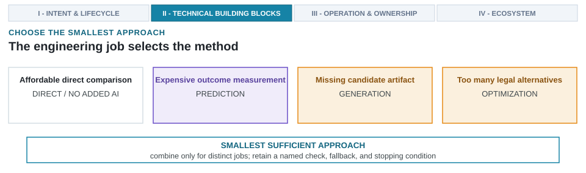

---
format:
  html:
    output-file: index.html
---

# Prediction, Generation, and Optimization {#sec-methods-generation-prediction-optimization}

{fig-alt="Four architecture conditions map to direct comparison, prediction, generation, or optimization, with a named check, fallback, and stopping condition."}

::: {.epigraph}
> "Data can tell you that the people who took a medicine recovered faster than those who did not take it, but they can't tell you why."
>
> — Judea Pearl and Dana Mackenzie, *The Book of Why* (2018) [@PearlMackenzie2018BookOfWhy]
:::

::: {.column-margin}
**Author's Note.** Judea Pearl, the Turing Award winner behind modern causal inference, drew the line between what observational data can show (correlation) and what it cannot (cause). A statistical surrogate can surface a high-scoring candidate quickly; it cannot say which microarchitectural mechanism produced the score. That gap is why every method this chapter admits is paired with a physical check.
:::

Method selection begins with the physical bottleneck rather than the algorithm. After structuring hardware configurations and dynamic workload states into coupled state tuples $s = \langle s_{\text{design}}, s_{\text{env}} \rangle$ (@sec-data-representations-world-models), an architect must answer three governing questions before authorizing machine learning. First, which engineering job acts as the active constraint? Second, does an added learned model genuinely remove that constraint? Third, what is the smallest sufficient method that preserves an inspectable verification check and a deterministic fallback?

Engineering teams frequently reach for complex generative foundation models or reinforcement-learning loops under the assumption that end-to-end automation accelerates discovery. In physical silicon engineering, that unexamined default wastes engineering budgets. Setting up an autoregressive code generator or a multi-agent debate ring to size an execution unit or tune a five-parameter crossbar arbiter consumes weeks of prompt engineering and substantial compute, only to leave the team managing uncalibrated surrogate drift. Meanwhile, an analytical roofline model, a direct simulation sweep, or a Bayesian optimizer with a Matérn kernel settles the question in minutes, with an uncertainty estimate the architect can inspect.

Different engineering bottlenecks demand different method families. When a bounded study evaluates a small set of candidate execution widths or branch predictor configurations, direct simulation sweeps settle the comparison cleanly. When millions of microarchitectural configurations compete for scarce compute cycles, predictive surrogates screen candidates and search optimizers ration evaluation budgets. When synthesizable register-transfer level (RTL), domain-specific testbenches, or tensor compiler schedules do not exist, generative models construct missing artifacts. While foundation models supply general prior knowledge, retrieval supplies live project context, and multi-agent frameworks coordinate tool actions, direct tool execution remains the default engineering baseline.

Selecting an automated method requires resource accounting. Saving simulator cycles is counterproductive if model training, surrogate calibration, and manual verification backlog exceed the cost of direct execution. Identify the limiting engineering role first, select a learned or hybrid method only when an active bottleneck justifies it, and preserve independent physical oracles to qualify every output. Method selection defines search spaces, computational budgets, and stopping rules, linking upstream representations (@sec-data-representations-world-models) to the execution environments and tool interfaces developed in @sec-architecture-environments-tool-interfaces.

::: {.callout-learning-objectives}
This chapter establishes the following learning objectives:

- **Differentiate** architecture engineering roles, method families, and concrete techniques to decouple workflow requirements from automated algorithms.
- **Determine** the smallest sufficient method by applying pre-flight criteria that prioritize analytical models and direct simulation sweeps over ungrounded machine learning.
- **Model** multi-tier candidate evaluation pipelines as feed-forward queueing networks to derive maximum arrival rates ($g < \min_i (\mu_i / \prod_{j=1}^{i-1} p_j)$) that prevent downstream queue collapse ($\rho_i \ge 1$).
- **Mitigate** surrogate over-optimism from the optimizer's curse ($\mathbb{E}[\max \hat{f}] > \max f$) using split-conformal prediction intervals ($\hat{C}(x)$) and empirical shrinkage during design-space exploration.
- **Compose** generation, prediction, and search into pipelines whose checking components share no assumptions with the generator and whose fallbacks are deterministic.
:::

## Engineering Roles and Method Families

Accelerating hardware design requires decoupling functional engineering roles (what work must be done) from underlying method families (how that work is performed). In architecture studies, the goal is constructing missing artifacts, estimating physical consequences, searching decision spaces, or checking claimed properties. If candidate configurations are already known and directly evaluable, adding predictors or optimizers creates setup overhead and verification backlog without removing the actual bottleneck.

::: {.callout-war-story title="A method family carries its assumptions"}
**The claim.** Itanium's explicitly parallel instruction computing (EPIC) design moved instruction scheduling out of hardware into the compiler, assuming explicit parallelism, predication, and speculation would allow wide execution with static scheduling [@SchlanskerRau2000EPIC].

**The gap.** Compilers had to resolve at *compile time* what dynamic hardware settles at *runtime*, including memory latencies and control flow revealed only during execution. General-purpose code lacked the assumed static parallelism.

**The lesson.** A method family commits to its assumptions as firmly as to its mechanism. A method is viable only when its required information is available at the moment of execution.
:::

The *smallest sufficient method* is the least elaborate method that performs the required engineering job while preserving evaluators and verification checks. Selecting no added method is an explicit, positive engineering choice whenever direct evaluation costs less and maintains required checks. In the prospective Lighthouse cache study, direct evaluation covers the three candidate capacities within the declared budget. If a study instead spans thousands of microarchitectural configurations (such as sizing central processing unit (CPU) instruction windows or neural processing unit (NPU) systolic array tile dimensions), cycle-accurate simulators like gem5, Sniper, SCALE-Sim, or Ramulator would rapidly exhaust compute budgets. Regression models or surrogates can then screen candidates before passing ranked finalists to simulators and physical signoff. Explicit design decisions separate the engineering role, method family, technique, and system composition (@tbl-role-by-stall-mode).

| **Decision layer** | **Question** | **Choices** | **Required discipline** |
| --- | --- | --- | --- |
| **Engineering role** | What work must be done? | Propose, screen, search, critique, repair, check, explain, coordinate. | Name input, expected output, limits, and next check for each role. |
| **Method family** | What broad operation performs the role? | Prediction, generation, optimization, or domain-specific operations. | Select operations from required outputs and feedback rather than fixed pipelines. |
| **Technique** | What concrete mechanism fits the artifact and feedback? | Conventional, learned, or hybrid techniques (analytical models, regression, Gaussian processes, graph neural networks (GNNs), large language models (LLMs), Bayesian optimizers, solvers, heuristics). | State assumptions, applicable conditions, costs, and failure modes. |
| **System composition** | Which components must work together? | Single technique plus tools, or composed generators, predictors, optimizers, and retrieval modules. | Assign every component distinct inputs, outputs, costs, and checks. |
: **Choose the smallest approach that performs the needed work.** Four decision layers separate roles, method families, concrete techniques, and system compositions. {#tbl-role-by-stall-mode}

*Prediction* estimates properties or future states; PowerNet, for instance, estimates dynamic IR drop, the supply-voltage droop under switching current, from a design's power map before the signoff analysis runs [@XieEtAl2020PowerNet]. *Generation* constructs artifacts or candidates, whether a domain-adapted language model is drafting electronic design automation (EDA) tool scripts [@HeEtAl2024ChatEDA] or a first verification testbench [@QiuEtAl2024AutoBench]. *Optimization* selects among actions or candidates, as when a black-box optimizer explores an accelerator configuration space [@yazdanbakhsh2021apollo] or a learned policy schedules cluster resources [@MaoEtAl2016DeepRM]. Techniques operate as conventional, learned, or hybrid mechanisms. Hybrid techniques often take a neurosymbolic form, pairing probabilistic neural models with symbolic abstract syntax tree (AST) type checkers, control-data flow graphs (CDFGs), compiler intermediate representations (IRs), or analytical bounds to enforce hard invariants. Foundation models, retrieval modules, and agents act as components within compositions rather than standalone method families.

The same separation locates a composition among the operational layers of @fig-ch01-three-layers-ai-integration; a Layer 2 optimizer tuning macro placement inside a fixed floorplan container improves the subsystem but cannot move the interfaces around it, whereas only a composition of all three families can. Whichever layer applies, the separation preserves direct tool paths; deciding on no added method means declared tools perform the work economically and reliably (@fig-role-method-map).

{#fig-role-method-map width="100%" fig-alt="Four-stage map. Eight engineering roles connect through a many-to-many relationship to prediction, generation, optimization, and another method family, with a direct-tool option. The technique panel groups representative concrete mechanisms as conventional, learned, or hybrid. Every path ends with an inspectable output and a named next check."}

No engineering role binds uniquely to a single method family. Proposing does not mandate generation, screening does not mandate learned prediction, and searching does not mandate reinforcement learning. Inspectable outputs and property-specific checks govern every execution path.

## Anchoring Architectural Method Selection

Because no role binds uniquely to a single family, selecting an architectural method is an exercise in resource accounting rather than algorithmic fashion. Every additional learned model introduces engineering debt across training data curation, surrogate qualification runs, hyperparameter maintenance, and inference latency. A method earns its place only when it relieves an active engineering bottleneck more economically than conventional alternatives while preserving verifiable output checks.

### Pre-Flight Evaluation Criteria

Before authorizing expensive model training or configuring complex exploration loops, an architect must systematically evaluate whether an added method is warranted. Prospective studies pass through six pre-flight criteria to determine whether direct tool execution or conventional heuristics settle the question within budget.

1. State the architecture decision, comparator, objectives, constraints, and required output.
2. Determine whether direct evaluation, conventional algorithms, solvers, compiler passes, heuristics, or parameterized generators settle the question within budget.
3. Identify the limiting work: candidate construction indicates generation, expensive outcome measurement indicates prediction, and expansive search spaces indicate optimization.
4. If actions alter subsequent system states, evaluate whether transition-aware predictors or sequential optimizers are required; evaluate candidates independently when states do not couple.
5. If measurement, checking, or review is the bottleneck, throttle candidate arrivals or upgrade checking efficiency rather than generating additional candidates.
6. Reject proposed methods when data, representations, legal actions, evaluators, support, total costs, fallbacks, or stopping rules are inadequate.

Pre-flight criteria compose into a conditional selection flow (@fig-method-selection-guide).

![**Method selection begins by identifying the primary bottleneck work.** Direct evaluation and conventional algorithms provide the first check whenever they settle decisions within budget. Bottlenecks in candidate construction, evaluation cost, or search-space scale route to generation, prediction, optimization, or composed pipelines, while saturated verification paths require throttling candidate arrivals or expanding checking capacity. Every decision branch terminates at declared support bounds, total cost accounting, property-specific checks, fallbacks, and stopping rules.](images/fig-method-selection-guide){#fig-method-selection-guide width="100%" fig-alt="Conditional method-selection flow. An architecture decision and output lead to a test of whether direct evaluation or a conventional method is sufficient. If not, one or more limiting forms of work point toward generation, prediction, optimization, transition-aware methods, or improving a saturated checking path. Every branch ends at declared support, total cost, a named check matched to the consequence, a fallback, and a stopping condition."}

The flow imposes one discipline. Methods are chosen by their capacity to relieve the active limiting constraint, not by algorithmic popularity. A team discovering that their search space spans millions of viable floorplan permutations must first acknowledge that direct physical synthesis for every candidate is impossible. This realization forces a branch in the flow toward optimization or prediction. However, if the limiting factor is that no legal layout currently exists, the flow routes toward generation.

Once the primary bottleneck determines the method family, the architect must translate that conceptual choice into a concrete engineering commitment. This requires stating what the method is authorized to do, what data it requires, and how its outputs will be independently verified. These constraints prevent an exploratory model from quietly making authoritative design decisions that require physical signoff.

Evaluating methods requires an explicit pre-selection checklist across nine operational attributes (@tbl-method-role-limits).

| **Attribute** | **Question to answer before selecting the approach** |
| --- | --- |
| **Job and question** | Which limiting work will this approach remove: construct, estimate, select, or establish a property? |
| **Inputs and support** | Which represented state, artifacts, observations, workloads, design regions, and process assumptions may be used? |
| **Approach status** | Is the method active, candidate, conditional, or disqualified for this problem? |
| **Output and legal actions** | What exact output will be produced, and which legal actions or mutations are permitted? |
| **Evaluator and checks** | Which evaluator, simulator, model, or tool checks the output, and what property-specific check qualifies it? |
| **Feedback cost** | What are the compute, sample collection, training, and license costs of this method? |
| **Support and failure mode** | When does the method fail, drift out of distribution, or hallucinate invalid designs? |
| **Fallback** | What simpler method or deterministic tool will be used if this approach fails? |
| **Stopping rule** | When does search or generation terminate: resolved decision, spent budget, or rejected slate? |
: **Pre-selection checklist across nine operational attributes.** Explicit constraints ensure methods are chosen for justifiable engineering reasons rather than algorithmic novelty. {#tbl-method-role-limits}

Five of those attributes carry conditions the table cannot hold in a cell.

- **Legal space and known constraints:** Enumerated parameter sets call for direct comparison. Regular mapping spaces suit analytical models, heuristics, or optimizers. Sequential placement alters subsequent choices, requiring transition-aware formulations. Known legality rules must constrain action spaces or execute as deterministic checks before spending evaluations.
- **Data, matching conditions, and evaluator:** Predictors require observations from matching workloads, design regions, tools, and process conditions. Evaluators must observe the exact properties claimed; compilers check syntax and types, simulators return conditioned behavior, solvers verify encoded properties, and physical tools expose implementation failures. Generated checkers share generator assumptions unless independent oracles are used.
- **Total cost:** Cost accounting includes setup, qualification, inference, tool runtime, licenses, failed runs, checking, and expert review.
- **Deployment conditions:** Response latency and data locality can rule out methods. Proprietary RTL, foundry process design kits (PDKs), and licensed reports often mandate local execution.
- **Support, reversibility, and review capacity:** Methods must declare valid operating ranges. Reversible suggestions tolerate higher error rates than automated RTL edits or tapeout decisions.

::: {.callout-design-principle title="Select the Smallest Sufficient Method"}
**The principle:** Select the simplest method (whether conventional analysis, heuristic search, learned prediction, or candidate generation) that relieves the identified bottleneck.

**The application:** A complex learned model must never be adopted when a lightweight conventional tool satisfies the decision's evidence requirement.
:::

```{=latex}
\FloatBarrier
```

### Quantifying Evaluation Capacity {#sec-sample-efficiency-under-expensive-feedback}

Authorizing a method requires rationing its downstream tool consumption. Generators propose candidates in seconds; physical signoff takes days. Flooding an evaluation path that can afford ten runs with ten thousand unpruned candidates creates unmanageable queue backlogs (@sec-evaluation-capacity-bounds-search). Multi-fidelity filtering reconciles this rate mismatch. Fast analytical rooflines filter non-starters in milliseconds. Spike functional emulators confirm instruction counts in minutes. gem5 simulations measure cycle-level contention over hours. Finally, OpenSTA timing signoff, Unified Power Format (UPF) power checks, and SystemVerilog Assertions (SVA) paired with bounded model checking (BMC) formal assertions certify physical tapeout readiness.

Enumerated parameter sets require modest budgets, whereas accelerator and tensor-program search spaces (NPU tile schedules in MAESTRO, Triton compiler schedules, AutoTVM autotuning, Timeloop mapping) span $10^6$ to $>10^{18}$ configurations [@KwonEtAl2019MAESTRO; @ChenEtAl2018AutoTVM; @ParasharEtAl2019Timeloop]. Large spaces justify analytical pruning, heuristics, and surrogate screening, whereas small spaces make added methodology more expensive than direct sweeps.

The *queue stability blowup* paradox occurs when an upstream search optimizer or generative model improves. As its candidate qualification rate rises, the volume of candidates surviving initial screens surges, and so does the load delivered to downstream simulation clusters and commercial EDA tool license pools. Consider a 24-hour physical signoff stage (such as Cadence Innovus or Synopsys ICC2 place-and-route) provisioned for a 5% survival rate from early structural filters; it backs up as soon as an upstream RTL generator raises its lint and synthesis pass rate to 50%. If downstream license and compute capacity is fixed, an improving upstream generator pushes downstream stages past their stability threshold ($\rho_i \ge 1$), turning generative improvement into pipeline collapse.

This intuition is formalized by modeling toolchains as feed-forward queueing networks balancing candidate arrival rates against downstream service capacity. For tool stage $i$ with $c_i$ parallel slots, mean candidate runtime $t_i$, and conditional pass rate $p_i$, stage capacity is $\mu_i = c_i / t_i$. Offered load is $\lambda_i = g \prod_{j=1}^{i-1} p_j$, and stage utilization is $\rho_i = \lambda_i / \mu_i$. Steady-state stability requires $\rho_i < 1$ across all stages, establishing the maximum viable candidate arrival rate $g$ (@eq-queue-stability-bound) [@Kleinrock1975QueueingSystems]:

$$
g < \min_i \left( \frac{\mu_i}{\prod_{j=1}^{i-1} p_j} \right).
$${#eq-queue-stability-bound}

Here, conditional pass rate $p_j$ denotes the fraction of candidates clearing stage $j$'s qualification checks. Because upstream filters thin the candidate stream, effective arrival rate at stage $i$ is $\lambda_i = g \prod_{j=1}^{i-1} p_j$. In predictive screening, stage pass rate $p_j$ is directly governed by surrogate precision: an uncalibrated surrogate that generates high false-positive rates inflates $p_j$, funneling unviable candidates into expensive downstream tools and accelerating queue saturation. Candidate arrival rate and downstream throughput interact stage by stage (@tbl-candidate-check-capacity). In the representative setup, 32 candidate proposals arrive per day; a 1-minute structural screen advances one quarter of its inputs ($p_1 = 0.25$), four parallel 8-hour simulation slots advance one tenth of their arrivals ($p_2 = 0.10$), and a single 24-hour implementation screen advances half of its inputs ($p_3 = 0.50$). For stage 2 (simulation), offered load is $\lambda_2 = 32 \times 0.25 = 8\ \text{candidates/day}$ against a service capacity of $\mu_2 = 4 \times (24/8) = 12\ \text{candidates/day}$, yielding stable utilization $\rho_2 = 8/12 = 0.67$. For stage 3 (physical implementation), offered load is $\lambda_3 = 8 \times 0.10 = 0.8\ \text{candidates/day}$ against service capacity $\mu_3 = 1.0\ \text{candidate/day}$ ($\rho_3 = 0.80$).

```{python}
#| echo: false
candidate_rate = 32.0
structural_capacity = 24.0 * 60.0
simulation_capacity = 4.0 * (24.0 / 8.0)
implementation_capacity = 1.0
structural_advance = 0.25
simulation_advance = 0.10
implementation_advance = 0.50

structural_load = candidate_rate / structural_capacity
simulation_arrival = candidate_rate * structural_advance
simulation_load = simulation_arrival / simulation_capacity
implementation_arrival = simulation_arrival * simulation_advance
implementation_load = implementation_arrival / implementation_capacity
finalist_rate = (
    candidate_rate
    * structural_advance
    * simulation_advance
    * implementation_advance
)
```

| **Tool stage before review** | **Parallel slots $c_i$** | **Mean time $t_i$** | **Capacity $\mu_i$** | **Conditional advance $p_i$** |
| --- | ---: | ---: | ---: | ---: |
| Structural and legality screen | 1 | 1 minute | 1,440/day | 0.25 |
| Cycle-level simulation | 4 | 8 hours | 12/day | 0.10 |
| Implementation screen | 1 | 24 hours | 1/day | 0.50 |
: **An illustrative pre-review tool-path capacity model exposes the active tool limit.** Values provide an inspectable load calculation rather than measurements of a specific commercial toolchain. {#tbl-candidate-check-capacity}

The structural screen, at 2.2% utilization ($32/1{,}440$), is nowhere near its limit; the implementation screen is the active bottleneck. Expected finalist throughput across an $M$-stage pipeline ($M=3$) is:

$$
q = g \prod_{i=1}^M p_i.
$${#eq-finalist-throughput}

Under these parameters, @eq-finalist-throughput yields 0.40 finalists per day. Finalist flow is not decision throughput; architecture decisions require matched baselines, physical signoff, and design-team review.

Saturating downstream evaluation queues does not accelerate architecture decisions; it shifts latency from candidate drafting to simulation scheduler backlogs. The control action is backpressure. A closed-loop design system couples its proposal engine to downstream utilization and, as signoff queues approach capacity ($\rho_i \to 1$), raises surrogate screening thresholds, shrinks generation batches, or halts rollout expansion.

Downstream tool capacity, not proposal rate, governs pipeline stability (@fig-candidate-check-capacity). Pushing generation beyond $g_{\text{max}} = 40\ \text{proposals/day}$ forces $\rho_3 \ge 1.0$, creating an unstable backlog where unverified proposals accumulate faster than signoff tools can resolve them.

![**Candidate generation rate governs downstream tool stage utilization and queue stability.** Stage utilization $\rho_i = \lambda_i / \mu_i$ across three verification filters as proposal rate $g$ increases. Physical signoff ($\mu_3 = 1\ \text{candidate/day}$, $p_3 = 0.50$) forms the bottleneck, hitting $100\%$ queue saturation at $g_{\text{max}} = 40\ \text{proposals/day}$. Exceeding this rate triggers an unstable queue backlog where unverified proposals accumulate unbounded. Values from @tbl-candidate-check-capacity.](images/fig-candidate-check-capacity){#fig-candidate-check-capacity width="100%" fig-alt="Plot of candidate proposal rate g on the x-axis versus stage utilization rho_i on the y-axis across three verification stages. Structural screen (blue line) remains near zero, simulation (dashed orange line) climbs moderately, and physical implementation (solid red line) climbs rapidly, crossing the 100% queue stability threshold at g_max = 40 proposals per day. A callout box marks the selected operating point at g = 32 proposals per day and 80% utilization, while a red shaded region above g = 40 highlights the unstable queue backlog area."}

Candidate generation increases arrival rate $g$, deterministic screens reduce downstream load, predictors save expensive evaluations at the cost of qualification overhead, and optimizers direct evaluation allocation. When tool or review stages saturate, adding generation cannot remove the bottleneck. When candidate evaluation is the active stall mode, the remedy the table itself suggests is a cheaper stage in front of the expensive one, and the next question is how much such a stage can buy.

### Validated Coverage Bounds Screening Speedup

The capacity model makes a cheap screen look like a free lever. If the implementation screen is the active limit, a faster check placed ahead of it lets fewer candidates through, and every multi-fidelity path in this chapter works that way. What the stability bound cannot say is how much service work the cheap stage removes, and the answer turns on how often the screen settles a comparison rather than on how fast it runs.

Count only *service work*, the expected evaluation effort per target comparison with queueing delay excluded [@Amdahl1967ValiditySingleProcessor]. Let $c_{\mathrm{hi}}$ be the mean cost of the reference path, a cycle-accurate RTL simulation or a gem5 full-system run, and $c_{\mathrm{cheap}} < c_{\mathrm{hi}}$ the mean cost of a screen such as a SCALE-Sim estimate. The screen's *validated coverage* $f$ is the fraction of comparisons on which its ordering settles the advance decision within declared error bounds and without escalation. If $a$ is the fraction of comparisons submitted to the screen, then $f \le a$, and the submitted comparisons the screen cannot settle go on to the reference path anyway. Selective classification supplies the accounting [@ElYanivWiener2010SelectiveClassification]:

$$
S_{\mathrm{screen}} = \frac{1}{(1-f) + a \cdot (c_{\mathrm{cheap}}/c_{\mathrm{hi}}) + \epsilon} \le \frac{1}{(1-f) + f \cdot (c_{\mathrm{cheap}}/c_{\mathrm{hi}}) + \epsilon}.
$${#eq-screening-efficiency-bound}

In @eq-screening-efficiency-bound, $\epsilon \ge 0$ collects the normalized routing, auditing, and rework overhead the screen adds, and the speedup peaks when every executed cheap check settles its case ($a = f$). Let the screen become free ($c_{\mathrm{cheap}}/c_{\mathrm{hi}} \to 0$ and $\epsilon \to 0$) and the speedup still stops at $1/(1-f)$. The shape is Amdahl's. The unsettled fraction pays full reference cost, so a faster screen only approaches a ceiling that more validated coverage alone can raise. That coverage must be measured on a representative sample of the whole target stream; a screen qualified only on the comparisons it happened to settle inherits a sample-selection bias [@Heckman1979SampleSelectionBias] and reports coverage it does not have. A screen that shares its cache model, basic-block traces, or instruction-level assumptions with the reference it is validated against fails in the same places the reference does, and their agreement then says nothing about the property at risk.

The ceiling is already inside @tbl-candidate-check-capacity. The structural screen forwards a quarter of its arrivals, so even if every rejection it issues is within declared error its validated coverage is at most $0.75$, and the service work it can save the simulation stage is capped at $1/(1-0.75)$ however fast the one-minute check becomes. Raising that cap means settling more comparisons at the screen, which is a claim about the screen's error bounds and not about its runtime.

Sweeping the cost ratio $c_{\mathrm{cheap}}/c_{\mathrm{hi}}$ across 0.01, 0.1, and 0.3, for ideal routing ($a = f$) and for screening every candidate ($a = 1$), shows how little the ratio matters once coverage is fixed (@fig-rejection-bound-ceiling). Lowering the cheap-check cost moves each curve toward the free-check ceiling $1/(1-f)$ and no further; at $f = 0.6$ the ceiling holds the speedup to $2.5\times$ whatever the screen costs.

```{python}
#| label: fig-rejection-bound-ceiling
#| fig-cap: |
#|   **Validated coverage sets the upper bound on screening speedup.** In this illustrative zero-overhead service-work model [@ElYanivWiener2010SelectiveClassification; @Heckman1979SampleSelectionBias], review service-work speedup (y-axis) is plotted against validated coverage $f$ (x-axis) across three cheap-to-high-fidelity cost ratios ($c_{\mathrm{cheap}}/c_{\mathrm{hi}} \in \{0.01, 0.1, 0.3\}$). Solid curves show ideal routing ($a=f$) and dashed curves show universal screening ($a=1$). Lowering check cost pushes performance toward the free-check ceiling $1/(1-f)$ (dashed black line); at $f=0.6$, speedup is capped at $2.5\times$ regardless of screening cost. Curves are constructed for illustration.
#| out-width: "100%"
#| fig-alt: "Line plot of review service-cost speedup against validated coverage f on the x-axis. A dashed ceiling curve traces one over one minus f, and three colored cost-ratio curves for 0.01, 0.1, and 0.3 sit below it; an annotated point marks f equals 0.6 capping the speedup at about 2.5x."

import matplotlib.pyplot as plt
from _python.plots import COLORS, apply_style

apply_style()

# Constructed illustrative parameters: the cost ratios and coverage fractions below are
# author-chosen to show how a screening bound behaves, not measured. Former label: S_review(f, r, a) = 1 / ((1 - f) + a * r) derived from selective classification risk-coverage trade-offs (El-Yaniv & Wiener, 2010) and sample selection bias corrections (Heckman, 1979).
f_grid = [0.95 * i / 399 for i in range(400)]
ratios = [
    {"label": "cost ratio 0.01", "r": 0.01, "color": COLORS["orange"]},
    {"label": "cost ratio 0.1", "r": 0.1, "color": COLORS["green"]},
    {"label": "cost ratio 0.3", "r": 0.3, "color": COLORS["red"]},
]

def s_review(cov, r, a):
    return 1.0 / ((1.0 - cov) + a * r)

fig, ax = plt.subplots(figsize=(5.25, 3.0))
fig.subplots_adjust(left=0.12, right=0.86, top=0.82, bottom=0.16)

ceiling = [1.0 / (1.0 - x) for x in f_grid]
ax.fill_between(f_grid, ceiling, 30, color=COLORS["grid"], alpha=0.35, zorder=0)
ax.text(0.04, 9.0, "unreachable without more validated coverage", ha="left", va="center", fontsize=6.0, color=COLORS["muted"], fontstyle="italic")
ax.plot(f_grid, ceiling, color=COLORS["ink"], linewidth=0.8, linestyle=(0, (4, 3)), zorder=2)

ax.axhline(1.0, color=COLORS["muted"], linewidth=0.7, zorder=1)
ax.text(0.93, 1.04, "no speedup", ha="right", va="bottom", fontsize=6.0, color=COLORS["muted"])

for c in ratios:
    ax.plot(f_grid, [s_review(x, c["r"], x) for x in f_grid], color=c["color"], linewidth=1.9, zorder=3, label=c["label"])
    ax.plot(f_grid, [s_review(x, c["r"], 1.0) for x in f_grid], color=c["color"], linewidth=1.2, linestyle=(0, (2, 2)), zorder=3)

ax.scatter([0.6], [2.5], marker="o", s=22, facecolor=COLORS["note_fill"], edgecolor=COLORS["ink"], linewidth=1.3, zorder=4)
ax.text(0.58, 2.95, "f = 0.6 caps the speedup at 2.5x", ha="right", va="bottom", fontsize=6.0, color=COLORS["ink"])

ax.set_yscale("log")
ax.set_xlim(0, 0.95)
ax.set_ylim(0.7, 30)
ax.set_xlabel("validated coverage f  (share of cases settled without escalation)", fontsize=7)
ax.set_ylabel("review service-work speedup", fontsize=7)
ax.set_xticks([0, 0.2, 0.4, 0.6, 0.8])
ax.set_yticks([1, 2, 5, 10, 20])
ax.set_yticklabels(["1x", "2x", "5x", "10x", "20x"], fontsize=6.4)
ax.tick_params(axis="both", length=2.5, width=0.6, pad=2, labelsize=6.4)
ax.grid(axis="both", color=COLORS["grid"], linewidth=0.5, zorder=0)

for spine in ["top", "right"]:
    ax.spines[spine].set_visible(False)
ax.spines["left"].set_color(COLORS["ink"])
ax.spines["bottom"].set_color(COLORS["ink"])

legend = ax.legend(
    loc="lower left",
    bbox_to_anchor=(0.0, 1.02),
    fontsize=6.0,
    frameon=True,
    facecolor="white",
    edgecolor="white",
    framealpha=0.92,
    handlelength=1.6,
    borderpad=0.15,
    labelspacing=0.3,
    ncol=1,
)
for text in legend.get_texts():
    text.set_color(COLORS["ink"])

plt.show()
plt.close(fig)
```

Coverage is the number a screening claim has to carry. A reported speedup needs its cost ratio, its class-specific error bounds, and the confidence calculation behind its coverage estimate, stated as a conservative lower bound under a sampling procedure declared before the screen ran. The bound also stops where the queue model begins. It prices service work and not wall-clock iteration time or workflow throughput, because queueing delay, cluster capacity, license limits, failed runs, and human review sit outside it. The two bounds are therefore read together. The stability bound says how many candidates the path can absorb; the coverage bound says how much a cheap stage can widen it. Both hold for the exact hardware and software versions that were measured, and a screen qualified on one target carries no coverage to another (@sec-loop-patterns-across-stack). In almost every practical path the screen that settles comparisons cheaply is a learned surrogate, so its validated coverage is a property of the surrogate's support.

## Predictive Surrogates and Reference Paths {#sec-prediction-estimating-behavior-before-full-evaluation}

When design spaces span thousands of microarchitectural variations, evaluating every candidate in cycle-accurate simulators or physical synthesis is intractable. Predictive surrogates trade numerical precision for evaluation throughput, screening configurations before committing compute to detailed simulation (@tbl-prediction-techniques) [@IpekEtAl2006PredictiveDSE; @LeeBrooks2006RegressionModeling]. Predictors must estimate consequences consumed by the downstream decision, matching specific representation structures and empirical constraints.

| **Predictive technique** | **Strong fit** | **Main reason to reject it** |
| --- | --- | --- |
| Analytical / mechanistic cost model | Known relationships, limited data, inspectable assumptions. | Omitted interactions control the decision. |
| Linear / regularized regression | Stable tabular features, modest complexity. | Sharp response changes or uncaptured feature structure. |
| Decision trees / boosted forests | Tabular parameters, nonlinear interactions, mixed types. | Extrapolation into unobserved design regions. |
| Gaussian process | Costly evaluations, moderate dimensions, uncertainty coupling. | High dimensionality or dataset size making surrogate costly. |
| Neural network | Large datasets from matching conditions, complex nonlinearities. | Insufficient data coverage, latency limits, or confidentiality. |
| Sequence / transformer model | Programs, traces, reports, ordered context. | Token/sequence dataset size or deployment budget mismatch. |
| Graph neural network | Netlists, dependency graphs, circuit connectivity. | Node/edge features omit properties controlling the metric. |
| Simulator-corrected hybrid | Analytical model exists with repeatable residual error. | Correction data mismatch with current tool or workload. |
| Transition / world model | Actions alter subsequent states across multi-step planning. | Static scoring or direct tool feedback suffices. |
: **Predictive techniques differ in the structure and support they require.** Selection follows target consequences, data representations, available sample counts, and evaluation costs. {#tbl-prediction-techniques}

Two rows show what a representation has to carry before a predictor can use it. A gate-level netlist is a hypergraph rather than a directed graph, because one net joins a single driver to many load pins, and a graph neural network fed that hypergraph can predict routing congestion, pin density, and wire parasitic capacitance before placement and routing run. A simulation waveform becomes a sequence once its transition densities, clock toggle rates, and signal switching probabilities are tokenized, and a sequence model over those tokens can predict transient IR-drop hotspots, dynamic power peaks, and glitch power without a gate-level timing simulation. What each row can predict is set by what its representation exposes, which is the concern of @sec-data-representations-world-models arriving here as a method limit.

> **Architecture world model.** A learned predictor of how represented design state, permitted actions, and operating conditions affect subsequent state or measured behavior [@HaSchmidhuber2018WorldModels]. When it is scoped to how state or decision-relevant consequences change after an action sequence under stated conditions, it is a transition model. Either way it is a predictive technique rather than a universal design theory.

In sequential macro placement and progressive compiler scheduling, partial floorplans or intermediate compiler representations feed an architecture world model. In floorplanning, placing an initial static random-access memory (SRAM) macro directly constrains the available routing tracks, power straps, and timing budgets of every subsequent macro block. The world model evaluates state transitions $s' = T(s, a)$ over proposed actions, simulating structural and physical consequences across planning rollouts [@HaSchmidhuber2018WorldModels; @JannerEtAl2019MBPO]. Planners evaluate bounded rollouts in the world model's state space, select the best candidate action trajectory, and dispatch the lead action to the placement toolchain. Tool observations qualify results, update represented state, and trigger replanning, while deterministic checkers enforce nonoverlap and design rules. World models are justified when action horizons are long enough for sequential dependencies to dominate and bounded rollouts save sufficient tool executions to offset fitting and prediction error. When tool feedback is cheap, horizons are short, or rollout errors compound rapidly, static scoring or direct tool invocation is preferable.

Predictive surrogates require a boundary against physical tools. Regardless of validation accuracy, a learned model remains an inexpensive proxy rather than an authoritative oracle. If an architecture team substitutes surrogate predictions for actual simulator signoff without auditing, approximation errors silently compound into physical timing or area violations.

To prevent this substitution hazard, predictive surrogates and direct physical observations follow distinct evaluation paths (@fig-architecture-cost-model).

![**Predictive surrogates and direct physical observations follow distinct evaluation flows.** A represented state and proposed candidate action feed a scoped consequence model (or transition model when dynamic state changes occur) to produce estimated metrics, while simultaneously routing through declared tool paths to obtain reference observations. Versioned study records preserve both outputs with their respective qualification metadata, preventing unconfirmed predictions from substituting for verified physical evidence.](images/fig-architecture-cost-model){#fig-architecture-cost-model width="100%" fig-alt="A represented state and proposed action feed a scoped consequence model and a separate tool path. The prediction and tool observation remain distinct and both enter a versioned study record."}

The consequence model estimates behavior within qualified bounds, while direct tool execution supplies reference observations under declared configurations. Agreement permits model use within stated support regions without conferring authority outside those conditions.

The reference path is itself a set of tools rather than one oracle, and the tools do not sit on a single fidelity ranking. No single tool observes cycle-accurate queueing, RTL functional assertions, and gate-level static timing across millions of workload cycles within a practical runtime, and cycle-accurate RTL simulation with full gate-level timing across billions of instructions would take months of compute per candidate. A reference path therefore composes tools at different fidelity and latency points and reads each return against the property that tool was configured to observe (@fig-eval-fidelity-latency). Analytical models reject candidates against encoded bounds; SCALE-Sim and Timeloop return accelerator cycles and traffic; gem5 models microarchitectural timing; Verilator runs RTL behavioral regression; FireSim executes the mapped target on field-programmable gate array clusters; and physical EDA flows evaluate timing, power, and area under declared libraries, constraints, and corners. Staging them by cost keeps the path affordable without implying that a higher-level tool covers what a lower one observes.

```{python}
#| label: fig-eval-fidelity-latency
#| fig-cap: |
#|   **Architecture tools answer different questions rather than occupying one total ranking.** The matrix maps six representative tool classes (vertical axis: Analytical / Roofline, SCALE-Sim / Timeloop, gem5, Verilator, FireSim, and Implementation / signoff flows) against six property domains (horizontal axis: Encoded bounds, Accelerator cycles and traffic, Microarchitectural timing, RTL behavior, Mapped execution, and Physical properties). A marked cell indicates that the tool class contributes authoritative evidence for that property under appropriate configuration; absence indicates an unaddressed dimension requiring complementary evaluation stages. Illustrative matrix mapping tool capabilities.
#| out-width: "100%"
#| fig-alt: "Matrix with tool classes as rows and property classes as columns. Marks associate analytical models with bounds, accelerator simulators with cycles and traffic, gem5 with microarchitectural timing, Verilator with RTL behavior, FireSim with mapped execution, and implementation and signoff flows with physical properties."
import matplotlib.pyplot as plt
from _python.plots import COLORS, apply_style
apply_style()
tools = ["Analytical / Roofline", "SCALE-Sim / Timeloop", "gem5", "Verilator", "FireSim", "Implementation / signoff"]
properties = ["Encoded\nbounds", "Accelerator\ncycles & traffic", "Microarchitectural\ntiming", "RTL\nbehavior", "Mapped\nexecution", "Physical\nproperties"]
coverage = {
    "Analytical / Roofline": [0],
    "SCALE-Sim / Timeloop": [1],
    "gem5": [2],
    "Verilator": [3],
    "FireSim": [3, 4],
    "Implementation / signoff": [5],
}
fig, ax = plt.subplots(figsize=(6.4, 3.3))
fig.subplots_adjust(left=0.24, right=0.98, top=0.94, bottom=0.22)
for y, tool in enumerate(tools):
    for x in coverage[tool]:
        ax.scatter(x, y, s=95, color=COLORS["evidence"], edgecolor="white", linewidth=0.9, zorder=3)
ax.set_xlim(-0.5, len(properties) - 0.5)
ax.set_ylim(len(tools) - 0.5, -0.5)
ax.set_xticks(range(len(properties)))
ax.set_xticklabels(properties, fontsize=5.8)
ax.set_yticks(range(len(tools)))
ax.set_yticklabels(tools, fontsize=6.1)
ax.set_xlabel("Representative property focus", fontsize=6.5, color=COLORS["ink"])
ax.grid(True, color=COLORS["grid"], linewidth=0.45, zorder=0)
for spine in ["top", "right"]:
    ax.spines[spine].set_visible(False)
ax.spines["left"].set_color(COLORS["ink"])
ax.spines["bottom"].set_color(COLORS["ink"])
plt.show()
```

A marked cell is where a reference observation can come from, and an empty one is a property the path has not observed at all. That is why the study record of @fig-architecture-cost-model keeps the qualifying tool beside the observation it produced. A surrogate qualified against gem5 inherits gem5's silence on gate-level timing closure, and agreement between the two says nothing about the corner neither of them saw.

## Predictor Support Boundaries {#sec-support-limits}

Learned surrogates remain reliable only within the empirical support of their training distributions. When optimizers steer search into uncharacterized design regions, unexpected workloads, or shifted process corners, surrogates fail silently. Standard statistical metrics like global root-mean-square error (RMSE) or mean absolute error conceal localized failure modes in silicon design. An architect might train a surrogate cost model on standard benchmark traces and achieve an aggregate 3% RMSE across nominal operating points. However, search optimizers do not sample average designs; they exploit extreme performance outliers. If the surrogate contains an uncalibrated positive estimation artifact in an uncharacterized region of the design space, an optimizer treats that artifact as an architectural breakthrough.

This phenomenon, known as the *optimizer's curse* [@SmithWinkler2006OptimizersCurse], causes optimization loops targeting fast proxy models to select candidates with large positive estimation errors rather than superior physical performance. Consider a hypothetical out-of-order core study. An optimizer tuning against an uncalibrated instructions-per-cycle (IPC) proxy selects a 512-entry reorder buffer (ROB) paired with a 16-wide issue window, because that corner of the space is where the proxy's positive error $\epsilon$ peaks. The proxy ignores the quadratic $O(W^2)$ bypass network wire delay and the clock distribution penalty, and the selected microarchitecture fails timing at the target 3.0\ GHz.

Statistically, surrogate-driven selection introduces positive selection bias. When choosing the candidate that maximizes a noisy surrogate estimate $\hat{f}(x) = f(x) + \epsilon$, the expected value of the selected candidate systematically exceeds the true maximum:

$$
\mathbb{E}\left[\max_{i=1,\dots,K} \hat{f}(x_i)\right] > \max_{i=1,\dots,K} f(x_i).
$${#eq-optimizers-curse-bias}

Guarding against optimistic selection bias (@eq-optimizers-curse-bias) requires preserving original surrogate predictions, reserving independent confirmation runs in reference simulators, and reporting statistical shrinkage.

::: {.callout-law title="The Optimizer's Curse in Proxy Search"}
**The Classical Principle:** Maximizing a noisy surrogate estimator systematically selects for extreme positive estimation errors ($\mathbb{E}[\max \hat{f}] > \max f$) [@SmithWinkler2006OptimizersCurse].

**The Hardware Trap:** The out-of-order core hypothetical above, where the proxy's peak positive error and the optimizer's choice coincide and only the physical timing check separates them.

**The Architectural Antidote:** Pair every screening surrogate with a calibrated prediction interval ($\hat{C}(x)$) whose coverage is monitored, suspend screening and fall back to reference simulation when candidates leave the surrogate's declared support, and mandate independent full-physics signoff on all top-ranked candidates (@sec-law-optimizers-curse in @sec-appendix-c-laws-paradoxes).
:::

Screening surrogates must therefore preserve rank correlation ($r_s$) and top-$k$ recall at decision boundaries,[^fn-ml-top-k-recall-c05] while point accuracy governs hard constraint feasibility (such as power envelopes or timing slack).

[^fn-ml-top-k-recall-c05]: **Top-k recall**: The fraction of the measured best $k$ candidates that also appear in the predictor's top $k$. Ansor uses top-k recall to ensure cost models retain promising tensor programs for subsequent evaluation [@ZhengEtAl2020Ansor].

Surrogate qualification requires dedicated test batches sampled from target candidate regions, evaluated through both surrogate and reference tool paths. Weak recall mandates expanding the survivor set or disabling screening altogether, recognizing that qualification runs consume part of the evaluation budget the surrogate aims to save. When optimizers push surrogates outside training support, point estimates and uncertainty bounds degrade [@OvadiaEtAl2019UncertaintyShift], while single-step transition errors compound across multi-step planning horizons.

To prevent overconfident candidate filtering, surrogate point estimates must be paired with uncertainty quantification. Split-conformal prediction attaches distribution-free, finite-sample prediction intervals $\hat{C}(x)$ to learned surrogates, guaranteeing marginal coverage at a declared confidence level $1-\alpha$ without parametric assumptions on error distributions [@LeiEtAl2018Conformal; @AngelopoulosBates2021Conformal]:

$$
\hat{C}(x) = [f(x) - q_{1-\alpha}, \, f(x) + q_{1-\alpha}]
$$

where $q_{1-\alpha}$ is the $\lceil (n+1)(1-\alpha) \rceil / n$ empirical quantile (approximated as $(1-\alpha)(1 + 1/n)$) of calibration residuals $|y_i - f(x_i)|$ across $n$ calibration samples held out from surrogate training. Under exchangeability of calibration and test pairs $(x_i, y_i) \sim P$, the prediction interval satisfies the exact finite-sample coverage guarantee:

$$
\mathbb{P}\left(Y_{n+1} \in \hat{C}(X_{n+1})\right) \ge 1 - \alpha.
$$

Calibrated intervals prune or escalate candidates; they do not authorize a design commitment. The guarantee also holds only where the calibration set is representative of the candidates being screened. Once search carries the surrogate outside that declared support, the coverage statement no longer applies, and nothing in the band width announces the fact. What a changed workload or process corner does to coverage, and how a check whose conditions have moved is requalified, is the subject of @sec-feedback-verification-trust. This chapter's question is narrower, namely how a design system notices that it has left support and what it does next.

When rolling empirical coverage monitoring detects a coverage violation ($\frac{1}{M}\sum_{k=1}^M \mathbb{I}(y_k \notin \hat{C}(x_k)) > \alpha + \epsilon_{\text{tol}}$), the closed-loop design system executes an immediate two-tier recovery protocol:

- **Circuit breaker and escalation:** The system trips an automated circuit breaker that suspends surrogate screening, routing all subsequent candidate proposals directly to unpruned reference simulator execution (such as cycle-accurate gem5, SCALE-Sim, or static timing analysis) to prevent ungrounded candidate promotion.
- **Active-learning recalibration:** The out-of-support simulation measurements and failure counterexamples are appended to the surrogate training buffer with boosted uncertainty weights, triggering offline surrogate retraining and conformal quantile recalibration before proxy screening resumes.

A calibrated interval is only as good as its support assumptions (@fig-ch05-conformal-coverage). Inside the calibrated region ($x \le 6.0$), empirical coverage matches the nominal 90% level; beyond it ($x > 6.0$), observed behavior leaves the fixed band and coverage collapses, which is exactly what the coverage monitor exists to catch.

```{python}
#| label: fig-ch05-conformal-coverage
#| fig-cap: |
#|   **A calibrated interval depends on its support assumptions.** Constructed illustration of a
#|   split-conformal prediction band ($\pm q_{1-\alpha}$) around a latency-like surrogate curve. In the
#|   calibrated support regime on the left ($x \le 6.0$), empirical coverage matches the nominal 90%
#|   confidence level ($\approx 92\%$). When the workload regime shifts on the right ($x > 6.0$), the
#|   exchangeability assumption fails: observed values diverge from the surrogate, and empirical coverage
#|   collapses to $\approx 16\%$ despite the unchanged band width. A sustained coverage mismatch must halt
#|   predictor-based screening. All values are synthetic and illustrative.
#| out-width: "100%"
#| fig-alt: "Scatter plot of synthetic latency-like data with a fixed-width conformal prediction band around a surrogate curve. In the calibrated support region on the left, nearly all points fall inside the band; in the distribution-shift region on the right, observed behavior rises away from the unchanged band and most points escape it, showing coverage collapse."

import math
import random

import matplotlib.pyplot as plt
from _python.plots import COLORS, apply_style

apply_style()

# Constructed illustration: every value is synthetic, generated in this cell
# with a fixed seed; no real system was measured. The split-conformal recipe
# (calibration residual quantile -> fixed-width band) follows the conformal
# prediction pattern cited in the text.
rng = random.Random(20260713)
SHIFT_X = 6.0
NOISE = 0.32
X_MAX = 10.0

def surrogate(x):
    return 4.0 + 1.8 * math.sin(0.9 * x) + 0.25 * x

def truth(x):
    drift = 1.1 * (x - SHIFT_X) ** 1.25 if x > SHIFT_X else 0.0
    return surrogate(x) + drift

def observe(x):
    return truth(x) + rng.gauss(0.0, NOISE)

cal_x = [rng.uniform(0.0, SHIFT_X) for _ in range(60)]
cal_scores = sorted(abs(observe(x) - surrogate(x)) for x in cal_x)
q = cal_scores[math.ceil(0.9 * (len(cal_scores) + 1)) - 1]

test_in = [(x, observe(x)) for x in [0.15 + i * (SHIFT_X - 0.3) / 24 for i in range(25)]]
test_out = [(x, observe(x)) for x in [SHIFT_X + 0.15 + i * (X_MAX - SHIFT_X - 0.3) / 24 for i in range(25)]]
cov_in = sum(abs(y - surrogate(x)) <= q for x, y in test_in) / len(test_in)
cov_out = sum(abs(y - surrogate(x)) <= q for x, y in test_out) / len(test_out)

xs = [i * X_MAX / 400 for i in range(401)]
fig, ax = plt.subplots(figsize=(4.9, 2.55))
fig.subplots_adjust(left=0.11, right=0.97, top=0.86, bottom=0.19)

ax.fill_between(xs, [surrogate(x) - q for x in xs], [surrogate(x) + q for x in xs],
                color=COLORS["blue"], alpha=0.16, linewidth=0, zorder=1)
ax.plot(xs, [surrogate(x) for x in xs], color=COLORS["blue"], linewidth=1.1, zorder=2)
ax.plot(xs, [truth(x) for x in xs], color=COLORS["muted"], linewidth=0.9,
        linestyle=(0, (4, 3)), zorder=2)

ax.scatter([x for x, _ in test_in], [y for _, y in test_in], s=9,
           color=COLORS["blue"], zorder=3)
miss = [(x, y) for x, y in test_out if abs(y - surrogate(x)) > q]
hit = [(x, y) for x, y in test_out if abs(y - surrogate(x)) <= q]
ax.scatter([x for x, _ in hit], [y for _, y in hit], s=9, color=COLORS["blue"], zorder=3)
ax.scatter([x for x, _ in miss], [y for _, y in miss], s=11, color=COLORS["red"], zorder=3)

ax.axvline(SHIFT_X, color=COLORS["grid"], linewidth=0.7, linestyle="--", zorder=1)
ymin, ymax = ax.get_ylim()
ax.set_ylim(ymin, ymax + 1.2)
ax.text(SHIFT_X / 2, ax.get_ylim()[1] - 0.35, "calibrated support", ha="center",
        va="top", fontsize=6.0, fontweight="bold", color=COLORS["workload_ink"])
ax.text((SHIFT_X + X_MAX) / 2, ax.get_ylim()[1] - 0.35, "changed workload regime",
        ha="center", va="top", fontsize=6.0, fontweight="bold", color=COLORS["constraints_ink"])
ax.text(SHIFT_X / 2, ax.get_ylim()[1] - 1.15,
        f"empirical coverage ≈ {cov_in:.0%}\n(nominal 90%)", ha="center", va="top",
        fontsize=5.4, color=COLORS["workload_ink"])
ax.text((SHIFT_X + X_MAX) / 2, ax.get_ylim()[1] - 1.15,
        f"same band width,\ncoverage ≈ {cov_out:.0%}", ha="center", va="top",
        fontsize=5.4, color=COLORS["constraints_ink"])

ax.annotate("surrogate ± conformal band", (1.7, surrogate(1.7) + q),
            textcoords="offset points", xytext=(-2, 5), fontsize=5.6,
            color=COLORS["workload_ink"])
ax.annotate("observed behavior", (8.2, truth(8.2)), textcoords="offset points",
            xytext=(-58, 2), fontsize=5.6, color=COLORS["muted"])

ax.set_xlabel("workload / design parameter (synthetic units)", fontsize=7)
ax.set_ylabel("latency-like metric\n(synthetic units)", fontsize=7)
ax.set_xlim(0, X_MAX)
ax.tick_params(axis="both", labelsize=6.5, length=2.5, width=0.6, pad=2)
ax.grid(axis="y", color=COLORS["grid"], linewidth=0.6)
for spine in ["top", "right"]:
    ax.spines[spine].set_visible(False)
ax.spines["left"].set_color(COLORS["ink"])
ax.spines["bottom"].set_color(COLORS["ink"])

plt.show()
plt.close(fig)
```

Predictor-based screening requires audit windows (candidate counts, time intervals, or workload batches) where surrogate predictions are paired directly with reference tool runs. When recall, coverage, or threshold error violates declared bounds, screening halts and delegates escalation to @sec-feedback-verification-trust.

## Synthesizing Candidate Architecture Artifacts

Predictor-based screening presupposes that candidate designs already exist in an evaluable form. When the necessary implementation collateral (such as custom RTL modules, optimized compiler schedules, domain-specific testbenches, or floorplan topologies) is entirely missing, the engineering bottleneck shifts from predicting properties of known designs to synthesizing new candidate artifacts from functional specifications. Every synthesized artifact shifts the engineering burden directly onto downstream verification tools. Generation is justified only when candidates are missing and parameterized templates or conventional compiler passes cannot construct them deterministically [@RaganKelleyEtAl2017HalideCACM]. Artifact structure dictates the generative mechanism. Templates and grammars fit rigidly structured parameters, autoregressive code models generate source text [@Chen2021Codex; @LiuEtAl2023ChipNeMo; @ThakurEtAl2023VeriGen], and diffusion models refine spatial floorplans [@LeeEtAl2025DiffusionPlacement]. Verilog generation benchmarks like VerilogEval and RTLLM evaluate functional and synthesis properties [@VerilogEval; @RTLLM], but do not certify complete physical signoff. Before adopting retrieval-augmented generation or fine-tuning, studies must resolve inbound source licensing (verifying license terms permit derived hardware generation) and outbound data privacy (enforcing local execution to prevent proprietary RTL or foundry PDKs from leaking to external endpoints). Generative paths enforce distinct constraints during synthesis, while property-specific verification remains mandatory (@tbl-generation-techniques).

| **Artifact or problem** | **Likely construction path** | **What the path can enforce or use** | **External check still required** |
| --- | --- | --- | --- |
| Structured configuration / program | Template, grammar generator, solver, program synthesis. | Encoded syntax, types, and constraints. | Intended semantics and runtime behavior. |
| Software, script, or compiler code | Autoregressive model, LLM, constrained decoding. | Supplied context and schema restrictions. | Execution semantics and target behavior. |
| RTL | Autoregressive model / LLM evaluated with hardware benchmarks [@VerilogEval; @RTLLM]. | Supplied design context and grammar constraints. | Elaboration, clock-domain crossing (CDC) linting, reset sync, simulation, SystemVerilog Assertions (SVA) and bounded model checking (BMC) formal checks, synthesis in Yosys, static timing analysis (STA) in OpenSTA, UPF power checks, physical signoff. |
| Project-specific text or code | Retrieval-supported generation. | Retrieved documents and examples. | Source consistency and artifact-specific checks. |
| Netlist / connectivity object | Graph-generative / conditioned model. | Represented nodes, edges, graph constraints. | Electrical, functional, timing, and physical checks. |
| Placement or floorplan | Diffusion or spatial generator [@LeeEtAl2025DiffusionPlacement]. | Spatial distributions and boundary geometry. | Legalization, routing, timing, power, and design rule checking (DRC). |
| Mixed hard and learned constraints | Learned proposal plus solver, compiler, or repair step. | Hard constraints from solver; patterns from data. | Properties not established by encoded constraints. |
: **Generative techniques should match artifacts and available constraints.** Enforcing syntax during construction prunes invalid drafts but does not replace property-specific verification. {#tbl-generation-techniques}

Constrained decoding guarantees grammar membership [@WillardLouf2023GuidedGeneration; @GengEtAl2023GrammarConstrained], ensuring that generated Verilog parses cleanly without syntax errors, but cannot establish functional correctness, routability, or timing closure. A model forced to emit valid SystemVerilog grammar can still instantiate unclocked latches, generate multi-driver bus contention, or create unroutable combinational loops. Neurosymbolic workflows couple probabilistic neural generators with symbolic verifiers (abstract syntax tree (AST) checkers, Boolean satisfiability (SAT) and satisfiability modulo theories (SMT) solvers, static compiler passes) to reject malformed structures before heavy simulation. Generated testbenches do not provide independent verification if the generator repeats specification misinterpretations across both design and test; independent oracles or distinct tools are required to establish a verification boundary.

Code that parses is not code that works, and the drop-off between the two is measurable. KernelBench evaluates generated CUDA kernels against PyTorch baselines [@OuyangEtAl2025KernelBench], and candidate qualification falls at each verification boundary in turn (@fig-ch05-kernel-funnel).

```{python}
#| label: fig-ch05-kernel-funnel
#| fig-cap: |
#|   **Attempted is not correct, and correct is not fast.** One-shot KernelBench evaluation across three
#|   difficulty tiers (Levels 1–3) for four language models (Llama-3.1-70B, DeepSeek V3, OpenAI o1,
#|   DeepSeek R1) measured on an NVIDIA L40S GPU [@OuyangEtAl2025KernelBench]. Across all panels, the dashed
#|   100% line marks attempted tasks. Blue bars show the share passing the testbench correctness oracle
#|   (0% to 67%), while green bars show the share both correct and faster than the PyTorch Eager baseline
#|   (0% to 36%). Candidate qualification drops steeply across execution and correctness checks, concentrating
#|   realized speedup in a narrow survivor fraction.
#| out-width: "100%"
#| fig-alt: "Three-panel grouped bar chart of one-shot KernelBench outcomes for Llama-3.1-70B, DeepSeek V3, OpenAI o1, and DeepSeek R1 at difficulty levels one, two, and three. In each panel a dashed line at one hundred percent marks tasks attempted; blue bars show the share passing the correctness oracle, from zero to sixty-seven percent, and green bars show the share both correct and faster than the PyTorch Eager baseline, from zero to thirty-six percent. Both bars sit far below the dashed line everywhere, and the fast share is always well below the correct share."

import csv
from pathlib import Path

import matplotlib.pyplot as plt
import _python.plots as _ap
from _python.plots import COLORS, apply_style

apply_style()

# Source receipt: data/source-receipts/chapter5-kernelbench-funnel.csv
_root = Path(_ap.__file__).resolve().parents[2]

with open(
    _root / "data" / "source-receipts" / "chapter5-kernelbench-funnel.csv",
    encoding="utf-8",
) as fh:
    receipt_rows = list(csv.DictReader(fh))

model_order = [
    "Llama-3.1-70B Instruct",
    "DeepSeek V3",
    "OpenAI o1",
    "DeepSeek R1",
]
models = ["Llama-3", "DS-V3", "OpenAI-o1", "DS-R1"]

def receipt_values(metric, level):
    selected = {
        row["model"]: float(row["value_pct"])
        for row in receipt_rows
        if row["metric"] == metric and row["kernelbench_level"] == str(level)
    }
    if set(selected) != set(model_order):
        raise ValueError(f"Incomplete KernelBench receipt for {metric}, level {level}")
    return [selected[model] for model in model_order]

correct = {
    level: receipt_values("correct_one_shot", level)
    for level in (1, 2, 3)
}
fast1 = {
    level: receipt_values("correct_and_faster_than_eager", level)
    for level in (1, 2, 3)
}

fig, axes = plt.subplots(1, 3, figsize=(5.5, 2.05), sharey=True)
fig.subplots_adjust(left=0.09, right=0.985, top=0.78, bottom=0.22, wspace=0.10)

width = 0.36
xs = range(len(models))
for ax, level in zip(axes, (1, 2, 3)):
    ax.axhline(100, color=COLORS["muted"], linewidth=0.8, linestyle=(0, (4, 3)),
               zorder=1)
    ax.bar([x - width / 2 for x in xs], correct[level], width=width * 0.94,
           color=COLORS["blue"], zorder=2,
           label="correct" if level == 1 else None)
    ax.bar([x + width / 2 for x in xs], fast1[level], width=width * 0.94,
           color=COLORS["evidence"], zorder=2,
           label="correct and faster\nthan baseline" if level == 1 else None)
    ax.set_title(f"Level {level}", fontsize=6.6, pad=3)
    ax.set_xticks(list(xs))
    ax.set_xticklabels(models, fontsize=5.0)
    ax.set_ylim(0, 112)
    ax.tick_params(axis="both", labelsize=6, length=2.5, width=0.6, pad=2)
    ax.grid(axis="y", color=COLORS["grid"], linewidth=0.55)
    for spine in ["top", "right"]:
        ax.spines[spine].set_visible(False)
    ax.spines["left"].set_color(COLORS["ink"])
    ax.spines["bottom"].set_color(COLORS["ink"])
axes[0].set_ylabel("share of tasks (%)", fontsize=6.4)
fig.legend(loc="upper center", bbox_to_anchor=(0.54, 0.98), ncol=2,
           frameon=False, fontsize=6.0, handlelength=1.2, columnspacing=1.5)
plt.show()
```

Across difficulty levels, 0 to 67% of one-shot kernels pass functional correctness, and only 0 to 36% are both correct and faster than baselines (@fig-ch05-kernel-funnel), demonstrating that attempted generation is not correct hardware, and correct syntax is not fast execution.

This drop-off changes how generative methods must be evaluated. Comparing only the best generated kernel against an unoptimized baseline ignores the discarded drafts, the compilation overhead, and the possibility that a conventional autotuner given the same compute budget would have found a better schedule. A fair comparison matches construction paths and budgets against a credible conventional baseline (@tbl-generation-construction-pair).

| **Aspect** | **Prospective matched-construction comparison** |
| --- | --- |
| **Artifact and semantics** | Pin executable C/C++ compute kernel, target field-programmable gate array (FPGA) / application-specific integrated circuit (ASIC) library, clock, numerical tolerance, and high-level synthesis (HLS) version before selecting constructors. |
| **Construction arms** | Predeclare strongest practical conventional HLS autotuner (Tcl pragma search or solver design-space exploration (DSE)) and one code-generating model. Both receive identical kernels and tool feedback. |
| **Shared tools and checks** | Both paths use the same Vitis HLS flow, C-simulation, C/RTL co-simulation, logic synthesis, and timing signoff. |
| **Matched resources** | Pin context limits, wall-clock budgets, synthesis allowances, and expert setup allowances. |
| **Recorded result** | Retain attempted artifacts, synthesis failures, latency/initiation interval (II) metrics, resource utilization, tool costs, elapsed time, and expert hours. |
: **A generation comparison must match construction paths, not only final artifacts.** Matched conditions ensure conventional autotuners and generative models compete fairly. {#tbl-generation-construction-pair}

Chip-Chat demonstrates interactive RTL generation in which language models drafted Verilog for an 8-bit processor, reaching tapeout only through iterative human revision and strict tool feedback [@BlockloveEtAl2023ChipChat]. Generation cost remains inseparable from checking cost, and the two search structures that extend single-pass prompting matter here for where they put the checks rather than for their topology. Monte Carlo tree search (MCTS) over AST edits and modular Verilog snippets evaluates intermediate nodes with fast linters and unit assertions, so an early port-width or type defect is rejected before hundreds of dependent lines are generated and discarded. Multi-agent debate separates the generator from a lint and clock-domain crossing (CDC) critic, a testbench author, and a formal-property specialist [@DuEtAl2024MultiagentDebate], so that the testbench does not inherit the generator's misreading of the specification. The topology is illustrative; the durable point is that checking roles must not share the generator's internal assumptions.

Generative tree search and multi-agent debate construct individual candidate artifacts that satisfy local syntax and unit assertions. However, synthesizing valid local artifacts does not settle which architectural configurations or macro-level parameters should be evaluated when the global design space spans millions of alternatives. Even when candidate construction reliably yields valid artifacts, automated systems still face the harder resource allocation problem of navigating high-dimensional design spaces under strict evaluation budgets.

## Search Tactics and Budget Allocation {#sec-search-tactics-budget-allocation}

When architectural spaces exceed exhaustive simulation limits, optimization algorithms must ration evaluation budgets by balancing exploitation of characterized, high-performing regions against exploration of uncharacterized territory. Tactic selection requires matching the mathematical structure of the parameter space (continuous, discrete, or mixed-integer) to the physical cost of acquiring candidate feedback.

Feedback metrics require explicit semantic interpretation. Known constraints (such as enumerated cache capacities or nonoverlap rules) should be encoded directly into candidate constructors or enforced via deterministic projection before invoking expensive tools. Downstream constraints (such as routing feasibility or timing closure) emerge only after tool execution. If a run terminates at a declared limit, its completion time is right-censored [@KleinMoeschberger2003Survival]; practitioners fit a binary classifier to predict timeout probability or assign a penalized worst-case score ($L_{\max}$) to avoid treating aborted runs as ordinary zeroes. Infrastructure crashes and nonconvergent runs must be recorded as failures rather than zero-valued objectives.

Two properties of the evaluation path shape the acquisition rule before any algorithm is chosen. When simulation slots run in parallel, the rule must select a batch of distinct candidates at once and penalize candidates that sit too close to runs already in flight, or the cluster idles while a sequential optimizer waits for one result. When the knobs are discrete (set associativity in $\{2, 4, 8, 16\}$), a continuous distance measure distorts which candidates count as neighbors, so the surrogate must use a discrete kernel, a mixed-integer formulation, or a tree-based model rather than a continuous Gaussian process.

Within a fixed space, *exploitation* samples promising regions, while *exploration* samples high-uncertainty areas. Neither strategy widens declared boundaries. Evaluating novel topologies or instruction set architecture (ISA) extensions requires redefining the representation. Balancing surrogate predictions against estimated uncertainty allows an acquisition function to allocate expensive physical evaluations where expected improvement or information gain is highest (@fig-bayesian-optimization).

```{python}
#| label: fig-bayesian-optimization
#| fig-cap: |
#|   **Bayesian optimization allocates evaluation budget by balancing exploitation and exploration.**
#|   In this illustrative one-parameter Gaussian process model, the top panel plots the surrogate mean
#|   prediction (solid blue curve) alongside an uncertainty envelope ($\pm 1\sigma$, shaded region) anchored
#|   by three observed points. The bottom panel plots the upper-confidence-bound acquisition function
#|   ($\mu(x) + \kappa \sigma(x)$), which selects the next candidate evaluation point by trading off
#|   high predicted mean (exploitation) against wide predictive uncertainty (exploration). All values are illustrative.
#| out-width: "100%"
#| fig-alt: "Two stacked panels over a shared design-space axis. Top: a surrogate mean curve, a shaded uncertainty band, and three observation points. Bottom: an acquisition curve labeled at an exploit region, with an arrow marking the next evaluation as the combination of mean and uncertainty."

import numpy as np
import matplotlib.pyplot as plt
from _python.plots import COLORS, apply_style

# Illustrative 1-D Gaussian-process posterior with a radial-basis-function
# kernel and a small observation-noise term. Deterministic, with no random
# sampling. The acquisition is an upper-confidence bound (mean + 1.6 sigma).
apply_style()

def rbf_kernel(a, b, length_scale=1.35):
    return np.exp(-0.5 * ((a[:, None] - b[None, :]) / length_scale) ** 2)

x = np.linspace(0, 10, 400)
x_obs = np.array([1.2, 3.8, 7.2])
y_obs = np.array([0.28, 1.03, -0.48])

noise_variance = 0.0025
k_obs = rbf_kernel(x_obs, x_obs) + noise_variance * np.eye(len(x_obs))
k_cross = rbf_kernel(x_obs, x)
alpha = np.linalg.solve(k_obs, y_obs)
mean = k_cross.T @ alpha
posterior_covariance = rbf_kernel(x, x) - k_cross.T @ np.linalg.solve(k_obs, k_cross)
sigma = np.sqrt(np.clip(np.diag(posterior_covariance), 0.0, None))
kappa = 1.6
acq = mean + kappa * sigma

fig, (ax1, ax2) = plt.subplots(
    2, 1, figsize=(5.2, 3.5), sharex=True, gridspec_kw={"height_ratios": [2.1, 1]}
)

ax1.fill_between(x, mean - sigma, mean + sigma, color=COLORS["workload"],
                 alpha=0.15, linewidth=0, label="Uncertainty")
ax1.plot(x, mean, color=COLORS["workload"], linewidth=1.8, label="Surrogate mean")
ax1.scatter(x_obs, y_obs, s=34, marker="o", facecolor=COLORS["evidence"],
            edgecolor=COLORS["evidence_ink"], linewidth=1.0, zorder=4,
            label="Observations")
ax1.set_ylabel("Objective", fontsize=6.8)
ax1.tick_params(labelsize=6.0)
ax1.legend(loc="upper right", frameon=False, fontsize=5.8, handlelength=1.4,
           borderaxespad=0.2, labelspacing=0.35)
ax1.margins(y=0.18)

ax2.fill_between(x, acq.min() - 0.05, acq, color=COLORS["methods"],
                 alpha=0.18, linewidth=0)
ax2.plot(x, acq, color=COLORS["methods"], linewidth=1.7)
x_next = float(x[int(np.argmax(acq))])
ax2.scatter([x_next], [acq.max()], s=30, marker="s", facecolor=COLORS["methods"],
            edgecolor=COLORS["methods_ink"], linewidth=1.0, zorder=4)
ax2.text(3.8, acq.max() * 0.60, "Exploit\n(high mean)", ha="center",
            fontsize=5.6, color=COLORS["methods_ink"], fontweight="bold",
            bbox=dict(boxstyle="round,pad=0.2", facecolor="white", edgecolor="none", alpha=0.9))
ax2.annotate("Next evaluation\n(mean + uncertainty)", xy=(x_next, acq.max()),
             xytext=(1.2, acq.max() * 0.42), ha="center", fontsize=5.6,
             color=COLORS["methods_ink"], fontweight="bold",
             bbox=dict(boxstyle="round,pad=0.2", facecolor="white", edgecolor="none", alpha=0.9),
             arrowprops=dict(arrowstyle="->", color=COLORS["methods_ink"], lw=0.8))
ax2.set_ylabel("Acquisition", fontsize=6.8)
ax2.set_xlabel("Design space (one parameter)", fontsize=6.8)
ax2.tick_params(labelsize=6.0)
ax2.set_yticks([])

fig.subplots_adjust(left=0.10, right=0.98, top=0.98, bottom=0.11, hspace=0.12)
```

Separating surrogate prediction from acquisition selection enables exploration of high-uncertainty regions without mistaking early surrogate predictions for confirmed hardware observations (@fig-bayesian-optimization). Multi-fidelity Bayesian optimization extends acquisition functions to jointly select candidate designs and evaluation fidelity levels [@KandasamyEtAl2017MultiFidelityBO], requiring reusable records to log acquisition rules, fidelity choices, returned metrics, and escalation thresholds.

## Optimization Algorithms and Heuristics

While acquisition functions determine where an evaluation budget should be allocated, realizing that strategy requires selecting an optimization algorithm whose mathematical mechanics align with design-space structure and feedback latency. Bounded spaces favor enumeration or deterministic domain heuristics. Bayesian optimization suits expensive evaluations over smooth continuous parameters. Evolutionary algorithms navigate discrete combinatorial spaces.

Reinforcement learning, Bayesian optimization, genetic algorithms, and random search trade places across design spaces; no single optimizer dominates universally [@HendersonEtAl2018DeepRL; @KrishnanEtAl2023ArchGym]. In empirical benchmarking across microarchitectural design spaces, Bayesian optimization dominates low-sample regimes by constructing smooth Gaussian process priors, whereas reinforcement learning excels only when sample counts reach tens of thousands of evaluations to amortize policy training. Design-space structure, evaluation budgets, and tuning effort dictate method viability.

Where algebraic formulations exist, mathematical programming and constraint solvers exploit structure directly without learned search overhead. Equality saturation is the same move applied to rewriting. A greedy sequence of transforms, operator fusion before algebraic re-association or pipelining before retiming, can lock in a phase order that forecloses a better implementation. An e-graph instead holds every structurally equivalent form of a circuit or schedule at once, grows by non-destructive rewrites until it saturates or hits a budget, and leaves an extraction pass to select the minimum-cost netlist or schedule by integer linear programming or dynamic programming (the `egg` library is the common implementation). The greedy trap disappears and the cost moves to extraction, which grows with the combinatorial state the rewrite rules open up. When legal spaces feature many declared parameters, screening experiments isolate dominant factors [@PlackettBurman1946Design], though screening assumes weak interactions that strong architectural coupling can invalidate.

However, static search techniques struggle when the problem structure is inherently sequential. For sequential decision processes where subsequent choices depend heavily on prior state changes, reinforcement learning coordinates multi-step actions. The placement of a single macro block immediately redefines the valid locations and routing constraints for all subsequent blocks. Reinforcement learning captures this dependency by treating layout as a sequential game, as demonstrated in macro placement (@fig-alphachip-placement) [@MirhoseiniEtAl2021GraphPlacement].

![**Graph-based reinforcement formulations execute sequential macro placement.** In the reinforcement-learning macro placement framework [@MirhoseiniEtAl2021GraphPlacement], the policy places macros sequentially, receiving updated partial floorplans on each step. Once all macros are placed, standard-cell estimation computes a proxy cost combining wirelength, congestion, and density as a terminal reward. Practical flows pair proxy rewards with post-placement legalizers to prevent unroutable pin-density gaming.](images/fig-alphachip-placement){#fig-alphachip-placement width="100%" fig-alt="A loop with separate lanes for a placement policy's outbound macro-location action and the partial floorplan's inbound next state. After placing all macros, an approximate standard-cell placement precedes a density, congestion, and wirelength proxy cost, whose negative becomes the terminal reward."}

Sequential reinforcement formulations must amortize heavy training overhead across related designs. Training a deep reinforcement-learning policy requires tens of thousands to millions of environment steps. If those interactions require full physical place-and-route runs in commercial EDA tools, the compute and licensing cost will dwarf any downstream area or wirelength improvement. Reinforcement learning is viable only when rapid proxy evaluators guide the inner training loop and the resulting policy transfers across multiple tapeouts or block variations.

For a one-off architectural decision, direct search, deterministic heuristics, or Bayesian optimization provide far lower total cost. When evaluation budgets are limited, sample efficiency becomes the governing constraint.

Search tactics trade early sample efficiency against asymptotic improvement across evaluation budgets (@fig-ch05-search-efficiency). A sample-efficient optimizer identifies high-performing designs within twenty evaluations, whereas unguided search requires hundreds of runs to discover comparable candidates. Comparing these trajectories exposes the practical return on optimization investment.

```{python}
#| label: fig-ch05-search-efficiency
#| fig-cap: |
#|   **Empirical optimizer convergence on cycle-accurate systolic array DSE.** Evaluated across 4,000 genuine
#|   simulations (10 independent random seeds, matched evaluation budget $N \in [1, 100]$) using SCALE-Sim on a
#|   heterogeneous edge AI suite (Transformer MHA GEMM + CNN Conv). Gaussian Process Bayesian Optimization
#|   (solid blue line) exhibits superior sample efficiency in low-budget regimes ($N \le 20$), discovering +152%
#|   PPA gains by actively modeling epistemic uncertainty. Heuristic exploration via Simulated Annealing
#|   (dash-dot green line) climbs to +207% peak gain as evaluation budgets expand, while uniform Random Search
#|   (dotted gray line) plateaus early at +118% due to sparsity in the 161k-point design space. Shaded bands depict
#|   interquartile ranges (25th–75th percentiles) across random seeds.
#| out-width: "100%"
#| fig-alt: "Line plot of empirical optimizer convergence showing PPA gain over baseline anchor versus simulation budget (1 to 100 evaluations) for Bayesian Optimization, Simulated Annealing, Genetic Algorithm, and Random Search on SCALE-Sim hardware simulations."

import csv
from collections import defaultdict
from pathlib import Path
import matplotlib.pyplot as plt
import numpy as np
import _python.plots as _ap
from _python.plots import COLORS, apply_style

_root = Path(_ap.__file__).resolve().parents[2]
csv_path = _root / "data" / "source-receipts" / "chapter5-dse-empirical-convergence.csv"
if not csv_path.exists():
    for candidate in [
        Path("data/source-receipts/chapter5-dse-empirical-convergence.csv"),
        Path("../data/source-receipts/chapter5-dse-empirical-convergence.csv"),
        Path("../../../data/source-receipts/chapter5-dse-empirical-convergence.csv"),
        Path("../../../../data/source-receipts/chapter5-dse-empirical-convergence.csv"),
    ]:
        if candidate.exists():
            csv_path = candidate
            break

records = defaultdict(lambda: defaultdict(list))
with open(csv_path, "r", encoding="utf-8") as f:
    reader = csv.DictReader(f)
    for row in reader:
        records[row["algorithm"]][int(row["evaluation_step"])].append(float(row["best_so_far_gain_pct"]))

steps = sorted(list(next(iter(records.values())).keys()))

apply_style()
fig, ax = plt.subplots(figsize=(5.6, 3.4))
fig.subplots_adjust(left=0.12, right=0.95, top=0.92, bottom=0.18)

styles = {
    "Bayesian optimization (GP-BO)": {
        "color": COLORS["blue"],
        "linestyle": "-",
        "linewidth": 1.9,
        "label": "Bayesian optimization (GP-BO)",
        "zorder": 5,
        "fill_alpha": 0.16,
    },
    "Simulated Annealing": {
        "color": COLORS.get("green", "#2CA02C"),
        "linestyle": "-.",
        "linewidth": 1.6,
        "label": "Simulated Annealing",
        "zorder": 4,
        "fill_alpha": 0.12,
    },
    "Genetic Algorithm": {
        "color": COLORS["purple"],
        "linestyle": "--",
        "linewidth": 1.6,
        "label": "Genetic Algorithm",
        "zorder": 3,
        "fill_alpha": 0.14,
    },
    "Random Search": {
        "color": COLORS["muted"],
        "linestyle": ":",
        "linewidth": 1.4,
        "label": "Random Search (Baseline)",
        "zorder": 2,
        "fill_alpha": 0.10,
    },
}

for alg, cfg in styles.items():
    if alg not in records:
        continue
    means = np.array([np.mean(records[alg][s]) for s in steps])
    p25s = np.array([np.percentile(records[alg][s], 25) for s in steps])
    p75s = np.array([np.percentile(records[alg][s], 75) for s in steps])

    ax.plot(
        steps,
        means,
        color=cfg["color"],
        linestyle=cfg["linestyle"],
        linewidth=cfg["linewidth"],
        label=cfg["label"],
        zorder=cfg["zorder"],
    )
    ax.fill_between(
        steps,
        p25s,
        p75s,
        color=cfg["color"],
        alpha=cfg["fill_alpha"],
        zorder=cfg["zorder"] - 1,
    )

ax.set_xlim(1, 100)
ax.set_ylim(-20, 240)
ax.set_xlabel("Simulation budget (evaluations $N$)", fontsize=6.8)
ax.set_ylabel("PPA gain over baseline (%)", fontsize=6.8)

ax.axhline(0, color=COLORS["muted"], linestyle="-", linewidth=0.6, alpha=0.5, zorder=1)

ax.annotate(
    "GP-BO: +152% by N=20",
    xy=(20, 152),
    xytext=(6, 192),
    arrowprops=dict(
        arrowstyle="->",
        color=COLORS["blue"],
        lw=0.8,
        connectionstyle="arc3,rad=-0.15",
    ),
    fontsize=5.6,
    fontweight="bold",
    color=COLORS["blue"],
)

ax.annotate(
    "SA: +207% by N=100",
    xy=(97, 207),
    xytext=(55, 218),
    arrowprops=dict(
        arrowstyle="->",
        color=COLORS.get("green", "#2CA02C"),
        lw=0.8,
        connectionstyle="arc3,rad=0.1",
    ),
    fontsize=5.6,
    fontweight="bold",
    color=COLORS.get("green", "#2CA02C"),
)

ax.legend(frameon=False, fontsize=5.4, loc="lower right")
ax.tick_params(axis="both", labelsize=6.0, length=2.5, width=0.6, pad=2)
ax.grid(True, color=COLORS["grid"], linewidth=0.45, zorder=0)

for spine in ["top", "right"]:
    ax.spines[spine].set_visible(False)
ax.spines["left"].set_color(COLORS["ink"])
ax.spines["bottom"].set_color(COLORS["ink"])

plt.show()
plt.close(fig)
```

The crossing of the curves is the lesson (@fig-ch05-search-efficiency). A strategy that leads under a constrained budget can plateau and fall behind as the budget grows, so an early lead does not by itself justify the choice when the space is highly non-convex; the budget the study can actually afford decides which trajectory matters.

Architectural search is rarely a single-metric endeavor. Multi-objective optimization constructs Pareto frontiers across conflicting metrics (power, performance, area) without collapsing trade-offs into artificially weighted scalars [@Deb2001MultiObjective]. Retaining the full multidimensional structure allows architects to make informed trade-offs late in the design cycle.

Each search procedure is valid only under structural conditions the problem may or may not meet (@tbl-optimization-methods). An algorithm that assumes continuous gradients fails when applied directly to discrete cache capacities, and the failure is silent until a confirmation run exposes it.

| **Search procedure** | **Strong fit** | **Required conditions** | **Common mismatch** |
| --- | --- | --- | --- |
| Enumeration | Small, finite legal spaces where every candidate is evaluable. | Explicit action space, affordable exhaustive coverage. | Applying after space exceeds available budget. |
| Random search / sampling | Large spaces permitting independent samples; transparent baseline. | Legal sampler, matched budget, retained failures. | Treating as insurance against flawed objectives. |
| Deterministic heuristics | Spaces with exploitable domain structure. | Explicit rules, assumptions, clear stopping rules. | Hiding manual tuning or biasing search away from optimal regions. |
| Bayesian optimization | Costly black-box evaluations in moderate dimensions with smooth surrogates. | Compatible observations, validated surrogate and acquisition rule, sequential budget. | Deploying on highly combinatorial or non-stationary spaces. |
| Differentiable optimization | Continuous parameters or trustworthy relaxations. | Useful gradients, post-discretization verification. | Ignoring discretization gaps, yielding unrealizable hardware. |
| Evolutionary search | Discrete/mixed spaces with population variation operators. | Legal mutation/crossover, large evaluation budget. | Evaluation starvation or underpowered comparison baselines. |
| Reinforcement learning | Sequential decision processes with repeated related tasks and delayed rewards. | Informative state representation, meaningful rewards, affordable simulation/transfer. | Applying to static, single-step parameter searches. |
| Mathematical programming / solvers | Algebraic objectives, discrete choices, explicit constraints. | Formalizable objectives and constraints. | Optimizing unrepresented architectural desiderata. |
: **Search procedures match design-space structure and feedback costs.** Algorithmic validity depends on parameter representations and evaluation constraints. {#tbl-optimization-methods}

Learned optimizers must be benchmarked against simple baselines (enumeration, random search, or domain heuristics) under identical spaces and tool budgets [@BergstraBengio2012RandomSearch]. PrefixRL illustrates this discipline in arithmetic circuit synthesis by integrating logic synthesis directly into its evaluation loop [@RoyEtAl2021PrefixRL].

<!-- AUTHOR-THESIS DRAFT 2026-08-31: report §4 item 3; commercial EDA optimizers were never placed in the taxonomy, yet they are the strong conventional baseline for the EDA reader -->
The strongest conventional baseline is often not random search but the optimizer already shipped with the toolchain. Commercial design-space exploration engines, HLS auto-pragma insertion, and the placement optimizers inside vendor place-and-route flows are deterministic heuristics and solvers in the terms of @tbl-optimization-methods, tuned by their vendors against the very design spaces a learned method would enter. A learned optimizer that beats random search but has not been run against the vendor flow at a matched budget has not yet cleared the conventional bar, and a study that omits that arm should say why the vendor optimizer could not be run rather than leave the reader to assume it lost.
<!-- END DRAFT -->

<!-- AUTHOR-THESIS DRAFT 2026-08-31: report §4 item 4; stopping appears as an attribute, a table cell, and a phrase, never as a rule a reader could write for their own study -->
Search terminates when budgets expire, decisions stabilize, or feasibility constraints cannot be satisfied, and that sentence is a rule only once it is written down before the first evaluation. A method-level stopping rule names three conditions, any one of which ends the search. The decision has resolved when the confirmation runs separate the leading candidate from the comparator by more than the confirmation interval. The budget is spent when a declared count of evaluations, tool hours, or license days is exhausted, with failed and censored runs charged against it. The method has stopped paying when the confirmed gain from the last block of evaluations is smaller than the confirmation cost of the next block, or when the gap between what the surrogate predicted and what confirmation returned exceeds the gain the surrogate still promises. For the Lighthouse cache study the rule reads plainly. Stop after the fourth cycle-level run, or earlier once one capacity clears the power, area, and access-time limits with a positive improvement interval and the others do not.
<!-- END DRAFT -->

## Composing Prediction, Generation, and Optimization {#sec-one-model-specialists-hybrid}

Standalone optimization algorithms operate over fixed, pre-constructed parameter representations. Yet hardware-software co-design rarely presents as an isolated parameter sweep. Comprehensive architecture studies routinely require synthesizing missing RTL modules, predicting multi-fidelity execution latencies, and searching high-dimensional configuration spaces under physical placement and thermal constraints. Relieving these compound bottlenecks requires composing predictive surrogates, generative constructors, and search optimizers into heterogeneous pipelines. Rather than enforcing a rigid three-stage pipeline, hybrid compositions adapt to the active engineering bottleneck. In neurosymbolic architectures, neural generators propose candidate structures while symbolic solvers and static compiler passes enforce structural validity. AutoTVM and Ansor demonstrate successful optimization compositions for tensor programs [@ChenEtAl2018AutoTVM; @ZhengEtAl2020Ansor], but do not mandate a universal three-stage structure for broader architecture studies. Each engineering role a composed pipeline incorporates carries an explicit handoff contract (@tbl-method-role-handoffs).

| **Engineering role** | **Concrete output** | **Next check or handoff** |
| --- | --- | --- |
| **Proposal** | Named candidate or experiment request with identified changes. | Verify legality and scope before invoking expensive tools. |
| **Screening** | Scoped estimate or ranking with predicted properties and uncertainty. | Route selected candidates to measurement path; retain predictions for qualification. |
| **Search** | Next candidate or experiment, selection basis, remaining budget. | Hand request to execution environment without mutating design space. |
| **Critique** | Testable defect, missing assumption, or conflict tied to named artifact. | Route to revision owner; critique neither alters candidates nor replaces checks. |
| **Repair** | Revised artifact linked to parent and modification record. | Treat as fresh candidate; rerun affected checks. |
| **Checking** | Result from named check under declared conditions (including timeouts/failures). | Hand return to verification testbench (@sec-feedback-verification-trust) to determine supported claims. |
| **Explanation** | Proposed mechanism and distinguishing contrast conditions. | Request targeted measurement; explanation does not substitute for verification. |
| **Coordination** | Ordered request graph with dependencies, budgets, and artifact IDs. | Hand requests to environment for tool orchestration. |
: **Engineering roles require explicit outputs and handoff contracts.** Role definitions decouple workflow logic from specific human or automated executors. {#tbl-method-role-handoffs}

Defining these handoffs explicitly avoids the monolithic trap of end-to-end "AI architecture generators," which often obscure where prediction ends and physical truth begins. Breaking complex architectural tasks into discrete roles allows teams to substitute a human expert, a deterministic script, or a learned component into any given slot, provided the component fulfills the specified handoff contract.

This modularity allows pipelines to be customized based on available compute budget and simulation latency. If simulation is fast but the design space is vast, the pipeline might deploy a heavy search optimizer without any generative or predictive components. Conversely, if simulation takes days, a predictive screener must be inserted before the checker to filter unviable proposals.

Composing a pipeline is an exercise in resource constraint satisfaction. Component boundaries must reflect distinct computational jobs and independent verification requirements (@tbl-method-organization).

| **Composition** | **When justified** | **Minimal sufficiency condition** |
| --- | --- | --- |
| Direct tools / conventional technique | Analytical models, solvers, or direct simulations perform work economically. | Add no learned component unless it removes distinct work without weakening checks. |
| Generation only | Artifacts are missing; direct checking is affordable. | Terminate when sufficient candidates exist or review bandwidth limits progress. |
| Prediction only | Candidates require cheap screening before expensive simulation. | Retain predictor only while qualification and confirmation cost less than direct evaluation. |
| Optimization only | Declared objective guides selection over large non-enumerable space. | Benchmark against simple baselines; stop when further search yields diminishing returns. |
| Generation + prediction | Candidate construction required, but full simulation is unaffordable. | Predictor screens only properties with compatible support data. |
| Generation + optimization | Candidate construction required under selective search budget without supported surrogate. | Optimizer uses direct tool feedback; generated candidates pass verification. |
| Prediction + optimization | Surrogate enables selective search under expensive tool feedback. | Keep surrogate, acquisition rule, and confirmation stages separately inspectable. |
| Generation + prediction + optimization | Missing artifacts, costly simulation, and large search spaces coincide. | Each component maintains distinct inputs, outputs, costs, and stopping rules. |
: **Pipeline components must perform necessary work that simpler alternatives cannot.** Increasing model count without distinct functional requirements adds complexity without improving architectural results. {#tbl-method-organization}

## Method Selection in Two Contrasting Studies

The practical validity of hybrid composition depends on problem dimensionality and feedback latency. High-dimensional exploration across expensive toolchains demands composed prediction and search pipelines, whereas compact, well-bounded decisions with few discrete candidates favor direct execution. Two contrasting design scenarios illustrate this division: compiler phase-ordering optimization for tensor accelerator kernels versus L2 cache capacity sizing for the prospective Lighthouse system-on-chip (SoC).

### Compiler Tuning versus Cache Evaluation

Compiler phase ordering and microarchitectural DSE justify multi-component compositions, whereas the Lighthouse cache study requires only direct tool evaluation. In compiler pass tuning (e.g., LLVM `PassBuilder` pipelines or AutoTVM schedules [@ChenEtAl2018AutoTVM]), candidate combinations far exceed direct evaluation capacity. Learned cost models predict throughput, search algorithms allocate compilation runs, and hardware execution confirms candidate performance.

Conversely, the Lighthouse cache study evaluates three discrete capacity settings (2\ MiB, 3\ MiB, and 4\ MiB) under a budget covering direct static random-access memory (SRAM) screening and cycle-level simulation. Adding generators, predictors, or optimizers would add overhead without accelerating discovery (@tbl-worked-method-decisions).

| **Decision parameter** | **Compiler-tuning candidate** | **Lighthouse cache study** |
| :--- | :--- | :--- |
| **Job** | Construct/select schedule improving operator on target hardware. | Compare 2\ MiB baseline against 3\ MiB and 4\ MiB without expanding scope. |
| **Inputs and support** | Fixed operator, hardware target, legal schedule space, compiler state, historical observations, evaluation budget. | Three proposed `l2.capacity` settings, hardware/software specifications, SRAM constraints, no prior matching data. |
| **Approach status** | Hybrid composition (e.g., schedule templates, learned surrogate, simulated annealing). Open until comparator and budget are fixed. | Direct evaluation. SRAM screening followed by matched cycle-level simulations. No generator, predictor, or optimizer. |
| **Output and legal actions** | Accepted schedule with measured target performance within declared schedule space. | Modeled SRAM metrics and matched cycle-level simulation results for 2\ MiB, 3\ MiB, or 4\ MiB only. |
| **Evaluator and checks** | Compiler and target execution under fixed semantics. | SRAM physical model checks limits; cycle-level simulation and power models return system metrics. |
| **Feedback cost** | Surrogate fitting, candidate compilation, target runs, tuning review. | Three SRAM evaluations, maximum four cycle-level runs. |
| **Fallback and stop** | Fix conventional comparator (e.g., `-O3`), budget, and stopping rules before execution. | Fall back to direct cycle-level simulation if SRAM model is unavailable. Stop when capacity decision resolves or budget is exhausted. |
: **Missing capabilities determine composition requirements.** High-dimensional search spaces with expensive target evaluations justify learned surrogates and optimizers, whereas small discrete candidate sets favor direct evaluation. {#tbl-worked-method-decisions}

### Lighthouse Evaluation Plan

Grounded in the smallest sufficient method, the prospective Lighthouse cache study formalizes its execution strategy before invoking simulation tools. The Lighthouse cache evaluation specifies allowed mutations, tool contracts, cost bounds, and verification checks (@tbl-lighthouse-approach-decision), so that search remains bounded to realizable SRAM organizations without deploying unnecessary surrogate machinery.

| **Handoff detail** | **Lighthouse cache method decision** |
| :--- | :--- |
| **Selected approach** | Direct evaluation with no added learned components. |
| **Allowed change** | Mutate only `l2.capacity` among 2\ MiB, 3\ MiB, and 4\ MiB. All other microarchitectural, software, and workload parameters remain fixed. |
| **Required tool roles** | Analytical SRAM model evaluates macro area, access time, and leakage under TSMC N7/N3 conditions. Cycle-accurate simulator (gem5) with cache/power models measures frame time, miss rates, and subsystem power. |
| **Cost envelope** | Three SRAM evaluations, maximum four cycle-level simulations. |
| **Necessary checks and fallback** | Verify candidate identity. Reject capacities exceeding $3\ \text{W}$ subsystem power, $1.5\ \text{mm}^2$ macro area, or $2.5\ \text{ns}$ access time. Candidates advancing must pass STA in OpenSTA, power checks in UPF, and yield a positive improvement interval relative to baseline. Fallback: direct simulation of all three capacities within budget. |
: **Direct evaluation provides the defensible starting choice for Lighthouse cache sizing.** A small discrete candidate set without prior matching data justifies direct tool execution over learned surrogates. {#tbl-lighthouse-approach-decision}

As written, the plan is a design path rather than a design loop. The three candidates are fixed before the first run, and no returned measurement changes which candidate runs next; a returned measurement can only reject a candidate or end the study. That is the correct shape for a three-way comparison, and naming it keeps the plan from being described as more than it is.

<!-- AUTHOR-THESIS DRAFT 2026-08-31: report §4 item 5; the total-cost attribute is listed and never summed for any case, including Lighthouse, whose cost envelope is stated in tool runs only -->
Priced against the total-cost attribute of @tbl-method-role-limits rather than in tool runs alone, the plan costs the three SRAM evaluations and at most four cycle-level runs, the setup of one gem5 configuration with its cache and power models, the review of at most seven results by the design team, and no license held beyond the simulator's own. It carries no training set to assemble, no qualification batch to run through both a surrogate and a reference path, no surrogate to recalibrate when a candidate falls outside support, and no failed learned-model runs to charge. That last list is the bill a learned method would have to beat. It earns a place in a study of this shape only by removing work from the first list, and there is no work there to remove.
<!-- END DRAFT -->

## Common Pitfalls

Deploying machine learning methods into architectural search loops exposes subtle failure modes where algorithms emit confident recommendations that violate unmodeled hardware constraints. In closed-loop exploration, errors typically stem from unstated mathematical assumptions rather than flaws in the underlying circuit design.

- **Unconstrained high-level synthesis pragma optimization:** Automated exploration over HLS pragma spaces without physical resource bounds generates aggressive unrolling directives that exhaust FPGA block RAM capacities or cause unroutable routing congestion in logic synthesis.
- **Kernel distance mismatch in discrete microarchitectural Bayesian optimization:** Continuous Gaussian process kernels applied to discrete categorical architectural parameters (cache associativity, queue depths) distort distance metrics, leading to surrogate hallucination and search stagnation.
- **Claiming a screening speedup without a coverage measurement:** A fast surrogate is placed ahead of simulation and the saved runs are reported as the gain, with no abstain threshold declared and no validated coverage $f$ measured on the full target stream. The service-work ceiling of @eq-screening-efficiency-bound is then unknown, and the surrogate issues confident rankings in design regions it never saw, so the finalists it advances are the candidates on which it is most wrong. The tell is a speedup reported without a cost ratio, an error bound, or the sampling procedure behind the coverage estimate.
- **Policy collapse and sparse reward failures in reinforcement learning (RL) design search:** Reinforcement learning over long action horizons with sparse terminal rewards collapses into invalid placement loops or unroutable floorplans unless regularized by intermediate proxy feedback and design-rule penalties.
- **Unsynthesizable RTL generation in LLM code synthesis:** Language models trained primarily on software repositories emit Verilog code that parses cleanly in syntax linters but introduces multi-clock-domain race conditions, missing reset logic, or unsynthesizable latch arrays [@VerilogEval; @RTLLM].

## Open Questions

Method choice is formalized across this chapter as a deliberate architectural decision governed by the smallest sufficient method. Evaluating the true economic trade-offs of composed methods leaves five questions unresolved:

- **Where is the optimal handoff boundary between closed-form analytical priors and learned statistical search?** Deploying deep neural surrogates or reinforcement learning search over microarchitectural parameters that analytical roofline models, Little's law, or closed-form DRAM queueing equations resolve in microseconds violates the smallest sufficient method. Yet analytical models fail when high-dimensional, cross-layer interactions dominate, such as cache thrashing under multi-phase irregular memory traces or wire congestion during physical placement. Analogous to physics-informed architectures that hybridize differential equations with neural residuals, architecture search requires formal criteria to partition the design space into what analytical solvers settle directly and what must be handed to learned optimizers. Formulating runtime criteria that define this handoff boundary without falling victim to either analytical oversimplification or black-box compute waste remains an open optimization challenge.

- **How much of a predicted surrogate win survives physical verification?** An optimization algorithm naturally selects candidates where the surrogate estimator exhibits maximum positive residual error, which frequently coincides with sparse training regions, as the reorder-buffer hypothetical of @sec-support-limits shows. Whether empirical shrinkage curves and conformal prediction sets can systematically discount surrogate optimism as candidate pool sizes grow, or the optimizer's curse in high-dimensional exploration mandates full-physics signoff for all top-ranked candidates, remains unmeasured.

- **What does grammar-constrained decoding cost in candidate diversity?** Constrained decoding prunes invalid token sequences early because syntactically invalid designs offer zero utility. However, masking logits to enforce an HDL grammar also reshapes the underlying probability distribution the generative model was trained to sample from, suppressing valid but unconventional microarchitectural idioms. Whether grammar-constrained decoding prunes high-performing non-standard topologies, or the distribution shift from token masking is strictly cheaper than post-generation syntactic repair, defines where syntax filters belong in the generative pipeline.

- **How do closed-loop design systems prevent queueing collapse when generative optimizers succeed?** The stability bound (@eq-queue-stability-bound) treats each pass rate $p_j$ as a constant, and the blowup paradox of @sec-sample-efficiency-under-expensive-feedback is what happens when an improving generator raises it. Whether evaluation pipelines can dynamically reprovision compute tiers and apply admission backpressure as candidate acceptance rates rise, or improving optimizers inevitably trigger downstream verification thrash, defines the queueing stability challenge in closed-loop search.

- **When does heterogeneous method composition outperform tuned single-method baselines under matched compute budgets?** Composing multi-method pipelines is justified only when each added component performs a computational job that simpler alternatives cannot (@tbl-method-organization). Yet multi-tier compositions introduce surrogate qualification overhead, chained tool translation errors, and pipeline integration latency. A fair comparison must charge each workflow in identical compute budgets, accounting for qualification runs, failed invocations, surrogate recalibrations, and human repair hours. Whether multi-method compositions consistently beat fine-tuned single methods under matched compute budgets, or the integration overhead of chained models cancels their theoretical advantage, defines the core value proposition of an AI-native design system.

## Summary

Method selection begins by identifying the active engineering bottleneck. Roles, method families, concrete techniques, and system compositions are distinct decisions, and direct analytical evaluation and conventional heuristics remain the default baselines whenever they are computationally feasible; learned surrogates, generative decoders, and search optimizers are deployed only when analytical methods cannot resolve high-dimensional cross-layer interactions.

An algorithm cannot be judged apart from what it costs to run. A multi-tier pipeline that ignores its queue stability bound turns a better generator into a longer backlog, a surrogate that is not discounted for the optimizer's curse reports wins that do not survive signoff, and a search loop that needs continuous recalibration or produces high rejection rates can consume more compute than direct simulation would have. Five takeaways follow:

::: {.callout-takeaways}
- **Role first, then family, then technique.** Define the engineering role (propose, screen, search, check) before selecting prediction, generation, or optimization, choosing concrete mechanisms and composing pipelines only when distinct computational jobs exist.
- **Smallest sufficient method.** Deploy the simplest method addressing the active bottleneck, defaulting to direct simulation sweeps or analytical rooflines whenever budget permits before authorizing learned surrogates.
- **Feed-forward queue stability.** Multi-stage evaluation pipelines must hold candidate arrivals under the stability bound with active backpressure, so that downstream physical signoff queues do not collapse as upstream generator yield improves. A cheap screen widens that path only as far as its validated coverage reaches, never as far as its speed suggests.
- **Optimizer's curse and calibrated bounds.** Predictive surrogates systematically suffer positive selection bias; screening must pair them with calibrated prediction intervals, monitored coverage, and empirical shrinkage so that predicted wins survive physical signoff.
- **Composition with independent oracles.** Generated candidates and CUDA/RTL drafts must pass symbolic parsers, formal assertion checks, and noncorrelated verification critics rather than self-verifying testbenches.
:::

With method selection grounded in the smallest sufficient method, the execution environment must enforce containerized tool containment, license pooling, and immutable lineage tracking, developed in @sec-architecture-environments-tool-interfaces.
