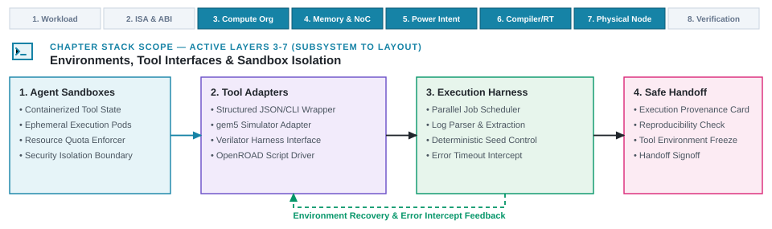

---
format:
  html:
    output-file: index.html
---

# Execution Harnesses and Tool Isolation {#sec-architecture-environments-tool-interfaces}

{fig-alt="Nested environment, harness, wrapper, and tool boundaries turn an authorized request into a complete execution record for later qualification."}

::: {.epigraph}
> *"We shape our tools and thereafter they shape us."*
>
> — John Culkin, *Saturday Review* (1967) [@Culkin1967Schoolman]
:::

::: {.column-margin}
**Author's Note.** John Culkin, a media scholar explaining Marshall McLuhan's theories, used this line to show how tools reshape human practice. In computer architecture, execution harnesses define what an automated method can tweak and what it can observe. Isolating tool environments ensures that hidden software quirks do not distort architectural search or mask physical failure modes.
:::

::: {.callout-crux}
What boundary must enclose architecture tools so automated methods can drive them safely, reproducibly, and within declared budgets?
:::

A tool command is not an execution environment. Launching a simulator, compiler, formal engine, or synthesis flow without an enclosing harness leaves candidate identities unrecorded, environment variables unpinned, and retries untracked. Interactive CAD workflows absorbed these gaps through manual inspection. Automated search, generation, and surrogate loops (@sec-methods-generation-prediction-optimization) dispatch runs at rates that preclude human oversight. Without state-isolated, typed boundaries, automated exploration produces non-reproducible execution noise.

Evaluating a heterogeneous mobile XR SoC (such as a 3\ W design balancing RISC-V application cores, an NPU accelerator tile, and dual LPDDR5X channels on a TSMC N3E process node) requires filtering candidates with analytical models before dispatching cycle-level simulations, formal property checks, and physical synthesis runs. If execution state is unrecorded or tool versions drift, outputs become invalid for comparative evaluation.

Tool-connected execution environments provide containerized harnesses that insulate automated loops from CAD toolchain complexity. The environment guarantees that requested work reaches tools in declared states and records produced artifacts. It does not establish scientific validity or architectural merit; measurement qualification and tradeoff evaluation belong to the verification harness in @sec-feedback-verification-trust.

::: {.callout-learning-objectives}
This chapter establishes the following learning objectives:

- **Distinguish** tools and simulators from wrappers, harnesses, and enclosing environments across the three operational layers (point scripts, local optimization sandboxes, cross-tool orchestration).
- **Pin** environment state across hardware, software, and tools to support replay and expose drift.
- **Design** typed tool interfaces that translate intent and return structured artifacts.
- **Coordinate** multi-tool asynchronous workflows within strict resource and permission boundaries.
- **Separate** execution failures from design-limit violations while preserving lineage.
- **Govern** daily code churn, moving mainline targets, and non-deterministic tool dispersion within automated execution harnesses.
:::

## Hardware and Software Evaluation Environments

Automated evaluation pipelines decouple execution mechanics into five distinct architectural roles:

- **Tool:** Transforms an artifact or analyzes a stated property under declared inputs (e.g. LLVM, TVM, SCALE-Sim, Ramulator 2, gem5, Verilator, VCS, Cocotb, SVA/BMC, Yosys, Vivado, OpenROAD, OpenSTA).
- **Simulator:** A domain-specific tool modeling hardware/software behavior, exposing only modeled properties.
- **Wrapper:** Encapsulates a single tool, validating inputs, translating requests, invoking execution, and parsing outputs.
- **Harness:** Coordinates multiple wrappers, recording attempts, state, costs, failures, retries, resets, and artifacts.
- **Environment:** The complete infrastructure connecting a study to underlying tools, defining observable state, permissible requests, accessible tools, and return schemas.

The three operational layers of AI in architecture (@fig-ch01-three-layers-ai-integration) place different demands on execution infrastructure:

- **Layer 1 (AI-Assisted Engineering):** Operates without an automated harness. The engineer launches tools interactively or via shell scripts, manually copying prompts, managing floating license tokens, and interpreting tool errors.
- **Layer 2 (AI-Driven Subsystem Optimization):** Uses a domain-specific sandbox or episodic harness (such as an RL gym wrapper for macro floorplanning or an autotuner script for compiler search) to drive a single tool closed-loop within a fixed container.
- **Layer 3 (AI-Native System Design):** Requires an air-gapped, multi-tool execution harness (such as SiliconCompiler or Hammer) coordinating compilers, microarchitectural simulators, formal assertion checkers, and signoff flows across the entire hardware-software stack, tracking daily mainline churn and statistical output dispersion under immutable execution records.

In an XR SoC environment, wrappers encapsulate simulators, formal provers, logic synthesizers, and physical design flows. A central harness binds outputs (from NPU MAC utilization to post-route timing slack) to candidate identities. Modern hardware design systems deploy hardware-native workflow engines such as SiliconCompiler [@SiliconCompiler] and Hammer [@Hammer], which natively understand EDA technology-mapping views, PDK corner trees, and design rule checks, rather than generic software build systems (like Make or Celery) that lack hardware semantic awareness.

Robust hardware evaluation environments enforce four foundational infrastructure disciplines:

1. **EDA Floating License Management & Token Pooling:** Commercial EDA engines (Synopsys VCS/PrimeTime, Cadence Innovus/Xcelium, Siemens Questa) operate under strict floating license daemons (FlexLM, Sentinel). When automated multi-agent swarms launch dozens of parallel exploration attempts, unmanaged scripts trigger severe license starvation, cascading job timeouts, and queuing thrash. Harnesses must manage explicit license token pools, queuing jobs with priority weights, enforcing bounded leases, and running daemon heartbeat monitors (`lmutil lmstat` / `lmremove`) to harvest orphan license tokens when worker nodes or containers abort unexpectedly.
2. **On-Premises / Cloud NDA Air-Gap Architecture:** Commercial process design kits (e.g., TSMC N3E, Intel 18A) operate under strict foundry non-disclosure agreements (NDAs) that strictly prohibit uploading GDSII streams, LEF/DEF layout views, or transistor-level SPICE models to third-party cloud AI endpoints. AI-native design systems bridge this boundary via an *air-gapped proxy architecture*: high-level prompts, AST rewrites, and anonymized feature vectors communicate with external foundation models over encrypted gRPC channels, while all PDK-dependent synthesis, physical layout, and signoff DRC/LVS runs execute strictly on-premise inside isolated, air-gapped compute enclaves.
3. **Host Nondeterminism and CPU Pinning:** Hardware simulators and multi-threaded logic synthesizers exhibit runtime variance when host OS thread schedulers migrate worker threads across asymmetric CPU cores or when dynamic frequency scaling throttles CPU clocks. Harnesses eliminate host-level timing noise by pinning execution threads to dedicated physical cores (`taskset -c`), locking CPU governors to fixed frequencies, and isolating filesystem I/O onto local RAM-backed scratchdisks.
4. **Sandboxed Execution and Tcl Shell Escape Defenses:** EDA toolchains (such as Vivado, OpenROAD, and Design Compiler) provide interactive Tcl script environments with full shell access (`exec`, `system`). When an automated generator or LLM produces synthetic synthesis scripts or floorplan constraints, untrusted Tcl commands can inadvertently overwrite project root directories or execute unauthorized network requests. Harnesses execute EDA tools strictly inside sandboxed Linux containers (Docker/OCI) with restricted user privileges, read-only PDK mounts, and seccomp filters blocking arbitrary system calls.

Tool wrappers separate raw execution state from semantic interpretation (@fig-environment-tool-interface).

{#fig-environment-tool-interface width="100%" fig-alt="An architecture question and workload, action schema, constraints, and metric definitions enter the tool-connected environment as a typed request. The wrapper validates and translates the request before calling the tool. An invalid request goes directly to the harness record. The tool separately produces raw returned material and a runtime outcome that can be failed, partial, or complete. The parser turns retained raw material into structured attributes, unclassified residual output, and a parse status. The harness records request and attempt identity, conditions, runtime outcome, artifacts, parse status, cost, and lineage."}

The wrapper validates action schemas and parameter bounds prior to invocation, intercepting malformed requests before they consume costly license tokens or trigger unrecoverable CAD crashes. When backend execution completes, the parser extracts structured metrics into typed schemas while isolating unclassified residual text, ensuring that novel EDA warnings remain visible for downstream auditing rather than being discarded.

## Stateful Tools and Partial Execution Returns

EDA and architecture tools operate statefully: they leave files in working directories, hold license tokens, mutate design databases, and inherit host environment variables. Evaluating candidates reliably requires validating tool state prior to invocation and preserving raw transcripts.

Tools like OpenROAD, Vivado, VCS, and formal provers (SVA/BMC) maintain persistent compilation state and intermediate databases [@OpenROADDocs; @Clarke2018ModelChecking]. Wrappers must validate declared preconditions, capture exit codes, serialize recognized parameters, and retain complete transcripts.

Physical design flows illustrate view-consistency hazards. OpenROAD ingests Liberty (`.lib`) timing/power views and LEF physical layout data [@OpenROADDocs], Yosys maps logic gates, and IEEE 1801 Unified Power Format (UPF) defines power domains. In an XR SoC design, an NPU or memory controller appears as a behavioral C++/RTL model in Verilator, a Liberty view in synthesis, a UPF spec during power gating, and a LEF macro in layout. If behavioral RTL is updated while cached Liberty or UPF views remain stale, tool stages evaluate conflicting representations, producing clean timing reports for non-functional silicon. Environments must bind compatible views to a single candidate identity or refuse execution.

Parameter translations must be exact: wrappers must not round cache sizes, alter array dimensions, or substitute idle simulators to force completion. Syntax errors may be repaired if meaning is preserved; semantic mutations must be refused and returned to candidate generators.

::: {.callout-lighthouse title="One XR SoC request, several exact translations"}
A 3 MiB cache, $16 \times 16$ NPU array, and dual LPDDR5X candidate serializes into an analytical model input under declared PVT conditions. It simultaneously maps to gem5 and Verilator configurations linked to an NPU model, memory traffic generators, XR workload traces, and baseline software images. Wrappers may format syntax and file paths, but cannot alter cache policies, systolic topologies, or memory arbitration. Mismatched translations are refused and logged.
:::

## Environment Setup, Dependencies, and Lineage

Lineage is the parent-child history linking requests, transformations, and artifacts, verifying which inputs produced a result and whether retries belong to the same candidate.

Immutable inputs (source code, workload snapshots, constraints, PDK views, container images) are isolated from mutable work states (run directories, temporary databases, checkpoints). Resets regenerate working state from pinned inputs.

Tools ingest lowered representations: high-level specifications lower into ASTs, CDFGs, and gate netlists. Complete transformation records preserve:

- Parent candidate and request identifiers.
- Transformation tool and compiler versions.
- Input and output content hashes.
- Inherited operating conditions.
- Architectural preservation status.
- Authorized downstream consumers.

Evaluated artifacts must explicitly inherit identity from root intent (@fig-artifact-lineage).

{#fig-artifact-lineage width="100%" fig-alt="A single Lighthouse intent branches into a software variant and a hardware variant. The software compiles into an identified binary, and the hardware elaborates into an identified RTL artifact. An evaluation instance binds both artifacts to the tool and version, workload, and operating conditions. Hashes and evaluation keys distinguish exact artifacts and paths but do not prove functional equivalence or reproducibility."}

Evaluation instances bind compiled binaries and elaborated RTL netlists under immutable evaluation keys that incorporate tool versions, container digests, and workload snapshots. Because every transformation step records cryptographic parent-child links, updating an upstream compiler pass or regenerating an RTL module automatically generates a distinct evaluation identity rather than silently overwriting previous simulation records.

Operating conditions (process, voltage, temperature, link order, environment variables) must be recorded alongside numeric returns [@Mytkowicz2009WrongData]. A timing slack of $-12\text{ ps}$ at a slow corner is not comparable to the same value at a typical corner; numbers are meaningful only within their recorded conditions.

## Typed Contracts for Hardware Tool Interfaces

Tool interfaces enforce typed schemas across heterogeneous execution engines:

- **Architectural simulators:** gem5 wrapped for IPC and memory contention metrics [@BinkertEtAl2011Gem5].
- **RTL simulators / testbenches:** Verilator and Cocotb wrapped for cycle execution and waveform traces [@Veripool2026Verilator].
- **Formal provers:** SymbiYosys and JasperGold wrapped for SVA assertions, BMC bounds ($k$-induction), and counterexample VCD traces [@Clarke2018ModelChecking].
- **Physical design flows:** Yosys, OpenROAD, Design Compiler, Innovus wrapped for synthesis and signoff timing slack [@Yosys; @AjayiEtAl2019OpenROAD; @OpenROADDocs].
- **FPGA-accelerated platforms:** FireSim wrapped for mapped target execution [@KarandikarEtAl2018FireSim].

These interfaces maintain identical contracts across open-source and commercial EDA engines. Open-source flows provide accessible calibration environments, while commercial tools slot into identical schemas under enterprise NDAs for foundry node signoff.

Interfaces expose permitted parameter mutations while locking fixed attributes. Standardizing request identities, job statuses, error types, and cancellation semantics allows methods to target compatible tool paths without re-implementing scheduling logic.

Structured hardware intermediate representations (e.g. CIRCT MLIR dialects [@CIRCT]) enable direct programmatic manipulation of ASTs and CDFGs rather than fragile source text edits.

Tool wrappers are validated using unit fixtures (pairing typed requests with expected command lines and parsed outputs) and failure injection (verifying timeouts, process kills, and corrupted outputs) [@GunawiEtAl2011FATEDestini].

## Managing Asynchronous Tool Execution

### Asynchronous Scheduling and Idempotency

Architecture toolchains operate asynchronously: cycle simulations run for hours, and physical layout queues behind license servers. Tasks emit intermediate logs and checkpoints across distributed filesystems. Scheduler adapters bridge harnesses to cluster management backends (Slurm, IBM LSF, cloud containers).

Standard RL environments expose synchronous `step()` interfaces [@TowersEtAl2023Gymnasium]. Architecture workflows cannot be reduced to synchronous exchanges; execution runtimes must manage queues, dependency graphs, and persistent state.

Authorized requests instantiate single attempt records that track backend tool executions (@fig-runtime-object-state).

{#fig-runtime-object-state width="100%" fig-alt="An authorized request creates one attempt. The attempt may be refused before a backend job exists, may create one job, or may create several jobs or execution segments. All paths feed one attempt record. The attempt record points separately to returned artifacts and realized cost. Scheduling state, terminal cause, artifact completeness, parser status, cancellation confirmation, and retry parent remain independent attributes."}

Decoupling attempt identity from process completion ensures that interrupted or preempted cluster jobs remain fully auditable. When a Slurm or LSF scheduler evicts a running simulation, the harness records the partial wall-clock time and license-hours consumed, captures intermediate logs, and links subsequent retries to the original attempt without corrupting the candidate's core identity.

Harnesses attach jobs to attempts upon submission. Schedulers use idempotency tokens (`submission_token`) to prevent duplicate submissions from launching redundant work [@Featonby2021IdempotentAPIs].

### Fault Containment and Execution Quarantines

Execution boundaries enforce least privilege [@SaltzerSchroeder1975ProtectionInformation]. Wrappers receive only designated filesystem paths, network routes, credentials, and license features. Generated scripts and RTL are treated as untrusted until validated in sandboxed working directories.

::: {.callout-design-principle title="Automate tool actions only inside a recoverable boundary"}
**The principle:** Autonomous tools and agentic scripts must execute generation, simulation, and parsing actions strictly within sandboxed, resource-bounded environments.

**The application:** Execution wrappers and harnesses must enforce hermetic tool boundaries, explicit time and memory budgets, and complete lineage tracking, ensuring that infrastructure failures never pollute hardware evaluation records.
:::

Resource limits are enforced independently across model invocations, tool submissions, CPU/accelerator time, memory, storage, and license allocations. When shared compute clusters saturate, harnesses apply backpressure and queue limits.

Cancellations require explicit confirmation of descendant process termination and license release. Unconfirmed or timed-out executions are quarantined to prevent late writes from corrupting live project state.

`candidate_id` identifies the architectural design across tool paths; `configuration_id` identifies the tool-specific configuration record. Translating configurations produces distinct artifact hashes.

Realized costs track compute, memory, storage, license-hours, and human engineering effort, recording failed and retried attempts alongside successful runs.

::: {.callout-design-principle title="An unrecorded execution cannot justify an architectural claim"}
**The principle:** Every tool attempt must produce an immutable execution record detailing what ran, what configuration was passed, how the environment behaved, and what compute was spent.

**The application:** A returned value with no attempt record cannot enter a comparison, and a retry without lineage cannot be distinguished from a new candidate.
:::

## Categorizing Tool and Environment Failures

Execution status (what ran) must remain strictly separate from architectural evaluation (what the outcome means) to prevent infrastructure glitches from penalizing viable designs (@tbl-failure-taxonomy).

| **Execution outcome** | **How it appears** | **Preserved evidence** | **Runtime response** |
| --- | --- | --- | --- |
| **Invalid request** | Illegal parameter or meaning-altering translation detected prior to invocation. | Request, validation rule, refusal reason. | Repair syntax only if meaning is preserved; otherwise refuse and return to caller. |
| **Setup / dependency failure** | Missing top-level, clock, library, constraint, or checkpoint. | Setup check, diagnostics, partial artifacts, cost. | Restore or regenerate declared state; leave candidate unevaluated. |
| **Infrastructure failure** | License server unreachable, host OOM, scheduler preemption. | Attempt record, failure source, cost, retry eligibility. | Retry under declared policy; leave candidate unevaluated. |
| **Tool failure** | Tool crashes (Vivado routing error, gem5 crash, VCS elaboration error). | Tool diagnostics, exit code, partial artifacts, cost. | Retry, reset, resume checkpoint, or stop. Does not prove physical infeasibility. |
| **Incomplete return** | Missing or truncated report files. | Stage records, produced files, raw logs, parse status. | Preserve partial artifacts; rerun before treating as complete. |
| **Parser failure** | Artifact violates return schema or contains unclassified text. | Parser version, raw log, recognized tokens, residual output. | Repair parser; reparse retained raw log. |
| **Formal-tool return** | SVA/BMC prover reports exact status (proven, counterexample trace, bounded, unknown). | Method, property, model, assumptions, bound, solver proof/VCD, cost. | Pass formal result forward without asserting general correctness. |
| **Reported limit violation** | Completed run reports physical violation (OpenROAD WNS $< 0$, DRC error). | Typed violation, units, conditions, raw report, cost. | Record complete return without marking run as tool failure. |
| **Complete tool return** | Expected artifacts exist and parse cleanly (including limit violations). | Typed metrics, units, conditions, warnings, raw logs, cost, lineage. | Retain return for measurement qualification. |
: **Execution status determines what ran, not what the architecture means.** Operational failures, partial returns, parser errors, and physical violations remain separate so recovery targets exact causes. {#tbl-failure-taxonomy}

Formal verification tools report specialized outcomes (bounded proofs, counterexample traces, solver timeouts) [@Clarke2018ModelChecking]. Harnesses preserve exact formal statuses rather than reducing proofs to binary success flags.

Signoff returns remain bound to tool versions, libraries, operating corners, and constraint waivers; they do not certify unmodeled physical properties. Wrappers preserve raw logs alongside parsed structured attributes and unclassified residual lines, preventing novel tool warnings from being silently discarded [@Liu2024LostInTheMiddle].

## State Recovery, Caching, and Artifact Reuse

Recovery mechanisms depend on failure classification: invalid requests are corrected before execution, transient infrastructure faults trigger policy-bounded retries, and tool crashes initiate checkpoint resumes or clean resets. Retries preserve parent attempt links to prevent duplicate cost accounting.

Artifact caching requires identical cache keys across inputs, tool versions, PDK views, flags, and operating conditions. Context windows in generative pipelines must be sanitized between open-source baselines and proprietary IP evaluations.

::: {.callout-failure-mode title="The stale library view"}
**The trap.** A team updates RTL and timing constraints for an accelerated clock, reruns static timing analysis, and receives a clean signoff report for a design that fails bus timing.

**The mechanism.** The timing analyzer loads a cached Liberty view from a previous lower-frequency corner lacking accelerated setup/hold characterizations. Because failing checks were not loaded, no violations were reported.

**The lesson.** Reusing stale library views produces deceptively clean signoff reports for failing designs. Harnesses must validate PDK, LEF, and Liberty checksums before executing timing signoff.
:::

## Execution Records {#sec-operational-attempt-record}

Auditable execution records pair raw transcripts and netlists with structured metadata.

::: {.callout-historical-perspective title="MIT Whirlwind and the core memory reliability threshold"}
**The breakthrough:** Jay Forrester's group introduced magnetic core storage in 1951, replacing electrostatic storage tubes in Whirlwind by 1953 [@Forrester1951DigitalInformationStorage].

**The lineage:** Electrostatic tubes leaked stored charge, causing frequent drift. Core memory increased mean time between failures (MTBF), enabling dependable real-time computation.

**The lesson.** When uncheckpointed runtimes approach system MTBF, expected recovery costs grow exponentially. Long-running synthesis and emulation require checkpoint intervals that balance recovery overhead against checkpoint latency, alongside attempt records distinguishing host crashes from design defects.
:::

Execution records capture:

- **Request & Attempt Identity:** Study, request, run specification, candidate, configuration, workload, attempt UUID.
- **Starting State:** Pinned inputs, source revisions, artifact hashes, tool versions, container digest.
- **Execution Outcome:** Admission status, terminal cause, artifact checks, parser status, retry eligibility.
- **Returned Material:** Raw logs, hashes, structured metrics with units, warnings, residual output.
- **Lineage & Retries:** Parent inputs, transformations, retry/reset parent links.
- **Realized Cost:** Consumed wall-clock time, CPU/accelerator hours, peak memory, storage, license-hours, billable amounts.

ACM artifact review guidelines distinguish repeatability (same team, same setup), reproducibility (different team, same setup), and replicability (different team, different setup) [@ACM2020ArtifactReview]. Exact replay submits identical retained requests and recorded states; it does not guarantee identical realized execution if unpinned host dependencies drift [@JimenezEtAl2017PopperConvention].

Transformation records bridge content hashes to architectural semantics, verifying whether lowered representations preserve original design intent.

## Managing Incremental Churn, Moving Targets, and Execution Dispersion {#sec-incremental-churn-dispersion}

Industrial architecture teams rarely operate on static, immutable codebase snapshots. In high-velocity commercial SoC and datacenter accelerator development, the active codebase undergoes continuous daily churn. While an automated search loop or learned surrogate executes a multi-day optimization pass against a frozen repository revision, software runtimes evolve, ISA extensions receive minor patches, compiler passes shift, and upstream RTL interfaces move. An optimization discovered against snapshot $t_0$ risks becoming invalid or unmergeable at snapshot $t_0 + \Delta t$ because underlying pipeline invariants or interface structures shifted during the search run.

This operational reality creates an essential tension between whole-chip regeneration and local delta evaluation. If modifying a single memory-mapped register, bus arbiter, or cache replacement policy requires an automated design system to regenerate the entire accelerator hierarchy and re-run days of physical synthesis, the tool is discarded in daily engineering practice. Practical execution harnesses must maintain fine-grained structural dependency graphs that isolate the localized cone of logic affected by an incremental commit, selectively invalidating and re-evaluating only those simulation traces, formal assertions, and timing paths that cross the affected dependency boundary. Furthermore, the harness must continuously track the distance between the reference design snapshot used by an active search loop and the moving mainline branch, triggering an early abort or automated re-synchronization when upstream drift invalidates foundational interface assumptions.

A complementary operational challenge that execution harnesses must govern is stochastic dispersion. Repeated executions of identical high-level design intents across non-deterministic generative models, stochastic search passes, or distributed EDA schedulers exhibit significant output variance [@BouthillierEtAl2021UnreproducibleML]. An exploration methodology that reports only the peak result of an uncontrolled distribution introduces severe proxy gaming, mistaking an anomalous lucky seed for a superior microarchitecture. Robust execution harnesses treat candidate evaluation as a statistical process, measuring variance across random seeds, logging sensitivity to prompt and constraint perturbations, and establishing confidence intervals before advancing recommendations toward physical signoff.

## Orchestrating Multi-Tool Toolchains

Hardware evaluation requires navigating trade-offs between evaluation throughput and physical fidelity across a multi-fidelity spectrum (@tbl-multi-fidelity-spectrum).

| **Tool class** | **Representative use** | **What it models or checks** | **Preserved environment state** |
| --- | --- | --- | --- |
| Analytical / circuit model | CACTI, SCALE-Sim, spreadsheet models [@MuralimanoharEtAl2009CACTI]. | Analytical equations and technology assumptions without workload execution. | Model version, macro geometry, PVT conditions, technology limits. |
| Compiler & build stack | TVM, IREE, LLVM pass pipelines, linkers. | Generation of executable binaries; no hardware timing. | Source IRs, target ISA flags, compiler versions, binary hashes. |
| Functional ISA emulator | Spike, QEMU ISA execution. | Instruction semantics without microarchitectural timing. | Target binary, ISA extensions, input state, functional output. |
| Timing simulation | gem5, SST, Ramulator 2 [@BinkertEtAl2011Gem5]. | Pipeline, cache, NoC, and memory controller timing. | Workload traces, warm-up length, seeds, event traces. |
| RTL simulation / testbench | Verilator [@Veripool2026Verilator], Cocotb, Synopsys VCS. | Cycle behavior under RTL semantics; no routed delay unless annotated. | RTL hash, testbench, compile flags, waveform traces. |
| Formal verification | SVA/BMC via SymbiYosys or JasperGold [@Clarke2018ModelChecking]. | Stated invariants/relations within declared bounds ($k$-induction). | Property definitions, bounds, solver engine, proof certificates. |
| Emulation & FPGA | ZeBu, Palladium, FireSim on cloud FPGAs [@KarandikarEtAl2018FireSim]. | Accelerated target execution. FPGA mapping is not ASIC signoff. | Target bitstream, host allocation, workload snapshot, traces. |
| Physical design flow | Yosys [@Yosys], Vivado, OpenROAD with UPF and OpenSTA [@AjayiEtAl2019OpenROAD]. | Physical layout, power intent, timing slack, DRC rules. | Intermediate netlists, Liberty views, UPF specs, corner waivers. |
: **Fidelity is relative to the property under evaluation.** Harnesses preserve model assumptions, inputs, stages, and artifacts rather than collapsing returns into scalar scores. {#tbl-multi-fidelity-spectrum}

Throughput varies with configuration rather than tool class alone: ZSim executes out-of-order models at 20 MIPS ($200\times$ slowdown) [@ZSim], while FireSim executes FPGA targets at tens of megahertz ($<1{,}000\times$ slowdown) [@KarandikarEtAl2018FireSim]. Sampled simulation frameworks (SimPoint, SMARTS) require logging region weights, warm-up intervals, and checkpoint parents [@SherwoodEtAl2002SimPoint; @WunderlichEtAl2003SMARTS].

Chipyard illustrates shared parameter lineage fanning out into distinct tool paths (@fig-chipyard-framework) [@chipyard].

![**Unified design configurations anchor multi-tool evaluation flows.** In this architectural flow based on the Chipyard SoC framework [@chipyard], a single root configuration lowers through Chisel generation and FIRRTL transformations before fanning out into specialized evaluation toolchains: software RTL simulation (Verilator/VCS), VLSI physical design (OpenROAD), and FPGA-accelerated simulation (FireSim). Shared configuration lineage preserves parameter traceability across fidelity tiers without conflating distinct physical returns.](images/fig-chipyard-framework){#fig-chipyard-framework width="100%" fig-alt="A simplified flow diagram of the Chipyard paths described by the cited framework. A common configuration feeds Chisel generation and compiler transformations. Branch-specific tools then produce artifacts for RTL simulation, a VLSI implementation flow, and FPGA-accelerated simulation."}

While a unified configuration ensures that RTL generators, physical synthesis scripts, and FPGA emulators evaluate identical architectural parameters, the resulting metrics operate in fundamentally different semantic regimes. Cycle counts from an unannotated Verilator testbench cannot substitute for post-route signoff timing slack from OpenROAD, nor can FPGA wall-clock rates be treated as ASIC clock frequencies.

Evaluation environments establish operational trade-offs across throughput, setup cost, and timing abstraction (@fig-ch06-simulation-spectrum).

```{python}
#| label: fig-ch06-simulation-spectrum
#| fig-cap: |
#|   **Timing abstractions are categorical, while throughput and setup cost represent operational trade-offs.**
#|   Constructed scatter plot illustrates evaluation tool throughput in KIPS (horizontal axis, logarithmic scale from
#|   1 to $2\times 10^7$) across five categorical timing abstractions: no timing result (Analytical Roofline,
#|   Spike/QEMU), modeled microarchitectural cycles (gem5/SST), RTL cycle behavior (Verilator/VCS), mapped
#|   target execution (FireSim FPGA), and measured fabricated silicon behavior. Bubble sizes encode relative setup
#|   and build overhead (from seconds for analytical bounds to hundreds of hours for silicon bringup). Positions
#|   illustrate operational regimes rather than single-platform benchmarks.
#| out-width: "100%"
#| fig-alt: "Scatter plot with a constructed log-scale throughput axis and five categorical timing abstractions. Analytical and functional execution occupy the no-timing category, gem5 occupies modeled microarchitectural cycles, RTL simulation occupies RTL cycle behavior, FireSim occupies mapped-target execution, and fabricated silicon occupies measured fabricated behavior. Bubble size represents illustrative setup overhead."

import matplotlib.pyplot as plt
from _python.plots import COLORS, apply_style
import numpy as np

apply_style()

environments = [
    (
        "VCS / Verilator\n(RTL cycle behavior)",
        4.5,
        2.0,
        1.5,
        COLORS["red"],
        "left",
        "bottom",
        (16, 12),
    ),
    (
        "FireSim FPGA\n(Mapped target model)",
        24000.0,
        3.0,
        4.0,
        COLORS["green"],
        "center",
        "bottom",
        (0, 14),
    ),
    (
        "gem5 / SST\n(Detailed microarch)",
        280.0,
        1.0,
        0.1,
        COLORS["blue"],
        "left",
        "bottom",
        (14, 10),
    ),
    (
        "Spike / QEMU\n(Functional ISA)",
        48000.0,
        0.0,
        0.01,
        COLORS["orange"],
        "left",
        "bottom",
        (12, 9),
    ),
    (
        "Analytical Roofline\n(Bound model)",
        8500000.0,
        0.0,
        0.001,
        COLORS["muted"],
        "right",
        "bottom",
        (-12, 34),
    ),
    (
        "Fabricated Silicon\n(Measured behavior)",
        2200000.0,
        4.0,
        720.0,
        COLORS["magenta"],
        "center",
        "bottom",
        (-10, 24),
    ),
]

fig, ax = plt.subplots(figsize=(5.6, 3.4))
fig.subplots_adjust(left=0.12, right=0.95, top=0.88, bottom=0.18)

for name, kips, timing_class, setup_h, color, ha, va, offset in environments:
    bubble_size = 45 + 25 * np.log10(max(0.01, setup_h * 60) + 1.0)
    ax.scatter(
        kips,
        timing_class,
        s=bubble_size * 2.2,
        color=color,
        alpha=0.85,
        edgecolor=COLORS["ink"],
        linewidth=0.8,
        zorder=4,
    )

    ax.annotate(
        name,
        xy=(kips, timing_class),
        xytext=(offset[0], offset[1]),
        textcoords="offset points",
        fontsize=5.8,
        fontweight="bold",
        color=color if color != COLORS["muted"] else COLORS["ink"],
        ha=ha,
        va=va,
        zorder=5,
    )

ax.annotate(
    "FPGA acceleration:\nmapped execution after a build",
    xy=(24000.0, 3.0),
    xytext=(60000, 2.2),
    arrowprops=dict(
        arrowstyle="->",
        color=COLORS["ink"],
        lw=0.8,
        connectionstyle="arc3,rad=-0.2",
    ),
    fontsize=6.0,
    fontweight="bold",
    color=COLORS["evidence_ink"],
)

ax.set_xscale("log")
ax.set_xlim(1.0, 20000000.0)
ax.set_ylim(-0.5, 4.5)

ax.set_xlabel(
    "Illustrative throughput placement (KIPS, log scale)", fontsize=6.8
)
ax.set_yticks(range(5))
ax.set_yticklabels(
    ["No timing result", "Modeled microarchitectural cycles", "RTL cycle behavior", "Mapped target execution", "Fabricated behavior"],
    fontsize=5.6,
)
ax.set_ylabel("Timing abstraction represented", fontsize=6.8)

ax.tick_params(axis="both", labelsize=6.0, length=2.5, width=0.6, pad=2)
ax.grid(True, color=COLORS["grid"], linewidth=0.45, zorder=0)

ax.text(
    0.03,
    0.92,
    "Bubble size indicates setup & build overhead time",
    transform=ax.transAxes,
    fontsize=5.6,
    color=COLORS["muted"],
    fontweight="bold",
    bbox=dict(
        boxstyle="round,pad=0.3",
        facecolor=COLORS["note_fill"],
        edgecolor=COLORS["note_edge"],
        lw=0.5,
    ),
)

for spine in ["top", "right"]:
    ax.spines[spine].set_visible(False)
ax.spines["left"].set_color(COLORS["ink"])
ax.spines["bottom"].set_color(COLORS["ink"])

plt.show()
plt.close(fig)
```

No single platform simultaneously optimizes throughput, setup latency, and property coverage (@fig-ch06-simulation-spectrum); requests must route to the tool capable of observing the specific property within budget.

Frameworks like ArchGym and CHIA demonstrate uniform interfaces for architecture exploration across simulators and synthesis tools [@KrishnanEtAl2023ArchGym; @CuiEtAl2026CHIA]. Workflow engines (Nextflow, Snakemake) separate dependency scheduling from study methodology [@DiTommasoEtAl2017Nextflow; @KosterEtAl2012Snakemake]. Inexpensive prerequisite checks (syntax linting, interface verification, formal equivalence) must prune invalid candidates before dispatching heavy synthesis or simulation stages.

## Mobile XR Subsystem Evaluation Environment {#sec-mobile-xr-evaluation}

A mobile XR SoC co-design study evaluates trade-offs across a $16 \times 16$ NPU array, dual LPDDR5X channels, UCIe interconnects, UPF power domains, and L2 cache capacities (2 to 4 MiB) under a 3\ W TDP envelope on a TSMC 3\ nm process.

A prospective run specification formalizes runtime governance prior to tool invocation (@tbl-environment-contract).

| **Run category** | **Prospective XR SoC co-design study run specification** |
| --- | --- |
| **Candidates and fixed state** | Candidate XR configurations (`l2.capacity` $2\text{--}4\text{ MiB}$, $16 \times 16$ NPU array, memory arbitration). RISC-V CPU cores, NoC, software binary, and XR workload trace remain fixed. Candidates retain SRAM, NPU tile, LPDDR5X, UPF domain, and TSMC 3\ nm identity. |
| **Translation and identity** | Parameters serialize into analytical models (SRAM, SCALE-Sim) under declared PVT conditions, and into gem5/Ramulator 2/Verilator simulator requests with UPF power models. Schema, wrapper, parser, tool versions, container digest, and seeds retain explicit identity. |
| **Order and dispatch** | Analytical screening executes first. Cycle-level gem5/Ramulator 2 simulations dispatch only when screening reports valid area $\le 1.5\text{ mm}^2$ and access latency $\le 2.5\text{ ns}$. |
| **Matched work and limits** | Baseline and alternatives run under matched conditions. Budget: three screening runs, maximum four cycle-level attempts. Deadlines enforced; execution stops when work completes or budget expires. |
| **Failures and recovery** | Operational failures, timeouts, and parser errors remain distinct. Recovery retries link to parents, charge against budget, and regenerate clean workspaces from fixed state. |
| **Containment and reuse** | Least-privilege access to tools and paths. Quarantines unconfirmed terminations. Cache reuse requires exact matching of candidate, conditions, and tool/library hashes. |
| **Returns, cost, and lineage** | Retains SRAM/NPU area, latency, energy; frame records, memory traffic, NPU MAC utilization, subsystem power; raw logs, parsed outputs, hashes, costs, and parent-child lineage. |
| **Decisions left outside** | Environment does not decide measurement validity, comparative superiority, or candidate advancement. |
: **Prospective run specifications define runtime governance before execution.** Request schemas, translations, state pinning, failure recovery, and budgets are fixed prior to invocation. {#tbl-environment-contract}

Chronology begins with three analytical screening runs: $2\text{ MiB}$ baseline ($1.2\text{ mm}^2$, $2.1\text{ ns}$), $3\text{ MiB}$ ($1.4\text{ mm}^2$, $2.4\text{ ns}$), and $4\text{ MiB}$ ($1.7\text{ mm}^2$, $2.8\text{ ns}$). The $4\text{ MiB}$ candidate violates area/latency thresholds, suppressing dependent cycle-level dispatch.

Surviving candidates ($2\text{ MiB}$ and $3\text{ MiB}$) enter cycle-level simulation within the four-attempt budget. The baseline returns $2.90\text{ W}$ subsystem power. A transient setup failure on the $3\text{ MiB}$ run triggers a clean reset and retry, followed by a planned repeat, consuming the remaining budget. Downstream verification in @sec-feedback-verification-trust qualifies whether these returns support advancing the candidate.

## Common Pitfalls

- **Silent drifts in gem5 architectural simulation configurations:** Default parameter changes across minor version bumps or unpinned Ruby memory hierarchy flags corrupt execution lineage without raising runtime errors [@Dolstra2006Purely].
- **Unmanaged license preemption in VCS RTL simulation flows:** Treating license checkout denials or cluster preemptions as hard design failures corrupts dataset provenance by conflating cluster limits with hardware infeasibility [@SaltzerSchroeder1975ProtectionInformation].
- **Failing to reset persistent state in FireSim FPGA-accelerated runs:** Reusing host DRAM buffers or FPGA bitstreams without hard resets allows residual kernel state to corrupt subsequent workload timing measurements.
- **Optimizing against disconnected frozen snapshots during active mainline churn:** Launching multi-day autonomous exploration passes on isolated branches without continuous differential validation produces candidates that are unmergeable against moving upstream interfaces.
- **Reporting peak candidate metrics from uncharacterized stochastic distributions:** Evaluating non-deterministic generators or randomized EDA placement passes by selecting only the single best seed hides severe run-to-run dispersion and physical fragility.
- **Silent DRC violations and macro collisions in OpenROAD physical design:** Parsing final area metrics without checking detailed routing logs accepts unroutable layouts containing pin collisions or power grid shorts.
- **Stale memory map checkpoints in ZeBu and Palladium hardware emulation:** Resuming emulation checkpoints after modifying RTL memory controllers or bus interfaces silently executes stale memory mappings.
- **Uncontained coroutine deadlocks in Cocotb Python testbenches:** Unhandled coroutine exceptions or missing clock edges hang testbenches indefinitely, starving cluster queues without watchdog timeouts.

## Open Questions

Bridging generative algorithms to industrial EDA toolchains and emulation testbeds demands hermetic containment, nondeterminism tracking, and incremental dependency propagation:

- **How can execution harnesses guarantee completeness across complex multi-corner static timing analysis reports?** Complex EDA engines can exit with clean zero status codes while silently skipping uncharacterized process corners, license-starved optimization passes, or unmodeled voltage droop conditions. Developing automated parsers that reconcile reported signoff corners against input environmental specifications is essential for trusted signoff.
- **What programmatic checks can detect unauthorized timing or DRC constraint waivers introduced during automated physical design?** Autonomous place-and-route agents frequently introduce speculative false-path waivers or relaxed transition constraints to bypass intermediate routing congestion. Automated cross-referencing of active waiver files against prospective study contracts is required to prevent synthetic timing closure.
- **How can workflow harnesses enforce strict consistency across heterogeneous physical design views during rapid iterative synthesis?** EDA engines routinely fall back to cached macro views when netlists are updated without refreshing global file lists (e.g., mismatched LEF, Liberty, GDSII, and netlist files). Enforcing cryptographic checksum validations across all active design views prior to placement guarantees cross-tool coherence.
- **What automated mechanisms can classify residual unmapped log lines when EDA tool updates introduce novel warning strings?** As commercial CAD tools evolve across minor releases, critical new warnings bypass static regular expression parsers. Developing adaptive log-auditing pipelines that isolate unclassified residual text prevents silent data corruption in automated design loops.
- **What differential validation techniques can guarantee that hardware emulation testbeds achieve complete state sanitization between asynchronous runs?** Accelerated FPGA and hardware emulation platforms (FireSim, Palladium, ZeBu) maintain residual DRAM buffer state, dirty PCIe registers, and unreset memory arrays across runs. Developing automated, low-overhead hardware assertions that verify full zero-state sanitization before admitting new candidates remains an active infrastructure challenge.
- **How can execution harnesses maintain fine-grained dependency graphs across hybrid software-hardware stacks to minimize re-synthesis during daily churn?** When upstream compiler passes or bus interfaces change, re-running full-chip synthesis is cost-prohibitive. Formulating incremental change-propagation algorithms that isolate affected logic cones and re-evaluate only invalidated verification assertions remains an open systems challenge.

## Summary

Tool-connected execution environments provide the structural boundary between automated exploration algorithms and raw CAD toolchains. Tools perform transformations; wrappers validate and parse individual tools; harnesses coordinate multi-tool workflows and record costs; and environments bind the observable state, permitted actions, and return schemas.

::: {.callout-takeaways title="Hermetic Execution and Its Records"}
- **Hermetic tool wrappers and contracts.** Encapsulate simulation and EDA tools within typed wrappers that validate inputs, enforce exact parameter translations, and preserve raw transcripts.
- **Strict runtime containment and budgets.** Enforce sandboxed execution boundaries with explicit time, memory, license, and least-privilege access limits, separating infrastructure faults from design defects.
- **Execution records as primary artifacts.** Record versioned execution records capturing candidate state, tool versions, container digests, seeds, raw logs, parsed metrics, and realized compute costs.
- **Resilience to incremental churn and dispersion.** Govern moving mainline targets through fine-grained dependency tracking, and treat stochastic output dispersion as a statistical distribution rather than optimizing for lucky isolated seeds.
- **Separation of execution from evaluation.** Execution harnesses record what ran and what returned, leaving measurement qualification and architectural decision-making to downstream verification rules.
:::

With execution environments established to record valid tool runs, @sec-feedback-verification-trust addresses how to qualify returns into sound architectural evidence.
