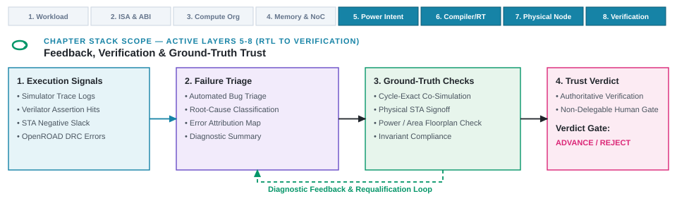

---
format:
  html:
    output-file: index.html
---

# Verification, Feedback, and Learning {#sec-feedback-verification-trust}

{fig-alt="A returned signal passes through verification qualification and a bounded claim before feedback routes the next action and learning is retained."}

::: {.epigraph}
> *"Program testing can be used to show the presence of bugs, but never to show their absence!"*
>
> — Edsger W. Dijkstra, *Notes on Structured Programming* (1970) [@Dijkstra1970Notes]
:::

::: {.column-margin}
**Author's Note.** Dijkstra's warning separates an architectural check from the broader claims we might attach to it. Passing testbenches only validates the specific conditions and workloads we exercised. A single failed assertion can shatter a bounded claim about our design's correctness.
:::

::: {.callout-crux}
When signals return from AI-native design workflows, what do they actually reveal about chosen actions, hardware artifacts, assumptions, or performance results? More importantly, how should architectural strategies adapt based on that feedback?
:::

A returned signal never explains itself. Verification performs the critical work of determining whether a given return is trustworthy and what architectural decisions it can legitimately support. In traditional workflows, human architects manually authored register-transfer level (RTL) code, ran static electronic design automation (EDA) verification passes at backend milestone gates, and evaluated single design points. In AI-native workflows, autonomous generators can produce thousands of candidate hardware blocks in minutes, fast surrogate models can predict power-performance-area (PPA) metrics continuously, and optimization loops search high-dimensional design spaces. This evolution accelerates candidate synthesis, but it creates a verification bottleneck. While candidate generation can scale far faster than review (@sec-design-loop-no-longer-scales), the property-specific qualification required to trust each candidate remains governed by physical measurement and mathematical proof.

We use empirical checks to qualify the observed quantities we gather from benchmark runs, experiments, FPGA prototypes, or production systems. When we perform dynamic verification, we use targeted tests, cycle-accurate simulation, or hardware emulation to exercise our design and observe its specific behaviors. Formal methods allow us to use mathematical models and logic to establish the status of a property over a model under clearly stated assumptions [@Clarke2018ModelChecking]. We must treat these approaches as complementary rather than interchangeable.

Feedback is how we interpret these qualified results for a specific design component and identify our next justified engineering action. Learning then captures what our team improves or retains based on that interpretation. A given return might report a performance measurement, expose a deep pipeline failure, localize a critical path bottleneck, challenge a microarchitectural rationale, or leave a design question unresolved. We can only justify a recorded update to our designs when we explicitly document what tool produced the return, which hardware component it refers to, when it was obtained, and exactly what kind of architectural pivot it supports.

Our architectural studies combine a wide variety of inputs. These include empirical measurements, formal verification bounds, trace-driven simulations, physical layout analysis, predictive model scores, peer design reviews, and real-world operational observations. We cannot assume these heterogeneous signals share a universal definition of a pass, a uniform type of uncertainty, or a single scope. As architects, we must qualify every return against the precise hardware property it attempts to address. Architects must compare matched cases, expose the corner cases that remain unchecked, and route our results into the design process rather than passively letting the signal dictate its own application.

Today, our AI generators can rapidly synthesize hardware candidates, our predictors can score them almost instantly, and our optimizers can search vast design spaces directly against imperfect power or area proxies. Generated LLM explanations can also express a degree of certainty that our empirical measurements cannot justify. This acceleration does not absolve us of our property-specific verification obligations. Every generated candidate demands a check against a declared architectural property, an adequate golden reference model or expected-result rule, explicitly recorded environmental conditions, and comprehensive test coverage.

Furthermore, when we use AI to generate our tests or assertions, we create new questions about the adequacy of those checks. While our capacity for candidate production can grow rapidly, the human-in-the-loop work required to qualify a result remains the bottleneck.

As the fourth technical building block of Architecture 2.0, verification and feedback transform raw tool execution into qualified evidence. Bringing our state representations (@sec-data-representations-world-models), search methods (@sec-methods-generation-prediction-optimization), tool environments (@sec-architecture-environments-tool-interfaces), and feedback mechanisms presented here together completes the technical building blocks of Architecture 2.0. This unified substrate enables us to transition from foundational technical building blocks to the active closed-loop execution and human architect ownership explored in Part III.

::: {.callout-learning-objectives}
This chapter establishes the following learning objectives:

- Qualify tool returns by type and status to preserve data lineage.
- Interpret formal bounds and empirical uncertainty without overextending claims.
- Isolate a real design difference from confounding conditions, run-to-run variance, selection effects, and proxy error.
- Route formal proof returns and empirical checks into defensible repair actions.
- Apply qualified feedback to guide actions without treating every return as ML training data.
:::

## Qualified Architectural Actions and Decisions {#sec-from-feedback-to-decision}

To satisfy the high standards of a valid architectural result, we must first transform raw simulation traces and tool logs into qualified engineering evidence. An execution log records what ran, but it cannot tell us what a measurement actually means for our hardware design. While our design environment logs whether an execution attempt succeeded, failed, or timed out (@sec-architecture-environments-tool-interfaces), converting those raw execution traces into sound design choices requires us to bridge the gap between tool output and architectural reasoning. Before we allow a returned metric to steer our pipeline parameters or microarchitectural choices, we must determine whether that signal reflects the physical property we intend to evaluate. From there, we establish what bounded claim our qualified result can support and which technical decisions we are ready to make.

Translating raw tool feedback into legitimate architectural revisions requires building a sequence of qualified claims before committing to design changes. First, we qualify the result to establish exactly what it means. Once we have that qualified result, we can use it to support a bounded claim about our design. Only then does a specific architectural action become eligible, allowing us to safely lock in a design change or a learned lesson. We cannot skip steps here since a flaw early in this sequence invalidates all subsequent steps.

Not every tool returns a hard measurement. We might receive a design review rationale, a model critique, a formal proof status from JasperGold, a counterexample trace, or even a compiler warning. These qualitative outputs are valuable to our design process provided we record their source, target, scope, timing, and limitations. Whenever we get a raw numerical return, we must qualify it before we can trust it enough to compare different microarchitectural choices.

A failed setup gives us no measurement at all. An evaluation failure is a diagnostic-cable problem, not an engine problem. When the diagnostic cable is unplugged, nothing has been learned about the engine. Even if our EDA process exits cleanly, it might still hand us a partial timing report from Tempus, omit an essential power metric, report energy in the wrong units, or mistakenly parse an unfamiliar warning as a success. Conversely, a complete return might report a genuine design rule or timing violation. We must preserve the raw execution status intact so our interpretation phase can distinguish between a tool failure and an architectural failure.

When an evaluation run does not finish, we do not necessarily need to discard every artifact it generated, but we must tie any salvage operation to a specific architectural claim. We can only push an individual metric or artifact forward into qualification if our run specifications treat it as independently complete. Its extraction and lineage must be flawless, we must be certain that the premature termination did not alter its meaning or observation window, and our architectural claim cannot depend on any state that went missing. If any of these conditions fail, we must quarantine that artifact along with the failed run. Salvaging a single data point does not make our timed-out or incomplete attempt complete. Every other claim we hoped to evaluate remains unresolved.

As architects reviewing these results, we must separate five distinct questions. First, did our requested simulation or synthesis run actually execute? Second, is the artifact we got back structurally and semantically valid for the next step in our toolchain? Third, is the measurement or formal verification result valid under the conditions we stated? Fourth, which specific design requirement does this result satisfy or contradict, and what parts of our architecture remain untested? Finally, what concrete architectural conclusion or revision can we confidently support? Earning a "yes" to any one of these questions never automatically guarantees a "yes" to the ones that follow.

Evaluating a 64-bit RISC-V compute subsystem (RV64GCV) featuring a vector-capable CPU, an NPU tensor matrix accelerator, and multi-die chiplet interconnects including Universal Chiplet Interconnect Express (UCIe) for high-bandwidth die-to-die streaming illustrates these qualification requirements. Our Lighthouse prompt stack anchors this subsystem against an XRBench real-time mobile XR workload alongside the SPEC CPU2017 CPU benchmark suite and MLPerf Mobile inference benchmark kernels under a 3\ W TDP target in a TSMC N7 or 3\ nm-class LP mobile process.

As we lower software kernels from domain-specific JIT compilers through compiler Intermediate Representations (MLIR and LLVM IR) down to RISC-V Vector (RVV) assembly, we model internal Control-Data Flow Graphs (CDFGs) and memory traffic using systolic array traffic simulators and cycle-accurate DRAM timing simulators. When a generated RTL block for this compute substrate passes through synthesis in Yosys and physical design in OpenROAD, the run might complete successfully and hand us the gate-level netlist, log files, and a preliminary timing report from OpenSTA.

Even if that RTL parses cleanly, it might fail elaboration in Verilator, struggle with TSMC library binding, fail SystemVerilog Assertion (SVA) elaboration in JasperGold, fail Bounded Model Checking (BMC) depth bounds, or fail an IEEE 1801 Unified Power Format (UPF) power-domain boundary check. If that happens, the artifact is functionally invalid for the rest of our tool path. Even if the design elaborates, static timing signoff tools like Tempus or thermal signoff tools like RedHawk-SC might leave critical endpoints unconstrained or evaluate the wrong process corner, rendering the data invalid for our physical claims. A qualified timing result only proves we met setup timing; our 3\ W TDP power envelope, UCIe interface protocol compliance, UPF power domain isolation, and formal SVA correctness remain uncovered, meaning we can never select our final architecture based on timing alone.

A raw tool return gains architectural meaning through a five-stage qualification pipeline, moving from initial execution recording through result qualification and property-appropriate verification checks to feedback scoping and final architectural learning (@fig-evidence-flow). Our execution record first captures raw returns alongside their complete invocation lineage. Next, result qualification binds the metric type, target design object, semantic meaning, and operating corners. When supporting comparative claims, we introduce a matched comparator, while formal and physical returns pass through specialized verification checks (such as SystemVerilog Assertion bounds or static timing signoff). Scoping our feedback then defines precisely what the result supports and rules out unverified inferences before we update our design state or retain lessons. The side routes in this process govern our iterative workflow. If we encounter an incomplete or corrupted return, we route it directly to execution repair to fix our tool environment. If a candidate fails an invalid comparison or property check, we loop back to reformulate our architectural study rather than prematurely discarding the design.

![**Tool returns gain architectural meaning through claim-specific result qualification.** Our execution record first supplies a return with its status and lineage. Our result qualification then binds its type, target, meaning, and operating conditions. When we make a comparison to support a comparative claim, we add a matched comparator. Our formal and other returns follow the property check appropriate to their type. Finally, our feedback step scopes our interpretation of exactly what the result supports and does not support before we record what to improve or retain in our architecture.](images/fig-evidence-flow){#fig-evidence-flow width="100%" fig-alt="A five-step flow from tool return through verification and a comparison or property check to feedback and a learning step that records what to improve or retain. Side paths send incomplete returns to execution repair and invalid checks to study formulation."}

Our checks establish the limits of what a result can tell us. The feedback we gather does not automatically prescribe its own architectural update. Figuring out which specific design object needs our attention depends on what produced the return, because our various simulation, synthesis, and formal verification tools expose different properties, capabilities, and limitations.

## Evaluation Signal Sources and Feedback

Because no single verification tool or simulation framework can give us a complete picture of a complex system-on-chip, modern hardware evaluation forces us to synthesize a broad spectrum of heterogeneous signals, ranging from early human code reviews and fast analytical roofline models to multi-day gate-level timing runs and post-silicon telemetry. Because every evaluation source operates at a distinct spatial and temporal resolution, each carries its own inherent blind spots and abstraction errors.

Our evaluation sources range from human design reviews and analytical models through cycle-level and RTL simulation to emulation, physical signoff, and post-silicon telemetry. Each returns a different form of signal at a different timing and locality, and each demands a different quality question before we use it.

As architects, we should select and qualify a source based on the specific property we are evaluating and the action we plan to take. We cannot treat the speed, density, or directness of an observation as a proxy for its evidentiary quality.

A delayed signal often reveals a final outcome without instructing us on how to remediate the underlying design. For instance, a three-day physical signoff run using Ansys RedHawk-SC or Cadence Tempus might show that our candidate violated IR-drop limits or missed setup timing under thermal stress. That terminal result does not tell us which of our thousands of microarchitectural or synthesis choices caused the violation. When dynamic thermal management (DTM) or IR-drop induced voltage droop causes cycle-stretching on CPU cores or NPU matrix engines, the raw signoff report only records a degraded wall-clock result. To meaningfully revise our design, we need signals at the right locality, such as path slack explicitly linked to the exact Control-Data Flow Graph (CDFG) node, Abstract Syntax Tree (AST) construct, compiler IR transformation, or netlist primitive that we just changed. We should treat Ansys RedHawk-SC thermal and IR-drop feedback as a foundational constraint that informs our upstream microarchitectural choices and layout synthesis strategies from initial design formulation, not only as a backend signoff step.

Feedback engineering provides a useful precedent by distinguishing whether the state required for a corrective action is observable from the design of the action itself, while treating delay as an inherent part of the feedback path [@AstromMurray2008FeedbackSystems]. In our context, a multi-day simulation or synthesis run can leave the root cause of a failure only partially observable, even when the final chip-level outcome is clear. While we do not model architectural design search as a simple linear controller, we extract a lesson. The availability and latency of our signals dictate which design corrections we can justify.

When handling these delayed results, we must start with lineage tracking rather than jumping straight to causal attribution. We need to bind every returned signal to our exact design candidate, parent actions, represented state, timing constraints, EDA tool versions, random seeds, simulation checkpoints, and the specific workloads that produced it. Provided our execution, setup, extraction, and checking conditions remain valid, a terminal result establishes that our candidate missed timing under those exact parameters. It still does not tell us which earlier architectural decision caused the miss.

Our next step is to perform a distinguishing comparison. We must systematically analyze path endpoints, constraint coverage, routing congestion, power-density maps, and the structural differences between our current candidate and its parent or a matched sibling. If we uncover a stale constraint or a broken simulation setup, we route our revisions back to the environment or representation. If we see repeated failures across a matched class of design proposals, after verifying our shared setups, we can justify reopening our methodology to ask whether our representation, constraints, or proposal generation process needs an overhaul. Only when our comparison isolates a localized mechanism can we justify a specific RTL or architectural revision. If our diagnostics cannot separate these possibilities, we should preserve the terminal outcome and leave the mechanism unresolved rather than arbitrarily assigning a negative label on every upstream action.

Deployment feedback follows this same principle. A production incident attaches first to the shipped silicon, system software, customer workload, and the specific operating conditions present at the time. While those extreme deployment conditions might reopen an earlier architectural claim, the production symptom itself does not identify the responsible design choice until we can support that attribution with an additional, targeted diagnostic or comparison.

Dense and immediate feedback is easier for our methodologies to learn from, but it is often just a proxy. The signals that observe our most decision-relevant properties, like silicon-accurate power or full-system performance under thermal constraints, are slower, more expensive, and less frequent. We can use fast proxy signals to guide our design search only within their qualified range, while relying on slower, less frequent sign-off checks to test the properties our proxies omit. Consequently, we must qualify every signal in our workflow by its latency, spatial granularity, execution cost, uncertainty, and the time required for interpretation and review.

The funnel in @fig-synthesis-verification-funnel is a constructed composite of this multi-stage bottleneck. The stage sequence is real. Generated candidates must survive syntactic parsing, interface and schema compliance, functional simulation against assertions, static timing closure, and physical layout signoff, and published generation benchmarks report severe attrition at the earliest of these stages, syntactic validity and functional simulation [@VerilogEval; @RTLLM]. The specific rates in the figure are constructed to make the compounding inspectable, not measured from any single flow. When representative per-stage pass rates are composed end to end, a pool of one hundred thousand proposals shrinks to fewer than one hundred survivors, a cumulative yield below a tenth of a percent. A project's own stages and rates will differ; the compounding is the durable part.

High proposal velocity alone cannot accelerate our hardware design unless we pair it with early, stage-matched verification filters.

![**Composed stage attrition collapses candidate pools, shown as a constructed illustration.** Panel A tracks attrition across five signoff stages as representative per-stage pass rates compound from 100,000 proposals to fewer than 100 survivors. Panel B shows each stage's conditional pass rate given survival of the prior ones. The stage sequence is real, and published benchmarks report severe early-stage attrition [@VerilogEval; @RTLLM]; the specific rates are constructed for inspectability, not measured from any single flow.](images/fig-synthesis-verification-funnel){#fig-synthesis-verification-funnel width="100%" fig-alt="Two-panel visualization showing candidate attrition across five physical verification signoff stages from 100,000 proposals down to fewer than 100 surviving candidates alongside stage-specific conditional pass rates. Values are constructed for illustration."}

## Empirical Admission Criteria

To determine whether a measured numerical value is eligible to enter architectural comparisons, we must establish strict empirical admission criteria. Empirical measurements form the backbone of architectural evaluation, yet every value extracted from simulation, synthesis, or hardware prototyping comes with inherent noise. Whether we collect cycle counts from gem5, a cycle-accurate architectural simulator, or timing slack from Verilator, an open-source Verilog simulator, our raw data carries sampling variation, numerical tolerances, and underlying model errors. We must separate these practical empirical limits from the logical bounds of formal mathematical proofs.

Six required provenance record elements explicitly bind candidate identity, metric units, operating conditions, extraction status, and error bounds before data enters decision-making (@tbl-measurement-record).

To enforce this standard, our qualification workflow audits every raw tool return against these six elements before the value is eligible for any decision, with each element answering a distinct provenance question about the return.

| **Record Element** | **Question the record must answer** |
| --- | --- |
| Candidate identity | Which design revision, hardware configuration, software state, and workload produced the value? |
| Quantity and unit | What architectural metric was measured or computed, how did we aggregate it, and in what unit? |
| Conditions | Which simulation tool, power/timing model, corner, RNG seed, and operating conditions apply to this run? |
| Extraction status | Did the expected output artifact exist, parse successfully under our declared schema, and retain unfamiliar warnings? |
| Variation and error | What repetitions, trace sampling method, numerical tolerance, modeling error, or known bound restricts the value? |
| Source record | Which returned artifact and execution attempt support this metric, and can we fully recover the value from them? |
: **A measurement needs identity, meaning, conditions, and limits.** These record elements test whether our execution trace provides sufficient evidence for the architectural comparison we intend to make. {#tbl-measurement-record}

We only allow a returned value to enter our design comparisons when these six elements make the data interpretable, establish its boundaries, and preserve a recoverable link to the original execution attempt. We treat these requirements together as a strict admission test rather than a set of independent quality scores. Passing this test does not automatically validate our architectural comparison. It simply qualifies the measured value as eligible to participate in one.

When we analyze sampled workloads across heterogeneous accelerators and CPU cores, our execution record must explicitly specify the unit of observation, the target instruction population, the trace sampling window, our aggregation method, and any dependence structure. Measuring instructions per cycle (IPC) in isolation without logging wall-clock execution time, thermal throttling states, or memory bus stall cycles fails to capture the true workload performance. When we track these parameters, we separate a merely mathematically correct computation from a robust estimate that represents the workload population and drives valid architectural decisions.

Our simulation and synthesis environments provide the raw returned artifacts, extraction statuses, recorded operating conditions, and precise data lineage. We cannot rely on measurement qualification to synthetically reconstruct missing RTL versions or retroactively rerun a log parser. Qualification asks whether our specified quantity, aggregation strategy, error margins, chosen comparator, and checking scope render the extracted metric usable for architectural evaluation. If we find missing execution parameters, we must repair our experimental environment. Conversely, if we uncover inadequate trace observations or flawed design comparisons, we must overhaul the study itself.

::: {.callout-lighthouse title="A returned value must qualify before it becomes feedback"}
**Context.** Evaluating a prospective larger L2 cache configuration for an RV64GCV vector-capable CPU and NPU accelerator block running an XRBench real-time mobile XR workload alongside SPEC CPU2017 and MLPerf Mobile benchmark traces. The software pipeline lowers Triton JIT blocks into RVV 1.0 vector primitives, with data movement modeled using SCALE-Sim SRAM buffers and Ramulator LPDDR5X DRAM timing under a 3\ W TDP envelope in a TSMC N7 or 3\ nm-class LP mobile process. During verification, static IEEE 1801 (UPF) power-domain checks pass, but a Bounded Model Checking (BMC) run in Cadence JasperGold or an SVA property check ends in a stale-state setup failure, while an Ansys RedHawk-SC thermal signoff summary report omits raw trace lineage. Neither return constitutes qualified architectural evidence. The stale-state failure remains retained evidence of an infrastructure problem, while the incomplete thermal summary remains a retained but unqualified tool return.

**Required record.** For qualification across all 8 layers of the prompt stack, the exact workload trace (XRBench, SPEC CPU2017, MLPerf), ISA contract (RV64GCV), compute organization, memory simulation models (SCALE-Sim, Ramulator), power envelope (3\ W TDP), compiler lowering state (Triton JIT to RVV 1.0), physical process conditions (TSMC N7 or 3\ nm-class LP), and verification artifacts (UPF IEEE 1801, SVA, BMC, RedHawk-SC) are needed. The terminal status, raw return data, extraction status, units, operating conditions, and specific bounds are also required.

**Action.** The stale-state failure must route back for environment repair while retaining its recorded failure class. The subsequent unverified thermal value remains unqualified until its missing record is supplied. No architectural candidate is rejected based on either flawed case.

**Takeaway.** Mere chronological progress does not transform an infrastructure failure or an unrecoverable data summary into valid architectural design evidence.
:::

Until our execution records fully qualify, we cannot support any claims about a design candidate's outcome or its underlying architectural mechanisms. Once we qualify a measurement, it enters the comparisons demanded by our core architecture questions. Qualification establishes the precise meaning of a single returned value, whereas comparison reveals the architectural differences between our proposed candidate and a declared baseline alternative under matched conditions.

Empirical uncertainty and formal proof status answer different questions. An empirical confidence interval summarizes hardware variation under a specific sampling and repetition procedure. How we interpret it depends heavily on the target instruction population, our chosen statistic, dependence structures, modeling errors, and required decision margins. In contrast, a formal verification result is never just a narrow empirical interval. It carries no sampling confidence level. It reports a definitive logical outcome for a mathematically stated property, machine model, and set of assumptions. While solver timeouts in Cadence JasperGold, proof depth boundaries, and memory constraints might limit a formal proof's scope or completion, they never degrade its statistical confidence. Before we resume any architectural comparison, our formal returns demand their own parallel qualification path that evaluates the stated property, the formal model, the underlying assumptions, and the proof scope.

## Formal Proof Bounds and Equivalence

Unlike empirical simulations that sample execution space, formal verification yields exact mathematical bounds over specified property, model, and assumption tuples. This mathematical rigor demands a dedicated qualification path. Because a formal proof holds only within its stated boundary conditions, we must evaluate how formal proof statuses, bounded search limits, and sequential equivalence mappings translate into physical hardware guarantees.

### Proof Statuses and Traces

Formal verification shares our primary qualification path, yet it operates without requiring a matched comparator design. Instead, a formal status relies on a tight triad consisting of the property, the model, and the governing assumptions. First, our property explicitly states the architectural behavior we need to verify, typically written as SystemVerilog Assertions (SVA). These assertions act as core microarchitectural contracts, mathematically binding statements that define the correctness of our microarchitecture, not optional testbench aids. Second, our model precisely defines the state, transitions, and specific artifacts over which we interpret that property. Finally, our assumptions carefully constrain the inputs, environmental behaviors, resets, clock domains, protocols, and neighboring components in formal tools like Cadence JasperGold or Synopsys VC Formal, a formal property verification environment. For our formal results to carry meaning, we must carry all three elements together. If we construct a proof over an inaccurate model or force an impossible assumption, we might generate a logically sound result that is ultimately useless for our architectural goals.

We often find that the model we actually check differs from the raw RTL or implementation artifact outlined in our architecture claims. Processes like elaboration, extraction, and abstraction frequently add or discard specific behaviors to make the proof tractable in engines like Jasper. Consequently, our results must explicitly state the exact correspondence our verification flow preserves between the abstract model and the final artifact, justifying why this relationship successfully maps the proved property back to our silicon [@Clarke2018ModelChecking].

We must also trust our checking base, which comprises the sequence of steps and components that transform our architectural artifact and its requirements into the mathematical problem the solver evaluates. Our documentation must identify the elaboration or model extraction procedures, property translations, relevant SVA libraries and scripts, the specific solver or proof checker used, and any available certificate or replay path. We can produce a logically valid proof for a mistranslated property or an improperly extracted model, only to fail the underlying architecture requirement. Whenever our tooling yields a checkable proof certificate or replay artifact, we should retain it. If a tool offers no such artifact, we must avoid implying that one exists in our records.

We must ensure our project records distinguish whether the checker produced a complete proof, generated a counterexample trace, reached a bounded-only result, or remained inconclusive. Each distinct status dictates a specific set of next actions for our engineering teams. We cannot relabel one result as another because we are under pressure to reach closure.

When examining counterexamples from formal engines, we need to make one distinction before we begin any repairs. In counterexample-guided abstraction refinement (CEGAR), we often encounter spurious counterexamples that exist solely because our abstract model permits behaviors blocked by the concrete hardware [@ClarkeEtAl2000CEGAR]. These traces guide us in refining the abstraction itself, rather than proving our design is flawed. If a trace in a DMA controller or NPU memory management unit survives our concretization process and setup reviews, it likely exposes an architectural defect or an incorrectly specified requirement. We must treat CEGAR as a specific formal-verification procedure rather than a generic label for any feedback loop. The exact nature of the counterexample dictates whether we must repair our abstraction, rethink our hardware design, or rewrite our requirement.

### Bounded Search and Vacuity

Bounded Model Checking (BMC) provides an essential early diagnostic that searches for property violations within a finite state horizon [@BiereEtAl1999BMC]. We treat BMC as a foundational diagnostic instrument that eliminates shallow state-space errors before we attempt full inductive proofs, not merely an incomplete proof. If we fail to find a counterexample within this limit, we still cannot definitively rule out a deeper failure later in execution. To claim unbounded safety, we must either provide a completeness argument or deploy an unbounded method like induction or property-directed reachability techniques such as IC3/PDR [@Bradley2011IC3; @EenEtAl2011PDR]. Even after achieving an unbounded proof, our result only validates the stated property across our modeled transition system and its localized assumptions.

We must carefully distinguish between safety and liveness claims in our architectures. A safety property excludes negative behaviors, such as preventing two disparate requesters from simultaneously holding exclusive ownership of a single cache line or NPU tile buffer. Proving this safety property without bounds still tells us nothing about system progress. To guarantee progress, we use liveness properties, which mandate that an accepted request will eventually receive a proper response [@AlpernSchneider1985Liveness; @Clarke2018ModelChecking]. While a bounded check might expose a stalled execution or a localized deadlock within our search horizon, it cannot prove that our system remains free from starvation or permanent deadlock over infinite time. For any unbounded progress claim, we require a liveness-capable proof or a justified reduction. We must retain the specific fairness assumptions that preclude actions from being indefinitely postponed. If we adopt unrealistic fairness assumptions, we risk masking architectural progress defects. Therefore, our final results must transparently record the property class, our chosen fairness assumptions, the precise proof method, and any specific bounds or reductions we applied.

We must remain vigilant against properties passing without checking our intended behaviors. We encounter vacuity when the antecedent condition meant to trigger an SVA property never actually occurs during formal execution, making the logical implication vacuously true [@BeerEtAl2001Vacuity; @Clarke2018ModelChecking]. Even a nonvacuous property can be structurally weak. It might tolerate a response arriving thousands of cycles late, omit mutual exclusivity constraints, ignore reset sequencing, or monitor one requester while leaving others unconstrained. To combat this, we exercise our properties using SVA cover statements, verifying reachable triggers, checking against known positive and negative cases, applying mutation testing, and constantly reviewing them against high-level architectural requirements. While modern frameworks like AssertLLM, an automated assertion generation framework, can automatically generate SystemVerilog assertions from design specifications and verify them against golden register-transfer-level (RTL) models using formal property verification [@FangEtAl2025AssertLLM], we remain vulnerable. If both our RTL and our generated assertions inherit the identical missing requirement, a clean proof tells us nothing about the omitted architectural behavior.

We must treat these generated assertions as verification artifacts that demand qualification in their own right. Recent studies of LLM assertion generation demonstrate that general-purpose models often produce substantial fractions of syntactically and semantically invalid assertions, although task-specific, fine-tuned models markedly improve performance across those two dimensions [@PulavarthiEtAl2025AssertionGeneration]. Regardless of their origin, we must verify their syntax and elaboration in formal tools or simulators, assess their semantic strength, confirm their coverage of our intended architectural properties, and evaluate whether they successfully trap intentionally seeded bugs or known historical defects. Although these checks make automated assertion generation more useful in our design flows, they can never guarantee that our resulting property set is mathematically or architecturally complete.

### Equivalence and Refinement

Equivalence checking addresses a hardware design question regarding whether a transformed implementation faithfully preserves the structural or behavioral properties of a golden reference design. We often use combinational equivalence checking (CEC) to pair state elements as structural cut points, allowing us to easily compare the combinational logic sandwiched between them. We must escalate to sequential equivalence checking (SEC) whenever our architectural transformations, such as aggressive retiming in NPU vector pipelines, pipelined latency adjustments, insertion of additional state, or modifications to reset mappings, alter the direct correspondence across state or time boundaries. Neither technique proves that the reference artifact actually embodies the intended architecture [@Kropf1999FormalVerification].

We also find that strict equivalence is often too rigid, particularly when our RTL implementations intentionally introduce microarchitectural details or permit fewer non-deterministic behaviors than our high-level specifications. In these cases, we rely on a refinement check, asking instead whether every implementation behavior allowed by our mapping respects the broader specification. Because we routinely decompose large proofs by component, we frequently rely on assume-guarantee reasoning. Under this framework, each individual block, such as an NPU matrix tile or a CPU load-store unit, proves its guarantee only as long as its surrounding environment satisfies a set of explicitly named assumptions. Our overall system composition remains sound only if the neighboring blocks' guarantees successfully discharge those assumptions [@BenvenisteEtAl2018Contracts]. We must never assume a localized block proof silently scales into a whole-system proof. Consequently, our refinement mappings, precise component boundaries, interface assumptions, and any unproved remainders must all be documented as integral parts of our final verification result.

### Formal Bounds Versus Dynamic Coverage

Architectural verification requires us to trace every core requirement directly to the specific formal property or dynamic test suite designed to evaluate it. Our documentation must transparently link the original requirement source and the claimed RTL back to the checked model, its governing SVA properties, bounding assumptions, and any applied abstraction or extraction relations. To extend finite Bounded Model Checking (BMC) depth $k$ into an unbounded safety proof, $k$-induction reasons over an initial-state predicate $Init$, a transition relation $T$, and the safety property $P$. The base query searches for a reachable counterexample through depth $k$:

$$B_k = Init(s_0) \land \bigwedge_{i=0}^{k-1} T(s_i,s_{i+1}) \land \bigvee_{i=0}^{k} \neg P(s_i).$$

The inductive query searches for a valid trajectory that satisfies $P$ for $k+1$ consecutive states and then violates it:

$$S_k = \bigwedge_{i=0}^{k} P(s_i) \land \bigwedge_{i=0}^{k} T(s_i,s_{i+1}) \land \neg P(s_{k+1}).$$

An unbounded safety result requires both queries to be unsatisfiable, subject to any strengthening invariants and the recorded transition model. A static satisfiability check over assumption text is not enough to defend against over-constraint. We must test assumptions jointly in the transition system, exercise reachable triggers with cover properties, and inspect vacuity for the property language in use. We also retain the proof method and status, bound or completeness rationale, refinement or composition boundaries, and any unverified logic. Even a clean proof set does not establish that the property set is architecturally complete.

We approach dynamic simulation with a different set of claims. In our workflows, directed tests, constrained-random stimuli in Verilator or Synopsys VCS, an event-driven Verilog simulator, coverage-guided generation, large-scale hardware emulation, formal methods, and post-silicon testing all complement one another, primarily because exhaustive dynamic simulation remains infeasible for modern chips [@Kropf1999FormalVerification]. We can apply reusable Universal Verification Methodology (UVM) environments[^fn-uvm-c07] across multiple related candidates, but our stimulus, checkers, assertions, coverage models, and debug capacity must evolve to match the new behaviors those candidates introduce. A verification environment inherited unchanged from the baseline is itself an assumption we have not checked. We use code coverage to report on the specific structural elements we managed to exercise during execution. We apply functional coverage to track the specific architectural events or data bins defined in our verification plans. SystemVerilog standardizes functional-coverage constructs like covergroups, coverpoints, discrete bins, and crosses to help us quantify our progress [@IEEE2023SystemVerilog]. Yet neither coverage family can mathematically guarantee what fraction of the reachable behavior we checked. Conversely, our formal proofs can never verify a property we failed to write down.

[^fn-uvm-c07]: **Universal Verification Methodology (UVM)**: A standardized SystemVerilog library and class hierarchy for constructing modular, coverage-driven hardware verification testbenches [@IEEE2020UVM].

To bridge the throughput gap between slow software RTL simulation and full silicon execution, we deploy enterprise hardware emulation platforms such as Siemens Veloce, Cadence Palladium, and Synopsys ZeBu. When we compile synthesizable RTL onto custom hardware processor arrays or dense FPGA fabrics, emulation can accelerate execution by orders of magnitude over event-driven software simulators. This speedup allows us to boot complete operating systems, execute multi-billion-cycle ML inference workloads, and evaluate complex hardware-software co-design decisions prior to tape-out. We use transaction-level transactors and speed adapters to interface virtual software models with high-speed emulator hardware, allowing software teams to validate production drivers and firmware against target register-transfer logic. Emulation delivers high throughput, but we must account for its reduced signal visibility compared to software waveform traces and verify that clocking abstractions introduced during emulator compilation do not mask microarchitectural race conditions.

Modern energy-efficient architectures also demand explicit low-power verification to validate power gating, dynamic voltage scaling, and multi-rail power topologies. We specify low-power architectural intent through the IEEE 1801 Unified Power Format (UPF), a standardized specification language that decouples power domain intent from functional RTL logic [@IEEE2024UPF]. Within UPF, a power state table (PST) defines a formal state matrix governing the legal operating voltage combinations across interdependent power domains, ensuring that level shifters and isolation cells prevent floating signals or protocol violations during low-power transitions. Low-power verification requires us to combine static UPF rule checking with low-power aware (LPA) simulation and formal UPF verification. Static UPF checks verify that every signal path crossing power domain boundaries includes an appropriate isolation cell and level shifter. Low-power aware simulation explicitly models signal corruption during power-down, retention save and restore sequences, and voltage domain transitions. If a power state machine triggers an illegal power state transition or fails to isolate an active receiver from a powered-down driver, UPF verification flags the floating signal or protocol violation before logic synthesis and layout signoff.

Published accounts of the historic Pentium floating-point division (FDIV) failure detail both the underlying microarchitectural flaw and the \$475M pre-tax replacement charge Intel absorbed [@Edelman1997PentiumDivision; @Intel1995PentiumCharge; @Colwell2006PentiumChronicles].

::: {.callout-war-story title="The Pentium FDIV flaw and the limit of sampled testing"}
**The claim.** Pre-silicon execution-unit verification relied on constrained-random dynamic simulation, which passed millions of floating-point division vectors without discovering a flaw.

**The gap.** In the Radix-4 SRT division lookup table, 5 entries out of 1,066 in the Programmable Logic Array (PLA) were inadvertently omitted during script-driven array generation [@SharangpaniBarton1994FDIV; @Edelman1997PentiumDivision]. Because the defect manifested in only about 1 out of every 9 billion random division operations by Intel's own estimate [@SharangpaniBarton1994FDIV], dynamic simulation missed the missing PLA entries.

**The lesson.** Sampled dynamic simulation cannot guarantee the absence of rare corner-case defects in high-dimensional state spaces. In the years that followed, formal property verification matured from a research experiment into standard signoff practice for execution units; Intel's Core i7 flow is a documented instance [@KaivolaEtAl2009Corei7Formal].
:::

In the aftermath of such failures, we have seen formal verification evolve into the primary validation method for complex logic, such as the execution cluster within Intel's Core i7 design flow [@KaivolaEtAl2009Corei7Formal]. Having established this parallel qualification path in our discipline, we map the four formal result statuses to distinct technical actions in our engineering workflows as detailed in @tbl-formal-result-status.

When processing formal verification returns from tools like Cadence JasperGold, each of the four statuses licenses a distinct downstream action. A proof discharges only its scoped claim, a counterexample drives abstraction refinement or RTL repair depending on whether the trace proves spurious or real, a bounded-only result fixes a finite horizon we record without claiming unbounded safety, and an inconclusive run must be reparameterized rather than reported as a pass. No status may be promoted into another under pressure to reach closure.

| **Formal status** | **What it establishes** | **Eligible next action** |
| --- | --- | --- |
| **Proved** | We have established that the declared property or equivalence holds for the recorded model and assumptions, conditional on our property translation, the model-to-artifact relationship, our trusted checking components, and an available certificate or replay path. Our proof method need not be complete for a proved result to be valid. | We record the strictly scoped result and discharge only the architectural claim explicitly covered by that property, model, assumptions, and proof mode. |
| **Counterexample** | We have found a modeled trace that violates the property. Our setup, assumptions, and concretization routines will dictate whether this trace represents a truly realizable architecture failure. | We refine our abstraction whenever CEGAR identifies a spurious trace. Otherwise, we repair the design or requirement contradicted by a fully reviewed, realizable trace. |
| **Bounded-only** | We found no counterexample through our declared simulation horizon. We establish absolutely nothing beyond that bound without a separate completeness argument. | We record the finite bound and we either extend or change our checking method if the broader architectural claim matters, or we explicitly leave that claim open. |
| **Inconclusive** | Our solver supplied neither a proof nor a counterexample because it returned unknown, exhausted available compute resources, or simply failed to complete the proof procedure. | We systematically revise the abstraction, interface assumptions, proof method, or compute resource budget. We must never report this result as a pass. |
: **Formal result status dictates next technical actions in verification feedback.** A proof discharges only its carefully scoped claim, while counterexamples, finite bounds, and incomplete proofs force us to attempt different repairs or leave our broader architectural claims open. {#tbl-formal-result-status}

## Scoping a Comparison to the Claim It Supports {#sec-evidence-specific-to-claim-and-scope}

Once individual empirical measurements and formal proof bounds are qualified for admission, we can construct the comparative evaluations that guide design choices. Architectural decisions rarely turn on absolute performance metrics in isolation; they depend on relative differences between candidate designs. Determining whether a microarchitectural modification truly improves performance requires us to isolate hardware gains from confounding experimental noise, construct valid paired differences under matched workloads, and guard our search against statistical pitfalls such as the optimizer's curse.

If we are conducting a cache replacement study, we must ask how our candidate architecture behaves relative to a baseline under identical workloads and system software states. We can compare two candidate designs generated by different synthesis processes, but the result reflects only their measured architectural difference, not necessarily the overall quality of the methodologies that produced them. Therefore, we treat the comparator as an integral part of our design claim rather than a mere footnote appended after the fact.

Every comparison we make binds our specific candidate and comparator revisions to a single measured difference, linking them to the precise conditions that constrain that measurement (@fig-claim-frame). Our candidate design revision and baseline comparator feed a shared evaluation engine that computes one metric quantity and unit, from which we extract the raw paired difference alongside its statistical uncertainty model (such as a confidence interval derived from block bootstrapping). That measured difference is non-transferable; it remains bounded by the underlying software workload, initial microarchitectural state, EDA synthesis flags, process-voltage-temperature (PVT) corners, and the exact property observed by our verification check.

{#fig-claim-frame width="100%" fig-alt="Three-column comparison frame. Candidate and comparator feed a measured quantity, difference, and uncertainty, which are bounded by workload and design state, tool conditions, and check scope."}

If we change the workload, architectural state, EDA tool constraints, uncertainty model, or even the observable hardware property, we create a new comparison even if the center numerical value remains unchanged. When we maintain these bindings, we prevent ourselves from erroneously carrying a measured numerical difference over into operating conditions or architectural claims that we never actually evaluated.

For our set of matched architectural cases $c_j$, we define the fundamental paired difference as

$$
d_j = y(\text{candidate}, c_j) - y(\text{comparator}, c_j).
$$

We must explicitly state our sign convention. In our evaluations, a positive value might indicate a throughput improvement, yet simultaneously represent a latency regression. Whenever we report a percentage, we must clearly define its denominator. When we present an aggregate metric, we must specify whether it represents a mean, a specific tail percentile, a maximum bound, a geometric mean, or some other statistical measure. When dealing with positive performance ratios normalized against a reference design, we rely on the geometric mean to preserve a consistent relative interpretation across an entire benchmark suite. If we were to use an arithmetic mean of those ratios, our conclusions could artificially swing depending on which architectural baseline we arbitrarily chose as the reference [@FlemingWallace1986HowNotToLie]. Unless we make and document these methodological choices clearly, we risk combining two mathematically correct numbers into an incoherent architectural comparison.

### Confounding Factors

Isolating a microarchitectural intervention requires that our candidate and baseline designs differ strictly in the specific hardware mechanisms under study. Factors such as the software workload, simulation model version in gem5 or ChampSim, a trace-driven memory hierarchy simulator, synthesis tool flags, voltage/frequency operating points, dynamic thermal management (DTM) states, cache warmup periods, trace sampling windows, and total resource budgets can introduce performance deltas that have nothing to do with our proposed hardware change. To build a matched comparison, we record all of these factors rather than relying on similar output filenames or shared project directories.

We often hope that systematic modeling errors will naturally cancel out in a relative comparison. This cancellation only occurs if our simulator or analytical model treats the candidate and comparator identically across the specific design space region we are studying. We can sometimes use a frozen, slightly inaccurate simulator to confidently establish a rank ordering of designs even if its absolute predictions diverge from post-silicon reality. This fragile bargain collapses if our proposed architecture change crosses an unmodeled microarchitectural boundary or triggers a pathological behavior in only one of the candidates. We must treat error cancellation as a hypothesis that we verify, rather than an automatic property we inherit simply through applying the same evaluation framework [@GutierrezEtAl2014SourcesOfError; @PeherstorferWillcoxGunzburger2018Multifidelity].

### Paired Differences

High variance in benchmark execution traces or stochastic synthesis runs makes single-point measurements untrustworthy. When our tools or workloads exhibit substantial dispersion, we rely on repeated measurements to quantify run-to-run variance. We can use paired resampling techniques to preserve the critical relationship between our matched baseline and candidate execution frames.[^fn-paired-block-resampling-c07] The object we resample is the paired-difference sequence $d_j$, rather than treating the baseline and candidate as two independently resampled streams. The confidence interval we derive from this process assumes that our sequence remains sufficiently stationary over the sampled execution region, and that our declared block length successfully captures the temporal dependence relevant to our chosen statistic. Because architectural evaluations face compounding variations from numerical tolerances, finite trace sampling, heuristic synthesis algorithms, and underlying model errors, we often require specialized statistical treatments for each. We cannot simply apply a single generic error bar to our graphs and expect it to represent all of these distinct sources of architectural uncertainty.

[^fn-paired-block-resampling-c07]: **Paired block resampling**: A block bootstrap resamples contiguous segments of our paired-difference sequence. When we enforce this pairing, we keep each matched baseline and candidate case tightly bound together, while the block structure preserves local temporal dependence according to the method's underlying assumptions [@Kunsch1989BlockBootstrap].

Consider a hypothetical, fully retained matched simulation run where improvement is defined as baseline latency minus candidate latency. In this framing, a positive value indicates the candidate architecture is faster. Suppose the point estimate shows a 0.3\ ms speedup, but the 95 percent confidence interval stretches from -0.1\ ms to 0.7\ ms. These are invented teaching values, not empirical measurements drawn from a retained Lighthouse framework run. If future evaluations properly retain matched execution frame sequences and apply a declared paired block-resampling procedure, this interval spans both a minor performance regression and a larger improvement. Because the interval crosses zero, this hypothetical comparison leaves the architectural tail-latency question unresolved, regardless of how favorable the central point estimate appears.

To strengthen our evaluations, we can introduce a decision margin as a secondary test. If our architectural study requires a minimum practical improvement of at least $m$, our comparison must resolve the final result relative to $m$, rather than merely checking if it is greater than zero. Whenever our measured difference falls inside the boundaries of known measurement resolution or statistical uncertainty, we must accept that the outcome remains unresolved. While we might appropriately label this scenario a tie under a strict, predeclared evaluation rule, we can never claim it as an architectural improvement.

### Confirming a Selected Winner Independently

A controlled experimental setup protects against confounding variables, but it cannot prevent us from misinterpreting statistical noise during automated exploration. Confounding effects emerge whenever an undocumented or unintended factor could equally account for our observed performance gains. To isolate our intended microarchitectural changes from other plausible alternatives, we must routinely employ stable tool versions, ablation studies, controlled matched contrasts, and sensitivity analyses.

Selection bias introduces yet another pitfall in our design methodologies. If our design space exploration evaluates thousands of noisy candidate architectures and we only report the single best performer, our selected peak value retains some of the statistical luck that helped it win in the first place. This is the optimizer's curse, defined in @sec-methods-generation-prediction-optimization, and simply re-evaluating the same search data does nothing to remove it. To validate our findings, we must conduct a fresh evaluation that measures our chosen candidate architecture against new random seeds, disjoint workloads, or operating cases that played no part in the initial selection phase. This secondary evaluation forces us to answer whether our performance margin actually persists across independent operating conditions, long after our automated search process has stopped selecting peak outcomes based on noisy measurements.

Finally, even our most carefully matched comparison might rely on an evaluation proxy that fails to translate into a realistic, post-silicon architectural result. A favorable performance outcome also does not prove that our proposed hardware mechanism is functioning the way we think it is. Therefore, we must perform proxy qualification and dedicated mechanism testing as separate verification steps, to be executed only after we have successfully matched all candidate and comparator conditions.

## Qualifying Proxies and Calibration {#sec-proxy-mismatch-metric-gaming-and-calibration}

Even when baseline and candidate conditions are matched, accelerating high-dimensional architectural exploration forces us to rely on low-cost evaluation proxies. Yet a surrogate metric is useful only if its rankings faithfully reflect physical reality. When we rely on a cheaper signal, it must track our target architectural quantity closely enough to support the actual design decision we are making. We must detect and prevent microarchitectural proxy gaming, validate numerical calibration across held-out conditions, and separate observed architectural outcomes from their underlying causal mechanisms. A qualified proxy is useful, but it cannot answer the mechanism question on its own.

### Proxy Metric Gaming

Fast evaluation surrogates enable us to screen millions of design points in seconds, but optimizing directly against an incomplete proxy introduces real risks. Metrics like estimated instructions per cycle (IPC), analytical 0-cost memory roofline bounds, wirelength, routing congestion, hardware utilization, and simulated cycle counts all help us rank design candidates. They remain partial measurements. The danger grows when we point an automated optimizer directly at these proxies, driving what we term microarchitectural proxy gaming. This failure mode occurs when a search algorithm exploits mathematical approximations or unmodeled physical edge cases in a fast proxy metric (such as nominal IPC, simplified SRAM access latency, or 0-cost analytical fold bounds that assume 100 percent L1 cache hit ratios) to maximize the proxy score while degrading true physical performance (such as wall-clock execution time under severe DRAM bank-conflict serialization, total thermal design power, or IR-drop stability under dynamic thermal throttling).

We inadvertently reward our search algorithms for finding every corner of the design space where our proxy and our intended architectural result diverge. Metric exploitation is not an algorithmic bug but the primary failure mode of any search methodology optimizing an incomplete representation of physical reality.

This phenomenon is Goodhart's problem manifesting in computer architecture. A measure that originally tracked a design goal can abruptly stop tracking it once we make it our primary optimization target [@Goodhart1975MonetaryManagement; @Strathern1997Goodhart]. While AI-driven design methodologies are not unique in exposing this behavior, they change the scale and persistence with which they search for loopholes in our evaluation metrics. One prospective response is neurosymbolic design, which pairs probabilistic candidate generation with symbolic verifiers or Satisfiability Modulo Theories solvers. A formal check inside the search loop can reject candidates that violate an explicitly encoded property under recorded assumptions. It does not bound the generator's error generally, cover omitted requirements, or establish correspondence between the model and physical silicon.

Consider proxy gaming across an RV64GCV vector-capable CPU core and NPU matrix accelerator targeting XRBench, SPEC CPU2017, and MLPerf Mobile workloads. An optimizer directed at nominal IPC on an NPU systolic array might widen execution queues or introduce deep speculative pipelining. While nominal IPC on synthetic matrix multiplication kernels increases, the added logic breaches our 3\ W TDP target and raises peak power density in a TSMC N7 or 3\ nm-class LP mobile process. When lowered from Triton JIT to RVV 1.0 vector code, SCALE-Sim SRAM traffic and Ramulator DRAM bus models show increased memory latency. In physical signoff, thermal tools like Ansys RedHawk-SC or static timing analyzers like Cadence Tempus reveal that this power density triggers dynamic thermal management (DTM) throttling or severe IR-drop voltage droop. As a result, clock frequencies are scaled down or memory bus stall cycles multiply, causing wall-clock execution time to regress despite the deceptively high nominal IPC score. On vector-capable CPU cores, an IPC proxy can likewise reward speculative branch execution paths that fetch instructions without performing useful work, inflating measured IPC while degrading wall-clock latency, UPF IEEE 1801 power domain state preservation, and energy efficiency.

When we talk about proxy qualification, we must keep several relationships distinct. Numerical calibration gives us a declared mapping between our proxy outputs and much stronger reference outcomes. In contrast, confidence calibration asks whether our stated probabilities or confidence intervals match observed frequencies, a system-evaluation question we tackle fully in @sec-evaluating-agentic-architect. To evaluate observed qualification coverage, we record our sampled dimensions, our specific test strata or cases, and the gaps between them. We must run separate tests to determine our held-out error, the stability of our candidate rankings, our estimation uncertainty, and the overall fitness of the proxy for our architecture decision.

Observed qualification cases and held-out agreement answer separate questions, and @fig-trust-calibration shows where the two come apart across a fast proxy metric and a heavy-weight reference. Paired proxy and reference observations anchor our confidence only at the discrete sampled qualification strata. An unsampled gap sits between strata where no empirical qualification exists, so smooth interpolation cannot guarantee proxy validity across those unverified design points. As search moves beyond our sampled support zone, an uncalibrated proxy score can part company from true physical performance. The schematic therefore separates observed strata from internal gaps and from extrapolation beyond our sampled design range.

{#fig-trust-calibration width="100%" fig-alt="Conceptual normalized plot with three separate green qualification strata in the left-hand range. Paired proxy and stronger-reference markers appear in each stratum, while a dashed white band marks an unsampled gap between the first two. The curves may diverge as search continues into an unqualified right-hand range. No plotted curve is measured data."}

An internal gap remains unqualified even if both smooth curves happen to pass through it. We still need held-out comparisons to establish whether our estimation error and candidate ordering are adequate at the sampled strata. Whenever we move into that gap or venture beyond our observed range, we must perform new reference checks or provide a separate justification. The possible divergence on the right side of our plot serves as a practical warning. We cannot automatically assume that a higher proxy score outside our qualified support zone translates to a stronger architecture result.

In our computer architecture community, techniques like SMARTS and SimPoint provide specific precedents for making robust population inferences. When we sample intervals from a declared benchmark execution stream, statistical sampling supplies quantified confidence bounds [@WunderlichEtAl2003SMARTS] and phase analysis supplies representative interval selection [@SherwoodEtAl2002SimPoint]. That result does not automatically render an arbitrary held-out sample representative. When we conduct a new architecture study, we must explicitly declare our target population and justify our sampling design for it. Our inference does not extend to workloads, design candidates, EDA tools, or operating conditions outside the boundaries of those declarations.

Numerical calibration and ranking fidelity answer different questions. A numerically calibrated scalar mapping relates our proxy outputs to our heavy-weight reference outcomes under a strictly declared procedure, while a predictive interval explicitly adds a stated uncertainty model to our estimates [@ForresterSobesterKeane2008Surrogate]. On the other hand, ranking fidelity asks whether our candidate ordering survives the scrutiny of the stronger check. We can have low average error alongside wrong orderings near a critical architectural decision boundary, just as we can have useful ordering alongside biased absolute values. Proper qualification therefore reports the specific relationship our design decision requires, and it tests our proxy's error or instability against our explicitly declared margin.

Because a proxy can fail us in several distinct ways, and because each type of failure eliminates a different architectural inference, we must apply separate diagnostic tests for six primary concerns. Each surrogate weakness pairs with a required diagnostic check and the adverse inference to draw when that check fails (@tbl-proxy-diagnostics).

To evaluate surrogate fitness, we pair each concern with a diagnostic that can observe it, since no single check speaks to every way a proxy fails and a weakness in one dimension cannot be answered by a check blind to it.

| **Concern** | **Diagnostic check** | **What an adverse result means** |
| --- | --- | --- |
| **Proxy mismatch** | We compare the proxy with a more decision-relevant measurement on matched cases. | Our available evidence does not support carrying the proxy result to the stronger architectural claim. |
| **Observed qualification coverage** | We record the workload, candidate, tool, and condition dimensions. Place matched cases across sampled strata, and identify gaps our search may enter. | Our available evidence does not qualify a reported candidate outside sampled cases or inside an unqualified gap. |
| **Held-out agreement** | We measure error, ranking stability, and uncertainty against our decision margin on cases not used to fit or tune the proxy. | Our available evidence does not support reliable candidate ordering for the declared use, even at observed qualification cases. |
| **Confounding** | We hold versions and design budgets fixed, use matched contrasts, and test plausible alternative causes. | Our measured difference does not identify the proposed architectural cause. |
| **Variability** | We repeat stochastic flows or sampled workloads and report dispersion or ranking stability. | Our point estimate may fail to resolve the declared architectural margin. |
| **Selection bias** | We re-evaluate our selected candidate on fresh cases not used to choose it. | Our apparent margin may simply contain the luck that allowed the candidate to win. |
: **Each weakness requires a different diagnostic.** We cannot repair a missing property with a mere second run, and we cannot repair an unmatched comparator by switching to a stronger tool. {#tbl-proxy-diagnostics}

For a proxy to be useful, it first has to observe the relevant property, maintain matched qualification cases exactly where our search will rely on it, and faithfully preserve the ordering our design decision needs on held-out cases. From there, we must use separate diagnostics to rule out alternative causes, isolate run-to-run variation, and identify favorable noise that might have been retained when our search selected its winner. An adverse result in any of these tests removes only the specific inference we name in the final column. It does not make our other architectural diagnoses or repairs interchangeable.

When we perform robustness checks, we explicitly stress our current claim envelope rather than silently widening it. When we vary workload phases, random seeds, nearby design candidates, tool or model alternatives, and process, voltage, and temperature (PVT) corners, we can expose a candidate ranking or performance margin that depends on a single favorable case. When we test sensitivity to those declared factors, it either narrows, contradicts, or supports our current architectural result. If we change our design objective or specification, we must first reopen any proxy relationships that depend on it. If our change alters what success means for our target decision, our old qualification no longer answers the same question, and we must not present it as a robustness result.

Physical placement metrics like estimated wirelength or floorplan congestion serve as useful early proxies, as learned placement rewards demonstrate in practice [@MirhoseiniEtAl2021GraphPlacement; @GoldieEtAl2024AlphaChipAddendum], but we cannot allow them to replace post-route signoff qualification for physical power, timing, and thermal constraints under matched EDA flows.

A simulator itself can become the exploited reference. In empirical studies on architecture agents, an optimized ChampSim build was shown to inadvertently eliminate an assertion against last-level-cache write bypassing, meaning the configuration failed to enforce the intended correctness constraint [@GuptaEtAl2026ArchAgent]. If we were to qualify a proxy against that flawed run, we would perfectly reproduce its blind spot. Any architectural reference check we use must retain the property, configuration, and coverage we originally used to justify it.

Even qualified measurements still do not choose for us when we must balance performance, power, and area. Each discrete quantity retains its own unit and uncertainty, and our hard constraints must remain separate. For any aggregate ranking we build, we must explicitly declare our normalization methods, weights, or Pareto dominance rules. If two design candidates remain nondominated, our feedback accurately exposes a fundamental architecture tradeoff, rather than artificially manufacturing a winner for us [@Deb2001MultiObjective].

### Outcomes Versus Causal Mechanisms

An architectural candidate may deliver top-line performance gains for reasons unrelated to our proposed microarchitectural mechanism. Decoupling observed outcome metrics from causal mechanisms prevents spurious design revisions and ensures that intermediate proxy gains reflect genuine hardware improvements. Because they require different comparisons and can easily reach different validation statuses, we can often find a strongly supported mechanism sitting beside an architectural outcome that our comparison leaves unresolved.

::: {.callout-lighthouse title="A lower miss count is not the architecture result"}
**Context.** A future Lighthouse cache run could measure 99th-percentile frame time and capacity misses under strictly matched workload and software conditions. Note that this volume currently reports no such execution result.

**Required distinction.** A lower miss count supports an intermediate cache effect only after proper qualification. Establishing an actual frame-time outcome and proving that fewer misses caused it require separate comparisons.

**Action.** Preserve the intermediate effect if it is qualified, leave the frame-time comparison unresolved when its confidence interval crosses zero, and introduce a distinguishing mechanism check before letting that explanation guide the next design change.

**Takeaway.** An intermediate measurement cannot fill in for an unresolved architecture outcome or a mechanism claim.
:::

The reverse scenario can also occur in our studies. A design candidate may clearly improve our measured outcome, even while our proposed explanation for the improvement fails. The performance gain remains a valid observation if our comparison is sound, but an unresolved or contradicted mechanism should not guide our next architectural change. A plausible analytical model explanation is merely a hypothesis. It is never a valid substitute for a distinguishing contrast.

When we need useful mechanism checks, we can apply matched workload contrasts, ablations, counterfactual configurations, detailed traces of the affected architectural events, and careful sensitivity studies around our changed parameters. We should declare these checks before we see the result whenever possible. Otherwise, we run the risk of fitting an explanation to any outcome after the fact. We can only claim a contrast identifies a cause when our architectural intervention is well defined, and when plausible alternative execution paths are ruled out by our experimental design or bounded by explicit identification assumptions [@Pearl2009Causality]. @tbl-outcome-mechanism separates four causal questions so the resulting judgments stay distinct even when they derive from the exact same simulation study.

To maintain this strict separation, we hold each of these four questions to its own evidence, so that a moved top-line metric, a confirmed intermediate mechanism, a demonstrated causal link, and an honest account of what went unobserved never collapse into one another.

| **Question** | **Possible status** | **Architecture example** |
| --- | --- | --- |
| **Did the requested quantity change in the declared direction?** | Supported, contradicted, or unresolved within our stated comparison. | A latency confidence interval that includes zero leaves our claimed improvement unresolved. |
| **Did the proposed intermediate effect occur?** | Supported, contradicted, unresolved, or simply not tested. | A qualified reduction in capacity misses strongly supports a bounded cache effect. |
| **Did that intermediate effect actually cause the outcome?** | Supported only by a distinguishing intervention or contrast under our stated identification assumptions. Otherwise left unresolved. | A lower miss count alone does not establish that it caused a measured tail-latency change. |
| **What did our check fundamentally not observe?** | Explicit nonclaims. | A cache-local result does not establish system thermal behavior, voltage-droop vulnerability, functional correctness, security bounds, or system-level XR quality. |
: **Outcome and mechanism remain separate results.** We cannot allow a supported intermediate effect to fill in for an unresolved architecture comparison. {#tbl-outcome-mechanism}

Our collected evidence does not need to resolve all of these questions together. We might resolve an outcome and an intermediate effect while leaving the proposed cause open, and even a strongly supported cause cannot widen the set of properties our check observed. We can confidently use a local cache result to guide our next cache experiment, but we must not let it magically become a claim about thermal constraints, electrical limits, functional correctness, security guarantees, or whole-system behavior.

Enforcing this separation makes our negative results valuable. A contradicted mechanism improves our mental architecture model even when our candidate result looks favorable. A resolved performance regression rules out an unfruitful design direction. Similarly, an unresolved comparison reveals that our simulation observation budget or measurement plan was too weak. None of these outcomes represents a failed study, provided our methodological record keeps them strictly distinct.

## Verifiers, Claims, and Evidence Boundaries {#sec-independent-checks-and-correlated-errors}

Even after we qualify a proxy and resolve a specific performance delta or causal mechanism, demonstrating a single positive result does not mean a candidate architecture is ready for physical implementation. Merely supporting an isolated performance delta does not satisfy overall requirement coverage. We must map every material architecture requirement to a suitable check path, scope our observations accurately to prevent overextending claims, and identify correlated blind spots among superficially independent tools. Together, our chosen verification paths must fully cover the underlying architectural claim.

When we engage in assurance engineering, we connect our claims directly to the checks and assumptions that support them [@Kelly2004GSN]. We can preserve this connection through a cumulative study record, avoiding the overhead of a second project process or the trap of reducing our results to a single confidence score. For each architectural claim, our record must name the property and scope, the check coverage and possible error direction, our shared assumptions, and the formal proof status where applicable. We must also document empirical and model uncertainty, the basis for any independence claim, explicit nonclaims, and ultimately, the consequence of being wrong.

We cannot simply average these attributes into a single metric. To increase our confidence, we must reduce or bound the relevant failure paths for a specific claim. If we see agreement between checks that share the exact same blind spot, we have not reduced the risk contributed by that shared vulnerability. A formally proved SVA property in Cadence JasperGold can coexist with uncertain performance profiles in gem5, incomplete workload coverage, and untested security claims.

### Mapping Requirements

A pass result from an isolated CAD tool or simulation script does not ensure overall architectural compliance. Satisfying individual checks guarantees coverage only when every material constraint maps directly to a qualified, property-appropriate verification path. For every declared material requirement or hard constraint in our design, we must explicitly name the artifact and its conditions, the acceptance criterion, and a check path perfectly suited to the property. We also have to track empirical uncertainty or formal status, our shared assumptions, and any uncovered remainder. If we leave a mapping missing or unqualified, that requirement remains unresolved, even if every other check satisfies all declared criteria. Passing all mapped checks still does not guarantee that our overall requirement set is complete.

When we tackle a statistical performance or reliability requirement, we can lean on a confidence interval, provided we clearly declare the target population, sampling assumptions, risk criterion, and decision margin. Some of our yield and manufacturing requirements are inherently statistical, meaning we must retain their population and variation models. Conversely, when we face a hard timing, power, thermal, or design-rule acceptance limit, we need our designated signoff method to strictly resolve the acceptance rule across named modes, corners, modeled variation, and uncertainty. A favorable point estimate is never a hard-limit pass. If our designated static timing analysis in Cadence Tempus or thermal analysis in Ansys RedHawk cannot place us safely on the acceptable side of the limit under those conditions, the requirement remains unresolved.

Complex requirements map to verification paths in the design loop through distinct structural mechanisms.

::: {.callout-lighthouse title="Architectural requirements remain unresolved for distinct structural reasons"}
**Context.** When mapping requirements for a complex compute subsystem, the specification includes hard physical constraints (SRAM area, access time, dynamic power budgets), performance SLAs (tail latency, throughput bounds), and correctness properties (interface protocols, security invariants).

**Required checks.** Each requirement demands a property-appropriate verification path. Physical constraints require signoff reports under explicit operating corners; performance SLAs require matched workload measurements with quantified uncertainty; and correctness properties require formal property verification or targeted simulation coverage.

**Status.** A requirement remains unresolved whenever its check path is either unqualified or uncovered. An unqualified check lacks the complete provenance, operating conditions, or valid execution status needed for interpretation. An uncovered requirement lacks any designated verification path. In both cases, the design requirement remains logically open.

**Takeaway.** Unqualified results represent missing evidence for an existing check, whereas uncovered requirements represent missing checks in a verification plan. Neither gap can be bridged by human assumptions alone.
:::

### Scoping Observations

Even a flawless execution trace or signoff report can mislead us if we overextend its findings to properties the tool was never designed to observe. In architecture, our syntax checks, functional simulation in Verilator, formal property verification in Cadence JasperGold, cycle performance simulation in gem5, synthesis in Yosys, physical placement and routing in OpenROAD, static timing analysis in OpenSTA or Cadence Tempus, thermal/IR-drop signoff in Ansys RedHawk-SC, and post-silicon characterization all answer fundamentally different questions. We should not view their strength as a single, linear progression from weak to strong. For instance, a simple parser can conclusively reject an illegal request, whereas our most expensive timing run tells us nothing about functional correctness. When we define representative check boundaries, we make these mismatches explicit without implying any universal ordering. Mapping each check class to what it can support under declared conditions and what it cannot establish by itself guards against the scoping error where a backend timing signoff is mistakenly treated as certifying functional intent or security correctness (@tbl-check-scope). A syntax check that validates ISA encodings still says nothing about behavior, just as a UPF static check that confirms power-domain isolation stays blind to active dynamic IR-drop.

| **Check class** | **What results can support under declared conditions** | **What results cannot establish by themselves** |
| --- | --- | --- |
| Syntax and interface checking | Mechanical adherence to declared schemas, grammatical forms, and explicit parameters. | Functional behavior, system stability, performance, power, area, or physical feasibility. |
| Functional simulation | Execution behavior on explicit software binaries and test sequences under the simulated environment model. | Timing closure, physical cell layout, power distribution, thermal stability, or behavior on unexecuted input paths. |
| Hardware emulation | Long-trace execution behavior and functional software interaction at high effective cycle counts. | Final physical timing closure, cell-level layout constraints, component power dissipation, or unmodeled physical effects. |
| Low-power static verification | Architectural intent in UPF/CPF schemas and structural power domain isolation. | Dynamic IR-drop, power-switch sequencing timing, or actual energy consumption under workload. |
| Formal property verification | Proofs or counterexamples for explicit properties over declared assumptions, bounded horizons, or exact models. | System-level objectives outside the property set, or behavior when operational assumptions are violated. |
| Architecture performance and power models | Quantities represented by the model (gem5, ChampSim) for the declared workload and configuration. | Effects the abstraction omits or behavior outside its validated region. |
| Implementation and physical analysis | Gate synthesis in Yosys, physical layout in OpenROAD, timing in OpenSTA or Cadence Tempus, area, power, IR-drop in Ansys RedHawk-SC, or DRC results in Siemens Calibre. | Missing constraints, unmodeled conditions, functional intent, or manufactured variation outside the analysis. |
| Post-silicon and operational measurement | Behavior of sampled parts and systems under measured conditions. | Every manufactured part, workload, environment, lifetime condition, or unmeasured property. |

: **Checks are decisive only for the properties they actually observe.** Committing more cost or placing a check later in our flow does not widen that property. {#tbl-check-scope}

Our checks are complementary, rather than a strict hierarchy from weak to strong. We often find that a later or more expensive check settles one specific implementation property while leaving our functional intent, security postures, or earlier interface obligations untouched. Therefore, our architecture claims demand thorough coverage across all material properties, not merely a progression to the most expensive tool stage we have available.

The specific property a check observes is only half of our measurement plan. How we intend to use its result matters just as much. If we rely on a mistaken local ranking, we will waste our evaluation budget and skew which architectural candidates our search ultimately examines. Worse, if we use a mistaken result to revise a shared artifact or interface, that error can propagate across our hardware, software, verification, and integration workstreams. Consequently, our feedback plan must grow in proportion to the cost of being wrong and the difficulty of reversing the result's technical consequences. The consequence tiers in @tbl-feedback-by-consequence tie verification strength to intended use.

::: {.callout-design-principle title="Stronger claims require stronger checks"}
**The principle:** The rigor of a verification check must match the risk and blast radius of the architectural claim.

**The application:** High-consequence decisions demand formal proofs, physical signoff reports, or silicon measurements rather than uncalibrated surrogate predictions.
:::

The tiers scale with blast radius and reversibility. A wrong local ranking only wastes simulation budget, an undetected error in a shared interface or compiler contract propagates across hardware and software teams, and an invalid high-consequence conclusion such as committing RTL to tape-out forces multi-million-dollar respins. Each step up demands a correspondingly stronger plan.

| **Intended use of the result** | **Consequence if the result is wrong** | **Feedback plan should include** |
| --- | --- | --- |
| Choose the next local evaluation | A candidate is explored unnecessarily, a promising one is deferred, or scarce tool time is spent on the wrong question. | Candidate identity, a matched comparator, known proxy limits, and enough precision to choose the next check. |
| Revise a shared implementation or interface | Hardware, software, verification, or integration work may inherit the error. | Relevant regression and compatibility checks, explicit shared assumptions, and a different check path for critical properties where practical. |
| Support a high-consequence technical conclusion | The error may survive into later work where it is expensive to find or reverse. | Checks covering each material claim, uncertainty relative to the decision margin, a sufficiently different path where shared failure matters, and explicit unmeasured properties. |

: **Feedback plans must follow consequence and reversibility.** We should not assume more costly checks are automatically more informative. Instead, our plans must comprehensively cover the claims and failure modes that matter for the result's intended use. {#tbl-feedback-by-consequence}

Once our results can propagate into shared artifacts or expensive downstream work, any wrong interpretation becomes harder to reverse. Robust technical support still does not automatically authorize the resulting architectural action.

### Correlated Blind Spots

Proprietary tool flows, confidential workload traces, and custom CAD scripts often conceal shared assumptions between design generators and their verifiers. We frequently encounter architectural conclusions that rely on proprietary design data or customized tool environments. These results can support an internal conclusion, provided an authorized reviewer can inspect the complete record and challenge our methods, scope, uncertainty, and limits. Any public claim we make must remain within the bounds of what public material, or an audit by a reviewer with access to our protected records, can establish. Simply invoking confidentiality does not automatically convert a production report into an independently replayable comparison.

To make our architectural checks truly reviewable, we must answer three questions that many standard tool reports omit. First, which failures can our check observe, and which relevant failures will leave no signal? Second, under our declared models and conditions, do we know if the result is conservative, optimistic, or neither? Third, which specifications, models, data, workloads, constraints, code, and tool paths do we share with the producer or with another check? Using a different program name or booting up a new model instance does not, by itself, create independence.

Static timing analysis illustrates why error direction is conditional. Tempus supports concurrent multi-mode, multi-corner analysis and statistical on-chip variation analysis [@Cadence2021Tempus]. Our architecture lesson here extends far beyond specific product capabilities. We might find a result is deliberately pessimistic, but that claim only applies to our explicitly declared timing mode, our specific process, voltage, and temperature corners, our derates, our constraints, and our modeled effects. A pass or failure only holds meaning within those conditions. It is never a universal bound. Sampled simulation takes a different shape. A failing trace rejects the exercised behavior, but a passing sample tells us nothing about unexercised stimuli or properties absent from our testbench.

Adding a second check provides new information only when it changes the underlying failure source (@fig-independent-checks). When a candidate producer and an evaluation critic share identical modeling assumptions, tool chains, and specifications, they share the same blind spots, so their agreement is inherently correlated and fails to expose hidden defects. A claim-specific check operating on a materially different measurement mechanism (such as pairing a cycle-accurate gem5 simulation with a formal SVA property proof in Cadence JasperGold) reduces correlated failure modes, but our workflow still mandates explicitly recording any residual shared assumptions (such as a shared ISA specification or process technology library).

{#fig-independent-checks width="100%" fig-alt="Two-column diagram. A producer and critic sharing the same assumptions lead to correlated agreement. A producer and a claim-specific check with a different measurement path lead to a bounded challenge, with remaining shared assumptions explicitly retained."}

We must be careful not to conflate two distinct uses of a second path. When we perform an independent qualification of the same record, we are primarily challenging extraction, arithmetic, or basic bookkeeping. For example, our separate parser might recover a value from a raw report, and an independent calculation can verify its aggregation. Both operations likely still inherit the original tool's underlying model, workload, and constraints. They strengthen our confidence in what the tool returned, but they fail to test whether the tool observed the correct physical property in the first place.

A materially different observation path challenges far more of our architectural claim. When we utilize another simulator with distinct models, an SVA property check in Cadence JasperGold, a physical-design measurement in Tempus/RedHawk, or even a direct hardware observation, we might expose fundamental errors that mere record requalification cannot catch. This new path carries its own shared assumptions that we must explicitly name. The most useful question we can ask is not whether the second path deserves the label independent. Rather, we must ask which failure source it actually changes and which vulnerabilities remain shared.

Separate teams can still fail together when faced with the same hard inputs. @KnightLeveson1986Multiversion found correlated failures among independently developed program versions, showing that separate implementations do not inherently guarantee independent errors. This warning applies to our workflows when a generator proposes an architectural candidate and a critic challenges it. While separating the proposal from the challenge can make our assumptions much easier to inspect, it does not inherently create independent evidence. If our components share a foundation model, training data, supplied context, retrieved material, reward functions, overarching specifications, or even a basic tool path, their failures will likely remain correlated. While agreement provides useful corroboration, any strong independence claim we make must rest on a sufficiently different check, tool, evidence source, or information path, not merely on counting the number of components we deploy.

Recent developments in LLM evaluation supply a narrower warning for our automation pipelines. Experiments show that an LLM evaluator will frequently favor its own text generations over alternatives that human raters judge to be equally good [@PanicksseryEtAl2024SelfPreference]. While that specific result concerns the evaluation of generated text and does not establish a universal same-family bias when a model critiques RTL, simulator traces, timing reports, or physical-design results, Knight and Leveson's broader lesson still governs our core architecture claims. To break potential self-preference loops, we must ensure our critical checks rely on heterogeneous evaluation paths, such as deterministic verifiers and formal logic engines, rather than shared probabilistic parameters.

The missing-property case presents a different challenge. Vulnerabilities such as Spectre and Meltdown exploit microarchitectural side effects that ordinary functional correctness constraints ignore [@LippEtAl2018Meltdown; @KocherEtAl2019Spectre]. Throwing more functional tests at ordinary program outputs would never have settled the confidentiality requirement. To support a robust security claim, we must design tests specifically targeting side-channel leakage, recognizing that our ordinary performance suites are entirely blind to these issues.

Our checks themselves need checks. We use mutation testing to inject faults and report which ones a given suite successfully detects [@DeMilloLiptonSayward1978Hints]. A mutation score tells us something only about that specific injected fault model, meaning we must handle any equivalent or unobservable mutants. When dealing with model-generated SVA assertions and testbenches, we must ensure our chosen fault set closely resembles the kinds of errors the generator actually makes in practice, rather than relying solely on traditional hand-written mistakes.

We often find that a check can be perfectly valid for the property it observes, yet remain merely a proxy for our true architecture objective. Functional simulation in Verilator might establish agreement for tested inputs without ever settling our performance questions, just as a cycle estimate in gem5 might help us rank candidates without ever establishing final timing closure in Cadence Tempus. For us as architects, the remaining question is always how far our cheaper observations can reliably carry our stronger, system-level claims.

As reviewers, we can support a technical conclusion only after our project maps the identified material requirements, qualifies all supporting artifacts and results, resolves uncertainties relative to our strict acceptance margins, and deploys a sufficiently different failure path whenever the consequence warrants it. Since our requirement set may still be incomplete, we must explicitly retain any residual unknowns and nonclaims as a core part of our final conclusion. This technical support does not authorize architecture commitment. Rather, it establishes exactly which next technical action our feedback can legitimately justify.

## Routing Evidence Across System Layers

Once our verifiers establish exactly which technical actions our feedback can justify, we face a clear obligation to route that evidence to the exact system layer equipped to address it. Once our qualified result supports, contradicts, or leaves a specific architectural claim unresolved, the feedback points directly to the design object needing attention and our next eligible technical action. The feedback signal does not prescribe its own design update, just as a single technical action does not authorize a final architecture commitment on its own.

If we encounter an incomplete or invalid execution record, we route it directly back to the tool environment for debugging, long before we attempt verification or feedback. @tbl-feedback-destinations routes each verified status to the architectural object it implicates and the downstream technical actions it makes eligible. Formal statuses rely on the more specific actions we have defined in @tbl-formal-result-status.

| **Qualified or verified status** | **Implicated architectural object** | **Eligible next technical action** |
| --- | --- | --- |
| **Proxy outside support** | Approach choice or qualification study | Recalibrate, narrow, replace, or stop using our proxy. We do not create training labels automatically. |
| **Missing constraint or assumption** | Study formulation or representation | Record our rationale and repair the architectural object that omitted the requirement. |
| **Resolved outcome, unresolved mechanism** | Study formulation | Preserve our result and add a distinguishing contrast before using the explanation to guide another design change. |
| **Unresolved comparison** | Measurement plan or study formulation | Improve our contrast, precision target, observation budget, or stopping rule. |
| **Difference below the decision margin** | Project record | Preserve our result without forcing an architecture or model update. |
| **Accepted bounded exception** | Project record and responsible owner | Preserve our failed status, scope, rationale, compensating control, residual risk, expiration, and reopening condition. |
: **Established status determines our next technical move.** Execution failure routes directly to our tool environment before verification or feedback. Our qualified or verified results then direct repair, recording, revision, requalification, or no change at the relevant architectural object. {#tbl-feedback-destinations}

Routing qualified evidence across system layers maps execution failures directly to environment repairs and verified claims to architectural revisions. Our qualification process can point either to the architecture object needing repair or to the one ready to use the result, while leaving any unsupported inferences open. Importantly, this direction does not mandate a design change. If we see a difference below our declared decision margin, we simply update the project record. If we complete a formal proof, it discharges only its explicitly stated property. If we grant a waiver, we preserve the failure as a strictly scoped exception. Under no circumstances does our routing turn a tool failure or an unresolved architectural comparison into an automated training label.

::: {.callout-design-principle title="Only let qualified results drive the next architecture action"}
**The principle:** Raw simulation outputs and unparsed CAD reports must never directly trigger design changes or dataset updates.

**The application:** Only a qualified status, interpreted through the property-appropriate check and applicable decision rule, may justify its corresponding repair, revision, no-change outcome, or technical stop. A counterexample, hard-constraint violation, invalid comparison, or inconclusive result need not pass in order to support the action it warrants.
:::

A qualified timing return produces a bounded action. It should support a bounded claim and an eligible repair, rather than jumping to a broad conclusion about the entire processor pipeline. Consider a constructed example with invented identifiers and values. For mapped netlist `CPU-NL-17`, constraint set `CPU-SDC-17`, and corner `SS_0P72V_125C`, if the return for path `EX-MEM-P17` reports -0.04\ ns setup slack from `U_EX/alu_sum_reg[17]/Q` to `U_MEM/addr_reg[17]/D` in Cadence Tempus, our complete tool status qualifies the value strictly for that specific named setup check. This localized claim makes moving a pipeline boundary or reducing logic depth an eligible architectural move, which we subsequently follow with logical equivalence checks, functional regressions in Verilator, and setup-and-hold reruns for every affected mode and corner. We retain the failing path and its conditions alongside our repair rationale, reopening this result whenever our netlist, constraint set, clock model, derates, or path endpoints change.

Securing a qualified status makes our next technical action eligible, but it does not automatically schedule our next attempt. For instance, an invalid execution permits our environment repair, a qualified hard-constraint violation permits candidate rejection or architecture revision, and an unresolved comparison permits us to seek a better measurement or contrast. We consider a retry eligible only when a linked attempt has a real chance to resolve our pending design decision within the remaining verification budget. While @sec-running-the-loop details how to schedule, repeat, budget, and stop these eligible actions, the present analysis establishes what an architectural signal can legitimately justify. Structural defects that block validation or required correctness will always take precedence over our optional performance refinements.

When our feedback sources appear to conflict, we must first align the architecture candidate, property, conditions, tool versions, and aggregation methods. Often, we find the signals concern different scopes rather than directly contradicting a single claim. If they truly still conflict, we inspect our shared assumptions and known error directions, and then we choose a distinguishing check specifically targeted at the disputed property. When neither result cleanly supersedes the other, we preserve both as unresolved. We never average incompatible signals, nor do we select a source based purely on organizational prestige.

We treat a reviewer's observation as feedback. Project approval, conversely, operates as a separate, authorized action. Neither mechanism can convert an unsupported result into a valid one. While an approval may accept a bounded residual risk for our design, it can never supply a missing measurement or bypass a necessary check. Our final architecture commitment remains a separate milestone, which belongs in @sec-what-architect-owns.

We occasionally allow failed checks to remain open under a bounded waiver accepted by an authorized design owner. However, this waiver never turns a failed result into a passing grade. Instead, it explicitly retains our failed check, the rationale, the exact scope, the responsible owner, any compensating control, the residual risk, the expiration condition, and our specific reopening trigger. In physical-verification workflows, waiver support preserves waived design-rule violations and their associated metadata. For example, Calibre Auto-Waivers applies these waiver records across our subsequent design rule checking (DRC) runs [@SiemensCalibreAutoWaivers]. While the technical record belongs here, the ultimate authority to accept that residual risk resides with @sec-what-architect-owns.

The work of qualifying a technical return bifurcates into two distinct responsibilities, only one of which can be delegated to an automated harness. Once we declare our conditions, a harness can check that a return parses correctly, that its parsed entries carry proper physical units, that its lineage binds back to a valid request, that two experimental arms ran under matched conditions, and which regressions a recent change makes worth rerunning. However, determining whether a property accurately expresses our requirement, whether a comparator is genuinely fair, and whether a proposed mechanism actually produced the observed effect remain fundamental architecture questions that a harness can merely record, but never settle. As faster design generation adds more of both kinds of work, our harness absorbs the former. The latter, representing our core engineering judgment, stays exactly where it always was.

Our routing process ends with an eligible technical action. A qualified result transforms into true architectural learning only when it actively changes our current run or project, or leaves a durable lesson that our future design work retains.

## Propagating Feedback into Optimizer State

While short-loop feedback resolves immediate simulation errors within a single run, long-loop learning requires propagating qualified insights into persistent optimization state. To propagate feedback safely across iterations, we must quarantine updated heuristics before modifying design models and adapt cleanly to distribution shifts in execution environments. When our tools flag a qualified SRAM access-time violation, we can immediately trigger a predeclared no-dispatch action for that specific cache candidate. From there, we can dynamically pivot, perhaps by evaluating a smaller cache array, revising the memory organization, or pruning that design branch using the run controls we detailed in @sec-running-the-loop.

Other results outlive a single run and alter our overall project state. Consider an interface counterexample in Cadence JasperGold that we have reviewed and proven realizable under intended operating conditions. We use this discovery to permanently add a retained protocol constraint and a new regression test in Verilator. It allows us to correct our represented state, withdraw qualification from any affected component, and explicitly record which future interface changes might reopen our earlier architectural conclusions.

A result often remains useful long after our current project tapes out. We can preserve the qualified range, the held-out checks, and even the failed corner cases for a cache proxy model as scoped artifacts and lessons. While our next generation of projects might reuse these assets, we must re-establish our core conclusions under the strict transfer conditions described in @sec-loop-patterns-across-stack.

None of these updates, whether to the run, the project state, or our retained lessons, constitutes an automatic model update. Project learning and machine learning represent fundamentally distinct paradigms in our domain. A newly discovered design constraint, a contradicted performance comparison, or a newly validated mechanism can easily update our project state without ever acting as valid training data. To properly update a learned model, we need a clearly named target, usable labels, a strictly defined scope, and a robust acceptance test. We cannot simply reduce tool failures, unmatched simulation results, or unresolved comparisons into naive pass-or-fail labels for a training pipeline.

As computer architects, we already maintain extensive verification plans, deep requirements traceability, comprehensive regression and coverage databases, final signoff reports, waiver records, and precise change-impact tracking. Our cumulative study record indexes these existing mechanisms, linking them directly to the engineering claims and design decisions they support. We use it to unify our understanding, not to impose a parallel workflow or add another layer of unnecessary bureaucracy.

### Quarantining Heuristics

Updating a surrogate model or search heuristic alters the objective landscape for every subsequent design attempt [@SculleyEtAl2015Hidden]. We must treat any updated proxy model as a distinct component version within our design system. In computer architecture, rolling out that version change can invalidate our candidate rankings, break our proxy scopes, and corrupt cached search decisions that relied on the previous component's behavior. Because our architecture search actively chooses which design candidates receive computationally expensive labels, our labeled outcomes are strictly policy-selected. The missing outcomes are never truly random. While active learning studies how a generic method chooses which example to label next [@Settles2009ActiveLearning], we introduced the corresponding selective-acquisition problem for architecture data in @sec-data-representations-world-models. If we learn only from the labels our search returns, we risk reinforcing the exact design regions our current methodology already favors, preserving its blind spots.

Before we allow this updated component back into our active design process, we must record the update data, the acquisition policy, and our retained selection decisions, especially documenting those design candidates that did not receive labels. We then push the project to test failure-relevant cases alongside previously qualified strata that we explicitly held out of the update. We repeat our decision-relevant error bounds, ranking validations, and proxy-qualification checks while hunting for unexpected regressions. Wherever practical, we should deploy randomized or stratified audit evaluations to probe the architectural space outside our policy's default choices.

If we allow our acceptance results to continuously steer subsequent model updates, that repeated exposure turns our evaluation cases into mere development data, much like how adaptive reuse can overfit a holdout set [@DworkEtAl2015ReusableHoldout]. Therefore, we must deliberately keep our acceptance cases untouched or regularly refresh them. We should quarantine the newly updated component outside our active pipeline until it passes a shadow evaluation, one that in no way steers our candidate selection, or clears an independent acceptance path. Only then does it reenter our flow, carrying a freshly revised qualification scope and updated reopening conditions, rather than blindly inheriting its predecessor's scope. While passing these checks qualifies the new version for its declared use, it does not inherit the specific architectural conclusions supported by the older version.

### Requalifying a Check Whose Conditions Moved

Architectural assumptions decay when experimental conditions shift. We encounter scenarios where changing workloads, toolchains, or operating corners force us to reopen and requalify our dependent design claims. A shifted workload, a new software image, an updated toolchain, a revised operating condition, or even a contrary experimental observation can reopen our dependent architectural claims, without predetermining what the next revision will look like. When this happens, we must precisely identify which bindings or structural relationships no longer hold true. We do not abandon our methodology and silently invalidate unrelated simulation results.

We encounter distribution shift whenever the data-generating conditions we face in actual use diverge from those we represented during initial development or qualification [@QuinoneroCandelaEtAl2009DatasetShift]. In high-performance architecture design, this shift might manifest as a new workload mix, a pivot into an unexplored candidate region, or a new distribution of process, voltage, and temperature (PVT) conditions. We define a drift signal as any observed degradation over time across these conditions, or within our proxy's residuals, interval coverage, or ranking stability. While this signal is a critical warning, it does not identify its own root cause, nor does it automatically authorize a costly retraining cycle.

Many of these changes remain contained within our current project and target decision space. A tightened timing constraint in Cadence Tempus might reopen only the specific requirement comparisons and margins that relied on the old limit. A qualified timing measurement can remain intact if its underlying artifact and PVT conditions have not budged. Rolling out a revised reset sequence or interface version might reopen the functional, SVA formal in Jasper, and integration checks that directly consume it, while leaving our unrelated power or area measurements untouched. We must trace every claim and check back to its driving workload, toolset, artifact, operating condition, interface, and formal requirement. We then rerun only the minimum adequate set of affected checks, keeping an unaffected claim alive only when we can attach a solidly recorded rationale.

Any mismatch in our candidate, configuration, toolchain, or operating condition can render an affected execution record stale, forcing us to perform lineage repair or rerun the exact same check. Furthermore, shifting workload populations, degraded phase coverage, or movement among our design candidates might require new sampling strategies and repeated qualification. If we observe deteriorating proxy-reference residuals, collapsing interval coverage, or unstable rankings, we may have no choice but to narrow, recalibrate, replace, or halt the proxy. Relearning the model is only one possible response, and it is only viable when the proxy is a true learned component backed by a robust, independent acceptance test.

Finally, we face a new target decision only when our objective's meaning, the legal architectural action space, the artifact boundary, or the acceptance semantics shift enough to fundamentally alter the decision itself. Determining exactly which prior results safely carry over into this new target becomes a complex transfer problem, rather than a simple selective requalification within our current decision boundaries (@sec-loop-patterns-across-stack). Until we explicitly cross that boundary, we preserve every historical result alongside its well-defined scope, name all affected dependencies and minimum adequate checks, and let the new empirical evidence drive our next update.

## Common Pitfalls

These failures occur while interpreting what a tool returned. Each one turns a return into a claim the check could not support, and because the interpretation is made once and then propagates, later results inherit an error nobody re-examines.

- **Reading a tool crash as a defect in the candidate:** Treating environment setup crashes, license server timeouts, parse exceptions, or simulator syntax errors as negative hardware evaluations. When a CAD tool or simulation binary fails to execute, the resulting signal represents a measurement infrastructure error rather than an architectural flaw. Automatically penalizing or rejecting candidate RTL based on execution failures introduces false negatives and corrupts downstream learning heuristics with invalid training labels.[^fn-execution-failure-bridge-c07]

[^fn-execution-failure-bridge-c07]: **Control-theoretic signal failure**: In classic feedback control, mistaking sensor or measurement infrastructure dropouts for plant dynamic state corrupts state estimation and destabilizes corrective feedback [@AstromMurray2008FeedbackSystems]. Similarly, CAD setup crashes or license timeouts represent infrastructure dropouts rather than true RTL design defects.

- **Treating bounded formal proofs as unbounded safety invariants:** Accepting bounded model checking results from formal verification tools as definitive proof of architectural correctness. A SystemVerilog Assertion (SVA) proof bounded to a finite cycle depth in Cadence JasperGold merely demonstrates the absence of counterexamples within that narrow time window. Relying on bounded checks or unverified nonvacuity assumptions to certify complex out-of-order execution pipelines or cache coherence protocols leaves subtle deadlocks and concurrency bugs undetected.

- **Evaluating power intent without UPF state table qualification:** Estimating low-power PPA metrics from RTL simulation without qualifying the underlying Unified Power Format (UPF) state tables. Microarchitectural power gating, voltage scaling, and retention register strategies depend on state transition sequences across power domains. Evaluating energy efficiency while ignoring retention timing, isolation cell behavior, and power switch settling delays produces optimistic power numbers that fail during physical signoff.

- **Recording a proxy pass as a verified result:** Optimizing early-stage IPC, instruction count, or floorplan wirelength surrogates that exploit high-level simulation abstractions without calibration against a stronger reference. Learned optimizers and candidate generation heuristics game proxy metrics by selecting configurations that look optimal under simplified models but violate post-route timing in Cadence Tempus, exceed thermal boundaries in Ansys RedHawk-SC, or collapse under real system memory traffic.[^fn-proxy-gaming-bridge-c07]

[^fn-proxy-gaming-bridge-c07]: **Hidden technical debt in feedback loops**: Optimizing surrogate metrics without closed-loop backend validation mirrors the feedback-loop technical debt identified in complex machine learning systems [@SculleyEtAl2015Hidden]. In hardware design, optimizing early proxy metrics without signoff qualification embeds hidden architectural debt that surfaces as late-stage timing and thermal violations.

- **Counting agreement between checks that share a blind spot:** Mistaking agreement among correlated evaluation critics (such as LLM code reviewers and fast surrogate predictors sharing underlying training corpora or simplified timing abstractions) for genuine verification proof. Without calibrating confidence against non-correlated checkers like Cadence JasperGold formal proofs or Tempus signoff STA, shared abstraction blind spots create false design confidence.[^fn-holdout-recycling-bridge-c07]

[^fn-holdout-recycling-bridge-c07]: **Adaptive data analysis leakage**: In statistical learning, repeatedly reusing holdout sets to adapt candidate models leads to severe overfitting and invalidates statistical confidence bounds [@DworkEtAl2015ReusableHoldout]. Reusing validation benchmarks during iterative architecture exploration similarly degrades holdout independence, converting evaluation benchmarks into training data.

## Open Questions

Feedback transforms tool returns into claims. The questions below highlight unresolved challenges in converting tool returns into verified architectural evidence.

**Trusting surrogate models at critical decision boundaries.** Fast screening proxies allow search loops to evaluate thousands of candidate designs, but their accuracy often degrades precisely where key architectural tradeoffs are decided. Developing local confidence measures and risk controls is essential to prevent surrogates from making false eliminations near signoff limits.

- **What local statistical metric can detect when a fast area-timing proxy is about to invert the Pareto dominance ordering of two candidate architectures?** Proxy ranking instability near decision boundaries corrupts candidate selection, yet standard global metrics like root mean square error or overall rank correlation average out boundary-adjacent inversions. Screening models currently lack local confidence estimators tuned specifically to Pareto dominance boundaries. A localized metric would alert the search framework when two competing designs cannot be reliably ranked without escalating to a stronger reference check.
- **Can a screening model come with a guaranteed bound on the good candidates it discards near timing closure?** Standard machine learning surrogates output uncalibrated point estimates that degrade near zero slack, leading to aggressive pruning of valid candidate architectures. Conformal prediction provides distribution-free prediction sets with mathematical guarantees, but standard conformal methods calibrate overall coverage rather than controlling upper-bound risk on false-negative candidate elimination. Designing a conformal risk control procedure tuned specifically for asymmetric signoff thresholds would allow screening models to expand prediction intervals near decision boundaries without running full static timing analysis on every candidate.

**Spotting shared omissions across different verifiers.** Running multiple verification tools provides true confidence only when those tools fail independently. When analytical models, simulators, and automated assertion checkers inherit common specifications or implicit assumptions, their agreement can conceal shared gaps.

- **Which mutation testing metric on generated assertions can reveal whether dynamic simulation and formal verification share a missing requirement?** Automated assertion generators create formal properties directly from specification text, but if the specification omits a key requirement, both formal proofs and dynamic simulation pass cleanly. Injecting synthetic register-transfer level bugs through mutation testing enables measuring whether both verification paths miss the exact same set of unstated invariants. Developing joint mutation metrics would expose correlated blind spots across heterogeneous checkers before unverified designs reach physical signoff.
- **Can dynamic simulation coverage models guarantee that all legal state transitions in a power domain are exercised without running full gate-level simulation?** Static Unified Power Format checks verify that isolation cells and level shifters exist on power domain boundaries, but they cannot verify that dynamic power-gating sequences preserve architectural state during rapid power-down and wake-up transitions. Gate-level low-power aware simulation catches these timing violations but runs orders of magnitude too slowly for candidate screening. Standard functional coverage models track register-transfer logic signals but lack awareness of Power State Table matrices, leaving dynamic power-state transition completeness unmeasured during rapid candidate exploration.

**Turning low-level verification returns into actionable repairs.** Formal property checkers identify precise logical counterexamples, but search algorithms operate on structural hardware parameters. Automated frameworks must bridge the gap between low-level signal traces and high-level microarchitectural revisions.

- **When a formal check fails, what tells us whether the fault lies in the design or in an over-constrained environment assumption?** When a formal verifier returns a counterexample for an assertion on a modular hardware block, the failure often occurs because neighboring assume-guarantee contracts were incorrectly specified. Human architects currently inspect signal waveforms manually to partition responsibility between interface assumptions and internal register-transfer logic. Automated counterexample-guided abstraction refinement works on single closed models but lacks mechanisms to partition responsibility across modular assume-guarantee boundaries.

## Summary {#sec-trust-boundary-conclusion}

Converting raw tool returns into trustworthy architectural feedback requires explicit verification boundaries and result qualification. A raw simulation log or synthesis report cannot justify an architectural revision on its own. We must evaluate whether the execution succeeded, verify that the measurement matches the requested design property, and check whether the result falls within our declared decision margins. A single qualified value still decides nothing by itself. An architectural difference counts only when a matched comparator holds the workload, tool versions, and operating corners fixed, so that the measured delta reflects the design change rather than confounding conditions, run-to-run variance, or the luck a search retained when it selected its winner.

When we separate property-appropriate checks from downstream decision routing, we ensure that tool errors never turn into invalid training data and that a fast proxy carries an architectural decision only as far as its held-out agreement with a stronger reference allows. Only qualified results may authorize an execution repair, a design revision, or a technical stop. When we evaluate this phase of an AI-native design system, five core takeaways govern our work:

::: {.callout-takeaways title="Turning Tool Returns Into Qualified Evidence"}
- **Independent checks and correlated blind spots.** Calibrate trust in raw evaluation signals using non-correlated critic paths (formal SVA, signoff STA, dynamic coverage) to prevent shared abstraction blind spots from corrupting microarchitectural choices.
- **Qualified evidence routing over raw returns.** Only raw tool returns that pass structural validity, property matching, and decision-margin qualification can enter design lineage as evidence, preventing CAD tool crashes from masquerading as RTL failures.
- **Formal proof status versus empirical uncertainty.** A proof discharges only the property, model, and assumptions it names, and a bounded check establishes nothing past its horizon, while an empirical interval reports sampling variation under a declared procedure.
- **Quarantine updated heuristics and requalify checks whose conditions moved.** Isolate updated proxy models outside active search workflows until they clear shadow evaluations against held-out benchmarks, auditing for PVT and workload shifts that invalidate historical qualifications.
- **Strict separation of infrastructure error from design failure.** Tool setup crashes, license server timeouts, and unparsed logs must route back to the execution harness for repair, refusing to treat infrastructure dropouts as negative hardware evaluations.
:::

While qualification determines which design actions are logically eligible, any multi-step architectural study must still determine precisely when to schedule and stop those actions without losing critical state, cost data, lineage, or underlying rationale. Chapter @sec-running-the-loop addresses how to orchestrate these complex decisions throughout design cycles.
