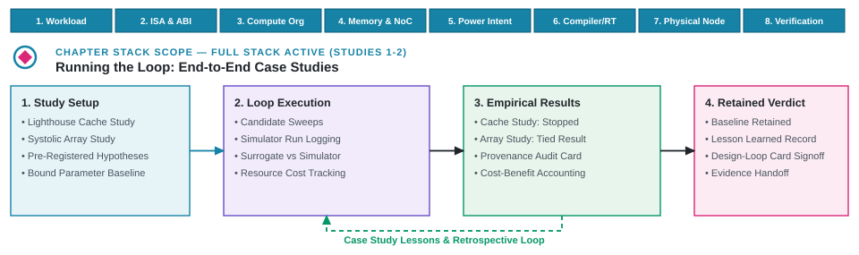

---
format:
  html:
    output-file: index.html
---

# Running the Loop {#sec-running-the-loop}

{fig-alt="The prospective cache record stops before dispatch; the separate retained array record reaches a limited technical stop; neither closes a design loop."}

::: {.epigraph}
> "Beware of bugs in the above code; I have only proved it correct, not tried it."
>
> — Donald E. Knuth, *Notes on the van Emde Boas Construction of Priority Deques* (1977) [@Knuth1977PriorityDeques]
:::

::: {.column-margin}
**Author's Note.** Donald E. Knuth, author of *The Art of Computer Programming*, famously separated abstract reasoning about algorithms from the empirical evidence of running them. In closed-loop design execution, prospective plans and reasoned fixtures do not become architectural evidence until tools actually run and retain artifacts. This chapter contrasts a prospective cache study with an executed array study to show that distinction in practice.
:::

Operationalizing machine-usable representations (@sec-data-representations-world-models), smallest sufficient methods (@sec-methods-generation-prediction-optimization), sandboxed execution harnesses (@sec-architecture-environments-tool-interfaces), and qualified verification feedback (@sec-feedback-verification-trust) transforms these four technical foundations into an active closed loop. Putting this loop into practice tests the exact boundary between prospective planning and empirical simulation: what conclusions can be drawn when an architecture study halts before dispatch, and what distinct insights can a fully executed simulator study firmly establish?

A design loop closes only when returned evidence mutates represented design state and triggers another authorized engineering action (@sec-design-loop-no-longer-scales). This chapter examines two contrasting studies that deliberately stop at different operational boundaries. The first record, the prospective Lighthouse cache study, distills a $3\ \text{W}$ system objective into a single pre-RTL decision on L2 capacity, where register-transfer level (RTL) netlists have not yet been synthesized. It formalizes candidate comparisons and prerequisites, but halts prior to tool dispatch because physical derivation rules and toolchain bindings remain incomplete.

The second record, in contrast, is a fully realized [retained systolic-array study](https://github.com/harvard-edge/arch2/tree/f5516e52e66243c2d753191e350a5cfac56c83af/labs/examples/ai_systolic_array_study) using SCALE-Sim [@RajEtAl2025ScaleSimV3]. Across twelve simulator evaluation events evaluating general matrix multiplication (GEMM) kernels, the study runs its preregistered budget to completion, encounters an exact ranking tie between candidate and baseline geometries, refutes the generative model's directional hypothesis, and executes a principled technical stop. Contrasting an unexecuted plan with an executed tool sweep demonstrates how to decouple architecture outcomes, AI contributions, physical mechanisms, and stopping rules without manufacturing artificial end-to-end claims.

::: {.callout-learning-objectives}
This chapter establishes the following learning objectives:

- **Navigate** an architectural research question from fixed state to a stopping decision across the three operational layers (point AI assistance, AI-driven subsystem optimization, and AI-native system design).
- **Distinguish** prospective experimental plans from executed empirical evidence.
- **Isolate** the architectural outcome, AI contribution, mechanism result, and actionable next steps.
- **Use** ties, failed causal explanations, and provenance gaps to scope follow-up studies and close multi-tool design loops.
:::

## Prospective Cache Design Study

Sizing an L2 cache for a mobile extended reality (XR) subsystem tempts immediate simulation sweeps. When an engineering team encounters memory stalls in high-level workloads, the instinctive reaction is to double the cache parameter in a configuration file and dispatch a batch of simulator jobs. However, dispatching simulation jobs without a declared baseline, fixed instruction set architecture (ISA) invariants, physical macro floorplanning rules, and pre-bound stopping criteria yields ambiguous data rather than actionable architectural decisions. To demonstrate the operational boundary where prospective planning halts before tool invocation, this first study formalizes the complete experimental intent for sizing an L2 cache under a strict $3\ \text{W}$ thermal envelope.

Formally declaring the design space, tool category bindings, and execution prerequisites up front separates prospective specification from executed empirical evidence. As audited below, this study remains entirely unexecuted, exposing the exact structural prerequisites (derivation rules, tool bindings, and cost accounting) that must be resolved before a multi-tool execution harness can legally dispatch.

### Architectural Decision

Expanding L2 cache capacity inside a strict $3\ \text{W}$ thermal design power (TDP) budget trades off off-chip memory latency against static leakage power and physical silicon area. In the Lighthouse mobile XR subsystem (@sec-moonshot), mapped to a TSMC N7 or $3\ \text{nm}$-class low-power process, this question determines whether a larger L2 cache should advance to RTL evaluation. Direct prospective comparison across the eight requirement domains (@sec-intent-vs-spec) holds the RV64GCV ISA contract, vector CPU and neural processing unit (NPU) compute topologies, XR workload snapshots, and runtime compiler passes fixed, isolating L2 capacity as the single swept variable: a 2\ MiB baseline against 3\ MiB and 4\ MiB candidates. These capacities define the distinct architectural objects within the prospective study, though they remain specification targets rather than generated RTL instances or measured artifacts in the repository.

Architects frequently treat cache capacity as an integer knob in a configuration file. In silicon, however, an extra megabyte is not free real estate; it is a physical array of millions of static random-access memory (SRAM) bitcells, wordline drivers, sense amplifiers, and multiplexers placed, routed, and powered within tight timing and area envelopes. A candidate capacity of 3\ MiB breaks the clean, power-of-two address decoding of a standard 2\ MiB or 4\ MiB design, forcing asymmetric three-bank macro compositions or non-uniform subarray aspect ratios that introduce routing congestion and parasitic $RC$ wire delays. Sizing an L2 cache in an advanced process cannot be dispatched as an ungrounded integer; an architectural derivation rule must compute banking topologies, subarray aspect ratios, tag and data bitcell floorplans, bit-sliced hash indexing functions (preventing bank hot-spotting under spatially correlated XR camera frames), port arbitration, miss status holding register (MSHR) depths, hit-latency allocations, and process, voltage, and temperature (PVT) corners.

Physical consequences compound under thermal and workload stress. In mobile XR devices, streaming high-frame-rate ($90\ \text{Hz}$ or $120\ \text{Hz}$) sensor video buffers and concurrent spatial tracking workloads continuously compete for cache lines. If the L2 cache is undersized, streaming frames evict active neural network weights and tracking state, triggering capacity misses that flood the MSHR queue and stall the memory bus, blowing past the strict $11.1\ \text{ms}$ frame deadline. Conversely, expanding the cache to 4\ MiB increases total bitcell count, causing static subthreshold leakage power to surge exponentially at elevated operating temperatures ($85^\circ\text{C}\text{--}105^\circ\text{C}$) and consuming hundreds of milliwatts of the tight $3\ \text{W}$ subsystem envelope before dynamic switching energy is accounted for.

Fixed architectural state extends beyond the cache itself, declaring network-on-chip (NoC) configurations, the 2\ GHz host RV64GCV vector CPU microarchitecture, the just-in-time (JIT) compiler and runtime environment, the RISC-V software image, and an XR workload snapshot with stable frame boundaries. Because the repository currently lacks both this structural derivation rule and bound values for controlled cache and PVT parameters, the comparison cannot yet execute.

The planned evaluation path spans eight functional tool categories (@sec-architecture-environments-tool-interfaces): full-system simulation in gem5 and Verilator, SRAM area modeling in CACTI, physical synthesis and timing in Yosys and OpenROAD, power-domain validation via Unified Power Format (IEEE 1801 UPF), formal verification via SystemVerilog Assertions (SVA) with bounded model checking (BMC), thermal signoff in Ansys RedHawk-SC, dynamic random-access memory (DRAM) timing in Ramulator, and coherent die interconnect modeling in Universal Chiplet Interconnect Express (UCIe) and Compute Express Link (CXL). None of these conceptual tool roles are yet bound to executable scripts in the repository.

The architecture claim asserts that a larger L2 cache reduces 99th-percentile frame times by eliminating capacity misses while satisfying power, area, access-time, and coherence constraints. Validating this claim requires matched frame observations showing that resolving capacity misses improves tail latency under fixed workload and software conditions. Because the legal space contains only the baseline and two discrete alternatives, the study relies on direct evaluation (@sec-methods-generation-prediction-optimization) rather than generative search. The SRAM model acts as a standard tool-path component rather than an AI module. Direct evaluation provides the most streamlined approach capable of answering the targeted architecture question once the tool path is operational, recommending at most one capacity for RTL evaluation without authorizing tapeout or binding commitments.

### Execution Prerequisites

Translating an abstract architectural proposal into a reproducible simulation job requires converting high-level capacity targets into concrete, hardware-derived configuration structures. Candidate capacities of 3\ MiB or 4\ MiB dictate physical SRAM set counts, bank topologies, array geometries, and hit-latency profiles that must obey invariant physical rules. Before dispatching any simulation jobs, the experimental framework must explicitly declare its candidate requests, cycle-level simulator requirements, dispatch conditions, required telemetry schemas, functional checks, call-count limits, and failure-handling procedures (@tbl-cache-run-declaration). Without these operational prerequisites locked in advance, execution cannot be reproduced, audited, or distinguished from ad hoc manual tuning.

| **Run parameter** | **Declared Lighthouse cache study work** |
| --- | --- |
| **Candidate requests** | Prepare one complete request to the SRAM model under declared PVT conditions for 2\ MiB baseline, 3\ MiB, and 4\ MiB candidates. Treat `l2.capacity` as sole swept parameter while strictly holding associativity, line size, indexing, replacement, MSHR count, ports, hit-latency allocation, and PVT fixed. A prospectively bound rule must derive set count, bank count, layout geometry, periphery, and SRAM macro composition directly from capacity. All controlled and derived values remain retained alongside SRAM-model and technology identities. |
| **Cycle-level requests** | Rerun 2\ MiB baseline alongside eligible candidates through cycle-level simulator, including cache and power models while holding declared XR workload snapshot, software image, and hardware/software identities strictly fixed. |
| **Dispatch condition** | No request is eligible until policy parameters and capacity-derived choices are bound. A cycle-level request becomes eligible for execution only when `(return_complete == true) && (schema_valid == true) && (area_mm2 <= 1.5) && (access_time_ns <= 2.5)`. This condition authorizes simulation dispatch without independently validating a measurement or rejecting a candidate. |
| **Required returns** | Retain SRAM area, access time, dynamic energy, leakage, matched frame records, frame-time inputs, and 99th-percentile frame time. Include cache miss classification, subsystem power, tool versions, model identities, translated inputs, warnings, failures, cryptographic hashes, data lineage, and precise accounting records covering wait times, run times, compute resource use, license checkout, storage, and human setup time. |
| **Checks** | Require identical ISA-visible outputs and standard functional regressions for every capacity. Demand zero coherence-invariant failures, subsystem power (dynamic plus leakage) capped at $3\ \text{W}$, total cache macro area $\le 1.5\ \text{mm}^2$, and modeled access time $\le 2.5\ \text{ns}$. Require uncertainty-qualified frame-time comparisons against rerun baseline. |
| **Failure handling** | Refuse invalid evaluation requests prior to simulation invocation. Distinguish timeouts, cancellations, infrastructure failures, state corruption, missing outputs, and parser errors. Retry attempts link to parent attempt, deduct from budget, and launch from a freshly generated clean state without altering candidate architecture. |
| **Budget** | Permit three SRAM model evaluations and restrict cycle-level executions to at most four, explicitly accounting for infrastructure reruns. Exclude RTL synthesis and physical signoff from exploratory budget. Define accounting for wait/run times, compute consumption, license constraints, tool utilization, storage costs, and human effort. |
| **Stopping** | Stop simulation attempts when queue-wait or run-time deadlines expire. Halt study upon resolving architectural decision, exhausting eligible capacities, consuming cycle-level budget, breaching project deadline, lacking required tools, or finding no alternative meeting SRAM physical limits. |
| **Decision** | Require uncertainty-qualified frame-time improvement strictly greater than zero. Prospectively define statistical estimator, confidence procedure, and practical performance margins prior to dispatch. Recommend at most one capacity for RTL evaluation if required checks pass cleanly and qualified comparison proves declared improvement. |
: **Run declarations expose evaluated parameters and experimental bounds.** The declaration identifies the intended requests, necessary returns, functional checks, call-count limits, and decision criteria, highlighting that cache-policy bindings, derived-structure rules, statistical procedures, cost accounting, numeric deadlines, and the executable measurement path remain unfinished. {#tbl-cache-run-declaration tbl-colwidths="[25,75]"}

While the declaration explicitly fixes the required improvement direction, it does not mandate the specific statistical procedure for judging it. To prevent retroactive statistical reinterpretation after observing returns, the experimental protocol must prospectively define the estimator, confidence procedure, and practical performance margins prior to simulation dispatch. Locking these analytical thresholds alongside the candidate parameters ensures that unexpected simulation noise or borderline speedups cannot be reframed post hoc into artificial architectural victories.

### Specification Audit

Auditing repository state separates prospective specifications and teaching fixtures from true execution traces (@tbl-cache-evidence-inventory). Prospective specifications declare what a study intends to compare, while teaching fixtures illustrate how measurement pipelines behave; neither provides empirical evidence of hardware performance. Independently replayable execution evidence requires retained invocations, serialized state, outputs, identities, and lineage sufficient for an external reviewer to reconstruct what ran. Retained artifacts divide into specification targets (controlled cache parameters and declared tool roles), author-constructed teaching fixtures (illustrative SRAM and simulator entries), and executed evidence packages. Retained specifications and teaching fixtures clarify methodology, but they cannot support a measured cache result.

| **Retained item** | **Evidence class** | **What it supports** | **What remains absent** |
| --- | --- | --- | --- |
| Lighthouse cache study, current design revision, controlled-state identities, and the three cache candidates | Specification identity | The cache question, comparator, intended controlled state, permitted capacity change, required measurements, call-count limits, stopping categories, and intended pre-RTL decision. | Bound policy parameters, capacity-derived cache structure, retained candidate artifacts, executable requests, runs, measurements, and a cache disposition. |
| Run declaration and its declared tool roles | Specification identity | The intended request translation, dispatch condition, return schema, failure handling, call-count limits, and tool responsibilities. | Numeric deadlines, a cost-accounting procedure, bound executables, wrapper and parser versions, exact inputs, host state, commands, logs, outputs, and realized cost. |
| Constructed SRAM and simulator entries plus a design-loop card that summarizes the proposed question, state, returns, checks, and decision | Author-constructed teaching fixture | Illustrative area, access-time, power, failure, return, and summary properties that a study record might retain. | Terminal and parser status, exact requests, raw artifacts, state identities, dispatch evidence, lineage, realized cost, and any measured cache result. |
| Retained cache execution package | Executed evidence | None. No such package is present. | Candidate artifacts, tool requests, raw outputs, parsed measurements, hashes, lineage, costs, qualified comparisons, and a decision record. |
: **Evidence inventories retain complete study specifications.** Similar-looking identifiers across chapters do not convert constructed specification entries into executed evidence. {#tbl-cache-evidence-inventory tbl-colwidths="[28,18,27,27]"}

These specification entries and teaching fixtures clarify design intent, declare tool obligations, and establish operational structure, yet they leave the physical feasibility, timing closure, and empirical performance of each capacity candidate entirely unmeasured. Without executed runs and retained output artifacts, the study remains a methodological blueprint rather than an empirical evaluation.

::: {.callout-design-principle title="Prospective intent versus executed evidence"}
**The principle:** Architectural intent requires absolute separation from executed proof. A prospective specification frames a search space and fixes what a study would compare; it establishes nothing about how a candidate behaves.

**The application:** Only an executed run returns evidence, and that evidence is bounded by what the executing tool actually models. Conflating an unexecuted plan with a modeled outcome, or a modeled outcome with a physical one, destroys empirical validity.
:::

### Analytical Judgments

Evaluating an unexecuted study requires decoupling its structural status from its technical conclusions across four distinct analytical criteria (@tbl-cache-judgments). The architecture outcome remains unresolved, the AI contribution and hardware mechanism remain untested, and the study halts because execution prerequisites are missing rather than because budget was exhausted or a candidate failed. Decoupling these four axes prevents misinterpreting an unexecuted tool path as a completed architectural evaluation, complementing the comprehensive evaluation map in @sec-evaluating-agentic-architect.

| **Judgment** | **Cache conclusion** | **Evidence boundary** |
| --- | --- | --- |
| **Architecture outcome** | Unresolved. No capacity advances, and none is rejected. | No retained cache candidate was executed, the baseline was not rerun, and no required comparison was qualified. |
| **AI contribution** | Not tested. | Direct evaluation with no added learned method was the declared approach. No AI-versus-conventional comparison exists. |
| **Mechanism** | Untested. | No retained miss classifications or matched frame observations test whether reduced capacity misses change 99th-percentile frame time. |
| **Stopping** | Stop before execution because the implementation, measurement, and dispatch prerequisites are unavailable. | The declared budget was not consumed. If the cache decision remains worth pursuing, a new run requires bound policy and derived cache choices, numeric deadlines, a cost-accounting procedure, candidate artifacts, tool bindings, request translation, and an executable measurement path. Deferral, cancellation, or reformulation remain legitimate. |
: **Cache decisions remain open across four distinct technical criteria.** Missing execution leaves the architecture outcome unresolved, the explicit no-added-method choice leaves any AI contribution untested, missing empirical observations leave the hardware mechanism untested, and absent execution prerequisites dictate the stopping point. {#tbl-cache-judgments tbl-colwidths="[20,38,42]"}

The stop belongs strictly before execution, leaving all three proposed cache capacities unauthorized for downstream RTL implementation. Because no cycle-level traces or physical synthesis runs took place, the repository preserves the integrity of its baseline without advancing unverified candidates or manufacturing unearned conclusions.

## Executed Systolic-Array Study {#sec-executed-scale-study}

Contrasting with the prospective cache study that halts prior to dispatch, the second record explores the opposite execution boundary: a study that completes its entire preregistered simulation budget but halts at a local tie without closing a multi-tool design loop. Where the cache study addressed memory-hierarchy capacity under system-level constraints, this executed systolic-array experiment focuses on compute-engine microarchitecture, exercising Layer 2 subsystem optimization (@fig-ch01-three-layers-ai-integration) within a dedicated neural processing unit (NPU) accelerator container.

Compute arrays are an intuitive and attractive target for architectural exploration. A systolic processing element (PE) grid represents a clean, spatial arithmetic pipeline with uniform clocking, regular register-to-register interconnects, and deterministic cycle behavior. It is deceptively straightforward to construct a cycle-level simulator or analytical spreadsheet that tracks multiply-accumulate (MAC) throughput under idealized assumptions. Hardware teams readily gravitate toward sweeping PE array aspect ratios on whiteboards, optimizing spatial compute density while remaining blind to the messy physical realities of DRAM bank conflicts, network-on-chip (NoC) serialization, SRAM buffer writeback contention, and thermal dissipation. But in physical silicon, an arithmetic array without matched memory bandwidth is merely an expensive heater. When a wide array is starved of activations or stalls on output writebacks, processing elements sit idle while consuming clock-tree power, and system-level performance collapses.

This study explores legal PE geometries in SCALE-Sim [@RajEtAl2025ScaleSimV3], demonstrating what empirical tool execution can and cannot establish. Operating within an isolated weight-stationary container, it explicitly excludes DRAM bank conflicts, memory bandwidth bottlenecks, compiler lowering passes, and full-subsystem thermal envelopes, exposing how local simulation metrics can mask system-level constraints.

### Freezing Candidates

Preregistering an architectural experiment locks the hypothesis, baseline configuration, and interpretation rules before simulation tools return a single performance cycle [@NosekEtAl2018Preregistration]. In the retained systolic-array package ([`arch2_scale_ai_study_v1`](https://github.com/harvard-edge/arch2/tree/f5516e52e66243c2d753191e350a5cfac56c83af/labs/examples/ai_systolic_array_study)), the study freezes legal processing-element geometries, evaluation metrics, simulation budgets, rejection checks, and decision margins prior to candidate selection.

The study evaluates systolic-array geometries across three synthetic general matrix multiplication (GEMM) layers with $(M, N, K)$ dimension tuples of $(128, 128, 256)$, $(64, 192, 128)$, and $(32, 128, 192)$, treating these layers as isolated matrix multiplications under a single, fixed workload and simulator configuration rather than complete traces drawn from an identified spatial-tracking pipeline. For this NPU accelerator evaluation, the package employs SCALE-Sim [@RajEtAl2025ScaleSimV3], modeling PE array mechanics, line buffers, and SRAM traffic under a weight-stationary dataflow. Setting `UseRamulatorTrace = False` excludes memory-channel contention, row-buffer hits, bank conflicts, and DRAM command timing from the retained runs. The execution setup systematically varies array height and width in SCALE-Sim 3.0.0, holding the architecture to a weight-stationary dataflow, a fixed 128\ KiB capacity for each of the three on-chip SRAMs, and configured interface bandwidth values of 64. The execution pipeline dispatches SCALE-Sim via Python wrapper scripts (`run_scalesim.py`), ingesting CSV workload files and outputting structured performance summaries alongside DRAM bandwidth trace logs (`BANDWIDTH_REPORT.csv`). These design choices derive directly from the package's [frozen preregistration](https://github.com/harvard-edge/arch2/blob/f5516e52e66243c2d753191e350a5cfac56c83af/labs/examples/ai_systolic_array_study/context/pre_registration.yaml) and retained per-run configurations.

Under the weight-stationary dataflow, weight tiles stay resident inside local PE registers while activation values stream horizontally through the array and partial sums accumulate vertically down the columns [@RajEtAl2025ScaleSimV3]. The retained study enforces a 1,024-processing-element hardware limit, a 90,000-cycle performance cutoff, and a mandatory 32 by 32 baseline. The protocol allocates exactly four simulator evaluation events per proposal arm alongside four shared mechanism-probe events, basing every architectural judgment on cycle counts rather than wall-clock time. A fixed heuristic serves as the budget-matched method comparator for the frozen study. Dividing execution latency by fractional layer utilization combines execution speed and hardware efficiency into a single, lower-is-better metric:

$$
S = \frac{\text{total cycles}}{\bar{U}_{\text{frac}}}
$$

where $\bar{U}_{\text{frac}} = \bar{U}_{\%} / 100 \in (0, 1]$ represents the arithmetic mean fractional layer utilization.

The evaluation runner computes this score directly from the retained SCALE-Sim simulation outputs. This score operates as a study-specific proxy; it is not a direct physical measurement, a classical area-delay product, or a universal accelerator metric. The runner calculates total cycles by summing the `Total Cycles` column, excluding the separate prefetch-inclusive column. To determine average layer utilization, the evaluation computes the arithmetic mean of the three per-layer SCALE-Sim `Overall Util %` values (rather than the `Compute Util %`), ensuring that each workload layer carries equal weight in the analysis. Consequently, the score does not explicitly penalize processing-element count, physical die area, or modeled memory traffic. Following the frozen decision rule, a lower score indicates a superior architecture, and a legal nonbaseline candidate clears the 1% support margin when $S_{\text{candidate}} \leq 0.99 \times S_{32\times32}$ (where exact equality at this threshold constitutes a passing result).

The test harness constructs both evaluation arms from the identical three-row CSV workload, tracking a layer name alongside the $M$, $N$, and $K$ dimensions for each dense GEMM. Systolic-array rows and columns are restricted to the set of 8, 16, 32, 64, and 128, with their product constrained not to exceed the 1,024 processing-element budget. After inserting the mandatory 32 by 32 baseline, the runner holds the workload, layout, SCALE-Sim configuration, dataflow, SRAM capacities, bandwidth parameters, performance deadlines, legality checks, and local score fixed for every candidate architecture. The generative model's role is constrained to be equally narrow: it is permitted to return three unique, legal nonbaseline shapes and a supporting mechanism hypothesis, while the harness forbids it from invoking SCALE-Sim, waiving hardware checks, formulating the final recommendation, or autonomously making the architecture decision. Conversely, the deterministic heuristic filters out the baseline and orders every legal systolic shape first by decreasing processing-element count, then by the absolute log2 distance between the candidate's columns-to-rows ratio and the aggregate workload $N$-to-$M$ ratio, and finally by increasing row and column counts. Programmatically selecting the first three shapes from this sorted order and inserting the baseline guarantees that each proposal arm receives exactly four simulator events.

### Execution Chronology

Even when an evaluation methodology is prospectively locked, real-world tool execution introduces interface errors, schema mismatches, and infrastructure retries that alter the chronological path to evidence. The retained execution history captures these operational realities, documenting an initial schema validation failure followed by a corrected model invocation, twelve successful simulator runs, and four independent analytical judgments (@fig-array-study-workflow). Incorporating explicit error-recovery loops within the workflow preserves prospective experimental integrity when interface failures occur.

![**Retained execution workflow and fourfold architectural interpretation.** The top execution sequence progresses from a frozen plan through schema validation, candidate selection, simulation execution in SCALE-Sim [@RajEtAl2025ScaleSimV3], and record interpretation, with a pre-inference schema repair loop. The interpreted record branches into four independent analytical judgments: architecture outcome (no nonbaseline shape clears margin), study-local AI contribution (no advantage over heuristic), mechanism status (directional reversal fails), and stopping point (technical stop retaining 32 by 32).](images/fig-array-study-workflow){#fig-array-study-workflow width="100%" fig-alt="An architecture workflow freezes a plan and validates a proposal schema before selecting candidates, checking legality, and executing simulator runs. A failed schema returns through repair and revalidation. One shared stem from the interpreted record then branches to four boxes for the architecture outcome, study-local AI contribution, mechanism status, and stopping judgment."}

The recorded chronological sequence captures each transition from preregistration freeze through schema rejection, repair, proposal generation, simulator execution, and technical handoff (@tbl-array-chronology). This timeline exposes both what the execution logs verify and what provenance data remains missing, including omitted random seeds, unrecorded currency costs, and absent repository commit hashes.

| **Recorded event** | **Action and return** | **Retained support and limit** |
| --- | --- | --- |
| **Freeze, 2026-07-14 18:19:48 UTC** | The preregistration records the workload, legal shapes, heuristic candidates, score, margin, budgets, rejection checks, mechanism contrast, and decision boundary. | An internal timestamp records this order. No external timestamp or commit binding independently proves precedence. |
| **Rejected schema request, 18:21:00 UTC** | The response-format service rejects the original JSON Schema before inference because two constant-string properties lack explicit types, producing no model output or usage. | Retains old and new schema hashes alongside a prose error description. Because the package does not retain the rejected schema body and service response, reviewers cannot independently check the semantic equivalence of the amendment. |
| **Schema amendment, 18:21:41 UTC** | The record successfully adds explicit types and marks the change as non-substantive. | The package records the amendment before inference, though it fails to retain both schema bodies. |
| **Proposal call, 18:21:51–18:22:24 UTC** | One valid call returns the 16 by 64, 8 by 128, and 32 by 16 dimensions alongside a directional mechanism prediction, with no subsequent repair calls. | Retains the full response, 32.90 seconds of wall time, and token usage. However, the provider revision, seed, temperature, top-p, host runtime, currency cost, and an exact matching prompt copy remain unavailable. |
| **Simulator window, 18:31:23–18:31:42 UTC** | The record contains eight proposal-arm evaluation events and four shared mechanism-probe events. All twelve carry `status: ok`; every recorded array shape satisfies the 1,024-processing-element legality limit, and every result remains comfortably below the 90,000-cycle cutoff. | The runner reports an aggregate window of 19.05 seconds. However, per-evaluation timestamps, commands, exit codes, logs, queue time, resource use, and human effort were not retained, and no invalid-candidate, rejection, timeout, retry, or simulator-recovery paths were exercised. |
| **Technical stop and handoff** | No evaluated nonbaseline shape clears the 1% margin. The proposal arms tie, and the predicted winner reversal fails. | The machine-readable recommendation retains the 32 by 32 baseline for the evaluated set and concludes the recorded search. Its accountable decision status rightfully remains `awaiting_author_confirmation`. |
: **Array chronologies record execution events and configuration changes.** The [preregistration](https://github.com/harvard-edge/arch2/blob/f5516e52e66243c2d753191e350a5cfac56c83af/labs/examples/ai_systolic_array_study/context/pre_registration.yaml), [model provenance](https://github.com/harvard-edge/arch2/blob/f5516e52e66243c2d753191e350a5cfac56c83af/labs/examples/ai_systolic_array_study/recorded/model/provenance.json), [execution provenance](https://github.com/harvard-edge/arch2/blob/f5516e52e66243c2d753191e350a5cfac56c83af/labs/examples/ai_systolic_array_study/recorded/reference/execution_provenance.json), and [study results](https://github.com/harvard-edge/arch2/blob/f5516e52e66243c2d753191e350a5cfac56c83af/labs/examples/ai_systolic_array_study/recorded/reference/study_results.json) collectively document one schema setup failure before a valid model call, twelve completed simulator events, and no authorized acceptance or rejection. {#tbl-array-chronology tbl-colwidths="[24,38,38]"}

Because the response-format service rejects the schema prior to model inference, the record treats this failure as a routine issue in request translation and interface validation. Throughout this process, the core architecture question, legal shape set, hardware score, and evaluation budget remain unchanged. The amendment therefore functions as a necessary request repair within the boundaries of the study. However, because the repository lacks the original schema body and the explicit service response, reviewers cannot confirm that the amendment preserved the request's intended architectural meaning.

The [model provenance](https://github.com/harvard-edge/arch2/blob/f5516e52e66243c2d753191e350a5cfac56c83af/labs/examples/ai_systolic_array_study/recorded/model/provenance.json) records invocation parameters and interface metadata, but omits the final serving state and sampling settings. In addition, a prompt hash mismatch between preregistration and surviving logs prevents cryptographic verification of the exact input context. Finally, the simulator provenance records the software stack but fails to bind the runner to a specific repository commit, container image, or dependency lock.[^fn-provenance-tracking-c08] Extensive full-system simulation studies emphasize that unrecorded configuration differences can alter hardware performance outcomes [@GutierrezEtAl2014SourcesOfError]. While this context does not diagnose an error in the run, it prevents confirmation of which missing identity might have altered the final execution result.

[^fn-provenance-tracking-c08]: **Provenance tracking details**: Invocations accessed OpenAI via Codex CLI 0.144.4 (alias `gpt-5.4`), consuming 13.2k input tokens and 1.4k output tokens without recorded seed or temperature. Preregistered prompt hash (`ec12df...`) differs from the surviving prompt file hash (`36e016...`). Simulator runs executed on macOS 26.4 (arm64) using Python 3.11.15 and SCALE-Sim 3.0.0.

Within the retained array directory, the package lacks an independently preserved validation receipt artifact. Without this verification, an external architectural reviewer cannot treat reference integrity, execution replay, or focused hardware tests as independently verified. Although retained files and current replay pathways remain inspectable, any subsequent replay inherits the same workload, simulation runner, scoring mechanism, and architectural assumptions of the originally recorded computation. The executed record also lacks study-local independent analytical models, RTL validation, or cross-simulator checks to anchor software modeling against cycle-exact field-programmable gate array (FPGA) RTL behavior using platforms such as FireSim [@KarandikarEtAl2018FireSim]. Furthermore, the study omitted a basic analytical fold-count verification check. While a newly frozen mechanism study could introduce that check as future work, the mapping discussion below serves as an expert interpretation of the tagged simulator implementation rather than executed evidence. These provenance gaps rule out claims of independent replay or strong causal attribution; the retained outputs can still support the narrower comparison actually computed under the recorded workload, simulator configuration, local score, and checks, provided the gaps are carried directly into that claim.

### Local Simulator Outputs

Evaluating candidate hardware shapes under equalized simulator-event budgets yields a budget-matched comparison between model-generated proposals and deterministic search heuristics. In the experiment, the model-driven arm and the fixed aspect-ratio heuristic arm each evaluate the 32 by 32 baseline alongside three candidate array geometries across the synthetic matrix multiplication workload.

The empirical simulator returns from the matched evaluation arms establish the comparison compactly (@tbl-array-results). Across eight total simulation runs evaluating five unique array geometries, the model-generated proposals match the deterministic aspect-ratio heuristic. The empirical returns confirm that the 32 by 32 baseline and the 16 by 64 candidate achieve identical execution latencies of 13,917 cycles and matching layer utilization of 41.196%, yielding an identical local score of 33,782.40. Both arms tie with this best-evaluated score, while extreme aspect ratios (such as 8 by 128 and 32 by 16) suffer performance penalties due to lower array utilization. Under equalized simulator-event budgets, generative proposals provide no local performance advantage over a simple analytical heuristic.

| **Arm** | **Shape and source** | **PE count (author-derived)** | **Cycles** | **Average layer utilization** | **Local score** | **Result within arm** |
| --- | --- | --- | ---: | ---: | ---: | --- |
| Model | 32 by 32 baseline | 1,024 | 13,917 | 41.196% | 33,782.40 | Tied best |
| Model | 16 by 64 proposal | 1,024 | 13,917 | 41.196% | 33,782.40 | Tied best |
| Model | 8 by 128 proposal | 1,024 | 19,405 | 29.704% | 65,327.45 | Ranked worse |
| Model | 32 by 16 proposal | 512 | 25,277 | 45.438% | 55,629.61 | Ranked worse |
| Heuristic | 32 by 32 baseline | 1,024 | 13,917 | 41.196% | 33,782.40 | Tied best |
| Heuristic | 16 by 64 proposal | 1,024 | 13,917 | 41.196% | 33,782.40 | Tied best |
| Heuristic | 8 by 128 proposal | 1,024 | 19,405 | 29.704% | 65,327.45 | Ranked worse |
| Heuristic | 64 by 16 proposal | 1,024 | 17,757 | 32.294% | 54,985.25 | Ranked worse |
: **The two proposal arms tie under equalized simulator-event budgets.** Neither evaluation branch discovers an evaluated nonbaseline shape that clears the recorded 1% performance margin over the default 32 by 32 array. Values derive directly from the [retained study results](https://github.com/harvard-edge/arch2/blob/f5516e52e66243c2d753191e350a5cfac56c83af/labs/examples/ai_systolic_array_study/recorded/reference/study_results.json) rather than post-fabrication silicon measurements. Processing-element counts are calculated by multiplying rows by columns. {#tbl-array-results tbl-colwidths="[10,18,14,12,16,14,16]"}

The 32 by 16 proposal deploys 512 processing elements, whereas the 32 by 32, 16 by 64, 8 by 128, and 64 by 16 configurations each deploy exactly 1,024. Consequently, array shape and overall processing-element count vary simultaneously during the 32 by 16 comparison. A hardware design with 512 processing elements naturally exhibits a different resource trade-off profile compared to standard shapes using 1,024 elements. However, because the study does not measure explicit area or energy consequences of this architectural discrepancy, the retained result remains a score-only local hardware outcome. The best evaluated nonbaseline configuration, the 16 by 64 array, exactly matches the 32 by 32 baseline in total execution cycles, average layer utilization, and final local score, failing to clear the predefined architectural change margin. In addition, the 8 by 128, 32 by 16, and 64 by 16 designs all rank worse under the frozen scoring metric, yielding a no-change outcome across five uniquely evaluated hardware shapes (though this result alone does not prove that the 32 by 32 layout is globally optimal among all legally permitted dimensions).

The study yields two separable empirical findings across candidate scoring and directional mechanism validation (@fig-ai-study-result). Candidate scoring evaluates whether model proposals outperform a fixed heuristic under equal simulator budgets (@fig-ai-study-result, Panel A), while the mechanism probe tests whether swapping matrix dimensions $M$ and $N$ reverses relative array performance (@fig-ai-study-result, Panel B). While the proposal ranking yields a functional tie, the targeted mechanism test fails its declared performance reversal. Because these two results investigate fundamentally different architectural questions, the tied evaluation score cannot serve as supporting evidence for the model's directional explanation. Ranking ties and mechanistic predictions address distinct architectural questions.

```{python}
#| label: fig-ai-study-result
#| fig-cap: |
#|   **Separating candidate scoring from directional mechanism validation.** Panel A (left) compares local architectural scores (thousands; lower is better) across model-proposed (M, blue) and fixed-heuristic (H, green) arms under equal four-event simulation budgets, where the 32 by 32 baseline and 16 by 64 shape tie at 33.8k. Panel B (right) tracks the mechanism probe, showing that the 16 by 64 array remains ahead of the 64 by 16 shape across both original and transposed ($M$ and $N$ swapped) workloads (23.5k vs 25.5k), directly refuting the predicted performance reversal. Values derive from retained SCALE-Sim simulator logs [@RajEtAl2025ScaleSimV3] rather than physical silicon measurements.
#| out-width: "100%"
#| fig-alt: "Two-panel study result. Panel A shows a horizontal bar chart of candidate scores with the 32 by 32 baseline and 16 by 64 tied at 33.8k in both model and heuristic arms. Panel B shows a paired-line plot of the mechanism probe with 16 by 64 outperforming 64 by 16 across original and transposed workloads, refuting the predicted reversal."

import json
from pathlib import Path

import matplotlib.pyplot as plt
import _python.plots as _ap
from _python.plots import COLORS, apply_style

apply_style()

_root = Path(_ap.__file__).resolve().parents[2]
result_path = _root / "labs/examples/ai_systolic_array_study/recorded/reference/study_results.json"
result = json.loads(result_path.read_text(encoding="utf-8"))

arm_runs = [r for r in result["evaluations"] if r["arm"] in {"model", "conventional"}]
probe_runs = [r for r in result["evaluations"] if r["arm"] == "mechanism_probe"]

shape_labels = {
    "model_baseline_32x32": "M  32×32 baseline",
    "ai_wide_16x64": "M  16×64",
    "ai_extreme_8x128": "M  8×128",
    "ai_compact_32x16": "M  32×16",
    "conventional_baseline_32x32": "H  32×32 baseline",
    "heuristic_16x64": "H  16×64",
    "heuristic_8x128": "H  8×128",
    "heuristic_64x16": "H  64×16",
}

fig, (ax1, ax2) = plt.subplots(1, 2, figsize=(5.6, 2.65), gridspec_kw={"width_ratios": [1.35, 1]})
fig.subplots_adjust(left=0.22, right=0.985, top=0.82, bottom=0.22, wspace=0.42)

labels = [shape_labels[r["candidate_id"]] for r in arm_runs]
scores = [r["decision_score"] / 1000 for r in arm_runs]
colors = [COLORS["blue"] if r["arm"] == "model" else COLORS["green"] for r in arm_runs]
y = list(range(len(arm_runs)))
ax1.barh(y, scores, color=colors, height=0.66)
ax1.set_yticks(y, labels)
ax1.invert_yaxis()
ax1.set_xlabel("local score (thousands; lower is better)\nM = model proposals; H = fixed heuristic", fontsize=6.5)
ax1.set_title("Equal simulator-event allocation", fontsize=7, pad=5)
for yi, score in zip(y, scores):
    ax1.text(score + 0.8, yi, f"{score:.1f}", va="center", fontsize=5.5, color=COLORS["ink"])
ax1.set_xlim(0, max(scores) * 1.18)

probe = {}
for run in probe_runs:
    workload = "transposed" if "transposed" in run["candidate_id"] else "original"
    shape = f'{run["array_rows"]}×{run["array_cols"]}'
    probe[(shape, workload)] = run["decision_score"] / 1000

x = [0, 1]
for shape, color, marker in [("16×64", COLORS["blue"], "o"), ("64×16", COLORS["orange"], "s")]:
    values = [probe[(shape, "original")], probe[(shape, "transposed")]]
    ax2.plot(x, values, marker=marker, markersize=4.2, linewidth=1.5, color=color, label=shape)
    for xi, value in zip(x, values):
        # Place 64x16 above marker, and 16x64 below marker at x=1 to avoid collision
        y_offset = 1.3 if (shape == "64×16" or xi == 0) else -2.2
        va_align = "bottom" if y_offset > 0 else "top"
        ax2.text(xi, value + y_offset, f"{value:.1f}", ha="center", va=va_align, fontsize=5.5, color=color)

ax2.set_xticks(x, ["original", "M/N swapped"])
ax2.get_xticklabels()[1].set_ha("right")
ax2.set_ylabel("local score (thousands)", fontsize=6.5)
ax2.set_title("Mechanism probe: no reversal", fontsize=7, pad=5)
ax2.set_ylim(18, 61)
ax2.legend(frameon=False, fontsize=6, loc="upper right")

for ax in (ax1, ax2):
    ax.tick_params(axis="both", labelsize=5.9, length=2.5, width=0.6, pad=2)
    ax.grid(axis="x" if ax is ax1 else "y", color=COLORS["grid"], linewidth=0.55, zorder=0)
    for spine in ["top", "right"]:
        ax.spines[spine].set_visible(False)
    ax.spines["left"].set_color(COLORS["ink"])
    ax.spines["bottom"].set_color(COLORS["ink"])

plt.show()
```

## Review and Decision Criteria

Evaluating an architectural candidate requires separating the proposal from its supporting rationale. A proposal may achieve high performance under specific benchmark conditions while its underlying explanation is invalid. Conversely, a flawed proposal may reflect a valid physical insight obscured by secondary tool artifacts. A proposal's pass or fail score and the validity of its physical mechanism are separate findings.

To support this distinction, reviewers examine four dimensions:

1. **Artifact completeness:** Whether every evaluated candidate is accompanied by synthesizable RTL, an explicit parameter mapping, and frozen tool configuration scripts.
2. **Provenance and replay:** Whether tool versions, environment hashes, and execution transcripts are sufficient to reproduce the published cycle counts and area numbers without variation.
3. **Budget parity:** Whether the comparison allocates equal simulation cycles, tuning steps, or human engineering effort to both the proposed design and baseline alternatives.
4. **Directional falsifiability:** Whether the study includes explicit sensitivity or perturbation probes to test whether claimed performance advantages stem from the stated microarchitectural mechanism.

### Statistical Dispersion and Seed Sensitivity

Candidate exploration introduces variance across random seeds, tool nondeterminism, and heuristic initializations. Evaluating an automated design system requires measuring this output distribution rather than reporting an isolated best-case candidate. In a study like the systolic-array record, repeated model samplings at a fixed nonzero temperature would return different candidate tuples; the retained record holds only one call and did not log its temperature. A single lucky proposal does not establish systematic design competence. Instead, the evaluation harness tracks proposal dispersion (the fraction of unique versus duplicated legal configurations across multiple runs) and incremental stability (whether minor prompt rewordings preserve candidate rankings), ensuring that reported advantages reflect reproducible search behavior rather than stochastic luck.

### Directional Mechanism Probe Analysis

Beyond measuring statistical dispersion across random initializations, architectural auditing must verify whether a proposal's stated microarchitectural rationale survives empirical testing (the fourth audit dimension of directional falsifiability). The generative model predicted that a wide 16 by 64 array would outperform a tall 64 by 16 layout on the baseline workload, hypothesizing that swapping matrix dimensions $M$ and $N$ would reverse their relative performance. However, retained simulator records contradict this mechanistic explanation. In the [retained study results](https://github.com/harvard-edge/arch2/blob/f5516e52e66243c2d753191e350a5cfac56c83af/labs/examples/ai_systolic_array_study/recorded/reference/study_results.json), the original local scores of 33,782.40 versus 54,985.25 compare against transposed scores of 23,530.65 versus 25,458.11; the predicted architectural reversal does not occur. Observing a narrower performance gap under transposition fails to validate the proposed physical mechanism.

The surviving prompt copy also omits the dataflow mapping semantics necessary to interpret this hardware contrast. While retained execution logs identify SCALE-Sim 3.0.0, they omit any dependency hash or source commit tracking. Consequently, the assumption of a $K$-height, $N$-width, and $M$-temporal mapping directly follows the publicly tagged v3.0.0 implementation [@ScaleSimProject2025V300Source].

The simulator's physical hardware mapping semantics determine what the array comparison actually varied (@fig-array-mapping). Weight-stationary GEMM maps the $K$ dimension to physical array height and the $N$ dimension to array width, while matrix dimension $M$ streams temporally through the processing elements. For the first GEMM layer, with dimensions $(M,N,K) = (128, 128, 256)$, the $16 \times 64$ array requires $\lceil 256/16 \rceil = 16$ vertical $K$-folds and $\lceil 128/64 \rceil = 2$ horizontal $N$-folds ($16 \times 2 = 32$ spatial passes). Conversely, the $64 \times 16$ array requires $\lceil 256/64 \rceil = 4$ vertical $K$-folds and $\lceil 128/16 \rceil = 8$ horizontal $N$-folds ($4 \times 8 = 32$ spatial passes). Evaluating mirrored array shapes alters multiple spatial tiling factors simultaneously rather than isolating a single physical dimension (@tbl-systolic-folding-breakdown). Aligning diagnostic probes with simulator dataflow semantics is essential to avoid confounding hardware parameters.

| **Array Shape ($H \times W$)** | **Height Mapping ($K=256$)** | **Width Mapping ($N=128$)** | **Spatial Passes ($K\text{-folds} \times N\text{-folds}$)** | **DRAM Word Writes** | **Compute Cycles** |
| :--- | :--- | :--- | :--- | ---: | ---: |
| **Wide Array ($16 \times 64$)** | $\lceil 256/16 \rceil = 16\text{ vertical folds}$ | $\lceil 128/64 \rceil = 2\text{ horizontal folds}$ | $16 \times 2 = \mathbf{32\text{ passes}}$ | 409,726 | 13,917 |
| **Balanced Baseline ($32 \times 32$)** | $\lceil 256/32 \rceil = 8\text{ vertical folds}$ | $\lceil 128/32 \rceil = 4\text{ horizontal folds}$ | $8 \times 4 = \mathbf{32\text{ passes}}$ | 204,863 | 13,917 |
| **Tall Array ($64 \times 16$)** | $\lceil 256/64 \rceil = 4\text{ vertical folds}$ | $\lceil 128/16 \rceil = 8\text{ horizontal folds}$ | $4 \times 8 = \mathbf{32\text{ passes}}$ | 204,863 | 13,917 |
: **Spatial tiling and fold factor decomposition across 1,024-PE systolic array geometries.** For a $(128, 128, 256)$ GEMM workload, all three geometries execute exactly 32 spatial passes yielding identical 13,917 compute cycles in idealized simulation, but the wide $16 \times 64$ geometry incurs $2\times$ higher DRAM write traffic due to frequent partial-sum eviction. {#tbl-systolic-folding-breakdown tbl-colwidths="[22,20,20,20,10,8]"}

![**Spatial GEMM array contrasts reveal trade-offs beyond isolated aspect-ratio changes.** Based on the tagged SCALE-Sim v3.0.0 implementation [@ScaleSimProject2025V300Source], weight-stationary GEMM maps the $K$ dimension to the physical array height and the $N$ dimension to the array width, while the $M$ dimension streams temporally through the processing elements. Because exchanging $M$ and $N$ leaves $K$ entirely unchanged, evaluating mirrored array shapes alters more than just one spatial fold count at a time.](images/fig-array-mapping){#fig-array-mapping fig-alt="A GEMM workload feeds a resident weight tile of K by N, which maps onto wide 16 by 64 and tall 64 by 16 arrays. K maps over array height and N over array width. A dashed transpose connector notes that K is unchanged, so the mirrored pair changes more than one fold count."}

While the model's directional prediction fails its declared test, this invalidated contrast does not establish a viable replacement mechanism. It does not prove that systolic array orientation is structurally irrelevant to overall performance. Launching a new mechanism study requires a specialized prompt with pinned mapping semantics alongside a contrast methodology that isolates and varies exactly one fold count at a time.

Beyond spatial tiling mathematics, evaluating accelerator performance requires auditing the memory-system assumptions embedded in the simulation tool. In the retained systolic-array record, the failure of the directional compute mechanism is compounded by a fundamental limitation in simulator memory semantics. Why do engineering teams so frequently overlook memory bottlenecks when optimizing compute arrays? Compute grids are synchronous, modular, and cleanly decoupled from system noise. Simulating PE utilization under idealized buffer assumptions provides an illusion of computational efficiency. In physical silicon, however, compute throughput is entirely captive to the memory subsystem.

Specifically, the transposed 16 by 64 input configuration declares an interface bandwidth constraint of `Bandwidth = 64,64,64`, yet the corresponding [retained bandwidth report](https://github.com/harvard-edge/arch2/blob/f5516e52e66243c2d753191e350a5cfac56c83af/labs/examples/ai_systolic_array_study/recorded/reference/runs/probe_transposed_16x64/scalesim-results/probe_transposed_16x64/BANDWIDTH_REPORT.csv) outputs an anomalous `Avg OFMAP DRAM BW` of 79.073 in one row. Because underlying bandwidth calculation semantics remain unresolved in the tool wrapper, this configured bandwidth value cannot serve as valid evidence of a demonstrated physical bottleneck. More critically, the retained execution set `UseRamulatorTrace = False`, bypassing cycle-accurate memory simulation entirely. Consequently, the reported word traffic reflects idealized buffer requests rather than contention-aware DRAM timing. Dedicated memory-system models such as Ramulator and Ramulator 2.0 [@KimEtAl2015Ramulator; @LuoEtAl2024Ramulator2], or a configured gem5 memory hierarchy, are required to represent channels, ranks, bank groups, row buffers, controller scheduling, and timing before attributing latency to bank conflicts or row-buffer locality. Evaluating access patterns in a cycle-accurate DRAM simulator reveals the severe latency penalty hidden by flat memory abstractions (@fig-dram-bank-conflict).

![**SCALE-Sim versus Ramulator DRAM bank conflict latency overhead across access strides.** The primary left axis compares memory read latency ($\text{ns}$ per $64\ \text{B}$ line read) between flat interface abstractions in SCALE-Sim (constant $100\ \text{ns}$) and cycle-accurate modeling in Ramulator across access strides 1 to 128 [@RajEtAl2025ScaleSimV3; @KimEtAl2015Ramulator; @LuoEtAl2024Ramulator2]. The secondary right axis shows the resulting latency overhead penalty (orange bars), which peaks at $+340\%$ overhead ($440\ \text{ns}$ vs $100\ \text{ns}$) at stride 16 due to systematic DRAM bank conflicts and row-buffer thrashing.](images/fig-dram-bank-conflict){#fig-dram-bank-conflict width="100%" fig-alt="Dual-axis plot comparing flat 100 ns latency in SCALE-Sim with cycle-accurate latency in Ramulator across access strides from 1 to 128 on the primary left axis, alongside an overhead percentage bar chart on the secondary right axis highlighting a 340% latency penalty at stride 16 due to DRAM bank conflicts."}

SCALE-Sim reports 409,726 DRAM-word writes for the 16 by 64 array compared to 204,863 for the 32 by 32 baseline. That modeled traffic difference flags a severe physical risk: when access strides collide with DRAM bank boundaries, unmodeled row-buffer conflicts compound into multi-hundred-nanosecond latency stalls (@fig-dram-bank-conflict). In modern LPDDR5 and DDR5 memory systems, memory is partitioned into 16 to 32 independent banks organized across 4 to 8 bank groups. Each individual DRAM storage cell is composed of a single access transistor and a microscopic storage capacitor ($1\text{T}-1\text{C}$). Accessing a cell is inherently destructive: asserting a wordline causes the tiny capacitor charge to share onto the high-capacitance bitline, creating a minute differential voltage ($\Delta V \approx 100\text{--}200\ \text{mV}$) that sense amplifiers must detect and amplify back to the full supply rail ($V_{\mathrm{DD}}$ or ground) to latch the row into the bank's active row buffer (typically 1\ KiB to 2\ KiB of sense amplifiers) and restore the cell's storage charge.

An access hitting an already open row buffer incurs only the base column-access strobe latency:

$$
t_{\mathrm{hit}} = t_{\mathrm{CAS}}
$$

where $t_{\mathrm{CAS}} \approx 14\text{--}18\ \text{ns}$ at typical operating frequencies, multiplexing the already-latched data onto the memory bus. However, when streaming matrix tile strides alias with bank-addressing bits (such as stride 16 in @fig-dram-bank-conflict), consecutive read requests collide on different rows within the same bank, triggering severe *row-buffer conflicts* (page thrashing). The memory controller cannot simply strobe a column; it must execute an analog three-phase physical command sequence:

1. **Row Precharge ($t_{\mathrm{RP}}$):** Disconnect the open row, restore and equalize the active bitlines to the mid-rail reference voltage $V_{\mathrm{DD}}/2$, and close the conflicting page ($14\text{--}18\ \text{ns}$).
2. **Row Activate ($t_{\mathrm{RCD}}$):** Assert the requested wordline, allowing destructive cell charge sharing onto the bitlines and driving sense amplifiers to amplify and latch the new target row ($14\text{--}18\ \text{ns}$).
3. **Column Strobe ($t_{\mathrm{CAS}}$):** Issue the column read command to multiplex the requested $64\ \text{B}$ data burst from the sense amplifiers onto the DQ data bus ($14\text{--}18\ \text{ns}$).

The closed-page conflict access latency expands to:

$$
t_{\mathrm{conflict}} = t_{\mathrm{RP}} + t_{\mathrm{RCD}} + t_{\mathrm{CAS}}
$$

Compounding with bank-group cycle restrictions ($t_{\mathrm{CCD\_L}}$), four-activate window ($t_{\mathrm{FAW}}$) power constraints, and write-to-read turnaround bubbles, effective read latency surges from an idealized flat $100\ \text{ns}$ abstraction to $440\ \text{ns}$ per $64\ \text{B}$ line read ($+340\%$ latency overhead). The memory controller's command queue fills up, backpressuring the crossbar, starving the accelerator's input line buffers, and causing processing elements to stall in idle bubbles. The compute engine is paralyzed not by a lack of arithmetic units, but by memory bus command stalls.

Executing cycle-accurate SCALE-Sim v3.0 simulations paired with a JEDEC DDR4-3200 memory engine across eight representative neural network layers demonstrates the severe distortion introduced by open-loop evaluation (@fig-closed-loop-dram-money-plot). Open-loop compute proxies hide the DRAM command timing wall ($t_{\mathrm{RP}} + t_{\mathrm{RCD}} + t_{\mathrm{CAS}}$). While the wide $16\times64$ candidate and balanced $32\times32$ baseline tie at 3,366 compute cycles under flat memory abstractions, cycle-accurate DRAM simulation exposes severe memory stalls ($+581\%\text{--}+2{,}261\%$) that expand execution latency to 47.0k–166.9k cycles. More critically, closed-loop memory timing inverts microarchitectural candidate rankings, proving that balanced geometries minimize page conflicts and dominate under real memory coupling. Without closed-loop memory modeling, automated optimizers systematically promote memory-choked geometries that fail physical deployment.

![**Closed-loop cycle-accurate DRAM simulation exposes the memory stall wall and inverts systolic array geometry rankings.** Panel (a) compares active compute cycles (SCALE-Sim, blue) against DRAM timing stalls ($t_{\mathrm{RP}} + t_{\mathrm{RCD}} + t_{\mathrm{CAS}}$, red) across five 1,024-PE array geometries on eight neural network workloads, showing how unmodeled memory latency inflates execution time by up to $+2{,}261\%$ [@ScaleSimProject2025V300Source; @KimEtAl2015Ramulator]. Panel (b) details the physical DRAM access distribution across row-buffer hits ($t_{\mathrm{CAS}}$, green), empty bank activates ($t_{\mathrm{RCD}}+t_{\mathrm{CAS}}$, amber), and page conflicts ($t_{\mathrm{RP}}+t_{\mathrm{RCD}}+t_{\mathrm{CAS}}$, red), where asymmetric tiling drives up to $22.7\%$ page thrashing. Panel (c) reveals the resulting *closed-loop Pareto inversion*: while the wide $16\times64$ array ties the $32\times32$ baseline at 3,366 cycles in open-loop compute proxies, closed-loop memory contention and partial-sum traffic resolve the tie, making the balanced $32\times32$ geometry the true physical winner.](images/fig-closed-loop-dram-money-plot){#fig-closed-loop-dram-money-plot width="100%" fig-alt="Three-panel visualization of closed-loop DRAM simulation. Panel A shows a stacked bar chart comparing compute cycles and DRAM timing stalls across five array geometries, showing up to a 2261% memory stall inflation. Panel B shows a 100% stacked bar chart of DRAM row buffer hits, misses, and page conflicts. Panel C shows a scatter plot illustrating how closed-loop memory timing resolves open-loop ties and inverts candidate rankings."}

### Prospective Formulation for a Second Iteration

When Iteration 1 halts after observing that Candidate 1 (16 by 64 array) doubles DRAM word traffic without improving cycle time over the 32 by 32 baseline, an ad hoc workflow might blindly retry random array dimensions. In contrast, an AI-native design system prospectively formulates this diagnostic feedback directly into a revised scoped contract for a second iteration. Rather than treating a tied ranking as an impasse, the system extracts the physical bottleneck, amends the search space, and escalates tool fidelity to discriminate among surviving candidates:

1. **Diagnostic extraction:** The evaluator flags a *traffic inflation defect*, in which the weight-stationary mapping on asymmetric $K \times N$ tiles causes frequent SRAM evictions and redundant DRAM writebacks.
2. **Contract mutation:** Stage 1 (Formulate) prospectively mutates the scoped study plan by adding an explicit memory-traffic constraint ($\text{DRAM word writes} \le 250{,}000$) and expanding the permitted exploration space to include alternative dataflow mappings (such as output-stationary or row-stationary).
3. **Targeted tool escalation:** Stage 3 (Implement) binds Ramulator 2.0 to the execution pipeline, enabling cycle-accurate DRAM bank conflict checking for all surviving Iteration 2 proposals.

This structured prospective synthesis demonstrates how an AI-native loop operates across iterations: negative results from Iteration 1 directly shape the hypothesis, constraints, and tool fidelity of Iteration 2 without polluting baseline audit records.

The retained SCALE-Sim configuration and outputs evaluate only the isolated array geometry, leaving the remaining requirement domains of the prospective study unexercised. Synthetic GEMM matrices bypass compiler lowering to vector pipelines, contention-aware shared DRAM simulation, gate-level timing closure, thermal dissipation, power-domain isolation, formal property verification, and chiplet interconnects. Although the broader SCALE-Sim v3 framework supports detailed memory and energy integration [@RajEtAl2025ScaleSimV3], the retained run deliberately restricted execution to standalone PE array traffic. Consequently, this synthetic GEMM workload and localized array result cannot resolve the system-level cache sizing decision for XRBench [@KwonEtAl2023XRBench], SPEC CPU [@SPEC2017CPU], or MLPerf [@ReddiEtAl2020MLPerfInference], satisfy the $3\ \text{W}$ TDP thermal envelope, or close out the Lighthouse accelerator design.

## Metric Mismatches and Proxy Discrepancies

The prospective formulation of a second iteration illustrates how an AI-native design system structures diagnostic feedback. However, before an engineering team authorizes compute budgets for subsequent iterations, it must conduct a forensic post-mortem on why Iteration 1 failed to find a superior design. The traffic inflation defect diagnosed in the array study exposes a deeper structural vulnerability in automated exploration loops: collapsing multidimensional hardware trade-offs into a single scalar proxy score.

The local array scoring metric ($S = \text{total cycles} / \bar{U}_{\text{frac}}$) tracked only execution latency and processing-element utilization, omitting modeled DRAM memory traffic from the optimization objective entirely. Furthermore, the search policy navigated only a small fraction of the legal architecture space. Evaluating the fifteen legal processing-element geometries against the four-event simulation budget reveals the strict coverage boundaries of the proposal arms (@tbl-array-shape-coverage). Across both arms, the runs evaluated only five unique shapes (8 by 128, 16 by 64, 32 by 16, 32 by 32, and 64 by 16), leaving ten legal geometries unexecuted. Repeating candidate evaluations across proposal arms consumes simulation events without expanding architectural coverage.

| **Status** | **Exact legal shapes** | **Count** |
| --- | --- | ---: |
| Evaluated as unique original-workload geometries | 8 by 128; 16 by 64; 32 by 16; 32 by 32; 64 by 16 | 5 |
| Not executed | 8 by 8; 8 by 16; 8 by 32; 8 by 64; 16 by 8; 16 by 16; 16 by 32; 32 by 8; 64 by 8; 128 by 8 | 10 |
: **Five evaluated geometries do not close the fifteen-shape architectural space.** While repeated arm events preserve frozen budgets, they contribute no new geometrical insights. Consequently, no retained SCALE-Sim results exist for the ten remaining legal shapes. {#tbl-array-shape-coverage tbl-colwidths="[28,60,12]"}

A comprehensive full-space reference through exhaustive enumeration under a fixed workload and simulator configuration requires budgeting for greater simulation cost. Without exhaustive enumeration in the current study, performance outcomes cannot be inferred for the ten unexecuted shapes, and the record cannot claim that the model tied or outperformed the complete design space. The frozen score also omits a reported performance axis that influences system-level decisions: while the 16 by 64 shape ties baseline performance at 13,917 cycles and 41.196% average layer utilization, retained study results show 409,726 modeled DRAM writes for 16 by 64 compared to 204,863 for the 32 by 32 baseline (whereas 64 by 16 reports 102,400 modeled writes and fewer total accesses than the baseline, despite requiring more cycles to execute).

Incomplete proxy metrics create significant blind spots in automated evaluation, as demonstrated when contrasting execution latency against off-chip data movement (@fig-proxy-mismatch). Single-dimensional proxy scores mask secondary bottlenecks, demanding multi-metric evaluation to capture complete hardware behavior. However, this post-run observation cannot retroactively alter the frozen score, nor does it establish physical memory energy consumption.

```{python}
#| label: fig-proxy-mismatch
#| fig-cap: |
#|   **Modeled memory traffic exposes Pareto dominance masked by scalar proxy scores.** Evaluating candidate systolic array geometries across SCALE-Sim total cycles (horizontal axis, lower is better) and modeled DRAM-word writes (vertical axis, lower is better) reveals that while the 32 by 32 baseline and shared 16 by 64 candidate tie at 13,917 cycles, the 16 by 64 shape incurs twice the DRAM write traffic (409,726 vs 204,863 writes). The 32 by 32 baseline strictly Pareto-dominates the 16 by 64 candidate across the combined space. Data derive from retained SCALE-Sim 3.0.0 simulation outputs [@RajEtAl2025ScaleSimV3]; this post-run observation does not alter the frozen study outcome or measure physical memory energy.
#| out-width: "100%"
#| fig-alt: "Scatter plot of evaluated systolic array shapes across total cycles on the x-axis and modeled DRAM-word writes on the y-axis, showing the 32 by 32 baseline Pareto-dominating the 16 by 64 candidate by matching its 13,917 cycles while generating half the DRAM writes."

import json
from pathlib import Path
import matplotlib.pyplot as plt
import _python.plots as _ap
from _python.plots import COLORS, apply_style

apply_style()

_root = Path(_ap.__file__).resolve().parents[2]
result_path = _root / "labs/examples/ai_systolic_array_study/recorded/reference/study_results.json"
result = json.loads(result_path.read_text(encoding="utf-8"))
arm_runs = [r for r in result["evaluations"] if r["arm"] in {"model", "conventional"}]

fig, ax = plt.subplots(figsize=(5.6, 3.5))
fig.subplots_adjust(left=0.18, right=0.95, top=0.95, bottom=0.15)

ax.set_xlabel("SCALE-Sim total cycles (lower is better)", fontsize=6.5)
ax.set_ylabel("Modeled DRAM-word writes (lower is better)", fontsize=6.5)

seen = set()
for r in arm_runs:
    key = (r["workload_id"], r["array_rows"], r["array_cols"])
    if key in seen:
        continue
    seen.add(key)

    cid = r["candidate_id"]
    cycles = r["metrics"]["total_cycles"]
    dram_writes = r["metrics"]["dram_writes"]
    label = cid.replace("model_baseline_", "").replace("ai_wide_", "").replace("ai_extreme_", "").replace("ai_compact_", "").replace("conventional_baseline_", "").replace("heuristic_", "")

    if "32x32" in label:
        ax.plot(cycles, dram_writes, marker="o", markersize=5, color=COLORS["blue"])
        ax.text(cycles + 300, dram_writes - 12000, f"Baseline {label}", color=COLORS["ink"], fontsize=5.5, ha="left", va="top")
    elif "16x64" in label:
        ax.plot(cycles, dram_writes, marker="X", markersize=5, color=COLORS["red"])
        ax.text(cycles + 300, dram_writes + 15000, f"Shared candidate\n{label}", color=COLORS["ink"], fontsize=5.5, ha="left", va="bottom")
    else:
        ax.plot(cycles, dram_writes, marker="s", markersize=4, color=COLORS["orange"], alpha=0.6)
        ax.text(cycles + 300, dram_writes, label, color=COLORS["ink"], fontsize=5, ha="left", va="center", alpha=0.7)

baseline_cycles = next(
    r["metrics"]["total_cycles"]
    for r in arm_runs
    if r["workload_id"] == "original"
    and r["array_rows"] == 32
    and r["array_cols"] == 32
)
ax.axvline(x=baseline_cycles, color=COLORS["grid"], linestyle="--", linewidth=0.8, zorder=0)

ax.tick_params(axis="both", labelsize=5.9, length=2.5, width=0.6, pad=2)
ax.grid(True, color=COLORS["grid"], linewidth=0.55, zorder=0)
for spine in ["top", "right"]:
    ax.spines[spine].set_visible(False)
ax.spines["left"].set_color(COLORS["ink"])
ax.spines["bottom"].set_color(COLORS["ink"])

plt.show()
```

If an engineering team launches a new enumeration study, decision quantities must be frozen before execution begins. At that point, the study could retain the original local score for strict comparability, introduce a separately justified memory-aware metric, or replace the scoring function entirely. However, none of these future choices can rescore the currently retained and executed study. The unresolved memory axis illustrates why neither exhaustive architectural coverage nor the current local ranking alone provides enough evidence to establish energy consumption, power draw, or overall Lighthouse suitability. The tied ranking, the failure of the directional explanation, and the omission of modeled memory traffic from the frozen score mandate a shift in how subsequent studies are structured.

## Technical Boundaries of Architectural Loop Execution

Comparing the unexecuted L2 cache plan with the executed systolic-array experiment exposes the distinct technical boundaries governing architectural evaluation loops. Every study reaches a stopping point determined by tool availability, artifact retention, and validation checks. Disentangling these stopping boundaries keeps prospective specifications, executed simulator evidence, and physical silicon evidence from collapsing into a single claim.

Evaluating the Lighthouse cache path alongside the separate executed array study reveals distinct technical stopping points and architectural next steps:

- **Tie:** Returned scores demonstrate no advantage for model-guided proposals over the fixed heuristic under equal simulator-event budgets, retaining 32 by 32 for the evaluated set. Broader selection claims require a separately budgeted full-space reference.
- **Failed mechanism:** Transposition results squarely reject the predicted performance reversal without offering a replacement mechanism; isolating the true hardware behavior requires a newly frozen study with pinned mapping semantics.
- **Omitted metric:** Modeled DRAM traffic counts expose an essential quantity absent from the frozen score. This post-run observation cannot alter the frozen outcome, but mandates a memory-aware decision metric in subsequent studies.
- **Provenance gap:** Omitted prompt identities and simulator commit hashes rule out independent replay and causal attribution, bounding claims strictly to the recorded configuration.
- **Pending authority:** The machine-readable technical recommendation retains 32 by 32 for the evaluated set, concluding technical search while leaving accountable commitment to human authority.

Contrasting the prospective cache path with the executed systolic-array study illustrates how different evaluation loops reach distinct technical stopping boundaries (@tbl-lighthouse-return). The cache path halts before execution with an unresolved outcome and untested mechanisms. In contrast, the array study completes twelve simulator evaluations across five unique geometries to reach a tied ranking, a rejected directional mechanism, and a technical stop that retains the 32 by 32 baseline.

| **Record** | **Architecture outcome** | **AI contribution** | **Mechanism** | **Stopping and action** |
| :--- | :--- | :--- | :--- | :--- |
| Lighthouse cache path | Unresolved. | Not tested. | Untested. | Stop before execution. |
| Separate executed array study | No nonbaseline design clears local margin. | No advantage under equal event budgets. | Reversal prediction fails; no replacement. | Retains 32 by 32 for evaluated set. |
: **The two records stop at fundamentally different technical boundaries.** The Lighthouse cache path never reaches execution, while the separate retained array study executes only a narrow simulator comparison with no recorded authorization for acceptance or rejection. Because these are not cohesive stages of a single end-to-end Lighthouse run, neither result can finalize the other. {#tbl-lighthouse-return tbl-colwidths="[18,21,20,21,20]"}

The tie, failed mechanism, omitted metric, and provenance gap all point toward necessary follow-up studies. None of these ran as part of the retained execution, and each requires its own separately frozen comparison. A new study cannot simply append steps to an existing record without declaring a fresh baseline, frozen budgets, and explicit decision criteria.

Both records leave core system-level questions open. Neither trace identifies an XR workload, validates tail deadlines under deployed conditions, or exercises the compiler, runtime, host vector cores, shared memory path, sensors, or display engine. Physical design checks across timing closure, design rule checking (DRC), power delivery network integrity, $3\ \text{W}$ subsystem power budgets, and thermal signoff remain unexecuted. Naming a check in an architectural plan is never a substitute for running it.

::: {.callout-design-principle title="Claim only what the checked record supports"}
**The principle:** An architecture evaluation loop must bound its claims strictly to what its executed, checked tool records demonstrate.

**The application:** Unexecuted plans do not provide measured results. Partial simulation logs and budget-limited ties can support only the local claims their retained checks establish; they do not substitute for physical or silicon evidence.
:::

## Common Pitfalls

Executing complete architectural search loops exposes subtle methodological failures regarding evidence status rather than raw tooling mechanics. In each failure mode below, an engineering team allows an unexecuted plan, a simulation tie, or an unverified mechanism to enter the project record as something stronger than what actually ran:

- **Recording a plan as a result:** Trial specifications, generator prompts, and configuration scripts enter the record where execution results belong. Elaborate plans and candidate configurations establish setup intent. A candidate remains unmeasured until the relevant tools execute and retain checked outputs; simulator, formal, physical-design, and silicon results then support different classes of claim.

- **Violating prospective binding rules through retrospective tuning:** Evaluation parameters, simulation seeds, workload trace windows, or tool constraints get adjusted after interim scores arrive. Prospective binding rules require locking experimental parameters prior to execution. Modifying evaluation conditions mid-loop to favor specific candidates introduces outcome bias and destroys the comparative integrity of a baseline study.[^fn-fda-preregistration-c08]

[^fn-fda-preregistration-c08]: **Clinical trial preregistration parallel**: Clinical-trial registration records a protocol and its primary and secondary outcome variables before a trial begins, a practice that prevents outcome switching after results are seen [@NosekEtAl2018Preregistration]. In computer architecture, locking trace windows, workload seeds, and electronic design automation (EDA) synthesis constraints prior to execution plays an identical role, preserving baseline comparative integrity.

- **Blurring array versus cache study boundaries in subsystem loops:** An isolated spatial GEMM array study evaluates local PE utilization in SCALE-Sim, and it is an instance of Layer 2 subsystem optimization within a pre-bounded accelerator container. Architects cannot conflate its execution boundaries with full subsystem platform requirements (such as the prospective $3\ \text{W}$ L2 cache study under its declared XR workload snapshot). Claiming subsystem power signoff or memory-wall closure from narrow accelerator loop iterations ignores system interconnect contention, host-side synchronization, and cache-hierarchy latency bottlenecks.

- **Misinterpreting a local tie as architectural equivalence:** Equal scores establish no qualifying difference among the evaluated candidates under the frozen workload, configuration, metric, and checks. They do not establish physical parity, an optimal design, insufficient compute, or what unexecuted candidates would have done.

- **Coupling microarchitectural mechanisms with unverified system outcomes:** Evaluators must avoid attributing a candidate's high-level score improvement to a hypothesized microarchitectural mechanism without executing isolating diagnostic checks. Candidate hardware often outperforms a baseline due to secondary effects such as altered compiler code alignment or cache-line prefetching shifts. Decoupling the true cause from the aggregate score protects architectural conclusions.

## Open Questions

Executing a design loop end-to-end exposes foundational questions that no single stage raises in isolation, particularly around mechanistic hypothesis testing, search budget allocation, and compositional uncertainty across decoupled subsystem loops. These unresolved questions define five open challenges in closed-loop architecture exploration:

- **How do you keep an architectural loop from exploring designs that can never be routed?** High-level architectural search spaces readily explore irregular aspect ratios, non-power-of-two banking, or asymmetric systolic geometries that look optimal in cycle-accurate simulation. When advanced to physical design, unmodeled multiplexing delays and routing congestion cause catastrophic timing failures after days of exploration have been spent. Whether constructive layout derivation rules can prune unroutable aspect ratios and wire pitches before simulation, or exploration loops must incur the latency of physical layout feedback to discover physical boundaries, defines an open trade-off between proxy speed and physical fidelity.

- **How should an autonomous loop divide its compute between searching for winners and verifying why they won?** Fixed simulation budgets force an explicit trade-off between evaluating more candidate configurations and running diagnostic hypothesis tests. Sweeping parameters wide yields scalar performance rankings that frequently mask simulator loopholes or compiler artifacts. Whether dynamic exploration policies can interleave diagnostic probes during search to reject ungrounded winners early, or mechanistic validation must remain a mandatory standalone phase before accepting any candidate, defines the compute allocation dilemma.

- **How do you prove a hardware candidate won on microarchitecture rather than compiler luck?** In specialized accelerators, a candidate configuration often outperforms a baseline on total cycle count. The measured gain frequently stems not from superior spatial hardware organization, but because tensor dimensions happened to align favorably with fixed compiler loop-tiling or unrolling heuristics. Whether automated sensitivity probes can isolate spatial hardware contributions from compiler scheduling artifacts systematically, or hardware exploration loops must co-optimize compiler tiling schedules for every candidate to ensure fair comparisons, remains an unaddressed evaluation bottleneck.

- **How much error accumulates when you stitch together decoupled subsystem loops?** Full-chip exploration decouples compute array optimization from memory hierarchy and interconnect studies to keep exploration tractable. Isolated loop returns ignore dynamic network-on-chip contention, bank conflicts, and variable memory-latency tails that compound when blocks are integrated. Whether analytical composition bounds can bound cross-loop uncertainty soundly, or decoupled subsystem optimizations inevitably produce suboptimal system-on-chip architectures that require full-system co-simulation, marks the limit of modular loop execution.

- **When does stopping a tied study produce more insight than breaking the tie?** Design loops enforce declared stopping conditions when candidate variations land within the statistical decision margin of the baseline. Spending additional simulation cycles to resolve a fractional percentage difference often overfits to simulator timing quirks rather than exposing real physical trade-offs. Whether declared ties should be accepted as proof of microarchitectural equivalence that justifies selecting the simpler implementation, or loops must automatically escalate to higher-fidelity physical models to force a decisive ranking, defines an open methodological choice.

## Summary

Synthesizing findings across both prospective plans and executed simulator traces reveals a foundational principle of architectural evaluation: an architectural claim can reach only as far as its retained evidence and qualified checks. This chapter brings the architecture evaluation cycle together through two records that deliberately do not compose, demonstrating that prospective plans, executed tool runs, qualified feedback, and stopping rules remain distinct obligations. Prospective parameter binding records the intended baseline, trace windows, and interpretation rules before execution, making later changes fully auditable and eliminating the opportunity for undisclosed retrospective tuning.

The technical boundary of loop execution is the checked record itself. Prospective specifications do not substitute for measured results, while a budget-limited simulator tie remains a local result rather than evidence of physical hardware parity. Reading either record means holding four answers apart. The architecture outcome, the contribution of any added method, the status of the proposed mechanism, and the action the record now permits are separate findings, and the two records answer them differently. The array study returns no candidate that clears the local margin across its five evaluated shapes, a rejected directional explanation, and a technical stop that retains 32 by 32. The cache path returns an unresolved outcome, an untested method, and an untested mechanism.

Each unresolved return also scopes its own follow-up. A tie under equal simulator-event budgets calls for a separately frozen full-space reference. A failed directional explanation calls for a new study built on pinned mapping semantics. A provenance gap calls for a run that captures the prompt, the tool revisions, and the complete outputs. None of those studies ran here, and no rescoring of the retained record substitutes for them. Four core principles govern this phase of a design study:

::: {.callout-takeaways}
- **Claims bounded by evidence class:** Prospective specifications, executed simulator records, physical-design results, and silicon measurements support different claims and must remain distinguishable.
- **Prospective parameter binding:** Design parameters, workload trace windows, evaluation seeds, and interpretation rules must be recorded before execution so that later changes are visible and baseline comparisons remain interpretable.
- **Declared budgets and stopping rules:** Finite simulation and synthesis budgets, together with explicit stopping rules, must be declared before execution begins, halting a study once a decision margin is resolved, a budget is exhausted, or a prerequisite fails.
- **Enforcing array versus cache study boundaries:** Maintain strict evidence boundaries between isolated accelerator module studies (such as the SCALE-Sim GEMM array study) and full-subsystem platform evaluations (such as $3\ \text{W}$ L2 cache TDP signoff), refusing to conflate local PE utilization ties with system-level closure.
:::

Carrying forward these operational boundaries, the next chapter (@sec-loop-patterns-across-stack) examines which parts of an executed array study and its retained record can be safely transferred across distinct hardware contexts. Establishing formal requalification contracts, LogCA offload bounds, and cross-stack lowering pipelines reveals how learned architectural patterns generalize across technology generations without compromising empirical rigor.
