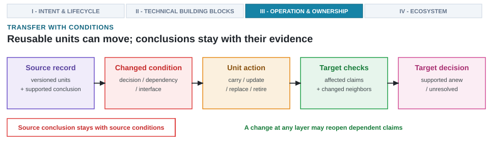

---
format:
  html:
    output-file: index.html
---

# Pattern Transferability and Generalization {#sec-loop-patterns-across-stack}

{fig-alt="A source record meets a changed condition, after which units are carried, updated, replaced, or retired and target claims are checked anew."}

::: {.epigraph}
> *"There is no single development, in either technology or in management technique, that by itself promises even one order-of-magnitude improvement in productivity, in reliability, in simplicity."*
>
> — Fred Brooks, *No Silver Bullet* (1987) [@Brooks1986NoSilverBullet]
:::

::: {.column-margin}
**Author's Note.** Fred Brooks, who led IBM's System/360 design and authored *The Mythical Man-Month*, warned against expecting any single technique to eliminate the essential complexity of engineering. When porting architectural patterns across domains, the underlying study structure may transfer, but the empirical evidence remains tied to its original conditions. This chapter establishes how to generalize design patterns without assuming past gains automatically hold in new environments.
:::

::: {.callout-crux}
When architectural problems evolve, what elements can be safely transferred, what must adapt, what requires rigorous re-evaluation, and what evidence no longer supports new design decisions?
:::

Building on the closed-loop execution engine and evidence qualification established in @sec-running-the-loop, architectural design rarely begins with an empty repository. Whether targeting CPU ISA extensions (such as RISC-V Vector / RVV 1.0 or Arm Scalable Vector Extension 2 / SVE2), NPU tensor dataflows, Triton, or a changed semiconductor process, current challenges often resemble completed projects. While reusing prior work saves effort, it risks carrying forward obsolete assumptions or stale configurations that fail to support new decisions. Transfer analysis determines exactly which components transfer safely, what context shifted, and which validation checks must execute. The rise of AI-native design systems makes this scrutiny urgent, as training data, learned heuristics, tool wrappers, and generated hardware artifacts remain viable for vastly different lifespans.

Prior work operates at three distinct levels across the design stack, each carrying its own verification burden. Core principles and experimental procedures transfer broadly because they structure how a new architectural decision is studied. Hardware and software components transfer only as long as their dependencies and target validation checks continue to support them. Final conclusions stand apart: they demand fresh target evidence the moment the design problem shifts. A durable architectural pattern provides a robust methodology for reopening a claim; it is never a promise that earlier answers remain correct under new constraints. Provided decision parameters and acceptance semantics remain fixed, selective requalification reopens only those claims that depend directly on a material change in the system. A structured five-stage transfer test puts this principle into practice.

::: {.callout-learning-objectives}
This chapter establishes the following learning objectives:

- **Identify** when a target change reopens prior architecture claims or creates a new design problem across the three operational layers (point prompts, local subsystem optimizers, cross-boundary system models).
- **Partition** source systems into discrete transfer units, map dependencies, and assign target actions.
- **Translate** changed conditions into concrete target tests or explicit untested boundaries.
- **Evaluate** product-path cost by charging interface overhead, offload granularity, and executable software paths against local results.
- **Prevent** stale reuse by scoping conclusions to their artifact versions, workloads, and evaluated conditions.
:::

## Evaluating Pattern Transferability and Scope

Evaluating transferability requires determining whether a new target still poses the identical architectural decision as the source system. Before allowing any prior conclusion to carry forward, reusable structural units and their design actions must be decoupled from the target checks required to validate them under changed constraints. The transfer framework traces how system shifts disrupt specific architectural dependencies through five progressive stages (@fig-transfer-test-flow):

1. **Compare source and target decisions:** Verify whether decision semantics, candidate boundaries, and comparator rules remain identical.
2. **Partition the source into transfer units:** Deconstruct the source record into modular data, representations, methods, tool interfaces, and checks.
3. **Isolate the affected slice:** Trace which dependencies and invariants are broken by target workload, ISA, or process shifts.
4. **Assign target actions:** Designate each unit to be carried forward, updated, retrained, recalibrated, replaced, or retired.
5. **Enforce target checks and test transfer benefits:** Requalify affected units against target references and validate net benefits against matched target-only baselines.

![**Transfer testing reuses architectural components without porting unverified source conclusions.** Reusable components from a source study record are partitioned into discrete transfer units (data, representations, methods, tool interfaces, checks, and configurations), traced through changed dependencies, and assigned target actions (carry, update, replace, or retire) before target checks validate a new design decision. Affected claims are selectively reopened, and every interface with a changed neighbor receives an integration check while the source conclusion remains isolated.](images/fig-transfer-test-flow){#fig-transfer-test-flow width="100%" fig-alt="Transfer flow beginning at the source record, whose artifacts, methods, checks, and supported conclusion feed four stage boxes: transfer units separating data, methods, checks, and dependencies; changed dependencies tracing each material change to dependent claims and interfaces; target actions to carry, update, replace, or retire each unit; and target checks on affected units and every interface with a changed neighbor. The flow ends in a target decision box where a new comparison over target measurements supports a new conclusion, which is where the source and target decisions are compared. A supporting band states that components may move while the source conclusion stays attached to its source conditions and limits."}

This structural separation ensures that reusable simulators, performance predictors, interfaces, or hardware artifacts cannot implicitly carry over architectural conclusions unverified in the target environment. A source component remains defensibly reusable only when its dependencies are identified and target checks cover both affected claims and changed system interfaces.

Successful transfer migrates useful engineering work without migrating the original source conclusion. The complete configured technical system comprises the versioned composition of data, represented state, design methods, interfaces, tooling, validation checks, and configurations. While people, organizational capacity, hardware access, and decision authority remain necessary operating conditions for design execution, they sit structurally outside this core technical object. A definitive transfer result confirms what prior architectural work supports the new target; it does not by itself prove that adopting an AI-native design system is worthwhile.

The three operational layers of AI in architecture (@fig-ch01-three-layers-ai-integration) face distinct transfer challenges:

- **Layer 1 (AI-Assisted Engineering):** Transfer is manual and ad hoc. Engineers copy code generation prompts or testbench templates across projects. Because prompt context omits unstated ABI conventions, clock domains, and physical constraints, transferred prompts silently generate invalid RTL.
- **Layer 2 (AI-Driven Subsystem Optimization):** Transferred optimizers (such as an RL policy trained on FinFET floorplans or a Bayesian DSE model fitted to a specific DRAM controller) suffer out-of-distribution failure when technology nodes or workloads shift (e.g. FinFET $\to$ GAAFET or dense GEMMs $\to$ MoE models), requiring systematic requalification.
- **Layer 3 (AI-Native System Design):** Formalizes cross-boundary pattern transfer via explicit dependency tracking, five-stage transfer testing, LogCA offload bounds, and synchronized hardware-software versioning under In-Order Human Commitment Authority.

::: {.callout-design-principle title="Transfer components, not conclusions"}
**The principle:** When adapting prior design solutions to new workloads, process nodes, or constraints, valid artifacts, tool paths, and intermediate data may carry forward.

**The application:** Prior architectural conclusions must never be transferred without executing fresh target checks.
:::

Initial decision comparison serves as an admission check, verifying whether the target retains the original decision semantics. The remaining stages trace changed dependencies and the specific architectural claims and interfaces those changes disrupt. Because permitted design actions, system observations, optimization objectives, failure classes, feedback loops, and commitment rules vary across architecture problems, the procedure preserves these differences rather than forcing every design into a single rigid tool sequence.

## Target System Shifts and Decision Reopening

A target system shift reopens prior architectural decisions whenever new workloads, silicon constraints, or interface contracts break the assumptions behind the original problem formulation. A design problem is the complete decision context that gives alternatives their meaning: it explicitly names the decision, the candidate or artifact boundary, the workload, software stack, implementation details, and system conditions. A well-formed design problem states allowable modifications, constraints, credible architectural comparators, required measurements, and the cost and reversibility of error.

A design problem is distinct from a benchmark, a candidate, a method, or a tool invocation. A benchmark supplies workloads but does not dictate mutable design parameters; a candidate represents a single alternative; a method proposes or optimizes within a space; and a tool invocation observes a specific property under controlled conditions. None carries the full decision context in isolation.

Target comparison serves two primary functions: determining how broadly prior claims must be rechecked, and identifying the structural nature of the underlying shift.

**How broadly prior claims must be rechecked.** Selective requalification applies only while target decision and acceptance semantics remain in force. Material changes require reopening the specific architectural claims that depend on them.

**What kind of change occurred.** These changes fall into three principal categories:

- **Distributional transfer.** The objective, legal actions, artifact boundary, and acceptance criteria remain stable, while the workload, operating conditions, or candidate population shift within that space (such as shifting batch sizes or input frame rates while keeping CPU ISA vector extensions or Triton compiler IR constant).
- **Component or integration transfer.** The core decision remains stable, while differences emerge in a component, interface, tool, library, or process condition along the executable or measurement path (such as advancing Triton lowering and LLVM code generation, switching vector extensions from Arm SVE2 to Intel AMX, or altering NPU tensor dataflows).
- **New design problem.** The objective, legal actions, artifact boundary, or acceptance criteria change fundamentally (such as transitioning from unconstrained datacenter throughput to a strict 3\ W mobile headset power envelope).

These distinctions apply per individual claim and dependency rather than uniformly across the target. A single target change often combines these forms across distinct architectural dependencies. Selective requalification handles claims affected by distributional or component changes, whereas a new design problem forces reopening every claim tied to modified decision semantics. The raw magnitude of a change does not dictate the response: a large workload shift may remain within the same design problem, whereas a single-line modification to an objective or action space can spawn a new one.

A change is material to a claim when it alters the candidate identity, executable path, measured quantity, objective, decision rule, ranking, constraint verdict, or underlying physical mechanism. Materiality is claim-specific: updating a compiler toolchain reopens executable performance claims without touching RTL functional equivalence, while shifting a library operating corner reopens timing and power closure without invalidating compiler-semantics results.

Every qualified component carries a support region (the joint set of workload, design-family, tool, library, process, interface, and version conditions under which it was originally verified). A source-to-target shift emerges whenever work qualified in one region is applied to another. As introduced in @sec-feedback-verification-trust, distribution shift captures changed data-generating conditions [@QuinoneroCandelaEtAl2009DatasetShift] and drift tracks observed temporal variations. In architectural systems, material changes also occur across software stacks, tools, libraries, process calibrations, and hardware interfaces; these executable and measurement shifts occur even if a learned model's input distribution remains stable.

Standard dataset-shift tests compare reference samples against incoming data to report divergence [@RabanserEtAl2019FailingLoudly]. In architectural evaluation, detecting a shift reopens the affected support claim immediately. The shift signal itself does not identify root causes or authorize automated adaptation; addressing it requires explicit dependency analysis and target checks.

The preliminary spatial array experiment from @sec-running-the-loop illustrates these boundaries. The retained source record includes raw simulator outputs, candidate definitions, configurations, software-stack identities, and local evaluation metrics, but lacks per-evaluation commands, prompt identities, repository commits, and independent validation receipts. Those gaps preclude independent replay and strong causal attribution, while still supporting the narrow local comparison from @sec-running-the-loop. Evaluating five spatial-array shapes in SCALE-Sim [@RajEtAl2025ScaleSimV3] on a synthetic three-layer matrix multiplication slice, the study recommended retaining a 32 by 32 array based on a local score ratio of simulated cycles to average utilization. Its ranking and recommendation remain strictly confined to that source context.

The changed target asks whether a 32 by 32 systolic-array shape (32 rows and 32 columns of processing elements), together with its compiler-visible tiling and memory-interface contract, should be frozen for RTL implementation in the Lighthouse spatial-tracking subsystem. Expanding scope to software and implementation contracts introduces mandatory checks for functional correctness, timing closure, power envelopes, and electrothermal behavior. The transfer objective is to determine which source artifacts accelerate the target effort without mistaking high-level simulation for an implementation commitment.

This implementation-facing target alters the artifact boundary, legal choices, acceptance criteria, and consequences of error, instantiating a new design problem rather than a simple selective requalification of the executed array study:

> Should the 32 by 32 reference, together with its compiler-visible tiling and
> memory-interface contract, be frozen for RTL implementation in the
> Lighthouse subsystem?

At this stage, the legal target candidate set and credible architecture comparator remain undeclared. Because the source study's five shapes and locally retained 32 by 32 reference define neither element for the new design problem, the target comparison cannot yet execute.

The target encompasses the full Lighthouse requirement domains (@sec-intent-vs-spec), incorporating XRBench alongside SPEC CPU2017 and MLPerf Mobile across an RV64GCV processor, NPU spatial tensor accelerator, UCIe or CXL interfaces, memory-system models, Triton/MLIR/LLVM compiler lowering, physical implementation, power intent, formal checks, and electrothermal analysis under a 3\ W TDP envelope. Process design kits, standard-cell libraries, process nodes (such as TSMC N7 or 3\ nm-class alternatives), PVT corners, and tool licenses represent unresolved target boundaries rather than a single fixed implementation setup.

Freezing an interface propagates effects throughout the system, dictating compiler behavior, SRAM organization, interconnect traffic patterns, host synchronization, physical power delivery, and software capabilities. Each effect introduces an additional architectural obligation. While source results retain local meaning, source checks must be reassessed before applying them to the new target because the two share artifacts without sharing a complete decision context. Reusable simulator wrappers, predictors, and candidate netlists frequently have lifetimes that diverge from the specific decisions they originally supported.

## Decoupling Transfer Units Across System Boundaries

To navigate these differing component lifetimes, we make source-to-target comparisons actionable by precisely naming and decoupling our transferred units. Data, state, methods, tools, checks, and conclusions rarely share a single lifetime in any architecture project. Treating them as an indivisible package forces an unhelpful choice between copying everything blindly or rebuilding the infrastructure entirely. Decoupling these elements establishes a foundation for identifying dependencies and validating transfer conditions.

### Mapping Dependencies

Every transfer unit carries an invariant (a core relation that must remain true across both source and target for the unit to retain its meaning). An invariant is more than an unchanged file: it represents the functional behavior preserved by a module interface, the precise units and meaning of a performance measurement, the correspondence between a formal model and an RTL artifact, or the comparator used to interpret an evaluation score. A unit's dependencies name whatever might break that critical relation.

Transfer units should be scoped to the smallest versioned boundary possessing a declared interface or invariant, provided an independently meaningful target check applies. If a dependency cannot be isolated with such a check, it must remain in the same unit. For example, when compiling a Triton kernel or an LLVM IR representation targeting CPU ISA extensions (RVV or x86 AVX-512), the compiler toolchain version and the generated binary can only be treated as separate units if identities and inputs are fixed and the binary is qualified independently using a semantic-equivalence or ABI check. Otherwise, the entire compiler-to-binary lowering path must be transferred and checked together.

The transfer map puts Steps 2 through 5 of the test into practice, naming the action a broken dependency permits and the target check that action requires (@tbl-ch9-transfer-map). Down every row, a single target shift demands tailored, unit-specific actions rather than a uniform reuse policy. Each action pairs with a domain-specific check on held-out tasks or hardware references, ensuring a reused artifact never carries a stale conclusion into a new context. For learned components, held-out means target tasks kept apart from fitting or calibration.

| **Transfer unit** | **Changed dependency** | **Valid action** | **Required target check** |
| --- | --- | --- | --- |
| **Data, records, and current knowledge** | Workload, design space, objectives, provenance, collection conditions, specifications, manuals, libraries, or project documents differ. | Reuse the historical record; refresh target data and sources; retire stale sources; narrow unsupported coverage. | Check trace and artifact provenance, source identity and version, target coverage and exclusions, source-to-target overlap, and whether retrieved material supports the target fact. |
| **Representation and project state** | Constraints, interfaces, artifact versions, or cross-layer relationships differ. | Refresh live state; adapt the representation; replace a representation that hides a required relationship. | Check schema and constraint completeness, version consistency, and integration with neighboring state. |
| **Learned component** | Training support, inputs, outputs, objectives, constraints, project facts, or data-generating conditions changed. | Requalify the unchanged component; rerun a generator or optimizer; recalibrate a numerical mapping; adapt, retrain, replace, or retire the component when needed. | Test every role it fills on held-out target tasks, including accuracy or calibration, candidate legality, objective quality, stale knowledge, failure classes, and performance against the declared comparator. |
| **Conventional method** | Analytical assumptions, solver formulation, design space, or objective changed. | Reuse, adapt, rerun, replace, or retire the method. | Check its assumptions on the target and compare its target result with the same decision rule used for other methods. |
| **Tool interface and environment component** | Command syntax, parameter meaning, output schema, status codes, tool or library version, constraint and configuration files, random seed, license, runtime, machine resource, reset behavior, or isolation changed. | Refresh configuration; adapt, replace, or retire the component; rerun affected work. | Check target-version execution, interface parsing and failure classification, constraints and stochastic state, reset and isolation behavior, resource accounting, and integration with connected tools. |
| **Empirical screening check** | Target coverage, observed conditions, error tolerance, or relationship to the target reference changed. | Requalify before reuse; recalibrate only when a numerical mapping or threshold changes; adapt, rerun, replace, or retire the check. | Measure target support and class-specific errors against a separate reference capable of observing the property at risk. |
| **Formal, equivalence, deterministic, or rule-based check** | The target specification, assumptions, properties, representation relation, rules, or tool version changed. | Review the specification mapping; requalify the target setup; adapt, rerun, replace, or retire the check. | Check property and assumption coverage, the relation being established, target tool integration, and known positive, negative, and inconclusive cases. |
| **Routing or escalation policy** | Check cost, consequence, qualified coverage, or available review capacity changed. | Adapt, replace, narrow, or retire the policy. | Exercise routing thresholds, uncertain cases, failure injection, escalation, and resource limits on the target. |
| **Configured system** | Any neighboring component or interface changed, even when this configuration did not. | Rerun target integration; recompose, adapt, replace, narrow, or reject the configuration when required. | Repeat the end-to-end target task with pinned versions, total product-path costs, failures, and a credible alternative. |
| **Architecture and AI-contribution conclusions** | The target decision, comparator, budget, or measured path differs from the source. | Narrow the conclusion to its supported source scope or reject its transfer. | Repeat the architecture comparison and the matched AI-contribution comparison under target conditions. |
: **Transfer decisions are component-specific.** A unit moves only by assigning an action suited to the broken dependency, paired with a target check observing the resulting architectural risk. {#tbl-ch9-transfer-map}

A single target change often demands different actions across data, methods, environments, checks, and configurations. Architectural and AI-contribution conclusions must be treated differently from raw components: a conclusion is never updated mechanically; it must be narrowed to tested conditions or rejected for the new decision.

Actions operate under a formal requalification contract specifying broken dependencies, invariant checks, minimal target test sets, and acceptance criteria. Rejecting a component's target use never erases the historical source record; it prevents stale evidence from polluting the new decision.

Negative transfer occurs when a transferred or adapted method performs worse on the target than a target-only alternative [@WangEtAl2019NegativeTransfer]. In architectural evaluation, this comparison expands from model accuracy to overall architecture decision quality and total methodology cost. Claiming a transfer benefit requires running a matched target-only comparison: both arms receive identical target problems, tasks, data availability, tool access, compute budgets, review capacity, and stopping rules, with the target-only arm receiving no source unit under test. Total cost accounting must include adaptation, requalification, integration, and recovery alongside use and checking. Harmful priors must be retired immediately; cost-neutral priors cannot support transfer-benefit claims unless they improve another declared target criterion under full cost accounting.

### Isolating Design Slices

Dependency tracking isolates the affected slice of a configured system. Updating a compiler toolchain reopens generated code, runtime behavior, and performance measurements without reopening unrelated RTL equivalence results. Conversely, a process-library update or NPU tensor dataflow shift (such as moving from weight-stationary to output-stationary tile scheduling) forces re-evaluating timing, memory power, and dataflow-specific predictors while preserving compiler-level language semantics. Requalification is confined to claims relying on broken invariants, paired with targeted integration checks wherever affected components meet unchanged neighbors.

Terminology must remain precise. Only learned components can be retrained. Data is refreshed, representations adapted, tool interfaces replaced, and checks recalibrated. For example, in a congestion predictor trained on prior routed designs, learned weights and feature schemas form the transferable artifact, while placed netlists and process libraries constitute target inputs. Reusing the predictor requires verifying schema compatibility, target design-family membership, recalibrated thresholds, and class-specific error bounds on held-out routed target designs.

Diagnosing broken invariants spans five failure modes: workload-support mismatches, candidate-family shifts, proxy-reference correlation loss, executable-path disruptions, and decision-semantics changes. Machine-learning studies on distribution shift and hidden dependencies highlight three key lessons for architecture: empirical support can expire while interfaces remain unchanged; local metrics can mask system failures; and naive adaptation can perform worse than clean target-only alternatives [@WangEtAl2019NegativeTransfer; @QuinoneroCandelaEtAl2009DatasetShift; @SculleyEtAl2015Hidden].

These lessons require distinguishing four distinct concepts:
- **Generalization:** reliable performance on unseen cases within declared target support.
- **Transfer:** continued utility after material shifts in the target environment.
- **Robustness:** behavioral stability under named perturbations, faults, or attacks.
- **Drift:** observed temporal variation in monitored conditions.

Unchanged components carry forward once they pass target checks; adapted components require fresh evaluation under target conditions. While shifted decision semantics invalidate source conclusions, they do not automatically invalidate underlying components. Introducing a change reopens only dependent claims, which expire immediately until assigned actions and target checks complete.

### Validating Transfer Conditions

Checks required by the transfer map carry distinct epistemic strengths. A formal proof establishes stated properties under specific assumptions; an equivalence check establishes a defined relation between representations; deterministic analysis computes specific implemented quantities; and rule-based heuristics provide repeatability without proof of correctness. Passing target regressions qualifies tool integration, but does not expand formal property coverage or validate heuristic soundness (@sec-feedback-verification-trust).

Integration checks remain mandatory whenever neighboring components change, even if a module itself is untouched. A wrapper may parse simulator syntax correctly while receiving invalid parameters from a revised representation.

Decomposing proposal, checking, and integration into separate components makes responsibilities inspectable, but does not create independent evidence if components share models, context, training data, or tools. Claiming independence requires backing with distinct tools, checks, or information paths. Furthermore, component qualification does not compose automatically: localized changes can disrupt system behavior in ways component metrics fail to detect [@SculleyEtAl2015Hidden]. Addressing multi-fidelity evidence, physical constraints, and irreversible commitments (such as tapeout) requires dependency-specific checks paired with end-to-end integration checks.

Technical reuse also depends on operational readiness: tool access, operating knowledge, review capacity, and organizational authority to challenge anomalous behavior (@sec-what-architect-owns).

## Transferability Under Shifted System Conditions

Instantiating target checks across evolving contexts exposes properties left unsettled by original studies (@tbl-ch9-source-target). Across seven dimensions (result cost, reversibility, interface coupling, observability, decision consequence, workload distribution, and software turnover), transitioning from cycle-accurate simulation to physical silicon converts informal assumptions into mandatory integration checks, provisional fallbacks, and trace-backed coverage requirements.

| **Condition** | **Executed array study** | **Implementation-facing target** | **Obligation created by the change** |
| --- | --- | --- | --- |
| Result cost and delay | Retained seconds-scale cycle-accurate simulator outputs and an inspectable replay path; no independent replay or validation result is retained | Compiler experiments (LLVM, Triton), RTL synthesis, floorplanning, and routed checks | Screening uses simulators (SCALE-Sim, gem5, Verilator) and budgets for slower downstream checks and review time. |
| Reversibility | A simulated shape can be discarded | An array and interface freeze creates downstream software and hardware rework | The 32 by 32 array remains provisional with a preserved fallback until target checks settle. |
| Coupling and interface span | Array dimensions varied while mapping and interfaces stayed fixed | Compiler mapping, CPU ISA extensions (RVV), SRAM, NPU dataflow interconnect, host, and accelerator contracts interact | Measure the executable software path alongside end-to-end offload cost. |
| Observability and check independence | Cycles, utilization, and modeled word traffic from one simulator | Correctness, latency, bandwidth, area, timing, congestion, power, thermal behavior, reliability, and security properties required by the target | Add memory-system, RTL, implementation, thermal, fault, and security checks where target consequences demand them, disclosing shared assumptions. |
| Consequence | A local no-change recommendation | A 3\ W subsystem commitment affecting later implementation | Replace local scores with comprehensive target criteria, explicitly stating untested properties. |
| Workload | Synthetic three-layer XR-like GEMM slice | Trace-backed spatial-tracking distribution, including tails and drift | Rebuild workload coverage rather than treating the source slice as broadly representative. |
| Software turnover | One frozen mapping and tool configuration | Compiler and runtime versions (Triton, LLVM) continue to evolve | Version hardware and software together, rerunning affected claims when snapshots update. |
: **Changed conditions accumulate test obligations.** The target study retains the source record, but cannot inherit the source conclusion. {#tbl-ch9-source-target}

A transfer-risk decomposition models false acceptance: accepting a transferred candidate for an RTL freeze when full target evidence would reject it. Expected loss equals the probability of false acceptance multiplied by the conditional loss of reversal, rework, and permanent errors. Workload mismatches, limited observability, and uncalibrated proxies increase the probability of false acceptance; tighter interface coupling, downstream commitments, and system consequences amplify conditional loss. Complete decisions must balance false acceptance against false rejection, missed performance, and requalification costs.

Candidate rankings can shift without artifact modifications: altering design objectives, normalization strategies, feasibility constraints, or dominance rules reopens the architectural decision over identical underlying files. Security and reliability requirements enter decisions when target assets, threat models, and failure modes demand attention.

Workload evaluation requires decoupling inherent workload properties from single-machine artifacts [@HosteEeckhout2007MICA], specifying trace-backed distributions, common and tail execution shapes, and versioned compiler stacks. Mapping semantics must be bound explicitly across compiler paths (Triton grid parameters, LLVM vector bounds) and simulator configurations (SCALE-Sim, gem5). Measured compiler searches like AutoTVM and Ansor demonstrate that architectural decisions inherently evaluate software schedules and hardware substrates together [@ChenEtAl2018AutoTVM; @ZhengEtAl2020Ansor].

Transitioning to RTL and physical implementation shifts observable properties and reversal costs. Compiler-generated tests and simulation yield behavioral evidence; formal property verification establishes properties within declared model bounds; equivalence checking verifies representation mappings without proving architectural intent; and synthesis and place-and-route establish timing closure, area, congestion, and electrothermal behavior. At scaled semiconductor nodes, increasing global-wire delay relative to logic gates makes extracted post-layout verification essential [@HoMaiHorowitz2001FutureOfWires].

Transferring architectural patterns across evolving technology generations must navigate four major structural shifts:

1. **Cross-ISA and Memory Consistency Shifts (x86 TSO $\rightarrow$ RISC-V RVWMO):** Microarchitectural synchronization patterns, lock-free queues, and speculative store buffers designed under x86 Total Store Order (TSO) assume hardware-enforced load-load, store-store, and load-store ordering. Transferring these designs to RISC-V, which defaults to the weaker RVWMO memory consistency model [@RISCV2026UnprivilegedISA], introduces subtle multi-core data races unless explicit acquire-release `fence` instructions and Atomic Memory Operations (AMOs) are re-verified via formal memory consistency checkers.
2. **Vector Architecture Shifts (Fixed-Width SIMD $\rightarrow$ Dynamic RVV 1.0):** Software kernel patterns optimized for fixed-width SIMD (such as 512-bit AVX-512) cannot directly transfer to vector-length-agnostic architectures like RISC-V Vector (RVV 1.0). RVV requires strip-mining loops that query the hardware vector length at runtime via `vsetvli`, dynamically adapting to hardware implementations ranging from 128-bit mobile pipelines to 2048-bit server arrays.
3. **Physical Transistor Node Shifts (FinFET $\rightarrow$ Gate-All-Around GAAFET & BSPDN):** Floorplan heuristics and standard cell placement patterns calibrated on FinFET nodes (7\ nm/5\ nm) fail when applied to 2\ nm/A16 nanosheet GAAFETs with Backside Power Delivery Networks (BSPDN). Backside power delivery shifts standard cell pin access entirely to the frontside while power grids route beneath active silicon, fundamentally altering dynamic IR-drop profiles, cell routing congestion, and thermal resistance paths.
4. **Workload Paradigm Shifts (Dense GEMMs $\rightarrow$ Mixture-of-Experts & KV-Cache):** Systolic arrays and line-buffer architectures optimized for dense matrix multiplication (GEMMs) suffer catastrophic efficiency collapse when transferred to modern Mixture-of-Experts (MoE) LLM architectures. MoE workloads replace static, contiguous data movement with dynamic, data-dependent token routing across sparse expert weights and irregular, memory-bound Key-Value (KV) cache lookups, rendering dense systolic dataflows ineffective without dynamic crossbar routing and scatter-gather memory interfaces.

::: {.callout-lighthouse title="Timing closure does not settle the thermal question"}
Achieving static timing closure in OpenSTA or Cadence Tempus confirms that path propagation delays satisfy target clock frequencies under specified PVT corners. However, it provides zero evidence regarding dynamic IR-drop, spatial thermal hotspots, or total power dissipation under real-time workloads.
:::

Lower reversibility mandates explicit containment mechanisms (bypasses, disables, guardbands, spare cells) tested against credible failure classes.

::: {.callout-war-story title="A correction must reach the physical failure"}
**The claim.** In January 2011 Intel disclosed a design error in the Cougar Point chipset shipping with Sandy Bridge platforms, stating consumers could safely continue using affected systems while manufacturers arranged a permanent solution [@Intel2011CougarPoint].

**The gap.** The underlying silicon defect caused specific SATA ports to physically degrade over time. Intel halted shipments and taped out corrected silicon rather than attempting a software-only fix.

**The lesson.** A permanent correction demanded revised silicon alongside costly repair or replacement programs. Containment and correction mechanisms succeed only if they reach the physical component and intercept the exact failure mode threatening the target system.
:::

Learned optimization frameworks such as PrefixRL [@RoyEtAl2021PrefixRL] and DSO.ai [@Synopsys2023DSOai] demonstrate learned proposals for logic and physical design, yet neither eliminates the empirical implementation evidence required to validate proposed results.

## Product-Path Specialization and Break-Even Analysis

Whether accelerating vector operations on-chip or partitioning compute across multi-die packaging, physical specialization succeeds only if the latency and data-movement overhead of the communication interface does not overwhelm local compute gains. Product-path cost dictates whether a local performance win translates into a viable system feature. In physical placement, optimizing intermediate proxy metrics does not reliably improve final design quality [@WangEtAl2025ChiPBench], and microarchitectural modifications carry identical risks. Realizing accelerator or ISA benefits requires accounting for startup latency, data movement, compiler lowering overhead, interface friction, and software maintenance.

### Specialization Conditions

Domain specialization depends on six stability conditions (@fig-domain-specificity-shapes): kernel-family stability, data types and precision, memory-hierarchy behavior, programming-interface durability, deployment quality-of-service targets, and operational drift.

{#fig-domain-specificity-shapes width="100%" fig-alt="Six source-to-target conditions surround our specialization scope: kernel family, data and precision, memory behavior, program interface, deployment and quality of service, and operating change. A separate bar states that changes in any condition can increase our verification burden."}

Kernel family, data precision, and memory behavior determine computation shape; programming interface, deployment targets, and operational drift determine long-term viability. Instability across these dimensions inflates verification costs, requiring executable compiler and interface checks to evaluate offload granularity, latency, memory traffic, and bandwidth against trace-backed workloads.

### Offloading Bounds

Accelerator speedups diminish when data movement and software invocation overhead dominate execution. The LogCA model formalizes host-accelerator offloading across latency, overhead, granularity, computational index, and acceleration [@AltafWood2017LogCA]. For a payload of $g$ work units, host cost $C_h$ cycles per work unit, fixed invocation overhead $o$ in cycles, local compute acceleration $A$, transferred data $d$ in bytes per work unit, link bandwidth $B$ in bytes per cycle, and overlapped transfer interval $T_{\mathrm{overlap}}(g)$ in cycles:

$$
T_{\mathrm{host}}(g) = C_h g,
\qquad
T_{\mathrm{acc}}(g) = o + \frac{C_h g}{A} + \max\left(0,\frac{d g}{B} - T_{\mathrm{overlap}}(g)\right).
$$

The resulting speedup bound (@eq-logca-speedup-bound) formalizes net system acceleration:

$$
S(g) = \frac{C_h g}{o + C_h g/A + \max\left(0,\, d g/B - T_{\mathrm{overlap}}(g)\right)}.
$${#eq-logca-speedup-bound}

In the non-overlapped regime ($T_{\mathrm{overlap}} = 0$), offloading achieves net acceleration ($S(g) > 1$) only when the offloaded payload exceeds the break-even granularity $g^*$:

$$
g^* = \frac{o}{C_h\left(1 - \frac{1}{A}\right) - \frac{d}{B}}.
$${#eq-logca-breakeven-g}

Crucially, @eq-logca-breakeven-g reveals a hard physical feasibility boundary: if per-unit data transfer overhead exceeds local compute time savings ($d/B \ge C_h(1 - 1/A)$), the denominator becomes non-positive and $g^*$ is undefined. Under this condition, offloading cannot break even at *any* operation granularity, and local compute acceleration $A$ is entirely erased by interface communication.

The physical parameters in @eq-logca-speedup-bound depend heavily on the target interconnect technology regime:

- **Die-to-Die Interconnect (UCIe 2.0 / 2.5D Packaging):** Delivers ultra-low invocation latency ($o \sim 5\text{--}10\text{ ns}$), high shore bandwidth density ($B > 1\text{ TB/s/mm}$), and minimal energy per bit ($\sim 0.5\text{ pJ/bit}$), allowing fine-grained sub-microsecond offloading between heterogeneous compute chiplets.
- **Coherent Socket Interconnect (CXL 3.1 over PCIe PHY):** Operates at moderate latency ($o \sim 80\text{--}150\text{ ns}$) and energy ($\sim 5\text{--}10\text{ pJ/bit}$), suitable for memory pooling and coarse-grained accelerator kernel offloads.
- **Board-Level Peripheral Interconnect (PCIe Gen 5/6):** Imposes significant round-trip invocation latency ($o > 500\text{--}1000\text{ ns}$) and transport energy ($\sim 20\text{ pJ/bit}$), requiring large workload batch sizes ($g \gg 10^5$ operations) to amortize host-device driver serialization and DMA transfer overheads.

Fixed startup cost and transfer time share units with compute time, combining Amdahl's serial-fraction principle [@Amdahl1967ValiditySingleProcessor] with explicit communication costs. Excessive invocations ($N \cdot o$) or transfer overhead ($d g / B$) can erase local compute gains.

Startup latency and data transfer shift the operational break-even point where offloading achieves net acceleration (@fig-logca-breakeven). An offload provides a net benefit only after payload $g$ is large enough to amortize launch and transfer costs.

::: {.callout-failure-mode title="The un-amortized offload wall"}
**The trap.** In an illustrative scenario consistent with the model above, a mobile NPU adds a 1024-MAC systolic tensor engine capable of $100\times$ local matrix-multiply acceleration ($A=100$) over scalar RISC-V execution, and the team treats that local factor as the expected system speedup.

**The mechanism.** Because the runtime invokes the NPU through kernel-mode driver calls for each small layer (payload $g=500$ operations), launch latency ($o=1500$ cycles) dominates execution before any DMA descriptor setup is even counted. Instead of $100\times$, the modeled system runs at $S(g) = 0.33\times$, slower than baseline scalar execution.

**The lesson.** Local compute acceleration ($A$) cannot overcome unamortized startup ($o$) and transfer ($d g/B$) costs. Offload mechanisms must be co-designed with compiler layer fusion so that payload size $g$ stays well above the break-even threshold.
:::

```{python}
#| label: fig-logca-breakeven
#| fig-cap: |
#|   **Offload conditions determine the break-even granularity.** In this illustrative LogCA-style model [@AltafWood2017LogCA; @Williams2009Roofline], end-to-end speedup ($S(g)$, y-axis) is plotted against operation granularity ($g$, x-axis) across three interconnect regimes for a $100\times$ local accelerator ($A=100$): low startup with zero transfer ($o=2\text{ cycles}$, orange), medium startup and transfer ($o=40\text{ cycles}$, green), and high startup and transfer ($o=1500\text{ cycles}$, red). Dots mark break-even thresholds ($S(g)=1\times$), below which offloading loses to baseline host execution. High transfer overhead reduces asymptotic speedup from the $100\times$ local compute ceiling to $\approx 17\times$. Parameter sets are constructed for illustration.
#| out-width: "100%"
#| fig-alt: "Line plot showing three illustrative offload-speedup curves for low startup with zero transfer cost, medium startup and transfer cost, and high startup and transfer cost."

import matplotlib.pyplot as plt
from _python.plots import COLORS, add_note_box, apply_style

apply_style()

# Constructed illustrative parameters expose the break-even structure; they are not
# measurements from an interconnect. This LogCA-style construction normalizes host
# cost C_h to one cycle per work unit and uses d/B as transfer cycles per work unit.
A = 100.0
C_h = 1.0
g = [10 ** (6 * i / 399) for i in range(400)]

curves = [
    {"label": "low startup / zero transfer", "ovh": 2.0, "transfer_cost": 0.0, "color": COLORS["orange"]},
    {"label": "medium startup / transfer", "ovh": 40.0, "transfer_cost": 0.005, "color": COLORS["green"]},
    {"label": "high startup / transfer", "ovh": 1500.0, "transfer_cost": 0.05, "color": COLORS["red"]},
]

def speedup(gran, ovh, transfer_cost):
    return C_h * gran / (ovh + C_h * gran / A + gran * transfer_cost)

fig, ax = plt.subplots(figsize=(5.25, 3.12))
fig.subplots_adjust(left=0.12, right=0.86, top=0.82, bottom=0.28)

ax.axhline(A, color=COLORS["ink"], linewidth=0.8, linestyle=(0, (4, 3)), zorder=1)
ax.text(1.35, A * 1.08, "peak acceleration A", ha="left", va="bottom", fontsize=6.2, color=COLORS["ink"])
ax.axhline(1.0, color=COLORS["muted"], linewidth=0.7, zorder=1)
ax.text(7.5e5, 1.10, "break-even", ha="right", va="bottom", fontsize=6.0, color=COLORS["muted"])

ax.axhspan(0.25, 1.0, color=COLORS["red"], alpha=0.08, zorder=0)
ax.text(1.5, 0.38, "offload loses", ha="left", va="center", fontsize=6.0, color=COLORS["red"], fontstyle="italic")

for c in curves:
    s = [speedup(x, c["ovh"], c["transfer_cost"]) for x in g]
    ax.plot(g, s, color=c["color"], linewidth=1.9, zorder=3, label=c["label"])
    denom = C_h - C_h / A - c["transfer_cost"]
    g1 = c["ovh"] / denom if denom > 0 else 1e9
    if g1 < 1e6:
        ax.scatter([g1], [1.0], marker="o", s=22, facecolor=COLORS["note_fill"], edgecolor=c["color"], linewidth=1.3, zorder=4, clip_on=False)

ax.set_xscale("log")
ax.set_yscale("log")
ax.set_xlim(1, 1e6)
ax.set_ylim(0.25, 150)
ax.set_xlabel("operation granularity  (work amortized per offload)", fontsize=7)
ax.set_ylabel("end-to-end speedup", fontsize=7)
ax.set_yticks([0.3, 1, 3, 10, 30, 100])
ax.set_yticklabels([r"0.3$\times$", r"1$\times$", r"3$\times$", r"10$\times$", r"30$\times$", r"100$\times$"], fontsize=6.4)
ax.tick_params(axis="both", length=2.5, width=0.6, pad=2, labelsize=6.4)
ax.grid(axis="both", color=COLORS["grid"], linewidth=0.5, zorder=0)

for spine in ["top", "right"]:
    ax.spines[spine].set_visible(False)
ax.spines["left"].set_color(COLORS["ink"])
ax.spines["bottom"].set_color(COLORS["ink"])

legend = fig.legend(loc="upper center", ncol=3, fontsize=6.0, frameon=False,
                    bbox_to_anchor=(0.5, 1.0), handlelength=1.0, columnspacing=1.4)
for text in legend.get_texts():
    text.set_color(COLORS["ink"])

add_note_box(
    fig,
    "Illustrative parameter sets, larger startup and transfer terms require more work per offload before acceleration breaks even.",
    xywh=(0.10, 0.03, 0.80, 0.11),
    fontsize=5.5,
)

plt.show()
plt.close(fig)
```


These curves illustrate the effect of startup and transfer costs against a fixed $100\times$ local compute acceleration. Low startup and zero transfer break even after minimal work per offload. Medium and high costs require substantially larger payloads before offloading helps, and nonzero transfer terms reduce asymptotic speedup. Under high-cost parameters, speedup approaches $\approx 17\times$ rather than the $100\times$ local ceiling. As product paths incur actual invocation and data-movement costs, local speedup advantages can rapidly disappear.

Offload granularity and operational intensity bound different aspects of performance. Increasing $g$ amortizes fixed launch cost $o$. Operational intensity is defined as operations per byte moved: a property of the workload and realized data path rather than a quantity derived from bandwidth [@Williams2009Roofline]. If one work unit represents one operation, transfer time is $d g/B$ where $d = 1/\mathrm{OI}$. Modifying $B$ changes transfer time and the bandwidth roof while leaving kernel operational intensity unchanged. Kernels operating below the hardware balance point remain bandwidth-bound even after launch costs are amortized. Target evaluations must therefore measure invocation cost, bytes moved per unit of useful work, available bandwidth, and realizable overlap independently.

### Executable Software Path

Architectural bounds depend on software lowering paths that preserve workload intent without introducing structural distortion (@fig-codegen-narrow-waist). High-level domain-specific ASTs (Python or Triton DSLs) descend through mid-level CDFGs (MLIR dialects) and LLVM IR to where workload intent meets architectural mechanisms (such as CPU ISA extensions or NPU tensor dataflows) and silicon constraints. The path then widens into machine code, runtime execution, and verification checks. Lowering is the critical bottleneck where hardware constraints and workload requirements must be jointly qualified for performance, correctness, portability, and maintainability.

{#fig-codegen-narrow-waist width="100%" fig-alt="Executable target software path showing programming models, compiler representations, libraries, runtimes, and generated code connecting hardware constraints to correctness, performance, portability, and maintainability checks."}

The compiler narrow waist allows multiple programming models and hardware targets to converge on shared intermediate representations where correctness, performance, portability, and maintainability can be qualified once. Lowering a high-level Triton block operation (@lst-triton-rvv-lowering) into RISC-V Vector (RVV 1.0) assembly primitives (@lst-rvv-lowering-asm) illustrates this end-to-end path.

```python {#lst-triton-rvv-lowering lst-cap="Triton JIT block vector-addition kernel targeting intermediate compiler representation."}
import triton
import triton.language as tl

@triton.jit
def add_kernel(x_ptr, y_ptr, z_ptr, N, BLOCK_SIZE: tl.constexpr):
    pid = tl.program_id(axis=0)
    block_start = pid * BLOCK_SIZE
    offsets = block_start + tl.arange(0, BLOCK_SIZE)
    mask = offsets < N
    x = tl.load(x_ptr + offsets, mask=mask)
    y = tl.load(y_ptr + offsets, mask=mask)
    z = x + y
    tl.store(z_ptr + offsets, z, mask=mask)
```

During compilation, Triton's MLIR pipeline passes the block representation from ASTs through dialect-specific CDFGs down to LLVM IR, lowering block operations into dynamic vector instructions (@lst-rvv-lowering-asm). The generated loop uses `vsetvli` to query hardware vector length at runtime, dynamically strip-mining across remaining elements:

```assembly {#lst-rvv-lowering-asm lst-cap="Lowered RISC-V Vector (RVV 1.0) dynamically strip-mined vector addition assembly sequence."}
# RISC-V Vector (RVV 1.0) 32-bit floating-point vector addition kernel
# a0 = x_ptr, a1 = y_ptr, a2 = z_ptr, a3 = element count N
.Lloop:
    vsetvli t0, a3, e32, m8, ta, ma  # Set vector length for 32-bit elements, 8x register grouping
    vle32.v v8, (a0)                  # Load vector x (x_ptr + offset)
    vle32.v v16, (a1)                 # Load vector y (y_ptr + offset)
    vfadd.vv v24, v8, v16             # Vector floating-point addition (z = x + y)
    vse32.v v24, (a2)                 # Store vector z (z_ptr + offset)
    sub     a3, a3, t0                # Decrement remaining element count N
    slli    t1, t0, 2                 # Byte offset = elements processed x 4 (e32)
    add     a0, a0, t1                # Advance x_ptr by processed bytes
    add     a1, a1, t1                # Advance y_ptr by processed bytes
    add     a2, a2, t1                # Advance z_ptr by processed bytes
    bnez    a3, .Lloop                # Loop while N > 0
```

End-to-end compiler, runtime, interface, and performance claims remain incomplete until workload semantics pass through lowering and execute on the target platform. For the Lighthouse architecture, a compiler-generated interface check and execution run verify correctness while measuring cycle ordering, latency, traffic, and bandwidth against a pinned configuration. Portability claims require demonstrating successful rebuilding and execution across compiler, runtime, library, interface, and hardware changes named in scope.

Target studies must retain both the hardware context and lowering path: recording kernel structures, execution schedules, compiler (Triton, LLVM) and runtime versions, driver and firmware states, interfaces, and specific hardware revisions. Microarchitectural candidates that post large isolated kernel speedups often degrade when compilers cannot sustain instruction and data throughput or when memory traffic dominates execution. Evaluating candidates requires compiler-generated end-to-end measurements that preserve intended numerics, memory-ordering semantics, ABIs, and device contracts.

## Cheap Screening Proxies and Pre-Filters

Inexpensive proxy checks accelerate design space exploration within validated coverage regions. Using proxies requires defining check invariants, valid support regions, and separate high-fidelity target references.

### Coverage vs. Overhead

Screening proxies reduce evaluation latency by filtering unpromising candidates early, balancing pre-filter accuracy against high-fidelity signoff costs. Service work denotes expected evaluation effort per target comparison, excluding queueing delay [@Amdahl1967ValiditySingleProcessor]. Let $c_{\mathrm{hi}}$ denote mean service cost for cycle-accurate RTL simulation or gem5 full-system runs, and $c_{\mathrm{cheap}} < c_{\mathrm{hi}}$ denote mean cost for a SCALE-Sim screen. Validated coverage $f$ represents the fraction of target comparison mass where the screen's ordering settles advance decisions within declared error bounds without escalation.

Let $a$ be the fraction of target comparison mass submitted to the cheap check ($f \le a$). The multi-tier screen service-work speedup $S_{\mathrm{screen}}$ is modeled via selective classification:

$$
S_{\mathrm{screen}} = \frac{1}{(1-f) + a \cdot (c_{\mathrm{cheap}}/c_{\mathrm{hi}}) + \epsilon} \le \frac{1}{(1-f) + f \cdot (c_{\mathrm{cheap}}/c_{\mathrm{hi}}) + \epsilon}.
$${#eq-screening-efficiency-bound}

In @eq-screening-efficiency-bound, $\epsilon \ge 0$ captures normalized routing, auditing, and rework overhead. Peak speedup occurs when every executed cheap check settles the case ($a = f$).

As $c_{\mathrm{cheap}}/c_{\mathrm{hi}} \to 0$ and $\epsilon \to 0$, the free-check ceiling approaches $1/(1-f)$. This bound shows that validated coverage $f$, rather than screening speed alone, sets the maximum achievable speedup. Borrowing from selective classification theory [@ElYanivWiener2010SelectiveClassification], abstaining from uncertain predictions avoids false acceptance while routing unresolved candidates to full $c_{\mathrm{hi}}$ reference evaluation. To avoid sample-selection bias [@Heckman1979SampleSelectionBias], $f$ must be evaluated across representative samples of the entire target stream.

### Efficiency Bounds

Validated coverage sets the upper bound on review service-work speedup across cost ratios between cheap screens and high-fidelity signoff tools (@fig-rejection-bound-ceiling). Sweeping cost ratios ($c_{\mathrm{cheap}}/c_{\mathrm{hi}}$ of 0.01, 0.1, and 0.3) for ideal routing ($a=f$) and full screening ($a=1$) shows that lowering cheap-check cost only pushes performance toward the free-check ceiling $1/(1-f)$. At $f=0.6$, coverage caps speedup at $2.5\times$; expanding validated coverage $f$ is required to raise the ceiling.

```{python}
#| label: fig-rejection-bound-ceiling
#| fig-cap: |
#|   **Validated coverage sets the upper bound on screening speedup.** In this illustrative zero-overhead service-work model [@ElYanivWiener2010SelectiveClassification; @Heckman1979SampleSelectionBias], review service-work speedup (y-axis) is plotted against validated coverage $f$ (x-axis) across three cheap-to-high-fidelity cost ratios ($c_{\mathrm{cheap}}/c_{\mathrm{hi}} \in \{0.01, 0.1, 0.3\}$). Solid curves show ideal routing ($a=f$) and dashed curves show universal screening ($a=1$). Lowering check cost pushes performance toward the free-check ceiling $1/(1-f)$ (dashed black line); at $f=0.6$, speedup is capped at $2.5\times$ regardless of screening cost. Curves are constructed for illustration.
#| out-width: "100%"
#| fig-alt: "Line plot of review service-cost speedup against validated coverage f on the x-axis. A dashed ceiling curve traces one over one minus f, and three colored cost-ratio curves for 0.01, 0.1, and 0.3 sit below it; an annotated point marks f equals 0.6 capping the speedup at about 2.5x."

import matplotlib.pyplot as plt
from _python.plots import COLORS, add_note_box, apply_style

apply_style()

# Constructed illustrative parameters: the cost ratios and coverage fractions below are
# author-chosen to show how a screening bound behaves, not measured. Former label: S_review(f, r, a) = 1 / ((1 - f) + a * r) derived from selective classification risk-coverage trade-offs (El-Yaniv & Wiener, 2010) and sample selection bias corrections (Heckman, 1979).
f_grid = [0.95 * i / 399 for i in range(400)]
ratios = [
    {"label": "cost ratio 0.01", "r": 0.01, "color": COLORS["orange"]},
    {"label": "cost ratio 0.1", "r": 0.1, "color": COLORS["green"]},
    {"label": "cost ratio 0.3", "r": 0.3, "color": COLORS["red"]},
]

def s_review(cov, r, a):
    return 1.0 / ((1.0 - cov) + a * r)

fig, ax = plt.subplots(figsize=(5.25, 3.12))
fig.subplots_adjust(left=0.12, right=0.86, top=0.82, bottom=0.28)

ceiling = [1.0 / (1.0 - x) for x in f_grid]
ax.fill_between(f_grid, ceiling, 30, color=COLORS["grid"], alpha=0.35, zorder=0)
ax.text(0.04, 9.0, "unreachable without more validated coverage", ha="left", va="center", fontsize=6.0, color=COLORS["muted"], fontstyle="italic")
ax.plot(f_grid, ceiling, color=COLORS["ink"], linewidth=0.8, linestyle=(0, (4, 3)), zorder=2)

ax.axhline(1.0, color=COLORS["muted"], linewidth=0.7, zorder=1)
ax.text(0.93, 1.04, "no speedup", ha="right", va="bottom", fontsize=6.0, color=COLORS["muted"])

for c in ratios:
    ax.plot(f_grid, [s_review(x, c["r"], x) for x in f_grid], color=c["color"], linewidth=1.9, zorder=3, label=c["label"])
    ax.plot(f_grid, [s_review(x, c["r"], 1.0) for x in f_grid], color=c["color"], linewidth=1.2, linestyle=(0, (2, 2)), zorder=3)

ax.scatter([0.6], [2.5], marker="o", s=22, facecolor=COLORS["note_fill"], edgecolor=COLORS["ink"], linewidth=1.3, zorder=4)
ax.text(0.58, 2.95, "f = 0.6 caps the speedup at 2.5x", ha="right", va="bottom", fontsize=6.0, color=COLORS["ink"])

ax.set_yscale("log")
ax.set_xlim(0, 0.95)
ax.set_ylim(0.7, 30)
ax.set_xlabel("validated coverage f  (share of cases settled without escalation)", fontsize=7)
ax.set_ylabel("review service-work speedup", fontsize=7)
ax.set_xticks([0, 0.2, 0.4, 0.6, 0.8])
ax.set_yticks([1, 2, 5, 10, 20])
ax.set_yticklabels(["1x", "2x", "5x", "10x", "20x"], fontsize=6.4)
ax.tick_params(axis="both", length=2.5, width=0.6, pad=2, labelsize=6.4)
ax.grid(axis="both", color=COLORS["grid"], linewidth=0.5, zorder=0)

for spine in ["top", "right"]:
    ax.spines[spine].set_visible(False)
ax.spines["left"].set_color(COLORS["ink"])
ax.spines["bottom"].set_color(COLORS["ink"])

legend = ax.legend(
    loc="lower left",
    bbox_to_anchor=(0.0, 1.02),
    fontsize=6.0,
    frameon=True,
    facecolor="white",
    edgecolor="white",
    framealpha=0.92,
    handlelength=1.6,
    borderpad=0.15,
    labelspacing=0.3,
    ncol=1,
)
for text in legend.get_texts():
    text.set_color(COLORS["ink"])

add_note_box(
    fig,
    "Solid curves show an ideal router that pays for the cheap check only where it settles the case (a = f); dashed color curves screen every candidate (a = 1). The black dashed line is the free-check ceiling 1/(1-f).",
    xywh=(0.10, 0.03, 0.80, 0.11),
    fontsize=5.5,
)

plt.show()
plt.close(fig)
```

Surrogate screening speedup is fundamentally bounded by validated coverage: un-settled comparisons incur full compiler-connected RTL reference costs. Screening-speedup claims must provide explicit cost ratios, class-specific error bounds, and confidence calculations backing coverage estimates, reporting conservative lower confidence bounds under predeclared sampling procedures.

This service-work model does not predict wall-clock iteration time or full workflow throughput, as queueing delays, simulation cluster capacity, licensing limits, failed runs, and human review cycles sit outside the model. Each transferred result remains strictly attached to the exact hardware and software versions evaluated.

## Managing Version Dependencies and Interface Contracts

Transferred hardware-software results remain valid only for the exact version pair that produced them. Modifying hardware snapshots (NPU array geometries, CPU ISA configs) or software stacks (Triton passes, LLVM lowering targets) breaks underlying invariants. Requalifying one side requires recording the other to preserve the causal chain.

Cross-layer optimizations, such as memory-aware algorithmic tiling (FlashAttention [@DaoEtAl2022FlashAttention]) and narrow numerical formats (Microscaling / MX formats [@RouhaniEtAl2023Microscaling]), derive performance from tightly coupled algorithms, numerical formats, spatial mappings, compiler stacks, and hardware configurations. Modifying any layer reopens dependent latency, bandwidth, accuracy, and efficiency claims.

Because software tuning cycles outpace hardware implementation checks, hardware and software must co-evolve without allowing fast software iterations to overwrite slower hardware baselines (@fig-hardware-software-coevolution). Fast software results can propose hardware revisions, but revisions enter versioned target state only through a shared study record and explicit authorization.

{#fig-hardware-software-coevolution width="100%" fig-alt="Two-lane diagram in which the software path can propose a hardware revision, while a shared study record and decision-holder review determine whether target state changes."}

This versioning structure decouples development velocity without sacrificing provenance: evaluation results remain bound to immutable hardware-software version pairs, and review processes join only claims with intersecting architectural dependencies.

Software state encompasses compilers (Triton, LLVM), runtimes, programming interfaces, drivers, firmware, and generated binaries. Design-time simulations, production telemetry, and post-silicon software enablement support distinct architectural claims scoped to their observed artifacts. A rollback must restore the entire configured dependency set rather than isolated model weights or software binaries.

The empirical scale of this coupling is demonstrated by eight years of MLCommons MLPerf datacenter benchmark submissions (@fig-ch09-mlperf-software-dividend) [@MattsonEtAl2020MLPerf; @ReddiEtAl2020MLPerfInference]. On frozen physical silicon, mature compiler fusions, kernel optimizations (FlashAttention), dynamic precision formats (FP8 Transformer Engine), and distributed communication graphs deliver an in-place software dividend of $1.3\times\text{--}3.8\times$ throughput speedup over a 24-month deployment window (@fig-ch09-mlperf-software-dividend, Panel A) [@EassaEryilmaz2023H100MLPerfSoftware; @DaoEtAl2022FlashAttention]. Over identical timeframes, generational hardware step-functions (such as Volta V100 $\to$ Ampere A100 $\to$ Hopper H100 $\to$ Blackwell B200) deliver $2.5\times\text{--}8.0\times$ baseline leaps that subsequent software enablement doubles again (@fig-ch09-mlperf-software-dividend, Panel B). Because in-place software speedups rival full generational silicon jumps, unpinned software stacks silently distort architectural evaluations, mistaking compiler maturity for microarchitectural superiority.

![**The software dividend versus generational hardware scaling across MLPerf datacenter benchmarks (2018–2026).** Panel A tracks normalized throughput acceleration achieved on frozen accelerator silicon (NVIDIA V100, A100, H100, and Google TPU v4) over 12 to 24 months of production software maturation ($1.3\times\text{--}3.8\times$ in-place gains) [@EassaEryilmaz2023H100MLPerfSoftware; @DaoEtAl2022FlashAttention]. Panel B compares initial hardware debut throughput on BERT-Large against mature software stack expansion across Volta, Ampere, Hopper, and Blackwell GPU generations, where software enablement doubles baseline hardware leaps [@MattsonEtAl2020MLPerf].](images/fig-ch09-mlperf-software-dividend){#fig-ch09-mlperf-software-dividend width="100%" fig-alt="Two-panel visualization of MLPerf datacenter scaling. Panel A shows normalized throughput on fixed hardware growing by 1.3x to 3.82x over 12 to 24 months across V100, A100, TPU v4, and H100. Panel B shows hardware debut throughput compared against mature software throughput across four GPU generations from Volta to Blackwell on BERT-Large."}

Deployment observations motivate calibration studies for subsequent hardware generations, but cannot automatically update surrogate models or design rules due to predictive uncertainty degradation under dataset shift [@OvadiaEtAl2019UncertaintyShift]. Calibration studies must bind observations to shipped hardware, exact software stacks, workload cohorts, and measurement conditions, separating calibration samples from held-out validation sets. For example, NVIDIA's reported 17% BERT optimization on identical H100 hardware between MLPerf Training v2.1 and v3.0 reflects software enablement rather than a revised hardware baseline [@EassaEryilmaz2023H100MLPerfSoftware].

## Framing Architectural Pattern Transfer Studies

Applying the five-stage transfer test to the Lighthouse spatial-tracking target structures unit actions and verification requirements:

1. **Compare source and target decisions.** The source study compared five simulated array shapes against a local score ratio of cycles to utilization, retaining a 32 by 32 array as a local reference. The target evaluates freezing an RTL-facing array, compiler-visible tiling, and memory interfaces under a 3\ W TDP envelope. Workload shifts are distributional, while introducing Triton/LLVM lowering, RTL synthesis, and physical design creates component shifts. These differences instantiate a new architectural design problem.
2. **Separate the source into transfer units.** The source architecture is partitioned into modular transfer units: historical records, workload definitions, project state representations, proposing methods, the SCALE-Sim screen, tool interfaces, candidate artifacts, and conclusions.
3. **Identify the affected slice.** Divergence is traced across workload distributions, compiler mappings, executable paths, process libraries, physical checks, and power targets. Source simulator outputs serve as historical data but do not provide implementation evidence.
4. **Assign a target action.** Historical artifacts are reused, workload and project states refreshed, target alternatives re-evaluated, screening tools requalified, interfaces adapted, learned components retrained where support degrades, and direct transfer of source recommendations rejected.
5. **Require target evidence and test claims of transfer benefit.** Every changed dependency is paired with a target check observing its specific risk, with integration checks enforced at component boundaries. Claimed transfer benefits are validated against matched target-only baselines.

These five steps structure the study but do not authorize an array or interface freeze: until legal target candidate sets and credible comparators are declared, the target decision remains open.

Target obligations pair minimum tests with explicit claim boundaries (@tbl-ch9-target-tests), ensuring unverified assumptions are excluded from generalized claims.

| **Target obligation** | **Minimum test** | **Boundary if absent** |
| --- | --- | --- |
| **Workload coverage** | Trace-backed common and tail cases, strictly versioned with all exclusions declared. | No representativeness claim. |
| **Candidate comparison** | Predeclared legal target space, search/evaluation budgets, credible comparator, decision rule, and sensitivity check. | No claims outside evaluated candidates; no comparative AI-contribution claim if arms cannot be distinguished. |
| **Transfer benefit** | Matched comparison against a target-only arm sharing tasks, data, tool access, budgets, and stopping rules, accounting for adaptation, requalification, integration, and retirement costs. | Forfeit transfer-benefit claim. Harmful priors must be retired; cost-neutral priors retained only if improving another declared criterion. |
| **Mapping and software path** | Compiler-generated (Triton, LLVM) end-to-end execution using pinned mappings, compilers, runtimes, CPU ISA extension configs (RVV), and interface versions. | Cannot claim array is usable by the target software stack. |
| **Interface and memory cost** | Measure offload granularity, bandwidth, traffic, and latency using LogCA and Roofline models, with calibrated energy models capturing execution rates, duty cycles, leakage, and subsystem boundaries. | Forfeit 3\ W power or system-speedup claims. |
| **Cheap-screen validity** | Check representative target samples against property-specific reference paths (gem5, Verilator), enforcing class-specific error limits, uncertainty measures, and drift audits. | SCALE-Sim serves as a source study tool rather than a valid target decision filter. |
| **RTL behavior** | Independently derived reference tests, linting, functional simulation (Verilator), synthesis (Yosys), formal property verification (Cadence Jasper / SVA), and target-specific fault/threat models. | No implementation-readiness, reliability, or security claims beyond checked properties. |
| **Physical behavior** | Pinned 3\ nm-class low-power PDK, libraries, and PVT corners; verify floorplan feasibility (OpenROAD), static timing closure (OpenSTA), setup/hold corners, congestion, dynamic/leakage power, and electrothermal behavior (Ansys RedHawk-SC). | Surrender signoff, tapeout, and physical-feasibility claims. |
| **Containment** | Exercise bypasses, disable functions, guardbands, isolation mechanisms, and fallbacks against specific target faults or attacks. | Cannot claim implementation will contain or recover from failure. |
| **Operational readiness** | Confirm tool access, operator challenge capacity, and recorded decision authority. | Cannot claim transferred workflow is operable, challengeable, or capable of supporting commitment. |
: **Target obligations define required measurements.** Untested boundaries remain explicit in the architectural record. {#tbl-ch9-target-tests}

Three representative scenarios illustrate the five-stage test scaling across domains (@tbl-ch9-transfer-stress-tests): a constructed physical-design case (learned congestion prediction across shifting PDKs using CircuitNet [@ChaiEtAl2022CircuitNet] and ChiPBench [@WangEtAl2025ChiPBench]), vendor-reported software optimization (NVIDIA H100 MLPerf results [@EassaEryilmaz2023H100MLPerfSoftware]), and physical silicon defects (Intel Cougar Point SATA degradation [@Intel2011CougarPoint]).

| **Transfer unit** | **Changed dependency** | **Valid action** | **Required target check** |
| --- | --- | --- | --- |
| Learned congestion predictor trained on specific process, library, and design family | Target process, standard-cell library, netlist family, placement flow, or routed-result definition shifts. | Requalify unchanged predictor; recalibrate, adapt, retrain, or retire only after isolating what fails. | Measure class-specific target errors and decision quality against held-out routed target results. |
| H100 software optimization results across MLPerf Training v2.1/v3.0 [@EassaEryilmaz2023H100MLPerfSoftware] | Subsequent compiler (Triton, LLVM), library, workload, or hardware generation alters configuration. | Constrain published improvement to reported versions/workloads; rerun comparison for new pair. | Repeat end-to-end workload measurement, pinning hardware and software versions under identical result definitions. |
| Cougar Point containment and correction results [@Intel2011CougarPoint] | Target defect and remediation mechanisms differ. Intel required revised silicon and replacement programs. | Reject firmware-only remedies for physical silicon defects; deploy structurally matched remediation. | Exercise corrected silicon and containment strategies against the target failure class before claiming correction. |
: **Transfer tests apply across learned, software, and physical components.** Actions follow changed dependencies, and target checks observe specific claimed failures or improvements. {#tbl-ch9-transfer-stress-tests}

Transferring components does not alter decision rights: automated systems propose or screen candidates within declared studies, while final freezes, waivers, signoffs, and tapeout commitments remain owned by named architectural roles (@sec-what-architect-owns). The source study structure and reference candidate move forward, while the original source conclusion remains isolated.

## Common Pitfalls

These failures share one move. A result earned under one set of conditions travels to another without being re-earned, and the transfer stays invisible because the artifact, model, or pattern arrives intact while the conditions that justified it do not.

- **Transferring source conclusions without requalifying target artifacts:** Assuming that a performance win, optimization ratio, or trade-off conclusion validated on a source process node or workload automatically holds in a new target context. While source candidate identities and execution scripts can be transferred, microarchitectural conclusions do not transfer across boundary shifts in standard cell libraries, ISA lowerings such as Triton to RVV 1.0, or memory controllers.

- **Violating LogCA offload bounds in accelerator design:** Evaluating host-to-accelerator offload patterns using simplified execution speedup estimates while ignoring the communication terms that LogCA-style models make explicit [@AltafWood2017LogCA]. Architectural models that omit latency, overhead, and transfer granularity across PCIe or CXL interconnects yield unrealistic offload efficiency metrics, concealing DMA setup costs and host-side synchronization stalls.

- **Conflating limited requalification with decision reformulation:** Failing to distinguish between updating dependent checks under localized drift versus reformulating a fundamentally altered design decision. Treating shifted objective semantics or new packaging constraints as minor parameter drift leads to improper model recalibration, while treating minor workload adjustments as ground-up redesigns wastes compute on redundant verification.

- **Misapplying selective classification math to cheap-screen surrogates:** Utilizing fast learned surrogates for candidate screening without establishing selective classification coverage and error bounds [@ElYanivWiener2010SelectiveClassification]. Evaluating cheap proxy models without defining explicit abstain thresholds or computing coverage-dependent error rates causes surrogates to issue high-confidence predictions in out-of-distribution design regions, steering candidate selection toward flawed microarchitectures.

- **Evaluating transfer benefit against unmatched baselines:** Claiming architectural improvement from an AI-native or transferred workflow by comparing it against an unoptimized or mismatched target baseline. An authentic transfer evaluation requires comparing the ported design against an equally tuned target-only baseline while fully accounting for adaptation overhead, verification contracts, and physical signoff costs.

## Open Questions

These research frontiers address screening reliability under distribution shift, compiler offload dynamics, and physical invariant transfer:

### Screening Surrogate Reliability Under Distribution Shift

- **Target sampling rates for surrogate false-rejection bounds:** What target sampling rate guarantees that an analytical proxy model's false-rejection rate stays within signoff limits when workload distributions shift? Evaluating candidate architectures through lightweight surrogates accelerates exploration, but workload shifts cause surrogate predictions to degrade unpredictably. When a proxy silently discards high-performing hardware configurations, architects lose viable designs without realizing the filter has failed. Formulating active-sampling procedures that bound false rejections without forcing full cycle-accurate simulation across all dropped candidates remains an open challenge.
- **Correlated error collapse in multi-tier evaluation pipelines:** How does systematic error correlation between analytical screening tools and detailed simulators degrade the effective speedup ceiling of multi-tier evaluation pipelines? Multi-tier evaluation assumes that proxy models and high-fidelity simulators fail independently, allowing uncertain cases to escalate to detailed simulation without wasting compute on redundant checks. When both tiers share underlying memory models or instruction-level abstractions, their error patterns correlate and obscure edge-case failures, causing screening speedup to collapse far faster than theoretical risk-coverage models predict.

### Amortizing Offload Overhead Across Dynamic Software Toolchains

- **Compiler fusion depth and dynamic offload break-even frontiers:** When compilers fuse elementwise layers into larger offload kernels, how does that transformation shift the LogCA break-even payload size for spatial accelerators? Local compute acceleration is easily negated by fixed kernel launch latencies and PCIe/C2C data movement overheads when offloaded task granularities remain small. Merging consecutive operations into single execution blocks increases payload sizes, but changes in runtime drivers or interface contracts alter the threshold where offloading becomes beneficial. Developing analytical models that map compiler fusion depth directly to net system speedups across shifting software stacks remains an active research need.

### Isolating Physical Timing and Congestion Invariants Across Process Transfers

- **Netlist structural invariants across semiconductor process nodes:** Which structural properties of a netlist determine whether a learned congestion predictor retains its accuracy when transferred to an advanced process node? Graph neural networks predict routing congestion effectively within a single process technology, but scaling to advanced nodes alters wire-to-gate delay ratios and design-rule complexity. Formulating structural metrics that track invariant netlist properties across manufacturing technologies is required to prevent transferred models from silently passing unroutable netlists.
- **Pin-level timing invariance for localized floorplan modifications:** Can static timing closure reports be selectively preserved when modifying the floorplan of an adjacent accelerator tile? Full-chip static timing analysis consumes substantial time during iterative physical design, making complete re-evaluation expensive whenever a single macro layout shifts. Establishing formal pin-level dependency metrics that prove which path delays stay invariant across layout changes would allow physical signoff tools to target only the affected timing paths.

## Summary

Our five-stage transfer test converts source-to-target differences into a new architectural study by assigning a target action to each unit (whether carrying forward unchanged components, updating representations, or retiring stale priors) and pairing every changed dependency with a target check capable of observing the resulting risk. When we apply this framework to our Lighthouse study across all eight requirement domains (@sec-intent-vs-spec), we treat retained simulator telemetry and candidate identities strictly as historical baselines. We systematically refresh our workload, ISA contracts, compiler toolchains, timing models, process parameters, power envelopes, and formal verification checks, refusing to let local source recommendations substitute for physical implementation evidence. Transfer also has to survive the product path. A local speedup counts only once we charge it for invocation overhead, offload granularity, and the compiler and software path that must reach the accelerated block, because an unamortized offload leaves a faster component sitting inside a slower product.

When we evaluate pattern transferability across Architecture 2.0, four core takeaways govern our work.

::: {.callout-takeaways title="What Transfers and What Must Be Requalified"}
- **Invariant preservation.** Data sources, models, tool paths, or verification checks remain reusable strictly while core invariants and underlying dependencies hold for the target context.
- **Selective requalification via transfer maps.** Structured transfer maps partition system dependencies, forcing fresh target checks and LogCA offload bound verifications whenever workload, compiler, process library, or constraint boundaries shift.
- **Integration check enforcement.** Dedicated integration checks are required whenever an unchanged component interfaces with a changed neighboring block, preventing correlated system failures across decoupled boundaries.
- **Conclusion isolation.** Historical source records carry forward as valuable provenance, while prior architectural conclusions remain isolated and withheld until newly established target evidence confirms them in the new design context.
:::

Carrying forward this source-to-target map and versioned hardware-software state sets up the broader program question explored in @sec-evaluating-agentic-architect: across repeated and varied architectural studies, does a configured AI-native design system actually improve the final hardware result, reduce the total engineering cost of achieving it, or deliver on both fronts?
