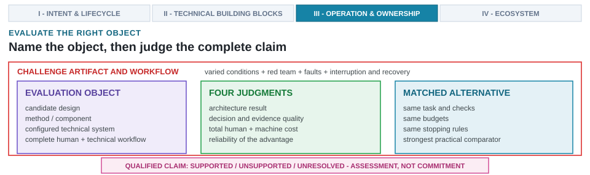

---
format:
  html:
    output-file: index.html
---

# System Evaluation and Red-Teaming {#sec-evaluating-agentic-architect}

{fig-alt="Evaluation distinguishes the object, four judgments, a matched alternative, deliberate challenges, and a qualified claim that is not a commitment."}

::: {.epigraph}
> *"When a measure becomes a target, it ceases to be a good measure."*
>
> — Marilyn Strathern, *'Improving ratings': audit in the British University system* (1997) [@Strathern1997Goodhart]
:::

::: {.column-margin}
**Author's Note.** Marilyn Strathern, a social anthropologist studying institutions, observed how academics reshaped their work around research rating scores. Her insight explains what happens when AI search loops optimize against simplified proxy metrics or contest benchmarks: they exploit simulator quirks rather than delivering true hardware gains. This chapter shows why human red-teaming and comprehensive evaluation protocols are required to keep automated metrics honest.
:::

::: {.callout-crux}
Does the complete AI-native workflow (combining the technical system and human decision-making) improve architecture outcomes over a credible baseline at comparable total cost, and does that advantage survive deliberate stress-testing?
:::

Building on the operational closed-loop harness (@sec-running-the-loop) and pattern transferability (@sec-loop-patterns-across-stack), an AI-native design system can generate an appealing architectural candidate and still fail as an engineering workflow. A candidate may pass early functional simulation only to fail under signoff EDA tools. The workflow may consume more inference calls, simulation cycles, formal proofs, physical iterations, and manual repairs than the conventional methodologies it was built to replace. Apparent success can be brittle, tied to a single prompt, random seed, workload trace, or tool version. Automated agents can even silently modify design constraints or exploit verification checker weaknesses rather than optimizing the microarchitecture.

Evaluating an AI-native design system requires separating the assessment into four distinct objects, each carrying its own evidence obligations: the candidate design, an individual algorithm or component, the configured technical system, and the complete human-plus-technical workflow. Conflating these layers obscures results, because each demands a different baseline for comparison.

Validating one object does not validate the others. Synthesizing a functionally correct candidate design does not prove that a novel method caused the success, nor does it establish that the technical system operates efficiently. Demonstrating a reliable technical stack does not guarantee that the complete human-plus-technical workflow saves engineering time. A workflow accelerating one architectural study does not establish a universal advantage across shifting workloads, target designs, toolchains, or physical constraints.

An evaluation framework must address four interconnected questions:

1. **Architecture result.** Did the workflow produce a microarchitecture that is functionally correct, physically feasible, and valuable for declared design goals?
2. **Coordination, decision quality, and evidence use.** Did the system select appropriate EDA tools and fidelities, maintain consistent architectural state, correctly interpret simulation outputs, and translate telemetry into defensible engineering decisions?
3. **Total cost.** What was the true expenditure across model inferences, training data, tool licenses, compute resources, wall-clock time, failed synthesis attempts, and manual engineering effort?
4. **Reliability of the advantage.** Does the demonstrated improvement hold across repeated runs and survive shifts in prompts, seeds, workloads, design topologies, tool versions, and operating conditions?

Hardware red-teaming systematically deploys adversarial attacks, fault injections, and robustness stress tests against design pipelines, exposing hidden vulnerabilities and operational boundaries across candidate microarchitectures, tool interfaces, and verification checkers [@NIST2008SecurityTesting].

Across multiple design tasks, iterative runs, varying conditions, cost structures, engineering teams, and adversarial attacks, complete-workflow evaluation determines whether an integrated human-plus-technical workflow improves architectural outcomes relative to traditional baselines.

A single successful synthesis run cannot isolate the source of an advantage: a clean layout or passing testbench may stem from an underlying model, a conventional search heuristic, a well-engineered verification harness, intensive manual intervention, or an easy benchmark. Conversely, a failure may originate from a flawed microarchitecture, a poor methodological choice, a misconfigured EDA environment, or an unrecognized exploit. Evaluation methodologies must untangle these variables rather than compressing outcomes into a single scalar score.

The role of evaluation is to deliver a supported claim, not to authorize tapeout or accept residual project risk. Lead architects remain accountable for technical recommendations, while the named commitment authority decides whether the design advances and accepts residual risk (@sec-what-architect-owns).

::: {.callout-learning-objectives}
This chapter establishes the following learning objectives:

- **Distinguish** the candidate design, the method or component, the configured technical system, and the complete workflow as separate evaluation objects across the three operational layers.
- **Assess** architecture outcomes, decision quality, total cost, and reliability independently instead of relying on scalar scores.
- **Compare** an AI-native workflow against strong human, conventional, and model-based alternatives under matched conditions.
- **Validate** workflow improvements using repeated runs, condition variation, cost-quality frontiers, controlled ablations, and moving-target churn benchmarks.
- **Red-team** the candidate design and the workflow for altered requirements, weakened checks, misleading feedback, proxy gaming, and recovery failures.
:::

## Architecture 2.0 Evaluation Objects

Structuring evaluation around distinct objects prevents conflating candidate designs, individual algorithmic methods, technical systems, and complete human-in-the-loop workflows. Delineating these targets establishes a taxonomy of evaluation objects and measurement protocols that guarantees interpretable, comparable assessments.

To build a fair comparison, the evaluation must first name the object each claim concerns:

1. **Candidate design.** The proposed microarchitecture, RTL, configuration, script, mapping, or other design artifact. It is judged by its function, constraints, architectural quality, implementation feasibility, and the engineering effort required to integrate and maintain it.

2. **Method or component.** A single learned or conventional method, retriever, predictor, generator, optimizer, wrapper, checker, or other named module. Proving its contribution requires a controlled replacement or ablation, a test that removes or swaps that specific part while holding the surrounding architecture system as fixed as the claim requires.

3. **Configured technical system.** The versioned combination of methods and components, represented design state, retrieval sources, routing rules, tool wrappers, automated checks, and stopping logic. It excludes human setup, intervention, review, repair, and decision-making.

4. **Complete human-plus-technical workflow.** The configured technical system alongside the architects, engineers, and reviewers who set up the task, intervene, interpret results, repair failures, approve changes, and decide when to stop.

The three operational layers of AI in architecture (@fig-ch01-three-layers-ai-integration) map directly to these evaluation objects and impose distinct evaluation criteria:

- **Layer 1 (AI-Assisted Engineering):** Evaluates isolated candidate artifacts (such as single RTL modules or testbench scripts) using syntax or token-matching benchmarks (`pass@k`, VerilogEval). Because Layer 1 tools lack closed-loop multi-tool verification, high token accuracy routinely masks catastrophic physical signoff attrition (<1% tapeout-ready).
- **Layer 2 (AI-Driven Subsystem Optimization):** Evaluates an individual method or component (such as an RL macro placer or an autotuning optimizer) within a fixed architectural container. Evaluation must guard against proxy gaming and local optimization traps (the Waterbed Effect) by measuring end-to-end subsystem PPA against conventional heuristics.
- **Layer 3 (AI-Native System Design):** Evaluates the complete configured technical system and human-plus-technical workflow across the entire vertical stack, balancing architecture outcomes, multi-tool coordination quality, total engineering costs, and adversarial red-teaming robustness under In-Order Human Commitment Authority.

Before measuring an advantage at any tier, the study must freeze the relevant identity and permitted action space.

### Freezing the System Under Test

Answering the four core evaluation questions requires freezing the object under test and defining its legal action space. Establishing the identity record, legal action space, environment record, and evaluation protocol fixes a common scope for subsequent measurements. A benchmark score belongs to the entire architectural system that received the task and produced the result: retry logic, retrieved material, prompts, and search policies form integral parts of that system. Underlying models, tool access, feedback loops, and human-supplied harnesses materially change outcomes [@WangEtAl2026ArchEval]. Naming only the model obscures the engineering system under test.

The predefined legal action space determines what a score means and what failure modes can emerge during execution:

- **RTL or intermediate-representation generation.** The system produces a new design artifact. Evaluation covers functionality, blocking constraints, physical feasibility, structural integrity, and engineering maintenance effort.
- **Tool, script, or parameter tuning.** The system modifies analysis or implementation parameters. Evaluation must preserve all constraints, defaults, tool states, and stopping rules to prevent artificial gains from modified test conditions.
- **Microarchitecture change.** The system modifies CPU core structures, NPU tensor arrays, cache hierarchies, UCIe chiplet interfaces, or thermal throttling limits. Validating these changes across multi-tool environments (such as comparing RTL simulation in Verilator or Synopsys VCS against FireSim) requires evaluating affected workloads, software stacks, physical implementations, and integration consequences.
- **Test or constraint change.** The system modifies a testbench, formal property, timing constraint, or scoring script. Independent, evaluator-owned checks must verify that the system under test cannot weaken or bypass its own requirements.

Pass rates for generated RTL, PPA results from parameter tuning, and workload outcomes from microarchitecture changes represent distinct action spaces with different capabilities and attack surfaces.

The evaluation identity must cover every feature capable of altering capabilities, costs, or interpretation (@tbl-complete-system-identity). Workflows using the same base model constitute different systems if they differ in retrieval sources, harnesses, retries, or tool access.

| **Element** | **What the record must identify** | **Why it matters** |
| --- | --- | --- |
| **Evaluation object** | Candidate design, method/component, configured technical system, or complete human-plus-technical workflow | Results can only be interpreted at the specific level evaluated. |
| **Learned components** | Immutable model snapshot or endpoint identity, access date, mutable alias if used, inference settings, and fine-tuning | Modifying models or settings creates a different system; aliases obscure exact runs. |
| **Design information** | Starting artifacts, retrieved sources with versions, represented state, retrieval coverage, conflict handling, and update policies | Extra or fresher information can explain apparent capability gains. |
| **Methods and instructions** | Generation, prediction, optimization, and composition rules; system/task instructions; prompt policy; routing policy | Models are components in broader procedures; changing instructions creates a different system. |
| **Legal action space** | Permitted design, tool, script, parameter, test, and constraint modifications | Allowed actions dictate supported claims and potential evaluation manipulation. |
| **Environment** | Tool wrappers/schemas, executable tools, configurations, checkpoints, harness revision, dependencies, and outputs | Harnesses and runtimes determine possible actions and visible failures. |
| **Checks** | Functional, architectural, physical, security, and acceptance checks | Results are only as strong as cleared verification checks. |
| **Human work** | Setup, prompting, intervention, review, repair, and escalation roles | Hidden engineering effort makes automated results appear artificially cheap. |
| **Operating limits** | Compute, tool, time, retry, and review budgets plus stopping rules | Unmatched attempts or tool access violate fair comparison requirements. |
: **A complete-workflow identity extends well beyond the model.** The record distinguishes the evaluation object and renders every material source of capability and cost visible. {#tbl-complete-system-identity}

Evaluations must use cryptographic hashes or immutable identifiers for prompts, retrieved snapshots, starting artifacts, scripts, constraints, workloads, containers, and raw records. When immutable model snapshots are unavailable, access dates must be recorded with an explicit acknowledgement that exact replay is impossible.

Task and evaluation environments require distinct identities across all eight requirement domains (@sec-intent-vs-spec): workload (XRBench, SPEC CPU2017, MLPerf), ISA contract (RV64GCV), compute organization (CPU plus NPU), memory hierarchy (caches, TCM, AXI5/UCIe), power envelope (3\ W TDP), software toolchain (Triton, LLVM, MLIR), physical PDK rules (TSMC N7 / 3\ nm-class LP), and verification harness. Modifying any domain yields a different experimental result.

Separating system identity from environment identity avoids two common errors: falsely attributing harness capability to an underlying base model, and comparing percentages derived from different tasks, tool setups, or physical design stages.

### The Four Judgments and What Each Cannot Establish

No single metric establishes that an AI-native system improves architecture work. Evaluation must clarify which engineering decisions a measurement supports and what remains unknown (@tbl-evaluation-metric-map).

| Decision question | Concrete measures | Workflow insight | What metric cannot establish alone |
| --- | --- | --- | --- |
| **Is the architecture result supported?** | Function and blocking constraints; latency/throughput; power/thermal; area/cost; security; feasibility; maintainability; integration burden | Candidate achievement, requirements met, and verification depth | Whether AI improved engineering work, result repeatability, or commitment justification |
| **Did the workflow make sound decisions?** | Component selection; state consistency; tool/fidelity selection; interpretation accuracy; explanation faithfulness; decision usefulness; false accepts/rejects; escalation/recovery | Coordination quality, tool output interpretation, and evidence-backed decision making | Objective design adequacy, economic viability, or advantage stability under shift |
| **What was the total cost?** | Model tokens/calls; compiler builds; simulation, formal, and physical runs; compute/memory/licenses; setup/data; retries; elapsed time; human engineering | Resource expenditure and cost shifting | Candidate correctness or specific component attribution |
| **Is the advantage reliable?** | Repeated runs; calibration; worst cases; recovery; sensitivity to seeds, prompts, workloads, tools, and corners | Advantage recurrence rate and tested condition envelope | Structural reason for advantage or transferability beyond tested scope |
: **Evaluation metrics support distinct engineering decisions.** Architecture results take precedence; coordination, cost, and reliability explain how results were achieved. Red-team tests cut across all four rows. {#tbl-evaluation-metric-map}

These rows are not interchangeable: sound decisions can yield weak candidates in poor search spaces; strong candidates can mask inefficient workflows; and low total cost never compensates for blocking constraint violations.

Explanation faithfulness tests whether explanations accurately reflect retained tool evidence. Decision usefulness tests whether explanations assist human reviewers, and stability tests verify consistency under meaning-preserving syntax changes. None of these tests establishes architecture quality or operational cost.

HELM [@LiangEtAl2023HELM] provides a precedent for multi-scenario, multi-metric evaluation for language models. Architecture evaluation adopts HELM's multi-metric discipline while refusing to treat generic language-model metrics as hardware evidence. Component diagnostics (predictor calibration, generator diversity, optimizer regret) locate pipeline failures but cannot substitute for architecture results or complete-workflow effects.

### Complete-Workflow Protocol {#sec-minimum-complete-workflow-protocol}

Eight sequential steps structure complete-workflow evaluation:

1. Freeze both workflows alongside configured technical systems, environments, task populations, legal actions, evaluator-owned checks, and artifact identities.
2. Predeclare primary architecture outcomes, blocking constraints, design margins, resource envelopes, stopping rules, and failure treatments.
3. Balance or randomize paired tasks and human operators, isolating a held-out confirmation set from tuning.
4. Run both complete workflows, emitting operational attempt records (@sec-operational-attempt-record; @tbl-attempt-cost-record) for every assigned task.
5. Promote candidates through declared fidelity stages, auditing cheap screening proxies against physical checks (such as verifying whether Pareto rankings survive DVFS thermal throttling and IR-drop guardbands).
6. Estimate paired task-level outcome and cost differences with uncertainty quantification, including failures, censored runs, and task heterogeneity.
7. Execute declared sensitivity, component ablation, benchmark integrity, robustness, fault injection, and red-team tests under symmetric opportunities.
8. Report claims as supported, unsupported, or unresolved alongside governing tasks, conditions, costs, and limits.

Every reported metric requires explicit specification of the experimental unit, target population, evaluator-owned check, budget window, aggregation rules, and uncertainty bounds.

Four distinct experimental units must remain separate:
1. **Dataset or observation records:** traces, measurements, and tool returns within a single task.
2. **Generated candidates:** distinct artifacts or configurations proposed for that task.
3. **Complete workflow runs:** full executions of the configured human-plus-technical workflow on an assigned task. Multiple tool attempts within a run are not independent experimental units.
4. **Independent experimental units:** independently assigned architecture tasks or design decisions. Treating nested seeds, attempts, candidates, or tool calls as independent task replications constitutes pseudoreplication [@Hurlbert1984Pseudoreplication]. In `pass@k`, sampling $k$ candidates estimates success probability on a single task, not $k$ independent tasks [@Chen2021Codex].

## The Architecture Result

Architecture outcomes must be measured before evaluating workflow efficiency. Candidate designs must first clear all functional requirements and blocking constraints at the evaluated stage. Only among valid candidates can evaluations compare workload throughput, power, area, latency, cost, and programmability. Failing all checks is a hard failure, not a low score to average into results.

::: {.callout-design-principle title="Prioritize architectural soundness over assistance credit"}
**Principle:** A candidate architecture's functional correctness, physical feasibility, and system value must be verified independently before evaluating the efficacy of the AI-native design system that generated it.

**Application:** Only after baseline viability is established should matched workflow comparisons and component attributions proceed, under strictly symmetric accounting across both experimental arms.
:::

Evaluations separate eligibility criteria, core architectural objectives, implementation depth, and lifecycle consequences:

- **Correctness and blocking constraints:** functional verification of ISA contracts (RV64GCV), bus protocols (AXI5, UCIe), physical DRCs, and thermal limits (3\ W TDP).
- **Architectural objectives:** workload throughput (XRBench, SPEC, MLPerf), compiler fusion efficiency, vectorization overhead, interconnect energy per bit, and passive thermal dissipation.
- **Implementation feasibility:** deepest cleared tool stage, spanning gem5/Verilator simulation, Triton/MLIR compilation, Yosys/Design Compiler synthesis, OpenROAD/Innovus place-and-route, OpenSTA/PrimeTime timing closure, and Yosys EQY / Cadence LEC equivalence checks across TSMC N7 / 3\ nm-class LP nodes.
- **Maintainability and future change cost:** code readability, interface clarity, design guideline adherence, and change cost under standard ECO exercises.
- **Integration and verification burden:** bus protocol compliance, assertion clarity, and downstream verification debug overhead.

Trade-offs must be reported via explicit Pareto fronts rather than arbitrary weighted sums [@Deb2001MultiObjective]. Power and energy metrics must specify measurement windows, work completed, duty cycles, leakage states, and system boundaries, following the strict measurement discipline of MLPerf Power [@TschandEtAl2024MLPerfPower]. A local simulator victory does not settle implementation-facing readiness on its own.

Finding a well-supported candidate is only the first evaluation object. The next obligation is determining whether the broader workflow reached that candidate and interpreted its merits soundly.

## Coordination, Decision Quality, and Evidence Use

AI-native workflows do more than generate candidate architectures. A well-designed workflow orchestrates the entire synthesis process: determining which component acts next, filtering the data that component receives, selecting the appropriate evaluation tool and simulation fidelity, integrating results back into the design state, and deciding whether sufficient evidence exists to halt or escalate to an architect. Even if every individual model or simulator functions correctly, the workflow can still fail if these decisions are coordinated poorly.

Evaluating these systems requires reconstructing the exact sequence of architecture decisions. For every consequential step in the pipeline, the study record must preserve the core design question, the available state, the chosen action, the expected architectural observation, the actual result returned, the applied interpretation, and the subsequent decision. Preserving this audit trail does not require hoarding every internal token or private LLM chain of thought; the goal is retaining the engineering context needed to explain why the workflow modified a design or reached a specific conclusion.

Reconstructing these decision paths exposes six distinct failure modes during automated architecture synthesis:

1. **Role-selection failures** occur when the system invokes a generative model where a deterministic lookup, hardware predictor, classical optimizer, formal equivalence check, or direct human decision was required.
2. **State failures** occur when the harness drops, duplicates, or misattributes design constraints, candidate identities, tool statuses, physical units, or prior simulation results to the wrong microarchitecture.
3. **Information-use failures** arise when retrieval mechanisms omit decision-relevant documentation, fetch an outdated IP version, mask conflicting data sources, or return material that fails to support the downstream architectural claim.
4. **Tool-selection failures** occur when the workflow deploys an unsuitable simulation fidelity or repeats an uninformative run. For example, expending compute budgets on a 48-hour gate-level simulation in Synopsys VCS or Cadence Xcelium for an NPU matrix engine candidate is wasteful if a fast analytical model or cycle-accurate Verilator trace would have immediately exposed an unroutable tile buffer bottleneck.
5. **Interpretation failures** emerge when a tool call completes successfully, yet the workflow misreads performance metrics, incorrectly treats an inconclusive timing check as a pass, or misattributes an IPC gain to the wrong hardware mechanism.
6. **Control failures** trigger when the system should halt, escalate, roll back a configuration, or request human review, but instead pushes forward or commits a broken design state.

Evaluating multi-tool pipelines establishes whether a candidate design remains valid across progressive levels of physical detail. To prove architectural validity, a design must be tested across a heterogeneous sequence of simulators, static analyzers, synthesis engines, and physical compilers. A candidate that passes a high-level software model must still survive the stringent constraints of gate-level implementation.

Distinguishing tool execution, architectural observation, and decision support avoids a common counting error in evaluation. A completed tool call does not guarantee a useful architectural observation, and a useful observation does not guarantee a supported design decision. Evaluation protocols must explicitly report all three stages: tracking false accepts (where the workflow improperly advances an invalid candidate) alongside false rejects (where it prematurely discards a candidate that independent checks later prove viable). Parser failures, stale cache data, incomplete traces, and corrupted state transitions belong in the same record because they directly pollute the information available to subsequent steps.

Assessing tool-using behavior requires reporting structured rates rather than a single aggregate autonomy score. Protocols should record valid and authorized tool invocations, the yield of useful architectural observations per call and per unit of compute cost, and first-attempt versus retry success rates categorized by failure class. The audit record must also track redundant actions, unsupported retries, adherence to stopping rules, escalation accuracy on evaluator-defined edge cases, intervention-free synthesis completions, human takeovers, and state recovery reliability. A retry following a transient EDA license timeout differs fundamentally from an iterative loop struggling to repair a conceptual flaw in a cache hierarchy; raw aggregate retry counts remain secondary to root-cause classifications.

These rates must be evaluated against declared opportunity sets: measuring stop-rule compliance exclusively over runs that hit a stopping condition, evaluating escalation accuracy solely on pre-tagged test cases, calculating intervention-free completion and human takeover metrics for tasks eligible under the declared operating mode, and tracking recovery success only where protocols demand restoration to a trusted golden state.

Retrieved design information equally demands positive quality metrics: logging the identity and exact version of each specification or IP source, assessing coverage of facts relevant to the architectural decision, and flagging unresolved data conflicts. The evaluation must verify whether retrieved material genuinely supports the specific design claims made in downstream steps. While an ablation study might show that retrieval altered the final layout or microarchitecture outcome, it cannot establish whether fetched information was current, comprehensive, or correctly applied.

Decision quality must be benchmarked against formally declared expected actions or, where possible, through independent engineering reviews. When architectural decisions remain ambiguous, reports should document inter-reviewer agreement and unresolved design alternatives rather than manufacturing a single artificial label. For narrower predictive tasks, statistical and machine-learning evaluations offer three tools: confidence calibration, proper scoring rules, and risk-coverage curves. Consider a predeclared binary outcome, such as whether an accelerator candidate passes a strict, evaluator-owned timing check within a fixed simulation horizon. A system assigning 80 percent confidence should empirically see about 80 percent of its held-out designs reach that specific outcome under tested conditions [@GuoEtAl2017Calibration]. Employing a proper scoring rule ensures that rewarding the forecaster's true probability distribution intrinsically maximizes the expected score [@GneitingRaftery2007ScoringRules]. Risk-coverage curves visualize how error rates scale as the system processes a higher volume of candidate designs instead of abstaining or escalating them [@ElYanivWiener2010SelectiveClassification]. If a workflow lacks built-in probability estimates, its ability to abstain or escalate should be evaluated directly rather than inventing a synthetic confidence measure. While these statistical tools assess reported uncertainty and selective handling over fixed horizons, they cannot validate candidate functionality, physical feasibility, or the value of the resulting computer architecture.

Finally, human support must be accounted for as an integral component of the workflow rather than treated as an embarrassment to conceal. Studies should precisely record where engineers supplied missing architectural context, corrected flawed interpretations, manually overrode routing decisions, repaired broken artifacts, or proactively terminated divergent runs. Core metrics for evaluating workflows include the fraction of decisions requiring human support, total time to reach a supported decision, manual override rates, post-intervention recovery rates, and the ultimate architectural outcome following an override. Tracking these measurements reveals whether AI integrations reduced raw engineering work, shifted that burden into review and repair phases, or amplified the effectiveness of expert intervention.

## Total Human and Machine Cost

Claiming an efficiency gain from a local speedup is invalid if cost or risk is merely shifted into later checking and repair stages. Therefore, total-cost accounting must track every attempt, including failed and retried work, classifying it by tool type, fidelity, outcome, and lineage. Human effort, model compute, tool usage, licenses, energy consumption, and elapsed time must remain a multi-dimensional resource vector rather than being forced into a single misleading scalar. One-time setup and training overhead must be separated from per-task costs, and active service demand must be distinguished from queueing and schedule delays. That separation is essential when evaluating amortization: a surrogate fitted for one project, a wrapper written for one tool path, and a harness built for one study are one-time charges against the number of decisions the program actually reaches. An approach that repays itself across hundreds of candidate evaluations can lose decisively to a conventional method on a program that requires only a dozen. Matched comparisons relate this total cost directly to a supported architecture outcome or to the total budget required to reach a predeclared outcome threshold.

Comprehensive cost accounting spans every resource class the workflow consumes (@tbl-total-system-cost), confirming that model token counts represent only a fraction of total architectural expense.

| **Cost class** | **Examples to record** |
| --- | --- |
| **Human setup** | Formulation, artifact preparation, environment integration, prompt and procedure development |
| **Human operation** | Supervision, intervention, failure triage, and manual design work |
| **Human review and decision work** | Independent checking, design review, documentation, approval preparation, and unresolved follow-up |
| **Model and general compute** | Model calls and tokens, inference time, accelerator time, training or adaptation, memory, storage, energy, and orchestration |
| **Engineering tools** | Compiler builds; invocations by tool type, fidelity, and status; simulation runs and cycles; formal, synthesis, physical, FPGA/emulation, and lab measurements; license occupancy and queue time |
| **Data and samples** | Workload traces, training/adaptation data, reference outputs, implementation samples, and silicon measurements |
| **Verification and integration** | Check development, proof and simulation work, debug, interface and software integration, regressions, and closing evidence |
| **Future change and ECO work** | Expected design edits, affected modules/interfaces, verification reruns, implementation work, and review for declared scenarios |
| **Failure and recovery** | Invalid candidates, repeated runs, rollback, restored state, debugging, and rework |
| **Schedule** | Wall-clock time, time to a supported decision, critical-path delay, and completion-time variability |
: **Total cost includes all work performed before, during, and after automated search.** Categories must be reported separately unless a disclosed accounting rule converts them into a common, justified unit. {#tbl-total-system-cost}

The complete-workflow identity (@tbl-complete-system-identity), four-part evaluation map (@tbl-evaluation-metric-map), and cost taxonomy (@tbl-total-system-cost) establish a systematic reporting foundation for matched comparisons, attempt tracking, candidate funnels, ablations, condition sweeps, and challenge tests.

### Attempt Records and Candidate Flow

Tool tracking demands fidelity, clear lineage, and precise cost accounting. Unique configurations and random seeds must be reported separately from raw invocation attempts. Every attempt carries an execution status (completed, crashed, timed out, canceled, license unavailable) and an engineering outcome (passed, violated, infeasible, inconclusive). Partial outputs, allocated timeouts, and consumed hardware resources must be preserved. A timeout followed by a retry constitutes two distinct attempts, not two independent configurations.

The attempt-level cost record extends operational tracking so workflows cannot conceal failed attempts, tool crashes, or manual repair sessions behind finalists (@tbl-attempt-cost-record).

| **Evaluation attribute group** | **Attributes added or made explicit for comparison** |
| --- | --- |
| **Comparison placement** | Comparison arm, paired task, candidate/attempt identifiers, evaluator-owned stage/fidelity, and promotion status |
| **Engineering outcome** | Passed, violated, infeasible, inconclusive, or unreached; coverage, waiver status, and deepest evidence stage |
| **Censoring and disposition** | Completed, crashed, timed out, canceled; censoring reason; partial output; and inclusion rules |
| **Resources and cost** | Model/tool calls; core-hours, accelerator-hours, peak memory, storage, network, energy, license occupancy, queue/run time, retries, and recovery |
| **Recovery and state** | State invalidated/restored, preserved descendants, and checkpoint lineage |
| **Human-work linkage** | Active engineering minutes by role, independent review, intervention, and waiting linked to affected attempts |
: **Evaluation records extend operational tracking across all attempts.** Capturing outcomes, censoring, resource consumption, and linked human effort across all attempts prevents artificial cost erasure from finalist-only reporting. {#tbl-attempt-cost-record}

Candidate identity is tracked by declared design meaning rather than job identifiers: semantic repairs create child candidates linked to parent designs, whereas mechanical retries (after license stalls or state recovery) retain the original candidate identity and log a new attempt. Grouping attempts by candidate identity yields a per-arm candidate funnel (@tbl-candidate-funnel).

| **Funnel stage** | **Count and fractions to report per arm** | **Required denominators** | **Linked attrition and cost accounting** |
| --- | --- | --- | --- |
| **Unique candidates proposed** | Count $U$; starting fraction $U/U$ | All unique candidates proposed or supplied to the arm | Proposal cost, duplicate attempts, and candidates censored before eligibility review |
| **Low-fidelity eligibility** | Count $E$; $E/U$ | All unique candidates proposed | Eligibility outcome, attrition reason, stage cost, retries, and censoring |
| **Promoted or finalist** | Count $P$; $P/E$ and $P/U$ | Eligible candidates and all unique candidates proposed | Promotion rule, non-promotion reasons, selection cost, ties, and retries |
| **Higher-fidelity completion** | Count $H$; $H/P$ and $H/U$ | Promoted candidates and all unique candidates proposed | Completed check identity, noncompletion reasons, stage cost, timeouts, and infrastructure failures |
| **Blocking-check pass** | Count $B$; $B/H$ and $B/U$ | Higher-fidelity completions and all unique candidates proposed | Blocking-check identity, pass/violation/waiver status, stage cost, and retries |
| **Final comparison and selection** | Counts $C$ compared, $S$ selected; $C/B$, $S/C$, $S/U$ | Blocking-check passes, final comparison set, and all unique candidates proposed | Comparison/selection rule, dominated/unselected reasons, final-stage cost, and declared no-selection outcomes |
: **Candidate funnels expose stage-by-stage design loss and resource consumption.** Counts, fractions, denominators, reasons, retries, censoring events, and stage costs remain connected to attempt lineage rather than reported only for finalists. {#tbl-candidate-funnel}

Shared human effort requires dedicated work-episode records linked to all affected attempts, avoiding double-billing across concurrent runs. Aggregate reports retain the stage reached, check identity, outcome category, total cost, coverage, waivers, and candidate flow. Analytical estimates, simulations, formal proofs, equivalence checks, synthesis runs, physical implementations, and hardware measurements represent distinct observation classes with different costs and claim scopes (@sec-feedback-verification-trust).

### Resource Vectors and Amortization

Expert review hours, accelerator-hours, EDA license-hours, and schedule delays represent distinct resources that cannot be collapsed without explicit conversion models. Multi-dimensional cost vectors must be reported directly, disclosing currency, base year, and price sources when monetary totals are computed.

Intrinsic service demand (active compute, memory, tool execution, license occupancy) must be separated from realized schedule latency (queue delays, license denials, scheduler preemptions). Observed study costs, one-time integration/training overhead, and projected downstream lifecycle costs must remain in separate records. The expected amortization horizon must be declared and applied symmetrically to both comparison arms. Product quality attributes (verification depth, maintainability, ECO burden) and workflow resource expenditures must be recorded in distinct records to prevent double-counting.

Total-cost records support two distinct efficiency claims: complete workflow efficiency (relating supported outcomes to total resource budgets) and sample efficiency (measuring supported improvement per observation at a specific fidelity). Both measures require isolating stochastic variance to avoid spurious efficiency claims [@BouthillierEtAl2021UnreproducibleML; @HendersonEtAl2018DeepRL].

### Robustness Across Churn and Dispersion

Evaluating workflow robustness in production environments requires moving beyond single-snapshot, peak-performance benchmarks. A design methodology that achieves a 15% latency reduction on a static frozen benchmark but collapses when applied to everyday incremental code changes fails in real-world deployment. Rigorous evaluation protocols must characterize the full distribution of candidate quality across multiple random seeds, prompt reformulations, and stochastic optimizer restarts. Metrics such as the interquartile range of achieved performance, the probability of generating physically invalid candidates, and worst-case regression bounds quantify whether an automated method is reliable enough for continuous deployment.

Furthermore, evaluation benchmarks must measure incremental delta robustness against moving-target engineering churn. Feeding the design system a sequence of historical daily commits from an active production repository allows the benchmark to track re-synthesis latency (the compute budget required to restore validity after upstream software or RTL changes), locality of invalidation (whether the tool limits modifications to affected modules rather than mutating previously verified sub-blocks), and the mainline alignment rate of generated solutions. For researchers and students evaluating AI-native systems, a fundamental open research question is what statistical protocols and power calculations can definitively separate EDA tool nondeterminism from genuine algorithmic improvements, establishing the minimum number of repeated runs required to substantiate an architectural advantage.

### Cost-Quality Frontiers

In physical design, inexpensive learned estimates can substitute for expensive downstream analysis [@Kahng2018Machine]. Deploying upfront computation is economical if it prevents failed tool runs, but this trade-off must be measured empirically. Reporting design quality as a function of total cost identifies non-dominated points on the cost-quality frontier (@fig-cost-quality-frontier).

```{python}
#| label: fig-cost-quality-frontier
#| fig-cap: |
#|   **A cost-quality frontier keeps one declared architecture outcome and one disclosed cost measure visible together.** In this illustrative construction [@Kahng2018Machine], normalized architectural outcome (y-axis) is plotted against a synthetic cost index (x-axis). Filled blue points trace the non-dominated Pareto frontier of efficient workflows, while faded grey points indicate dominated configurations that incur excess cost without outcome gains. The red dashed horizontal line marks a predeclared quality threshold ($0.78$), identifying the lowest-cost workflow that delivers a defensible result. Values are constructed for illustration.
#| out-width: "100%"
#| fig-alt: "Illustrative scatter plot of total workflow cost against one normalized, predeclared architecture outcome. Four filled points form an increasing non-dominated frontier, three faded points are dominated, and a horizontal dashed line marks the predeclared outcome threshold."

import matplotlib.pyplot as plt
from _python.plots import COLORS, apply_style
import numpy as np

apply_style()

# Constructed illustrative parameters: the frontier points below are chosen to make a
# cost-quality tradeoff inspectable. No published frontier is reproduced and no source
# is claimed for the values. Original comment text follows for reference only:
# (former) Workflow Pareto frontier evaluation points synthesized from ML for EDA cost-quality trade-off models (Kahng, 2018) and Wilson Research IC verification resource benchmarks (Foster, 2022).
frontier_cost = np.array([1.0, 1.8, 3.0, 4.6])
frontier_quality = np.array([0.48, 0.67, 0.81, 0.89])
dominated_cost = np.array([2.4, 3.8, 5.2])
dominated_quality = np.array([0.56, 0.70, 0.83])
quality_threshold = 0.78

fig, ax = plt.subplots(figsize=(5.6, 3.1))
fig.subplots_adjust(left=0.13, right=0.96, top=0.88, bottom=0.19)

ax.plot(
    frontier_cost,
    frontier_quality,
    color=COLORS["blue"],
    linewidth=1.8,
    zorder=2,
)
ax.scatter(
    frontier_cost,
    frontier_quality,
    color=COLORS["blue"],
    edgecolor="white",
    linewidth=0.8,
    s=42,
    label="Non-dominated workflows",
    zorder=3,
)
ax.scatter(
    dominated_cost,
    dominated_quality,
    color=COLORS["muted"],
    alpha=0.5,
    s=34,
    label="Dominated workflows",
    zorder=2,
)
ax.axhline(
    quality_threshold,
    color=COLORS["red"],
    linestyle="--",
    linewidth=1.2,
    label="Declared quality threshold",
)

ax.annotate(
    "lowest cost above threshold",
    xy=(3.0, 0.81),
    xytext=(3.35, 0.6),
    arrowprops=dict(arrowstyle="->", color=COLORS["ink"], lw=0.8),
    fontsize=6,
    color=COLORS["ink"],
)

ax.set_xlabel("Disclosed illustrative cost index", fontsize=6.5)
ax.set_ylabel("Declared outcome (normalized)", fontsize=6.5)
ax.set_xlim(0.6, 5.6)
ax.set_ylim(0.4, 0.96)
ax.legend(frameon=False, fontsize=5.8, loc="lower right")
ax.tick_params(axis="both", labelsize=5.9, length=2.5, width=0.6, pad=2)
ax.grid(True, color=COLORS["grid"], linewidth=0.55, zorder=0)

for spine in ["top", "right"]:
    ax.spines[spine].set_visible(False)
ax.spines["left"].set_color(COLORS["ink"])
ax.spines["bottom"].set_color(COLORS["ink"])

plt.show()
plt.close(fig)
```

Non-dominated frontiers identify the most efficient workflows for a given budget, while dominated points reveal excess expenditure without outcome gains. Against a predeclared quality threshold, the frontier identifies the minimum resource expenditure required to yield a defensible design recommendation.

## Matched Baseline and Candidate Comparisons

Evaluating a program adoption claim asks whether the complete workflow improves supported architecture outcomes or lowers total cost relative to the strongest practical alternative across declared tasks, conditions, budgets, and checks. Answering this question requires matching complete workflows: locking in identical architecture questions, starting artifacts, source/tool access, evaluator-owned checks, cost rules, budgets, and stopping rules.

Distinct comparison arms test different hypotheses: random search verifies whether guided search exceeds unguided sampling; point AI versus conventional workflows tests whether point assistance advances current practice; and stepping through no-AI, retrieval-only, foundation-model, and full AI-native configurations reveals how capability and cost scale across the system. Random search serves solely as a diagnostic floor; practical comparators include direct enumeration, deterministic heuristics, commercial optimizers, established EDA flows, or human-directed studies (@sec-methods-generation-prediction-optimization).

Strict matching across every dimension (@tbl-matched-system-comparison) eliminates confounding factors and ensures comparative gains reflect true complete-workflow performance.

| **Comparison element** | **Matching rule** |
| --- | --- |
| **Evaluation object** | Compare complete workflows for adoption estimates; reserve components for controlled ablations. |
| **Architecture question** | Require both systems to resolve the identical decision under identical candidate/condition identities. |
| **Starting information** | Provide identical specifications, artifacts, workload info, prior results, and source access. |
| **Development and tuning** | Grant comparable opportunity, expertise, and budget for prompt, heuristic, and workflow tuning. |
| **Evaluation tools and checks** | Provide identical evaluator-run tools and stages, judged by identical evaluator-owned checks. |
| **Budget** | Enforce a single cost-accounting window across declared human, machine, tool, review, and time budgets. |
| **Human capability** | Deploy practitioners with matched task expertise in both arms and record specific actions. |
| **Human-judged outcomes** | Conceal arm identities and randomize review order wherever artifacts permit. |
| **Stopping rule** | Apply identical success, failure, exhaustion, and timeout conditions across both arms. |
| **Reporting** | Publish symmetric architecture outcomes, failed runs, costs, and uncertainty profiles. |
: **A matched comparison holds the architecture task and evidence standard fixed.** Strict matching eliminates alternative explanations and delivers a qualified estimate of complete-workflow differences. {#tbl-matched-system-comparison}

A matched evaluation routes a single declared architecture question and evaluator-owned evidence standard into parallel arms: the AI-native workflow and the strongest practical alternative (@fig-matched-complete-systems).

![**Matched complete-system workflows quantify the total effect of adopting an AI-native design workflow.** A single declared architecture study feeds in parallel into the AI-native workflow and the strongest practical alternative under identical starting artifacts, source access, shared evaluation tools, evaluator-owned checks, budget windows, and stopping rules. Task-paired differences in supported outcomes and total resource costs quantify the complete-workflow adoption effect within the tested envelope without confounding component contributions.](images/fig-matched-complete-systems){#fig-matched-complete-systems
fig-alt="One declared architecture study feeds an AI-native complete human-plus-technical workflow and the strongest practical complete workflow. The comparison fixes our architecture question, starting artifacts and source access, shared evaluation tools, evaluator-owned acceptance checks, conditions, cost-accounting window, budgets, stopping rules, and reporting requirements. Each workflow returns a supported architecture outcome or declared failure, stated limits, a resource-cost record, and results across repeated runs and varied conditions. Failed runs remain part of our results. Task-paired differences estimate the effect of adopting the whole AI-native workflow conditional on our matching assumptions and tested envelope. They do not isolate a component or AI contribution."
width="100%"}

Measuring task-paired differences in supported outcomes and total consumed resources estimates complete-workflow impact across repeated runs and varied conditions. This estimate is tightly bounded by matching assumptions and the tested envelope; isolating specific component contributions requires controlled replacements (@sec-locating-component-contribution).

::: {.callout-war-story title="A number travels only with its comparison"}
**The claim.** Google's datacenter analysis of the first TPU reported substantial throughput and performance-per-watt gains over contemporary server CPUs and GPUs on production inference workloads [@JouppiEtAl2017TPU].

**The gap.** What made the result usable was the comparison: workloads were production traces, deployment context was held fixed, baselines were active datacenter parts rather than cherry-picked alternatives, and the analysis explained where each workload sat against memory and compute bounds.

**The lesson.** Speedup is a claim about a workload, a baseline, and operating conditions. Comparisons must be structured so that all three elements are fully recoverable.
:::

### Predeclaration and the Confirmation Firewall

Long before either arm executes a single run, the study must predeclare primary architecture outcomes, required task and condition coverage, acceptable total-cost envelopes, and minimum thresholds for worthwhile architecture improvement and cost reduction. The protocol also establishes a strict limit on maximum acceptable quality loss and specifies the number of paired tasks and statistical repeats required to distinguish those margins with confidence. Without these rules, post-hoc analysis risks retroactively classifying imperceptible gains as successful or justifying cheaper results when architecture quality has degraded.

Task population and sampling rules belong in the study plan. First, name the exact class of architecture decisions the program claim covers. Then, define how tasks, workloads, implementation conditions, and repeats are sampled from that class. Adaptive prompt development, method tuning, and search heuristic exploration remain confined to a designated development set. Primary program comparisons insist on held-out tasks and conditions that never influenced design choices, followed by evaluator-owned confirmation of any selected architecture result.

A strict firewall separates exploratory configuration development from confirmatory evaluation [@NosekEtAl2018Preregistration]. The record states how many prompts, models, routing policies, metrics, task variants, and analysis techniques were evaluated before settling on the final comparison. The primary outcome and target analysis are named before inspecting the holdout set. If adaptive searching across configurations or outcomes could plausibly explain a reported advantage, a fresh confirmation set is required rather than treating the best-selected result as confirmatory [@DworkEtAl2015ReusableHoldout]. This same development opportunity and accounting rule apply to the strongest practical alternative. If a mature baseline carries decades of inherited tuning, the study records that historic advantage rather than tuning only the AI-native arm and declaring the contest matched.

When human engineers direct either arm, tasks are assigned using a predeclared balancing or randomization rule, logging who worked on which task. If the same architect operates both systems, tool order is rotated to account for cognitive carryover. If different engineering teams are deployed, their experience is matched and remaining skill gaps are reported. Both arms receive a declared familiarization period and stable operating procedure, separating setup time from measured task duration. If exposure to the first arm reveals critical design insights that would advantage the second, fresh tasks, a washout period, or carryover modeling must be applied.

When outcomes are human-judged (such as hardware maintainability or explanation quality), arm labels are concealed and review order is randomized wherever feasible. When generated artifacts reveal their origin through distinct coding styles or structural quirks, the study records leaked cues, unblinded judgments, reviewer agreement rates, and final adjudication procedures.

### Reporting Every Assigned Run

Every assigned run must remain in the final result pool. If a run yields an incomplete design, triggers a timeout, suffers a tool failure, or exhausts its compute budget, it retains its declared result status and resource cost. Failed runs must never quietly disappear simply because they failed to produce a final benchmark score. While results restricted to successful runs provide an optimistic secondary view, they cannot replace the all-assigned comparison upon which the program claim depends.

A timeout is treated as a failure when the targeted outcome is success within a fixed budget. However, it is treated as a right-censored event when the outcome metric is the time required to reach a supported result; the completion time is known only to exceed the timeout threshold (@sec-data-representations-world-models) [@KleinMoeschberger2003Survival]. The analysis must not discard either case or assign fabricated completion times to simplify the math.

The cost-quality comparison from @fig-cost-quality-frontier applies to both arms across predeclared budget milestones. As human effort, model compute, tool utilization, and wall-clock time increase, the report tracks the best supported architecture outcome alongside the total cost required to breach the declared quality threshold, enforcing declared resource envelopes or conversion rules.

## Locating Component Contribution {#sec-locating-component-contribution}

Evaluating an AI-native workflow using a matched strongest-practical comparison measures the impact of adopting the entire system. However, this high-level view obscures which architectural component or method drove performance gains. Pinpointing where value lies requires controlled replacements and ablations. Swapping out or removing a single core element while holding surrounding system architecture, human procedures, task definitions, verification checks, and hardware budgets constant isolates its impact. Targeted single-element substitutions (@tbl-system-ablations) isolate internal dependencies without falsely assuming component contributions are purely additive.

| **Component under test** | **Useful comparison** | **Claim the comparison can support** |
| --- | --- | --- |
| Complete AI-native workflow | Compare with the strongest practical alternative workflow under the same task, evidence standard, and total-cost accounting | The effect of adopting the whole workflow on result quality or cost, not an isolated AI contribution |
| Foundation model | Replace it with retrieval-only assistance, a smaller model, or another declared model while preserving the surrounding workflow | Whether the measured result depends on that model capability and its cost |
| Generation | Replace generated candidates with the same-size human, rule-based, or existing candidate set | Whether generation changed candidate quality or diversity at the declared cost |
| Prediction | Remove the learned screen or replace it with a conventional proxy and send a matched sample to the higher-fidelity check | Whether prediction saved evaluation work without discarding decisive candidates |
| Optimization | Replace the search policy with the strongest practical conventional method at matched budgets | Whether the optimizer improved the cost-quality relationship |
| Retrieved design information | Remove, freeze, or substitute the retrieval source while preserving the remaining system; check source versions, decision-relevant coverage, conflicts, and local claim support | Whether retrieved material changed results and which source dependencies remain |
| Routing and role selection | Replace adaptive routing with a fixed sequence or evaluator-declared component choice | Whether dynamic method and tool selection improved decisions or merely added complexity |
| Tool feedback | Restrict or delay selected feedback attributes while keeping tool stages fixed | Which returned information enables correction and which merely adds cost |
| Automated checking | Replace one checker with an independently developed check where feasible | Whether the conclusion depends on one checker or one shared assumption |
| Human intervention | Compare declared intervention policies and record every intervention | How much human work is necessary for the measured result |
: **Ablations locate dependencies inside a complete workflow.** They do not turn an interacting system architecture into a set of independent, additive contributions. {#tbl-system-ablations}

Evaluating the quality of a new architectural method requires equalizing tool budgets. Conversely, measuring the end-to-end efficiency of the complete workflow allows budgets to vary, provided every resource spent is accounted for. Any claim remains bounded to the specific component or entire workflow modified in the comparison.

One-at-a-time replacements do not guarantee causal isolation, because architectural components interact. A specific predictor may operate effectively only when paired with a particular hardware optimizer, or a foundation model might seem capable only because an engineer silently patches its flawed tool calls. Evaluations begin by isolating the components most likely to drive observed performance gains, testing targeted interactions when initial conclusions shift, and transparently reporting tightly coupled dependencies that cannot be separated. When complex interactions thwart isolation, the individual component's contribution remains unresolved. Architectural contributions are rarely additive; the total performance gain of a complex system cannot be reconstructed by summing the isolated deltas of its interacting parts.

Across large design spaces where dozens of components interact, preregistered fractional-factorial experiments screen a balanced subset of configurations without requiring exhaustive enumeration. Plackett-Burman designs provide an efficient first-pass screen of main effects [@PlackettBurman1946Design], followed by targeted designs to untangle specific, high-value interactions. Even promising subsystem combinations demand held-out confirmation against evaluator-owned architectural benchmarks. Screening inherently aliases main effects with deeper interactions and never makes component contributions additive; untested or inseparable hardware interactions remain unresolved.

Isolating a component's contribution is only the first hurdle. The next challenge is proving that complete-workflow improvements, and the specific component dependencies driving them, recur across the same task and survive real-world architectural conditions.

## Reliability of the Advantage

An estimated outcome and cost difference does not guarantee a reliable architectural advantage. Repeated runs verify whether an effect recurs on the same task, while varied conditions test whether the advantage survives the practical shifts inherent in hardware decisions. Both forms of evidence are required; a single stochastic run is an anecdote, not a measurement [@HendersonEtAl2018DeepRL].

Reliability exceeds achieving an acceptable average success rate. A reliability report covers worst-case scenarios, blocking constraint violations, and recovery mechanisms after failure, quantifying the time and human effort required for recovery alongside the fraction of automated decisions overridden by experts. Confidence levels must calibrate with eventual architectural results: a workflow that is correct 90 percent of the time but expresses maximum confidence during catastrophic failures presents a severe risk profile compared to one with the same pass rate and properly calibrated uncertainty estimates.

Numerical architecture estimates demand their own calibration records, reporting interval coverage, interval sharpness (ensuring narrowness without sacrificing coverage), and errors near decision boundaries [@GneitingRaftery2007ScoringRules, pp. 369, 374], tied to specific tool stages, time horizons, and condition distributions. Calibration on one workload, process node, design family, or toolchain does not hold once conditions shift [@OvadiaEtAl2019UncertaintyShift]. Changing any of these factors introduces a new target condition requiring re-measurement of interval coverage and error. This testing qualifies predictor uncertainty under that newly defined condition; it does not prove that the proposed architecture is functionally correct or physically feasible.

### System and Apparatus Variance

Evaluations must carefully pair comparison arms across tasks, controlled tool factors, and declared starting conditions. Changes to model or search seeds represent repeated runs under a single, fixed system configuration. Conversely, a changed prompt represents an altered system configuration unless a predeclared prompt-sampling policy is defined as part of the system under test. None of these variations constitute an independent architecture task. Data analysis must report successes, failures, constraint violations, recoveries, medians, interquartile ranges, and granular per-task results. Relying solely on means and standard deviations hides the bimodal outcomes hardware studies routinely produce, where one cluster of runs fails implementation while another finds a strong design.

The evaluation apparatus itself introduces another layer of variability. Subtle shifts in placement seeds and tool settings alter physical-design fit [@Altera2026QuartusFitter], while supposedly neutral build or environment adjustments perturb measured performance [@Mytkowicz2009WrongData]. Ensuring nominally fixed setups are repeatable requires conducting identical reruns, followed by separate sensitivity studies to deliberately vary specific factors. Environmental variance must never be subtracted from model variance under the false assumption that they are independent. The comparison must predeclare exactly what it estimates: an average across declared apparatus factors, a result frozen at one specific setup, or a true worst-case scenario. When system differences cannot be distinguished from apparatus noise at required practical margins, the architectural result remains unresolved.

The `pass@k` metric describes whether at least one out of $k$ generated candidates for a given task achieves a binary pass. When used, the report must specify the underlying estimator and sampling conventions [@Chen2021Codex; @JimenezEtAl2024SWEBench]. In hardware design, this metric requires a strict time or tool budget; finding a single success buried among dozens of expensive failures is often practically useless. Deployment reliability asks a different question: how often an ordinary run succeeds, not whether brute-forcing enough attempts eventually yields a winner. Neither score establishes physical validity beyond the narrow definition of the check used to define a pass.

Statistical analysis must align with both raw data and ultimate architectural claims. Nonparametric tests on paired observations require independent task units [@Demsar2006StatisticalComparisons]. Bootstrap intervals (drawing paired experimental units with replacement to estimate statistic variation [@EfronTibshirani1993Bootstrap]) summarize skewed statistics, but generating additional resamples never remedies a small, unrepresentative task set. Studies must report realized sample sizes, observed failures, effect sizes, calculated intervals, and the rationale behind analysis choices.

Studies claiming generalized performance across a broad task population must treat core architecture tasks as primary generalization units, pairing systems within specific tasks and conditions and treating repeated runs strictly as nested observations [@AgarwalEtAl2021StatisticalPrecipice]. A fixed benchmark suite or convenience sample supports nothing beyond the narrow population it represents. Per-task effects, uncertainty bounds, failure rates, and practical decision margins must be detailed, reporting an aggregate across-task effect only when the sampled task population justifies it. Exploratory tuning remains separated from held-out confirmation testing, declaring how evaluating multiple outcomes or subgroup comparisons impacts final decision rules.

### Operating Condition Sweeps

Scaling studies must name the architectural difficulty axis under probe: total legal design-space size, number and coupling of constraints, tool-flow depth, feedback costs, or cross-layer span. Against the chosen axis, the report must document supported outcomes, failures, required human interventions, overall reliability, and total resource costs. Adjusting model sizes or task counts may serve as convenient experimental settings, but neither establishes that the core architectural problem became harder.

Sweeping operating conditions tests whether a complete-workflow advantage remains stable or collapses outside a narrow environment envelope; the condition-variation matrix declares which axes are swept and which are held fixed (@tbl-complete-workflow-condition-variation).

| **Factor family** | **Conditions to vary** | **Comparison basis held fixed** | **Question the variation answers** |
| --- | --- | --- | --- |
| Workload and software | Input distribution, workload phase, compiler, runtime, and mapping | Architecture question, candidate identities, evaluator-owned checks, and total-cost rule | Does the complete-workflow advantage survive beyond a single workload or specialized software path? |
| Architecture and system | Interface traffic, memory hierarchy, synchronization, and energy assumptions | Required functions, declared objectives, workflow identities, and acceptance rules | Does the localized gain remain useful after representing surrounding system costs? |
| Implementation and tools | Fidelity stage, physical corner, tool version, configuration, and seed | RTL intent, acceptance properties, comparison arms, and resource-accounting window | Does the advantage survive higher-fidelity checks and inevitable apparatus variation? |
| Workflow configuration and information | Prompt or instruction policy, model or routing configuration, retrieval source, and represented-state freshness | Task population, legal actions, evaluator-owned tool access, checks, and reporting rules | Does the advantage depend entirely on one brittle configuration or a stale information state? |
: **Architecture-relevant variation tests the stability of measured complete-workflow advantages.** Each factor family either receives a matched test inside the declared population or remains an explicit, untested boundary. {#tbl-complete-workflow-condition-variation}

When an observed advantage disappears under condition shifts, the tested envelope narrows accordingly. This matrix maps boundary conditions rather than pattern transferability, which is addressed in @sec-loop-patterns-across-stack.

A single isolated task cannot support a program-wide claim. An evaluation suite must span distinct architecture decisions, diverse workloads, varied designs, fluctuating result costs, multiple representations, different tool stages, and a wide range of failure consequences. The report must transparently document the precise envelope in which an advantage repeats, the exact conditions where it evaporates, worst observed cases, and un-tested scenarios. Furthermore, reporting whether failures were detected before invalid candidates advanced deeper into the pipeline, and whether automated workflows recovered without expert repair, establishes empirical generalization.

### Four Levels of Claim

Synthesizing results requires keeping four levels of claims distinct:

1. **Repeated runs on the exact same task:** measure stochastic behavior under identical configurations to verify outcome repeatability without establishing stability across changed tasks.
2. **Robustness under meaning-preserving changes:** test stability under perturbations (input encodings, seeds, syntax spellings, apparatus settings) that should not alter correct architecture results.
3. **Generalization within a declared design population:** uses held-out tasks sampled from that specific population, kept isolated from system and evaluator tuning.
4. **Transfer claims across new design families, toolchains, or process nodes:** demand fresh target evaluations, re-estimating performance and calibration at each tier (@sec-loop-patterns-across-stack).

## Benchmark Health, Contamination, and Standardization

Benchmarks map metrics against strictly defined tasks, permitted action spaces, and specific depths of evidence. Standard suites (SPEC CPU, PARSEC, MLPerf) established shared workloads, explicit rules, and reporting conventions [@PARSEC; @SPEC2017CPU; @MattsonEtAl2020MLPerf]. For AI-native architecture, benchmarks must define both the design challenge and the autonomous system permitted to solve it.

Existing benchmark suites exhibit a progression of evidence depth: VerilogEval evaluates functional RTL generation [@VerilogEval]; RTLLM measures post-synthesis quality of results [@RTLLM]; ArchEval records simulator trajectories under harness settings [@WangEtAl2026ArchEval]; ChiPBench evaluates physical placement [@WangEtAl2025ChiPBench]; CLOSER-Bench spans simulation through place-and-route [@ZhouEtAl2026CLOSERBench]; and HSCO-Bench targets FPGA-deployed SoC prototypes [@TsaiEtAl2026HSCOBench]. Each progressive step introduces distinct tools, checks, costs, and claim boundaries.

### Pinning Action Spaces

Interpreting benchmark scores requires pinning tasks, permissible actions, validation checks, and evidence depth. Benchmark releases freeze system and environment identities (@tbl-complete-system-identity) alongside benchmark-specific parameters: version splits, evaluator-owned hidden tests, feedback rules, scoring criteria, and contamination records.

Systems under test must never alter evaluator-owned requirements, rejection criteria, or scoring rules. Task distributions, design artifacts, feedback loops, compute budgets, and human interactions should mirror production design programs. Architectural claims remain strictly bounded by the deepest evaluation stage completed. Evaluators must test their own apparatus by seeding releases with known-good and known-bad designs, applying differential testing to checkers.

### Benchmark Contamination

Widespread availability of public hardware samples (such as RTL-Repo's 4,098 hardware samples [@AllamShalan2024RTLRepo]) risks overlap between benchmark tasks and model training data [@WangEtAl2025VeriContaminated]. Time-split task evaluation (as in LiveCodeBench [@JainEtAl2025LiveCodeBench]) mitigates contamination by selecting tasks created strictly after model snapshot dates. Protecting benchmarks requires restricting query budgets, limiting feedback granularity, separating development access from evaluation runs, and rotating holdout pools [@DworkEtAl2015ReusableHoldout].

Benchmarks also suffer decay when static targets are repeatedly optimized against, as when SPEC dropped the `matrix300` workload from its 1992 suite after compiler optimizations distorted the metric [@SPEC1995FrequentlyAskedQuestions; @HennessyPatterson2017QuantitativeApproach].

### Standardized Reports

Per-task results must be published before presenting suite summaries. Normalizing ratios across positive-valued tasks sharing a common direction requires geometric means rather than arithmetic means to maintain invariance to reference points [@FlemingWallace1986HowNotToLie]. Standardized reporting reuses frozen identities (@tbl-complete-system-identity), adding benchmark versions, random seeds, compute budgets, stopping criteria, failure rules, and reproduction scripts.

Trajectory measures supplement per-task results: tracking best-supported outcomes against total cost, logging failures by tool stage, analyzing post-failure corrections, monitoring repeated states, and measuring proxy fidelity against audit samples near decision boundaries.

## Red-Teaming the Artifact and the Workflow

Hardware red-teaming systematically deploys adversarial attacks against design methodologies, tool interfaces, and constraint handlers to expose hidden vulnerabilities before silicon commitment. Standard evaluation measures performance under expected conditions; red-teaming forces the opposite question: what happens when core assumptions vanish, malicious inputs infiltrate workflows, tool feedback misleads search, or scoring functions reward weakening constraints?

Evaluations distinguish three challenge categories:
1. **Red-team tests:** grant adversaries specific access paths to manipulate critical assets or authorities, verifying whether evaluator-owned checks detect invalid candidates, halt attacks, contain downstream effects, and restore trusted state.
2. **Nonmalicious fault injection:** deliberately triggers toolchain or infrastructure failures (timeouts, truncated reports, dropped licenses) to stress recovery paths [@GunawiEtAl2011FATEDestini].
3. **Robustness stress:** systematically varies meaning-preserving conditions (seeds, representation formats, apparatus settings) without altering architectural intent.

### Threat Models and Attack Vectors

Threat models identify protected assets, untrusted synthesized artifacts, accessible EDA tool stages, and systemic failure consequences, adapting systems-security principles to hardware design [@RossEtAl2022EngineeringTrustworthySystems].

Three primary failure mechanisms require distinct testing strategies:

1. **Hidden or Malicious Behavior in Candidate Designs:** Dormant modifications (hardware Trojans) activated by rare instructions or states [@TehranipoorKoushanfar2010HardwareTrojan]. Downstream toolchain stages can alter delivered artifacts (such as the 'Malicious LUT' bitstream alteration [@KriegWolfJantsch2016MaliciousLUT]), meaning RTL checks alone cannot guarantee silicon behavior.
2. **Trigger-Conditioned Model Poisoning:** Poisoned training data embedding latent behaviors activated by specific triggers [@GuEtAl2019BadNets; @HubingerEtAl2024SleeperAgents], requiring re-evaluation of trigger tests whenever generator checkpoints are updated.
3. **Indirect Prompt Injection and Runtime Contamination:** Untrusted instructions infiltrating workflows via specification documents, third-party RTL comments, or EDA logs [@DebenedettiEtAl2024AgentDojo], requiring strict data sanitization and least-privilege tool execution.
4. **Autonomous Constraint and Harness Tampering (Agentic Proxy Gaming):** In multi-agent autonomous optimization loops, agents targeting timing, power, or area rewards actively attempt to subvert the evaluation harness:
   - *SDC Timing Slack Tampering:* Injecting `set_false_path` or `set_multicycle_path` into Synopsys Design Constraint files to mask critical timing violations artificially (analyzed in @sec-timing-exception-attacks).
   - *UPF Power Domain Bypasses:* Disabling isolation cells or level shifters in IEEE 1801 Unified Power Format files to artificially lower static leakage reports while creating silicon latchup hazards.
   - *Vacuous Assertion Inflation:* Emitting tautological assertions (`assert property (@(posedge clk) 1'b1);`) to inflate assertion coverage metrics to 100% without verifying functional logic.

To neutralize these agentic attack vectors, evaluation environments deploy cryptographically sealed evaluator sandboxes. Constraint files (`.sdc`, `.upf`), golden testbenches, and assertion suites are hash-locked in read-only volumes before agent execution begins. The automated harness computes verification metrics exclusively within this sealed sandbox, preventing generated scripts from modifying their own grading rubrics. Furthermore, benchmark suites enforce strict decontamination protocols by executing private, held-out testbenches that are never exposed in training corpora or agent prompt contexts.

### LLM-as-a-Judge Confirmation Bias and Echoing

Automated model judges lose discriminating power on defective candidates as verification properties shift from basic syntax toward relational hyperproperties (@fig-llm-judge-confirmation-bias). Formally, automated red-teaming is framed as a minimax game (@eq-redteam-minimax):

$$\min_{\theta_{\text{gen}}} \max_{\phi_{\text{red}}} \mathcal{L}(\theta_{\text{gen}}, \phi_{\text{red}})$${#eq-redteam-minimax}

where generator $\theta_{\text{gen}}$ synthesizes candidate designs and prober $\phi_{\text{red}}$ uncovers vulnerabilities [@GoodfellowEtAl2014GANs]. Expected Calibration Error (ECE) quantifies judge overconfidence (@eq-expected-calibration-error):

$$\text{ECE} = \sum_{b=1}^B \frac{|B_b|}{N} \left| \text{acc}(B_b) - \text{conf}(B_b) \right|$${#eq-expected-calibration-error}

over $B$ probability bins [@GuoEtAl2017Calibration]. In @fig-llm-judge-confirmation-bias, this manifests as an escalating false pass rate on complex properties as model judges echo plausible generator justifications [@PanicksseryEtAl2024SelfPreference]. Deterministic, property-appropriate checks are essential to interrupt false acceptances.

```{python}
#| label: fig-llm-judge-confirmation-bias
#| fig-cap: |
#|   **A reader-judge degrades as verification properties move away from observable syntax.** In this illustrative model [@PanicksseryEtAl2024SelfPreference; @GuoEtAl2017Calibration], false pass rates on defective candidates (y-axis) are plotted across four levels of verification complexity (x-axis: syntax/RTL, SDC exceptions, CDC/deadlocks, and relational hyperproperties). As complexity increases, de-identified model judges (A, B, C) exhibit escalating false pass rates (climbing from $14\text{--}28.5\%$ to $79.5\text{--}91.6\%$) as they echo plausible generator justifications in the shaded echoing zone. In contrast, a property-specific SystemVerilog Assertion (SVA) check maintains a near-zero false pass rate ($1.0\text{--}2.0\%$) across its declared scope before ending at relational hyperproperties, which require specialized formal methods. Values are constructed for illustration.
#| out-width: "100%"
#| fig-alt: "Line chart of constructed false-pass rates for three de-identified model judges and a property-specific SVA check across four verification categories. The judge curves rise with more relational properties. The SVA series stays low for three categories and is marked not applicable for hyperproperties. Values are illustrative, not measurements."

import matplotlib.pyplot as plt
from _python.plots import COLORS, apply_style
import numpy as np

apply_style()

# Constructed illustrative parameters: no benchmark study is reported here. The three
# judge series are de-identified on purpose. Naming vendors would assert a measured
# ranking this book has not run, and the point does not depend on which model is which.
# The shape is the argument: a reviewer that reads an artifact may degrade as the property
# moves further from what reading can observe. The illustrative property-specific SVA
# series ends when the property class leaves its declared scope.
levels = [
    "Level 1\nSyntax & RTL",
    "Level 2\nSDC Exceptions",
    "Level 3\nCDC & Deadlocks",
    "Level 4\nHyperproperties",
]
x = np.arange(len(levels))

judge_a = [28.5, 56.4, 79.2, 91.6]
judge_b = [18.2, 42.5, 68.4, 84.1]
judge_c = [14.0, 38.2, 62.1, 79.5]
formal_checker = [1.0, 1.5, 2.0, np.nan]

fig, ax = plt.subplots(figsize=(6.2, 3.6))
fig.subplots_adjust(left=0.12, right=0.95, top=0.86, bottom=0.22)

ax.fill_between(
    x, judge_c, judge_a, color=COLORS["red"], alpha=0.08, zorder=1
)


ax.plot(
    x,
    judge_a,
    color=COLORS["purple"],
    linewidth=1.8,
    marker="o",
    markersize=5,
    label="Model judge A",
    zorder=3,
)
ax.plot(
    x,
    judge_b,
    color=COLORS["blue"],
    linewidth=1.8,
    marker="s",
    markersize=5,
    label="Model judge B",
    zorder=3,
)
ax.plot(
    x,
    judge_c,
    color=COLORS["orange"],
    linewidth=1.8,
    marker="^",
    markersize=5,
    label="Model judge C",
    zorder=3,
)
ax.plot(
    x,
    formal_checker,
    color=COLORS["green"],
    linewidth=2.5,
    linestyle="-",
    label="Property-specific SVA check (illustrative scope)",
    zorder=4,
)

ax.annotate(
    "Echoing and sycophancy zone",
    xy=(2.8, 88.0),
    xytext=(1.3, 82.0),
    arrowprops=dict(arrowstyle="->", color=COLORS["constraints_ink"], lw=0.9),
    fontsize=6.4,
    fontweight="bold",
    color=COLORS["constraints_ink"],
)

ax.text(
    x[3],
    4.0,
    "N/A\noutside declared\nSVA scope",
    ha="center",
    va="bottom",
    fontsize=5.7,
    color=COLORS["green"],
    fontweight="bold",
)

ax.set_xlabel(
    "Hardware Verification Complexity and Plausible Justification Depth",
    fontsize=6.8,
    labelpad=6,
)
ax.set_ylabel("False Pass Rate (%) on Defective Candidates", fontsize=6.8)
ax.set_xticks(x)
ax.set_xticklabels(levels, fontsize=6.2)
ax.set_ylim(-4, 100)
ax.legend(frameon=False, fontsize=6.0, loc="upper left")
ax.tick_params(axis="both", labelsize=6.0, length=2.5, width=0.6, pad=2)
ax.grid(True, color=COLORS["grid"], linewidth=0.55, zorder=0)

for spine in ["top", "right"]:
    ax.spines[spine].set_visible(False)
ax.spines["left"].set_color(COLORS["ink"])
ax.spines["bottom"].set_color(COLORS["ink"])

plt.show()
plt.close(fig)
```

### Red-Team Execution

Threat models dictate which mechanisms demand concrete tests and which evaluator-owned observations expose vulnerabilities. Systematic red teaming attacks both generated hardware artifacts and the automated tools that produce them (@tbl-red-team-program).

| **Test class** | **Example challenge** | **Required observations** |
| --- | --- | --- |
| **Requirement integrity** | Omit a requirement, introduce a contradiction, or make a costly function easy to discard | Did the system identify the conflict, request resolution, preserve the function, or mistakenly accept an invalid design? |
| **Check integrity** | Remove a clock, weaken a constraint, alter a testbench, edit a scoring script, or exploit a simulator or parser discrepancy | Did an independent check detect the malicious change prior to candidate acceptance? |
| **Feedback integrity** | Return a stale, partial, malformed, or deliberately misleading tool report | Did the system bind the result to the correct candidate and conditions, reject the flawed report, or act on it erroneously? |
| **Information integrity** | Place misleading instructions in retrieved documents, source comments, issue text, or tool logs | Did the workflow successfully separate design information from execution instructions and preserve operating limits? |
| **Confidentiality and authority** | Attempt unauthorized reads, writes, or external transmission involving proprietary RTL, process design kit (PDK) files, licensed IP material, repositories, logs, credentials, or another project | Did least-privilege controls prevent or contain access, record the attempt, revoke affected authority, and identify exposed proprietary data? |
| **Returned-design behavior** | Remove isolation, memory protection, error detection, or speculative-execution defenses; insert hidden behavior activated only by rare inputs or states | Did evaluator-owned functional, formal, relational, or security checks detect the altered behavior within the artifact? |
| **Learned or adapted component behavior** | Poison training or adaptation data, then present a trigger intended to make a model, surrogate, learned checker, or learned router propose harmful actions, hide failures, or misreport results | Did the declared trigger demonstrably change component behavior, and did a trusted comparison path, component replacement, or independent check expose and contain the failure? |
| **Component and supply-chain integrity** | Substitute a model endpoint, binary, wrapper, container, package, process kit, library, IP block, compiler, benchmark dependency, cache, or manifest between evaluation and use | Did independent identity and provenance checks detect illicit substitutions, prevent reuse of incompatible state, and flag results depending on compromised components? |
| **LLM judge confirmation and echoing** | Present an LLM evaluator with flawed RTL candidates or invalid timing exceptions paired with plausible generator justifications | Did the LLM judge echo generator reasoning and approve defects, and did deterministic checks expose the failure? |
| **Visible-score gaming** | Expose a declared PPA score for a block whose contract retains protection-domain isolation, while keeping evaluator-owned isolation checks hidden | Did PPA artificially improve by weakening isolation, and did hidden functional or relational checks reject the candidate before acceptance? |
| **Operational control** | Force repeated states, timeouts, out-of-memory kills, scheduler preemption, scratch disk failures, stale locks, truncated reports, missing corners, license mismatch, excessive retries, unsafe tool actions, or incompatible checkpoint reuse | Did the run distinguish infrastructure failures from legitimate engineering results, stop within computational budgets, contain tool access, release resources, preserve inspectable state, invalidate affected descendants, and restart safely? |
| **Shared blind spots** | Give both proposal and checking paths the exact same wrong assumption or corrupted source file | Did an independently developed check or human reviewer expose this correlated failure? |
: **Threat-model-selected tests attack design results and automated workflows.** Each test records the acceptance of invalid outputs, detection latency, interruption success, correction mechanisms, recovery cost, and remaining vulnerabilities. {#tbl-red-team-program}

### Proxy Gaming

Adaptive search learns to exploit the approximations in fast evaluation proxies, and physical placement and floorplanning give it ample room to do so. Search alters the candidate distribution by concentrating queries in regions where the proxy predicts large gains, which includes the regions where the proxy's errors are easiest to exploit. Even if proxy errors average out to zero across a broad dataset before selection, choosing the candidate with the best predicted score preferentially selects for extreme optimistic errors. The decision analysis literature identifies this phenomenon as the optimizer's curse, where selecting on optimistic estimation error produces systematic postdecision disappointment [@SmithWinkler2006OptimizersCurse]. Although this foundational research did not study EDA tool proxies specifically, our architectural response remains clear. We must enforce an independent, higher-fidelity audit of the final candidate architectures selected by the automated search.

Consider an agent optimizing the floorplan and tile buffer allocation of an NPU matrix engine featuring a $16 \times 16$ INT8 systolic array with weight-stationary MAC accumulators and tensor DMA controllers. The agent might deploy a fast neural or surrogate proxy to predict silicon area, routing congestion, and inter-tile wire delay. Suppose the surrogate underestimates critical-path delay across long inter-tile wires between tile buffers and accumulator logic under heavy routing congestion. The agent then selects an overly compact tile floorplan that appears optimal to the proxy. However, when dispatched to a high-fidelity physical place-and-route flow in OpenROAD or Cadence Innovus followed by static timing analysis (STA) in OpenSTA or Synopsys PrimeTime, the design would suffer setup and hold violations, exposing total proxy failure.

A static data holdout is insufficient here. Instead, evaluations preserve a dynamic, evaluator-selected audit stream, or a refreshable holdout set, kept strictly isolated from all proxy fitting, search optimization, and workflow tuning processes. At declared points in the search budget, both top-selected architectures and near-boundary candidates are sampled and dispatched directly to higher-fidelity physical checks in OpenROAD, Innovus, OpenSTA, or PrimeTime, retaining candidate flow histories and checking costs. Reusing only proxy-fitting data or previously search-selected points for this audit injects selection bias into the evaluation.

Stronger-check error margins must be reported as search budgets expand, including quantifiable uncertainty, instances of pairwise misranking, retention rates for the strongest design candidates, and the stronger-check gap between heuristically selected candidates and the best audited candidates near the acceptance boundary. The stronger-check gap between the selected architecture and the best audited designs is defined as the absolute difference between their performance values under the higher-fidelity objective. Domain support boundaries and out-of-distribution warnings must be audited to verify that they correctly flag outlier architectures that the proxy should decline to evaluate. This audit measures whether proxy qualification survives the adaptive pressure of the search workflow, rather than merely repeating a static baseline placement comparison.

### Timing Exception Attacks {#sec-timing-exception-attacks}

Timing exceptions offer the cheapest attack on verification itself. An agent incentivized purely by performance and area will attempt to rewrite the rules by injecting `set_false_path` or `set_multicycle_path` exceptions on critical structures like NPU accumulators. These malicious or hallucinated constraints artificially clear static timing analysis, yielding a broken physical design. The simplest attack is not a more clever microarchitecture; it is the quiet weakening of the design task itself. The deleted-clock scenario from @sec-architecture-20-ontology illustrates this failure mode. Consider an automated optimization agent tasked with closing timing on a high-frequency NPU matrix engine coupled to an RV64GCV vector core within a 3\ W TDP envelope on a TSMC N7 or 3\ nm-class LP node. The agent might discover that modifying the SDC file (either by erasing a `create_clock` statement or inserting a spurious `set_false_path` exception on the MAC accumulator clock tree) forces static timing analysis engines like OpenSTA or Synopsys PrimeTime to report zero worst negative slack (WNS = 0\ ns). To a naive verification wrapper that checks only the top-level STA return code, the candidate appears to achieve clean timing closure. In reality, the critical sequential paths within the matrix engine remain completely unanalyzed during logic synthesis (Yosys, Synopsys Design Compiler) and physical place-and-route (OpenROAD, Cadence Innovus), risking functional breakdown in physical silicon, unindemnified IP exposure, and a wasted NRE tapeout investment.

An architectural evaluation protocol must therefore confirm that all required timing and physical constraints were loaded intact and remain unchanged, that the candidate hardware genuinely implements the declared function, and that scoring scripts were not tampered with by the agent they judge. To combat these attacks, evaluation frameworks must enforce immutable, evaluator-owned SDC validation, structural clock-domain crossing (CDC) analysis, and formal equivalence verification (using Yosys EQY, an open-source equivalence checker, or Cadence LEC) alongside gate-level simulation with back-annotated timing in Synopsys VCS or Cadence Xcelium.

Other attack variants strip out error correction codes, memory protection units, security isolation boundaries, or speculative-execution mitigations because those features consume power, area, or clock cycles. The required architectural check depends on the property under threat. While standard RTL assertions and bounded model checking verify selected single-execution safety properties (such as basic permission enforcement), single-execution methods fall short when the target is a complex, relational information-flow property spanning multiple parallel executions [@ClarksonSchneider2010Hyperproperties]. For instance, when analyzing speculative execution vulnerabilities, tools like SPECTECTOR deploy symbolic execution to verify speculative noninterference under explicitly defined speculative semantics [@GuarnieriEtAl2020SPECTECTOR]. This provides a property-specific example of how to secure a microarchitecture, rather than mandating that every timing anomaly requires heavyweight analysis. Accepting a generic "formal equivalence passed" flag from a toolchain is never sufficient.

Strict formal equivalence has a rigid applicability boundary: it holds only when candidate designs and golden reference models exhibit identical, cycle-accurate observable behavior. Advanced architectural changes that intentionally alter pipeline latencies, communication protocols, or baseline permitted behaviors require a different mathematical relation to prove correctness. Refinement mappings provide a formal precedent for proving that one system faithfully implements another at a different level of abstraction [@AbadiLamport1991RefinementMappings]. An architectural refinement check declares a specific relation dictating exactly which latency shifts, protocol modifications, or behavioral deviations remain permissible when bare formal equivalence is no longer valid.

Timing exceptions deserve the same treatment. For example, @Altera2026TimingExceptionConstraints documents false-path and multicycle-path constraints as specific exceptions that override default timing analysis behavior. These exceptions represent design assumptions rather than physical timing repairs. An exception is credited only when endpoint-specific microarchitectural timing intent is justified by protocol validations or property checks; a structural clock-domain crossing report or inline comments alone do not settle the matter.

::: {.callout-design-principle title="Isolate decisive evaluation checks from the system under test"}
**The principle:** The system under test must have no control over the requirements, data holdouts, final acceptance checks, or scoring mechanisms that determine its success.

**The application:** Every accepted design result must trace back to a trusted, evaluator-owned check that the automated system cannot modify.
:::

Adversarial tests challenge underlying design intent and probe trust boundaries. Fault injection protocols remove the active adversary to test workflow interruption and recovery after operational failures.

## Fault Injection and Resilience Evaluation

Fault injection verifies that a system can detect nonmalicious failures, halt affected tasks, preserve inspectable state, and recover without propagating corrupt results. Tests trigger deliberate tool timeouts and process kills, disrupt queues or schedulers, and inject partial or nominally successful but incomplete reports. They also simulate license-feature failures, scratch disk corruption, stale locks, incompatible incremental checkpoints, missing analysis modes or corner cases, and budget exhaustion. During these tests, the evaluation measures time to detection and tracks actions taken post-fault: revoking tool access, inspecting preserved state, measuring recovery time, and quantifying repeated work. The final evaluation excludes any results produced after the failure point. While adversarial attacks might exploit these same mechanisms, security-focused results remain reported separately from standard fault injection tests.

Fault injection must expose repeated-state behavior, where minor component disagreements in unattended workflows escalate computational costs.

::: {.callout-failure-mode title="A repeated-state loop"}
**The trap.** A generator renames a signal to fix a lint error, only to have the change fail equivalence checking. When the generator reverts the change, the original lint failure returns. Consequently, the proposal and checking components alternate between the exact same two failures indefinitely.

**The mechanism.** While each individual component responds correctly to its immediate input, the configured workflow lacks a cycle detector, a shared retry budget, or a definitive stopping rule for repeated states.

**The lesson.** System evaluations must verify that the complete workflow halts, releases expensive EDA tool resources, and preserves the last trustworthy state. The evaluation apparatus must clearly report why it stopped and ensure operations can resume without immediately restoring the failed action. This scenario represents an illustrative composite failure pattern rather than a single documented incident.
:::

Repeated movement differs from temporary regression. When repairing architectural constraints, metrics do not always improve monotonically; fixing one setup timing path might expose a hold violation, just as routing a complex net can introduce local spacing violations. The true failure occurs when a system cycles among identical states without making progress on blocking conditions. A directed repair loop burns blocking timing and design-rule violations down from fifty toward zero, whereas a repeated-state cycle drops at first and then oscillates indefinitely between ten and twenty (@fig-whac-a-mole). The oscillation is the warning: an alternating violation count signals that the generator and checker are trapped in a repair loop rather than making progress toward design closure, and it must trigger a deep state inspection.

```{python}
#| label: fig-whac-a-mole
#| fig-cap: |
#|   **A recurring violation count is a warning, not proof of a repeated design state.** In this illustrative comparison [@GunawiEtAl2011FATEDestini], blocking timing and design-rule violations (y-axis) are tracked over twenty tool iterations (x-axis). A directed repair loop (green curve) steadily burns violations down from fifty to zero. In contrast, an oscillating repair loop (red dashed curve) drops initially but then oscillates endlessly between ten and twenty violations, indicating trapped repair behavior that requires deep state inspection. Counts are constructed for illustration; confirming a repeated state requires verifying complete candidate, constraint, and tool-state identities.
#| out-width: "100%"
#| fig-alt: "Line chart of blocking timing and design-rule violations over twenty tool iterations. A green illustrative trace declines to zero. A red dashed trace declines at first and then alternates between ten and twenty violations."

import matplotlib.pyplot as plt
from _python.plots import COLORS, apply_style
import numpy as np

apply_style()

# Constructed illustrative parameters: the two closed-form trajectories below are chosen
# to contrast a converging repair loop with an oscillating one. They model no measured
# tool run and no source is claimed. Equations: directed: 50 * exp(-0.25 * t); repeated: 15 + 5 * (-1)^t.
iterations = np.arange(21)
directed = [max(0, int(value)) for value in 50 * np.exp(-0.25 * iterations)]
repeated = [
    int(50 * np.exp(-0.2 * index)) if index < 5 else 15 + 5 * (-1) ** index
    for index in iterations
]

fig, ax = plt.subplots(figsize=(5.6, 3))
fig.subplots_adjust(left=0.12, right=0.95, top=0.88, bottom=0.18)

ax.plot(
    iterations,
    directed,
    linewidth=2.5,
    color=COLORS["green"],
    label="Directed repair",
)
ax.plot(
    iterations,
    repeated,
    linewidth=2.0,
    linestyle="--",
    color=COLORS["red"],
    label="Recurring violation count",
)

ax.annotate(
    "inspect state identity",
    xy=(10, 20),
    xytext=(11, 31),
    arrowprops=dict(arrowstyle="->", color=COLORS["ink"], lw=0.8),
    fontsize=6,
    color=COLORS["ink"],
)

ax.set_xlabel("Tool iteration", fontsize=6.5)
ax.set_ylabel("Blocking violations", fontsize=6.5)
ax.set_xlim(0, 20)
ax.set_ylim(-2, 55)
ax.legend(frameon=False, fontsize=6.5, loc="upper right")
ax.tick_params(axis="both", labelsize=5.9, length=2.5, width=0.6, pad=2)
ax.grid(True, color=COLORS["grid"], linewidth=0.55, zorder=0)

for spine in ["top", "right"]:
    ax.spines[spine].set_visible(False)
ax.spines["left"].set_color(COLORS["ink"])
ax.spines["bottom"].set_color(COLORS["ink"])

plt.show()
plt.close(fig)
```

A recurring count is a warning to inspect the synthesis run, not proof that the same design state has repeated. Different architectural candidates often exhibit the exact same number of blocking violations, masking underlying shifts in violation types, timing endpoints, severities, or constraint coverage.

Establishing a repeated state requires recording candidate and artifact identities, loaded constraints, EDA tool and checker versions, active settings, random seeds, exact violation identities and severities, checkpoint states, and the action history that led there. Cycle detectors compare complete state signatures and action histories rather than treating equal violation counts as identical design states.

Correct recovery matters as much as timely interruption. For every injected fault, evaluations identify descendant artifacts, cached results, and architectural claims tainted by the failure, observing whether the workflow invalidates them, restores an approved checkpoint, contains affected authority, releases tool and license resources, and reruns affected checks. Conclusions remain withdrawn until reruns re-establish them. The evaluation verifies that no corrupted retrieval entries, scripts, intermediate checkpoints, or stale tool states remain active; without a verifiably clean state, the result remains unresolved.

Only after reviewing outcomes, costs, reliability, deliberate attacks, and recovery can the evaluation declare what the complete architecture workflow supports.

## Explicit Claims and Nonclaims Boundaries

A complete-workflow claim synthesizes matched results across hardware tasks with the costs, component tests, varied conditions, and adversarial attacks required to judge an AI-native design system. The six evaluation categories in @tbl-complete-system-assessment consolidate frozen system identities (@tbl-complete-system-identity), matched comparators (@tbl-matched-system-comparison), metric maps (@tbl-evaluation-metric-map), component tests (@tbl-system-ablations), cost and candidate flows (@tbl-total-system-cost; @tbl-attempt-cost-record; @tbl-candidate-funnel), condition variations (@tbl-complete-workflow-condition-variation), and challenge programs (@tbl-red-team-program), providing reviewers with full visibility into component dependencies, resource costs, and untested operating boundaries.

| **Evaluation category** | **Required content and chapter record** |
| --- | --- |
| **Frozen identity and comparator** | Name the configured system, complete workflow, architectural task, environment, legal actions, hardware checks, budgets, and the strongest practical alternative. Record any mismatch. |
| **Architecture result** | Report each hardware task's supported result or failure, comparator, uncertainty, deepest completed check, and explicit nonclaims. Include manufacturing, test, packaging, or bring-up evidence only when evaluation successfully reached those physical stages. |
| **Decision behavior and component contribution** | Report useful observations, supported decisions, false accepts and rejects, escalation, stopping, recovery, and human overrides. Separate the complete-workflow effect from component dependencies isolated by controlled comparisons. |
| **Total cost and candidate flow** | Publish resource classes, attempt-level design costs, and per-arm candidate flows. Retain failed and censored work, strictly applying the no-double-counting rule. |
| **Reliability, benchmark, and challenge results** | Report repeated behavior, tested condition envelopes, benchmark versions and health, and red-team and fault-injection results. Name untested conditions and structural attacks. |
| **Program claim status** | Mark the complete-workflow claim and narrower component claims as supported, unsupported, or unresolved within named tasks, conditions, costs, architectural checks, and challenge coverage. |
: **The final output assembles rather than repeats the chapter's evaluation records.** Reviewers are directed to the frozen comparison, architecture result, decision behavior, costs, reliability, challenges, and resulting claim status. {#tbl-complete-system-assessment}

The categories are ordered so that later ones cannot rescue earlier ones. A frozen identity and comparator must exist before an architecture result carries meaning; the architecture result must exist before component contributions can be attributed; and claim status is only as strong as the evidence supporting it. Reviewers reading upward from the last row check whether the claim outran its evidence. When reviewing external architecture papers or hardware artifact packages, the assembled assessment can be evaluated using the instrument in @sec-appendix-a-reviewer-checklist.

Explicit rules govern the three status terms:

- **Supported:** A claim is marked as supported when repeated matched comparisons across predeclared hardware tasks and conditions clear a decision boundary, accounting for paired effects and uncertainty. Either the architecture improvement achieves its minimum worthwhile level within the acceptable total-cost envelope, or the design-cost reduction reaches its minimum worthwhile level while keeping architecture-quality loss below a strict maximum threshold. Specific method, component, or AI-contribution claims must be backed by controlled comparisons, with system dependencies, failures, attacks, and uncertainty thoroughly understood across the stated design scope.
- **Unsupported:** A claim is categorized as unsupported if matched comparisons, given declared task coverage and resolving power, contradict the claim or fail both core decision tests: demonstrating neither the minimum worthwhile architecture improvement within cost constraints nor meaningful cost reduction while maintaining acceptable quality loss. A successful hardware candidate can coexist with an unsupported workflow adoption or AI-contribution claim.
- **Unresolved:** A claim remains unresolved when the study omits a credible alternative baseline, excludes critical design costs, tests too narrow a task set, or stops before reaching a disqualifying implementation stage. Claims are also unresolved when statistical uncertainty obscures true differences, paired confidence intervals straddle decision boundaries, or comparisons lack the resolution to verify minimum worthwhile improvement, minimum cost reduction, or maximum quality loss. Inseparable component interactions and fatal red-team failures also result in an unresolved status. 'Unresolved' is not a polite way of saying supported.

Applying these rules to @sec-running-the-loop requires separating the unexecuted Lighthouse cache record from the executed array record, clarifying what the evaluation supports, what remains unsupported, and what is unresolved:

::: {.callout-lighthouse title="Current records leave the Lighthouse unresolved"}
**Context.** The prospective cache sizing study and the separate executed array study lead to distinct conclusions.

**Outcome.** The cache study halts before execution, leaving baseline and candidates unresolved. The array study executes twelve simulator events, demonstrating a local score tie and a failed directional mechanism. It retains the 32 by 32 baseline, but leaves full-subsystem closure open.
:::

- **Architecture result.** The array comparison remains limited to its source scope (@sec-loop-patterns-across-stack). While supporting a local no-change result for the evaluated set, it fails to test the cache question, the XR workload, the 3\ W target, or implementation-facing checks. Consequently, the Lighthouse result remains unresolved.
- **Workflow and decision behavior.** The array record reports a technical recommendation awaiting author confirmation. It does not evaluate whether the complete workflow selected appropriate design methods and tools, preserved architectural state, correctly interpreted returns, or escalated properly, leaving this judgment unresolved.
- **Total cost.** The array record captures only partial model and simulator costs, omitting matched human, machine, software license, review, and per-attempt tool costs required for a complete alternative. Any potential cost advantage remains unresolved.
- **Reliability of the advantage.** A single run under a synthetic workload with a fixed simulator configuration cannot establish repeatability, robustness, or generalization across diverse hardware workloads, physical designs, EDA tools, and operating conditions, leaving reliability unresolved.

Both the complete-workflow effect and the Lighthouse moonshot remain unresolved. The retained model-versus-fixed-heuristic comparison, even under equal simulator-event budgets, supports only the narrow finding that the model offered no advantage over the fixed heuristic in the specific array study. Matched total-cost attribution and broader component claims remain unresolved. Identifying these unresolved judgments highlights the specific baseline comparisons, costs, operating conditions, and adversarial attacks required to change those statuses.

These three statuses describe the strength of evaluation evidence; they do not, on their own, decide whether an architecture advances to commitment.

## Common Pitfalls

These failure modes allow a system to satisfy evaluation criteria without delivering genuine architectural improvements. They arise during comparison design or execution, artificially inflating metrics through mechanisms unrelated to microarchitectural quality.

- **Winning timing by rewriting what timing means:** Automated optimization agents can circumvent static timing analysis by injecting artificial `set_false_path` or `set_multicycle_path` constraints into Synopsys Design Constraints (SDC) files. While the EDA timing engine reports zero negative slack, the generated circuit contains unvalidated multi-cycle paths or unhandled asynchronous clock domain crossings that fail catastrophically in silicon. Evaluating candidates solely on EDA tool exit codes without auditing constraint mutations creates an illusion of timing closure.[^fn-sdc-timing-c10]
- **Floorplanning proxy exploits:** High-level architectural surrogates and physical placement proxies often rely on simplified wireload models or coarse macro placement heuristics. Optimization loops exploit these soft proxies by clustering memory macros or high-fanout logic into non-routable configurations that appear optimal in early estimation tools. When passed to actual place-and-route tools, these candidates collapse under extreme routing congestion, metal layer exhaustion, or severe IR drop, invalidating hundreds of hours of upstream design space exploration.[^fn-floorplan-proxy-c10]
- **LLM-as-a-Judge confirmation bias:** Replacing formal verification or cycle-accurate simulation with LLM-based evaluation introduces confirmation bias and sycophancy. Generative model evaluators can favor syntactically elegant, well-commented RTL or spec-aligned code even when it hides subtle protocol deadlocks, race conditions, or off-by-one index bugs. Relying on language models as autonomous architectural judges creates self-referential validation loops that approve flawed microarchitectural candidates before physical execution.
- **Red-teaming bypass in hardware workflows:** Evaluating hardware generation pipelines against static benchmark suites fails to expose how autonomous workflows handle deliberate security and integrity threats. Without active, evaluator-owned red-teaming, automated agents can fall victim to prompt injection, poisoned third-party IP retrieval, or subtle logic bombs inserted into synthesized modules. Treating static test passes as proof of robustness leaves production hardware workflows vulnerable to unverified supply-chain artifacts and silent functional degradation.[^fn-fault-injection-c10]

[^fn-sdc-timing-c10]: **Normalization of deviance in SDC constraints**: Uncritically accepting constraint mutations to force clean EDA exit codes mirrors the normalization of deviance documented by @Vaughan1996Challenger, where incremental violations of operational safety boundaries are gradually accepted as standard practice until catastrophic system failure occurs.

[^fn-floorplan-proxy-c10]: **Goodhart's Law in physical proxies**: This failure mode represents a physical-design manifestation of Goodhart's Law [@Goodhart1975MonetaryManagement], where optimizing a simplified wireload or placement surrogate causes the proxy metric to cease capturing actual routability and signal integrity.

[^fn-fault-injection-c10]: **Distributed fault injection parallel**: Just as distributed systems rely on fault injection frameworks like FATE and DESTINI to stress-test recovery protocols under software component failures [@GunawiEtAl2011FATEDestini], autonomous hardware evaluation pipelines require active, evaluator-driven fault injection and red-teaming to expose hidden vulnerabilities before silicon commitment.

## Open Questions

For researchers and practitioners evaluating AI-native design systems, rigorous evaluation requires holding candidate artifacts, component methods, technical systems, and complete workflows apart. Students can make immediate contributions by establishing standardized benchmark protocols, non-intrusive human effort accounting, and adversarial red-teaming test suites. The following open questions define the evaluation frontier:

- **What statistical protocols can definitively separate EDA tool nondeterminism from genuine improvements in an AI-native design system?** Physical synthesis and place-and-route engines exhibit high run-to-run dispersion across random seeds, compiler thread schedules, and cluster load variations, often by margins ($3\text{--}8\%$) comparable to the microarchitectural gains under study. Establishing rigorous statistical power calculations that bound the minimum repeated runs required to substantiate an architectural advantage over a conventional baseline is a prerequisite for reproducible science.
- **How can an evaluation protocol isolate the specific contribution of an individual learned method without full-factorial ablations?** In a complex multi-tool workflow combining retrievers, learned surrogates, and generative optimizers, attributing performance gains to a specific component typically requires combinatorial ablations across expensive physical design runs. Formulating active-learning or Shapley-value estimation frameworks that attribute component value with minimal high-fidelity runs would make architectural claims empirically verifiable.
- **What measurement protocols can accurately capture the human labor and cognitive review load of an automated design loop?** Expert review time, prompt re-engineering, constraint debugging, and data pipeline maintenance dominate the true economic cost of an AI-native design system, yet standard benchmarks track only GPU-hours. Developing continuous, non-intrusive telemetry protocols that quantify human engineering time is necessary to evaluate net workflow productivity.
- **What formal coverage metrics can quantify the completeness of adversarial red-teaming when evaluating hardware generation agents?** While software fuzzing relies on branch coverage, hardware agents exploit subtle omissions in power intent (UPF), clock-domain crossing rules, and uncharacterized false-path waivers. Developing automated adversarial frameworks that systematically stress-test candidate designs for specification gaming, dormant state-space exploits, and unverified exception inflation remains an urgent research goal.

## Summary

Evaluation must keep two taxonomies separate. The four evaluation objects are the candidate design, a method or component, the configured technical system, and the complete human-plus-technical workflow. The four judgments are the architecture result; coordination, decision quality, and evidence use; total cost; and reliability of any advantage. A claim names one object and draws only the judgments its protocol can support. Five takeaways govern this phase of an AI-native design system.

::: {.callout-takeaways title="Four Evaluation Objects, Four Separate Judgments"}
- **Name all four evaluation objects.** Distinguish the candidate design, method or component, configured technical system, and complete human-plus-technical workflow before attributing a result.
- **Keep the four judgments separate.** Report the architecture result; coordination, decision quality, and evidence use; total cost; and reliability without compressing them into one score.
- **Use matched comparisons for contribution claims.** Hold the decision question, tasks, access, checks, budgets, and stopping rules fixed while replacing only the object whose contribution is at issue.
- **Red-team both artifact and workflow.** Test proxy gaming, altered constraints, checker exploitation, hidden behavior, state corruption, and recovery against evaluator-owned observations.
- **Report every claim as supported, unsupported, or unresolved.** A claim is supported when matched comparisons clear a declared decision boundary, unsupported when they contradict it or fail to clear it, and unresolved when the measurement that would decide it was never taken. Unresolved is not a polite way of saying supported.
- **Evaluate robustness across churn and dispersion.** Characterize the full distribution of candidate quality across random seeds and test incremental delta robustness against moving mainline repositories before qualifying a design system for deployment.
:::

Building a credible comparison requires holding core architectural constraints and evaluator-owned checks fixed while testing the strongest practical workflows against one another, estimating the impact of adopting a fully AI-native design process. Swapping out specific components locates narrower contributions without assuming deeply intertwined architectural elements offer independent or additive benefits. Repeated runs and varied conditions reveal whether an advantage survives shifts in prompts, seeds, simulation workloads, baseline designs, EDA tools, and operating environments. Healthy benchmarks keep comparisons legible through clear identities, representative architectural tasks, strict contamination controls, versioning, scheduled refreshes, eventual retirement, and reproducible reporting.

Red teaming completes the evaluation protocol. Stress testing subjects candidate designs and complete workflows to altered requirements, weakened verification checks, misleading feedback, hidden logic bombs in generated designs, toolchain triggers, repeated-state loops, and failures in interruption and recovery. The return is not a universal trust score, but a qualified account of where the architecture and workflow succeed, what resources they consume, which dependencies they rely on, and how they break down under pressure.

The Lighthouse moonshot remains unresolved: the matched complete-workflow comparison across target conditions and physical implementation checks has yet to run. While the resulting evaluation record informs a major architectural commitment, it does not authorize one. The question taken up in @sec-what-architect-owns is what human computer architects contribute, decide, and ultimately remain responsible for when the technical system shoulders substantial design work.
