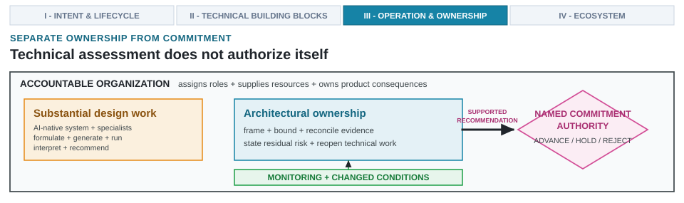

---
format:
  html:
    output-file: index.html
---

# What the Architect Owns {#sec-what-architect-owns}

{fig-alt="Substantial AI-native design work and architectural ownership remain distinct from a named commitment authority inside an accountable organization."}

::: {.epigraph}
> *"The second irony is that the designer who tries to eliminate the operator still leaves the operator to do the tasks which the designer cannot think how to automate."*
>
> — Lisanne Bainbridge, *Ironies of Automation* (1983) [@Bainbridge1983Ironies, p. 775]
:::

::: {.column-margin}
**Author's Note.** Lisanne Bainbridge, an industrial psychologist who studied automated plant operations, observed that automation does not eliminate human operators; it leaves them with critical edge cases while decaying the skills disuse erodes. As AI agents handle RTL generation and simulation sweeps, our role as architects shifts from routine execution to cross-layer failure diagnosis, screening NRE capital risk, and named tapeout commitment.
:::

::: {.callout-crux}
If a capable AI-native design system can formulate studies, generate artifacts, search design spaces, run tools, interpret failures, and recommend a design, what core technical work do architects still contribute?
:::

Grant the strongest case for automation: an AI-native design system shoulders substantial workloads, coordinating closed-loop execution (@sec-running-the-loop), transferring learned patterns across the stack (@sec-loop-patterns-across-stack), and clearing rigorous full-system evaluations (@sec-evaluating-agentic-architect). A capable system can execute everything from initial study formulation through final technical recommendation, driving verification tools and managing failure-driven revisions across broad design spaces. Nothing in this argument relies on reserving a protected enclave of tasks that only human architects can perform.

Architectural ownership does not reside in residual tasks that automation fails to absorb. The essential difficulty of engineering lies in specifying the system rather than merely representing it [@Brooks1986NoSilverBullet]. Technical contribution rests on cross-layer architectural ownership: taking ultimate responsibility to frame system problems across the eight requirement domains (@sec-intent-vs-spec), establish abstraction boundaries, synthesize cross-domain tradeoffs across CPU, NPU, memory, and packaging layers, and declare residual risk rather than delegating technical accountability to automated tools or isolated domain specialists.

Architects select abstractions and delineate system boundaries connecting host RV64GCV vector-capable CPU cores, dedicated NPU tensor accelerators, compiler passes (Triton, LLVM, MLIR), SRAM/LPDDR5 memory hierarchies, AMBA AXI5 interconnects, and 2.5D UCIe packaging links under a 3\ W TDP target in TSMC N7 / 3\ nm-class LP mobile process nodes.

System design requires synthesizing these diverse components into a cohesive, feasible architecture: interpreting conflicting results, identifying missing evidence, and declaring remaining uncertainties.

Because organizational assignments vary across projects, four distinct pillars of engineering work must remain clear:
1. **Automated tools and domain specialists:** generate and qualify results within focused disciplines, owning localized verification signoffs.
2. **Architects:** integrate isolated results into a unified system design, frame cross-layer trade-offs, and declare residual risk.
3. **Commitment authority:** decides whether proposed designs advance to subsequent project phases.
4. **Accountable organization:** provisions resources for these roles and owns real-world product consequences.

The primary architectural deliverable is a supported recommendation explicitly defining the design under consideration, documenting validating evidence, exposing lingering risks, and establishing triggers that mandate review (@fig-architecture-synthesis-commitment).

{#fig-architecture-synthesis-commitment width="100%" fig-alt="An accountable organization surrounds three distinct roles. Domain specialists qualify scoped results, checks, artifacts, and failures. We, the architects, frame the problem, choose our abstractions and system boundaries, connect layers, interpret disagreements, state residual risk, and retain access to decisive artifacts and failures. Our supported technical recommendation then reaches a separate commitment authority that advances, holds, or rejects the design. Continuous monitoring and changed conditions return to us as architects and may reopen specialist work."}

This operational separation ensures raw specialist data is synthesized before executive commitment, preventing commitment authorities from approving tapeout decisions by mere implication. The relationship is bidirectional: architects push reframed questions and stress tests back to specialists, while operational telemetry and shifting deployment conditions can trigger reopening technical work.

NASA's systems engineering guidance provides a precedent for this structural separation, producing analytical comparisons and formal recommendations for a distinct decision-making authority [@NASA2017SystemsEngineeringHandbook, sec. 6.8].

Individual IP blocks can succeed in isolation yet fail when integrated: a CPU core clearing timing closure, an NPU accelerator meeting TFLOPS/W targets, an LPDDR5 controller validating read/write queues, and a UCIe PHY achieving clean eye diagrams do not guarantee a functioning product unless they satisfy a globally consistent set of workload, software, interface, memory, power, packaging, thermal, and business assumptions. Structured architectural judgments (@sec-framing-architecture-problem) forge isolated specialist results into a cohesive recommendation.

::: {.callout-learning-objectives}
This chapter establishes the following learning objectives:

- **Frame** coherent architecture problems and choose the abstractions, boundaries, and checks each design decision requires across the three operational layers.
- **Integrate** cross-disciplinary specialist results across CPU cores, NPUs, memory, and packaging into a unified system design.
- **Interpret** conflicting specialist results into a bounded recommendation or an unresolved status, distinct from program claims and commitment decisions.
- **Match** the evidence a decision requires to its irreversibility, and state residual risk and containment before a tapeout commitment.
- **Bound** what design work may be delegated, and sustain the diagnostic contact and reopening triggers that keep ownership active under in-order commitment authority.
:::

## Delegating Without Losing Technical Contact {#sec-delegating-without-losing-contact}

Delegating exploration to automated search loops accelerates design space coverage but risks forfeiting technical grasp. In Architecture 1.0, engineers manually constructed microarchitectural blocks, wrote RTL, and sequentially invoked point electronic design automation (EDA) tools. Architecture 2.0 shifts this workflow by delegating routine microarchitectural synthesis, floorplanning, and verification to autonomous search loops and generative agents.

The three operational layers of AI in architecture (@fig-ch01-three-layers-ai-integration) assign fundamentally different responsibilities to human architects:

- **Layer 1 (AI-Assisted Engineering):** The human engineer is the manual execution operator, prompting models for single-task drafting and reviewing generated RTL or testbenches line-by-line. Ownership is tactical and immediate.
- **Layer 2 (AI-Driven Subsystem Optimization):** The human architect freezes the bounding box (specifying container constraints, objective functions, and termination rules for autonomous local search, such as macro floorplanning or kernel autotuning), accepting the local result if signoff checks pass.
- **Layer 3 (AI-Native System Design):** The human architect exercises In-Order Commitment Authority over the entire cross-boundary design system. The system autonomously coordinates multi-tool exploration and verification across the vertical stack, but the human architect defines the system problem, selects abstractions, resolves cross-layer discrepancies, declares residual risk, and owns irreversible tapeout decisions.

Delegating tasks without forfeiting ownership requires satisfying four boundary conditions:

1. **Observability:** candidate state remains directly inspectable.
2. **Reversibility:** proposed changes can be rolled back cleanly.
3. **Independent checks:** bad results are caught by independent verification rather than self-evaluation.
4. **Bounded consequences:** cross-layer interactions are explicitly delimited.

A bounded array mapping sweep or focused tool run satisfies these criteria, enabling execution delegation while retaining oversight.

Freezing a software-facing interface or die-to-die interconnect presents higher irreversibility. Freezing an instruction set architecture (ISA) contract between the host CPU and NPU or fixing the PHY lane count on a 2.5D UCIe chiplet link hardens assumptions across compiler runtimes, memory hierarchies, RTL, physical floorplans, thermals, and product integration. In such cases, evidence gathered across coupled layers must be reconciled before the commitment authority authorizes the transition. The evidence bar rises with irreversibility: teams must remain competent to challenge underlying assumptions and trace failures beyond delegated boundaries.

These judgments maintain engineering coherence as work flows between people and tools. Architects formulate system questions, select representations that make critical constraints visible, specify methods and evaluation environments, mandate independent checks, and integrate cross-layer results to establish what combined engineering evidence supports.

Historical shifts in abstraction [@DeMicheli1994SynthesisOptimization; @Izraelevitz2017Chisel] succeeded because engineers preserved technical contact through diagnostic capabilities. Architects must retain the capacity to challenge formulations, inspect decisive artifacts and failures, trace results across complex interfaces, and recognize when models or checks are pushed outside their valid support.

Human factors research distinguishes *misuse* (inappropriate reliance on automation) from *disuse* (neglecting automation capabilities entirely) [@ParasuramanRiley1997HumansAutomation]. Direct technical contact must survive task delegation without dictating which specific decisions human architects or automated systems control.

As routine local exploration is automated, the architect's role shifts upstream toward formulating problems and abstractions, laterally toward defining interfaces and checks, and downstream toward interpreting uncertainty and formulating recommendations. Hands-on contact with artifacts, tools, and failure modes must persist to intervene when abstractions break or empirical evidence fails to support design decisions.

Delegating routine RTL drafting and simulation sweeps to automated tools creates a related organizational challenge: *The Junior Architect Apprenticeship Crisis*. In classical engineering organizations, junior engineers developed microarchitectural intuition, the hard-won tacit knowledge of where timing paths fail, how cache coherence deadlocks arise, and why power delivery networks oscillate, by manually writing Verilog, debugging waveforms, and fixing synthesis timing violations. If automated agents handle all routine implementation, junior engineers risk losing the diagnostic exposure required to become senior commitment authorities.

Engineering organizations resolve this pedagogical gap through two structural practices:

1. **Pedagogical Shadow Verification:** Junior architects are tasked with shadowing automated exploration runs, independently formulating hypotheses about observed bottlenecks, and auditing agent-generated RTL and SDC constraints before results reach senior review panels.
2. **Synthetic Defect Injection and Diagnostic Slicing:** Training programs systematically inject subtle, synthetic microarchitectural defects (such as clock-domain crossing metastability races, unhandled FSM reset states, or subtle memory consistency violations) into candidate designs. Junior engineers must diagnose and isolate these injected flaws using formal tools and waveform slicers, building deep diagnostic competence without risking production silicon capital.

::: {.callout-design-principle title="Architecture judgment does not begin where automation ends"}
**The principle:** While automation may handle local formulation, exploration, implementation, and analysis, architectural judgment dictates the problem, the abstraction, and the system boundaries.

**The application:** Every design review must identify the ultimate decision maker and trace exactly how isolated results unite to form one feasible system.
:::

## Framing Cross-Layer Problems {#sec-framing-architecture-problem}

Before search algorithms evaluate candidates or optimizers tune blocks, architects must define the system boundary, identify governing cross-layer interactions, and determine which physical consequences studies must expose. Defining mechanisms, interfaces, and fallback strategies frames the design space itself [@PattersonDitzel1980RISC].

Beyond defining the system, architects design the workflows driving decisions: selecting methods to propose changes, modeling tools to measure properties, validation checks to screen candidates, and protocols to resolve disagreements.

Consider the initial Lighthouse prompt: "Design a low-power, 64-bit RISC-V-based compute subsystem for a real-time mobile XR workload." This directive leaves representative workloads, software stacks, product boundaries, alternative design points, operating conditions, tradeoffs, and decision criteria unspecified. Framing this ambition across the eight requirement domains (@sec-intent-vs-spec) anchors the design space:

1. **Workload:** real-time spatial tracking and neural rendering (XRBench), CPU application benchmarks (SPEC CPU2017), and mobile inference (MLPerf).
2. **ISA & ABI contract:** RV64GCV 64-bit application processor core with 128-bit vector extensions adhering to standard ABI conventions.
3. **Compute organization:** heterogeneous SoC uniting the RV64GCV vector CPU core with a dedicated NPU tensor accelerator engine.
4. **Memory & data movement:** multi-level cache hierarchy (32\ KB L1, 512\ KB L2, 4\ MB L3) and TCM scratchpads linked via AMBA AXI5 and UCIe chiplet interconnects.
5. **Power envelope:** 3\ W sustained TDP target in a passive optical frame form factor.
6. **Compiler and runtime stack:** Triton kernel fusion, LLVM vector code generation, and MLIR lowering passes.
7. **Physical constraints:** TSMC N7 / 3\ nm-class LP mobile process node floorplanning, wire delays, DRCs, and routing congestion.
8. **Reliability & verification:** SystemVerilog Assertions (SVA) evaluated via Bounded Model Checking (BMC), formal equivalence checking, static timing signoff (STA), IP indemnification legal audits, and NRE capital allocation review.

Framing across these eight layers dictates what design systems must contain. Studying array utilization requires cycle-level modeling and mapping search; freezing that array alongside its software interface and UCIe packaging link requires instruments capturing Triton/LLVM/MLIR lowering, memory traffic, UCIe PHY latency, physical timing, total 3\ W subsystem power, IP indemnification, and modification consequences. The architecture question drives the required abstractions.

Eight recurring judgments transform isolated results into a cohesive recommendation (@tbl-architect-technical-judgments).

| **Judgment** | **Architectural question** | **Lighthouse consequence** |
| --- | --- | --- |
| **Problem choice and reframing** | Is the stated problem still the one the product needs solved? | Deciding whether the goal is maximizing raw NPU GEMM utilization or satisfying the strict 120\ FPS mobile XR latency budget within a 3\ W TDP envelope. |
| **Abstraction** | Which details can be simplified for this decision? | A cycle-level NPU model can compare matrix mappings locally, but it cannot hide Triton/LLVM/MLIR compiler lowering, SRAM/LPDDR5 memory traffic, UCIe interconnect energy, physical timing, or the 3\ W subsystem boundary from a freeze decision. |
| **System boundary** | Where do workload, software, hardware, package, physical design, and product effects meet? | Deciding whether NPU array sizing can be analyzed in isolation, or must encompass host RV64GCV task dispatch, UCIe chiplet routing, DRAM bandwidth contention, and packaging thermal limits. |
| **Architecture synthesis** | Do chosen mechanisms, interfaces, software paths, and implementation choices form one feasible system? | Confirming that the NPU matrix engine, RV64GCV CPU contract, compiler lowering pipeline, LPDDR5 memory subsystem, and firmware fallback paths form a coherent, manufacturable subsystem. |
| **Missing constraints** | What has the formulation, representation, or tool path left out? | Uncovering omitted physical and legal factors: transient PDN voltage droop ($di/dt$), 3\ W thermal dissipation limits, UCIe signal integrity, IP indemnification, and hardware chicken-bit fallbacks. |
| **Cross-layer tradeoff** | Which feasible point best serves the product when objectives conflict? | Resolving the tension between host RV64GCV vector tail latency, NPU matrix throughput, LPDDR5 memory power, UCIe die-to-die routing congestion, and manual review burden. |
| **Mechanism and consequence** | Does the proposed explanation fit the observations, and what happens if it is wrong? | Evaluating whether an apparent speedup is driven by architectural dataflow or an unmodeled memory wait state, where an erroneous tapeout freeze risks multi-million-dollar silicon mask re-spins. |
| **Commitment under uncertainty** | Are remaining risks understood, containable, and worth accepting? | Refusing to authorize physical tapeout when static timing closure, formal property bounds, IP indemnification, and power delivery margins remain uncharacterized. |
: **Architecture judgment gives technical work its system meaning.** Architects choose the question, abstraction, boundary, and consequence before the commitment authority decides whether the design advances. {#tbl-architect-technical-judgments}

Feasibility claims rest on problem choice, abstractions, and system boundaries. Architecture synthesis exposes missing constraints and cross-layer tradeoffs that isolated specialist results cannot resolve. Explanations of underlying mechanisms, coupled with bounded remaining risks, determine whether a recommendation warrants commitment.

## Selecting System Abstractions and Bounds {#sec-selecting-abstractions-constraints}

Every architectural model is defined as much by what it omits as by what it represents. Selecting an architectural abstraction decides which physical details govern the current decision and which can be safely set aside.

The same chip candidate can be modeled as an Abstract Syntax Tree (AST), a Control-Data Flow Graph (CDFG), or an MLIR pass. It can appear as a host CPU instruction stream in gem5, an NPU tensor dataflow in SCALE-Sim, or a memory trace in Ramulator. Further down the stack, it becomes synthesizable RTL in Verilator, gate-level netlists in Yosys governed by Unified Power Format (UPF) rules, a 2.5D UCIe chiplet layout in OpenROAD, or a thermal dissipation map. None of these views constitutes the complete architecture on its own. Because every representation illuminates specific cross-layer relationships while obscuring others, architects must select models whose omissions do not silently invalidate the design action under review.

::: {.column-margin}
**Architecture description standards.** ISO/IEC/IEEE 42010 distinguishes an entity architecture from an architecture description that expresses it. The standard specifies requirements for architecture viewpoints and model kinds, but it does not prescribe our chapter organization, our specific design process, or our assignment of authority [@ISOIECIEEE2022ArchitectureDescription].
:::

Abstraction choice dictates which components contribute to a design decision. Architects must determine what architectural state each predictor, generator, optimizer, or tool is allowed to modify and which observations constrain those changes. Aggregating components does not guarantee an effective system: if internal simplifications obscure blocking properties (such as power delivery network voltage drops or die-to-die thermal coupling), results become untrustworthy despite local optimizations.

AlphaChip illustrates this contrast in semiconductor macro placement [@MirhoseiniEtAl2021GraphPlacement]. An automated macro-placement tool can optimize an NPU accelerator layout locally, but it cannot evaluate whether that placement causes power delivery network (PDN) IR-drop spikes that starve the host CPU or overload the UCIe chiplet thermal dissipator. Architects define block boundaries, curate macro sets, establish timing and power constraints across host CPU and NPU cores, determine comparison baselines, and execute physical signoff checks.

Architects also structure how components interact: deciding what state crosses interfaces, which downstream components hold revision authority, which independent checks can halt progress, and whether distinct verification steps share flawed assumptions.

Consequential constraints often originate as tacit knowledge: practical insights architects rely on that are not fully formalized [@Polanyi1966TacitDimension, p. 4]. For instance, compiler specialists may know a proposed matrix instruction lacks an efficient lowering path, or physical design leads may recognize placement heuristics unsafe for CPU-NPU power-grid geometries.

AI tools can assist in locating, comparing, and organizing scattered expert judgments for formal review. Consequential constraints and assumptions require checks commensurate with their risk and scope, delegated to automated checkers, conventional EDA tools, domain specialists, or peer reviewers. If accepted, constraints must record their source, scope, affected interfaces, known conflicts, and reopening triggers.

A physical designer's rule against placing two high-current macros on the same power stripe provides qualifying geometry and operating thresholds; architects decide how to enforce it and evaluate routing overhead. Shifting to a new power-grid template or 3D stacked die invalidates the basis of the rule, triggering formal review rather than leaving obsolete constraints in force.

Unrecorded constraints risk being optimized away, while overgeneralized constraints reject valid designs. Navigating this trade-off allows composing individual components, evaluation tools, and specialist judgments into a cohesive architectural system.

## Governing System Integration {#sec-orchestrating-system-integration}

A design candidate transitions from a collection of isolated optimizations into a viable architecture only when its mechanisms and interfaces hold together under the physical and logical realities of the full system stack. Automated tools and domain specialists deliver local optimizations within respective domains, but localized tools cannot evaluate how aggressive NPU array layouts impact host CPU cache coherence, memory channel contention, or UCIe chiplet thermal dissipation. The architect's task is composing specialized results into a unified system decision, exposing unexamined cross-layer interactions across domain boundaries.

Consider a hypothetical revision of the Lighthouse XR SoC: gem5 and SCALE-Sim trace analyses support the target frame rate, MLIR compiler searches yield legal NPU tiling, Verilator RTL simulations pass, Ramulator memory models satisfy local bandwidth checks, OpenSTA closes timing, and UPF checks validate power-gating boundaries. Although each check passes in isolation, combining results exposes vulnerabilities: NPU tiling increases burst memory traffic, pushing SRAM, UCIe interconnect, and memory links beyond the 3\ W thermal envelope, while a critical tail-latency path lacks software fallback.

Synthesizing a working solution requires coordinated adjustments across multiple layers: assigning tail-latency handling to the host CPU core, narrowing NPU DMA interfaces, reconfiguring memory buffers and scheduling, and injecting firmware fallback paths. If post-silicon validation reveals DMA race conditions, microcode chicken-bits (programmable control register overrides that disable problematic speculative paths) quarantine the bug without forcing an immediate respin. Iterating on mechanisms, interfaces, and partitioning unites specialized results into a feasible product.

Architects thread these outputs together, from high-level XR workloads down through tensor tiling, interconnect traffic, memory buffering, thermal envelopes, and software fallback mechanisms. This synthesis produces an actionable recommendation bounded by an explicit scope, detailing supporting and conflicting results alongside known limits. Domain-level checks qualify what recommendations support; they do not authorize product commitment.

## Resolving Cross-Layer Discrepancies {#sec-resolving-discrepancies}

Architectural judgment is tested when qualified specialist checks contradict one another. A cycle-level simulator may report performance gains for a new NPU array mapping while physical signoff tools report power-grid voltage drops under host CPU vector loads. When domain results conflict, metrics cannot be averaged or selected based on schedule pressure. Advancing the design requires explaining the underlying physical mechanism driving the conflict, re-examining abstractions, requesting discriminating experiments, or keeping transitions blocked until discrepancies resolve.

Discrepancies cannot be resolved by vote:
1. **Contract and condition alignment:** Domain specialists determine whether conflicting checks encode identical contracts and conditions. If they do, a blocking failure remains a failure.
2. **Abstraction correction:** If checks evaluate mismatched contracts, the architectural abstraction or interface definition must be corrected and affected paths rerun.
3. **Escalation under unresolved scope:** When experts cannot reconcile scopes, the transition remains blocked and the unresolved system contract is escalated.

Consider a coherence verifier using SystemVerilog Assertions (SVA) evaluated via Bounded Model Checking (BMC) returning a counterexample against a declared blocking property between host CPU caches and NPU DMA stores up to bound $k = 50$ cycles, while a high-level software model treats execution as legal under high-contention LPDDR5 traffic. The property cannot be weakened, the failing workload discarded, or the counterexample recast as passing. The technical question is whether formal properties and software models encode identical product contracts. If they do, the candidate fails; if not, the architecture contract must be corrected and both paths rerun.

When feasible candidates exhibit overlapping estimates for tail latency and subsystem power, architects identify whether workload sampling, model error, or untested operating corners could reverse the choice. The appropriate response is requesting the least costly higher-fidelity observation capable of discriminating between them (matched cycle-level trace runs in gem5, physical thermal simulations, OpenSTA static timing runs, or implementation-facing power-grid analyses). If available observations cannot resolve overlap within budget, recommendations remain narrow and choices reversible.

## Separating Evidence from Commitments {#sec-linking-results-claims-commitments}

A validated simulation report or benchmark comparison does not constitute a decision to tape out silicon. Technical synthesis yields a supported architectural recommendation, distinct from organizational commitment to manufacture hardware. Recommendations present preferred candidates alongside evaluated alternatives, document boundary conditions and signoff checks, and explicitly expose residual uncertainties. Domain specialists retain sole ownership over their domain signoffs in timing closure, power integrity, physical implementation, and reliability.

The two independent tests from @sec-moonshot remain distinct:
1. **Evidence test (program claim):** Did the complete approach improve the architecture result or reduce total cost to reach a comparable result? (Classified as *supported*, *unsupported*, or *unresolved*.)
2. **Decision test (architecture commitment):** Does the named commitment authority, weighing tradeoffs, result limits, and residual risk, decide that the work justifies commitment?

Generating qualified results, formulating system recommendations, and executing authorized decisions are distinct architectural actions that cannot substitute for one another. Program claim status and hardware commitment decouple accordingly (@tbl-two-closing-decisions).

| **Program claim status** | **What it means for architecture commitment** |
| --- | --- |
| **Supported** | Repeated matched comparisons across declared tasks and conditions clear the decision boundary. The organization may still reject the hardware architecture if physical thermals, supporting evidence, organizational capacity, or residual risks remain unacceptable. |
| **Unsupported** | Matched comparisons demonstrate the claimed workflow advantage fails to clear core decision criteria. The organization may still commit to a structurally sound architecture if supported by conventional engineering evidence. |
| **Unresolved** | Comparisons are missing, incomplete, or underpowered, blocking adoption claims. The organization proceeds with hardware commitment only when backed by independent, high-fidelity design checks. |
: **Program claim status and architecture commitment remain independent.** A favorable result on one cannot substitute for a favorable result on the other in architectural methodologies. {#tbl-two-closing-decisions}

## Governing Tapeout Commitments {#sec-governing-tapeout-commitments}

As designs advance from high-level exploration to physical silicon, commitments steadily narrow reversibility. Committing freezes interfaces, bus contracts, and floorplans. Early in design cycles, modifying ISA extensions or buffer layouts requires editing software models or RTL. In contrast, modifying package substrate routing and reticle masks after freeze costs millions of dollars and months of delay. As reversibility decreases, the required standard of empirical evidence rises proportionally.

::: {.callout-war-story title="Declining to commit is a decision, and it is made by someone"}
**The claim.** Intel's Larrabee described a many-core x86 architecture for visual computing, with wide vector units, coherent caches, and a software renderer in place of most fixed-function graphics hardware [@SeilerEtAl2008Larrabee]. The design was published, the silicon existed, and the architectural argument was serious.

**The gap.** The performance the product needed against shipping discrete graphics parts did not arrive on the schedule the market required. Intel withdrew the consumer graphics product while continuing the line as a throughput-computing part, which is a different commitment supported by different evidence.

**The lesson.** No result forced that outcome and no metric selected it. People with the authority to spend the next increment of capital read what the evidence supported, decided it did not support the product they had planned, and said so. An architecture program that cannot produce that decision, and cannot name who owns it, has no way to stop.
:::

Commitment records define which design advances, which alternatives were rejected, which conditions evidence covered, what uncertainty remains, and what triggers would invalidate the choice.

Engineering authority divides into three distinct decision tiers (@tbl-lighthouse-action-rights).

| **Decision** | **Technical question** | **Boundary** |
| --- | --- | --- |
| **Execute design work** | What candidate state may this person, model, or tool change, and when must it stop? | Work stays within the declared design space, interfaces, budget, and evaluator boundary. |
| **Establish what a result supports** | What does this check show about this artifact under these conditions and assumptions? | Domain specialists own result validity and domain scope. The architect determines how that result applies to the system decision. |
| **Commit the architecture** | Does the integrated design justify the next consequential transition (e.g., tapeout freeze)? | The architecture decision composes alternatives, cross-layer results, specialist concurrences, uncertainty, and residual risk. |
: **Execution, support, and commitment remain distinctly separate technical decisions.** Separating these decision tiers prevents a successful tool run or a favorable local result from silently authorizing a system architecture. {#tbl-lighthouse-action-rights}

Classic human-automation frameworks separate information acquisition, analysis, decision selection, and action implementation [@ParasuramanEtAl2000LevelsAutomation], reinforcing the necessity of decoupling execution, support, and commitment.

Completed check records remain immutable: subsequent judgments cannot rewrite past results. If conditions shift, earlier results may become inapplicable, requiring new evidence rather than altering historical logs.

### Intellectual Property Provenance and Legal Indemnification

Before committing capital to silicon fabrication, the commitment authority must satisfy legal and IP indemnification standards. Generative AI models trained on public open-source code repositories risk regurgitating copyleft-licensed (e.g., GPL-3.0) RTL modules or patented microarchitectural circuits into commercial SoC designs.

To establish defensible IP provenance, the AI-native design system maintains a clean-room verification trail:

- **Cryptographic Prompt and Lineage Logs:** Every prompt, tool execution transcript, and intermediate AST representation is timestamped and cryptographically signed (`sha256`), proving that candidate RTL originated from declared system intent rather than unrecorded copy-paste ingestion.
- **Code Similarity and License Scanners:** Synthesized RTL blocks pass through automated code similarity engines (such as Black Duck or FOSSID) to screen for verbatim overlap with public copyrighted repositories before entering the tapeout codebase.
- **Foundry NDA Air-Gap Compliance:** Verification audits confirm that proprietary foundry PDK rules, cell libraries, and internal interconnect protocols were processed strictly within secure on-premise compute enclaves and never transmitted to external cloud LLM providers.

### Managing Residual Risk with Hardware Chicken-Bits

Committing under uncertainty requires understanding failure modes well enough to accept, mitigate, or block them. Residual risk is an inherent technical property of a decision, not an administrative label. Usable residual risk statements specify five core elements:

1. **Failure mode:** explicit physical mechanism (such as dynamic IR-drop power collapse during bursty tensor execution, asynchronous CDC metastability races, or uncharacterized setup timing waivers).
2. **Consequence:** impact on performance, power, thermals, data integrity, or safety.
3. **Remaining uncertainty:** quantified bounds on unknown factors.
4. **Detecting check:** empirical test, telemetry signal, or monitor assigned to observe the mode.
5. **Containment action:** verified fallback path, throttling mechanism, or hardware chicken-bit.

In hardware design, containment operates across two distinct timescales: permanent hardware e-fuses (blown during wafer sort or packaging to permanently disable unverified IP blocks or isolate defective array columns) and firmware-managed *chicken-bits* (software-writable control registers that allow boot firmware to bypass speculative microarchitectural optimizations or insert cycle wait-states upon detecting transient voltage droop post-silicon). If unexpected transient voltage droop occurs in the NPU tensor engine after tapeout, firmware can trigger a chicken-bit to throttle peak issue width, preventing catastrophic system crash and avoiding an unbudgeted multi-million-dollar silicon mask re-spin.

Missing reliable checks, operating restrictions, or containment paths mandates blocking design transitions.

Consider an uncharacterized vector turbo mode on an NPU. Retaining unverified circuitry does not justify production enablement. Crafting a defensible exception requires: a verified disabled state, an enable path restricted to authorized lab modes, verified reset and fault handling, proof that disabled circuitry does not violate baseline requirements, a named owner, and a firm expiration tied to post-silicon characterization.

Unchecked exceptions risk normalizing deviance [@Vaughan1996Challenger]. Enforcing expiration and reopening triggers prevents temporary workarounds from becoming unexamined permanent baselines. Containment mechanisms (hardware feature-disable fuses, firmware fallbacks, thermal derating modes, redundant UCIe lanes, memory isolation boundaries) must be verified: if no credible containment lever exists, the tapeout commitment must be refused.

Disable mechanisms are not universal insurance policies. The commitment review must verify the disabled state, isolate the failure from required behavior, and confirm that the control path remains available even under the active fault being contained. While errata and later silicon steppings provide channels for describing and repairing post-silicon defects, not every erratum has a workaround, and not every subsequent stepping fixes the underlying defect.

Advancing a candidate architecture from software simulation to physical silicon commits non-recurring engineering (NRE) capital. Evaluating whether PPA gains justify fixed capital before tapeout is a core commitment responsibility (@fig-nre-mask-cost-productivity).

```{python}
#| label: fig-nre-mask-cost-productivity
#| fig-cap: |
#|   **Front-end design effort versus fixed mask costs across process nodes.** Both curves contrast the shape of two cost classes across process nodes; neither reports measured program costs. Sourced design-cost anchors appear in @sec-design-loop-no-longer-scales. Front-end effort is the cost methodology can compress; the reticle mask set is a fixed charge that falls due at tapeout regardless of synthesis methodology.
#| out-width: "100%"
#| fig-alt: "Line chart on one shared log axis plotting front-end engineering design labor cost and reticle mask set charge across process nodes from 90nm to 2nm. Both constructed curves rise with node advance, and the mask charge climbs faster, closing the gap with front-end cost so the fixed charge becomes most of what a tapeout commitment risks."

import matplotlib.pyplot as plt
from _python.plots import COLORS, apply_style
import numpy as np

apply_style()

# Constructed illustrative parameters: both curves contrast the divergence in shape
# between a front-end cost methodology can compress and a fixed mask cost it cannot.
# Sourced design-cost anchors appear in @sec-design-loop-no-longer-scales.
nodes = ["90nm", "45nm", "28nm", "16nm", "7nm", "3nm", "2nm"]
x = np.arange(len(nodes))

mask_cost_m = np.array([1.5, 4.2, 12.5, 28.0, 65.0, 120.0, 180.0])
conv_design_cost_m = np.array([8.0, 16.0, 32.0, 55.0, 95.0, 150.0, 210.0])

fig, ax1 = plt.subplots(figsize=(6.4, 3.8))
fig.subplots_adjust(left=0.13, right=0.96, top=0.88, bottom=0.20)

ax1.set_yscale("log")
l1 = ax1.plot(
    x,
    conv_design_cost_m,
    color=COLORS["blue"],
    linewidth=2.0,
    marker="o",
    markersize=5,
    label="Front-end design effort (methodology can move this)",
    zorder=3,
)
l3 = ax1.plot(
    x,
    mask_cost_m,
    color=COLORS["red"],
    linewidth=2.2,
    marker="^",
    markersize=5.5,
    label="Reticle mask set charge (methodology cannot)",
    zorder=4,
)

ax1.set_xlabel("Semiconductor Process Technology Node", fontsize=6.8, labelpad=6)
ax1.set_ylabel("Cost per project ($M, log scale)", fontsize=6.8, color=COLORS["ink"])
ax1.set_xticks(x)
ax1.set_xticklabels(nodes, fontsize=6.2)
ax1.set_ylim(1.0, 400)
ax1.tick_params(axis="both", labelsize=6.0, length=2.5, width=0.6, pad=2)
ax1.grid(True, color=COLORS["grid"], linewidth=0.55, zorder=0)

ax1.annotate(
    "Mask charge closes the gap:\nthe fixed cost becomes\nmost of what tapeout risks",
    xy=(6.0, 180.0),
    xytext=(1.9, 150.0),
    arrowprops=dict(arrowstyle="->", color=COLORS["constraints_ink"], lw=0.9),
    fontsize=6.2,
    fontweight="bold",
    color=COLORS["constraints_ink"],
    va="center",
)

lines = l1 + l3
labels = [l.get_label() for l in lines]
ax1.legend(lines, labels, frameon=False, fontsize=5.8, loc="upper left")

for spine in ["top"]:
    ax1.spines[spine].set_visible(False)
ax1.spines["left"].set_color(COLORS["ink"])
ax1.spines["bottom"].set_color(COLORS["ink"])

plt.show()
plt.close(fig)
```

The engineering consequence is a capital governance obligation that automation cannot relieve. Even if automated workflows compress front-end engineering effort, the fixed reticle mask charge falls due unchanged at tapeout. Cheaper candidate generation raises rather than lowers the evidentiary bar before authorizing a tapeout freeze for an RV64GCV host core and NPU accelerator.

::: {.callout-lighthouse title="The Lighthouse commitment remains open"}
**Context.** Deciding whether to freeze an L2 cache capacity or a 32 by 32 NPU array layout for a mobile XR subsystem is a binding architectural commitment.

**Status.** The prospective cache study halted before dispatch, and the executed array study evaluated only isolated GEMM cycles. Neither record provides the physical signoff, power modeling, or system-level checks required to authorize silicon implementation. Consequently, the technical recommendation is to leave the freeze and tapeout commitment undecided pending qualified checks across all eight requirement domains (@sec-intent-vs-spec).
:::

A tapeout plan for the Lighthouse implementation requires five classes of specialist evidence:
1. **Physical verification:** DRC and LVS results against selected foundry decks, recording deck identities, approved waivers, and unresolved violations.
2. **Timing qualification:** setup and hold analysis across declared PVT corners, extraction modes, and variation models.
3. **Power-integrity and reliability qualification:** dynamic and static voltage-drop (IR drop), electromigration, and reliability checks under declared activity and package assumptions.
4. **Logic and implementation correspondence:** formal equivalence checking stating compared representations, assumptions, and out-of-proof transformations.
5. **Manufacturing test qualification:** DFT and ATPG coverage metrics against manufacturing-test targets, identifying fault models and residual coverage gaps.

Passing technical checks does not create legal protection, and neither technical nor legal review grants commitment authority by itself. Missing required evidence blocks the recommendation to advance; the named commitment authority decides whether an eligible design proceeds.

## Sustaining Ownership and Responsibility {#sec-sustaining-responsibility}

Architectural ownership is an active capability to interrogate and reopen design decisions throughout the system lifecycle. Sustaining control requires preserving access to candidates, boundary constraints, rejected alternatives, simulation traces, and signoff reports spanning compute, interconnect, memory, and packaging subsystems.

The irony of automation warns that automating routine verification can erode the diagnostic practice required to evaluate anomalies [@Bainbridge1983Ironies]. In aviation, autopilot systems can degrade baseline manual piloting skills; naming reviewers who lack access to decisive artifacts or halting authority creates an analogous moral crumple zone [@Elish2019MoralCrumpleZones]. Automation bias further increases the risk of accepting flawed synthesis advice or overlooking layout flaws [@SkitkaEtAl1999AutomationBias].

Sustaining challenge capacity requires concrete exercises: reproducing selective checks, inspecting failed candidates, diagnosing seeded logic/timing faults in CPU/NPU blocks, and requiring independent human diagnosis before viewing tool recommendations.

Opaque external dependencies (black-box IP blocks, foundry PDKs, commercial EDA engines) do not absolve engineering responsibility. Tapeout commitments must record IP versions, interface invariants, independent cross-checks, and difficult-to-diagnose failure modes. A vendor certificate establishes provenance but never substitutes for an independent technical check.

Transferring architectural responsibility requires handing off the underlying technical basis:
1. **Candidate release identity and boundary:** stated design question, system boundaries, and baseline assumptions.
2. **Decisive results spectrum:** passed, failed, inconclusive, and missing results across CPU, NPU, memory, and packaging layers.
3. **Uncertainty and containment:** bounded remaining uncertainties and validated fallback paths.
4. **Invalidation conditions:** explicit shifts in workloads, software stacks, EDA versions, manufacturing processes, or interfaces that mandate reconsideration.

Transferred technical foundations dictate continuous monitoring priorities: tracking CPU queue tail latencies, UCIe retry rates, LPDDR5 ECC error counts, NPU thermal throttling, and reset signatures. Telemetry signals matter when tied directly to boundary conditions capable of overturning architecture choices.

## Sustaining Architecture Alignment Under Continuous Engineering Churn {#sec-sustaining-alignment-churn}

Maintaining architectural integrity across continuous engineering churn is a central responsibility of the lead architect in industrial organizations. When distributed teams push daily commits to RTL repositories, device drivers, compiler backends, and firmware stacks, an architectural recommendation formulated against last month's repository snapshot can quietly become invalid. Sustaining ownership under high-velocity churn requires active governance rather than periodic, ceremonial signoff.

To prevent moving-target invalidation, the architect establishes continuous differential validation within production integration pipelines. Automated exploration agents are required to re-validate generated proposals against daily integration branches through continuous equivalence and timing checks, catching interface regressions before recommendations reach commitment review. When delegating sub-block optimization to autonomous tools, the architect specifies strict locality-of-modification contracts. These boundary invariants restrict the tool from altering external bus protocols, clock-domain crossings, or register-map addresses, ensuring that changes remain locally verifiable and cleanly mergeable with daily developer commits.

Finally, the lead architect treats run-to-run dispersion as an early indicator of microarchitectural fragility. If an agent-driven tuning pass produces high-performing RTL on one seed but fails timing closure or routability on another, the candidate represents a physically brittle design rather than a robust microarchitecture. Tracking dispersion across continuous integration runs ensures that only candidate designs with demonstrated stability across the parameter distribution receive authorization to advance toward tapeout.

Observed failures force reopening commitments. Silicon breakdowns prove failure occurred under observed conditions without revealing root causes. The Pentium FDIV bug [@Edelman1997PentiumDivision] illustrates that escaped silicon flaws invalidate release confidence, requiring renewed architecture work, containment strategies, and product recall or replacement decisions.

## Common Pitfalls {#sec-ownership-pitfalls}

These failures represent governance breakdowns where decisions lose ownership between tool execution and reticle mask commitments:

- **Committing to an unpriced workflow:** Adopting or rejecting an automated workflow without accounting for tool compute costs, closure effort, review load, and resulting artifact quality.
- **Treating clean tool exits as signoff authority:** Treating zero-exit status from a bounded optimizer as authorization to proceed, confusing local constraint satisfaction with cross-layer signoff.
- **Unverified black-box IP signoff:** Accepting third-party or generated IP on top-level pass rates without verifying interface invariants with independent boundary checkers.
- **Normalization of deviance in synthesis workarounds:** Approving repeated constraint waivers without expiration dates, containment plans, or post-silicon validation checks.
- **Piecemeal domain signoff:** Approving system assembly by aggregating isolated domain approvals without checking cross-domain thermal, power delivery, and interconnect coupling at the seams.
- **Detaching diagnostics at tapeout:** Archiving simulation infrastructure and cross-layer models upon mask release, eliminating the diagnostic apparatus needed to trace post-silicon anomalies.

## Open Questions

These research frontiers address post-silicon observability, exception management, and diagnostic competence:

### Telemetry and Observability Across Opaque Multi-Die Seams

- **Standardized telemetry contracts for third-party and agentic IP:** What minimal telemetry contract must third-party or agent-synthesized IP export to enable definitive fault isolation without leaking proprietary microarchitectural structures? Multi-die 2.5D/3D assemblies combine IP blocks from different vendors. When an intermittent data corruption fault occurs across a high-speed UCIe bus, isolating whether the defect originated in the CPU memory interface, the interposer channel, or the NPU DMA controller requires fine-grained boundary observability. Formulating standardized, privacy-preserving telemetry interfaces that export operational health without exposing internal register maps is an active industry challenge.
- **Optimal placement of post-silicon diagnostic monitors:** Where must on-chip hardware telemetry and diagnostic slicing monitors be placed across multi-die interfaces to uniquely isolate post-silicon timing and voltage droop failures under tight silicon area and power budgets? Placing monitors at every signal wire is physically impossible. Developing analytical optimization frameworks that determine the minimal set of diagnostic tap points required to ensure full post-silicon fault disambiguation remains an open requirement.

### Quantitative Thresholds for Cumulative Exception Governance

- **Mathematical risk bounds for accumulating constraint waivers:** At what quantitative threshold should accumulating timing, DRC, and power constraint waivers trigger an automated, mandatory tapeout halt before exceptions turn into destructive silicon flaws? In industrial tapeout sprints, schedule pressures lead to dozens of localized waivers across clock domains and macro interfaces. While each waiver appears benign in isolation, their joint interaction across voltage fluctuations and manufacturing variations can trigger catastrophic chip failure. Developing formal probabilistic models that map multi-domain waiver density directly to silicon yield risk is an unsolved governance challenge.

### Preserving Human Diagnostic Competence Across Automated Lifecycles

- **Cognitive and operational architectures for junior architect apprenticeship:** How can engineering organizations systematically preserve deep microarchitectural diagnostic competence in junior architects when routine RTL authoring, timing closure, and verification sweeps are entirely delegated to autonomous AI design systems? If junior engineers interact with chip design only through high-level natural language prompts and aggregate scorecard reviews, they fail to develop the intuitive tacit knowledge needed to diagnose subtle physical anomalies or serve as credible future commitment authorities. Formulating and validating structured pedagogical verification harnesses, shadow debugging workflows, and synthetic fault-injection regimens remain critical for long-term engineering sustainability.

## Summary

Architectural ownership in an automated design era rests on cross-layer technical synthesis, explicit decision boundaries, and non-delegable commitment authority. While automated search loops accelerate microarchitectural exploration, layout, and verification, architects retain responsibility for defining system problems across the eight requirement domains (@sec-intent-vs-spec), selecting abstractions, resolving conflicting specialist results, and declaring residual risk.

::: {.callout-takeaways title="Architectural Ownership and Decision Boundaries"}
- **Separate execution, support, and commitment.** Distinguish lower-tier design execution by automated tools from domain specialist validation and high-tier architecture commitment. Clean EDA exit codes never silently authorize tapeout decisions.
- **Maintain diagnostic contact across delegated boundaries.** Enforce observability, reversibility, independent checks, and bounded consequences before delegating exploration. Preserve hands-on contact with failure modes to maintain technical judgment.
- **Active governance across daily codebase churn.** Maintain architectural alignment against living developer commits by mandating continuous differential validation, enforcing locality-of-modification boundary contracts, and tracking run dispersion in CI.
- **Evaluate risk proportionally to decision irreversibility.** Demand higher standards of empirical signoff evidence as decisions progress toward irreversible reticle mask commitments.
- **Formulate usable residual risk and containment statements.** Document unremoved uncertainties alongside failure mechanisms, system consequences, empirical checks, and verified containment levers.
- **Sustain active ownership through continuous monitoring and reopening triggers.** Retain diagnostic testbenches throughout bring-up and deployment. Reopen architectural decisions whenever workload shifts, tool updates, errata, or deployed failures invalidate foundational assumptions.
:::

Sustaining technical ownership protects individual projects; scaling these capabilities across the discipline requires open standards and shared infrastructure. @sec-bootstrapping-ecosystem details how open schemas, accessible physical-design toolchains, neutral consortium benchmarks, and grand challenges build the auditable ecosystem needed for autonomous hardware design.
