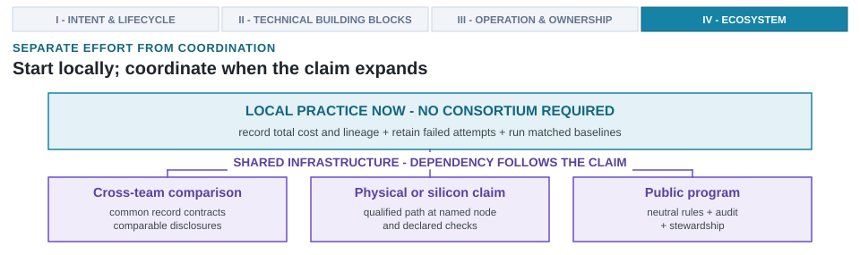

---
format:
  html:
    output-file: index.html
---

# A Call to Action: Bootstrapping an AI-Native Ecosystem {#sec-bootstrapping-ecosystem}

{fig-alt="One team can improve records and comparisons now, while cross-team, physical or silicon, and public-program claims require different shared infrastructure."}

::: {.epigraph}
> "The more designers involved in using the new methods, and the better they are able to communicate with each other, the faster the process of cultural integration runs."
>
> — Lynn Conway, *The MPC Adventures* (1981) [@Conway1981MPCAdventures]
:::

::: {.column-margin}
**Author's Note.** Lynn Conway, who with Carver Mead transformed semiconductor design through very-large-scale integration (VLSI) abstractions, documented how shared design rules and networked fabrication turned a new methodology into a community practice. Building Architecture 2.0 presents the same imperative. Decoupling autonomous search loops from proprietary computer-aided design (CAD) lock-in requires open data schemas, neutral consortium benchmarks, and shared infrastructure.
:::

Building a discipline-wide ecosystem for autonomous system and chip design synthesizes the life-cycle principles, technical representations, closed-loop toolchains, and ownership models established across the preceding eleven chapters. Translating local laboratory demonstrations into a cumulative, open engineering discipline requires answering a crucial ecosystem question. How can open data standards, accessible physical fabrication infrastructure, neutral consortium benchmarks, and competitive grand challenges be coordinated to make autonomous hardware exploration auditable and reproducible across organizations?

In the late 1970s, custom integrated circuit design was locked inside vertically integrated semiconductor firms. Carver Mead and Lynn Conway transformed that guild structure into an open academic and industrial discipline not merely by formulating structured very-large-scale integration (VLSI) abstractions, but by creating the multi-project chip methodology and orchestrating the ARPANET-enabled MPC79 fabrication run [@MeadConway1980VLSI; @Conway1981MPCAdventures]. That precompetitive substrate democratized hardware design, giving rise to the Defense Advanced Research Projects Agency (DARPA) MOSIS shared wafer shuttle and launching the fabless semiconductor industry [@MOSIS1981VLSI]. Scaling Architecture 2.0 demands a modern counterpart. It requires coordinated action across toolmakers, foundries, standards bodies, and universities. In advanced process nodes (3\ nm and below), where full production reticle mask sets reach $\$120\ \text{million}$ (@sec-what-architect-owns) and a single unmodeled timing glitch or power-grid resonance destroys a tapeout schedule, no team can shoulder the empirical learning curve in isolation. While @sec-what-architect-owns established what a single enterprise owns, this chapter defines what the broader community must construct so that any team can record a trustworthy result.

Individual organizations can adopt total cost accounting, attempt lineage tracking, and failure retention immediately within their own repositories. However, public benchmark claims, physical silicon evidence, and workforce credentials require shared infrastructure across four coordinating pillars.

1. *Open foundations* (standardized Open Agentic Interface schemas and open process design kits).
2. *Consortium governance* (neutral working groups, locked closed divisions, and total workflow cost accounting).
3. *Competitive evaluation* (multi-track grand challenges and public repositories of negative design attempts).
4. *Skills and review* (a 14\text{-week} graduate syllabus, diagnostic failure laboratories, and the four-tier Autonomous Workflow Certified badging framework).

::: {.callout-learning-objectives}
This chapter establishes the following learning objectives:

- **Distinguish** practices a team can adopt locally from shared infrastructure that depends on cross-organizational coordination across the three operational layers (point scripting, subsystem sandboxes, and AI-native ecosystem infrastructure).
- **Formulate** open schema protocols and cryptographic attempt lineage headers for agentic hardware tools.
- **Match** a physical claim to the implementation path that supports it, separating manufacturable open processes, predictive research nodes, and commercial signoff.
- **Establish** neutral consortium benchmark governance and public failure repository indexing.
:::

## Ecosystem Workstreams and Dependencies {#sec-staging-sequence}

Deploying autonomous search loops into hardware design without shared infrastructure risks compounding system fragmentation rather than accelerating progress. The natural commercial instinct in electronic design automation (EDA) is to construct proprietary tool wrappers and hoard private benchmark results. In AI-native design systems, that instinct breeds fragile heuristics that fail outside their training sandbox. When an automated placer or prompt-driven generator trains exclusively on proprietary netlists, its learned representations bake in the unspoken quirks of a specific commercial tool version, standard-cell library, and proprietary process deck. The moment that model confronts an unfamiliar technology target or cross-layer constraint, its predictive confidence collapses.

The remedy is not a rigid sequential rollout. Individual teams can adopt cost accounting, lineage recording, and failure retention immediately within their own repositories. Conversely, cross-organizational benchmark claims, open silicon evidence, and durable workforce certification depend on shared contracts, qualified infrastructure, and multi-institution governance. Six proposed workstreams structure these claim-specific dependencies (@tbl-ecosystem-staging-sequence), distinguishing actions a single team can execute locally without waiting for external consensus from those requiring shared ecosystem coordination.

The three operational layers of AI in architecture (@fig-ch01-three-layers-ai-integration) illustrate why shared infrastructure is indispensable. While isolated tools can generate local code fragments, transforming full-system architecture exploration into a cumulative discipline requires coordinating across three distinct integration regimes.

- **Layer 1 (AI-Assisted Engineering):** Thrives in isolation using generic foundation models and proprietary copilot prompts, but produces fragmented artifacts without common data schemas or lineage. An engineer can draft an isolated SystemVerilog module with zero external coordination, yet the resulting code remains an unverified fragment.
- **Layer 2 (AI-Driven Subsystem Optimization):** Operates within isolated domain silos (such as an in-house macro placer or proprietary compiler autotuner), locking algorithms to specific computer-aided design (CAD) vendors and preventing reproducible academic comparison across institutions.
- **Layer 3 (AI-Native System Design):** Requires open ecosystem infrastructure (standardized Protocol Buffer schemas via the Open Agentic Interface (OAI), intermediate representation (IR) frameworks like Circuit IR Compilers and Tools (CIRCT), containerized open EDA flows like OpenROAD, neutral consortium benchmarks via MLCommons, and public negative-result repositories) to make cross-boundary multi-tool design loops auditable, transferable, and reproducible across organizations.

| **Proposal** | **Ecosystem action** | **Local starting point** | **Coordination dependency** |
| --- | --- | --- | --- |
| 1 | Shared data schemas and tool contracts | Retain decision context, artifact identities, commands, returns, failures, and costs in a versioned record. | Cross-team comparison needs common semantics for identities, status, units, and tool results. |
| 2 | Open implementation paths and cloud silicon shuttles | Exercise an open flow at a named manufacturable or predictive node and state the resulting evidence boundary. | Silicon claims need a manufacturable process design kit (PDK) and shuttle; commercial-node signoff needs foundry-qualified decks, libraries, tools, and access. |
| 3 | Consortium governance and matched benchmarks | Run a matched local comparison with pinned tasks, checks, budgets, and total-cost accounting. | A public leaderboard needs neutral rules, shared task versions, audit capacity, and comparator governance. |
| 4 | Grand challenges and architecture contests | Run a narrow evaluator-owned challenge with a credible baseline and explicit untested conditions. | Cross-organization contests depend on stable interfaces, comparable checks, and enforceable resource accounting. |
| 5 | Public repositories of failed attempts | Retain failed, invalid, timed-out, and rejected attempts alongside successful runs. | Shared repositories need schemas, privacy and licensing rules, stewardship, and controls against misleading or unsafe data. |
| 6 | University curricula and workforce certification | Teach failure diagnosis, evidence qualification, matched comparison, and authority boundaries now. | A badge additionally needs published criteria, trained reviewers, appeals, maintenance, and evidence that the badge predicts the claimed practice. |
: **Local adoption can proceed in parallel; shared claims create dependencies.** The proposals identify work that can begin now and the infrastructure required before a team makes broader cross-organizational, silicon, or certification claims. This is a dependency map, not a program that has been run. {#tbl-ecosystem-staging-sequence tbl-colwidths="[10,24,33,33]"}

Evaluating @tbl-ecosystem-staging-sequence reveals a stark divergence in agency. An isolated research group maintains total authority over its internal data hygiene, retaining command execution traces, bounding its own search parameters, and deploying local surrogate models without asking permission. These local starting points yield immediate compounding returns for the organization, allowing them to debug failed generation loops and correlate AI-proposed hardware changes with physical consequences. However, the moment that same team attempts to publish a comparative research claim, cross-validate a competitor's benchmark, or tape out a multi-project wafer, their unilateral agency ends. The coordination dependencies on the right side of the table dictate that public claims demand public infrastructure.

Because these dependencies operate concurrently, they naturally group into structural pillars rather than a linear sequence. The first pillar, open foundations, guarantees that both software tools and physical fabrication share a common denominator. The second pillar, governance, ensures that performance metrics remain uncorrupted by adversarial tuning or proprietary concealment. The third pillar, evaluation, provides the adversarial arenas where autonomous design systems test their empirical limits against physical constraints. Finally, the fourth pillar, skills and review, ensures that the human workforce and academic peer-review pipelines evolve rapidly enough to comprehend and govern these automated systems.

Consolidating these six workstreams into four coordinating pillars (@fig-ecosystem-roadmap) clarifies the institutional roadmap. Each pillar addresses a specific organizational barrier, establishing the schemas, reference comparators, physical flows, and diagnostic training needed to sustain open architectural science. Without these coordinating pillars, the ecosystem remains stubbornly fragmented, forcing individual research teams to reinvent interface contracts, benchmark baselines, and physical design closures for every project. Establishing shared open foundations allows the community to amortize non-recurring infrastructure costs and accelerate the transition toward reproducible, auditable Architecture 2.0 research.

{#fig-ecosystem-roadmap width="100%" fig-alt="Four coordinating workstreams show open foundations, governance, evaluation, and skills and review. Actions cover schemas, physical-design paths, matched benchmarks, contests, failure repositories, curricula, and review. Dashed connectors indicate shared dependencies rather than a universal adoption sequence, and a feedback arrow returns negative attempts to the foundations."}

The defining mechanism in @fig-ecosystem-roadmap is the feedback loop returning negative design attempts to the shared foundations. Unroutable placements, negative timing slack, and Unified Power Format (UPF) domain violations directly refine schema definitions, benchmark problem suites, property checks, and surrogate calibration. Horizontal connectors represent dependencies for cross-organizational claims, not preconditions for local exploration. Whether this coordination model scales across the semiconductor ecosystem remains an open question.

::: {.callout-design-principle title="Build open foundations before scaling autonomous tools"}
**The principle:** Scaling Architecture 2.0 across industry and academia requires open data schemas, accessible implementation and reference paths, neutral consortium benchmarks, and qualified repositories of negative design attempts.

**The application:** Begin local cost, provenance, failure-retention, and comparison practices now. Require shared contracts and qualified reference paths before making cross-team comparability, physical, silicon, or certification claims.
:::

## The Precompetitive Open Infrastructure Imperative {#sec-precompetitive-infrastructure}

In deep-submicron and nanoscale fabrication, routing congestion, power-grid IR drop, UPF power-domain isolation, thermal dissipation, and manufacturability demand implementation evidence calibrated to the target node. In advanced commercial nodes (7\ nm, 3\ nm, and 2\ nm), extreme ultraviolet lithography, fin-pitch scaling, gate-all-around nanosheets, and back-end-of-line metal stack RC parasitics mean that physical layout dominates timing closure. Because commercial foundries protect their intellectual property behind strict nondisclosure agreements (NDAs), proprietary signoff tools, and qualified design-rule manuals, academic laboratories and early-stage startups face a structural barrier to physical design exploration.

Expanding open-source physical-design infrastructure and multi-project wafer (MPW) shuttle access narrows this structural divide. Manufacturable open process design kits (PDKs), including SkyWater SKY130 (130\ nm CMOS) [@SkyWater2020SKY130PDK], IHP SG13G2 (130\ nm BiCMOS with 250\ GHz silicon-germanium (SiGe) heterojunction bipolar transistors (HBTs)), and GlobalFoundries GF180MCU (180\ nm), support complete open-source physical synthesis, place-and-route, and tapeout fabrication. Coupled with the open-source CIRCT/Multi-Level Intermediate Representation (MLIR) compiler ecosystem [@CIRCT] and open EDA engines (OpenROAD, Yosys, OpenSTA), these open toolchains render end-to-end design loops fully reproducible without proprietary licensing barriers.

In academic research, ASAP7 serves as a predictive 7\ nm PDK for modeling scaling trends rather than manufacturable signoff [@ClarkEtAl2016ASAP7].[^fn-predictive-pdk-c12] Because predictive kits simplify complex design-rule manuals and lack calibrated metal-stack parasitics, optical proximity correction decks, and lithography fill-cell models, they cannot substitute for commercial signoff decks when claiming manufacturable power, performance, and area (PPA) closure. A candidate architecture that achieves high ranking under ASAP7 can suffer catastrophic timing inversion or routing collapse when subjected to commercial foundry design rules. Correlating predictive-PDK evaluations with commercial TSMC N7, N3, or N2 characteristics constitutes a distinct research claim requiring matched industrial baselines, explicit parasitic derating models, and documented error bounds.

[^fn-predictive-pdk-c12]: **Predictive process design kit (PDK)**: An open, non-manufacturable cell library and technology model that abstracts geometric and electrical scaling trends for academic research without exposing proprietary foundry design rules or signoff decks [@ClarkEtAl2016ASAP7].

To bridge academic AI models with proprietary commercial foundry PDKs without violating strict NDAs, the ecosystem is adopting confidential computing enclaves (such as AMD SEV-SNP and Intel TDX). Hardware-enforced memory encryption enclaves allow chip design organizations to deploy learned models and agentic orchestrators on cloud infrastructure while guaranteeing that decrypted foundry standard-cell libraries and proprietary layout macros remain completely inaccessible to cloud providers and third-party AI model vendors. However, deploying enclaves introduces operational prerequisites. Teams must maintain verifiable remote attestation roots, audit container boundary security to prevent side-channel leakage, and establish trusted key-management protocols before running proprietary CAD signoff flows on untrusted cloud nodes.

## Shared Data Schemas and Tool Contracts {#sec-standardized-data-lineage}

Building upon this precompetitive physical foundation requires a common language for exchanging design state across organizational boundaries. Workflow fragmentation across the semiconductor industry stems primarily from a lack of interoperable tool interfaces and shared metadata contracts. In software systems, an untyped JSON payload or loose YAML file is a minor inconvenience. In hardware design, passing untyped strings between an autonomous exploration loop and a physical signoff tool is catastrophic. When an optimizer exchanges floating-point spatial coordinates, ambiguous timing slack numbers, or unversioned power-domain declarations through ad hoc scripts, subtle parsing discrepancies silently corrupt the design state. A surrogate model might interpret an unconstrained clock port as a zero-delay wire, or an optimizer might infer that an unrouted power rail has zero resistance. Models and tool wrappers developed in one environment then fail completely when transferred to a different CAD flow or technology target (@sec-loop-patterns-across-stack).

Just as Institute of Electrical and Electronics Engineers (IEEE) 1666 (SystemC) established common modeling semantics across commercial and open environments [@IEEE2011SystemC1666], a standards consortium (such as MLCommons or CHIPS Alliance) can standardize agent interfaces before proprietary tool silos lock in competing APIs. Establishing open schema contracts ensures that autonomous exploration loops, surrogate models, and verification engines interact through stable, machine-readable specifications. The proposed Open Agentic Interface (OAI) formalizes this coordination through three core record schemas (@fig-oai-schemas).

- **Design problem formulations.** Explicit declarations of swept parameters, locked constraints, evaluation checks, and acceptance criteria ($s_{\text{design}}$). In the mobile extended-reality (XR) accelerator loop (@sec-architecture-20-ontology), the problem formulation defines search bounds (such as processing element (PE) array sizes from $16 \times 16$ to $64 \times 64$ and static random-access memory (SRAM) capacity 256\ KiB to 2\ MiB), system obligations (3\ W thermal design power (TDP) and 120\ FPS throughput at 4\ K resolution), target instruction set architectures (ISAs) (RISC-V RV64GCV), interconnects (Universal Chiplet Interconnect Express (UCIe), Compute Express Link (CXL)), and technology targets, distinguishing predictive PDKs such as ASAP7 from commercial TSMC N7 or N3 signoff.
- **Attempt lineage headers.** Declarations of candidate artifacts, parent inputs, transformations, tool flags, structural representations, and environment configurations ($s_{\text{env}}$). A cryptographic hash identifies exact bytes; a Supply Chain Levels for Software Artifacts (SLSA) attestation binds an issuer to a declaration [@SLSA2026Framework].[^fn-slsa-attestation-c12] Neither mechanism proves semantic correctness, and an attestation remains only as trustworthy as its builder, signing key, and storage path. Lineage headers for SystemC transaction-level model (TLM) memory controllers or high-level synthesis (HLS) kernels (@sec-data-representations-world-models) retain prompt and commit hashes, abstract syntax trees (ASTs), control-data flow graphs (CDFGs), Multi-Level Intermediate Representation (MLIR) / CIRCT intermediate representation (IR), container digests, seeds, UPF power-domain declarations, and command-line interface (CLI) arguments. To protect proprietary design collateral across organizational boundaries, lineage headers can export structural hashes, compiler pass fingerprints, and bounding-box geometry metrics without disclosing internal transistor topologies, unreleased ISA opcodes, or proprietary foundry cell libraries.
- **Multi-fidelity environmental contracts and tool AI-readiness assessment.** Typed input prerequisites, output schemas, declared error assumptions, status semantics, and property-appropriate checks across analytical models, cycle-level simulators, and register-transfer level (RTL) tools. Assessments verify whether tools such as gem5, Verilator, SCALE-Sim, Ramulator, OpenROAD, Yosys, and OpenSTA expose pinned container interfaces, structured state exports, checkpoint behavior, machine-parsable failures, and documented checks (@sec-architecture-environments-tool-interfaces). SystemVerilog Assertions (SVA) and bounded model checking (BMC) reject violations of encoded properties under stated assumptions, but cannot exclude unmodeled deadlocks or behaviors beyond bounded proof depths.

{#fig-oai-schemas width="100%" fig-alt="Diagram of three proposed Open Agentic Interface records: design problem formulation, attempt lineage header, and environmental contract. They capture bounds, artifact identities, transformation declarations, input prerequisites, error assumptions, and tool checks. A bottom box represents selective cross-organizational exchange subject to separate trust and confidentiality controls."}

Adopting structured serialization schemas makes attempt metadata interoperable without exposing internal proprietary designs. Protocol Buffers (`.proto`) provide language-neutral, statically typed message definitions with explicit field-tag indexing and backward/forward binary compatibility. In a distributed multi-agent exploration loop, an orchestrator, surrogate predictor, and physical signoff tool (running in separate containers across different languages such as C++, Python, or Rust) serialize attempt records into compact binary payloads without floating-point parsing discrepancies or JSON string serialization overhead. JSON-LD complements this by embedding semantic graph linkages (such as linked-data contexts, persistent node identifiers, and ontological type definitions). When cross-institutional repositories index millions of failed or successful attempts, JSON-LD allows metadata to bind to shared ontologies (such as IEEE standards or open PDK technology models) using uniform resource identifiers (URIs), enabling federated graph queries across decentralized repositories without requiring a centralized database schema. While intermediate representation frameworks (such as CIRCT and MLIR) standardize the structural syntax of hardware modules and compiler dialects, OAI standardizes the orchestration, lineage, and verification metadata governing how tools and agents manipulate those representations. Each record class withstands a distinct operational boundary. Problem formulations survive external parsing, lineage headers survive separation from execution runs, and environmental contracts survive underlying tool updates. Recording remains an internal hygiene practice decoupled from external disclosure.

[^fn-slsa-attestation-c12]: **SLSA Attestation**: A machine-readable, cryptographically signed metadata statement that records software supply-chain provenance, build environments, and transformation inputs [@SLSA2026Framework].

## Silicon Shuttles and the Cost Collapse {#sec-silicon-shuttles}

Open physical-design infrastructure directly extends the precedent of Lynn Conway's MPC79 experiment [@Conway1981MPCAdventures] and the DARPA-funded MOSIS fabrication service [@MOSIS1981VLSI], which aggregated multiple university chip designs onto shared reticle masks over the ARPANET. The economic divergence between commercial manufacturing signoff and university research budgets explains why open fabrication infrastructure became indispensable (@fig-ch12-money-plot-tapeout-cost-collapse).

![**Physical fabrication cost escalation and the open silicon submission renaissance (1981–2026).** (a) Historical full-reticle mask set and commercial MPW prototype costs escalating from $\$35\ \text{thousand}$ ($2\ \mu\text{m}$) to $\$48\ \text{million}$ (3\ nm), breaching academic grant ceilings until open shuttles collapsed entry costs by $3{,}000\times$ [@MOSIS1981VLSI]. (b) Tiny Tapeout submissions and cumulative growth ($152\to 4{,}026$ designs across 22 shuttles) restoring physical silicon verification to university research [@SkyWater2020SKY130PDK].](images/fig-shuttle-cost-democratization){#fig-ch12-money-plot-tapeout-cost-collapse width="100%" fig-alt="Dual-panel plot showing historical silicon fabrication costs and modern open shuttle submission growth. (a) Full mask and commercial MPW prototype costs rising from $35k to $48M from 1981 to 2026 on a log scale, crossing the $50k academic grant ceiling, and dropping below $300 on open PDKs. (b) Tiny Tapeout submissions per shuttle and cumulative growth from 152 to 4,026 verified silicon designs from 2022 to 2026."}

As @fig-ch12-money-plot-tapeout-cost-collapse a illustrates, the exponential escalation of full-reticle mask sets and commercial MPW rates created an unbridgeable commercial lockout zone for university laboratories between 2007 and 2020. When leading-edge prototype runs crossed $\$100\ \text{thousand}$ to $\$1\ \text{million}$, academic architecture research retreated into software simulation proxies, producing generations of graduate architects who had never brought up physical silicon or debugged a post-fabrication clock-tree defect. The emergence of open PDKs and telemetry-multiplexed shuttle aggregators broke this multi-decade lockout (@fig-ch12-money-plot-tapeout-cost-collapse b). Platforms like Tiny Tapeout drove a $3{,}000\times$ collapse in fabrication costs, expanding submission throughput from 152 designs on TT01 in 2022 to 4,026 cumulative designs by mid-2026 across three distinct foundries.

Modern open shuttle aggregators (such as Tiny Tapeout, Efabless Open MPW, and Europractice) implement this physical access by providing standardized digital pad rings, automated continuous-integration (CI) hardening harnesses, and shared on-chip scan chains. For AI-generated macros, telemetry-sharing shuttles equip each candidate block with isolated power-monitored rails, ring-oscillator timing characterization across voltage and temperature corners, and JTAG telemetry interfaces. This delivers empirical post-silicon timing, power, and yield measurements back to the community, turning physical fabrication from an inaccessible lottery into an auditable regression harness that calibrates learned surrogates against physical silicon behavior. Containerized open flows improve repeatability, but do not grant commercial-tool rights or close the gap to a different foundry process.

## Consortium Governance and Benchmarking {#sec-neutral-governance}

The structural divide between open predictive PDKs (such as ASAP7) and commercial foundry signoff mirrors the challenge of evaluating AI-native design claims across diverse research groups. As open implementation paths lower barriers to physical evidence, evaluation integrity becomes the central challenge. In AI-for-architecture research, benchmark overfitting and the optimizer's curse are pervasive risks. When every research group evaluates its tools on private, cherry-picked RTL blocks with uncounted compute hours and bespoke prompt tuning, published performance margins reflect experimental noise rather than genuine architectural advances. Multi-stakeholder governance establishes standardized tasks, reference comparators, disclosure rules, and audit protocols, mitigating the benchmark-health failures analyzed in @sec-evaluating-agentic-architect.

Emulating the governance model of MLCommons and MLPerf [@MattsonEtAl2020MLPerf], an independent Architecture Automation Working Group under established bodies (such as MLCommons, Standard Performance Evaluation Corporation (SPEC), CHIPS Alliance, or IEEE Council on Electronic Design Automation (CEDA)) can establish community-wide evaluation integrity. Separating algorithmic exploration from closed-division compliance while tracking full-system resource budgets ensures that reported architectural gains reflect genuine methodological innovations rather than compute scale or uncalibrated tooling. To achieve this, the working group enforces three core mandates:

- **Reference problem suites.** Problem suites grounded in realistic industrial constraints, spanning 3\ W mobile extended-reality (XR) spatial processing, RISC-V RV64GCV vector clusters, datacenter tensor acceleration, Compute Express Link (CXL) memory expansion, and Universal Chiplet Interconnect Express (UCIe) chiplet interconnect management.
- **Closed and open benchmark divisions.** A Closed Division where AI agents compete under locked tool wrappers, fixed compute budgets, and identical baseline matching (evaluating raw algorithmic and search-method efficiency), alongside an Open Division permitting unconstrained search, custom heuristics, or proprietary surrogates provided authors disclose multi-dimensional workflow costs and artifact lineage (evaluating absolute architectural capability).
- **Total workflow-cost accounting.** Mandatory accounting for the multi-dimensional resource vector ($C_{\text{workflow}} = \langle C_{\text{compute}}, C_{\text{license}}, C_{\text{human}} \rangle$), including graphics processing unit (GPU) compute hours, electronic design automation (EDA) license checkout minutes, and human triage time.

Enforcing these mandates creates a common baseline across research groups. Consortium governance locks baseline divisions and audits complete workflow expenditures, establishing the neutral evaluation framework required before competitive grand challenges can fairly compare autonomous design systems.

## Grand Challenges and Design Contests {#sec-grand-challenges}

Where consortium governance establishes neutral baseline rules and cost accounting, competitive grand challenges apply that framework to focus research on unresolved architectural bottlenecks. Standardized traces and open competitions historically propelled innovations in branch prediction through Championship Branch Prediction (CBP) [@CBP2016BranchPrediction], data prefetching through Data Prefetching Championship (DPC) [@DPC2015DataPrefetching], and simulation through ChampSim [@GoberEtAl2022ChampSim], echoing the historical impact of the Defense Advanced Research Projects Agency (DARPA) Grand Challenges in autonomous vehicles [@BuehlerEtAl2009DARPA; @ThrunEtAl2006Stanley] and ImageNet in computer vision [@RussakovskyEtAl2015ImageNet]. Architecture 2.0 grand challenges structure this competition across three focused evaluation tracks designed to test distinct engineering boundaries.

- **Constrained physical power, performance, and area (PPA) generation.** Candidates must yield timing-closed, area-efficient register-transfer level (RTL) from high-level specifications under strict power and thermal envelopes (such as the Lighthouse 3\ W mobile XR accelerator targeting TSMC N7 and N3 nodes from @sec-moonshot and @sec-intent-vs-spec). This track tests whether generative loops achieve physical signoff feasibility without human intervention.
- **Sample-efficient space exploration.** Candidates must discover Pareto-optimal microarchitectural configurations for heterogeneous workloads (spanning RISC-V RV64GCV vector units and CXL memory topologies) under a strict simulation budget. This track tests whether search algorithms navigate vast design spaces without wasting simulator cycles.
- **Adversarial red-teaming and hardware security.** Automated tools must identify latent timing exceptions, prompt-driven Trojan insertions, or verification loopholes in AI-generated hardware collateral using SystemVerilog Assertions (SVA) and bounded model checking (BMC) with explicit $k$-induction proof depth bounds (illustratively, $k \ge 100$). This track tests whether verification harnesses catch silent bugs before silicon commitment.

These three tracks challenge autonomous tools across physical signoff, search sample efficiency, and adversarial verification resilience. In doing so, grand challenges do more than crown winning architectures. Systematically logging thousands of candidate evaluations under rigorous competition conditions produces extensive records of failed attempts and constraint violations that expose where autonomous tools break down.

## Public Repositories of Failed Runs {#sec-open-failed-attempts}

Autonomous search models depend fundamentally on what they learn from failure, yet machine learning datasets in hardware design suffer from pervasive survivorship bias. When a synthesis or place-and-route job crashes due to unroutable congestion, negative slack, or an IR-drop violation, engineering teams typically purge the broken log. Because published corpora consist almost exclusively of successful, timing-closed designs (@sec-data-representations-world-models), learned surrogates train under the illusion that silicon is effortless to route, proposing candidates that drive layout engines straight over physical feasibility cliffs. Retaining negative results (unroutable floorplans, timing violations, and oscillating power grids) maps the physical shape of failure, bounding exploration spaces and preventing optimizers from rediscovering known unviable topologies. To convert these failed attempts into reusable community assets, a consortium repository standardizes three progressive levels of data curation.

- **Raw execution traces.** Complete command-line interface (CLI) logs, tool return codes, standard error (stderr) streams, and resource consumption telemetry for failed synthesis and simulation passes.
- **Root-cause taxonomy annotations.** Standardized labels categorizing failures by class: timing violations (worst negative slack $\text{WNS} < 0$), design rule checking (DRC) geometry violations, assertion counterexamples, deadlock states, unroutable congestion maps, and license timeouts.
- **Safe disclosure filters.** Automated sanitization pipelines that convert proprietary physical netlists into normalized graph embeddings, anonymized congestion heatmaps, and relative slack distributions, stripping absolute die coordinates, foundry cell-type names, and top-level block pinouts before external ingestion.

Publishing structured negative data transforms costly engineering failures into precompetitive community assets, preventing duplicate exploratory dead ends across academic and industrial teams. Exposing the exact boundary conditions where physical layout or timing closure collapses provides the empirical grounding necessary to calibrate multi-fidelity surrogates and harden automated design loops against optimistic hallucinations. When these open data schemas, fabrication paths, consortium benchmarks, and failure repositories converge, they alter the operational and economic landscape of hardware design at scale.

## Ecosystem Outlook at Scale {#sec-ecosystem-outlook}

The outlook that follows is conditional, describing what changes if the preceding infrastructure succeeds, rather than what current evidence establishes. If closed-loop exploration operates at industry scale and verification standards are institutionalized, the bottlenecks of chip design migrate from manual execution to high-level system formulation, physical signoff governance, and cross-layer constraint trade-offs across four interconnected dimensions.

- **The architect's shifting contribution.** As automated design loops absorb the mechanics of RTL coding, physical floorplanning, and place-and-route sweeps, architectural contribution shifts upstream and downstream. Upstream, architects focus on formal problem framing, cross-stack requirement-domain specification, objective-function synthesis, and safety-constraint boundary setting. Downstream, architects govern residual risk, evaluate cross-layer trade-offs, and conduct adversarial red-teaming of AI recommendations. Architects preserve technical contact not by manually editing gates, but by auditing agentic decision traces, inspecting failure counterexamples, and running independent verification checks. The architect's responsibility remains declaring what the evidence supports, stating residual risk, and presenting recommendations to the authorized decision makers who accept or reject that risk.
- **The evolving EDA business model.** Scaling autonomous workflows alters the software foundation of the EDA industry. Legacy EDA suites built around monolithic per-seat desktop GUI licenses give way to cloud-native, agentic API environments. Conventional EDA tools (synthesis compilers, static timing analyzers, formal verifiers, and physical signoff engines) operate as headless execution tools and verification oracles within agentic loops. Open-source EDA infrastructures (OpenROAD, Yosys, OpenSTA, Verilator) paired with AI search engines could reach parity with proprietary toolchains for a growing spectrum of digital and microcontroller system-on-chip (SoC) blocks. Business models shift from static per-seat annual licenses to compute-indexed or outcome-contingent pricing, where organizations pay based on design-space exploration volume or verified power, performance, and area (PPA) closure milestones.
- **The shifting economic cost bottleneck.** If agentic EDA environments compress front-end design cycles by an order of magnitude, the economic equations governing semiconductor investment realign. Automated exploration lowers non-recurring engineering (NRE) labor cost for initial SoC design while leaving fixed physical capital costs (reticle mask sets, foundry shuttle runs, advanced 2.5D/3D packaging dies, and physical silicon validation) unaffected. The economic bottleneck shifts from front-end design labor to back-end physical mask fabrication and packaging yield, favoring specialized application-specific integrated circuits (ASICs). Custom chips for micro-verticals (edge XR, autonomous robotics, personalized medical devices, and localized AI inference) become economically viable at lower production volumes.
- **Democratized global access to custom silicon.** When transformed pedagogy, open ISAs (RISC-V RV64GCV), open chiplet interconnect standards (UCIe), open memory standards (CXL), and accessible cloud compute converge, custom silicon creation can expand globally. Startups, regional research centers, and academic laboratories gain the capability to design competitive, high-performance SoCs previously reserved for established semiconductor firms. Hardware development can track iterative software release cycles, progressing on quarterly or monthly schedules through modular chiplet updates and rapid automated design passes.

## Living Companion Infrastructure {#sec-living-web-hub}

Realizing this ecosystem vision requires tangible digital infrastructure that bridges theoretical principles with daily engineering practice. To provide immediate operational support for research groups, peer reviewers, and university classrooms, the living companion web hub for this book establishes four centralized, open-access resources.

- **Open Schema and Benchmark Registry.** Machine-readable Protocol Buffer and JSON-LD specifications for design problem formulations, attempt lineage headers, and environmental contracts.
- **Architecture 2.0 Reference Index.** A community-maintained directory categorizing papers, datasets, EDA tool wrappers, and AI agent frameworks across all six life-cycle stages.
- **Interactive Reviewer Audit Tool.** An online checklist implementing the verification rules from @sec-appendix-a-reviewer-checklist, enabling authors and conference reviewers to audit paper rigor prior to submission.
- **Dockerized Reference Starter Kits.** Containerized sandboxes preconfigured with OpenROAD, Yosys, OpenSTA, gem5, Verilator, SCALE-Sim, Ramulator, UPF tools, SkyWater SKY130, and ASAP7.

While these open starter kits lower the friction of executing multi-tool workflows, containerized environments alone cannot resolve the foundational scientific dilemmas of autonomous hardware exploration; those challenges require ongoing inquiry across the discipline.

## Open Questions {#sec-ecosystem-open-questions}

The questions raised across this book were never intended as a closed research agenda. They are food for thought, marking where the discipline's argument meets its current limits. Building an open, auditable ecosystem requires research leaders, standards bodies, and consortium working groups to formulate their own questions around shared collective action.

- **Under what physical constraints do architectural rankings made on open predictive PDKs invert under commercial signoff?** Academic and consortium research relies on open predictive process design kits (such as ASAP7) to evaluate and rank candidate architectures. Predictive kits omit detailed metal-stack parasitics, complex design-rule density limits, and power-grid voltage-droop constraints present in commercial foundry nodes. Whether researchers can identify the exact congestion and scaling thresholds where predictive rankings flip under commercial signoff, or academic architecture rankings will remain uncalibrated against foundry realities, defines the bridge between open research and production silicon.

- **How do you prove an automated judge is truly independent from the generator it evaluates?** Closed-loop ecosystems use foundation models as automated evaluators and benchmark judges. When both the generative search engine and the verification oracle share pretraining corpora, tokenizers, or prompt heuristics, they exhibit mutual confirmation bias, approving flawed architectures that mirror each other's blind spots. Whether statistical covariance tests can certify independence between generative agents and evaluator models, or shared pretraining foundations create an epistemic blind spot that only external, nonlearned formal solvers can break, marks the limit of automated peer review.

- **How can consortium benchmark suites rotate workloads without destroying historical progress metrics?** Static hardware benchmark suites are quickly memorized or absorbed into model pretraining corpora. Rotating benchmarks every year prevents contamination but destroys longitudinal comparisons, making it impossible to measure whether the discipline's design systems have actually improved across decades. Whether private, synthetically parameterized task distributions can provide nongameable public evaluations while preserving historical score calibration, or community benchmarks must accept periodic discontinuities to stay relevant, defines the benchmark governance dilemma.

- **How do you catch an agent that memorized human netlists instead of solving the architectural constraints?** Autonomous hardware agents are trained on public open-source codebases. Standard text-contamination checks fail on Verilog and Chisel because identical microarchitectures can be expressed through completely refactored syntax and variable renaming. Whether AST-level semantic isomorphism checks and adversarial constraint perturbations can expose memorization reliably, or public hardware benchmarking must transition entirely to private, never-published specifications, defines the evaluation integrity challenge.

- **How do grand challenges reward genuine microarchitectural invention over brute-force EDA flag tuning?** Hardware design competitions evaluate submissions on final PPA scorecards. Teams achieve winning scores by running massive cluster sweeps over tool synthesis flags rather than discovering fundamentally superior microarchitectural structures. Whether competition scoring formats can isolate structural design novelty from hyperparameter tuning through mandatory compute-budget caps and AST ablations, or community challenges will continue rewarding compute scale over architectural insight, defines the future of open hardware competitions.

## Capstone: The Eight Core Principles and Workforce Certification {#sec-curriculum-certification}

Modernizing engineering education is essential to realign the semiconductor workforce with autonomous design methods. Traditional very-large-scale integration (VLSI) curricula prepare students primarily for manual RTL drafting and point-tool execution. In that legacy pedagogical model, students spend months learning idiosyncratic HDL syntax and manual GUI keystrokes for commercial CAD tools. Architecture 2.0 demands a fundamental shift. It requires educating architects who formulate requirement domains, construct evaluator-driven verification harnesses, orchestrate multi-tool closed loops, and audit autonomous design streams across four foundational pillars. Ultimately, the eight core design principles established throughout this monograph, spanning from explicit requirement domain formulation to the traceability mandate and nondelegable human commitment, serve alongside the 14\text{-week} graduate course syllabus as the definitive capstone of the discipline's transition.

- **Specification engineering across requirement domains.** Designing formal specifications and requirement domains across the hardware–software stack.
- **Autonomous verification.** Developing harness architectures, property-appropriate checks, and adversarial red-teaming methodologies.
- **Search space formulation.** Defining evaluator-driven search spaces, constraint boundaries, and Pareto trade-off synthesis.
- **Heterogeneous system integration.** Integrating domain-specific accelerators across central processing unit (CPU), neural processing unit (NPU), memory, and packaging boundaries.

To address the *Ironies of Automation* [@Bainbridge1983Ironies] and ensure human engineers retain primary operational agency rather than becoming the "moral crumple zones" of @sec-sustaining-responsibility [@Elish2019MoralCrumpleZones], pedagogy must incorporate diagnostic laboratories. If students only learn to write natural-language prompts and passively observe automated tools generating RTL, they lose the tactile physical intuition required to diagnose deep circuit failures. When an autonomous loop produces an unroutable layout or an intermittent protocol deadlock, an engineer without diagnostic training cannot locate the root cause. In diagnostic laboratories, students debug intentionally seeded cross-layer failures in agent-synthesized microarchitectures, developing physical intuition and diagnostic competence without incurring routine manual overhead. Students also master open-to-commercial translation layers that map OpenROAD and Yosys telemetry to industrial Synopsys and Cadence signoff flows.

To facilitate direct university adoption and provide an actionable roadmap for educators, @tbl-graduate-course-syllabus details a complete 14\text{-week} graduate course syllabus blueprint structured around the four parts of this book, mapping theoretical lecture topics to hands-on laboratory exercises:

| **Week** | **Part and chapter focus** | **Core lecture topic** | **Hands-on laboratory exercise** |
| :--- | :--- | :--- | :--- |
| **Week 1** | Part I: @sec-moonshot | The Architecture Moonshot and Eight Requirement Domains | Scoping natural language intent into machine-usable specifications |
| **Week 2** | Part I: @sec-design-loop-no-longer-scales | Dennard Scaling Collapse, Dark Silicon, and Physics Bounds | Microprocessor scaling trend analysis and Roofline modeling |
| **Week 3** | Part I: @sec-architecture-20-ontology | The Six-Stage Design Life Cycle and Failure-Routing State Machines | Building an automated syntax vs physical failure-routing harness |
| **Week 4** | Part II: @sec-data-representations-world-models | Hardware Data Scarcity and Multi-Level IRs | Extracting CDFGs and compiling tensor loops to MLIR dialects |
| **Week 5** | Part II: @sec-methods-generation-prediction-optimization | Method Selection Taxonomies and Queue Stability Bounds | Sizing multi-fidelity evaluation queues under stability constraints |
| **Week 6** | Part II: @sec-architecture-environments-tool-interfaces | Containerized Execution Harnesses and Sandbox Containment | Constructing a sandboxed Docker execution harness for Verilator |
| **Week 7** | Part II: @sec-feedback-verification-trust | Formal $k$-Induction, BMC Bounds, and Mutation Testing | Mutation testing on an RV64GCV ALU block using cocotb |
| **Week 8** | Part III: @sec-running-the-loop | Closed-Loop Execution Records and Technical Stops | Executing a twelve-run parameter sweep in SCALE-Sim |
| **Week 9** | Part III: @sec-loop-patterns-across-stack | Cross-Stack Transfer and LogCA Offload Bounds | Requalifying NPU kernel schedules across node and workload shifts |
| **Week 10** | Part III: @sec-evaluating-agentic-architect | Four Evaluation Objects and Hardware Red-Teaming | Red-teaming an agentic loop for constraint tampering |
| **Week 11** | Part III: @sec-what-architect-owns | Non-Delegable Human Commitment and Chicken-Bits | Mock tapeout signoff review board and residual risk audit |
| **Week 12** | Part IV: @sec-bootstrapping-ecosystem | Open PDKs, OAI Schemas, and Consortium Governance | Open-source prompt-to-GDSII flow using OpenROAD and SKY130 |
| **Week 13** | Backmatter: @sec-appendix-a-reviewer-checklist | Research Peer Review Rubric Workshop | Peer-reviewing recent architecture preprints with the five-tier rubric |
| **Week 14** | Backmatter: @sec-appendix-c-design-principles | Capstone Project Presentations and Audits | Final student team presentations evaluated under the Autonomous Workflow Certified (AWC) badge |
: **14\text{-week} graduate course syllabus blueprint for AI-native computer architecture.** A turnkey curriculum trajectory mapping the four parts of this book into weekly lecture topics, theoretical foundations, and hands-on laboratory exercises. {#tbl-graduate-course-syllabus tbl-colwidths="[10,24,36,30]"}

Translating classroom diagnostic rigor into peer-reviewed research standards requires institutionalizing computational verification across major academic venues. In parallel with university curricula, conference Artifact Evaluation Committees at venues such as the International Symposium on Computer Architecture (ISCA), International Symposium on Microarchitecture (MICRO), Architectural Support for Programming Languages and Operating Systems (ASPLOS), and Design Automation Conference (DAC) can pilot an Autonomous Workflow Certified (AWC) badge grounded in computational reproducibility practice [@Stodden2010ReproducibleResearch; @StoddenEtAl2016Science].[^fn-awc-badge-c12] The badge structures evaluation across four actionable tiers:

1. **Tier 1 (AWC-Executable):** Computational replay. Verifies that containerized tool scripts, pinned environment digests (`sha256:...`), random seeds, and input datasets reproduce the exact reported simulation and synthesis runs deterministically.
2. **Tier 2 (AWC-Lineage):** Provenance and cost accounting. Verifies cryptographic parent-child artifact provenance DAGs, complete Supply Chain Levels for Software Artifacts (SLSA) attestations, and full multi-dimensional workflow cost vector accounting ($C_{\text{workflow}} = \langle C_{\text{compute}}, C_{\text{license}}, C_{\text{human}} \rangle$).
3. **Tier 3 (AWC-Calibrated):** Proxy fidelity and baseline parity. Verifies that learned surrogate models, proxy cost functions, and search heuristics are empirically qualified against physical EDA signoff checks or cycle-accurate simulations under strictly matched baseline budgets.
4. **Tier 4 (AWC-Physical):** Open physical and timing signoff. Verifies that generated hardware artifacts achieve deterministic design rule checking (DRC) and layout versus schematic (LVS) cleanliness, static timing closure ($\text{WNS} \ge 0$), and power-grid integrity on an open, manufacturable process design kit (such as SkyWater SKY130 or IHP SG13G2) or field-programmable gate array (FPGA) bitstream closure.

The badge names the exact review scope and verification boundaries rather than certifying the final physical architecture or authorizing a commercial silicon tapeout. An AWC Tier 1–4 badge certifies computational repeatability, lineage provenance, surrogate calibration, and open-flow physical closure of the research artifact; it does not certify commercial foundry signoff, electrostatic discharge (ESD) protection, multi-corner process, voltage, and temperature (PVT) yield qualification, packaging thermo-mechanical qualification, or commercial tapeout liability. Decoupling experimental reproducibility from commercial manufacturing signoff provides reviewers with an objective framework to audit artifact lineage, check containerized replay, and verify proxy calibration without conflating research reproducibility with commercial signoff. When shared data schemas, open fabrication paths, neutral consortium governance, public failure repositories, and modernized curricula mature together, they transform the institutional landscape of hardware design.

[^fn-awc-badge-c12]: **Autonomous Workflow Certified (AWC) badge**: A conference artifact evaluation designation attesting to the repeatability and explicit audit scope of an automated design workflow without certifying the physical architecture or authorizing commercial tapeout [@Stodden2010ReproducibleResearch; @StoddenEtAl2016Science].

## Summary {#sec-ecosystem-coda}

Decoupling logic design from physical silicon in the late 1970s transformed computer architecture not merely by inventing scalable abstraction layers and lambda-based design rules, but by establishing a complete socio-technical ecosystem spanning textbook education, networked collaboration over the ARPANET, and shared multi-project wafer shuttles [@MeadConway1980VLSI; @Conway1981MPCAdventures]. Architecture 2.0 represents a comparable historical inflection point as hardware engineering transitions from manual point-tool scripts to autonomous, closed-loop exploration systems. As Lynn Conway observed in the epigraph opening this chapter, the faster designers communicate using shared methods, the faster cultural integration runs. Transforming AI-native hardware exploration from isolated, proprietary demonstrations into a cumulative, open science requires coordinating across industry, academia, standards bodies, and toolmakers. Standardized OAI schemas, accessible physical shuttles, neutral consortium benchmarks, indexed failure repositories, and modernized diagnostic curricula create the shared infrastructure that makes empirical claims comparable, auditable, and reproducible across institutions.

Establishing this collaborative ecosystem requires balancing unilateral local adoption with coordinated multi-institution infrastructure. The eight design principles established throughout this text culminate in four strategic directives that define an auditable, discipline-wide Architecture 2.0 ecosystem.

::: {.callout-takeaways}
- **Parallel local practice, explicit shared dependencies.** Teams can adopt cost accounting, lineage, failure retention, matched comparisons, and diagnostic training now; broader benchmark, silicon, and certification claims depend on coordinated infrastructure.
- **Open data contracts.** Standardized design problem formulations, attempt lineage headers, and multi-fidelity tool contracts support interoperable exchange; access control, confidentiality, and trust remain separate obligations.
- **Evidence-appropriate implementation paths.** Manufacturable open PDKs and shuttles support silicon studies at their actual nodes, predictive PDKs support bounded methods research, and commercial signoff remains tied to foundry-qualified infrastructure.
- **Consortium governance and public failure records.** Neutral working groups can require matched baseline comparisons, total workflow cost accounting, and open artifact verification, while indexed public repositories of failed attempts supply the negative evidence that success-only datasets withhold.
:::

Building this open ecosystem ensures that autonomous methods expand expressible hardware complexity without eroding the empirical rigor and human stewardship that define computer architecture. Machine learning models propose, surrogates predict, and EDA engines check, but the nondelegable responsibility for architectural commitment, residual risk ownership, and societal impact remains firmly in human hands. Grounding autonomous exploration in open data contracts, precompetitive physical paths, and shared governance allows the discipline to construct a durable foundation where automated tools amplify human insight rather than obscuring it, opening the next era of architectural discovery.
