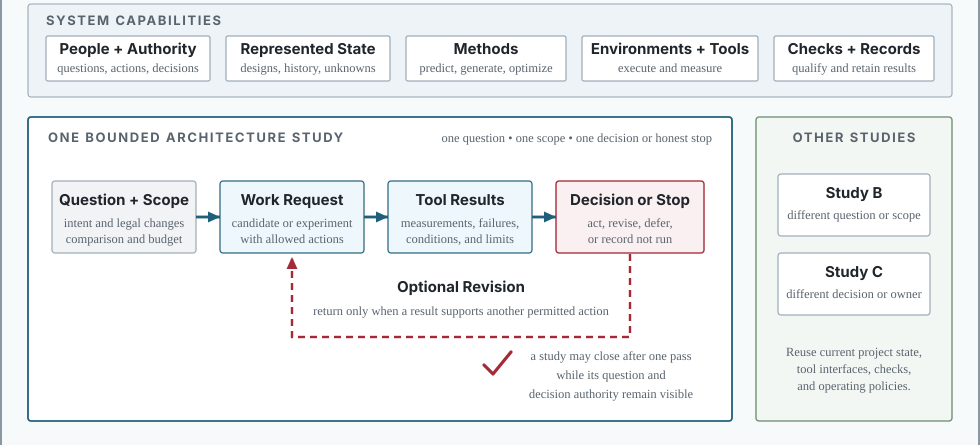
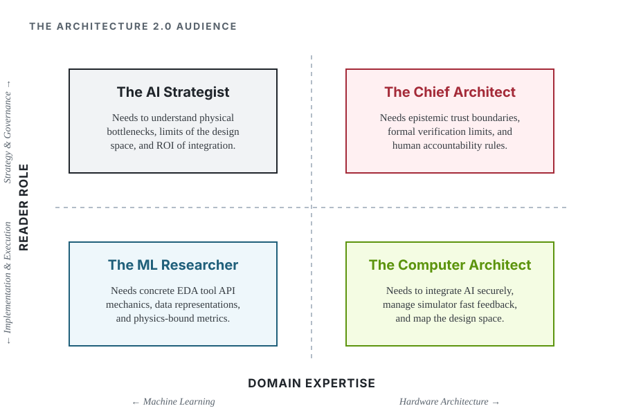

::: {.content-visible when-format="html"}
```{=html}
<span id="arch2-release-metadata" hidden="hidden"></span>

```
:::

# Preface {.unnumbered}

Computer architecture is entering a period where design effort, not transistor count, is the binding constraint. The field's response to the end of easy scaling has been an explosion of specialized designs, and every one of them multiplies the analysis, verification, and judgment a human team must supply. At the same time, AI systems have begun to participate directly in design work, proposing layouts, writing hardware descriptions, and searching spaces no team can cover by hand. @sec-moonshot tells that story properly and quantifies it. However, an AI participant can also hide a bad assumption, optimize the wrong abstraction, or make a fluent explanation look more certain than the physical evidence supports. The question this book answers is what engineering practice has to surround such a participant before its output deserves an architect's trust.

> **We define Architecture 2.0 as the engineering discipline of using AI, grounded in
> architectural representations, tools, and experiments, to formulate, explore,
> implement, evaluate, explain, and defend computer architecture decisions.**

While the core subject remains computer architecture, Architecture 2.0 fundamentally changes the unit of work. The discipline shifts from human-driven manual exploration to human-steered, agentic search over vast design spaces, where the architect's job is to define the boundaries and verify the evidence.

AI is making design candidates cheap, but it is not making evidence about them cheap. A finished design once implied a competent search behind it; that inference no longer holds, and trust must now attach to the loop that produced the design. The design loop is now part of the architecture. It has a specification, which is the bounded claim. It has state, actions, and feedback paths. It has performance metrics, verification obligations, and characteristic failure modes. It has a block diagram. Architecture 2.0 is the discipline of engineering that loop. This book equips an architect to bound it, instrument it, evaluate it, and stand behind what it produces.

The unit of work is not an isolated model invocation but a bounded architecture study, and the
architectural claim it makes is what gets reviewed. When the work iterates, the
design loop records the represented state, allowed actions, tool feedback,
evidence, and decision, and those records are what make the study inspectable.
The goal is the same one any good architecture study serves. It seeks better
understanding, a better artifact, or a decision that stronger evidence supports.
This loop, shown in the diagram, recurs throughout the book, mapping directly to our six stages: the architect's intent sets the **Formulate** stage; the agentic participants **Explore** and **Implement** candidates; the system evidence facilitates the **Evaluate** and **Explain** stages; and the final loop decision empowers the architect to **Defend** the result.

::: {.content-visible when-format="pdf"}
{width="100%" fig-alt="Architecture 2.0 loop diagram connecting architect intent, one or more agentic participants, system evidence, and a loop decision that returns to the architect"}
:::

As the loop diagram illustrates, AI is taking on a new role as an agentic participant in the design process. Machine learning has long optimized isolated mechanisms like branch predictors, and more recently macro placement. But recent models, from language models generating hardware descriptions to reinforcement learning tuning physical-design flows, can now participate in the higher-level control loop that proposes and evaluates a design.

A credible study must connect design intent to concrete alternatives, alternatives to real execution tools, measurements to architectural mechanisms, and final evidence to a recommendation that states its limits.

## What This Book Teaches {.unnumbered}

This material organizes around one main learning objective. Given a new, bounded computer
architecture problem within the reader's domain competence, the reader should be
able to decide whether and where AI assistance is useful, produce checkable study
artifacts, and defend an evidence-bounded recommendation that another architect
can inspect and challenge. These six verbs are ordered, not a menu. The middle stages iterate, but the
dependencies hold throughout. An architect cannot evaluate what has not been implemented
or defend what has not been explained.

These six core actions are defined as follows:

- **Formulate:** Translate design intent into a scoped study with a stated
  baseline, design space, objectives, constraints, claims, and non-goals.
- **Explore:** Choose suitable AI or conventional methods, compare meaningful
  alternatives, and preserve why serious candidates failed or were rejected.
- **Implement:** Turn selected alternatives into checkable artifacts by navigating synthesis workflows and lowering through Intermediate Representations (e.g., FIRRTL and CIRCT's MLIR dialects), connecting to the simulators, compilers, RTL, EDA tools, and physical constraints (e.g., timing closure, DRC) needed to test the claim.
- **Evaluate:** Assess the architecture claim and the contribution of AI
  assistance using justified fidelity, representative workloads, matched
  baselines, PPA (Power, Performance, Area) metrics, correctness checks, uncertainty quantification, out-of-distribution (OOD) robustness, resistance to reward hacking, and counterevidence.
- **Explain:** Form and test an architectural account of why the result occurred
  through mechanisms such as locality, data movement, contention, parallelism,
  critical paths, or software interfaces.
- **Defend:** Make a recommendation that states its tradeoffs, evidence
  limits, decision ownership, and the conditions that would reverse it.

Within this framework, implementation means enough executable structure to test the study's claim,
not necessarily tapeout-ready hardware. Defense means reasoned engineering
judgment, not certification or a claim of finality.

To ground these abstract concepts in reality, we use a continuous running case study called the "Lighthouse prompt." Rather than introducing disjointed theoretical examples, the Lighthouse anchors the book in a highly constrained 3\ W RISC-V extended reality (XR) subsystem. An XR headset concentrates the constraints this discipline must handle. Its power, thermal, and performance limits interact tightly, and unassisted intuition routinely mispredicts their joint effect [@KwonEtAl2023XRBench; @HuzaifaEtAl2021ILLIXR]. This prompt gives the material
a common long-term target. @sec-moonshot introduces the request, and later
chapters return to it when it helps explain a particular part of an architecture
study. A later worked study shows what current tools can establish with
executable evidence. Together, the examples distinguish the long-term ambition
from what the current evidence supports.

The field has absorbed design automation before. Architects stopped drawing gates when logic synthesis arrived, but they trusted it only after static timing analysis and equivalence checking could catch a bad netlist, and every wave since has been paired with a signoff standard that makes its failures loud. A stochastic participant breaks that pattern. Its failures arrive fluent and well formatted, and this book is the field's response, a signoff discipline for tools that fail persuasively. @sec-moonshot traces that automation ladder in full.

Architecture 2.0 pursues these design targets using new tools, but at its core, it remains computer architecture. The subject and the standard of judgment stay architectural. What changes is that working with a capable but fallible AI participant forces the field to borrow methods that other disciplines already built to handle powerful, unreliable tools. This is particularly important because ML systems suffer from unique failure modes like out-of-distribution inputs, distribution drift over time, proxy reward hacking, and unpredictable feedback loops.

Experimental science contributes falsifiable claims and preregistration to stop post-hoc rationalization. Statistics and decision science contribute uncertainty quantification, cheap surrogate prediction, and winner's-curse caution. Systems safety contributes assurance arguments and explicit decision authority. Benchmarking enforces provenance and resists proxy gaming. Software engineering supplies regression testing, continuous integration, code review, and version control. Electronic Design Automation (EDA), in contrast, supplies the physical reality of hardware design. EDA tools are opaque and brittle, rely on decades-old Tcl scripting conventions, and carry long runtimes. The physical search space is discontinuous, since a small upstream architectural change can cause downstream failures like routing congestion or DRC errors. This friction is why AI prediction is attractive, and why integrating AI into the hardware loop is difficult. Even control theory contributes: state estimation infers a system's hidden internal state from noisy measurements, paralleling how architects infer true post-layout PPA from multi-fidelity tool readings.

{#fig-book-composition width="88%" fig-alt="Three-circle Venn diagram of computer architecture, ML, and EDA. Each pairwise intersection names an established community and its evidence standard: ML for systems with simulator benchmarks, ML for CAD with post-route metrics, and chip design with signoff and silicon. The center, Architecture 2.0, is the governed design loop end to end, marked as having no inherited evidence standard."}

This book maps each borrowed idea to the exact point in an architecture study where it belongs (@fig-book-composition). It structures AI assistance to produce checkable evidence rather than fluent claims.

Using AI across an architecture study changes what teams must keep and reviewers must evaluate. Workload traces, design artifacts, and tool outputs still matter. But so do problem formulations, interface assumptions, experiment choices, mechanism-level explanations, and rejected candidates. The final design alone cannot show why the team reached its conclusion. Conversely, a complete log is not an architecture contribution if it lacks an architectural question or mechanism-level explanation.

Defining this architectural question remains central to the work. This book therefore focuses on engineering questions rather than particular AI products. It does not propose replacing computer architects, EDA, verification, or compiler engineering with a general AI layer. It does not give a model authority over a decision merely because it emitted a plausible artifact. Architecture work still requires human expertise, hard constraints, and physical measurements. AI can participate throughout the study, but named people remain responsible for setting the question, judging the explanation, and specifying where the recommendation applies.


## Book Structure {.unnumbered}

This lecture begins where the Architecture 2.0 foundations article [@ReddiYazdanbakhsh2025Architecture20] ends. That article states the vision, the history, and the capability horizons; this book supplies the operating discipline, the design loops, evidence standards, and review practices that let an architect act on the vision and defend the result.

This book covers the loop, not the artifact and not the algorithms. The quantitative treatments of processors and memory hierarchies remain the authority on the artifact itself, the ML-for-systems surveys catalog the methods, and the EDA literature documents the tools. What none of them owns is the standard of evidence for a design produced when all three meet in one running loop, and that intersection, drawn in @fig-book-composition, is the shelf this book sits on.

The following sections detail the methodology and infrastructure required to equip the human architect for these responsibilities. The sequence from @sec-moonshot through @sec-architecture-20-ontology frames
the ambition, diagnoses why existing practice strains, and defines the claim,
study, and design loop. The sequence from
@sec-data-representations-world-models through @sec-feedback-verification-trust
develops the representations, tool interfaces, methods, and evidence needed to
run such work. @sec-running-the-loop executes a study.
@sec-evaluating-agentic-architect turns the measurement lens from the chip to
the agent driving the search. @sec-loop-patterns-across-stack compares the
approach across the computing stack. @sec-what-architect-owns returns to
architectural judgment and responsibility. The five parts carry the six
stages, with Explain exercised inside the Evaluation part's worked study
rather than in a part of its own; @sec-architecture-20-ontology maps the
correspondence stage by stage.

## Who This Book Is For {.unnumbered}

Taken together, this structure forms a compact synthesis whose primary audience is the computer architect. It is designed for readers who already know computer architecture and want a framework for AI-assisted practice. It assumes enough fluency to follow performance, energy, area, and software-interface tradeoffs and to read an architecture paper, simulator, workload, or design report. It does not assume a machine-learning background; the AI ideas needed for the argument are introduced in an architectural context.

Architecture 2.0 sits at an intersection of disciplines, and the book also serves the other personas in the cross-domain quadrant:

{#fig-audience-quadrant width="100%" fig-alt="A 2x2 quadrant mapping four personas: AI Strategist, Chief Architect, ML Researcher, and Computer Architect across domain expertise and reader role."}

The four audience roles split along two axes, domain expertise and reader role, and each approaches the material with a different goal (@fig-audience-quadrant):

- **The AI Strategist:** Machine learning leaders who will read this to understand the fundamental physics bottlenecks, the ROI of AI integration, and the structural limits of the hardware design space (@sec-moonshot, @sec-design-loop-no-longer-scales, @sec-methods-generation-prediction-optimization).
- **The ML Researcher:** Machine learning practitioners who may lack deep hardware knowledge, but will use this text to gain the architectural context needed to collaborate effectively. They will learn about EDA tool API mechanics, intermediate representation (IR) bridging, and multi-fidelity, physics-bound reward functions needed to train effective surrogate models (@sec-data-representations-world-models, @sec-architecture-environments-tool-interfaces, @sec-evaluating-agentic-architect).
- **The Computer Architect:** (The primary audience) Hardware implementers who need to know how to integrate AI safely, manage agentic search, and safely evaluate the design space (@sec-feedback-verification-trust, @sec-running-the-loop).
- **The Chief Architect:** Senior architects who hold final product accountability and must navigate epistemic trust boundaries, formal verification limits, and IP provenance and accountability requirements (@sec-loop-patterns-across-stack, @sec-what-architect-owns).

In the terms of @fig-book-composition, each persona enters from a different circle, and the book's job is to walk all four to the center. The test of success is the same for each of them, the ability to transfer these insights to a problem other than the Lighthouse.

## How to Read This Book {.unnumbered}

The material uses progressive disclosure to prepare the reader for that transfer. Each chapter opens with a guiding question and a short list of learning outcomes. The Lighthouse request serves as a continuous anchor. Each return to it examines a different facet of the architecture study. A
later worked study becomes the main empirical example once the required
representations, environment, method roles and budgets, and evidence rules are
in place.

Within this framework, when the text depicts an agent, treat it as one participant in the study rather than a claim about human-level autonomy. Its name matters less than the architecture work it is allowed to perform and the evidence required from that work.

With these interpretive principles in mind, choose the reading route that matches your purpose:

- **Orientation:** Read the Preface, @sec-moonshot,
  and @sec-what-architect-owns.
- **Research review:** Read the orientation route, then add
  @sec-architecture-20-ontology, @sec-data-representations-world-models,
  @sec-feedback-verification-trust, the worked study
  in @sec-running-the-loop, and the agent-evaluation discipline
  in @sec-evaluating-agentic-architect.
- **Method and environment design:** Read
  @sec-design-loop-no-longer-scales through
  @sec-feedback-verification-trust, see the pieces run as one study
  in @sec-running-the-loop, then compare regimes
  in @sec-loop-patterns-across-stack.
- **Full argument:** Read the chapters in order.

For a graduate seminar, the material maps onto a semester directly. The five parts pace at roughly two weeks each, the replay package behind @sec-running-the-loop is the lab spine, and the reviewer checklist in @sec-appendix-a-reviewer-checklist doubles as a grading rubric. Each student team runs one bounded architecture study on a problem of its own choosing and defends it against that checklist, which is the book's test of transfer applied in miniature.

Readers seeking hands-on practice should replay the worked study in
@sec-running-the-loop, whose recorded replay package is the book's hands-on
path. Readers applying
the approach to a new problem should declare its limits and prepare a
study brief, method rationale, tool path, evaluation packet, tested mechanism
explanation, and decision memo that states what the evidence does and does not
support.

Parts of this book will age quickly, and it is worth saying which. The named models, benchmark scores, and tool capabilities are perishable; treat them as calibration points for where the frontier stood when this was written. The loop discipline, the six verbs, the evidence standards, and the reviewer checklist in the appendix are the bet on what endures. A reader five years from now should skip the model names without guilt and hold the discipline to account.

We do not need to wait for a system that designs a computer from a single sentence. We can build the representations, datasets, environments, experimental practices, and professional judgment that let us use AI well today. Architecture 2.0 provides the rigorous, checkable engineering foundation needed to turn stochastic models from autonomous novelties into accountable participants in the design loop.

— *Vijay Janapa Reddi*
