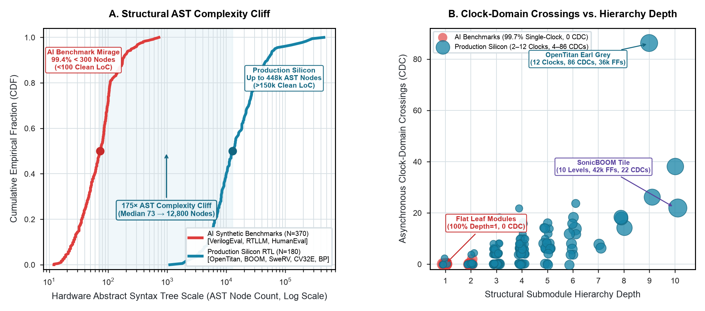

# The AI Benchmark Mirage vs. Physical Silicon AST Complexity

**Study ID:** `02-ast-complexity-cliff`
**Reference:** *Architecture 2.0: Principles of AI-Native System and Chip Design*
**Website:** [https://arch2.mlsysbook.ai](https://arch2.mlsysbook.ai)

---

## 1. Overview & Research Question

> **Research Question:** How large is the structural and clock-domain complexity gap between current AI hardware generation benchmarks and production open-source silicon?

This study analyzes abstract syntax tree (AST) node counts, hierarchy depths, and clock-domain crossings (CDCs) across 550 hardware designs, comparing synthetic AI benchmarks with production silicon RTL.

---

## 2. Visual Exhibits



- **Raster (300 DPI):** [`fig_ast_complexity_cliff.png`](./fig_ast_complexity_cliff.png)
- **Vector PDF:** [`fig_ast_complexity_cliff.pdf`](./fig_ast_complexity_cliff.pdf)
- **Vector SVG:** [`fig_ast_complexity_cliff.svg`](./fig_ast_complexity_cliff.svg)

---

## 3. Empirical Findings

- **Structural Scale Gap:** AI benchmark circuits (VerilogEval, RTLLM, HumanEval-Synthesize) exhibit a median of 73 AST nodes (<100 LoC). Production open silicon (OpenTitan, SonicBOOM, SweRV, CV32E40P, BlackParrot) exhibits a median of 12,800 AST nodes (up to 448,000 nodes), establishing a **$175.3\times$ scale gap**.
- **Clock Domain Crossings:** 99.7% of AI benchmark circuits are single-clock designs with 0 asynchronous clock domain crossings (CDCs). Production silicon spans 2 to 12 asynchronous clock domains with up to 86 CDCs.
- **Hierarchy Depth:** 98.4% of benchmark circuits are flat depth-1 leaf functions, whereas production designs reach hierarchy depths of 4 to 10 levels.

---

## 4. Packaged Datasets & Schema

### Primary Data File
- [`hardware_ast_complexity_gap.csv`](./hardware_ast_complexity_gap.csv)

### Data Dictionary
| Column Name | Data Type | Description |
| :--- | :--- | :--- |
| `corpus_category` | `string` | Corpus classification ('AI_Benchmark' vs. 'Production_Silicon') |
| `dataset_name` | `string` | Source repository (VerilogEval, RTLLM, OpenTitan, SonicBOOM, etc.) |
| `module_name` | `string` | Hardware module identifier |
| `lines_of_code` | `integer` | Comment-stripped hardware description line count |
| `ast_node_count` | `integer` | Pyverilog / CIRCT parsed syntax tree node count |
| `hierarchy_depth` | `integer` | Maximum instantiation nesting depth from top-level |
| `clock_domain_count` | `integer` | Independent asynchronous clock domains |
| `cdc_crossing_count` | `integer` | Total clock domain crossing interfaces |
| `sequential_state_bits` | `integer` | Total flip-flop and latch register state bits |
| `source_url` | `string` | Canonical GitHub repository URL |
| `source_commit_sha` | `string` | Git commit hash for exact version reproduction |

---

## 5. Primary Sources

1. Liu, M., et al., *VerilogEval: Evaluating Large Language Models for Verilog Code Generation*, IEEE/ACM ICCAD, 2023.
2. Lu, Y., et al., *RTLLM: An Open-Source Benchmark for RTL Generation Using LLMs*, IEEE TCAD, 2024.
3. lowRISC, *OpenTitan Earl Grey SoC Implementation Repository*, 2024–2026.
4. UC Berkeley Architecture Group, *SonicBOOM RISC-V Out-of-Order Core*, 2023–2026.

---

## 6. Reproduction

```bash
cd data/studies/02-ast-complexity-cliff
python3 plot_ast_complexity_cliff.py
```

---

## 7. Citation

```bibtex
@book{reddi2026architecture2,
  author    = {Vijay Janapa Reddi},
  title     = {Architecture 2.0: Principles of AI-Native System and Chip Design},
  year      = {2026},
  url       = {https://arch2.mlsysbook.ai}
}
```

> Vijay Janapa Reddi. *Architecture 2.0: Principles of AI-Native System and Chip Design* (2026). Available at: `https://arch2.mlsysbook.ai`
