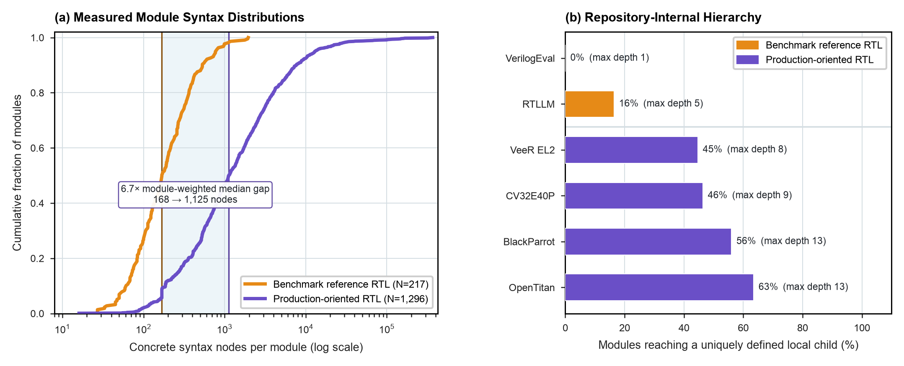

# Benchmark Reference RTL vs. Production-Oriented Open RTL

**Study ID:** `02-ast-complexity-cliff`
**Reference:** *Architecture 2.0: Principles of AI-Native System and Chip Design*
**Website:** [https://arch2.mlsysbook.ai](https://arch2.mlsysbook.ai)

---

## 1. Overview & Research Question

> **Research Question:** How large is the source-complexity and internal-hierarchy
> difference between the reference RTL shipped with AI hardware generation
> benchmarks and production-oriented open silicon RTL?

The study parses 1,513 SystemVerilog module declarations from six public
repositories at pinned commits, using `pyslang` 11.0.0 for a standalone,
error-recovered concrete syntax tree per file. Every row carries the file path
and SHA-256 of the source it came from.

> **Note on an earlier version.** This study previously reported a 175x gap from
> `hardware_ast_complexity_gap.csv`. That file was never measured. Its per-module
> values were literal tables inside its own generator, and the upstream commits
> in its header were hand-typed placeholders. It is retained, marked, at
> `data/synthetic/SYNTHETIC-hardware_ast_complexity_gap.csv`. The direction of
> the original claim survives; the magnitude did not.

---

## 2. Visual Exhibit



- **Raster (300 DPI):** [`fig_ast_complexity_measured.png`](./fig_ast_complexity_measured.png)
- **Vector PDF:** [`fig_ast_complexity_measured.pdf`](./fig_ast_complexity_measured.pdf)
- **Vector SVG:** [`fig_ast_complexity_measured.svg`](./fig_ast_complexity_measured.svg)

---

## 3. Empirical Findings

| Comparison | Benchmark | Production | Ratio |
| :--- | ---: | ---: | ---: |
| Median concrete syntax nodes per module | 168 | 1,125 | 6.70x |
| Median clean lines of code per module | 16 | 99 | 6.19x |
| Same, diagnostic-free files only | 141.5 | 675 | 4.77x |
| Same, equal weight per repository | 232 | 991 | 4.27x |

- **Source-complexity gap:** a module-weighted median of 168 concrete syntax
  nodes for benchmark reference RTL against 1,125 for production-oriented RTL,
  across 217 and 1,296 parsed modules.
- **The ratio depends on weighting, and both checks are reported.** The pooled
  6.7x is not offered as a universal ratio.
- **Hierarchy separates the corpora more sharply than size does.** No VerilogEval
  module instantiates another module in the corpus. RTLLM reaches a uniquely
  defined local child in 16% of its modules, to a maximum internal depth of 5.
  Production repositories reach one in 45% to 63% of modules, to a maximum
  internal depth of 13.
- **Clocking is a weaker signal than the earlier version claimed.** Multiple
  clock-like event signals appear in 5.1% of production modules against 0.5% of
  benchmark modules. This is a lexical indicator, not a verified clock domain
  and not a verified crossing.

---

## 4. Packaged Datasets & Schema

### Primary data files
- [`hardware_ast_complexity_measured.csv`](./hardware_ast_complexity_measured.csv) (1,513 module rows)
- [`hardware_ast_complexity_measured_sources.csv`](./hardware_ast_complexity_measured_sources.csv) (per-repository provenance)
- [`hardware_ast_complexity_measured_summary.json`](./hardware_ast_complexity_measured_summary.json) (aggregates and execution environment)

### Data dictionary, `hardware_ast_complexity_measured.csv`
| Column Name | Data Type | Description |
| :--- | :--- | :--- |
| `corpus_category` | `string` | `AI benchmark reference RTL` or `Production-oriented open RTL` |
| `dataset_name` | `string` | Source repository (VerilogEval, RTLLM, OpenTitan, CV32E40P, VeeR EL2, BlackParrot) |
| `repository_url` | `string` | Canonical repository URL |
| `repository_commit` | `string` | Full 40-character commit SHA, verified after checkout |
| `source_path` | `string` | Path of the parsed file within that repository |
| `source_sha256` | `string` | SHA-256 of the exact file contents parsed |
| `module_name` | `string` | Module declaration identifier |
| `clean_loc` | `integer` | Comment-stripped, blank-stripped line count |
| `concrete_syntax_nodes` | `integer` | `pyslang` concrete syntax tree node count for the module |
| `concrete_syntax_depth` | `integer` | Maximum syntax tree depth for the module |
| `syntax_diagnostic_count` | `integer` | Parser diagnostics on the containing file (retained, not excluded) |
| `syntax_diagnostic_codes` | `string` | Diagnostic codes emitted for that file |
| `syntax_tree_valid` | `bool` | Whether a tree was recovered without fatal error |
| `event_control_signal_count` | `integer` | Signals appearing in event control expressions |
| `clock_like_event_signal_count` | `integer` | Subset whose names match clock-like patterns (lexical) |
| `clock_like_event_signals` | `string` | Those signal names |
| `recognized_cdc_primitive_mentions` | `integer` | Mentions of known synchronizer primitives (lexical) |
| `hierarchy_instantiation_count` | `integer` | Module instantiations found in the module body |
| `resolved_internal_submodule_instantiations` | `integer` | Instantiations whose child name has exactly one definition in the corpus |
| `ambiguous_internal_submodule_instantiations` | `integer` | Instantiations with duplicate or unresolved child definitions, not followed |
| `internal_hierarchy_depth` | `integer` | Depth through resolved children only; a lower bound on elaborated depth |
| `extraction_timestamp` | `string` | When the run happened; the only column that varies between reruns |

---

## 5. Primary Sources

1. Liu, M., et al., *VerilogEval: Evaluating Large Language Models for Verilog Code Generation*, IEEE/ACM ICCAD, 2023.
2. Lu, Y., et al., *RTLLM: An Open-Source Benchmark for RTL Generation Using LLMs*, IEEE TCAD, 2024.
3. lowRISC, *OpenTitan*, `e3f3234aa3772760cdf40e79a8ae4471b6b02213`.
4. OpenHW Group, *CV32E40P*, `6033d2b1be3295ec774d17ac4cf226faacfdeb08`.
5. CHIPS Alliance, *VeeR EL2 (Cores-SweRV)*, `d04b1c7ae675a63dc4307cacfd10547ec937b928`.
6. BlackParrot, *BlackParrot RISC-V multicore*, `f91010f654a5dfd00f83dbe25dbda482218d540b`.

---

## 6. Reproduction

Full instructions, pinned dependencies, expected output, and the stated
boundaries of the measurement are in [`REPRODUCE.md`](./REPRODUCE.md).

```bash
python3 -m venv .venv-ast
.venv-ast/bin/pip install -r data/studies/02-ast-complexity-cliff/requirements.txt
.venv-ast/bin/python data/scrapers/mine_hardware_ast_complexity_real.py \
    --output-dir data/studies/02-ast-complexity-cliff
.venv-ast/bin/python data/studies/02-ast-complexity-cliff/plot_ast_complexity_measured.py
```

Verified 2026-09-03: all 1,513 rows reproduce byte-for-byte except
`extraction_timestamp`, on a different Python minor version from the recorded run.

---

## 7. Citation

```bibtex
@book{reddi2026architecture2,
  author    = {Vijay Janapa Reddi},
  title     = {Architecture 2.0: Principles of AI-Native System and Chip Design},
  year      = {2026},
  url       = {https://arch2.mlsysbook.ai}
}
```

> Vijay Janapa Reddi. *Architecture 2.0: Principles of AI-Native System and Chip Design* (2026). Available at: `https://arch2.mlsysbook.ai`
