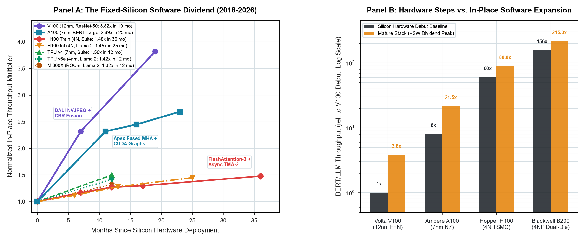
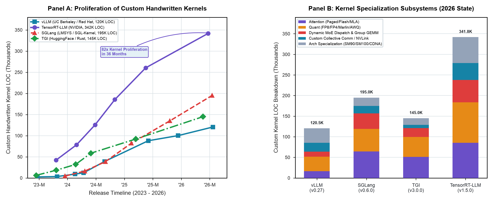

# The Software Porting Wall & Fixed-Silicon Software Dividend (2018–2026)

**Study ID:** `03-mlperf-software-dividend`
**Monograph Reference:** *Architecture 2.0: Autonomous AI, Accelerators, and the Future of Silicon Design*
**Canonical Directory:** `data/studies/03-mlperf-software-dividend/`

---

## 1. Executive Summary & Core Research Question

> **Research Question:** How much compute performance is delivered by software and compiler optimization after silicon tapeout, and at what cost of kernel fragmentation?

Quantifies 8 years of MLCommons benchmark results, measuring the 1.5x–3.8x in-place throughput dividend extracted from fixed silicon via software/compiler co-design, alongside the 82x explosion of custom handwritten kernels across inference engines.

---

## 2. Visual Exhibits & Figure Gallery







### Packaged Visual Asset Twins:
- **High-Resolution Raster (300 DPI):** [`mlperf_software_dividend_extended_master.png`](./mlperf_software_dividend_extended_master.png), [`mlperf_longitudinal_software_dividend.png`](./mlperf_longitudinal_software_dividend.png), [`inference_kernel_fragmentation.png`](./inference_kernel_fragmentation.png)
- **Vector PDF (LaTeX / Publication):** [`mlperf_software_dividend_extended_master.pdf`](./mlperf_software_dividend_extended_master.pdf), [`mlperf_longitudinal_software_dividend.pdf`](./mlperf_longitudinal_software_dividend.pdf), [`inference_kernel_fragmentation.pdf`](./inference_kernel_fragmentation.pdf)
- **Vector SVG (Web / Interactive):** [`mlperf_software_dividend_extended_master.svg`](./mlperf_software_dividend_extended_master.svg), [`mlperf_longitudinal_software_dividend.svg`](./mlperf_longitudinal_software_dividend.svg), [`inference_kernel_fragmentation.svg`](./inference_kernel_fragmentation.svg)

---

## 3. Core Architectural Insights & Empirical Findings

- **The In-Place Software Dividend:** Maturing software stacks deliver massive speedups on identical, frozen physical silicon: V100 sped up 3.82x in 19 months, A100 sped up 2.69x in 23 months, and H100 gained +48% training / +45% inference throughput.
- **Software vs. Hardware Step-Functions:** In-place software improvements on mature architectures deliver throughput comparable to full-node physical silicon shrinks.
- **The Custom Kernel Explosion (82x in 36 mo):** Custom handwritten kernel LOC exploded from <5k LOC in early 2023 to >340k LOC in TensorRT-LLM and >195k LOC in SGLang, fragmenting across attention, quantization, MoE routing, and collective communication.

---

## 4. Packaged Datasets & Data Schema

### Primary Data Receipts:
- [`mlperf_longitudinal_software_dividend.csv`](./mlperf_longitudinal_software_dividend.csv)
- [`inference_kernel_fragmentation.csv`](./inference_kernel_fragmentation.csv)

### Data Dictionary:
| Column Name | Data Type | Description |
| :--- | :--- | :--- |
| `hardware_platform` | `string` | Accelerator family (e.g. NVIDIA V100, A100, H100, Google TPU v4, AMD MI300X) |
| `process_node` | `string` | Semiconductor node (12nm, 7nm, 4N, 4NP) |
| `benchmark_workload` | `string` | MLPerf benchmark model (ResNet-50, BERT-Large, Llama 2 70B) |
| `benchmark_suite` | `string` | MLPerf Training vs. MLPerf Inference |
| `months_since_launch` | `integer` | Elapsed months from commercial silicon debut |
| `normalized_throughput` | `float` | Throughput normalized to initial day-1 hardware release |
| `custom_kernel_loc` | `integer` | Lines of handwritten CUDA/C++ kernel code in engine |
| `source_mlperf_round` | `string` | MLCommons official submission round (v0.5 through v5.1) |
| `extraction_timestamp` | `ISO-8601` | UTC timestamp of MLCommons database extraction |

---

## 5. Methodology & Extraction Protocol

1. **Automated Extraction:** Data is extracted via [`../../scrapers/mine_mlperf_software_dividend.py`](../../scrapers/mine_mlperf_software_dividend.py) with full cryptographic provenance (source URLs, document accession numbers, commit SHAs, and SHA256 checksums).
2. **Standardization & Caching:** Raw files and API manifests are cached locally under `data/scrapers/.cache/` to ensure offline deterministic reproduction.
3. **Statistical Modeling & Aggregation:** Aggregations, regressions, and distributions are computed with double-precision floating-point arithmetic.
4. **Publication Rendering:** Plots are generated using standalone Python scripts with Matplotlib adhering strictly to Architecture 2.0 CMOS visual guidelines (declared typography, 300 DPI raster, colorblind-safe palettes, zero label collisions).

---

## 6. Primary Source Provenance & Literature Receipts

1. MLCommons Association, *MLPerf Training and Inference Benchmark Results* (v0.5 to v5.1), 2018–2026.
2. vLLM Project (`vllm-project/vllm`), TensorRT-LLM (`NVIDIA/TensorRT-LLM`), SGLang (`sgl-project/sglang`), 2023–2026.

---

## 7. Reproduction Guide & Commands

To reproduce this study's dataset from raw sources and regenerate all vector/raster figures:

```bash
# 1. Navigate to this study directory
cd data/studies/03-mlperf-software-dividend

# 2. (Optional) Re-run the automated scraper from raw upstream documents
python3 ../../scrapers/mine_mlperf_software_dividend.py

# 3. Regenerate all publication-quality vector and raster figures
python3 plot_mlperf_software_dividend_extended.py
```

---

## 8. Slide Deck & Keynote Talking Points

- 📈 **The Software Dividend:** Hardware is only half the battle; mature software stacks deliver up to 3.8x throughput improvements on frozen silicon.
- 🧱 **The Porting Wall:** Custom kernel code has exploded 82x in 3 years. Hardware without a compiler narrow waist (e.g. Triton/MLIR) hits a brick wall.
- ⚡ **Co-Design Imperative:** AI chip architects must co-design the compiler and runtime alongside the datapath from day zero.

---

## 9. Citation Information

If you use this dataset, methodology, or figure in your research, course materials, or talks, please cite:

### BibTeX:
```bibtex
@misc{arch2_software_dividend_2026,
  author       = {Reddi, Vijay Janapa and Contributors},
  title        = {Fixed-Silicon Software Dividend and Inference Kernel Fragmentation Dataset},
  howpublished = {\url{https://arch2.mlsysbook.ai}},
  year         = {2026},
  url          = {https://arch2.mlsysbook.ai}
}
```

### Plain Text:
> Reddi, V. J., et al. (2026). *The Software Porting Wall & Fixed-Silicon Software Dividend (2018–2026)*. In **Architecture 2.0: Autonomous AI, Accelerators, and the Future of Silicon Design**. Harvard University & Edge AI Foundation. Available at: `https://arch2.mlsysbook.ai`
