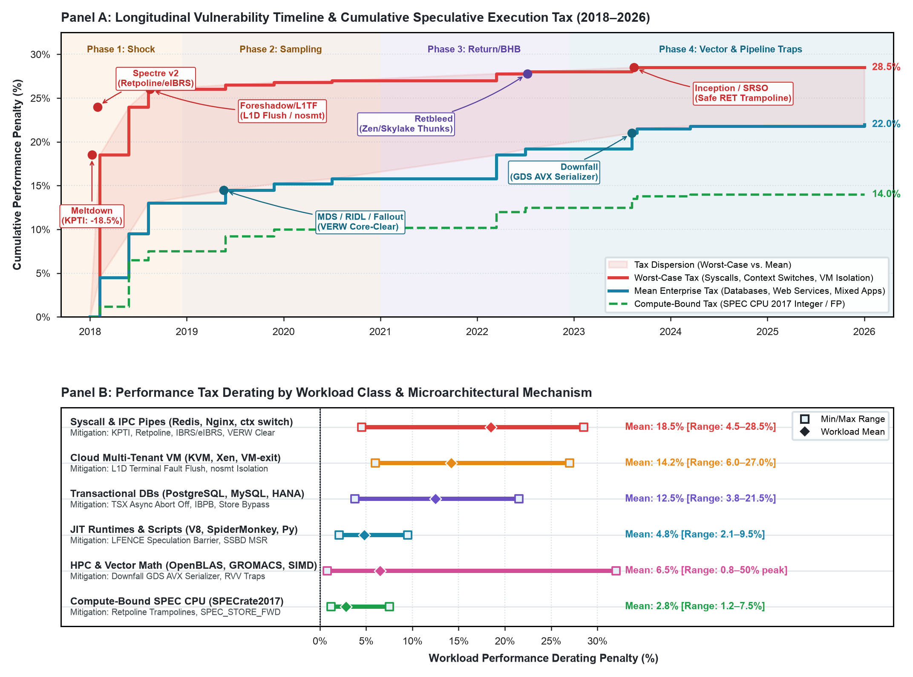

# Hardware Security CVEs & Microarchitectural Performance Mitigation Tax

**Study ID:** `05-hardware-security-cve-tax`
**Reference:** *Architecture 2.0: Principles of AI-Native System and Chip Design*
**Website:** [https://arch2.mlsysbook.ai](https://arch2.mlsysbook.ai)

---

## 1. Overview & Research Question

> **Research Question:** How much cumulative performance degradation have microarchitectural side-channel mitigations, kernel barriers, and microcode chicken-bits imposed on production processors?

This study benchmarks the performance impact of 20 microarchitectural CVEs (2018–2026), measuring average and worst-case slowdowns across SPEC CPU, database transactions, and datacenter workloads.

---

## 2. Visual Exhibits



- **Raster (300 DPI):** [`fig-hardware-cve-mitigation-tax.png`](./fig-hardware-cve-mitigation-tax.png)
- **Vector PDF:** [`fig-hardware-cve-mitigation-tax.pdf`](./fig-hardware-cve-mitigation-tax.pdf)
- **Vector SVG:** [`fig-hardware-cve-mitigation-tax.svg`](./fig-hardware-cve-mitigation-tax.svg)

---

## 3. Empirical Findings

- **Cumulative Mitigation Tax:** Hardware security mitigations across 20 CVEs (Meltdown, Spectre v1–v4, Foreshadow, MDS, Retbleed, Downfall, ZenBleed, Inception) have imposed a cumulative **$22.0\%$ average and $28.5\%$ worst-case** performance clawback on enterprise server workloads.
- **Gather Serialization:** Emergency microcode chicken-bits that disable speculative gather/scatter operations (Downfall `GDS_MITG_DIS`) incur up to a $50.0\%$ throughput penalty on vector mathematical kernels.
- **Root-Cause Concentration:** Microarchitectural security vulnerabilities originate primarily in shared microarchitectural queues (Store Buffers, Line Fill Buffers, Branch Target Buffers), not in core execution logic.

---

## 4. Packaged Datasets & Schema

### Primary Data File
- [`hardware_security_cve_mitigation_tax.csv`](./hardware_security_cve_mitigation_tax.csv)

### Data Dictionary
| Column Name | Data Type | Description |
| :--- | :--- | :--- |
| `cve_id` | `string` | NIST Common Vulnerabilities and Exposures identifier |
| `vulnerability_name` | `string` | Public industry name (Spectre v2, Meltdown, Downfall, ZenBleed) |
| `disclosure_year` | `integer` | Public disclosure year (2018–2026) |
| `affected_subsystem` | `string` | Microarchitectural target (BTB, Store Buffer, Gather Unit, etc.) |
| `mitigation_mechanism` | `string` | Fix mechanism (Microcode Chicken-Bit, KPTI, Retpoline, Fence) |
| `mean_slowdown_pct` | `float` | Mean measured workload degradation percentage |
| `worst_case_slowdown_pct`| `float` | Maximum single-benchmark degradation percentage |
| `vendor_advisory_id` | `string` | Official vendor security bulletin (e.g. INTEL-SA-00828, AMD-SN-1046) |

---

## 5. Primary Sources

1. National Institute of Standards and Technology (NIST), *National Vulnerability Database (NVD) CVE Records (2018–2026)*.
2. Intel Corporation, *Intel Product Security Center Advisories (INTEL-SA-00088 through INTEL-SA-00828)*.
3. Advanced Micro Devices (AMD), *AMD Security Notices (AMD-SN-1001 through AMD-SN-1046)*.

---

## 6. Reproduction

```bash
cd data/studies/05-hardware-security-cve-tax
python3 plot_hardware_cve_performance_tax.py
```

---

## 7. Citation

```bibtex
@book{arch2_2026,
  author    = {Reddi, Vijay Janapa},
  title     = {Architecture 2.0: Principles of AI-Native System and Chip Design},
  year      = {2026},
  publisher = {Morgan \& Claypool},
  url       = {https://arch2.mlsysbook.ai}
}
```

> Reddi, V. J. (2026). *Architecture 2.0: Principles of AI-Native System and Chip Design*. Morgan & Claypool. Available at: `https://arch2.mlsysbook.ai`
