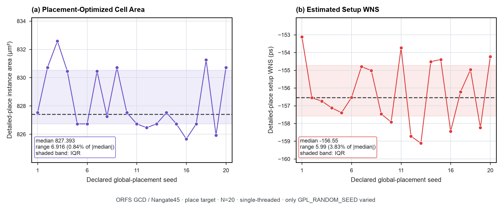

# Placement Seed Dispersion in OpenROAD (Measured Pilot)

**Study ID:** `06-eda-seed-dispersion`
**Reference:** *Architecture 2.0: Principles of AI-Native System and Chip Design*
**Canonical Directory:** `data/studies/06-eda-seed-dispersion/`

---

## 1. Overview & Core Research Question

> **Research Question:** What is the natural quality-of-results (QoR) variance of physical EDA tools across random placement seeds, and are published single-seed AI gains statistically distinguishable from seed noise?

This study measures instance area and setup timing slack dispersion across 20 physical placement runs in OpenROAD (pinned container digest) on the GCD benchmark with the Nangate45 cell library, varying only the global placement seed (`GPL_RANDOM_SEED` 1–20) on identical RTL and floorplan.

---

## 2. Visual Exhibits & Figure Gallery



### Packaged Visual Asset Twins:
- **High-Resolution Raster (300 DPI):** [`fig_openroad_gcd_placement_seed_pilot.png`](./fig_openroad_gcd_placement_seed_pilot.png)
- **Vector PDF (LaTeX / Publication):** [`fig_openroad_gcd_placement_seed_pilot.pdf`](./fig_openroad_gcd_placement_seed_pilot.pdf)
- **Vector SVG (Web / Interactive):** [`fig_openroad_gcd_placement_seed_pilot.svg`](./fig_openroad_gcd_placement_seed_pilot.svg)

---

## 3. Core Architectural Insights & Empirical Findings

- **Measured Placement Seed Dispersion:** Across twenty runs of GCD on Nangate45 through a digest-pinned OpenROAD container, varying only `GPL_RANDOM_SEED`: instance area moves 0.84% (median 827.39 $\mu\text{m}^2$, span 825.66 to 832.58 $\mu\text{m}^2$) and setup worst negative slack (WNS) moves 3.83% (median -156.55 ps, span 5.99 ps).
- **Single-Sample Limit:** A single-run timing or area improvement smaller than the natural seed dispersion envelope cannot be distinguished from stochastic noise. One tool run is a sample, not a measurement.
- **Claim Boundary:** Evaluated on one design (GCD), one PDK (Nangate45), and the placement flow stage. It bounds nondeterminism for this case and must not be cited as a universal magnitude. (The earlier 684-run synthetic file was quarantined in `data/synthetic/`).

---

## 4. Packaged Datasets & Data Schema

### Primary Data Receipt:
- [`openroad_gcd_placement_seed_pilot.csv`](./openroad_gcd_placement_seed_pilot.csv)
- [`openroad_gcd_placement_seed_pilot_summary.json`](./openroad_gcd_placement_seed_pilot_summary.json)

### Data Dictionary:
| Column Name | Data Type | Description |
| :--- | :--- | :--- |
| `seed` | `integer` | Declared placement seed value (1–20) |
| `globalplace_instance_area_um2` | `float` | Standard cell area after global placement ($\mu\text{m}^2$) |
| `globalplace_setup_wns_ns` | `float` | Setup worst negative slack after global placement (ns) |
| `globalplace_setup_tns_ns` | `float` | Setup total negative slack after global placement (ns) |
| `detailedplace_instance_area_um2` | `float` | Standard cell area after detailed placement ($\mu\text{m}^2$) |
| `detailedplace_setup_wns_ns` | `float` | Setup worst negative slack after detailed placement (ns) |
| `detailedplace_setup_tns_ns` | `float` | Setup total negative slack after detailed placement (ns) |
| `floorplan_odb_sha256` | `hex string` | SHA-256 hash of input floorplan ODB database |
| `placement_odb_sha256` | `hex string` | SHA-256 hash of output placed ODB database |
| `stdout_receipt` | `filepath` | Relative path to retained execution stdout log |
| `extraction_timestamp` | `ISO-8601` | Timestamp of run execution and log extraction |

---

## 5. Primary Sources

1. The OpenROAD Project (OpenROAD-flow-scripts), commit `8359fde`.
2. Nangate Inc., Nangate 45nm Open Cell Library, 2008.

---

## 6. Reproduction Guide

```bash
cd data/studies/06-eda-seed-dispersion
python3 plot_openroad_gcd_placement_seed_pilot.py
```

---

## 7. Citation

```bibtex
@misc{arch2_openroad_seed_pilot_2026,
  author       = {Reddi, Vijay Janapa and Contributors},
  title        = {OpenROAD GCD Placement Seed Dispersion Measured Pilot Dataset},
  howpublished = {Architecture 2.0 Empirical Data Repository},
  year         = {2026},
  url          = {https://github.com/harvard-edge/arch2/tree/dev/data/studies/06-eda-seed-dispersion}
}
```
