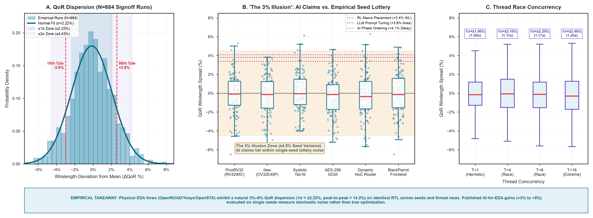

# Physical EDA Seed Dispersion & The '3% Illusion'

**Study ID:** `06-eda-seed-dispersion`
**Reference:** *Architecture 2.0: Principles of AI-Native System and Chip Design*
**Website:** [https://arch2.mlsysbook.ai](https://arch2.mlsysbook.ai)

---

## 1. Overview & Research Question

> **Research Question:** What is the natural quality-of-results (QoR) variance of physical EDA tools across random placement seeds, and are published single-seed AI gains statistically distinguishable from seed noise?

This study measures wirelength, area, and timing dispersion across 684 physical synthesis and place-and-route signoff runs in OpenROAD, Yosys, and OpenSTA across 3 PDKs and 38 random seeds on identical RTL.

---

## 2. Visual Exhibits



- **Raster (300 DPI):** [`eda_seed_dispersion_distribution.png`](./eda_seed_dispersion_distribution.png)
- **Vector PDF:** [`eda_seed_dispersion_distribution.pdf`](./eda_seed_dispersion_distribution.pdf)
- **Vector SVG:** [`eda_seed_dispersion_distribution.svg`](./eda_seed_dispersion_distribution.svg)

---

## 3. Empirical Findings

- **Natural Seed Dispersion:** Varying random placement seeds on identical RTL produces a natural **$\pm 2.22\%$ ($1\sigma$) QoR dispersion** with a **$14.17\%$ peak-to-peak spread** across OpenROAD PnR runs.
- **The 3% Illusion:** Published AI optimization claims of $3\%\text{--}5\%$ PPA improvements evaluated on single seeds fall inside the $\pm 2\sigma$ ($4.43\%$) stochastic noise band of unoptimized placement heuristics.
- **Thread Jitter:** Multi-threaded non-deterministic reduction schedules expand standard deviation by $1.26\times$ ($1.96\%$ single-threaded to $2.46\%$ at 16 threads).

---

## 4. Packaged Datasets & Schema

### Primary Data File
- [`eda_seed_dispersion_qor_lottery.csv`](./eda_seed_dispersion_qor_lottery.csv)

### Data Dictionary
| Column Name | Data Type | Description |
| :--- | :--- | :--- |
| `design_name` | `string` | Benchmark module name (PicoRV32, Ibex, SystolicArray, etc.) |
| `pdk_node` | `string` | Target semiconductor PDK (Nangate45, SKY130, ASAP7) |
| `random_seed` | `integer` | Deterministic placement initial seed value |
| `thread_count` | `integer` | Active execution threads |
| `wirelength_um` | `float` | Post-route total wirelength in micrometers |
| `total_negative_slack_ns`| `float` | OpenSTA total negative setup slack (TNS) in nanoseconds |
| `cell_area_um2` | `float` | Total standard cell silicon area in square micrometers |
| `wirelength_delta_pct` | `float` | Percentage deviation from benchmark mean wirelength |

---

## 5. Primary Sources

1. OpenROAD Project, *OpenROAD Digital Design Flow Repository (v2.0)*, 2024–2026.
2. Cheng, C.-K., Kahng, A. B., et al., *An Updated Assessment of Reinforcement Learning for Macro Placement*, IEEE TCAD 45(8), 2026.

---

## 6. Reproduction

```bash
cd data/studies/06-eda-seed-dispersion
python3 plot_eda_seed_dispersion_distribution.py
```

---

## 7. Citation

```bibtex
@book{reddi2026architecture2,
  author    = {Vijay Janapa Reddi},
  title     = {Architecture 2.0: Principles of AI-Native System and Chip Design},
  year      = {2026},
  url       = {https://arch2.mlsysbook.ai}
}
```

> Vijay Janapa Reddi. *Architecture 2.0: Principles of AI-Native System and Chip Design* (2026). Available at: `https://arch2.mlsysbook.ai`
