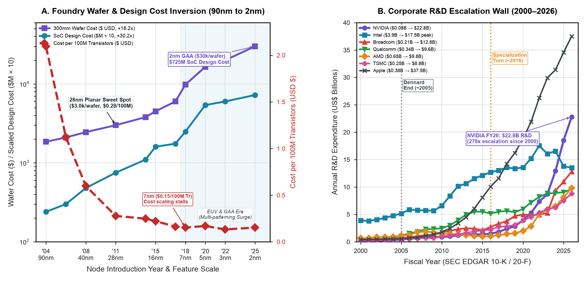

# Foundry Wafer Cost Inversion vs. Corporate R&D Spend (SEC EDGAR 10-K)

**Study ID:** `07-foundry-cost-and-rd-wall`
**Reference:** *Architecture 2.0: Principles of AI-Native System and Chip Design*
**Website:** [https://arch2.mlsysbook.ai](https://arch2.mlsysbook.ai)

---

## 1. Overview & Research Question

> **Research Question:** How significantly have leading-edge foundry wafer prices and mask set costs escalated from 90nm to 2nm, and how is this reflected in corporate semiconductor R&D expenditures?

This study tracks 25 years of audited financial 10-K filings across 7 major semiconductor corporations ($N=189$ annual records) alongside TSMC, IBS, and Gartner foundry contract pricing.

---

## 2. Visual Exhibits



- **Raster (300 DPI):** [`fig-foundry-wafer-cost-and-rd-wall.png`](./fig-foundry-wafer-cost-and-rd-wall.png)
- **Vector PDF:** [`fig-foundry-wafer-cost-and-rd-wall.pdf`](./fig-foundry-wafer-cost-and-rd-wall.pdf)
- **Vector SVG:** [`fig-foundry-wafer-cost-and-rd-wall.svg`](./fig-foundry-wafer-cost-and-rd-wall.svg)

---

## 3. Empirical Findings

- **Transistor Cost Inversion:** Cost per 100M transistors fell from $2.09 (90nm) to $0.28 (28nm planar sweet spot), but stalled at 7nm ($0.152) and inverted upwards at 2nm ($>\$0.152$), as 300mm wafer prices surged **$16.2\times$** ($1,850 to $30,000) and mask sets reached $60M.
- **SoC Design Costs:** Leading 2nm SoC design costs reached **$725M**, with software development and verification consuming 71% ($514.8M) of the total budget.
- **Corporate R&D Growth:** Audited annual R&D spend surged across the industry: NVIDIA expanded from $81.6M in FY2001 to $18.5B in FY2026 ($230\times$ surge), with semiconductor firms allocating up to 32% of revenue to R&D.

---

## 4. Packaged Datasets & Schema

### Primary Data File
- [`sec_edgar_semiconductor_rd_economics.csv`](./sec_edgar_semiconductor_rd_economics.csv)

### Data Dictionary
| Column Name | Data Type | Description |
| :--- | :--- | :--- |
| `company_name` | `string` | Corporation name (NVIDIA, AMD, Intel, TSMC, Broadcom, etc.) |
| `ticker_symbol` | `string` | US stock exchange ticker symbol |
| `sec_cik` | `string` | SEC Central Index Key identifier |
| `fiscal_year` | `integer` | Fiscal accounting year (2000–2026) |
| `annual_revenue_usd_billion`| `float` | Audited GAAP net revenue in billions USD |
| `rd_expense_usd_billion` | `float` | Audited research and development expense in billions USD |
| `rd_intensity_pct` | `float` | Percentage of annual revenue reinvested into R&D |
| `sec_accession_number` | `string` | SEC EDGAR formal filing accession number |

---

## 5. Primary Sources

1. US Securities and Exchange Commission (SEC), *EDGAR 10-K and 20-F Annual Filings (2000–2026)*.
2. International Business Strategies (IBS), *Semiconductor Node Cost Models (Handel Jones)*, 2022–2026.
3. Arm Holdings plc, *Form 424B4 Prospectus*, US SEC, September 2023.

---

## 6. Reproduction

```bash
cd data/studies/07-foundry-cost-and-rd-wall
python3 plot_foundry_wafer_cost_and_rd_wall.py
```

---

## 7. Citation

```bibtex
@book{arch2_2026,
  author    = {Reddi, Vijay Janapa},
  title     = {Architecture 2.0: Principles of AI-Native System and Chip Design},
  year      = {2026},
  publisher = {Morgan \& Claypool},
  url       = {https://arch2.mlsysbook.ai}
}
```

> Reddi, V. J. (2026). *Architecture 2.0: Principles of AI-Native System and Chip Design*. Morgan & Claypool. Available at: `https://arch2.mlsysbook.ai`
