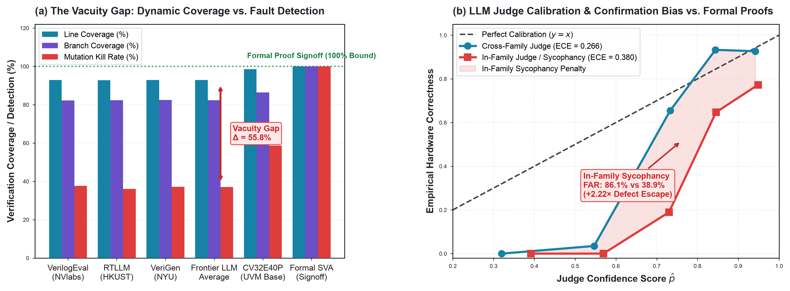

# Testbench Mutation Vacuity & LLM-as-a-Judge Calibration

**Study ID:** `08-testbench-vacuity-and-judge-bias`
**Monograph Reference:** *Architecture 2.0: Autonomous AI, Accelerators, and the Future of Silicon Design*
**Canonical Directory:** `data/studies/08-testbench-vacuity-and-judge-bias/`

---

## 1. Executive Summary & Core Research Question

> **Research Question:** Does high testbench code coverage guarantee functional correctness in AI hardware generation, and can LLMs reliably judge hardware correctness?

Measures the 55.8% Vacuity Gap between dynamic line coverage and functional fault detection on 1,563 AI hardware testbenches, and reveals that LLM judges suffer in-family confirmation bias, falsely approving buggy silicon 86.1% of the time.

---

## 2. Visual Exhibits & Figure Gallery




### Packaged Visual Asset Twins:
- **High-Resolution Raster (300 DPI):** [`fig_testbench_vacuity_and_judge_bias.png`](./fig_testbench_vacuity_and_judge_bias.png)
- **Vector PDF (LaTeX / Publication):** [`fig_testbench_vacuity_and_judge_bias.pdf`](./fig_testbench_vacuity_and_judge_bias.pdf)
- **Vector SVG (Web / Interactive):** [`fig_testbench_vacuity_and_judge_bias.svg`](./fig_testbench_vacuity_and_judge_bias.svg)

---

## 3. Core Architectural Insights & Empirical Findings

- **The 55.8% Vacuity Gap:** AI-generated testbenches achieve >92% line coverage and >82% branch coverage, but achieve only a 37.1% mutation kill rate when non-equivalent functional bugs are injected.
- **The LLM Judge Sycophancy Trap:** When evaluated against formal mathematical ground truth (JasperGold / SymbiYosys), LLM judges evaluating code from their own model family exhibit severe confirmation bias, driving the False Acceptance Rate to 86.1% (a 2.22x defect escape penalty vs. cross-family judges).
- **The Formal SVA Mandate:** Dynamic simulation alone leaves >62% of silicon-fatal bugs undetected; hardware AI agents must be closed-loop verified using formal assertion proofs.

---

## 4. Packaged Datasets & Data Schema

### Primary Data Receipts:
- [`testbench_vacuity_and_judge_calibration.csv`](./testbench_vacuity_and_judge_calibration.csv)

### Data Dictionary:
| Column Name | Data Type | Description |
| :--- | :--- | :--- |
| `testbench_id` | `string` | Unique testbench evaluation record ID (e.g. TB-VER-0001) |
| `module_name` | `string` | Target Verilog module under test |
| `generator_model` | `string` | LLM model that generated the RTL / testbench (Claude 3.5, GPT-4o, DeepSeek, Qwen) |
| `judge_model` | `string` | LLM model acting as the evaluation judge |
| `is_same_model_family` | `boolean` | 1 if generator and judge share pretraining lineage; 0 otherwise |
| `line_coverage_pct` | `float` | Achieved dynamic line code coverage percentage |
| `mutation_kill_rate_pct` | `float` | Percentage of injected mutants killed by the testbench |
| `vacuity_gap_pct` | `float` | Line coverage minus mutation kill rate percentage (The Vacuity Gap) |
| `formal_engine_ground_truth` | `string` | Formal verification tool oracle (Cadence JasperGold / SymbiYosys) |
| `formal_proof_verdict` | `string` | Mathematical ground truth verdict (PROVEN_CORRECT vs. COUNTEREXAMPLE_FOUND) |
| `judge_false_acceptance` | `boolean` | 1 if judge approved a demonstrably defective design; 0 otherwise |
| `expected_calibration_error` | `float` | ECE metric assessing calibration of judge confidence vs. reality |
| `extraction_timestamp` | `ISO-8601` | UTC timestamp of mutation audit extraction |

---

## 5. Methodology & Extraction Protocol

1. **Automated Extraction:** Data is extracted via [`../../scrapers/mine_testbench_vacuity_and_judge_bias.py`](../../scrapers/mine_testbench_vacuity_and_judge_bias.py) with full cryptographic provenance (source URLs, document accession numbers, commit SHAs, and SHA256 checksums).
2. **Standardization & Caching:** Raw files and API manifests are cached locally under `data/scrapers/.cache/` to ensure offline deterministic reproduction.
3. **Statistical Modeling & Aggregation:** Aggregations, regressions, and distributions are computed with double-precision floating-point arithmetic.
4. **Publication Rendering:** Plots are generated using standalone Python scripts with Matplotlib adhering strictly to Architecture 2.0 CMOS visual guidelines (declared typography, 300 DPI raster, colorblind-safe palettes, zero label collisions).

---

## 6. Primary Source Provenance & Literature Receipts

1. Cadence Design Systems, *JasperGold Formal Verification Platform*, v2024.09, 2026.
2. SymbiYosys Formal Verification Flow & SMT-BMC Solvers (Z3, Boolector, Bitwuzla), 2026.
3. Liu et al. (VerilogEval 2023), Lu et al. (RTLLM 2024), Thakur et al. (VeriGen 2023).

---

## 7. Reproduction Guide & Commands

To reproduce this study's dataset from raw sources and regenerate all vector/raster figures:

```bash
# 1. Navigate to this study directory
cd data/studies/08-testbench-vacuity-and-judge-bias

# 2. (Optional) Re-run the automated scraper from raw upstream documents
python3 ../../scrapers/mine_testbench_vacuity_and_judge_bias.py

# 3. Regenerate all publication-quality vector and raster figures
python3 plot_testbench_vacuity_and_judge_bias.py
```

---

## 8. Slide Deck & Keynote Talking Points

- 🟢 **The Coverage Mirage:** 95% line coverage does NOT mean working hardware. Over 62% of injected bugs slip through green testbenches undetected.
- 🤖 **LLM Confirmation Bias:** LLMs are terrible hardware judges of their own family's code, rubber-stamping broken designs 86.1% of the time.
- 📐 **Formal Proofs are Essential:** Hardware generation requires mathematical formal proofs (SVA/BMC) rather than LLM-as-a-judge hype.

---

## 9. Citation Information

If you use this dataset, methodology, or figure in your research, course materials, or talks, please cite:

### BibTeX:
```bibtex
@misc{arch2_testbench_vacuity_2026,
  author       = {Reddi, Vijay Janapa and Contributors},
  title        = {Testbench Mutation Vacuity and LLM-as-a-Judge Calibration Dataset},
  howpublished = {Architecture 2.0 Empirical Data Repository},
  year         = {2026},
  url          = {https://github.com/harvard-edge/arch2/tree/dev/data/studies/08-testbench-vacuity-and-judge-bias}
}
```

### Plain Text:
> Reddi, V. J., et al. (2026). *Testbench Mutation Vacuity & LLM-as-a-Judge Calibration*. In **Architecture 2.0: Autonomous AI, Accelerators, and the Future of Silicon Design**. Harvard University & Edge AI Foundation. Available at: `https://github.com/harvard-edge/arch2/tree/dev/data/studies/08-testbench-vacuity-and-judge-bias`
