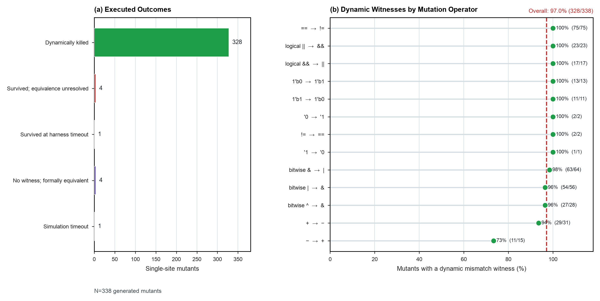

# Study 08: Executed VerilogEval Mutation Pilot

**Study ID:** `08-testbench-vacuity-and-judge-bias` (folder name kept for link stability)

This folder holds one executed, bounded measurement: single-site token mutants
of VerilogEval reference designs, run against VerilogEval's own
reference-comparison testbenches with Icarus Verilog, with a Yosys equivalence
diagnostic on mutants that produce no mismatch. Method, scope, and the full
result are in [`MEASURED-PILOT.md`](./MEASURED-PILOT.md).

An earlier study with this folder name reported coverage-versus-kill-rate and
LLM-judge-bias numbers. Those numbers came from a random number generator, not
from any tool run. They were withdrawn on 3 September 2026 and their data,
generator, plot script, and figures were deleted on 29 September 2026. Nothing
in this folder supports a claim about line coverage, AI-generated testbenches,
LLM judges, or formal detection rates.

## Result

Of 338 generated mutants across 107 modules, 328 (97.0%) produce a dynamic
mismatch witness. See `MEASURED-PILOT.md` for the denominator rules and the
claim boundary.

## Files

| File | Contents |
| --- | --- |
| `verilog_eval_mutation_pilot.csv` | One row per generated mutant: source hashes, mutation site, tool return codes, mismatch counts, classification, compact tool output |
| `verilog_eval_mutation_pilot_baselines.csv` | One row per reference/testbench pair: unmutated baseline status |
| `verilog_eval_mutation_pilot_summary.json` | Run summary, tool versions, pinned VerilogEval commit, miner SHA-256 |
| `plot_verilog_eval_mutation_pilot.py` | Plots the figure from the CSV |
| `fig_verilog_eval_mutation_pilot.{png,pdf,svg}` | The figure |

Generating harness: `data/scrapers/mine_verilog_eval_mutation_pilot.py`
(its SHA-256 matches `miner_sha256` in the summary).

## Verification record

Re-run on 29 September 2026 against VerilogEval commit
`c498220d0a52248f8e3fdffe279075215bde2da6` with Icarus Verilog 13.0 and
Yosys 0.67+post on the first 25 modules: all 25 baseline rows and all 22
mutant rows reproduced exactly (source, testbench, and mutant hashes,
mismatch counts, sample counts, classifications). The 328 of 338 headline
recomputes from the retained CSV.
