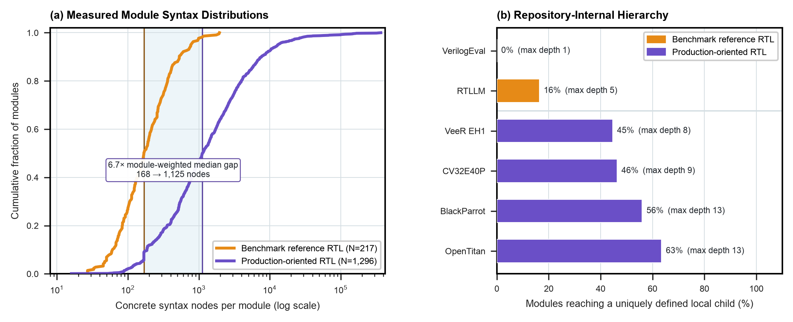
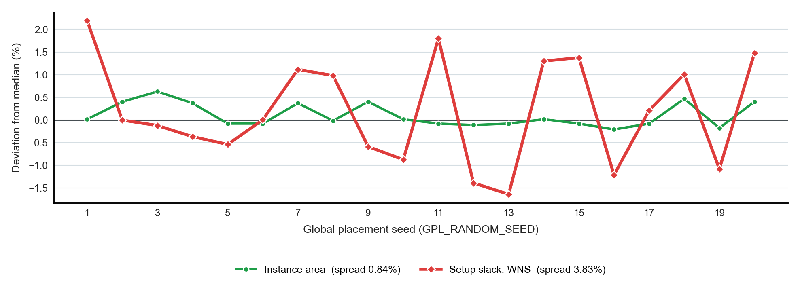

```{=html}
<style>
/* Clean Academic Data Page Styling */
.data-hero {
  padding: 2.5rem 0 1.5rem 0;
  border-bottom: 1px solid var(--bs-border-color, #e2e8f0);
  margin-bottom: 2rem;
}
.data-lead {
  font-size: 1.15rem;
  line-height: 1.65;
  color: var(--bs-secondary-color, #475569);
  max-width: 860px;
}
.stat-grid {
  display: grid;
  grid-template-columns: repeat(auto-fit, minmax(220px, 1fr));
  gap: 1rem;
  margin: 2rem 0;
}
.stat-card {
  background: var(--bs-body-bg, #ffffff);
  border: 1px solid var(--bs-border-color, #e2e8f0);
  border-radius: 8px;
  padding: 1.25rem 1.5rem;
  transition: transform 0.15s ease, box-shadow 0.15s ease;
}
.stat-card:hover {
  transform: translateY(-2px);
  box-shadow: 0 4px 12px rgba(0, 0, 0, 0.05);
}
.stat-number {
  font-size: 2rem;
  font-weight: 700;
  font-family: var(--bs-font-monospace, monospace);
  color: #0f766e;
  line-height: 1.1;
  margin-bottom: 0.35rem;
}
.stat-label {
  font-size: 0.95rem;
  font-weight: 600;
  color: var(--bs-body-color, #1e293b);
  margin-bottom: 0.25rem;
}
.stat-desc {
  font-size: 0.8rem;
  color: var(--bs-secondary-color, #64748b);
  line-height: 1.4;
  margin: 0;
}
.exhibit-container {
  display: flex;
  flex-direction: column;
  gap: 2.5rem;
  margin: 2.5rem 0;
}
.exhibit-card {
  background: var(--bs-body-bg, #ffffff);
  border: 1px solid var(--bs-border-color, #e2e8f0);
  border-radius: 10px;
  overflow: hidden;
  box-shadow: 0 2px 8px rgba(0, 0, 0, 0.03);
}
.exhibit-header {
  padding: 1.25rem 1.5rem;
  background: rgba(248, 250, 252, 0.75);
  border-bottom: 1px solid var(--bs-border-color, #e2e8f0);
  display: flex;
  flex-wrap: wrap;
  justify-content: space-between;
  align-items: baseline;
  gap: 0.5rem;
}
.exhibit-badge {
  font-size: 0.75rem;
  font-weight: 700;
  letter-spacing: 0.05em;
  text-transform: uppercase;
  color: #0369a1;
  background: #e0f2fe;
  padding: 0.2rem 0.6rem;
  border-radius: 4px;
}
.exhibit-title {
  font-size: 1.25rem;
  font-weight: 700;
  margin: 0.5rem 0 0 0;
  color: var(--bs-body-color, #0f172a);
}
.exhibit-body {
  padding: 1.5rem;
}
.exhibit-img {
  width: 100%;
  height: auto;
  border-radius: 6px;
  border: 1px solid var(--bs-border-color, #f1f5f9);
  background: #fafafa;
}
.exhibit-finding {
  margin-top: 1.25rem;
  padding: 1rem 1.25rem;
  background: rgba(241, 245, 249, 0.6);
  border-left: 4px solid #0f766e;
  border-radius: 0 6px 6px 0;
  font-size: 0.92rem;
  line-height: 1.6;
}
.exhibit-actions {
  display: flex;
  flex-wrap: wrap;
  gap: 0.75rem;
  margin-top: 1.25rem;
  padding-top: 1rem;
  border-top: 1px solid var(--bs-border-color, #f1f5f9);
}
.btn-data {
  display: inline-flex;
  align-items: center;
  gap: 0.4rem;
  font-size: 0.82rem;
  font-weight: 600;
  padding: 0.4rem 0.85rem;
  border-radius: 6px;
  border: 1px solid var(--bs-border-color, #cbd5e1);
  background: #ffffff;
  color: #334155;
  text-decoration: none;
  transition: all 0.15s ease;
}
.btn-data:hover {
  background: #f8fafc;
  color: #0f172a;
  border-color: #94a3b8;
  text-decoration: none;
}
.btn-data-primary {
  background: #0f766e;
  color: #ffffff;
  border-color: #0f766e;
}
.btn-data-primary:hover {
  background: #115e59;
  color: #ffffff;
  border-color: #115e59;
}
</style>
```

::: {.data-hero}
This page lists the datasets behind Architecture 2.0 that we measured ourselves and can re-derive from retained raw outputs. Each exhibit links to the data, the script that produced it, and the record of how it was checked. Every number on this page was recomputed from those files on 29 September 2026.
:::

---

## Key Metrics

::: {.stat-grid}
::: {.stat-card}
::: {.stat-number}
6.7×
:::
::: {.stat-label}
RTL Source Complexity Gap
:::
::: {.stat-desc}
Median concrete syntax nodes per module, benchmark reference RTL (168) against production-oriented open RTL (1,125). Measured across 1,513 modules.
:::
:::

::: {.stat-card}
::: {.stat-number}
6.0 ps
:::
::: {.stat-label}
Placement Seed Dispersion
:::
::: {.stat-desc}
Range of worst negative setup slack, from $-159.1$ to $-153.1$\ ps, across twenty OpenROAD placement seeds on identical RTL and an identical floorplan. Instance area moves only $0.84\%$ over the same runs.
:::
:::

::: {.stat-card}
::: {.stat-number}
192 of 2,455
:::
::: {.stat-label}
Mutants Surviving the Official Compliance Suite
:::
::: {.stat-desc}
The 48 official RISC-V compliance tests killed $92.2\%$ of mutants seeded into a reference instruction-set simulator. The 192 survivors needed specification-based and symbolic-execution tests to detect (Herdt et al., ASP-DAC 2021, [Table 1](https://doi.org/10.1145/3394885.3431584)).
:::
:::
:::

---

## Measured Studies & Datasets

::: {.exhibit-container}

<!-- EXHIBIT: STUDY 02 -->
::: {.exhibit-card}
::: {.exhibit-header}
<div>
<span class="exhibit-badge">Study 02 · Static Complexity & Hierarchy</span>
<h3 class="exhibit-title">Benchmark Reference RTL vs. Production-Oriented Open RTL</h3>
</div>
<span class="text-muted font-monospace small">N=1,513 Modules</span>
:::
::: {.exhibit-body}
{.exhibit-img alt="Measured RTL source complexity and internal hierarchy across 1,513 modules"}

::: {.exhibit-finding}
**Core Takeaway:** A $6.7\times$ source-complexity gap separates AI hardware benchmark reference RTL from production-oriented open RTL. Parsing 1,513 module declarations with pyslang 11.0.0 from six pinned commits gives a module-weighted median of 168 concrete syntax nodes for VerilogEval and RTLLM against 1,125 for OpenTitan, CV32E40P, VeeR EH1, and BlackParrot. Two sensitivity checks narrow the ratio to $4.8\times$ on diagnostic-free files and $4.3\times$ under equal repository weighting. Structure separates them further: no VerilogEval module instantiates another, while 45% to 63% of production modules reach a uniquely defined local child, to a maximum internal depth of 13.
:::

::: {.exhibit-actions}
<a href="https://github.com/harvard-edge/arch2/blob/dev/data/studies/02-ast-complexity-cliff/hardware_ast_complexity_measured.csv" class="btn-data btn-data-primary" target="_blank">📊 Download CSV Dataset (N=1,513)</a>
<a href="https://github.com/harvard-edge/arch2/blob/dev/data/studies/02-ast-complexity-cliff/fig_ast_complexity_measured.pdf" class="btn-data" target="_blank">📄 Vector PDF (LaTeX)</a>
<a href="https://github.com/harvard-edge/arch2/blob/dev/data/studies/02-ast-complexity-cliff/REPRODUCE.md" class="btn-data" target="_blank">♻️ Reproduce This Measurement</a>
<a href="/notebooks/study_02_ast_complexity/" class="btn-data">▶️ Check It Yourself (runs in your browser)</a>
<a href="https://github.com/harvard-edge/arch2/tree/dev/data/studies/02-ast-complexity-cliff" class="btn-data" target="_blank">🔍 Study Documentation & Data Dictionary →</a>
:::
:::
:::

<!-- EXHIBIT: STUDY 06 -->
::: {.exhibit-card}
::: {.exhibit-header}
<div>
<span class="exhibit-badge">Study 06 · Physical Design & Stochastic EDA</span>
<h3 class="exhibit-title">Placement Seed Dispersion in OpenROAD</h3>
</div>
<span class="text-muted font-monospace small">N=20 placement runs · one design</span>
:::
::: {.exhibit-body}
{.exhibit-img alt="Deviation from median across twenty OpenROAD placement seeds, for instance area and setup slack"}

::: {.exhibit-finding}
**Core Takeaway:** Twenty runs of GCD on Nangate45 through a digest-pinned OpenROAD container, identical RTL and identical floorplan, varying only `GPL_RANDOM_SEED`. Instance area moves $0.84\%$. Worst negative setup slack after detailed placement ranges from $-159.1$ to $-153.1$\ ps, a spread of 6.0\ ps on a median of $-156.5$\ ps. A single-run timing improvement smaller than 6\ ps on this design has not been shown to exceed seed noise. **Claim boundary: one design, twenty seeds, placement stage only.** The full flow fails at clock-tree synthesis under ARM emulation and that failure is retained in the raw receipts.
:::

::: {.exhibit-actions}
<a href="https://github.com/harvard-edge/arch2/blob/dev/data/studies/06-eda-seed-dispersion/openroad_gcd_placement_seed_pilot.csv" class="btn-data btn-data-primary" target="_blank">📊 Measured Dataset (CSV)</a>
<a href="https://github.com/harvard-edge/arch2/blob/dev/data/studies/06-eda-seed-dispersion/openroad_gcd_placement_seed_pilot_summary.json" class="btn-data" target="_blank">📄 Run Summary (JSON)</a>
<a href="/notebooks/study_06_placement_seed_dispersion/" class="btn-data">▶️ Check It Yourself (runs in your browser)</a>
<a href="https://github.com/harvard-edge/arch2/tree/dev/data/studies/06-eda-seed-dispersion" class="btn-data" target="_blank">🔍 Study Documentation & Data Dictionary →</a>
:::
:::
:::

:::

---

## What Was Removed

Earlier versions of this page showed five further exhibits: processor errata by subsystem, an MLPerf fixed-silicon software dividend with kernel line counts, Tiny Tapeout participation and fabrication cost, a hardware CVE mitigation tax, and foundry wafer cost with corporate R&D. On 29 September 2026 each was checked value by value against its primary sources. Their headline numbers were either contradicted by those sources or typed into the generating scripts rather than measured, so the exhibits, their datasets, and their figures were deleted.

---

## Reproduction

```bash
# Study 02: re-parse the pinned corpora and redraw the figure
python3 data/scrapers/mine_hardware_ast_complexity_real.py
python3 data/studies/02-ast-complexity-cliff/plot_ast_complexity_measured.py

# Study 06: needs Docker, about 20 minutes
python3 data/scrapers/run_openroad_gcd_placement_seed_pilot.py
python3 data/studies/06-eda-seed-dispersion/plot_placement_seed_pilot.py
```

---

## Citation

```bibtex
@book{reddi2026architecture2,
  author    = {Vijay Janapa Reddi},
  title     = {Architecture 2.0: Principles of AI-Native System and Chip Design},
  year      = {2026},
  url       = {https://arch2.mlsysbook.ai}
}
```

> Vijay Janapa Reddi. *Architecture 2.0: Principles of AI-Native System and Chip Design* (2026). Available at: `https://arch2.mlsysbook.ai`
