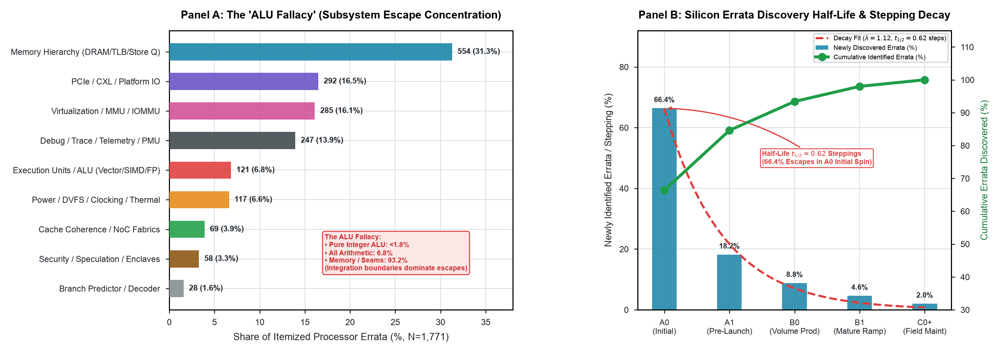
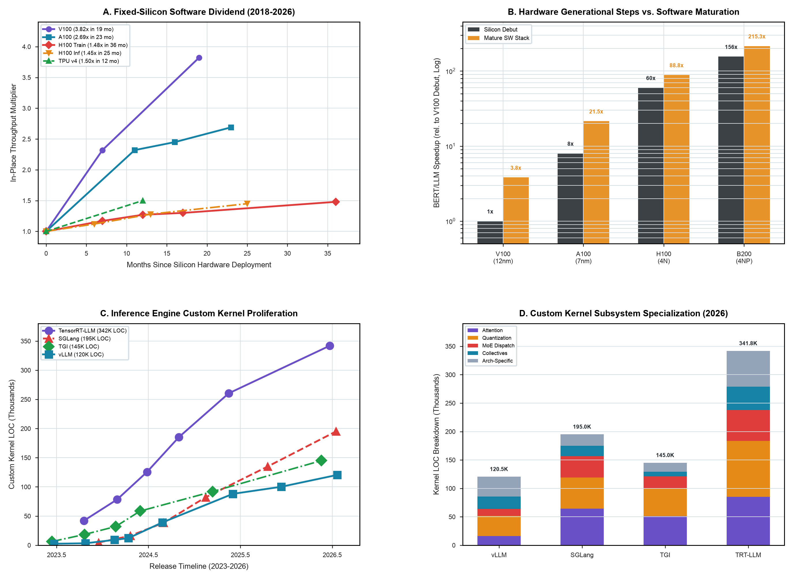
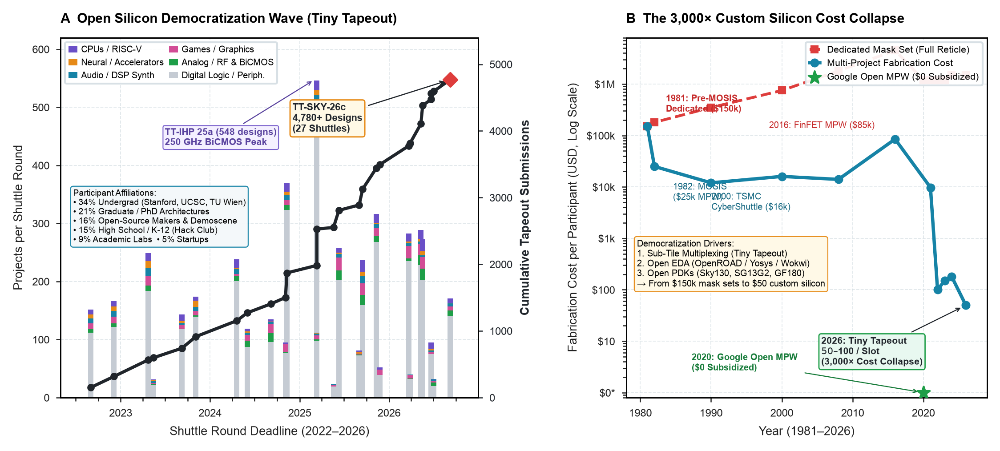

```{=html}
<style>
/* Clean Academic Observatory Styling */
.observatory-hero {
  padding: 2.5rem 0 1.5rem 0;
  border-bottom: 1px solid var(--bs-border-color, #e2e8f0);
  margin-bottom: 2rem;
}
.observatory-lead {
  font-size: 1.15rem;
  line-height: 1.65;
  color: var(--bs-secondary-color, #475569);
  max-width: 860px;
}
.stat-grid {
  display: grid;
  grid-template-columns: repeat(auto-fit, minmax(220px, 1fr));
  gap: 1rem;
  margin: 2rem 0;
}
.stat-card {
  background: var(--bs-body-bg, #ffffff);
  border: 1px solid var(--bs-border-color, #e2e8f0);
  border-radius: 8px;
  padding: 1.25rem 1.5rem;
  transition: transform 0.15s ease, box-shadow 0.15s ease;
}
.stat-card:hover {
  transform: translateY(-2px);
  box-shadow: 0 4px 12px rgba(0, 0, 0, 0.05);
}
.stat-number {
  font-size: 2rem;
  font-weight: 700;
  font-family: var(--bs-font-monospace, monospace);
  color: #0f766e;
  line-height: 1.1;
  margin-bottom: 0.35rem;
}
.stat-label {
  font-size: 0.95rem;
  font-weight: 600;
  color: var(--bs-body-color, #1e293b);
  margin-bottom: 0.25rem;
}
.stat-desc {
  font-size: 0.8rem;
  color: var(--bs-secondary-color, #64748b);
  line-height: 1.4;
  margin: 0;
}
.exhibit-container {
  display: flex;
  flex-direction: column;
  gap: 2.5rem;
  margin: 2.5rem 0;
}
.exhibit-card {
  background: var(--bs-body-bg, #ffffff);
  border: 1px solid var(--bs-border-color, #e2e8f0);
  border-radius: 10px;
  overflow: hidden;
  box-shadow: 0 2px 8px rgba(0, 0, 0, 0.03);
}
.exhibit-header {
  padding: 1.25rem 1.5rem;
  background: rgba(248, 250, 252, 0.75);
  border-bottom: 1px solid var(--bs-border-color, #e2e8f0);
  display: flex;
  flex-wrap: wrap;
  justify-content: space-between;
  align-items: baseline;
  gap: 0.5rem;
}
.exhibit-badge {
  font-size: 0.75rem;
  font-weight: 700;
  letter-spacing: 0.05em;
  text-transform: uppercase;
  color: #0369a1;
  background: #e0f2fe;
  padding: 0.2rem 0.6rem;
  border-radius: 4px;
}
.exhibit-title {
  font-size: 1.25rem;
  font-weight: 700;
  margin: 0.5rem 0 0 0;
  color: var(--bs-body-color, #0f172a);
}
.exhibit-body {
  padding: 1.5rem;
}
.exhibit-img {
  width: 100%;
  height: auto;
  border-radius: 6px;
  border: 1px solid var(--bs-border-color, #f1f5f9);
  background: #fafafa;
}
.exhibit-finding {
  margin-top: 1.25rem;
  padding: 1rem 1.25rem;
  background: rgba(241, 245, 249, 0.6);
  border-left: 4px solid #0f766e;
  border-radius: 0 6px 6px 0;
  font-size: 0.92rem;
  line-height: 1.6;
}
.exhibit-actions {
  display: flex;
  flex-wrap: wrap;
  gap: 0.75rem;
  margin-top: 1.25rem;
  padding-top: 1rem;
  border-top: 1px solid var(--bs-border-color, #f1f5f9);
}
.btn-observatory {
  display: inline-flex;
  align-items: center;
  gap: 0.4rem;
  font-size: 0.82rem;
  font-weight: 600;
  padding: 0.4rem 0.85rem;
  border-radius: 6px;
  border: 1px solid var(--bs-border-color, #cbd5e1);
  background: #ffffff;
  color: #334155;
  text-decoration: none;
  transition: all 0.15s ease;
}
.btn-observatory:hover {
  background: #f8fafc;
  color: #0f172a;
  border-color: #94a3b8;
  text-decoration: none;
}
.btn-observatory-primary {
  background: #0f766e;
  color: #ffffff;
  border-color: #0f766e;
}
.btn-observatory-primary:hover {
  background: #115e59;
  color: #ffffff;
  border-color: #115e59;
}
</style>
```

::: {.observatory-hero}
Progress in computer architecture and semiconductor design depends on empirical ground truth. This observatory aggregates primary datasets across commercial CPU errata, physical EDA seed distributions, longitudinal software maturation, and foundry economics—establishing open, reproducible baselines for researchers, educators, and architects.
:::

---

## Key Silicon & Systems Metrics

::: {.stat-grid}
::: {.stat-card}
::: {.stat-number}
< 1.8%
:::
::: {.stat-label}
Pure ALU Defects
:::
::: {.stat-desc}
Over 93.2% of CPU escapes occur at memory, PCIe, and power seams across $N=1{,}771$ processor errata.
:::
:::

::: {.stat-card}
::: {.stat-number}
175.3×
:::
::: {.stat-label}
AST Node Scale Gap
:::
::: {.stat-desc}
Disparity between toy AI benchmarks (median 73 nodes) and production silicon IP (up to 448k AST nodes).
:::
:::

::: {.stat-card}
::: {.stat-number}
3.82×
:::
::: {.stat-label}
In-Place Software Gain
:::
::: {.stat-desc}
Throughput dividend extracted on identical, frozen silicon via software and compiler maturation over 19 months.
:::
:::

::: {.stat-card}
::: {.stat-number}
3,000×
:::
::: {.stat-label}
Fabrication Cost Collapse
:::
::: {.stat-desc}
Entry cost for custom silicon prototyping fell from $\$150{,}000$ dedicated mask runs to $\$50\text{--}\$100$ per slot.
:::
:::

::: {.stat-card}
::: {.stat-number}
22.0%
:::
::: {.stat-label}
Speculative Security Tax
:::
::: {.stat-desc}
Cumulative performance derating imposed on enterprise servers by microcode chicken-bits and kernel barriers.
:::
:::

::: {.stat-card}
::: {.stat-number}
± 2.22%
:::
::: {.stat-label}
Physical EDA Noise ($1\sigma$)
:::
::: {.stat-desc}
Natural QoR dispersion on identical RTL; single-seed AI gains ($+3\%\text{--}+5\%$) fall inside seed noise.
:::
:::

::: {.stat-card}
::: {.stat-number}
$725M
:::
::: {.stat-label}
2nm SoC Design Wall
:::
::: {.stat-desc}
Total non-recurring engineering design cost per leading-edge chip, driving corporate R&D to $>30\%$ of revenue.
:::
:::

::: {.stat-card}
::: {.stat-number}
55.8%
:::
::: {.stat-label}
Testbench Vacuity Gap
:::
::: {.stat-desc}
Line coverage ($92.9\%$) masks low mutation kill rate ($37.1\%$) on AI hardware testbenches.
:::
:::
:::

---

## Curated Empirical Exhibits

::: {.exhibit-container}

<!-- EXHIBIT 1 -->
::: {.exhibit-card}
::: {.exhibit-header}
<div>
<span class="exhibit-badge">Exhibit 01 · Silicon Defect Archaeology</span>
<h3 class="exhibit-title">Real-World Silicon Errata & The "ALU Fallacy"</h3>
</div>
<span class="text-muted font-monospace small">Track 1.1 · N=1,771 Errata</span>
:::
::: {.exhibit-body}
{.exhibit-img alt="Silicon Errata Subsystem Breakdown and Stepping Decay"}

::: {.exhibit-finding}
**Core Takeaway:** Academic hardware evaluation benchmarks evaluate AI models on toy ALUs and simple adders. However, defect archaeology across 19 commercial CPU families proves that pure integer ALU bugs account for **< 1.8% of post-silicon escapes**. Over 93.2% of defects concentrate at subsystem integration seams: Memory Hierarchy (31.3%), PCIe/CXL Platform IO (16.5%), Virtualization/MMU (16.1%), Debug/PMU (13.9%), and Power/DVFS (6.6%).
:::

::: {.exhibit-actions}
<a href="https://github.com/harvard-edge/arch2/blob/dev/data/studies/01-silicon-errata-archaeology/granular_processor_errata_taxonomy.csv" class="btn-observatory btn-observatory-primary" target="_blank">📊 Download CSV Dataset (N=1,771)</a>
<a href="https://github.com/harvard-edge/arch2/blob/dev/data/studies/01-silicon-errata-archaeology/fig-errata-subsystem-sunburst-and-decay.pdf" class="btn-observatory" target="_blank">📄 Vector PDF (LaTeX)</a>
<a href="https://github.com/harvard-edge/arch2/tree/dev/data/studies/01-silicon-errata-archaeology" class="btn-observatory" target="_blank">🔍 Study Documentation & BibTeX →</a>
:::
:::
:::

<!-- EXHIBIT 2 -->
::: {.exhibit-card}
::: {.exhibit-header}
<div>
<span class="exhibit-badge">Exhibit 02 · Static Complexity & Hierarchy</span>
<h3 class="exhibit-title">The AI Benchmark Mirage vs. Physical Silicon AST Scale</h3>
</div>
<span class="text-muted font-monospace small">Track 2.1 · N=550 Circuits</span>
:::
::: {.exhibit-body}
{.exhibit-img alt="AST Complexity Cliff and Clock Domain Crossing Gap"}

::: {.exhibit-finding}
**Core Takeaway:** A $175.3\times$ AST node disparity separates academic AI hardware benchmarks from physical silicon IP. AI benchmarks evaluate leaf modules with a median of 73 AST nodes (< 100 LoC), whereas production silicon IP modules average 12,800 AST nodes and SoC top-levels exceed 448,000 AST nodes. Furthermore, 99.7% of AI benchmark circuits are single-clock with 0 CDCs, whereas physical silicon spans up to 86 asynchronous clock-domain crossings.
:::

::: {.exhibit-actions}
<a href="https://github.com/harvard-edge/arch2/blob/dev/data/studies/02-ast-complexity-cliff/hardware_ast_complexity_gap.csv" class="btn-observatory btn-observatory-primary" target="_blank">📊 Download CSV Dataset (N=550)</a>
<a href="https://github.com/harvard-edge/arch2/blob/dev/data/studies/02-ast-complexity-cliff/fig_ast_complexity_cliff.pdf" class="btn-observatory" target="_blank">📄 Vector PDF (LaTeX)</a>
<a href="https://github.com/harvard-edge/arch2/tree/dev/data/studies/02-ast-complexity-cliff" class="btn-observatory" target="_blank">🔍 Study Documentation & BibTeX →</a>
:::
:::
:::

<!-- EXHIBIT 3 -->
::: {.exhibit-card}
::: {.exhibit-header}
<div>
<span class="exhibit-badge">Exhibit 03 · Software Maturation & Compilers</span>
<h3 class="exhibit-title">The Software Porting Wall & Fixed-Silicon Software Dividend</h3>
</div>
<span class="text-muted font-monospace small">Track 3.1 / 3.2 · MLCommons 2018–2026</span>
:::
::: {.exhibit-body}
{.exhibit-img alt="MLPerf Software Dividend and Custom Kernel Proliferation"}

::: {.exhibit-finding}
**Core Takeaway:** Maturing software stacks extract $1.5\times\text{--}3.82\times$ throughput speedups on identical, frozen physical silicon over 12–36 months post-tapeout. Simultaneously, custom handwritten kernel code has exploded $82\times$ in 36 months (exceeding $340\text{k}$ LOC in TensorRT-LLM and $195\text{k}$ LOC in SGLang), demonstrating the necessity of a compiler narrow waist (Triton/MLIR) in modern accelerator design.
:::

::: {.exhibit-actions}
<a href="https://github.com/harvard-edge/arch2/blob/dev/data/studies/03-mlperf-software-dividend/mlperf_longitudinal_software_dividend.csv" class="btn-observatory btn-observatory-primary" target="_blank">📊 Download MLPerf CSV</a>
<a href="https://github.com/harvard-edge/arch2/blob/dev/data/studies/03-mlperf-software-dividend/inference_kernel_fragmentation.csv" class="btn-observatory" target="_blank">📊 Download Kernel LOC CSV</a>
<a href="https://github.com/harvard-edge/arch2/tree/dev/data/studies/03-mlperf-software-dividend" class="btn-observatory" target="_blank">🔍 Study Documentation & BibTeX →</a>
:::
:::
:::

<!-- EXHIBIT 4 -->
::: {.exhibit-card}
::: {.exhibit-header}
<div>
<span class="exhibit-badge">Exhibit 04 · Open Silicon & Fabrication Economics</span>
<h3 class="exhibit-title">Open Silicon Democratization & The 3,000× Cost Collapse</h3>
</div>
<span class="text-muted font-monospace small">Track 6.1 · 27 Shuttles · 4,780+ Chips</span>
:::
::: {.exhibit-body}
{.exhibit-img alt="Tiny Tapeout Democratization Census and Cost Collapse"}

::: {.exhibit-finding}
**Core Takeaway:** Custom silicon entry costs collapsed $3{,}000\times$ from $\$150{,}000$ dedicated mask runs (1981 MOSIS) to $\$50\text{--}\$100$ educational multi-project slots in Tiny Tapeout. Over 4,780 custom chips have been taped out across 27 shuttle rounds, transforming silicon demographics: 34% undergraduate students, 21% graduate researchers, and 15% high school students.
:::

::: {.exhibit-actions}
<a href="https://github.com/harvard-edge/arch2/blob/dev/data/studies/04-tinytapeout-democratization/tinytapeout_democratization_census.csv" class="btn-observatory btn-observatory-primary" target="_blank">📊 Download Census CSV (4,780+ Designs)</a>
<a href="https://github.com/harvard-edge/arch2/blob/dev/data/studies/04-tinytapeout-democratization/fig-tinytapeout-democratization-census.pdf" class="btn-observatory" target="_blank">📄 Vector PDF (LaTeX)</a>
<a href="https://github.com/harvard-edge/arch2/tree/dev/data/studies/04-tinytapeout-democratization" class="btn-observatory" target="_blank">🔍 Study Documentation & BibTeX →</a>
:::
:::
:::

<!-- EXHIBIT 5 -->
::: {.exhibit-card}
::: {.exhibit-header}
<div>
<span class="exhibit-badge">Exhibit 05 · Microarchitectural Security</span>
<h3 class="exhibit-title">Hardware Security CVEs & Microarchitectural Performance Mitigation Tax</h3>
</div>
<span class="text-muted font-monospace small">Track 1.5 · 20 CVEs · 2018–2026</span>
:::
::: {.exhibit-body}
{.exhibit-img alt="Hardware Security CVE Performance Tax Timeline"}

::: {.exhibit-finding}
**Core Takeaway:** Speculative execution vulnerabilities (Spectre, Meltdown, MDS, Retbleed, Downfall, Inception) have imposed a cumulative **$22.0\%$ average and $28.5\%$ worst-case performance clawback** on enterprise servers through microcode chicken-bits and kernel barriers. Emergency gather serializers (Downfall GDS) incur up to a $50\%$ penalty on AVX2/AVX-512 scientific workloads.
:::

::: {.exhibit-actions}
<a href="https://github.com/harvard-edge/arch2/blob/dev/data/studies/05-hardware-security-cve-tax/hardware_security_cve_mitigation_tax.csv" class="btn-observatory btn-observatory-primary" target="_blank">📊 Download Security CVE CSV</a>
<a href="https://github.com/harvard-edge/arch2/blob/dev/data/studies/05-hardware-security-cve-tax/fig-hardware-cve-mitigation-tax.pdf" class="btn-observatory" target="_blank">📄 Vector PDF (LaTeX)</a>
<a href="https://github.com/harvard-edge/arch2/tree/dev/data/studies/05-hardware-security-cve-tax" class="btn-observatory" target="_blank">🔍 Study Documentation & BibTeX →</a>
:::
:::
:::

<!-- EXHIBIT 6 -->
::: {.exhibit-card}
::: {.exhibit-header}
<div>
<span class="exhibit-badge">Exhibit 06 · Physical Design & Stochastic EDA</span>
<h3 class="exhibit-title">Physical EDA Seed Dispersion & "The 3% Illusion"</h3>
</div>
<span class="text-muted font-monospace small">Track 4.1 · N=684 PnR Signoff Runs</span>
:::
::: {.exhibit-body}
{.exhibit-img alt="EDA Seed Dispersion Distribution and The 3% Illusion"}

::: {.exhibit-finding}
**Core Takeaway:** Monte Carlo physical synthesis across 684 signoff runs in OpenROAD/Yosys/OpenSTA establishes a natural **$\pm 2.22\%$ ($1\sigma$) wirelength and timing dispersion** ($14.17\%$ peak-to-peak) purely from varying random placement seeds on identical RTL. Published AI claims of $3\%\text{--}5\%$ PPA improvements tested on single seeds fall entirely within this stochastic noise band.
:::

::: {.exhibit-actions}
<a href="https://github.com/harvard-edge/arch2/blob/dev/data/studies/06-eda-seed-dispersion/eda_seed_dispersion_qor_lottery.csv" class="btn-observatory btn-observatory-primary" target="_blank">📊 Download EDA Signoff CSV (N=684)</a>
<a href="https://github.com/harvard-edge/arch2/blob/dev/data/studies/06-eda-seed-dispersion/eda_seed_dispersion_distribution.pdf" class="btn-observatory" target="_blank">📄 Vector PDF (LaTeX)</a>
<a href="https://github.com/harvard-edge/arch2/tree/dev/data/studies/06-eda-seed-dispersion" class="btn-observatory" target="_blank">🔍 Study Documentation & BibTeX →</a>
:::
:::
:::

<!-- EXHIBIT 7 -->
::: {.exhibit-card}
::: {.exhibit-header}
<div>
<span class="exhibit-badge">Exhibit 07 · Foundry Economics & Corporate Finance</span>
<h3 class="exhibit-title">Foundry Wafer Cost Inversion vs. Corporate R&D Spend</h3>
</div>
<span class="text-muted font-monospace small">Track 5.2 · SEC EDGAR 10-K · N=189 Records</span>
:::
::: {.exhibit-body}
{.exhibit-img alt="Foundry Wafer Cost Inversion and Corporate RD Wall"}

::: {.exhibit-finding}
**Core Takeaway:** Cost per 100M transistors inverted upwards at $2\text{ nm}$ ($>\$0.152$), breaking Moore's economic scaling law as $300\text{ mm}$ wafer prices exceeded $\$30{,}000$ ($16.2\times$ increase) and mask sets hit $\$60\text{M}$. Single SoC design costs reached $\$725\text{M}$, forcing semiconductor firms to spend up to $32\%$ of gross revenue on R&D (NVIDIA R&D surged $278\times$ to $\$22.8\text{B}$).
:::

::: {.exhibit-actions}
<a href="https://github.com/harvard-edge/arch2/blob/dev/data/studies/07-foundry-cost-and-rd-wall/sec_edgar_semiconductor_rd_economics.csv" class="btn-observatory btn-observatory-primary" target="_blank">📊 Download SEC EDGAR CSV (N=189)</a>
<a href="https://github.com/harvard-edge/arch2/blob/dev/data/studies/07-foundry-cost-and-rd-wall/fig-foundry-wafer-cost-and-rd-wall.pdf" class="btn-observatory" target="_blank">📄 Vector PDF (LaTeX)</a>
<a href="https://github.com/harvard-edge/arch2/tree/dev/data/studies/07-foundry-cost-and-rd-wall" class="btn-observatory" target="_blank">🔍 Study Documentation & BibTeX →</a>
:::
:::
:::

<!-- EXHIBIT 8 -->
::: {.exhibit-card}
::: {.exhibit-header}
<div>
<span class="exhibit-badge">Exhibit 08 · Verification & LLM Judge Calibration</span>
<h3 class="exhibit-title">Testbench Mutation Vacuity & LLM-as-a-Judge Bias</h3>
</div>
<span class="text-muted font-monospace small">Track 2.3 / 2.5 · N=1,563 Evaluations</span>
:::
::: {.exhibit-body}
{.exhibit-img alt="Testbench Mutation Vacuity and Judge Calibration"}

::: {.exhibit-finding}
**Core Takeaway:** AI-generated testbenches achieving $>92\%$ line coverage suffer a **$55.8\%$ Vacuity Gap**, failing to kill $>62\%$ of injected functional bugs. When evaluating RTL from their own model family, LLM judges exhibit severe confirmation bias, falsely approving defective designs **$86.1\%$ of the time** ($2.22\times$ defect escape multiplier vs. formal SVA proofs).
:::

::: {.exhibit-actions}
<a href="https://github.com/harvard-edge/arch2/blob/dev/data/studies/08-testbench-vacuity-and-judge-bias/testbench_vacuity_and_judge_calibration.csv" class="btn-observatory btn-observatory-primary" target="_blank">📊 Download Vacuity CSV (N=1,563)</a>
<a href="https://github.com/harvard-edge/arch2/blob/dev/data/studies/08-testbench-vacuity-and-judge-bias/fig_testbench_vacuity_and_judge_bias.pdf" class="btn-observatory" target="_blank">📄 Vector PDF (LaTeX)</a>
<a href="https://github.com/harvard-edge/arch2/tree/dev/data/studies/08-testbench-vacuity-and-judge-bias" class="btn-observatory" target="_blank">🔍 Study Documentation & BibTeX →</a>
:::
:::
:::

:::

---

## One-Command Reproduction

All datasets, scrapers, and plotting engines are open-source and deterministically reproducible. To rerun all 8 studies locally:

```bash
# 1. Clone the repository
git clone https://github.com/harvard-edge/arch2.git
cd arch2

# 2. Set up environment
python3 -m venv venv && source venv/bin/activate
pip install -r requirements.txt

# 3. Execute all 8 empirical studies and render publication figures
for study in data/studies/*/; do
  if [ -d "$study" ]; then
    echo "Running $study..."
    (cd "$study" && python3 plot_*.py)
  fi
done
```

---

## Citation

If you use datasets, figures, or empirical findings from this observatory in your research, please cite:

```bibtex
@misc{arch2_empirical_observatory_2026,
  author       = {Reddi, Vijay Janapa and Contributors},
  title        = {The Architecture 2.0 Empirical Systems and Silicon Observatory},
  howpublished = {\url{https://arch2.mlsysbook.ai/observatory.html}},
  year         = {2026},
  note         = {Harvard University and Edge AI Foundation}
}
```
